# Registro

**Relatório:** #1  
**Projeto:** `relatorio_rebuild_gckpm0qi`  
**Gerado em:** 2026-05-15T09:40:48  
**Modelo de relatório:** 11  
**Autor:** Leon Cunha Alvaro Lopez Soto

## 1. Visão geral

- **Pastas:** 37
- **Arquivos:** 608
- **Arquivos de texto:** 89
- **Peso dos arquivos de texto:** 206.16 KB
- **Tamanho total:** 0.094 GB (100.865.188 bytes)
- **Dias desde a criação do projeto:** 1
- **Dias desde a criação oficial:** 275
- **Horas estimadas:** 35.50
- **Linhas totais gerais:** 5.994
- **Commits (projeto):** 30

## 2. Python

- **Arquivos `.py`:** 81
- **Linhas totais:** 5.994
- **Tamanho total `.py`:** 206.16 KB
- **Classes encontradas:** 15
- **Funções encontradas:** 202
- **Métodos encontrados:** 84
- **Total funções + métodos:** 286
- **Bibliotecas diferentes usadas:** 23

## 3. Macro áreas

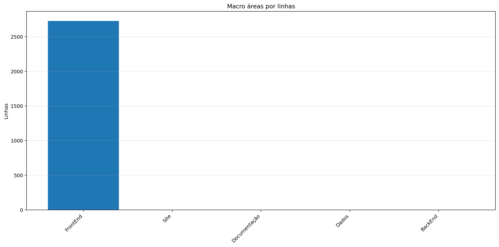


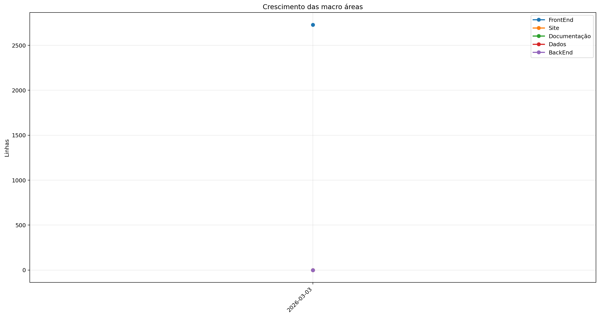

| Rank | Área | Caminho | Subpastas | Arquivos | Linhas gerais | Tamanho (KB) |
|---:|---|---|---:|---:|---:|---:|
| 1 | `FrontEnd` | `Codigo + Game.py` | 9 | 65 | 2.729 | 87.61 |
| 2 | `Site` | `Site/src` | 0 | 0 | 0 | 0.00 |
| 3 | `Documentação` | `Documentação` | 0 | 0 | 0 | 0.00 |
| 4 | `Dados` | `Dados` | 0 | 2 | 0 | 0.00 |
| 5 | `BackEnd` | `Servidor + ServidorGeral` | 0 | 0 | 0 | 0.00 |

## 4. Principais pastas

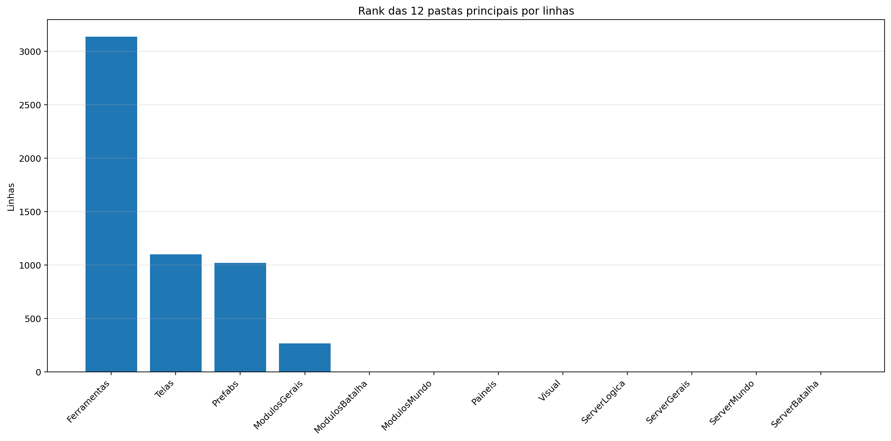

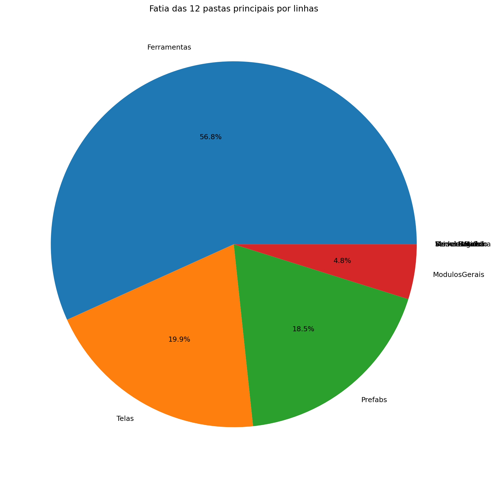

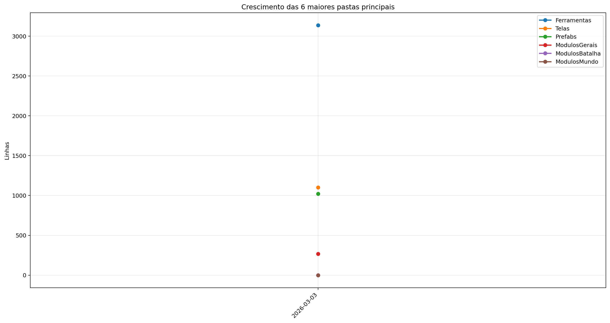


| Rank | Pasta | Subpastas | Arquivos | Linhas gerais | Tamanho (KB) |
|---:|---|---:|---:|---:|---:|
| 1 | `Ferramentas` | 0 | 5 | 3.138 | 114.27 |
| 2 | `Telas` | 1 | 14 | 1.101 | 34.69 |
| 3 | `Prefabs` | 0 | 10 | 1.021 | 35.31 |
| 4 | `ModulosGerais` | 0 | 11 | 268 | 7.51 |
| 5 | `ModulosBatalha` | 0 | 0 | 0 | 0.00 |
| 6 | `ModulosMundo` | 0 | 11 | 0 | 0.00 |
| 7 | `Paineis` | 0 | 7 | 0 | 0.00 |
| 8 | `Visual` | 0 | 0 | 0 | 0.00 |
| 9 | `ServerLogica` | 0 | 0 | 0 | 0.00 |
| 10 | `ServerGerais` | 0 | 0 | 0 | 0.00 |
| 11 | `ServerMundo` | 0 | 0 | 0 | 0.00 |
| 12 | `ServerBatalha` | 0 | 0 | 0 | 0.00 |

## 5. Arquitetura

### `Codigo/`

```text
Codigo/
├── Cenas/
│   ├── CenaCarregamento.py
│   ├── CenaCombate.py
│   ├── CenaLogin.py
│   ├── CenaMenu.py
│   ├── CenaMundo.py
│   ├── CenaPreBatalha.py
│   └── ControladorCenas.py
├── Geradores/
│   ├── Baus.py
│   ├── Camera.py
│   ├── Dungeon.py
│   ├── Estadio.py
│   ├── EstruturaNaturais.py
│   ├── LeitorMundo.py
│   ├── Loja.py
│   ├── NPC.py
│   ├── Player.py
│   ├── PokemonCombate.py
│   └── PokemonMundo.py
├── Localidades/
│   ├── Bot.py
│   ├── Combate.py
│   ├── GeradorMundo.py
│   └── GeradorPokemon.py
├── Modulos/
│   ├── Carregamento.py
│   ├── Comandos.py
│   ├── Discord.py
│   ├── EfeitosTela.py
│   ├── FisicaCombate.py
│   ├── SistemaCombate.py
│   └── Sonoridades.py
├── Paineis/
│   ├── BotaoServer.py
│   ├── FichaItem.py
│   ├── FichaPokemon.py
│   ├── FichaPokemonCombate.py
│   ├── Musicdex.py
│   ├── Pokedex.py
│   └── Skindex.py
├── Prefabs/
│   ├── Arrastavel.py
│   ├── Barra.py
│   ├── Botao.py
│   ├── CaixaTexto.py
│   ├── EfeitosVisuais.py
│   ├── Imagem.py
│   ├── Mensagem.py
│   ├── Terminal.py
│   ├── Texto.py
│   └── Tooltip.py
├── Server/
│   ├── Login.py
│   ├── ServerCombate.py
│   ├── ServerMenu.py
│   └── ServerMundo.py
└── Telas/
    ├── Inventario/
    │   ├── Estatisticas.py
    │   ├── Itens.py
    │   ├── Pokemons.py
    │   └── Unificador.py
    ├── Config.py
    ├── Creditos.py
    ├── CriarPersonagem.py
    ├── Mapa.py
    ├── Operador.py
    ├── Opções.py
    ├── TelaLogin.py
    ├── TelaMenu.py
    ├── TelaServers.py
    └── TelasGenericas.py
```

### `Server/`

```text
Servidor/
└── (pasta não encontrada)
```

### `Dados/`

```text
Dados/
├── Ataques.csv
└── Pokemons.csv
```

### `Site/`

```text
Site/
└── public/
```

### `Ferramentas/`

```text
Ferramentas/
├── AtualizadorReadMe.py
└── GeradorRelatorios.py
```

## 6. Ranks

### Top 50 maiores arquivos `.py` por linhas

| Arquivo | Linhas | Tamanho (KB) |
|---|---:|---:|
| `Ferramentas/GeradorRelatorios.py` | 2.117 | 80.24 |
| `Ferramentas/AtualizadorReadMe.py` | 461 | 16.37 |
| `Codigo/Prefabs/Botao.py` | 432 | 14.71 |
| `Outros/GeradorRelatorios.py` | 418 | 13.08 |
| `Codigo/Telas/TelaServers.py` | 340 | 10.43 |
| `Codigo/Telas/Config.py` | 250 | 7.98 |
| `Codigo/Prefabs/Texto.py` | 235 | 8.08 |
| `Codigo/Telas/TelasGenericas.py` | 205 | 6.96 |
| `Codigo/Modulos/Sonoridades.py` | 197 | 6.40 |
| `Codigo/Telas/TelaMenu.py` | 156 | 5.38 |
| `Codigo/Telas/TelaLogin.py` | 150 | 3.94 |
| `Outros/Mixer.py` | 141 | 4.39 |
| `Codigo/Prefabs/CaixaTexto.py` | 136 | 5.01 |
| `Codigo/Prefabs/Mensagem.py` | 125 | 4.02 |
| `Codigo/Cenas/ControladorCenas.py` | 114 | 3.50 |
| `Codigo/Modulos/EfeitosTela.py` | 98 | 2.62 |
| `Codigo/Prefabs/Barra.py` | 93 | 3.49 |
| `SimuladorServerJogo/Entrada.py` | 51 | 1.89 |
| `Game.py` | 44 | 1.07 |
| `Codigo/Server/ServerMenu.py` | 40 | 1.08 |
| `SimuladorServerGeral/Main.py` | 39 | 1.20 |
| `Codigo/Cenas/CenaMenu.py` | 34 | 0.94 |
| `SimuladorServerJogo/ServerOperar.py` | 29 | 0.99 |
| `Codigo/Server/Login.py` | 23 | 0.58 |
| `Codigo/Cenas/CenaLogin.py` | 15 | 0.38 |
| `Codigo/Cenas/CenaCarregamento.py` | 14 | 0.35 |
| `Codigo/Cenas/CenaCombate.py` | 14 | 0.34 |
| `Codigo/Cenas/CenaMundo.py` | 14 | 0.34 |
| `ServerList.py` | 8 | 0.20 |
| `Outros/ConfigFixa.py` | 1 | 0.19 |
| `Codigo/Cenas/CenaPreBatalha.py` | 0 | 0.00 |
| `Codigo/Geradores/Baus.py` | 0 | 0.00 |
| `Codigo/Geradores/Camera.py` | 0 | 0.00 |
| `Codigo/Geradores/Dungeon.py` | 0 | 0.00 |
| `Codigo/Geradores/Estadio.py` | 0 | 0.00 |
| `Codigo/Geradores/EstruturaNaturais.py` | 0 | 0.00 |
| `Codigo/Geradores/LeitorMundo.py` | 0 | 0.00 |
| `Codigo/Geradores/Loja.py` | 0 | 0.00 |
| `Codigo/Geradores/NPC.py` | 0 | 0.00 |
| `Codigo/Geradores/Player.py` | 0 | 0.00 |
| `Codigo/Geradores/PokemonCombate.py` | 0 | 0.00 |
| `Codigo/Geradores/PokemonMundo.py` | 0 | 0.00 |
| `Codigo/Localidades/Bot.py` | 0 | 0.00 |
| `Codigo/Localidades/Combate.py` | 0 | 0.00 |
| `Codigo/Localidades/GeradorMundo.py` | 0 | 0.00 |
| `Codigo/Localidades/GeradorPokemon.py` | 0 | 0.00 |
| `Codigo/Modulos/Carregamento.py` | 0 | 0.00 |
| `Codigo/Modulos/Comandos.py` | 0 | 0.00 |
| `Codigo/Modulos/Discord.py` | 0 | 0.00 |
| `Codigo/Modulos/FisicaCombate.py` | 0 | 0.00 |

### Top 20 maiores classes

| Arquivo | Classe | Linhas |
|---|---|---:|
| `Codigo/Prefabs/Botao.py` | `Botao` | 318 |
| `Codigo/Prefabs/Texto.py` | `Texto` | 229 |
| `Codigo/Prefabs/CaixaTexto.py` | `CaixaTexto` | 132 |
| `Codigo/Prefabs/Mensagem.py` | `Mensagem` | 122 |
| `Codigo/Telas/TelasGenericas.py` | `SubtelaTexto` | 112 |
| `Codigo/Cenas/ControladorCenas.py` | `ControladorCenas` | 103 |
| `Codigo/Prefabs/Barra.py` | `Barra` | 85 |
| `Codigo/Telas/TelasGenericas.py` | `SubtelaConfirmacao` | 61 |
| `Codigo/Prefabs/Botao.py` | `BotaoAlavanca` | 59 |
| `Codigo/Prefabs/Botao.py` | `BotaoSelecao` | 30 |
| `Codigo/Cenas/CenaMenu.py` | `CenaMenu` | 27 |
| `Codigo/Cenas/CenaCarregamento.py` | `CenaCarregamento` | 11 |
| `Codigo/Cenas/CenaCombate.py` | `CenaCombate` | 11 |
| `Codigo/Cenas/CenaLogin.py` | `CenaLogin` | 11 |
| `Codigo/Cenas/CenaMundo.py` | `CenaMundo` | 11 |

### Top 20 maiores funções e métodos

| Arquivo | Nome | Tipo | Linhas |
|---|---|---:|---:|
| `Ferramentas/GeradorRelatorios.py` | `coletar_metricas` | funcao | 252 |
| `Ferramentas/GeradorRelatorios.py` | `gerar_markdown` | funcao | 151 |
| `Ferramentas/GeradorRelatorios.py` | `gerar_graficos` | funcao | 146 |
| `Ferramentas/GeradorRelatorios.py` | `analisar_python_ast` | funcao | 132 |
| `Codigo/Telas/TelaMenu.py` | `TelaMenu` | funcao | 122 |
| `Codigo/Prefabs/Botao.py` | `Botao.render` | metodo | 115 |
| `Codigo/Telas/Config.py` | `_montar_layout` | funcao | 99 |
| `Ferramentas/GeradorRelatorios.py` | `main` | funcao | 97 |
| `Outros/GeradorRelatorios.py` | `coletar_metricas` | funcao | 93 |
| `Codigo/Telas/TelaServers.py` | `_montar_layout` | funcao | 84 |
| `Codigo/Prefabs/Texto.py` | `Texto._ensure_structure` | metodo | 81 |
| `Codigo/Telas/TelasGenericas.py` | `SubtelaTexto.__init__` | metodo | 81 |
| `Ferramentas/GeradorRelatorios.py` | `coletar_historico_relatorios` | funcao | 60 |
| `Codigo/Telas/TelaLogin.py` | `_montar_layout` | funcao | 57 |
| `Codigo/Prefabs/Mensagem.py` | `Mensagem.render` | metodo | 55 |
| `Outros/GeradorRelatorios.py` | `main` | funcao | 45 |
| `Codigo/Cenas/ControladorCenas.py` | `ControladorCenas.__init__` | metodo | 43 |
| `Ferramentas/GeradorRelatorios.py` | `coletar_metricas_pasta_importante` | funcao | 42 |
| `Codigo/Prefabs/Botao.py` | `Botao.__init__` | metodo | 41 |
| `Ferramentas/GeradorRelatorios.py` | `coletar_metricas_multialvo` | funcao | 41 |

### Top 10 arquivos mais importados

| Arquivo | Vezes importado |
|---|---:|
| `Codigo/Prefabs/Texto.py` | 7 |
| `Codigo/Modulos/EfeitosTela.py` | 6 |
| `Codigo/Modulos/Sonoridades.py` | 5 |
| `Codigo/Prefabs/Botao.py` | 5 |
| `Codigo/Telas/Config.py` | 2 |
| `Codigo/Telas/TelasGenericas.py` | 2 |
| `Codigo/Prefabs/CaixaTexto.py` | 2 |
| `Codigo/Cenas/ControladorCenas.py` | 1 |
| `Outros/ConfigFixa.py` | 1 |
| `Codigo/Telas/TelaLogin.py` | 1 |

### Top 10 arquivos que mais importam

| Arquivo | Arquivos internos importados | Imports totais | Linhas |
|---|---:|---:|---:|
| `Codigo/Cenas/ControladorCenas.py` | 8 | 9 | 114 |
| `Codigo/Telas/Config.py` | 5 | 7 | 250 |
| `Codigo/Telas/TelaServers.py` | 5 | 6 | 340 |
| `Codigo/Telas/TelaLogin.py` | 5 | 6 | 150 |
| `Codigo/Cenas/CenaMenu.py` | 5 | 5 | 34 |
| `Game.py` | 3 | 6 | 44 |
| `Codigo/Telas/TelasGenericas.py` | 3 | 4 | 205 |
| `Codigo/Prefabs/Botao.py` | 2 | 3 | 432 |
| `Codigo/Server/ServerMenu.py` | 2 | 3 | 40 |
| `Codigo/Cenas/CenaLogin.py` | 2 | 2 | 15 |

### Top 10 maiores arquivos por linhas

| Arquivo | Ext | Linhas |
|---|---:|---:|
| `Ferramentas/GeradorRelatorios.py` | `.py` | 2.117 |
| `Ferramentas/AtualizadorReadMe.py` | `.py` | 461 |
| `Codigo/Prefabs/Botao.py` | `.py` | 432 |
| `Outros/GeradorRelatorios.py` | `.py` | 418 |
| `Codigo/Telas/TelaServers.py` | `.py` | 340 |
| `Codigo/Telas/Config.py` | `.py` | 250 |
| `Codigo/Prefabs/Texto.py` | `.py` | 235 |
| `Codigo/Telas/TelasGenericas.py` | `.py` | 205 |
| `Codigo/Modulos/Sonoridades.py` | `.py` | 197 |
| `Codigo/Telas/TelaMenu.py` | `.py` | 156 |

## 7. Linhas por extensão

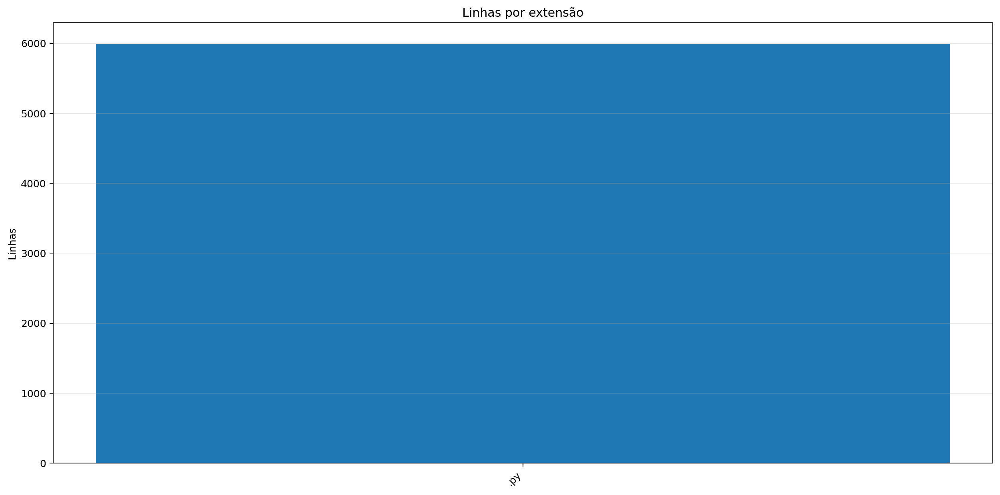


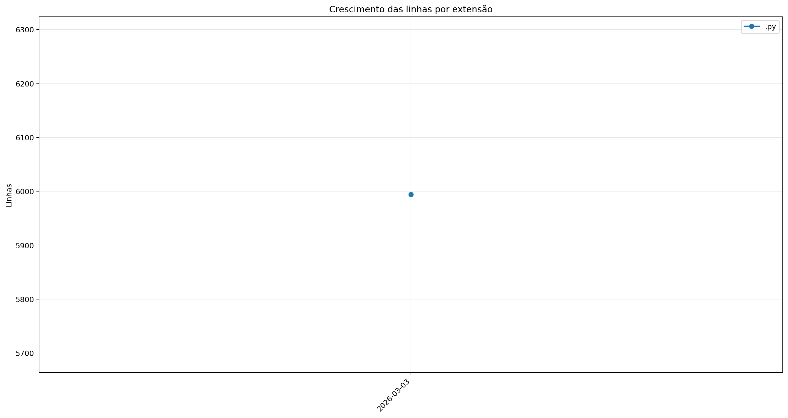

| Ext | Linhas | % das linhas | Arquivos | Peso |
|---:|---:|---:|---:|---:|
| `.py` | 5.994 | 100.00% | 81 | 206.16 KB |

## 8. Peso por extensão

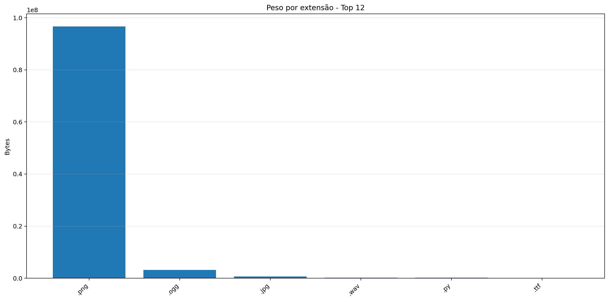


| Ext | Arquivos | Peso | % do jogo |
|---:|---:|---:|---:|
| `.png` | 514 | 92.16 MB | 95.81% |
| `.ogg` | 1 | 2.99 MB | 3.11% |
| `.jpg` | 1 | 623.44 KB | 0.63% |
| `.wav` | 2 | 208.16 KB | 0.21% |
| `.py` | 81 | 206.16 KB | 0.21% |
| `.ttf` | 1 | 26.20 KB | 0.03% |

## 9. Comparativo com o último relatório

_Sem relatório anterior compatível para montar comparativo._

### Top 3 commits por tamanho de diff

_Sem commits suficientes entre os relatórios para montar top por diff._

## 10. Gráficos de crescimento

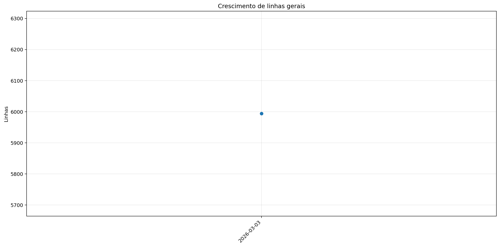

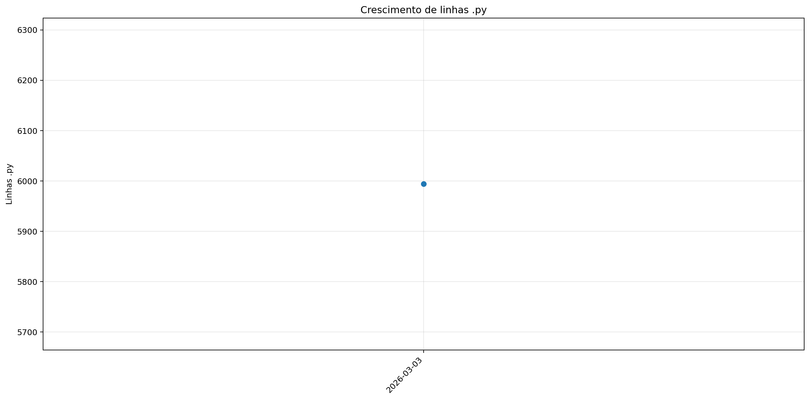

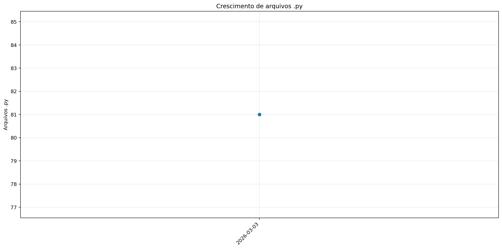


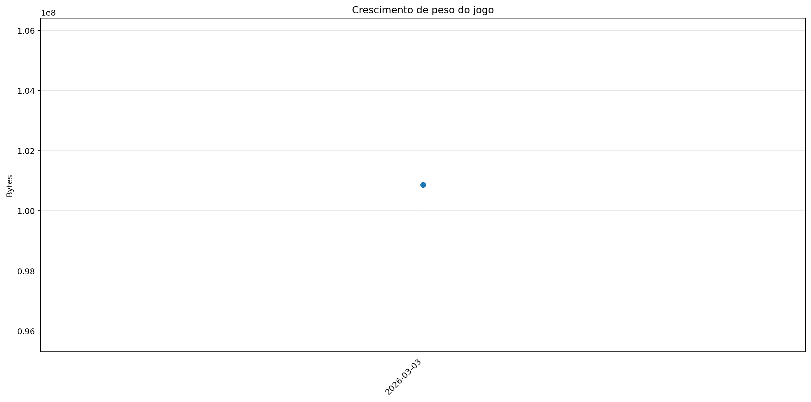


