# Registro

**Relatório:** #1  
**Projeto:** `relatorio_rebuild_64pak8gm`  
**Gerado em:** 2026-05-15T09:44:49  
**Modelo de relatório:** 11  
**Autor:** Leon Cunha Alvaro Lopez Soto

## 1. Visão geral

- **Pastas:** 1.133
- **Arquivos:** 67.953
- **Arquivos de texto:** 98
- **Peso dos arquivos de texto:** 632.68 KB
- **Tamanho total:** 0.364 GB (391.376.067 bytes)
- **Dias desde a criação do projeto:** 2
- **Dias desde a criação oficial:** 276
- **Horas estimadas:** 54.00
- **Linhas totais gerais:** 9.656
- **Commits (projeto):** 51

## 2. Python

- **Arquivos `.py`:** 91
- **Linhas totais:** 9.655
- **Tamanho total `.py`:** 331.91 KB
- **Classes encontradas:** 39
- **Funções encontradas:** 261
- **Métodos encontrados:** 230
- **Total funções + métodos:** 491
- **Bibliotecas diferentes usadas:** 27

## 3. Macro áreas

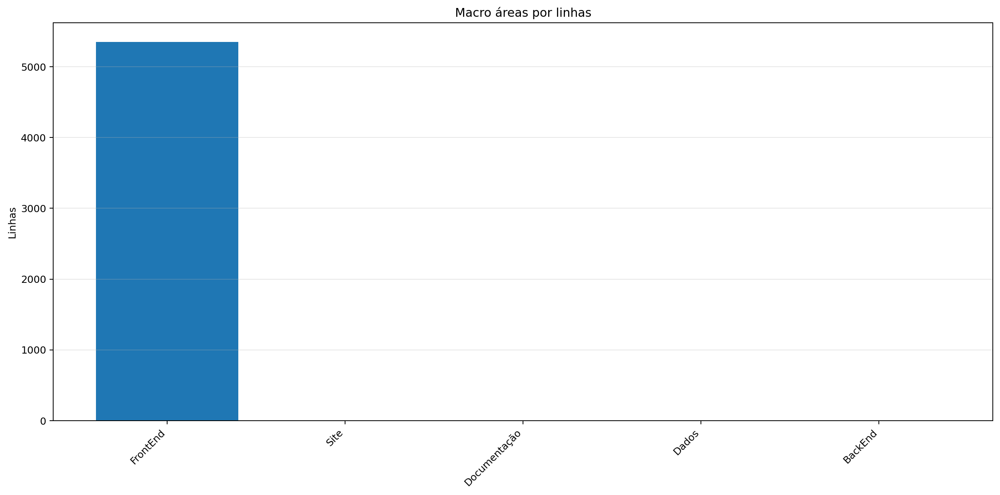


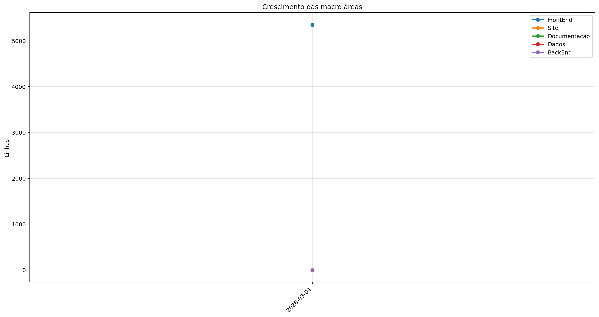

| Rank | Área | Caminho | Subpastas | Arquivos | Linhas gerais | Tamanho (KB) |
|---:|---|---|---:|---:|---:|---:|
| 1 | `FrontEnd` | `Codigo + Game.py` | 9 | 72 | 5.353 | 176.81 |
| 2 | `Site` | `Site/src` | 0 | 0 | 0 | 0.00 |
| 3 | `Documentação` | `Documentação` | 0 | 0 | 0 | 0.00 |
| 4 | `Dados` | `Dados` | 0 | 2 | 0 | 0.00 |
| 5 | `BackEnd` | `Servidor + ServidorGeral` | 0 | 0 | 0 | 0.00 |

## 4. Principais pastas

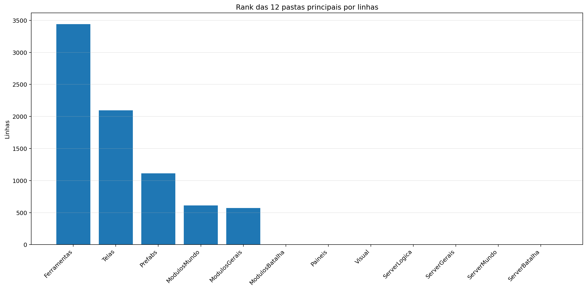

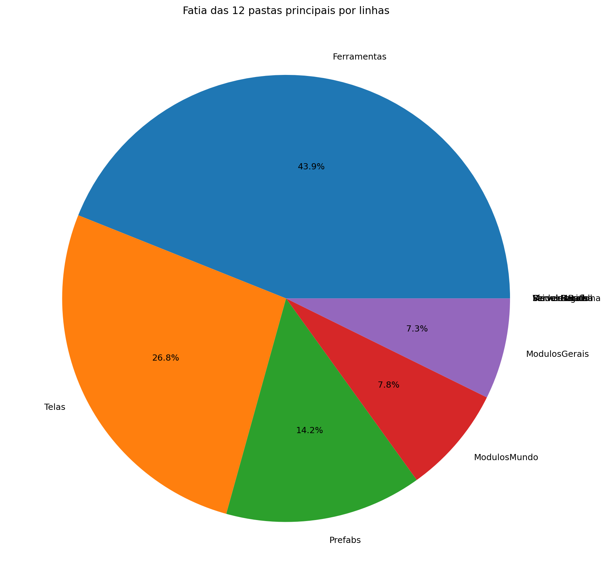

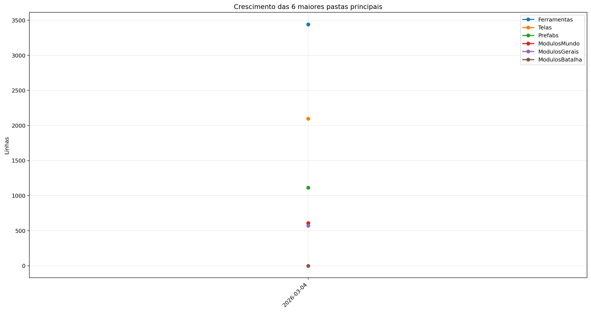

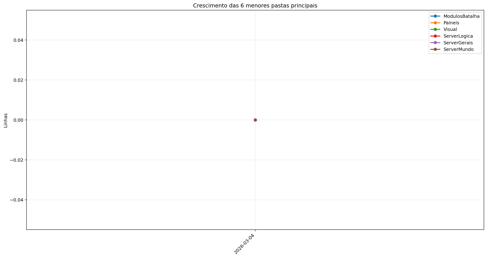

| Rank | Pasta | Subpastas | Arquivos | Linhas gerais | Tamanho (KB) |
|---:|---|---:|---:|---:|---:|
| 1 | `Ferramentas` | 0 | 5 | 3.442 | 124.74 |
| 2 | `Telas` | 1 | 14 | 2.097 | 67.99 |
| 3 | `Prefabs` | 0 | 10 | 1.114 | 39.22 |
| 4 | `ModulosMundo` | 0 | 13 | 610 | 21.20 |
| 5 | `ModulosGerais` | 0 | 10 | 572 | 18.05 |
| 6 | `ModulosBatalha` | 0 | 0 | 0 | 0.00 |
| 7 | `Paineis` | 0 | 7 | 0 | 0.00 |
| 8 | `Visual` | 0 | 0 | 0 | 0.00 |
| 9 | `ServerLogica` | 0 | 0 | 0 | 0.00 |
| 10 | `ServerGerais` | 0 | 0 | 0 | 0.00 |
| 11 | `ServerMundo` | 0 | 0 | 0 | 0.00 |
| 12 | `ServerBatalha` | 0 | 0 | 0 | 0.00 |

## 5. Arquitetura

### `Codigo/`

```text
Codigo/
├── Cenas/
│   ├── CenaCarregamento.py
│   ├── CenaCombate.py
│   ├── CenaLogin.py
│   ├── CenaMenu.py
│   ├── CenaMundo.py
│   ├── CenaPreBatalha.py
│   └── ControladorCenas.py
├── Geradores/
│   ├── Ator.py
│   ├── Baus.py
│   ├── Camera.py
│   ├── Dungeon.py
│   ├── Estadio.py
│   ├── EstruturaNaturais.py
│   ├── Fruta.py
│   ├── LeitorMundo.py
│   ├── Loja.py
│   ├── PlayerController.py
│   ├── Pokebola.py
│   ├── PokemonCombate.py
│   └── PokemonMundo.py
├── Localidades/
│   ├── Bot.py
│   ├── Combate.py
│   ├── GeradorMundo.py
│   └── GeradorPokemon.py
├── Modulos/
│   ├── Carregamento.py
│   ├── colisor.py
│   ├── Comandos.py
│   ├── DesenhaAtor.py
│   ├── Discord.py
│   ├── EfeitosTela.py
│   ├── Entidade.py
│   ├── Estrutura.py
│   ├── FisicaCombate.py
│   ├── GameObjeto.py
│   ├── Projetil.py
│   ├── SistemaCombate.py
│   └── Sonoridades.py
├── Paineis/
│   ├── BotaoServer.py
│   ├── FichaItem.py
│   ├── FichaPokemon.py
│   ├── FichaPokemonCombate.py
│   ├── Musicdex.py
│   ├── Pokedex.py
│   └── Skindex.py
├── Prefabs/
│   ├── Arrastavel.py
│   ├── Barra.py
│   ├── Botao.py
│   ├── CaixaTexto.py
│   ├── EfeitosVisuais.py
│   ├── Imagem.py
│   ├── Mensagem.py
│   ├── Terminal.py
│   ├── Texto.py
│   └── Tooltip.py
├── Server/
│   ├── Login.py
│   ├── ServerCombate.py
│   └── ServerMenu.py
└── Telas/
    ├── Inventario/
    │   ├── Estatisticas.py
    │   ├── Itens.py
    │   ├── Pokemons.py
    │   └── Unificador.py
    ├── Config.py
    ├── Creditos.py
    ├── Mapa.py
    ├── Opções.py
    ├── TelaCriarPersonagem.py
    ├── TelaLogin.py
    ├── TelaMenu.py
    ├── TelaOperador.py
    ├── TelaServers.py
    └── TelasGenericas.py
```

### `Server/`

```text
Servidor/
└── (pasta não encontrada)
```

### `Dados/`

```text
Dados/
├── Ataques.csv
└── Pokemons.csv
```

### `Site/`

```text
Site/
└── public/
```

### `Ferramentas/`

```text
Ferramentas/
├── AtualizadorReadMe.py
└── GeradorRelatorios.py
```

## 6. Ranks

### Top 50 maiores arquivos `.py` por linhas

| Arquivo | Linhas | Tamanho (KB) |
|---|---:|---:|
| `Ferramentas/GeradorRelatorios.py` | 2.117 | 80.24 |
| `Codigo/Telas/TelaServers.py` | 493 | 15.26 |
| `Ferramentas/AtualizadorReadMe.py` | 461 | 16.37 |
| `Outros/Mixer.py` | 445 | 14.87 |
| `Codigo/Telas/TelaCriarPersonagem.py` | 437 | 15.88 |
| `Codigo/Prefabs/Botao.py` | 432 | 14.71 |
| `Outros/GeradorRelatorios.py` | 418 | 13.08 |
| `Codigo/Telas/TelasGenericas.py` | 305 | 10.24 |
| `Codigo/Telas/TelaOperador.py` | 253 | 7.53 |
| `Codigo/Telas/Config.py` | 250 | 7.98 |
| `Codigo/Modulos/Sonoridades.py` | 246 | 7.86 |
| `Codigo/Prefabs/Texto.py` | 235 | 8.08 |
| `Codigo/Telas/TelaLogin.py` | 203 | 5.71 |
| `Codigo/Prefabs/CaixaTexto.py` | 189 | 7.33 |
| `Codigo/Modulos/GameObjeto.py` | 162 | 5.72 |
| `SimuladorServerJogo/BancoDados.py` | 161 | 6.62 |
| `Codigo/Telas/TelaMenu.py` | 156 | 5.38 |
| `SimuladorServerJogo/Ativador.py` | 156 | 5.19 |
| `Codigo/Geradores/LeitorMundo.py` | 153 | 5.84 |
| `Codigo/Prefabs/Mensagem.py` | 147 | 4.92 |
| `Codigo/Cenas/CenaCarregamento.py` | 136 | 4.46 |
| `Codigo/Modulos/DesenhaAtor.py` | 121 | 3.96 |
| `Codigo/Modulos/colisor.py` | 120 | 3.88 |
| `Codigo/Cenas/CenaMundo.py` | 118 | 4.30 |
| `Codigo/Cenas/ControladorCenas.py` | 115 | 3.54 |
| `Codigo/Prefabs/Barra.py` | 111 | 4.18 |
| `Codigo/Server/ServerMenu.py` | 107 | 3.19 |
| `Codigo/Geradores/Ator.py` | 102 | 3.33 |
| `Codigo/Modulos/EfeitosTela.py` | 98 | 2.62 |
| `Codigo/Geradores/PokemonMundo.py` | 94 | 3.32 |
| `SimuladorServerJogo/Atualizador.py` | 94 | 3.39 |
| `SimuladorServerJogo/Entrada.py` | 94 | 3.86 |
| `SimuladorServerJogo/EstadoServidor.py` | 81 | 2.33 |
| `SimuladorServerJogo/GeradorMundo.py` | 81 | 2.38 |
| `SimuladorServerJogo/ObjetosMundoServer.py` | 78 | 3.12 |
| `Codigo/Geradores/PlayerController.py` | 71 | 2.33 |
| `Codigo/Modulos/Projetil.py` | 71 | 2.34 |
| `SimuladorServerJogo/ServerOperar.py` | 71 | 2.17 |
| `Codigo/Geradores/EstruturaNaturais.py` | 70 | 2.41 |
| `Codigo/Modulos/Entidade.py` | 65 | 2.04 |
| `Codigo/Geradores/Camera.py` | 50 | 1.81 |
| `Game.py` | 44 | 1.07 |
| `Codigo/Cenas/CenaMenu.py` | 41 | 1.16 |
| `SimuladorServerGeral/Main.py` | 41 | 1.23 |
| `Codigo/Geradores/Fruta.py` | 35 | 1.07 |
| `Codigo/Geradores/Pokebola.py` | 35 | 1.08 |
| `Codigo/Modulos/Estrutura.py` | 33 | 0.86 |
| `Codigo/Server/Login.py` | 23 | 0.58 |
| `Codigo/Cenas/CenaLogin.py` | 18 | 0.49 |
| `Codigo/Cenas/CenaCombate.py` | 14 | 0.34 |

### Top 20 maiores classes

| Arquivo | Classe | Linhas |
|---|---|---:|
| `Codigo/Telas/TelaCriarPersonagem.py` | `SubtelaCriarPersonagem` | 364 |
| `Codigo/Prefabs/Botao.py` | `Botao` | 318 |
| `Codigo/Prefabs/Texto.py` | `Texto` | 229 |
| `Codigo/Prefabs/CaixaTexto.py` | `CaixaTexto` | 184 |
| `Outros/Mixer.py` | `LoopEditor` | 176 |
| `Codigo/Modulos/GameObjeto.py` | `GameObjeto` | 150 |
| `Codigo/Prefabs/Mensagem.py` | `Mensagem` | 144 |
| `Codigo/Geradores/LeitorMundo.py` | `LeitorMundo` | 139 |
| `SimuladorServerJogo/BancoDados.py` | `BancoDadosMundo` | 139 |
| `Codigo/Telas/TelasGenericas.py` | `SubtelaTexto` | 131 |
| `Codigo/Cenas/CenaCarregamento.py` | `CenaCarregamento` | 128 |
| `Codigo/Cenas/CenaMundo.py` | `CenaMundo` | 106 |
| `Codigo/Modulos/colisor.py` | `Colisor` | 106 |
| `Codigo/Cenas/ControladorCenas.py` | `ControladorCenas` | 104 |
| `Codigo/Prefabs/Barra.py` | `Barra` | 103 |
| `Codigo/Telas/TelasGenericas.py` | `SubtelaConfirmacao` | 89 |
| `Codigo/Geradores/Ator.py` | `Ator` | 88 |
| `Codigo/Modulos/DesenhaAtor.py` | `DesenhaAtor` | 87 |
| `Codigo/Geradores/PokemonMundo.py` | `PokemonMundo` | 81 |
| `Codigo/Geradores/PlayerController.py` | `PlayerController` | 62 |

### Top 20 maiores funções e métodos

| Arquivo | Nome | Tipo | Linhas |
|---|---|---:|---:|
| `Ferramentas/GeradorRelatorios.py` | `coletar_metricas` | funcao | 252 |
| `Ferramentas/GeradorRelatorios.py` | `gerar_markdown` | funcao | 151 |
| `Ferramentas/GeradorRelatorios.py` | `gerar_graficos` | funcao | 146 |
| `Ferramentas/GeradorRelatorios.py` | `analisar_python_ast` | funcao | 132 |
| `Codigo/Telas/TelaMenu.py` | `TelaMenu` | funcao | 122 |
| `Codigo/Prefabs/Botao.py` | `Botao.render` | metodo | 115 |
| `Codigo/Telas/TelaCriarPersonagem.py` | `SubtelaCriarPersonagem._rebuild_layout` | metodo | 112 |
| `Outros/Mixer.py` | `main` | funcao | 109 |
| `Codigo/Telas/Config.py` | `_montar_layout` | funcao | 99 |
| `Ferramentas/GeradorRelatorios.py` | `main` | funcao | 97 |
| `Outros/GeradorRelatorios.py` | `coletar_metricas` | funcao | 93 |
| `Codigo/Telas/TelaServers.py` | `_montar_layout` | funcao | 89 |
| `Codigo/Modulos/GameObjeto.py` | `GameObjeto.aplicar_campo_forca` | metodo | 84 |
| `SimuladorServerJogo/Ativador.py` | `processar_ativador_json` | funcao | 83 |
| `Codigo/Prefabs/Texto.py` | `Texto._ensure_structure` | metodo | 81 |
| `SimuladorServerJogo/Entrada.py` | `processar_entrada_json` | funcao | 77 |
| `Codigo/Telas/TelasGenericas.py` | `SubtelaTexto.__init__` | metodo | 69 |
| `SimuladorServerJogo/Atualizador.py` | `processar_atualizador_json` | funcao | 66 |
| `Codigo/Telas/TelaLogin.py` | `_montar_layout` | funcao | 65 |
| `Codigo/Telas/TelaCriarPersonagem.py` | `SubtelaCriarPersonagem.render` | metodo | 63 |

### Top 10 arquivos mais importados

| Arquivo | Vezes importado |
|---|---:|
| `Codigo/Prefabs/Botao.py` | 8 |
| `Codigo/Prefabs/Texto.py` | 8 |
| `Codigo/Modulos/Sonoridades.py` | 6 |
| `Codigo/Modulos/EfeitosTela.py` | 6 |
| `Codigo/Server/ServerMenu.py` | 4 |
| `Codigo/Modulos/Entidade.py` | 3 |
| `SimuladorServerJogo/Ativador.py` | 3 |
| `Codigo/Telas/TelasGenericas.py` | 3 |
| `SimuladorServerJogo/BancoDados.py` | 3 |
| `SimuladorServerJogo/EstadoServidor.py` | 3 |

### Top 10 arquivos que mais importam

| Arquivo | Arquivos internos importados | Imports totais | Linhas |
|---|---:|---:|---:|
| `Codigo/Cenas/ControladorCenas.py` | 8 | 9 | 115 |
| `Codigo/Telas/TelaServers.py` | 6 | 8 | 493 |
| `Codigo/Cenas/CenaMundo.py` | 6 | 8 | 118 |
| `Codigo/Cenas/CenaMenu.py` | 6 | 7 | 41 |
| `Codigo/Telas/TelaCriarPersonagem.py` | 5 | 8 | 437 |
| `Codigo/Telas/TelaOperador.py` | 5 | 7 | 253 |
| `Codigo/Telas/Config.py` | 5 | 7 | 250 |
| `Codigo/Telas/TelaLogin.py` | 5 | 7 | 203 |
| `SimuladorServerJogo/Atualizador.py` | 4 | 8 | 94 |
| `Codigo/Server/ServerMenu.py` | 4 | 5 | 107 |

### Top 10 maiores arquivos por linhas

| Arquivo | Ext | Linhas |
|---|---:|---:|
| `Ferramentas/GeradorRelatorios.py` | `.py` | 2.117 |
| `Codigo/Telas/TelaServers.py` | `.py` | 493 |
| `Ferramentas/AtualizadorReadMe.py` | `.py` | 461 |
| `Outros/Mixer.py` | `.py` | 445 |
| `Codigo/Telas/TelaCriarPersonagem.py` | `.py` | 437 |
| `Codigo/Prefabs/Botao.py` | `.py` | 432 |
| `Outros/GeradorRelatorios.py` | `.py` | 418 |
| `Codigo/Telas/TelasGenericas.py` | `.py` | 305 |
| `Codigo/Telas/TelaOperador.py` | `.py` | 253 |
| `Codigo/Telas/Config.py` | `.py` | 250 |

## 7. Linhas por extensão

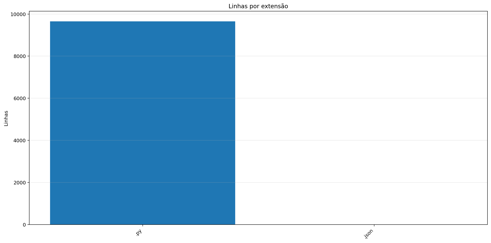


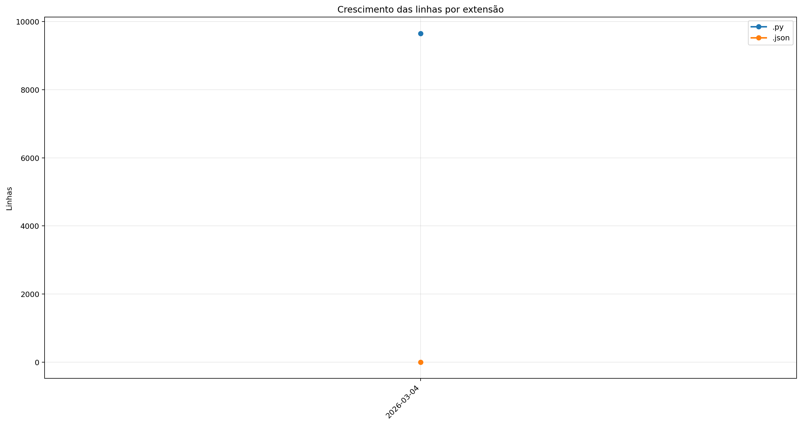

| Ext | Linhas | % das linhas | Arquivos | Peso |
|---:|---:|---:|---:|---:|
| `.py` | 9.655 | 99.99% | 91 | 331.91 KB |
| `.json` | 1 | 0.01% | 1 | 300.77 KB |

## 8. Peso por extensão

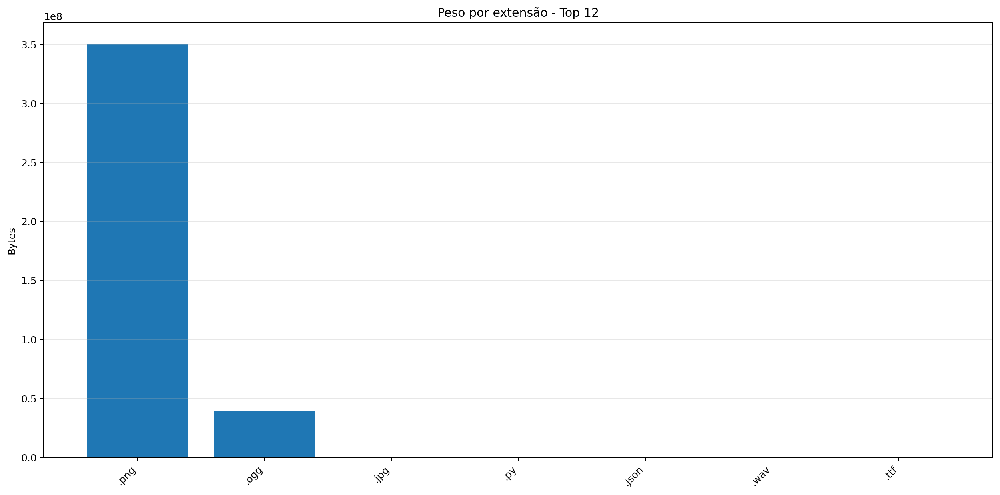

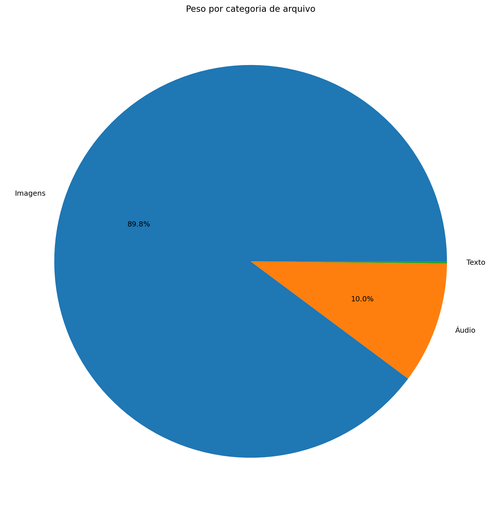

| Ext | Arquivos | Peso | % do jogo |
|---:|---:|---:|---:|
| `.png` | 67.837 | 334.59 MB | 89.64% |
| `.ogg` | 14 | 37.19 MB | 9.97% |
| `.jpg` | 1 | 623.44 KB | 0.16% |
| `.py` | 91 | 331.91 KB | 0.09% |
| `.json` | 1 | 300.77 KB | 0.08% |
| `.wav` | 2 | 208.16 KB | 0.05% |
| `.ttf` | 1 | 26.20 KB | 0.01% |

## 9. Comparativo com o último relatório

_Sem relatório anterior compatível para montar comparativo._

### Top 3 commits por tamanho de diff

_Sem commits suficientes entre os relatórios para montar top por diff._

## 10. Gráficos de crescimento

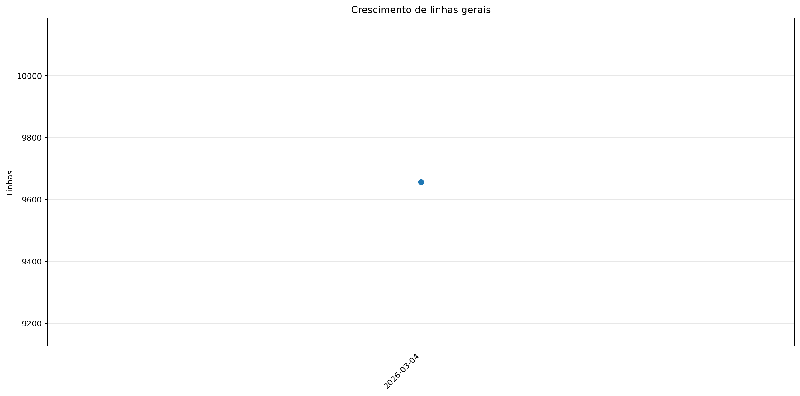


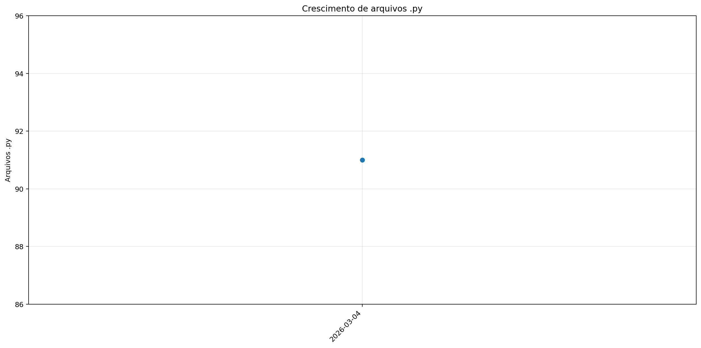

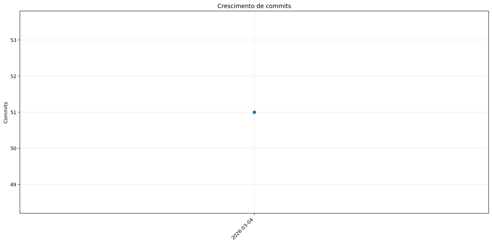

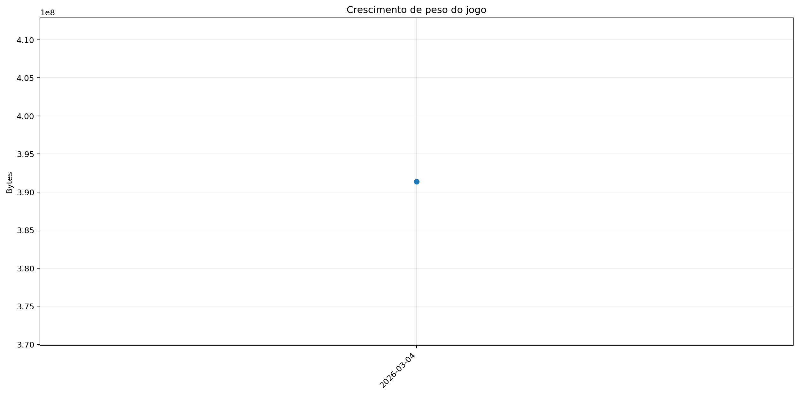


