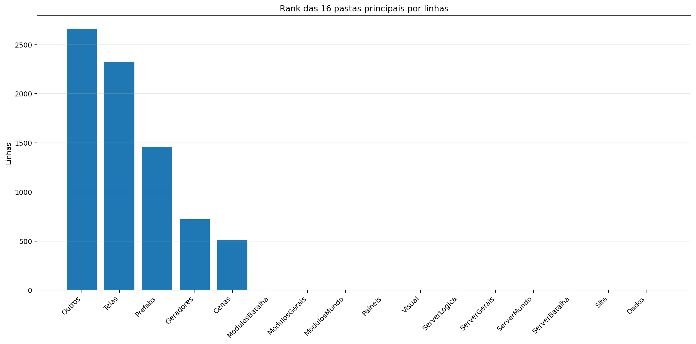
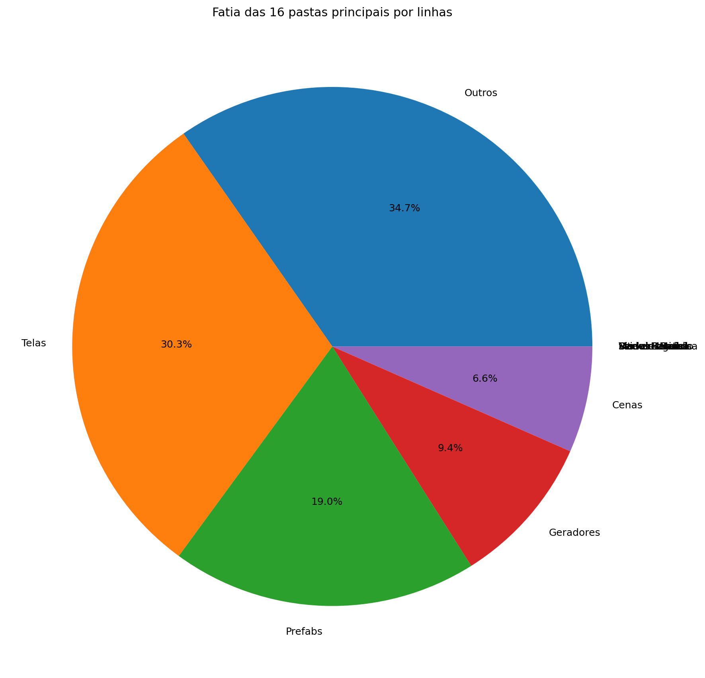
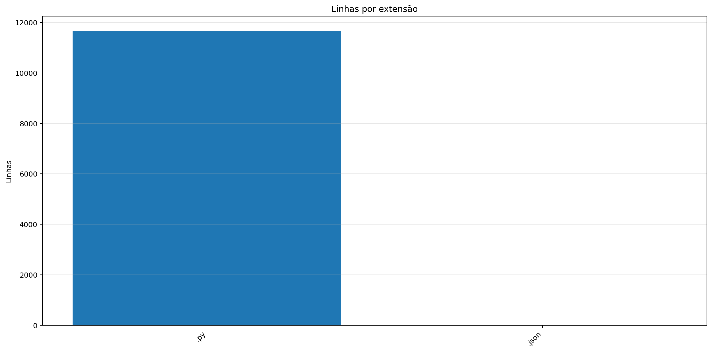
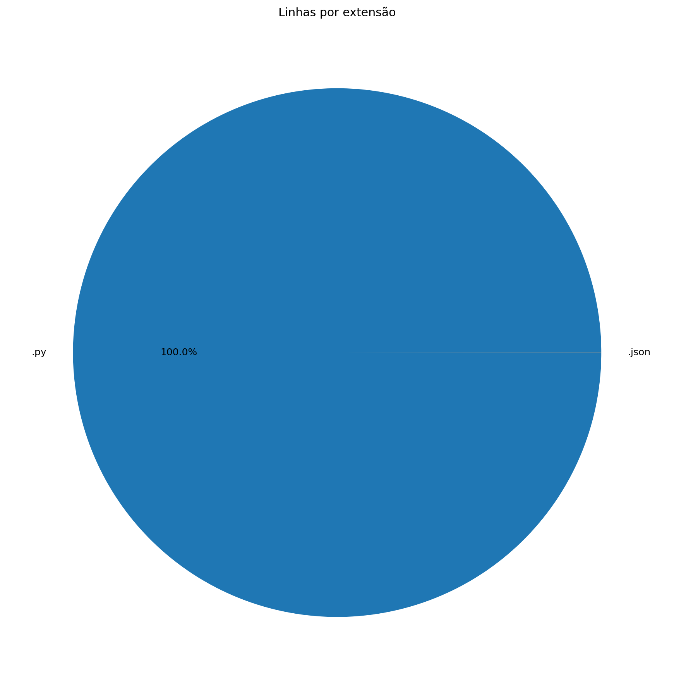
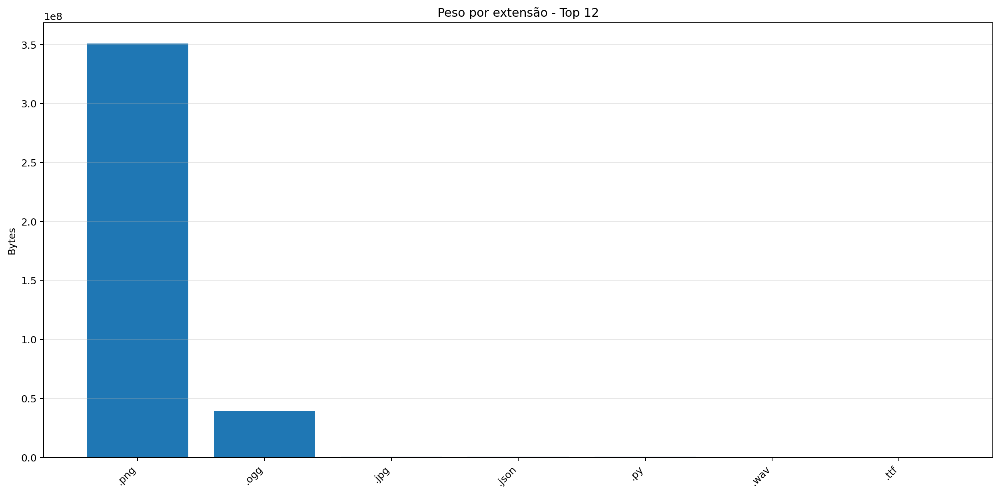
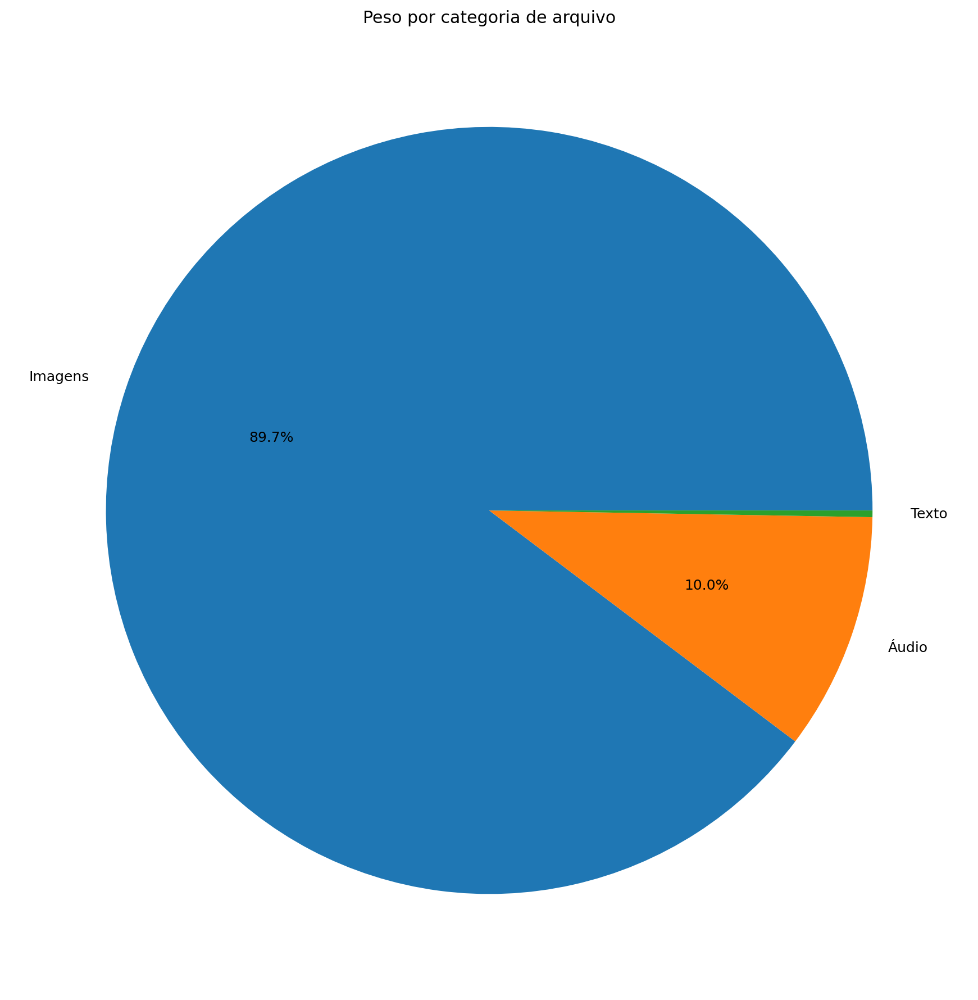
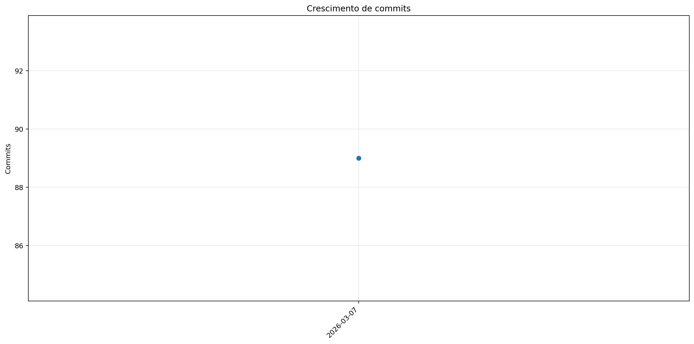
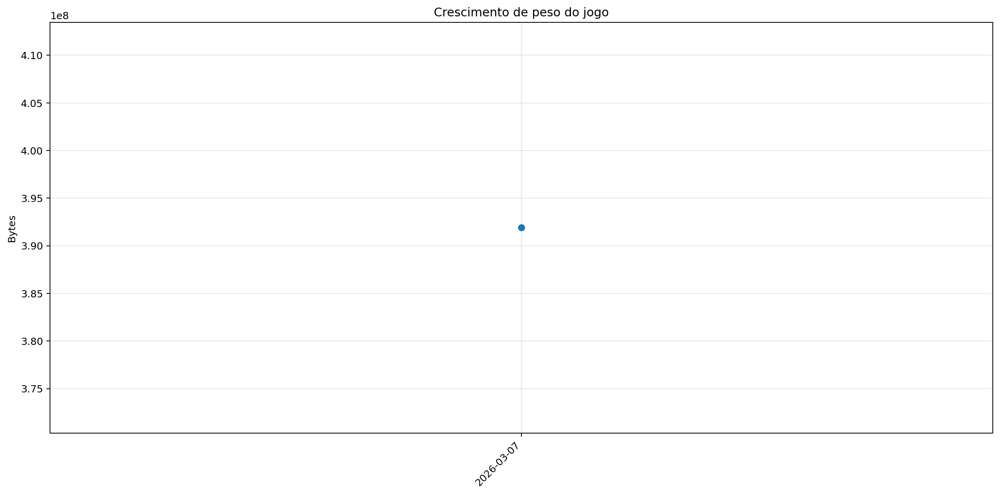

# Registro

**Relatório:** #1  
**Projeto:** `relatorio_rebuild_r0t1wyl6`  
**Gerado em:** 2026-04-29T23:21:51  
**Modelo de relatório:** 10  
**Autor:** Leon Cunha Alvaro Lopez Soto

## 1. Visão geral

- **Pastas:** 1.132
- **Arquivos:** 67.973
- **Arquivos de texto:** 105
- **Peso dos arquivos de texto:** 1016.28 KB
- **Tamanho total:** 0.365 GB (391.910.371 bytes)
- **Dias desde a criação do projeto:** 5
- **Dias desde a criação oficial:** 279
- **Horas estimadas:** 70.50
- **Linhas totais gerais:** 11.669
- **Commits (projeto):** 89

## 2. Python

- **Arquivos `.py`:** 99
- **Linhas totais:** 11.668
- **Tamanho total `.py`:** 414.50 KB
- **Classes encontradas:** 56
- **Funções encontradas:** 253
- **Métodos encontrados:** 367
- **Total funções + métodos:** 620
- **Bibliotecas diferentes usadas:** 27

## 3. Principais pastas





| Rank | Pasta | Subpastas | Arquivos | Linhas gerais | Tamanho (KB) |
|---:|---|---:|---:|---:|---:|
| 1 | `Outros` | 0 | 4 | 2.664 | 96.92 |
| 2 | `Telas` | 1 | 14 | 2.323 | 76.93 |
| 3 | `Prefabs` | 0 | 11 | 1.460 | 51.75 |
| 4 | `Geradores` | 0 | 13 | 723 | 24.38 |
| 5 | `Cenas` | 0 | 7 | 508 | 17.61 |
| 6 | `ModulosBatalha` | 0 | 0 | 0 | 0.00 |
| 7 | `ModulosGerais` | 0 | 0 | 0 | 0.00 |
| 8 | `ModulosMundo` | 0 | 0 | 0 | 0.00 |
| 9 | `Paineis` | 0 | 6 | 0 | 0.00 |
| 10 | `Visual` | 0 | 0 | 0 | 0.00 |
| 11 | `ServerLogica` | 0 | 0 | 0 | 0.00 |
| 12 | `ServerGerais` | 0 | 0 | 0 | 0.00 |
| 13 | `ServerMundo` | 0 | 0 | 0 | 0.00 |
| 14 | `ServerBatalha` | 0 | 0 | 0 | 0.00 |
| 15 | `Site` | 0 | 0 | 0 | 0.00 |
| 16 | `Dados` | 0 | 2 | 0 | 0.00 |

## 4. Arquitetura

### `Codigo/`

```text
Codigo/
├── Cenas/
│   ├── CenaCarregamento.py
│   ├── CenaCombate.py
│   ├── CenaLogin.py
│   ├── CenaMenu.py
│   ├── CenaMundo.py
│   ├── CenaPreBatalha.py
│   └── ControladorCenas.py
├── Geradores/
│   ├── Ator.py
│   ├── Baus.py
│   ├── Dungeon.py
│   ├── Entidade.py
│   ├── Estadio.py
│   ├── Estrutura.py
│   ├── EstruturaNaturais.py
│   ├── Fruta.py
│   ├── GameObjeto.py
│   ├── Loja.py
│   ├── Pokebola.py
│   ├── PokemonCombate.py
│   └── PokemonMundo.py
├── Localidades/
│   ├── Bot.py
│   ├── Combate.py
│   ├── GeradorMundo.py
│   └── GeradorPokemon.py
├── Modulos/
│   ├── Player/
│   │   ├── ElementosHud.py
│   │   ├── Player.py
│   │   ├── PlayerControle.py
│   │   ├── PlayerInventario.py
│   │   └── PlayerPerfil.py
│   ├── Camera.py
│   ├── Carregamento.py
│   ├── Colisor.py
│   ├── Comandos.py
│   ├── ConfigEstruturasNaturais.py
│   ├── ControladorObjetos.py
│   ├── DesenhaAtor.py
│   ├── Discord.py
│   ├── EfeitosTela.py
│   ├── Ferramentas.py
│   ├── FisicaCombate.py
│   ├── LeitorMundo.py
│   ├── Projetil.py
│   ├── SistemaCombate.py
│   ├── Sonoridades.py
│   └── SubtelaOpcoes.py
├── Paineis/
│   ├── FichaItem.py
│   ├── FichaPokemon.py
│   ├── FichaPokemonCombate.py
│   ├── Musicdex.py
│   ├── Pokedex.py
│   └── Skindex.py
├── Prefabs/
│   ├── Arrastavel.py
│   ├── Barra.py
│   ├── Botao.py
│   ├── CaixaTexto.py
│   ├── EfeitosVisuais.py
│   ├── Imagem.py
│   ├── Mensagem.py
│   ├── Painel.py
│   ├── Terminal.py
│   ├── Texto.py
│   └── Tooltip.py
├── Server/
│   ├── Login.py
│   ├── ServerCombate.py
│   ├── ServerMenu.py
│   └── ServerMundo.py
└── Telas/
    ├── Inventario/
    │   ├── Estatisticas.py
    │   ├── Itens.py
    │   ├── Pokemons.py
    │   └── Unificador.py
    ├── Config.py
    ├── Creditos.py
    ├── Mapa.py
    ├── Opções.py
    ├── TelaCriarPersonagem.py
    ├── TelaLogin.py
    ├── TelaMenu.py
    ├── TelaOperador.py
    ├── TelaServers.py
    └── TelasGenericas.py
```

### `Server/`

```text
SimuladorServerJogo/
├── Ativador.py
├── Atualizador.py
├── BancoDados.py
├── Bot.py
├── Combate.py
├── Entrada.py
├── EstadoServidor.py
├── GeradorMundo.py
├── GeradorPokemon.py
├── MundoEstado.json
├── ObjetosMundoServer.py
├── PropriedadesMundo.py
└── ServerOperar.py
```

### `Dados/`

```text
Dados/
├── Ataques.csv
└── Pokemons.csv
```

### `Site/`

```text
Site/
└── (pasta não encontrada)
```

### `Outros/`

```text
Outros/
├── AtualizadorReadMe.py
├── ConfigFixa.py
├── GeradorRelatorios.py
└── Mixer.py
```

## 5. Ranks

### Top 50 maiores arquivos `.py` por linhas

| Arquivo | Linhas | Tamanho (KB) |
|---|---:|---:|
| `Outros/GeradorRelatorios.py` | 1.757 | 65.51 |
| `Codigo/Telas/TelaServers.py` | 497 | 15.50 |
| `Outros/AtualizadorReadMe.py` | 461 | 16.36 |
| `Outros/Mixer.py` | 445 | 14.87 |
| `Codigo/Telas/TelaCriarPersonagem.py` | 436 | 15.85 |
| `Codigo/Prefabs/Botao.py` | 432 | 14.71 |
| `Codigo/Modulos/ControladorObjetos.py` | 424 | 17.86 |
| `Codigo/Telas/TelasGenericas.py` | 305 | 10.24 |
| `Codigo/Modulos/LeitorMundo.py` | 304 | 12.51 |
| `Codigo/Modulos/Colisor.py` | 276 | 9.29 |
| `SimuladorServerJogo/BancoDados.py` | 275 | 11.92 |
| `Codigo/Modulos/Player/PlayerControle.py` | 267 | 10.84 |
| `Codigo/Telas/TelaOperador.py` | 262 | 7.97 |
| `Codigo/Telas/Config.py` | 257 | 8.31 |
| `Codigo/Modulos/Sonoridades.py` | 246 | 7.86 |
| `Codigo/Prefabs/Texto.py` | 235 | 8.08 |
| `SimuladorServerJogo/GeradorMundo.py` | 227 | 7.97 |
| `SimuladorServerJogo/EstadoServidor.py` | 217 | 6.70 |
| `Codigo/Geradores/GameObjeto.py` | 216 | 7.89 |
| `Codigo/Telas/TelaLogin.py` | 203 | 5.71 |
| `Codigo/Prefabs/CaixaTexto.py` | 189 | 7.33 |
| `SimuladorServerJogo/Ativador.py` | 179 | 5.90 |
| `Codigo/Geradores/Ator.py` | 169 | 5.56 |
| `Codigo/Cenas/ControladorCenas.py` | 168 | 5.71 |
| `Codigo/Telas/TelaMenu.py` | 167 | 5.67 |
| `Codigo/Prefabs/Mensagem.py` | 161 | 5.36 |
| `Codigo/Modulos/DesenhaAtor.py` | 159 | 5.88 |
| `Codigo/Prefabs/Barra.py` | 151 | 5.54 |
| `Codigo/Cenas/CenaCarregamento.py` | 136 | 4.46 |
| `Codigo/Cenas/CenaMundo.py` | 130 | 5.36 |
| `SimuladorServerJogo/Entrada.py` | 124 | 5.80 |
| `Codigo/Prefabs/Painel.py` | 119 | 4.88 |
| `Codigo/Prefabs/Imagem.py` | 113 | 3.61 |
| `Codigo/Modulos/SubtelaOpcoes.py` | 112 | 4.04 |
| `SimuladorServerJogo/Atualizador.py` | 110 | 4.10 |
| `SimuladorServerJogo/ObjetosMundoServer.py` | 109 | 4.00 |
| `Codigo/Modulos/EfeitosTela.py` | 98 | 2.62 |
| `Codigo/Modulos/Player/PlayerPerfil.py` | 96 | 5.29 |
| `Codigo/Geradores/PokemonMundo.py` | 94 | 3.33 |
| `Codigo/Telas/Inventario/Itens.py` | 94 | 4.01 |
| `Codigo/Modulos/Discord.py` | 92 | 2.57 |
| `Codigo/Modulos/Camera.py` | 87 | 3.57 |
| `Codigo/Telas/Inventario/Unificador.py` | 82 | 3.04 |
| `Codigo/Geradores/EstruturaNaturais.py` | 76 | 2.55 |
| `Codigo/Server/ServerMenu.py` | 72 | 2.03 |
| `SimuladorServerJogo/ServerOperar.py` | 71 | 2.17 |
| `Codigo/Modulos/Projetil.py` | 71 | 2.35 |
| `Codigo/Geradores/Entidade.py` | 65 | 2.04 |
| `Codigo/Modulos/Ferramentas.py` | 64 | 2.30 |
| `Codigo/Server/ServerMundo.py` | 62 | 1.89 |

### Top 20 maiores classes

| Arquivo | Classe | Linhas |
|---|---|---:|
| `Codigo/Modulos/ControladorObjetos.py` | `ControladorObjetos` | 409 |
| `Codigo/Telas/TelaCriarPersonagem.py` | `SubtelaCriarPersonagem` | 363 |
| `Codigo/Prefabs/Botao.py` | `Botao` | 318 |
| `Codigo/Modulos/LeitorMundo.py` | `LeitorMundo` | 290 |
| `Codigo/Modulos/Colisor.py` | `Colisor` | 262 |
| `Codigo/Modulos/Player/PlayerControle.py` | `PlayerController` | 256 |
| `SimuladorServerJogo/BancoDados.py` | `BancoDadosMundo` | 251 |
| `Codigo/Prefabs/Texto.py` | `Texto` | 229 |
| `Codigo/Geradores/GameObjeto.py` | `GameObjeto` | 200 |
| `Codigo/Prefabs/CaixaTexto.py` | `CaixaTexto` | 184 |
| `Outros/Mixer.py` | `LoopEditor` | 176 |
| `Codigo/Prefabs/Mensagem.py` | `Mensagem` | 158 |
| `Codigo/Cenas/ControladorCenas.py` | `ControladorCenas` | 156 |
| `Codigo/Geradores/Ator.py` | `Ator` | 151 |
| `Codigo/Telas/TelasGenericas.py` | `SubtelaTexto` | 131 |
| `Codigo/Cenas/CenaCarregamento.py` | `CenaCarregamento` | 128 |
| `Codigo/Modulos/DesenhaAtor.py` | `DesenhaAtor` | 128 |
| `Codigo/Cenas/CenaMundo.py` | `CenaMundo` | 116 |
| `Codigo/Prefabs/Imagem.py` | `Imagem` | 105 |
| `Codigo/Modulos/SubtelaOpcoes.py` | `SubtelaOpcoes` | 104 |

### Top 20 maiores funções e métodos

| Arquivo | Nome | Tipo | Linhas |
|---|---|---:|---:|
| `Outros/GeradorRelatorios.py` | `coletar_metricas` | funcao | 247 |
| `Outros/GeradorRelatorios.py` | `gerar_markdown` | funcao | 139 |
| `Outros/GeradorRelatorios.py` | `analisar_python_ast` | funcao | 132 |
| `Codigo/Telas/TelaMenu.py` | `TelaMenu` | funcao | 131 |
| `Codigo/Prefabs/Botao.py` | `Botao.render` | metodo | 115 |
| `Codigo/Telas/TelaCriarPersonagem.py` | `SubtelaCriarPersonagem._rebuild_layout` | metodo | 112 |
| `Outros/Mixer.py` | `main` | funcao | 109 |
| `SimuladorServerJogo/Entrada.py` | `processar_entrada_json` | funcao | 106 |
| `Codigo/Modulos/LeitorMundo.py` | `LeitorMundo.renderizar_mundo` | metodo | 105 |
| `Outros/GeradorRelatorios.py` | `main` | funcao | 100 |
| `Codigo/Telas/Config.py` | `_montar_layout` | funcao | 99 |
| `Outros/GeradorRelatorios.py` | `gerar_graficos` | funcao | 93 |
| `SimuladorServerJogo/Ativador.py` | `processar_ativador_json` | funcao | 92 |
| `Codigo/Telas/TelaServers.py` | `_montar_layout` | funcao | 89 |
| `Codigo/Geradores/GameObjeto.py` | `GameObjeto.aplicar_campo_forca` | metodo | 84 |
| `Codigo/Prefabs/Texto.py` | `Texto._ensure_structure` | metodo | 81 |
| `Codigo/Prefabs/Mensagem.py` | `Mensagem.render` | metodo | 75 |
| `Codigo/Modulos/Colisor.py` | `Colisor.resolver_movimento_com_colisores` | metodo | 73 |
| `SimuladorServerJogo/Atualizador.py` | `processar_atualizador_json` | funcao | 70 |
| `Codigo/Telas/TelasGenericas.py` | `SubtelaTexto.__init__` | metodo | 69 |

### Top 10 arquivos mais importados

| Arquivo | Vezes importado |
|---|---:|
| `Codigo/Prefabs/Botao.py` | 11 |
| `Codigo/Prefabs/Texto.py` | 10 |
| `Codigo/Modulos/Sonoridades.py` | 6 |
| `Codigo/Modulos/EfeitosTela.py` | 6 |
| `SimuladorServerJogo/BancoDados.py` | 4 |
| `SimuladorServerJogo/Ativador.py` | 4 |
| `Codigo/Modulos/Colisor.py` | 4 |
| `Codigo/Prefabs/Barra.py` | 4 |
| `SimuladorServerJogo/EstadoServidor.py` | 3 |
| `Codigo/Modulos/ConfigEstruturasNaturais.py` | 3 |

### Top 10 arquivos que mais importam

| Arquivo | Arquivos internos importados | Imports totais | Linhas |
|---|---:|---:|---:|
| `Codigo/Cenas/CenaMundo.py` | 10 | 11 | 130 |
| `Codigo/Cenas/ControladorCenas.py` | 9 | 10 | 168 |
| `Codigo/Telas/TelaServers.py` | 6 | 8 | 497 |
| `Codigo/Cenas/CenaMenu.py` | 6 | 7 | 42 |
| `Codigo/Telas/TelaCriarPersonagem.py` | 5 | 8 | 436 |
| `Codigo/Telas/TelaOperador.py` | 5 | 7 | 262 |
| `Codigo/Telas/Config.py` | 5 | 7 | 257 |
| `Codigo/Telas/TelaLogin.py` | 5 | 7 | 203 |
| `Codigo/Modulos/ControladorObjetos.py` | 4 | 9 | 424 |
| `SimuladorServerJogo/BancoDados.py` | 4 | 9 | 275 |

### Top 10 maiores arquivos por linhas

| Arquivo | Ext | Linhas |
|---|---:|---:|
| `Outros/GeradorRelatorios.py` | `.py` | 1.757 |
| `Codigo/Telas/TelaServers.py` | `.py` | 497 |
| `Outros/AtualizadorReadMe.py` | `.py` | 461 |
| `Outros/Mixer.py` | `.py` | 445 |
| `Codigo/Telas/TelaCriarPersonagem.py` | `.py` | 436 |
| `Codigo/Prefabs/Botao.py` | `.py` | 432 |
| `Codigo/Modulos/ControladorObjetos.py` | `.py` | 424 |
| `Codigo/Telas/TelasGenericas.py` | `.py` | 305 |
| `Codigo/Modulos/LeitorMundo.py` | `.py` | 304 |
| `Codigo/Modulos/Colisor.py` | `.py` | 276 |

## 6. Linhas por extensão





| Ext | Linhas | % das linhas | Arquivos | Peso |
|---:|---:|---:|---:|---:|
| `.py` | 11.668 | 99.99% | 99 | 414.50 KB |
| `.json` | 1 | 0.01% | 1 | 601.78 KB |

## 7. Peso por extensão





| Ext | Arquivos | Peso | % do jogo |
|---:|---:|---:|---:|
| `.png` | 67.850 | 334.73 MB | 89.56% |
| `.ogg` | 14 | 37.19 MB | 9.95% |
| `.jpg` | 1 | 623.44 KB | 0.16% |
| `.json` | 1 | 601.78 KB | 0.16% |
| `.py` | 99 | 414.50 KB | 0.11% |
| `.wav` | 2 | 208.16 KB | 0.05% |
| `.ttf` | 1 | 26.20 KB | 0.01% |

## 8. Comparativo com o último relatório

_Sem relatório anterior compatível para montar comparativo._

### Top 3 commits por tamanho de diff

_Sem commits suficientes entre os relatórios para montar top por diff._

## 9. Gráficos de crescimento





