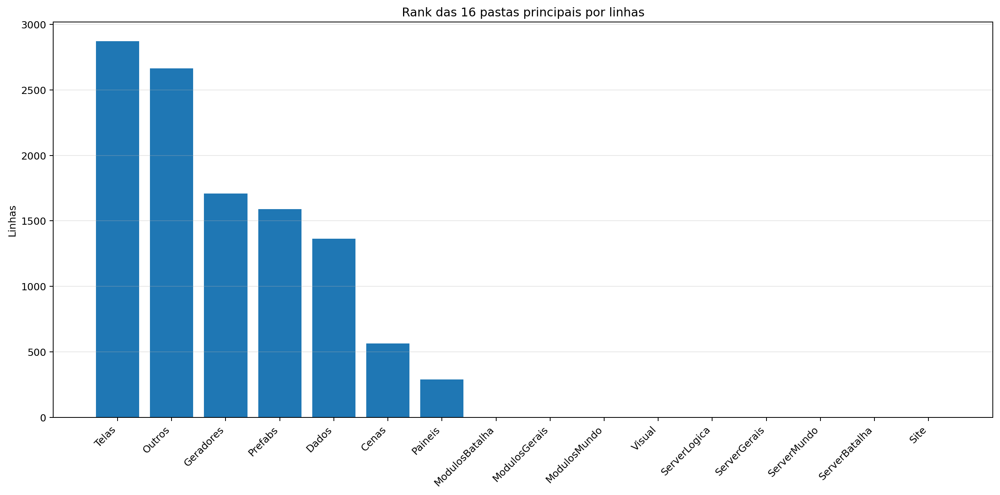
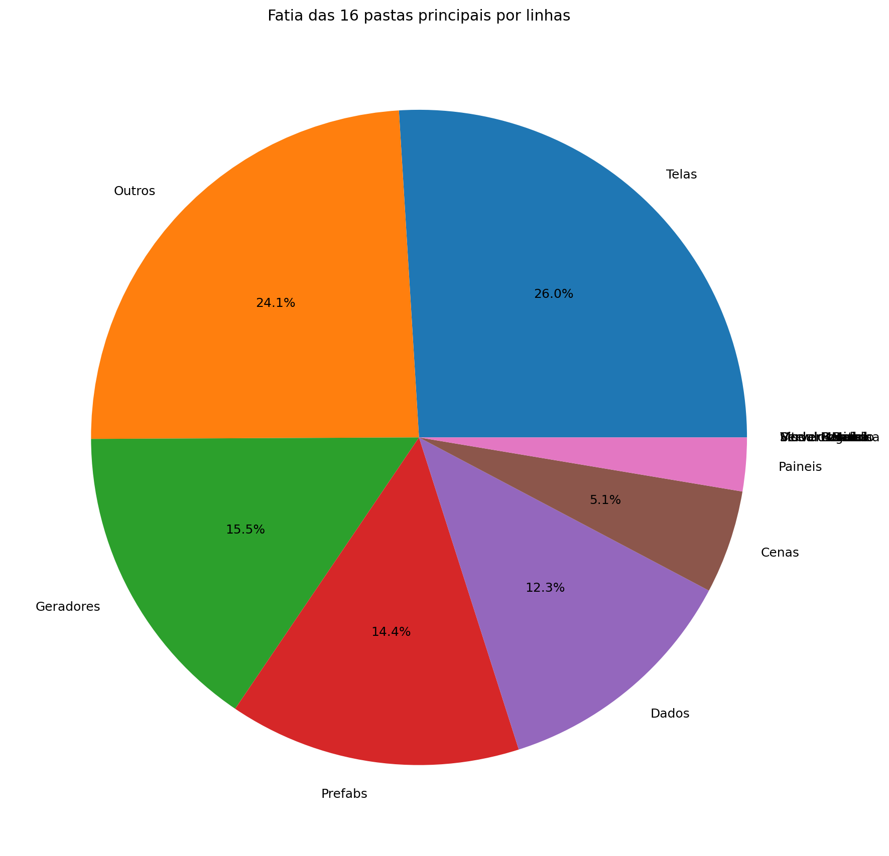
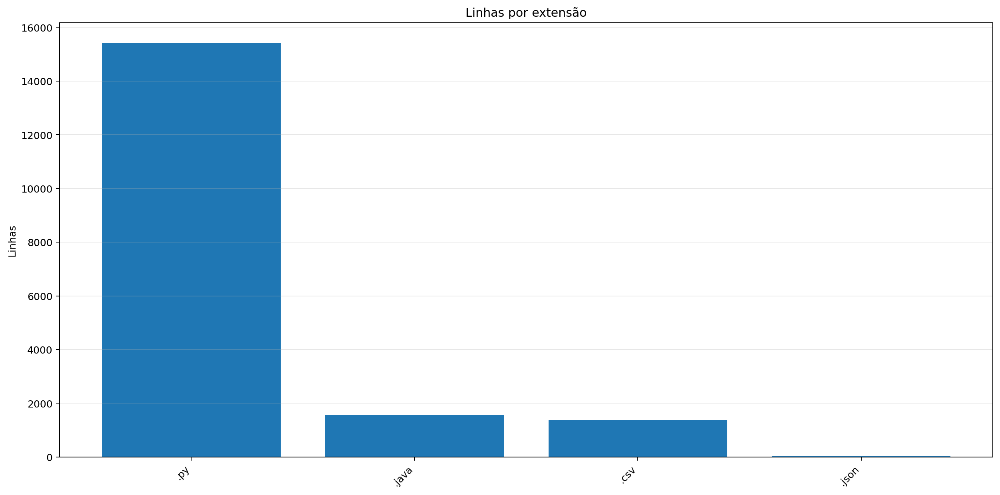
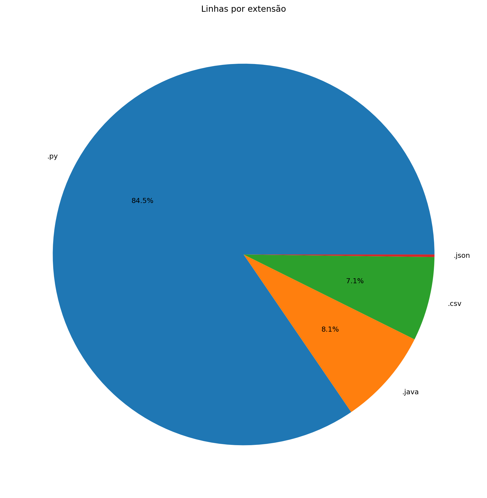
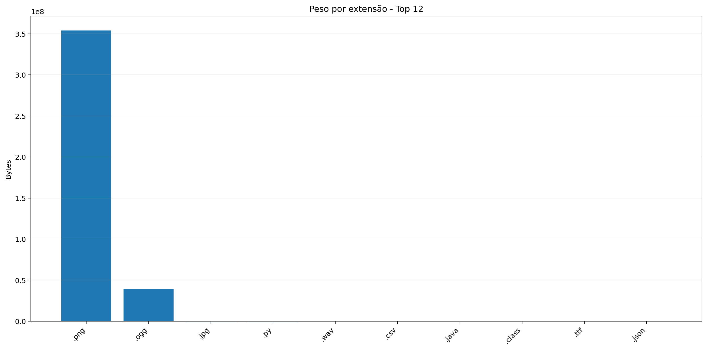
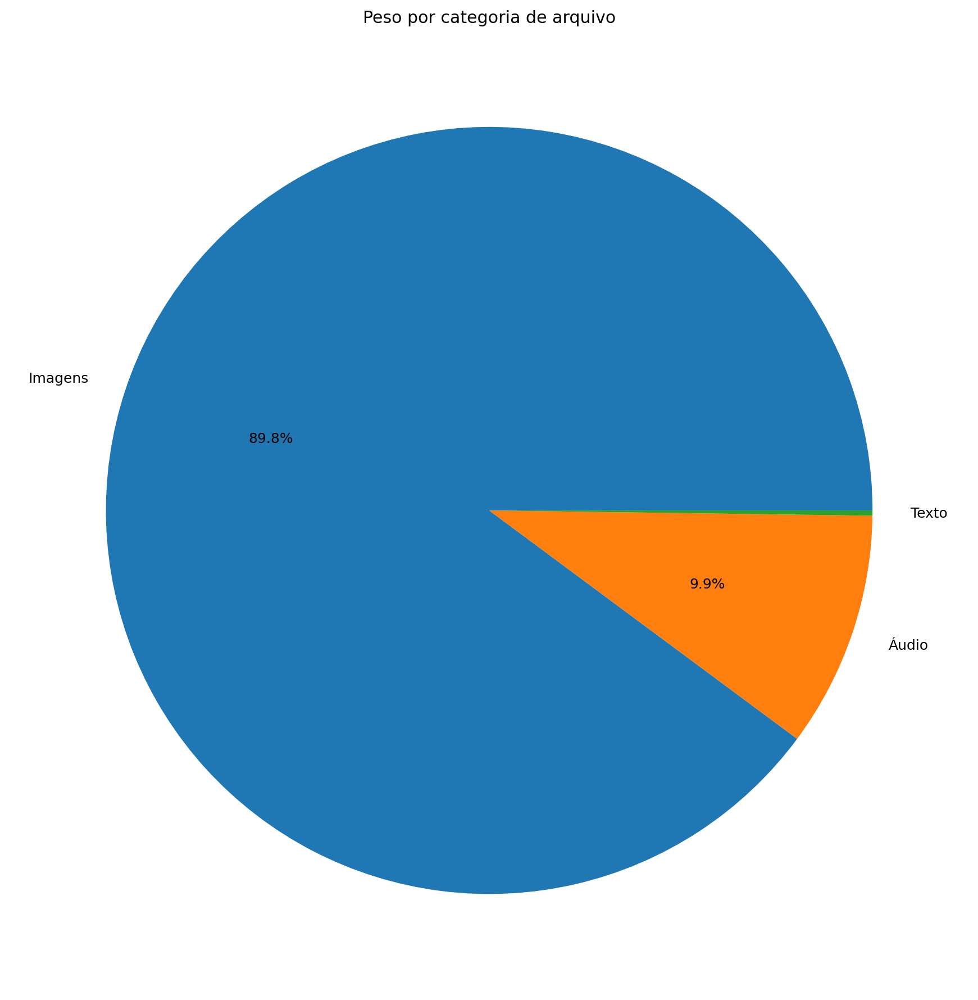
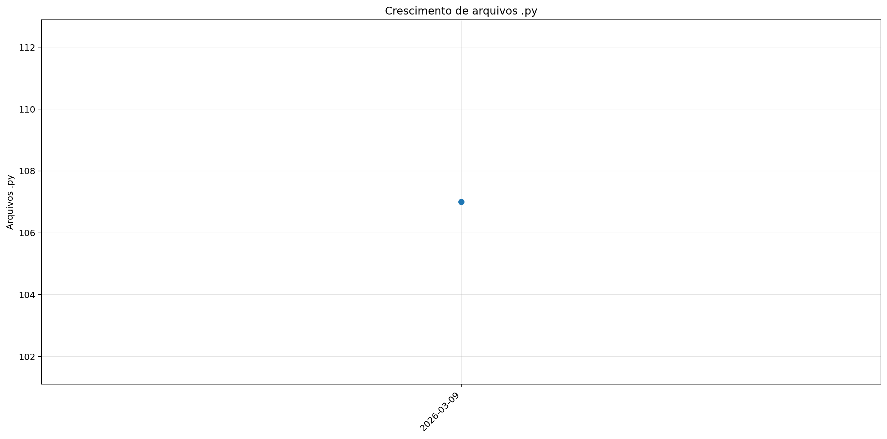
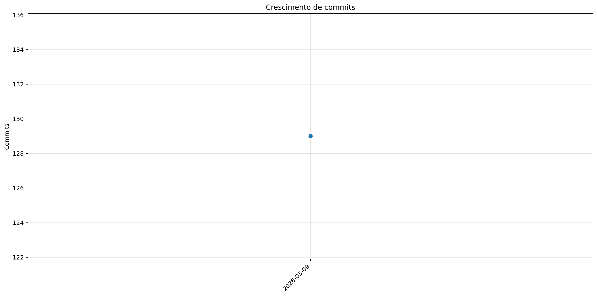
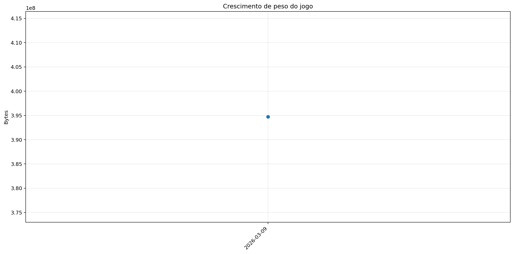

# Registro

**Relatório:** #1  
**Projeto:** `relatorio_rebuild_vls1ljq2`  
**Gerado em:** 2026-04-29T23:26:06  
**Modelo de relatório:** 10  
**Autor:** Leon Cunha Alvaro Lopez Soto

## 1. Visão geral

- **Pastas:** 1.151
- **Arquivos:** 68.182
- **Arquivos de texto:** 117
- **Peso dos arquivos de texto:** 765.32 KB
- **Tamanho total:** 0.368 GB (394.687.692 bytes)
- **Dias desde a criação do projeto:** 7
- **Dias desde a criação oficial:** 281
- **Horas estimadas:** 99.50
- **Linhas totais gerais:** 18.369
- **Commits (projeto):** 129

## 2. Python

- **Arquivos `.py`:** 107
- **Linhas totais:** 15.407
- **Tamanho total `.py`:** 561.04 KB
- **Classes encontradas:** 64
- **Funções encontradas:** 303
- **Métodos encontrados:** 501
- **Total funções + métodos:** 804
- **Bibliotecas diferentes usadas:** 28

## 3. Principais pastas





| Rank | Pasta | Subpastas | Arquivos | Linhas gerais | Tamanho (KB) |
|---:|---|---:|---:|---:|---:|
| 1 | `Telas` | 1 | 14 | 2.872 | 98.89 |
| 2 | `Outros` | 0 | 4 | 2.664 | 96.91 |
| 3 | `Geradores` | 2 | 23 | 1.709 | 61.03 |
| 4 | `Prefabs` | 0 | 11 | 1.591 | 55.49 |
| 5 | `Dados` | 0 | 3 | 1.364 | 140.29 |
| 6 | `Cenas` | 0 | 7 | 564 | 20.44 |
| 7 | `Paineis` | 0 | 6 | 292 | 9.30 |
| 8 | `ModulosBatalha` | 0 | 0 | 0 | 0.00 |
| 9 | `ModulosGerais` | 0 | 0 | 0 | 0.00 |
| 10 | `ModulosMundo` | 0 | 0 | 0 | 0.00 |
| 11 | `Visual` | 0 | 0 | 0 | 0.00 |
| 12 | `ServerLogica` | 0 | 0 | 0 | 0.00 |
| 13 | `ServerGerais` | 0 | 0 | 0 | 0.00 |
| 14 | `ServerMundo` | 0 | 0 | 0 | 0.00 |
| 15 | `ServerBatalha` | 0 | 0 | 0 | 0.00 |
| 16 | `Site` | 0 | 0 | 0 | 0.00 |

## 4. Arquitetura

### `Codigo/`

```text
Codigo/
├── Cenas/
│   ├── CenaCarregamento.py
│   ├── CenaCombate.py
│   ├── CenaLogin.py
│   ├── CenaMenu.py
│   ├── CenaMundo.py
│   ├── CenaPreBatalha.py
│   └── ControladorCenas.py
├── Geradores/
│   ├── Itens/
│   │   ├── Ferramenta.py
│   │   ├── Fruta.py
│   │   ├── ItemInventario.py
│   │   ├── ItemMundo.py
│   │   ├── Pokebola.py
│   │   ├── Recurso.py
│   │   └── Utilizavel.py
│   ├── Player/
│   │   ├── Player.py
│   │   ├── PlayerControle.py
│   │   ├── PlayerInventario.py
│   │   └── PlayerPerfil.py
│   ├── Ator.py
│   ├── Baus.py
│   ├── Dungeon.py
│   ├── Entidade.py
│   ├── Estadio.py
│   ├── Estrutura.py
│   ├── EstruturaNaturais.py
│   ├── GameObjeto.py
│   ├── Loja.py
│   ├── PokemonCombate.py
│   ├── PokemonMundo.py
│   └── Projetil.py
├── Localidades/
│   ├── Bot.py
│   ├── Combate.py
│   ├── GeradorMundo.py
│   └── GeradorPokemon.py
├── Modulos/
│   ├── Auxiliares.py
│   ├── Camera.py
│   ├── Carregamento.py
│   ├── Colisor.py
│   ├── Comandos.py
│   ├── ControladorObjetos.py
│   ├── DesenhaAtor.py
│   ├── Discord.py
│   ├── EfeitosTela.py
│   ├── ElementosHud.py
│   ├── Ferramentas.py
│   ├── FisicaCombate.py
│   ├── LeitorMundo.py
│   ├── Projetil.py
│   ├── SistemaCombate.py
│   ├── Sonoridades.py
│   └── SubtelaOpcoes.py
├── Paineis/
│   ├── FichaItem.py
│   ├── FichaPokemon.py
│   ├── FichaPokemonCombate.py
│   ├── Musicdex.py
│   ├── Pokedex.py
│   └── Skindex.py
├── Prefabs/
│   ├── Arrastavel.py
│   ├── Barra.py
│   ├── Botao.py
│   ├── CaixaTexto.py
│   ├── EfeitosVisuais.py
│   ├── Imagem.py
│   ├── Mensagem.py
│   ├── Painel.py
│   ├── Terminal.py
│   ├── Texto.py
│   └── Tooltip.py
├── Server/
│   ├── Login.py
│   ├── ServerCombate.py
│   ├── ServerMenu.py
│   └── ServerMundo.py
└── Telas/
    ├── Inventario/
    │   ├── Estatisticas.py
    │   ├── Itens.py
    │   ├── Pokemons.py
    │   └── Unificador.py
    ├── Config.py
    ├── Creditos.py
    ├── Mapa.py
    ├── Opções.py
    ├── TelaCriarPersonagem.py
    ├── TelaLogin.py
    ├── TelaMenu.py
    ├── TelaOperador.py
    ├── TelaServers.py
    └── TelasGenericas.py
```

### `Server/`

```text
SimuladorServerJogo/
├── Controle/
│   ├── BancoDados.py
│   ├── Cerebro.py
│   ├── EstadoServidor.py
│   └── ObjetosMundoServer.py
├── Geradores/
│   ├── GeradorBaus.py
│   ├── GeradorMundo.py
│   ├── GeradorPokemon.py
│   ├── WorldGenerator$Biome.class
│   ├── WorldGenerator$BiomeRule.class
│   ├── WorldGenerator$Generator.class
│   ├── WorldGenerator$NaturalStructure.class
│   ├── WorldGenerator$Poi.class
│   ├── WorldGenerator$PoiType.class
│   ├── WorldGenerator$Rules.class
│   ├── WorldGenerator$StructureRule.class
│   ├── WorldGenerator$Tile.class
│   ├── WorldGenerator.class
│   └── WorldGenerator.java
├── Regras/
│   ├── Cerebro.json
│   ├── Loader.py
│   ├── Mundo.json
│   └── Player.json
└── Rotas/
    ├── Ativador.py
    ├── Atualizador.py
    ├── Comandos.py
    ├── Entrada.py
    ├── ServerOperar.py
    └── Terminal.py
```

### `Dados/`

```text
Dados/
├── Global server - Baus.csv
├── Global server - Itens.csv
└── Global server - Pokemons.csv
```

### `Site/`

```text
Site/
└── (pasta não encontrada)
```

### `Outros/`

```text
Outros/
├── AtualizadorReadMe.py
├── ConfigFixa.py
├── GeradorRelatorios.py
└── Mixer.py
```

## 5. Ranks

### Top 50 maiores arquivos `.py` por linhas

| Arquivo | Linhas | Tamanho (KB) |
|---|---:|---:|
| `Outros/GeradorRelatorios.py` | 1.757 | 65.51 |
| `Codigo/Modulos/ControladorObjetos.py` | 589 | 26.31 |
| `Codigo/Telas/TelaServers.py` | 499 | 15.72 |
| `Outros/AtualizadorReadMe.py` | 461 | 16.36 |
| `Codigo/Telas/TelasGenericas.py` | 459 | 15.69 |
| `Outros/Mixer.py` | 445 | 14.87 |
| `SimuladorServerJogo/Controle/EstadoServidor.py` | 442 | 16.23 |
| `SimuladorServerJogo/Geradores/GeradorMundo.py` | 439 | 17.14 |
| `Codigo/Prefabs/Botao.py` | 432 | 14.71 |
| `SimuladorServerJogo/Controle/BancoDados.py` | 422 | 18.61 |
| `Codigo/Telas/TelaCriarPersonagem.py` | 417 | 15.19 |
| `Codigo/Telas/Inventario/Itens.py` | 408 | 16.57 |
| `Codigo/Modulos/LeitorMundo.py` | 370 | 15.73 |
| `SimuladorServerJogo/Controle/Cerebro.py` | 344 | 14.12 |
| `Codigo/Telas/TelaOperador.py` | 344 | 11.61 |
| `SimuladorServerJogo/Rotas/Comandos.py` | 308 | 12.06 |
| `Codigo/Paineis/FichaItem.py` | 292 | 9.30 |
| `Codigo/Modulos/Colisor.py` | 276 | 9.29 |
| `Codigo/Geradores/Player/PlayerControle.py` | 273 | 11.18 |
| `SimuladorServerJogo/Rotas/Ativador.py` | 267 | 9.99 |
| `Codigo/Telas/Config.py` | 257 | 8.31 |
| `Codigo/Modulos/Sonoridades.py` | 246 | 7.86 |
| `Codigo/Geradores/PokemonMundo.py` | 243 | 7.21 |
| `Codigo/Prefabs/Texto.py` | 235 | 8.08 |
| `Codigo/Geradores/GameObjeto.py` | 216 | 7.89 |
| `Codigo/Telas/TelaLogin.py` | 203 | 5.71 |
| `Codigo/Cenas/CenaMundo.py` | 201 | 8.60 |
| `SimuladorServerJogo/Controle/ObjetosMundoServer.py` | 196 | 7.52 |
| `Codigo/Geradores/EstruturaNaturais.py` | 191 | 5.76 |
| `Codigo/Prefabs/CaixaTexto.py` | 189 | 7.33 |
| `Codigo/Geradores/Ator.py` | 169 | 5.56 |
| `Codigo/Cenas/ControladorCenas.py` | 168 | 5.71 |
| `Codigo/Telas/TelaMenu.py` | 167 | 5.67 |
| `Codigo/Prefabs/Mensagem.py` | 161 | 5.36 |
| `Codigo/Modulos/DesenhaAtor.py` | 159 | 5.88 |
| `SimuladorServerJogo/Geradores/GeradorBaus.py` | 155 | 6.15 |
| `Codigo/Prefabs/Barra.py` | 151 | 5.54 |
| `Codigo/Prefabs/Terminal.py` | 148 | 5.01 |
| `Codigo/Server/ServerMundo.py` | 146 | 4.94 |
| `SimuladorServerJogo/Rotas/Atualizador.py` | 138 | 5.39 |
| `Codigo/Geradores/Baus.py` | 138 | 5.52 |
| `Codigo/Geradores/Player/PlayerInventario.py` | 135 | 4.96 |
| `Codigo/Prefabs/Painel.py` | 129 | 4.92 |
| `Codigo/Cenas/CenaCarregamento.py` | 121 | 4.05 |
| `Codigo/Prefabs/Imagem.py` | 113 | 3.61 |
| `Codigo/Modulos/SubtelaOpcoes.py` | 112 | 4.04 |
| `Codigo/Geradores/Itens/ItemInventario.py` | 112 | 3.55 |
| `SimuladorServerJogo/Rotas/Entrada.py` | 111 | 4.77 |
| `SimuladorServerJogo/Geradores/GeradorPokemon.py` | 105 | 4.21 |
| `Codigo/Geradores/Player/PlayerPerfil.py` | 99 | 5.51 |

### Top 20 maiores classes

| Arquivo | Classe | Linhas |
|---|---|---:|
| `Codigo/Modulos/ControladorObjetos.py` | `ControladorObjetos` | 570 |
| `Codigo/Telas/Inventario/Itens.py` | `InventarioItens` | 398 |
| `SimuladorServerJogo/Controle/BancoDados.py` | `BancoDadosMundo` | 394 |
| `Codigo/Modulos/LeitorMundo.py` | `LeitorMundo` | 352 |
| `Codigo/Telas/TelaCriarPersonagem.py` | `SubtelaCriarPersonagem` | 343 |
| `SimuladorServerJogo/Controle/Cerebro.py` | `CerebroServer` | 322 |
| `Codigo/Prefabs/Botao.py` | `Botao` | 318 |
| `Codigo/Paineis/FichaItem.py` | `FichaItem` | 280 |
| `Codigo/Modulos/Colisor.py` | `Colisor` | 262 |
| `Codigo/Geradores/Player/PlayerControle.py` | `PlayerController` | 262 |
| `Codigo/Prefabs/Texto.py` | `Texto` | 229 |
| `Codigo/Geradores/PokemonMundo.py` | `PokemonMundo` | 225 |
| `Codigo/Geradores/GameObjeto.py` | `GameObjeto` | 201 |
| `Codigo/Prefabs/CaixaTexto.py` | `CaixaTexto` | 184 |
| `Codigo/Cenas/CenaMundo.py` | `CenaMundo` | 178 |
| `Outros/Mixer.py` | `LoopEditor` | 176 |
| `Codigo/Prefabs/Mensagem.py` | `Mensagem` | 158 |
| `Codigo/Cenas/ControladorCenas.py` | `ControladorCenas` | 156 |
| `Codigo/Geradores/Ator.py` | `Ator` | 151 |
| `Codigo/Telas/TelasGenericas.py` | `SubtelaCarregamento` | 150 |

### Top 20 maiores funções e métodos

| Arquivo | Nome | Tipo | Linhas |
|---|---|---:|---:|
| `Outros/GeradorRelatorios.py` | `coletar_metricas` | funcao | 247 |
| `Outros/GeradorRelatorios.py` | `gerar_markdown` | funcao | 139 |
| `Outros/GeradorRelatorios.py` | `analisar_python_ast` | funcao | 132 |
| `Codigo/Telas/TelaMenu.py` | `TelaMenu` | funcao | 131 |
| `Codigo/Prefabs/Botao.py` | `Botao.render` | metodo | 115 |
| `Codigo/Paineis/FichaItem.py` | `FichaItem.__init__` | metodo | 113 |
| `Codigo/Telas/TelaCriarPersonagem.py` | `SubtelaCriarPersonagem._rebuild_layout` | metodo | 112 |
| `Outros/Mixer.py` | `main` | funcao | 109 |
| `Outros/GeradorRelatorios.py` | `main` | funcao | 100 |
| `Codigo/Telas/Config.py` | `_montar_layout` | funcao | 99 |
| `SimuladorServerJogo/Geradores/GeradorMundo.py` | `_executar_world_generator` | funcao | 96 |
| `SimuladorServerJogo/Rotas/Atualizador.py` | `processar_atualizador_json` | funcao | 95 |
| `Codigo/Modulos/LeitorMundo.py` | `LeitorMundo.renderizar_mundo` | metodo | 95 |
| `Outros/GeradorRelatorios.py` | `gerar_graficos` | funcao | 93 |
| `SimuladorServerJogo/Rotas/Entrada.py` | `processar_entrada_json` | funcao | 89 |
| `Codigo/Telas/TelaServers.py` | `_montar_layout` | funcao | 89 |
| `Codigo/Geradores/GameObjeto.py` | `GameObjeto.aplicar_campo_forca` | metodo | 84 |
| `Codigo/Prefabs/Texto.py` | `Texto._ensure_structure` | metodo | 81 |
| `Codigo/Prefabs/Mensagem.py` | `Mensagem.render` | metodo | 75 |
| `Codigo/Modulos/Colisor.py` | `Colisor.resolver_movimento_com_colisores` | metodo | 73 |

### Top 10 arquivos mais importados

| Arquivo | Vezes importado |
|---|---:|
| `Codigo/Prefabs/Texto.py` | 13 |
| `Codigo/Prefabs/Botao.py` | 11 |
| `Codigo/Modulos/Sonoridades.py` | 6 |
| `SimuladorServerJogo/Controle/BancoDados.py` | 6 |
| `SimuladorServerJogo/Rotas/Ativador.py` | 6 |
| `Codigo/Modulos/EfeitosTela.py` | 6 |
| `SimuladorServerJogo/Controle/ObjetosMundoServer.py` | 5 |
| `Codigo/Modulos/Auxiliares.py` | 5 |
| `Codigo/Prefabs/Barra.py` | 5 |
| `Codigo/Modulos/Colisor.py` | 4 |

### Top 10 arquivos que mais importam

| Arquivo | Arquivos internos importados | Imports totais | Linhas |
|---|---:|---:|---:|
| `Codigo/Cenas/CenaMundo.py` | 11 | 12 | 201 |
| `Codigo/Cenas/ControladorCenas.py` | 9 | 10 | 168 |
| `SimuladorServerJogo/Controle/Cerebro.py` | 6 | 14 | 344 |
| `Codigo/Modulos/ControladorObjetos.py` | 6 | 12 | 589 |
| `SimuladorServerJogo/Rotas/Comandos.py` | 6 | 11 | 308 |
| `Codigo/Telas/TelaCriarPersonagem.py` | 6 | 9 | 417 |
| `Codigo/Telas/TelaServers.py` | 6 | 8 | 499 |
| `Codigo/Cenas/CenaMenu.py` | 6 | 7 | 42 |
| `SimuladorServerJogo/Controle/EstadoServidor.py` | 5 | 8 | 442 |
| `Codigo/Telas/TelaOperador.py` | 5 | 7 | 344 |

### Top 10 maiores arquivos por linhas

| Arquivo | Ext | Linhas |
|---|---:|---:|
| `Outros/GeradorRelatorios.py` | `.py` | 1.757 |
| `SimuladorServerJogo/Geradores/WorldGenerator.java` | `.java` | 1.557 |
| `Dados/Global server - Pokemons.csv` | `.csv` | 1.277 |
| `Codigo/Modulos/ControladorObjetos.py` | `.py` | 589 |
| `Codigo/Telas/TelaServers.py` | `.py` | 499 |
| `Outros/AtualizadorReadMe.py` | `.py` | 461 |
| `Codigo/Telas/TelasGenericas.py` | `.py` | 459 |
| `Outros/Mixer.py` | `.py` | 445 |
| `SimuladorServerJogo/Controle/EstadoServidor.py` | `.py` | 442 |
| `SimuladorServerJogo/Geradores/GeradorMundo.py` | `.py` | 439 |

## 6. Linhas por extensão





| Ext | Linhas | % das linhas | Arquivos | Peso |
|---:|---:|---:|---:|---:|
| `.py` | 15.407 | 83.88% | 107 | 561.04 KB |
| `.java` | 1.557 | 8.48% | 1 | 62.84 KB |
| `.csv` | 1.364 | 7.43% | 3 | 140.29 KB |
| `.json` | 41 | 0.22% | 3 | 1.14 KB |

## 7. Peso por extensão





| Ext | Arquivos | Peso | % do jogo |
|---:|---:|---:|---:|
| `.png` | 68.037 | 337.58 MB | 89.69% |
| `.ogg` | 14 | 37.19 MB | 9.88% |
| `.jpg` | 1 | 623.44 KB | 0.16% |
| `.py` | 107 | 561.04 KB | 0.15% |
| `.wav` | 2 | 208.16 KB | 0.05% |
| `.csv` | 3 | 140.29 KB | 0.04% |
| `.java` | 1 | 62.84 KB | 0.02% |
| `.class` | 10 | 46.77 KB | 0.01% |
| `.ttf` | 1 | 26.20 KB | 0.01% |
| `.json` | 3 | 1.14 KB | 0.00% |

## 8. Comparativo com o último relatório

_Sem relatório anterior compatível para montar comparativo._

### Top 3 commits por tamanho de diff

_Sem commits suficientes entre os relatórios para montar top por diff._

## 9. Gráficos de crescimento







