# Registro

**Relatório:** #1  
**Projeto:** `relatorio_rebuild_i7xaejrw`  
**Gerado em:** 2026-05-15T09:59:17  
**Modelo de relatório:** 11  
**Autor:** Leon Cunha Alvaro Lopez Soto

## 1. Visão geral

- **Pastas:** 1.155
- **Arquivos:** 68.193
- **Arquivos de texto:** 124
- **Peso dos arquivos de texto:** 885.64 KB
- **Tamanho total:** 0.378 GB (405.681.133 bytes)
- **Dias desde a criação do projeto:** 8
- **Dias desde a criação oficial:** 282
- **Horas estimadas:** 110.50
- **Linhas totais gerais:** 21.019
- **Commits (projeto):** 143

## 2. Python

- **Arquivos `.py`:** 114
- **Linhas totais:** 18.057
- **Tamanho total `.py`:** 680.74 KB
- **Classes encontradas:** 65
- **Funções encontradas:** 361
- **Métodos encontrados:** 556
- **Total funções + métodos:** 917
- **Bibliotecas diferentes usadas:** 30

## 3. Macro áreas

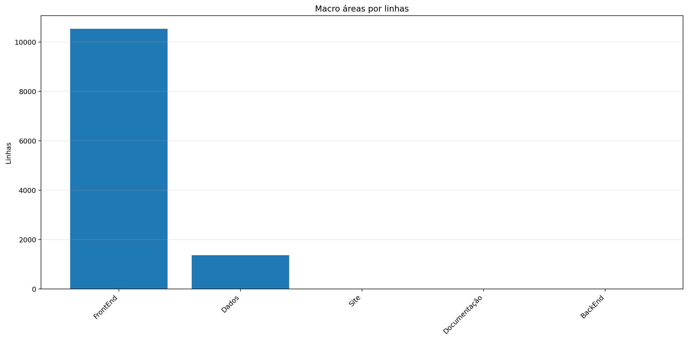

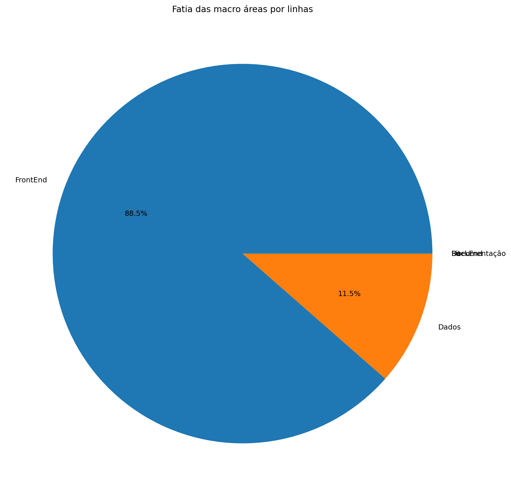

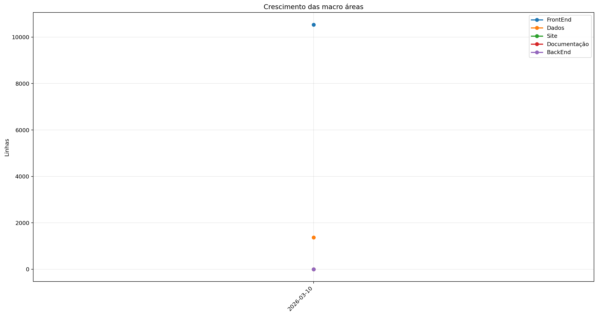

| Rank | Área | Caminho | Subpastas | Arquivos | Linhas gerais | Tamanho (KB) |
|---:|---|---|---:|---:|---:|---:|
| 1 | `FrontEnd` | `Codigo + Game.py` | 12 | 90 | 10.537 | 387.86 |
| 2 | `Dados` | `Dados` | 0 | 3 | 1.364 | 140.92 |
| 3 | `Site` | `Site/src` | 0 | 0 | 0 | 0.00 |
| 4 | `Documentação` | `Documentação` | 0 | 0 | 0 | 0.00 |
| 5 | `BackEnd` | `Servidor + ServidorGeral` | 0 | 0 | 0 | 0.00 |

## 4. Principais pastas

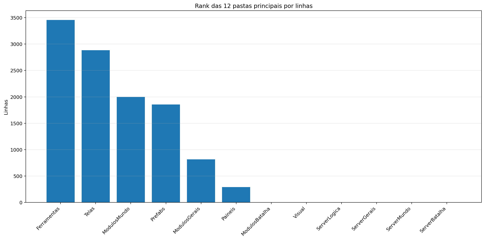

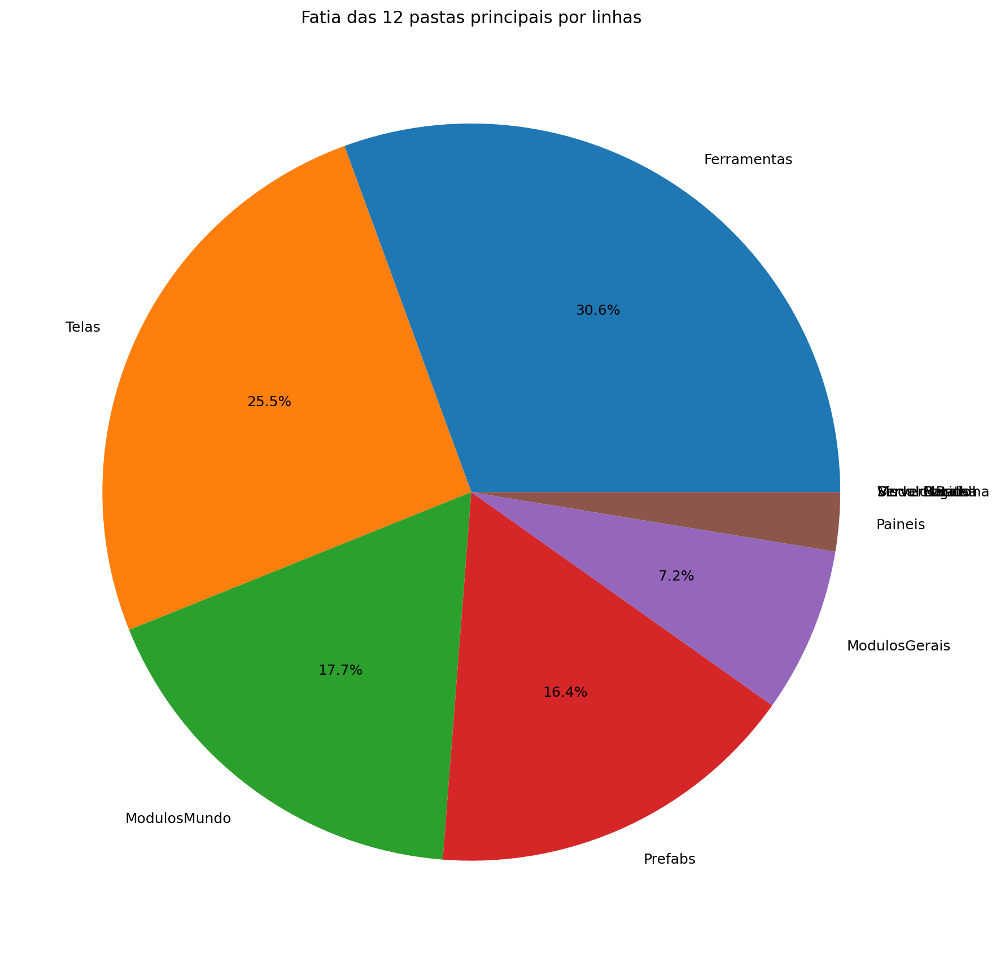

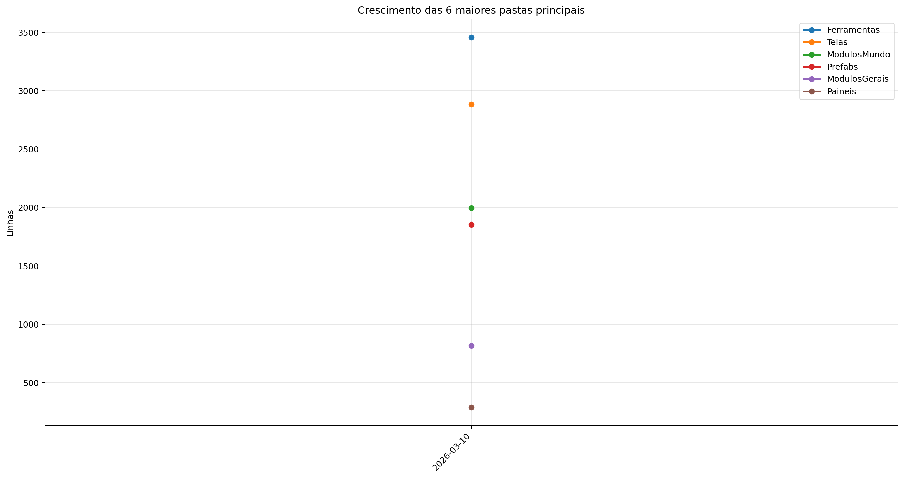

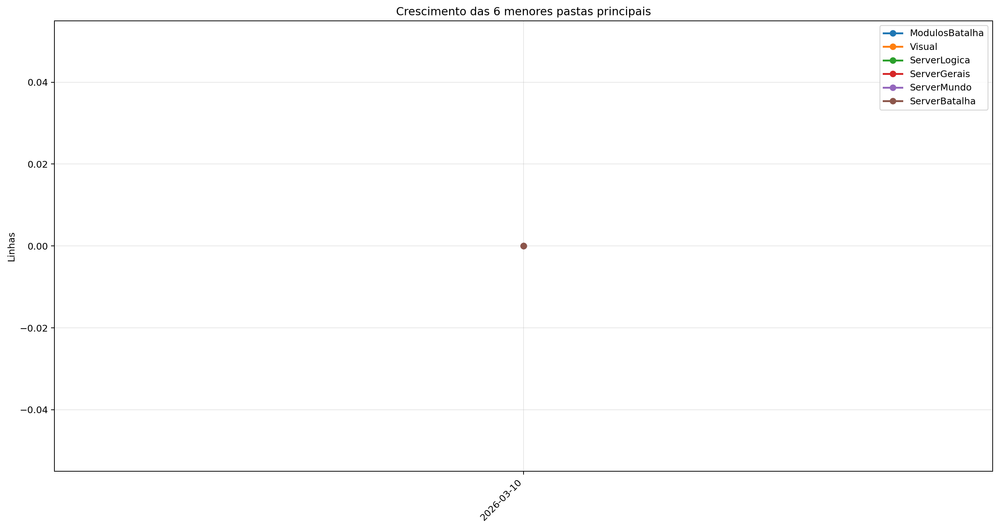

| Rank | Pasta | Subpastas | Arquivos | Linhas gerais | Tamanho (KB) |
|---:|---|---:|---:|---:|---:|
| 1 | `Ferramentas` | 0 | 5 | 3.457 | 125.17 |
| 2 | `Telas` | 1 | 14 | 2.883 | 99.50 |
| 3 | `ModulosMundo` | 2 | 23 | 1.997 | 80.23 |
| 4 | `Prefabs` | 0 | 12 | 1.855 | 64.41 |
| 5 | `ModulosGerais` | 0 | 11 | 818 | 28.68 |
| 6 | `Paineis` | 0 | 6 | 292 | 9.30 |
| 7 | `ModulosBatalha` | 0 | 0 | 0 | 0.00 |
| 8 | `Visual` | 0 | 0 | 0 | 0.00 |
| 9 | `ServerLogica` | 0 | 0 | 0 | 0.00 |
| 10 | `ServerGerais` | 0 | 0 | 0 | 0.00 |
| 11 | `ServerMundo` | 0 | 0 | 0 | 0.00 |
| 12 | `ServerBatalha` | 0 | 0 | 0 | 0.00 |

## 5. Arquitetura

### `Codigo/`

```text
Codigo/
├── Cenas/
│   ├── CenaCarregamento.py
│   ├── CenaCombate.py
│   ├── CenaLogin.py
│   ├── CenaMenu.py
│   ├── CenaMundo.py
│   ├── CenaPreBatalha.py
│   └── ControladorCenas.py
├── Funções/
│   ├── Ffrutas.py
│   └── Fpokebolas.py
├── Geradores/
│   ├── Itens/
│   │   ├── Ferramenta.py
│   │   ├── Fruta.py
│   │   ├── ItemInventario.py
│   │   ├── ItemMundo.py
│   │   ├── Pokebola.py
│   │   ├── Recurso.py
│   │   └── Utilizavel.py
│   ├── Player/
│   │   ├── Controle.py
│   │   ├── Inventario.py
│   │   ├── Perfil.py
│   │   └── Player.py
│   ├── Ator.py
│   ├── Baus.py
│   ├── Dungeon.py
│   ├── Entidade.py
│   ├── Estadio.py
│   ├── Estrutura.py
│   ├── EstruturaNaturais.py
│   ├── GameObjeto.py
│   ├── Loja.py
│   ├── PokemonCombate.py
│   ├── PokemonMundo.py
│   └── Projetil.py
├── Localidades/
│   ├── Bot.py
│   ├── Combate.py
│   ├── GeradorMundo.py
│   └── GeradorPokemon.py
├── Modulos/
│   ├── Auxiliares.py
│   ├── Camera.py
│   ├── Carregamento.py
│   ├── Colisor.py
│   ├── Comandos.py
│   ├── ControladorObjetos.py
│   ├── DesenhaAtor.py
│   ├── Discord.py
│   ├── EfeitosTela.py
│   ├── ElementosHud.py
│   ├── Ferramentas.py
│   ├── FisicaCombate.py
│   ├── LeitorMundo.py
│   ├── Projetil.py
│   ├── SistemaCombate.py
│   ├── Sonoridades.py
│   └── SubtelaOpcoes.py
├── Paineis/
│   ├── FichaItem.py
│   ├── FichaPokemon.py
│   ├── FichaPokemonCombate.py
│   ├── Musicdex.py
│   ├── Pokedex.py
│   └── Skindex.py
├── Prefabs/
│   ├── Arrastavel.py
│   ├── Barra.py
│   ├── Botao.py
│   ├── CaixaTexto.py
│   ├── EfeitosVisuais.py
│   ├── Fluxos.py
│   ├── Imagem.py
│   ├── Mensagem.py
│   ├── Painel.py
│   ├── Terminal.py
│   ├── Texto.py
│   └── Tooltip.py
├── Server/
│   ├── Login.py
│   ├── ServerCombate.py
│   ├── ServerMenu.py
│   └── ServerMundo.py
└── Telas/
    ├── Inventario/
    │   ├── Estatisticas.py
    │   ├── Itens.py
    │   ├── Pokemons.py
    │   └── Unificador.py
    ├── Config.py
    ├── Creditos.py
    ├── Mapa.py
    ├── Opções.py
    ├── TelaCriarPersonagem.py
    ├── TelaLogin.py
    ├── TelaMenu.py
    ├── TelaOperador.py
    ├── TelaServers.py
    └── TelasGenericas.py
```

### `Server/`

```text
Servidor/
└── (pasta não encontrada)
```

### `Dados/`

```text
Dados/
├── Global server - Baus.csv
├── Global server - Itens.csv
└── Global server - Pokemons.csv
```

### `Site/`

```text
Site/
└── public/
```

### `Ferramentas/`

```text
Ferramentas/
├── AtualizadorReadMe.py
└── GeradorRelatorios.py
```

## 6. Ranks

### Top 50 maiores arquivos `.py` por linhas

| Arquivo | Linhas | Tamanho (KB) |
|---|---:|---:|
| `Ferramentas/GeradorRelatorios.py` | 2.117 | 80.24 |
| `Codigo/Modulos/ControladorObjetos.py` | 998 | 45.44 |
| `SimuladorServerJogo/Controle/Cerebro.py` | 659 | 31.15 |
| `Codigo/Telas/TelaServers.py` | 502 | 15.93 |
| `Codigo/Telas/TelasGenericas.py` | 463 | 15.83 |
| `Ferramentas/AtualizadorReadMe.py` | 461 | 16.37 |
| `Outros/Mixer.py` | 460 | 15.31 |
| `SimuladorServerJogo/Controle/EstadoServidor.py` | 442 | 16.23 |
| `SimuladorServerJogo/Geradores/GeradorMundo.py` | 439 | 17.14 |
| `Codigo/Prefabs/Botao.py` | 432 | 14.71 |
| `SimuladorServerJogo/Controle/BancoDados.py` | 427 | 18.89 |
| `Outros/GeradorRelatorios.py` | 418 | 13.08 |
| `Codigo/Telas/TelaCriarPersonagem.py` | 417 | 15.19 |
| `Codigo/Telas/Inventario/Itens.py` | 408 | 16.56 |
| `SimuladorServerJogo/Rotas/Comandos.py` | 389 | 15.47 |
| `Codigo/Modulos/LeitorMundo.py` | 375 | 16.09 |
| `Codigo/Telas/TelaOperador.py` | 348 | 11.88 |
| `Codigo/Geradores/Player/Controle.py` | 324 | 13.79 |
| `SimuladorServerJogo/Rotas/Ativador.py` | 298 | 11.34 |
| `SimuladorServerJogo/Controle/ObjetosMundoServer.py` | 293 | 12.04 |
| `Codigo/Paineis/FichaItem.py` | 292 | 9.30 |
| `Codigo/Modulos/Colisor.py` | 276 | 9.29 |
| `Codigo/Geradores/PokemonMundo.py` | 274 | 13.92 |
| `Codigo/Telas/Config.py` | 257 | 8.31 |
| `Codigo/Modulos/Sonoridades.py` | 247 | 7.94 |
| `Codigo/Prefabs/Terminal.py` | 244 | 8.67 |
| `Codigo/Prefabs/Texto.py` | 235 | 8.08 |
| `Codigo/Geradores/Ator.py` | 227 | 8.31 |
| `SimuladorServerJogo/Logica/AutoridadeCaptura.py` | 219 | 9.01 |
| `Codigo/Geradores/GameObjeto.py` | 216 | 7.89 |
| `Codigo/Cenas/CenaMundo.py` | 207 | 8.94 |
| `Codigo/Telas/TelaLogin.py` | 203 | 5.71 |
| `Codigo/Prefabs/CaixaTexto.py` | 200 | 7.94 |
| `Codigo/Geradores/EstruturaNaturais.py` | 191 | 5.76 |
| `Codigo/Cenas/ControladorCenas.py` | 168 | 5.71 |
| `Codigo/Telas/TelaMenu.py` | 167 | 5.67 |
| `SimuladorServerJogo/Rotas/Atualizador.py` | 166 | 6.84 |
| `Codigo/Prefabs/Mensagem.py` | 161 | 5.36 |
| `Codigo/Modulos/DesenhaAtor.py` | 160 | 5.96 |
| `Codigo/Prefabs/Fluxos.py` | 157 | 4.65 |
| `Codigo/Geradores/Projetil.py` | 154 | 7.72 |
| `Codigo/Server/ServerMundo.py` | 153 | 5.27 |
| `Codigo/Prefabs/Barra.py` | 151 | 5.54 |
| `Codigo/Geradores/Baus.py` | 138 | 5.52 |
| `Codigo/Geradores/Player/Inventario.py` | 138 | 4.98 |
| `Codigo/Prefabs/Painel.py` | 129 | 4.92 |
| `Codigo/Cenas/CenaCarregamento.py` | 121 | 4.05 |
| `SimuladorServerJogo/Geradores/GeradorBaus.py` | 121 | 5.08 |
| `Codigo/Prefabs/Imagem.py` | 113 | 3.61 |
| `Codigo/Geradores/Itens/ItemInventario.py` | 112 | 3.55 |

### Top 20 maiores classes

| Arquivo | Classe | Linhas |
|---|---|---:|
| `Codigo/Modulos/ControladorObjetos.py` | `ControladorObjetos` | 974 |
| `SimuladorServerJogo/Controle/Cerebro.py` | `CerebroServer` | 636 |
| `SimuladorServerJogo/Controle/BancoDados.py` | `BancoDadosMundo` | 399 |
| `Codigo/Telas/Inventario/Itens.py` | `InventarioItens` | 398 |
| `Codigo/Modulos/LeitorMundo.py` | `LeitorMundo` | 357 |
| `Codigo/Telas/TelaCriarPersonagem.py` | `SubtelaCriarPersonagem` | 343 |
| `Codigo/Prefabs/Botao.py` | `Botao` | 318 |
| `Codigo/Geradores/Player/Controle.py` | `Controle` | 312 |
| `Codigo/Paineis/FichaItem.py` | `FichaItem` | 280 |
| `Codigo/Modulos/Colisor.py` | `Colisor` | 262 |
| `Codigo/Geradores/PokemonMundo.py` | `PokemonMundo` | 256 |
| `Codigo/Prefabs/Terminal.py` | `Terminal` | 233 |
| `Codigo/Prefabs/Texto.py` | `Texto` | 229 |
| `Codigo/Geradores/Ator.py` | `Ator` | 207 |
| `Codigo/Geradores/GameObjeto.py` | `GameObjeto` | 201 |
| `Codigo/Prefabs/CaixaTexto.py` | `CaixaTexto` | 195 |
| `Codigo/Cenas/CenaMundo.py` | `CenaMundo` | 184 |
| `Outros/Mixer.py` | `LoopEditor` | 176 |
| `Codigo/Prefabs/Mensagem.py` | `Mensagem` | 158 |
| `Codigo/Cenas/ControladorCenas.py` | `ControladorCenas` | 156 |

### Top 20 maiores funções e métodos

| Arquivo | Nome | Tipo | Linhas |
|---|---|---:|---:|
| `Ferramentas/GeradorRelatorios.py` | `coletar_metricas` | funcao | 252 |
| `Ferramentas/GeradorRelatorios.py` | `gerar_markdown` | funcao | 151 |
| `Ferramentas/GeradorRelatorios.py` | `gerar_graficos` | funcao | 146 |
| `Codigo/Prefabs/Fluxos.py` | `Fluxo.desenhar` | metodo | 141 |
| `Ferramentas/GeradorRelatorios.py` | `analisar_python_ast` | funcao | 132 |
| `Codigo/Telas/TelaMenu.py` | `TelaMenu` | funcao | 131 |
| `SimuladorServerJogo/Rotas/Atualizador.py` | `processar_atualizador_json` | funcao | 122 |
| `Codigo/Prefabs/Botao.py` | `Botao.render` | metodo | 115 |
| `Codigo/Paineis/FichaItem.py` | `FichaItem.__init__` | metodo | 113 |
| `Codigo/Telas/TelaCriarPersonagem.py` | `SubtelaCriarPersonagem._rebuild_layout` | metodo | 112 |
| `Outros/Mixer.py` | `main` | funcao | 109 |
| `Codigo/Telas/Config.py` | `_montar_layout` | funcao | 99 |
| `Ferramentas/GeradorRelatorios.py` | `main` | funcao | 97 |
| `SimuladorServerJogo/Geradores/GeradorMundo.py` | `_executar_world_generator` | funcao | 96 |
| `Codigo/Modulos/LeitorMundo.py` | `LeitorMundo.renderizar_mundo` | metodo | 95 |
| `Outros/GeradorRelatorios.py` | `coletar_metricas` | funcao | 93 |
| `Codigo/Telas/TelaServers.py` | `_montar_layout` | funcao | 89 |
| `SimuladorServerJogo/Rotas/Entrada.py` | `processar_entrada_json` | funcao | 89 |
| `SimuladorServerJogo/Logica/AutoridadeCaptura.py` | `resolver_captura` | funcao | 86 |
| `Codigo/Geradores/GameObjeto.py` | `GameObjeto.aplicar_campo_forca` | metodo | 84 |

### Top 10 arquivos mais importados

| Arquivo | Vezes importado |
|---|---:|
| `Codigo/Prefabs/Texto.py` | 13 |
| `Codigo/Prefabs/Botao.py` | 11 |
| `Codigo/Modulos/Sonoridades.py` | 6 |
| `Codigo/Modulos/EfeitosTela.py` | 6 |
| `Codigo/Geradores/Itens/ItemInventario.py` | 6 |
| `SimuladorServerJogo/Rotas/Ativador.py` | 6 |
| `SimuladorServerJogo/Controle/BancoDados.py` | 6 |
| `Codigo/Modulos/Auxiliares.py` | 5 |
| `Codigo/Geradores/Entidade.py` | 5 |
| `Codigo/Prefabs/Barra.py` | 5 |

### Top 10 arquivos que mais importam

| Arquivo | Arquivos internos importados | Imports totais | Linhas |
|---|---:|---:|---:|
| `Codigo/Cenas/CenaMundo.py` | 11 | 12 | 207 |
| `Codigo/Modulos/ControladorObjetos.py` | 10 | 17 | 998 |
| `Codigo/Cenas/ControladorCenas.py` | 9 | 10 | 168 |
| `SimuladorServerJogo/Controle/Cerebro.py` | 8 | 23 | 659 |
| `SimuladorServerJogo/Rotas/Comandos.py` | 7 | 12 | 389 |
| `Codigo/Geradores/Ator.py` | 6 | 11 | 227 |
| `Codigo/Telas/TelaCriarPersonagem.py` | 6 | 9 | 417 |
| `Codigo/Telas/TelaServers.py` | 6 | 8 | 502 |
| `Codigo/Cenas/CenaMenu.py` | 6 | 7 | 42 |
| `SimuladorServerJogo/Rotas/Atualizador.py` | 5 | 9 | 166 |

### Top 10 maiores arquivos por linhas

| Arquivo | Ext | Linhas |
|---|---:|---:|
| `Ferramentas/GeradorRelatorios.py` | `.py` | 2.117 |
| `SimuladorServerJogo/Geradores/WorldGenerator.java` | `.java` | 1.557 |
| `Dados/Global server - Pokemons.csv` | `.csv` | 1.277 |
| `Codigo/Modulos/ControladorObjetos.py` | `.py` | 998 |
| `SimuladorServerJogo/Controle/Cerebro.py` | `.py` | 659 |
| `Codigo/Telas/TelaServers.py` | `.py` | 502 |
| `Codigo/Telas/TelasGenericas.py` | `.py` | 463 |
| `Ferramentas/AtualizadorReadMe.py` | `.py` | 461 |
| `Outros/Mixer.py` | `.py` | 460 |
| `SimuladorServerJogo/Controle/EstadoServidor.py` | `.py` | 442 |

## 7. Linhas por extensão

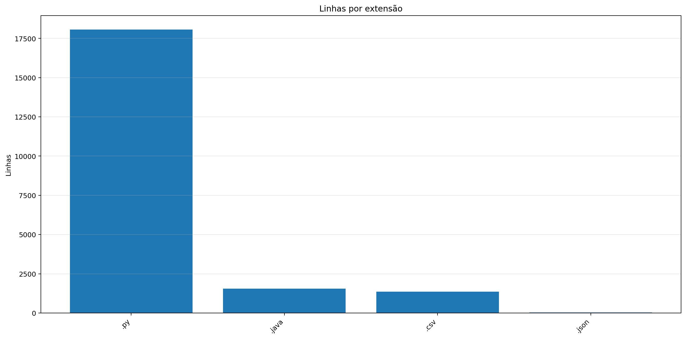

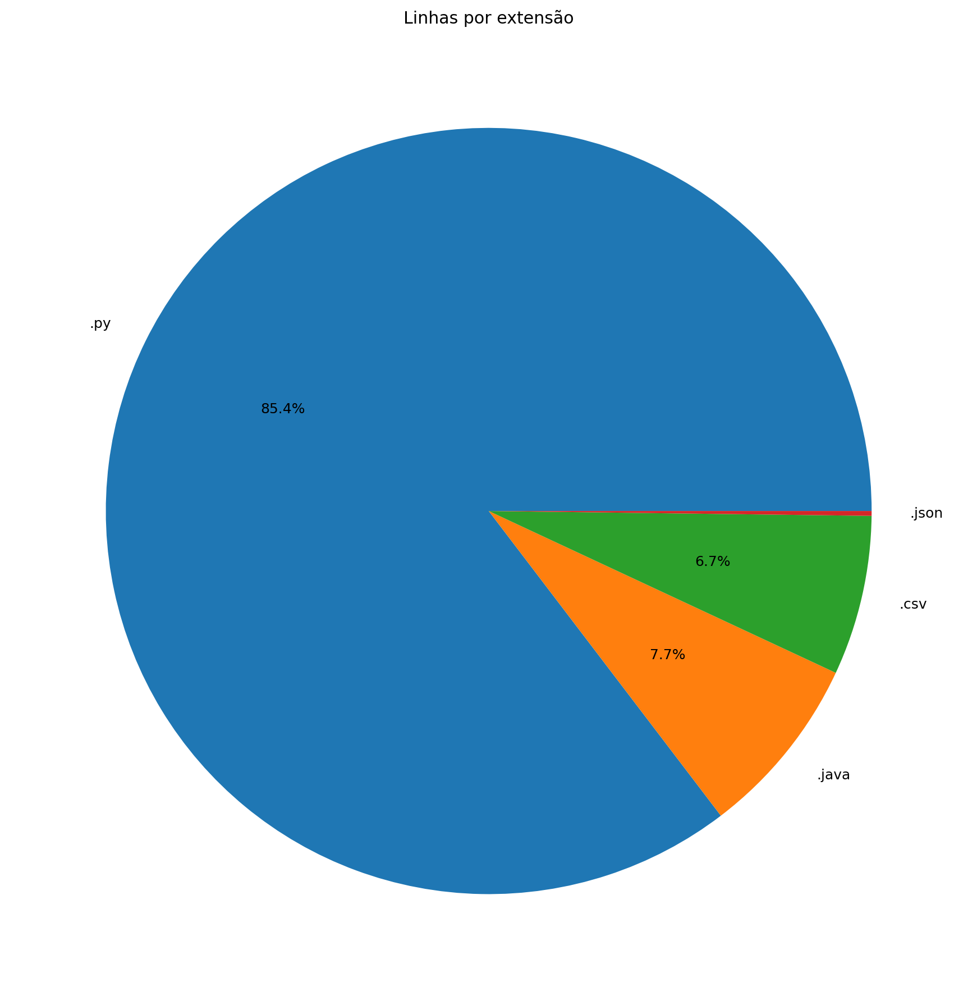

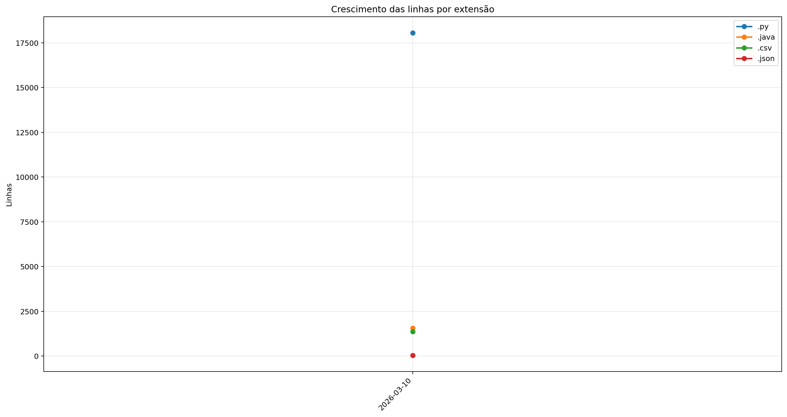

| Ext | Linhas | % das linhas | Arquivos | Peso |
|---:|---:|---:|---:|---:|
| `.py` | 18.057 | 85.91% | 114 | 680.74 KB |
| `.java` | 1.557 | 7.41% | 1 | 62.84 KB |
| `.csv` | 1.364 | 6.49% | 3 | 140.92 KB |
| `.json` | 41 | 0.20% | 3 | 1.14 KB |

## 8. Peso por extensão

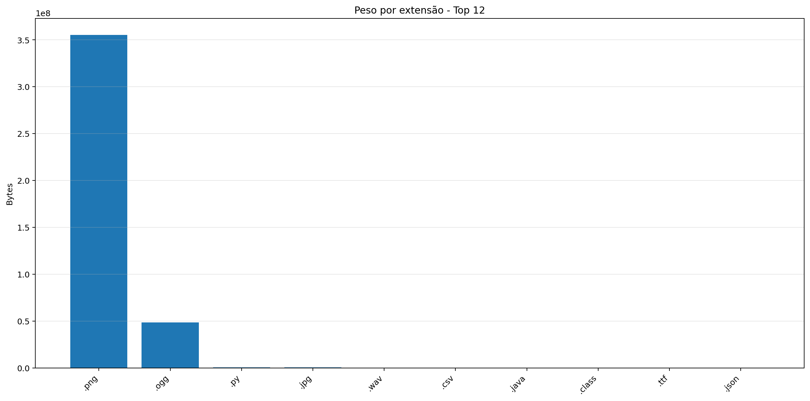

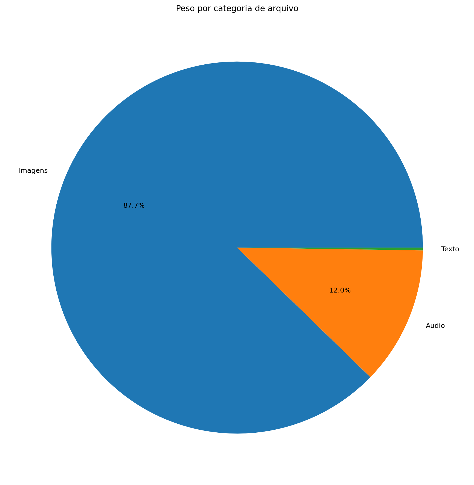

| Ext | Arquivos | Peso | % do jogo |
|---:|---:|---:|---:|
| `.png` | 68.038 | 338.81 MB | 87.57% |
| `.ogg` | 17 | 46.32 MB | 11.97% |
| `.py` | 114 | 680.74 KB | 0.17% |
| `.jpg` | 1 | 623.44 KB | 0.16% |
| `.wav` | 2 | 208.16 KB | 0.05% |
| `.csv` | 3 | 140.92 KB | 0.04% |
| `.java` | 1 | 62.84 KB | 0.02% |
| `.class` | 10 | 46.77 KB | 0.01% |
| `.ttf` | 1 | 26.20 KB | 0.01% |
| `.json` | 3 | 1.14 KB | 0.00% |

## 9. Comparativo com o último relatório

_Sem relatório anterior compatível para montar comparativo._

### Top 3 commits por tamanho de diff

_Sem commits suficientes entre os relatórios para montar top por diff._

## 10. Gráficos de crescimento

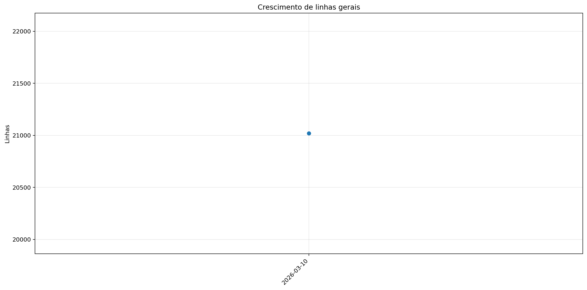

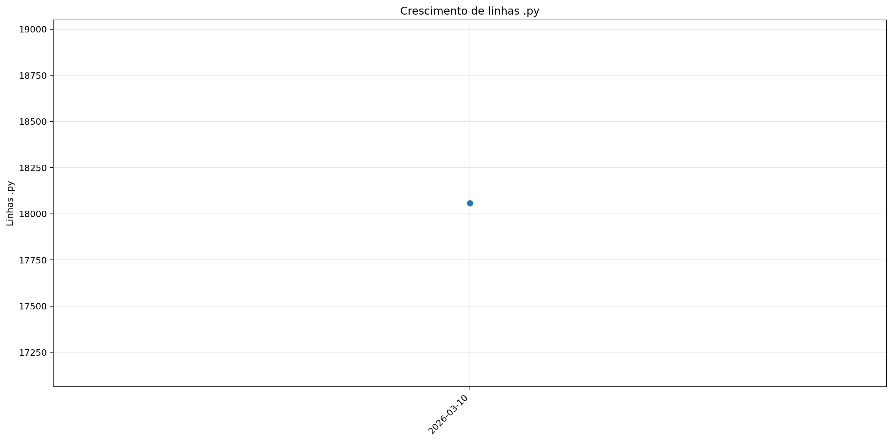

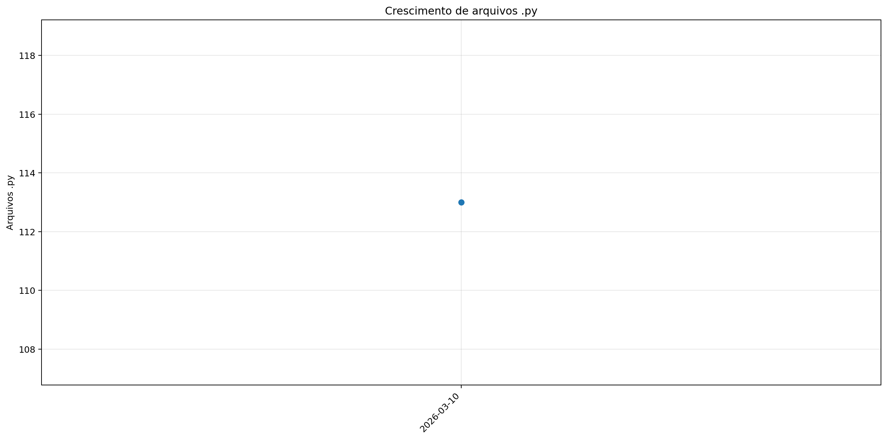

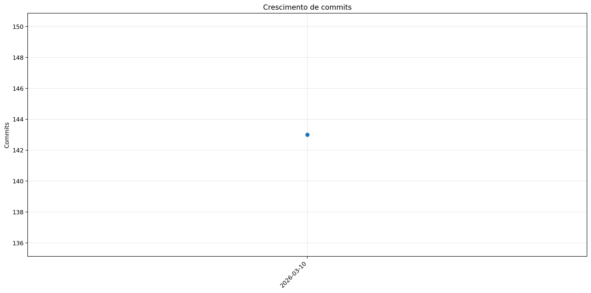

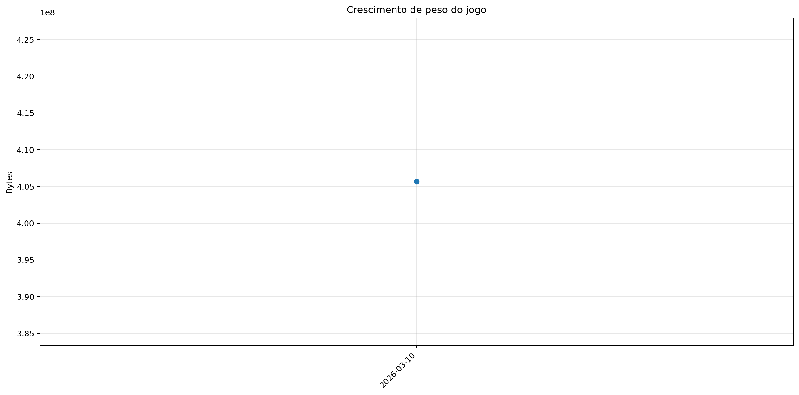

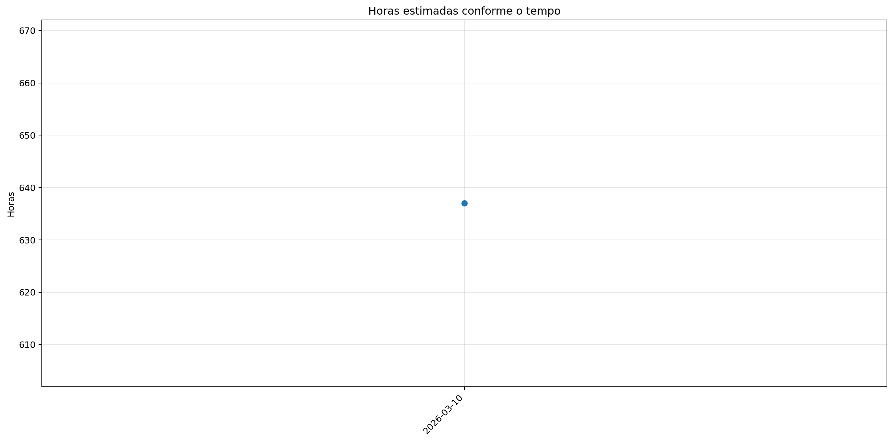
