# Registro

**Relatório:** #1  
**Projeto:** `relatorio_rebuild__55rlwth`  
**Gerado em:** 2026-05-15T10:04:28  
**Modelo de relatório:** 11  
**Autor:** Leon Cunha Alvaro Lopez Soto

## 1. Visão geral

- **Pastas:** 1.155
- **Arquivos:** 68.198
- **Arquivos de texto:** 129
- **Peso dos arquivos de texto:** 1051.12 KB
- **Tamanho total:** 0.378 GB (405.850.581 bytes)
- **Dias desde a criação do projeto:** 12
- **Dias desde a criação oficial:** 286
- **Horas estimadas:** 128.50
- **Linhas totais gerais:** 24.576
- **Commits (projeto):** 165

## 2. Python

- **Arquivos `.py`:** 117
- **Linhas totais:** 19.792
- **Tamanho total `.py`:** 777.12 KB
- **Classes encontradas:** 77
- **Funções encontradas:** 379
- **Métodos encontrados:** 692
- **Total funções + métodos:** 1.071
- **Bibliotecas diferentes usadas:** 31

## 3. Macro áreas

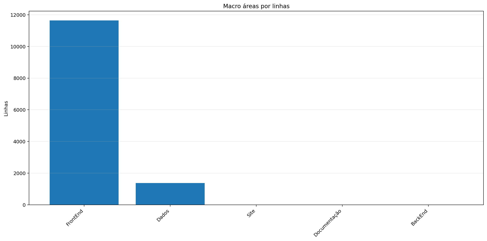

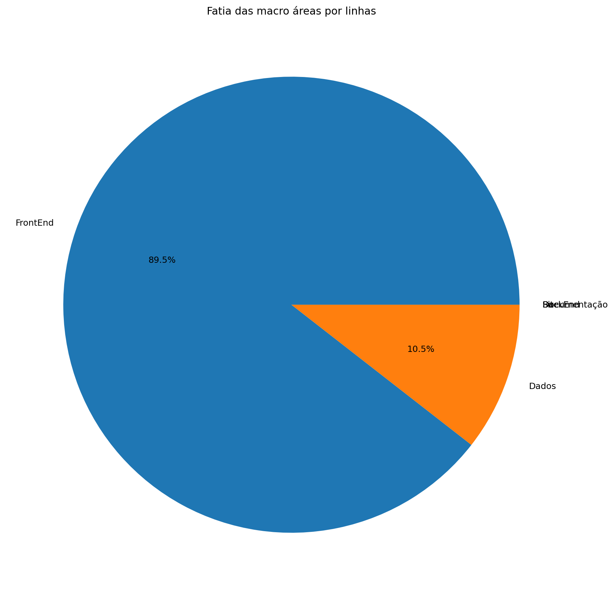

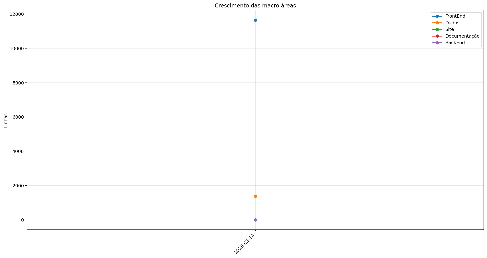

| Rank | Área | Caminho | Subpastas | Arquivos | Linhas gerais | Tamanho (KB) |
|---:|---|---|---:|---:|---:|---:|
| 1 | `FrontEnd` | `Codigo + Game.py` | 11 | 85 | 11.649 | 441.80 |
| 2 | `Dados` | `Dados` | 0 | 4 | 1.372 | 141.06 |
| 3 | `Site` | `Site/src` | 0 | 0 | 0 | 0.00 |
| 4 | `Documentação` | `Documentação` | 0 | 0 | 0 | 0.00 |
| 5 | `BackEnd` | `Servidor + ServidorGeral` | 0 | 0 | 0 | 0.00 |

## 4. Principais pastas

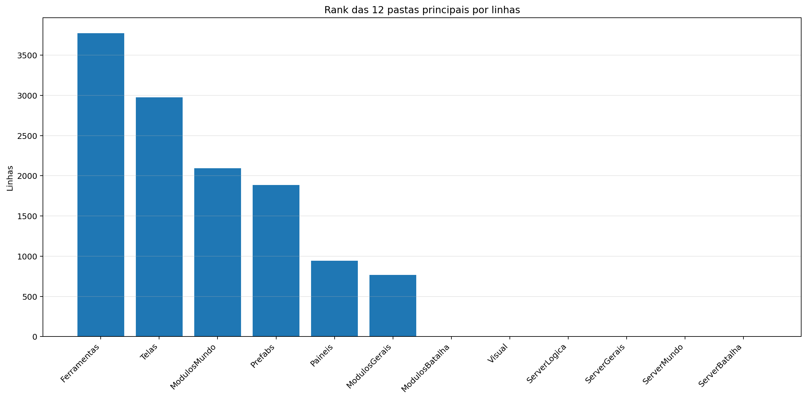

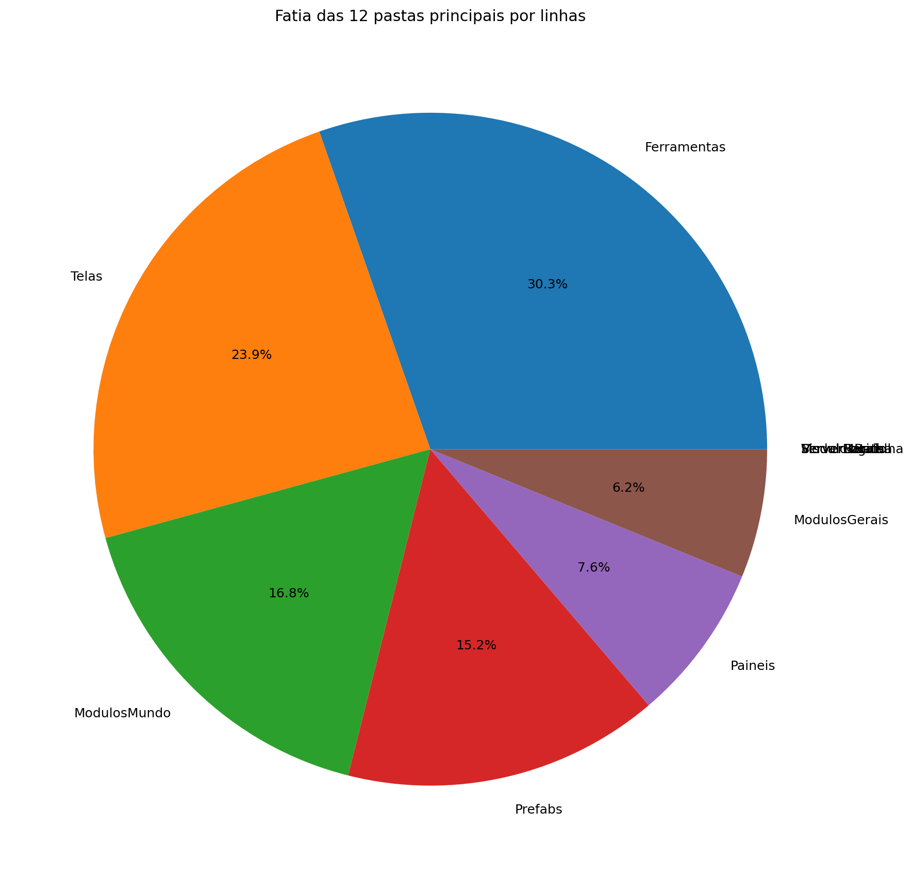

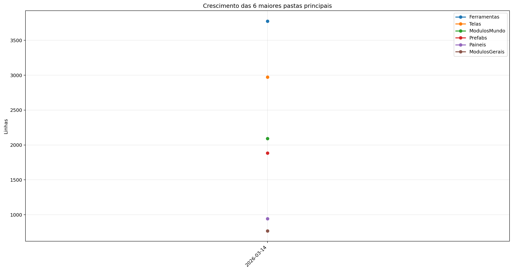

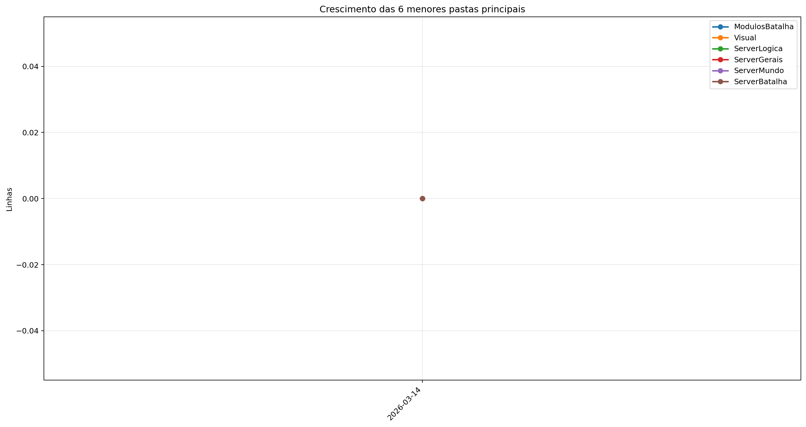

| Rank | Pasta | Subpastas | Arquivos | Linhas gerais | Tamanho (KB) |
|---:|---|---:|---:|---:|---:|
| 1 | `Ferramentas` | 0 | 5 | 3.775 | 135.47 |
| 2 | `Telas` | 1 | 15 | 2.974 | 104.10 |
| 3 | `ModulosMundo` | 1 | 15 | 2.092 | 90.32 |
| 4 | `Prefabs` | 0 | 12 | 1.885 | 65.41 |
| 5 | `Paineis` | 0 | 9 | 944 | 37.42 |
| 6 | `ModulosGerais` | 0 | 11 | 769 | 27.19 |
| 7 | `ModulosBatalha` | 0 | 0 | 0 | 0.00 |
| 8 | `Visual` | 0 | 0 | 0 | 0.00 |
| 9 | `ServerLogica` | 0 | 0 | 0 | 0.00 |
| 10 | `ServerGerais` | 0 | 0 | 0 | 0.00 |
| 11 | `ServerMundo` | 0 | 0 | 0 | 0.00 |
| 12 | `ServerBatalha` | 0 | 0 | 0 | 0.00 |

## 5. Arquitetura

### `Codigo/`

```text
Codigo/
├── Cenas/
│   ├── CenaCarregamento.py
│   ├── CenaCombate.py
│   ├── CenaLogin.py
│   ├── CenaMenu.py
│   ├── CenaMundo.py
│   ├── CenaPreBatalha.py
│   └── ControladorCenas.py
├── Geradores/
│   ├── Player/
│   │   ├── Controle.py
│   │   ├── Inventario.py
│   │   ├── Perfil.py
│   │   └── Player.py
│   ├── Ator.py
│   ├── Baus.py
│   ├── Dungeon.py
│   ├── Estadio.py
│   ├── EstruturaNaturais.py
│   ├── ItemInventario.py
│   ├── ItemMundo.py
│   ├── Loja.py
│   ├── PokemonCombate.py
│   ├── PokemonMundo.py
│   └── Projetil.py
├── Localidades/
│   ├── Bot.py
│   ├── Combate.py
│   ├── GeradorMundo.py
│   └── GeradorPokemon.py
├── Modulos/
│   ├── ControladorMundo/
│   │   ├── ControladorCriaveis.py
│   │   ├── ControladorMundo.py
│   │   ├── ControladorObjetos.py
│   │   ├── ControladorPlayer.py
│   │   ├── LeitorMundo.py
│   │   └── SistemaPacotes.py
│   ├── Auxiliares.py
│   ├── Camera.py
│   ├── Carregamento.py
│   ├── Colisor.py
│   ├── DesenhaAtor.py
│   ├── Discord.py
│   ├── EfeitosTela.py
│   ├── ElementosHud.py
│   ├── Ferramentas.py
│   ├── FisicaCombate.py
│   ├── SistemaCombate.py
│   └── Sonoridades.py
├── Paineis/
│   ├── Container.py
│   ├── FichaItem.py
│   ├── FichaPokemon.py
│   ├── FichaPokemonCombate.py
│   ├── Musicdex.py
│   ├── PainelCraft.py
│   ├── PainelReceitas.py
│   ├── Pokedex.py
│   └── Skindex.py
├── Prefabs/
│   ├── Arrastavel.py
│   ├── Barra.py
│   ├── Botao.py
│   ├── CaixaTexto.py
│   ├── EfeitosVisuais.py
│   ├── Fluxos.py
│   ├── Imagem.py
│   ├── Mensagem.py
│   ├── Painel.py
│   ├── Terminal.py
│   ├── Texto.py
│   └── Tooltip.py
├── Server/
│   ├── Login.py
│   ├── ServerCombate.py
│   ├── ServerMenu.py
│   └── ServerMundo.py
└── Telas/
    ├── Inventario/
    │   ├── Estatisticas.py
    │   ├── InventarioItens.py
    │   ├── Pokemons.py
    │   └── Unificador.py
    ├── Config.py
    ├── Creditos.py
    ├── Mapa.py
    ├── Opções.py
    ├── SubtelaOpcoes.py
    ├── TelaCriarPersonagem.py
    ├── TelaLogin.py
    ├── TelaMenu.py
    ├── TelaOperador.py
    ├── TelaServers.py
    └── TelasGenericas.py
```

### `Server/`

```text
Servidor/
└── (pasta não encontrada)
```

### `Dados/`

```text
Dados/
├── Global server - Baus.csv
├── Global server - Itens.csv
├── Global server - Pokemons.csv
└── Global server - Receitas.json
```

### `Site/`

```text
Site/
└── public/
```

### `Ferramentas/`

```text
Ferramentas/
├── AtualizadorReadMe.py
└── GeradorRelatorios.py
```

## 6. Ranks

### Top 50 maiores arquivos `.py` por linhas

| Arquivo | Linhas | Tamanho (KB) |
|---|---:|---:|
| `Ferramentas/GeradorRelatorios.py` | 2.117 | 80.24 |
| `Outros/GeradorRelatorios.py` | 736 | 23.38 |
| `Codigo/Modulos/ControladorMundo/ControladorObjetos.py` | 582 | 26.51 |
| `Codigo/Geradores/PokemonMundo.py` | 534 | 26.08 |
| `Codigo/Telas/TelaServers.py` | 502 | 15.93 |
| `Codigo/Telas/TelasGenericas.py` | 463 | 15.83 |
| `Ferramentas/AtualizadorReadMe.py` | 461 | 16.37 |
| `Outros/Mixer.py` | 460 | 15.31 |
| `SimuladorServerJogo/Controle/BancoDados.py` | 454 | 20.43 |
| `Codigo/Modulos/Sonoridades.py` | 448 | 11.62 |
| `SimuladorServerJogo/Controle/EstadoServidor.py` | 447 | 16.56 |
| `Codigo/Modulos/ControladorMundo/ControladorPlayer.py` | 445 | 19.57 |
| `Codigo/Prefabs/Botao.py` | 432 | 14.71 |
| `Codigo/Telas/TelaCriarPersonagem.py` | 417 | 15.19 |
| `SimuladorServerJogo/Rotas/Comandos.py` | 408 | 16.37 |
| `Codigo/Telas/Inventario/InventarioItens.py` | 383 | 17.01 |
| `Codigo/Telas/TelaOperador.py` | 352 | 11.98 |
| `Codigo/Geradores/Player/Controle.py` | 347 | 14.73 |
| `SimuladorServerJogo/Geradores/GeradorMundo.py` | 324 | 12.80 |
| `SimuladorServerJogo/Controle/Cerebros/CerebroCentral.py` | 296 | 15.29 |
| `Codigo/Paineis/PainelCraft.py` | 279 | 10.93 |
| `Codigo/Geradores/Ator.py` | 278 | 11.67 |
| `Codigo/Modulos/Colisor.py` | 276 | 9.29 |
| `SimuladorServerJogo/Controle/ObjetosMundoServer.py` | 275 | 19.94 |
| `Codigo/Telas/Config.py` | 257 | 8.31 |
| `Codigo/Paineis/Container.py` | 255 | 9.53 |
| `Codigo/Modulos/ControladorMundo/LeitorMundo.py` | 253 | 12.29 |
| `Codigo/Prefabs/Terminal.py` | 244 | 8.67 |
| `Codigo/Prefabs/Texto.py` | 235 | 8.08 |
| `SimuladorServerJogo/Logica/AutoridadeCaptura.py` | 228 | 9.51 |
| `Codigo/Paineis/PainelReceitas.py` | 222 | 9.30 |
| `SimuladorServerJogo/Geradores/GeradorBaus.py` | 218 | 9.88 |
| `SimuladorServerJogo/Rotas/Ativador.py` | 212 | 9.03 |
| `Codigo/Telas/TelaLogin.py` | 203 | 5.71 |
| `Codigo/Geradores/EstruturaNaturais.py` | 200 | 6.28 |
| `Codigo/Prefabs/CaixaTexto.py` | 200 | 7.94 |
| `Codigo/Server/ServerMundo.py` | 193 | 7.63 |
| `Codigo/Paineis/FichaItem.py` | 188 | 7.66 |
| `Codigo/Cenas/ControladorCenas.py` | 168 | 5.73 |
| `Codigo/Telas/TelaMenu.py` | 167 | 5.67 |
| `Codigo/Prefabs/Mensagem.py` | 161 | 5.36 |
| `Codigo/Modulos/DesenhaAtor.py` | 160 | 5.96 |
| `Codigo/Modulos/ControladorMundo/ControladorCriaveis.py` | 159 | 8.40 |
| `SimuladorServerJogo/Rotas/Atualizador.py` | 158 | 7.10 |
| `Codigo/Prefabs/Fluxos.py` | 157 | 4.65 |
| `SimuladorServerJogo/Controle/Cerebros/CerebroItensMundo.py` | 155 | 11.29 |
| `SimuladorServerJogo/Controle/Cerebros/CerebroPokemons.py` | 152 | 7.83 |
| `Codigo/Prefabs/Barra.py` | 151 | 5.54 |
| `Codigo/Geradores/Player/Inventario.py` | 138 | 4.98 |
| `Codigo/Modulos/ControladorMundo/SistemaPacotes.py` | 136 | 5.58 |

### Top 20 maiores classes

| Arquivo | Classe | Linhas |
|---|---|---:|
| `Codigo/Modulos/ControladorMundo/ControladorObjetos.py` | `ControladorObjetos` | 561 |
| `Codigo/Geradores/PokemonMundo.py` | `Pokemon` | 512 |
| `Codigo/Modulos/ControladorMundo/ControladorPlayer.py` | `ControladorPlayer` | 426 |
| `SimuladorServerJogo/Controle/BancoDados.py` | `BancoDadosMundo` | 426 |
| `Codigo/Telas/Inventario/InventarioItens.py` | `InventarioItens` | 368 |
| `Codigo/Telas/TelaCriarPersonagem.py` | `SubtelaCriarPersonagem` | 343 |
| `Codigo/Geradores/Player/Controle.py` | `Controle` | 335 |
| `Codigo/Prefabs/Botao.py` | `Botao` | 318 |
| `Codigo/Paineis/PainelCraft.py` | `PainelCraft` | 268 |
| `SimuladorServerJogo/Controle/Cerebros/CerebroCentral.py` | `CerebroCentral` | 265 |
| `Codigo/Modulos/Colisor.py` | `Colisor` | 262 |
| `Codigo/Geradores/Ator.py` | `Ator` | 259 |
| `Codigo/Paineis/Container.py` | `Container` | 246 |
| `Codigo/Modulos/ControladorMundo/LeitorMundo.py` | `LeitorMundo` | 239 |
| `Codigo/Prefabs/Terminal.py` | `Terminal` | 233 |
| `Codigo/Prefabs/Texto.py` | `Texto` | 229 |
| `Codigo/Paineis/PainelReceitas.py` | `PainelReceitas` | 208 |
| `Codigo/Prefabs/CaixaTexto.py` | `CaixaTexto` | 195 |
| `Codigo/Paineis/FichaItem.py` | `FichaItem` | 176 |
| `Outros/Mixer.py` | `LoopEditor` | 176 |

### Top 20 maiores funções e métodos

| Arquivo | Nome | Tipo | Linhas |
|---|---|---:|---:|
| `Ferramentas/GeradorRelatorios.py` | `coletar_metricas` | funcao | 252 |
| `Outros/GeradorRelatorios.py` | `coletar_metricas` | funcao | 168 |
| `Ferramentas/GeradorRelatorios.py` | `gerar_markdown` | funcao | 151 |
| `Ferramentas/GeradorRelatorios.py` | `gerar_graficos` | funcao | 146 |
| `Codigo/Prefabs/Fluxos.py` | `Fluxo.desenhar` | metodo | 141 |
| `Ferramentas/GeradorRelatorios.py` | `analisar_python_ast` | funcao | 132 |
| `Codigo/Telas/TelaMenu.py` | `TelaMenu` | funcao | 131 |
| `Codigo/Prefabs/Botao.py` | `Botao.render` | metodo | 115 |
| `SimuladorServerJogo/Rotas/Atualizador.py` | `processar_atualizador_json` | funcao | 115 |
| `Codigo/Telas/TelaCriarPersonagem.py` | `SubtelaCriarPersonagem._rebuild_layout` | metodo | 112 |
| `Outros/Mixer.py` | `main` | funcao | 109 |
| `SimuladorServerJogo/Controle/Cerebros/CerebroItensMundo.py` | `CerebroItensMundo.executar_tick` | metodo | 101 |
| `Codigo/Telas/Config.py` | `_montar_layout` | funcao | 99 |
| `Ferramentas/GeradorRelatorios.py` | `main` | funcao | 97 |
| `SimuladorServerJogo/Geradores/GeradorMundo.py` | `_executar_world_generator` | funcao | 96 |
| `SimuladorServerJogo/Logica/AutoridadeCaptura.py` | `resolver_captura` | funcao | 95 |
| `Codigo/Telas/TelaServers.py` | `_montar_layout` | funcao | 89 |
| `SimuladorServerJogo/Rotas/Entrada.py` | `processar_entrada_json` | funcao | 89 |
| `Codigo/Prefabs/Texto.py` | `Texto._ensure_structure` | metodo | 81 |
| `Codigo/Telas/Inventario/InventarioItens.py` | `InventarioItens.atualizar` | metodo | 76 |

### Top 10 arquivos mais importados

| Arquivo | Vezes importado |
|---|---:|
| `Codigo/Prefabs/Texto.py` | 16 |
| `Codigo/Prefabs/Botao.py` | 12 |
| `SimuladorServerJogo/Controle/BancoDados.py` | 11 |
| `Codigo/Geradores/ItemInventario.py` | 10 |
| `SimuladorServerJogo/Rotas/Ativador.py` | 10 |
| `SimuladorServerJogo/Controle/EstadoServidor.py` | 9 |
| `Codigo/Modulos/Colisor.py` | 8 |
| `SimuladorServerJogo/Controle/ObjetosMundoServer.py` | 8 |
| `Codigo/Modulos/EfeitosTela.py` | 6 |
| `Codigo/Modulos/Auxiliares.py` | 5 |

### Top 10 arquivos que mais importam

| Arquivo | Arquivos internos importados | Imports totais | Linhas |
|---|---:|---:|---:|
| `SimuladorServerJogo/Controle/Cerebros/CerebroCentral.py` | 13 | 21 | 296 |
| `Codigo/Cenas/CenaMundo.py` | 10 | 11 | 124 |
| `Codigo/Cenas/ControladorCenas.py` | 9 | 10 | 168 |
| `Codigo/Modulos/ControladorMundo/ControladorObjetos.py` | 8 | 14 | 582 |
| `Codigo/Telas/Inventario/InventarioItens.py` | 8 | 11 | 383 |
| `SimuladorServerJogo/Rotas/Comandos.py` | 7 | 12 | 408 |
| `Codigo/Modulos/ControladorMundo/ControladorPlayer.py` | 6 | 12 | 445 |
| `SimuladorServerJogo/Controle/EstadoServidor.py` | 6 | 11 | 447 |
| `SimuladorServerJogo/Rotas/Atualizador.py` | 6 | 10 | 158 |
| `Codigo/Telas/TelaCriarPersonagem.py` | 6 | 9 | 417 |

### Top 10 maiores arquivos por linhas

| Arquivo | Ext | Linhas |
|---|---:|---:|
| `SimuladorServerJogo/Geradores/WorldGenerator.java` | `.java` | 2.711 |
| `Ferramentas/GeradorRelatorios.py` | `.py` | 2.117 |
| `Dados/Global server - Pokemons.csv` | `.csv` | 1.277 |
| `Outros/GeradorRelatorios.py` | `.py` | 736 |
| `SimuladorServerJogo/Regras/Geracao.json` | `.json` | 658 |
| `Codigo/Modulos/ControladorMundo/ControladorObjetos.py` | `.py` | 582 |
| `Codigo/Geradores/PokemonMundo.py` | `.py` | 534 |
| `Codigo/Telas/TelaServers.py` | `.py` | 502 |
| `Codigo/Telas/TelasGenericas.py` | `.py` | 463 |
| `Ferramentas/AtualizadorReadMe.py` | `.py` | 461 |

## 7. Linhas por extensão

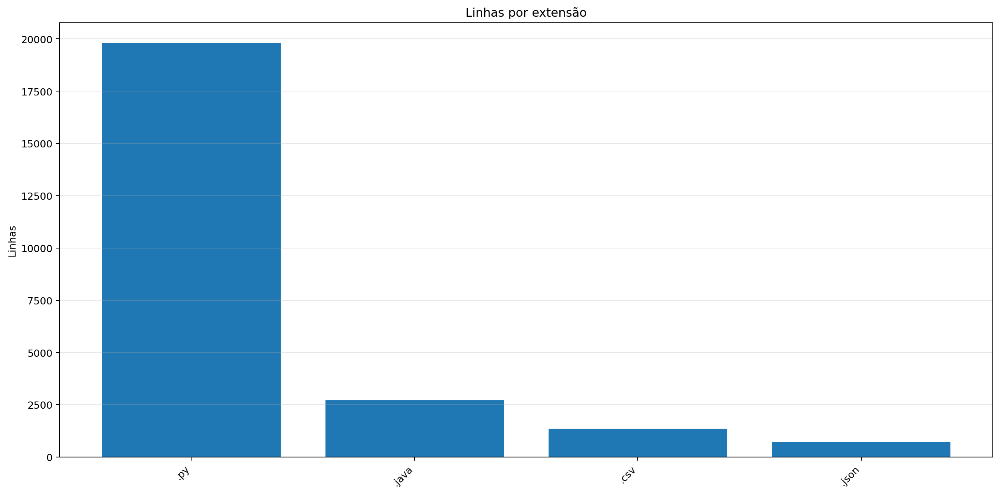

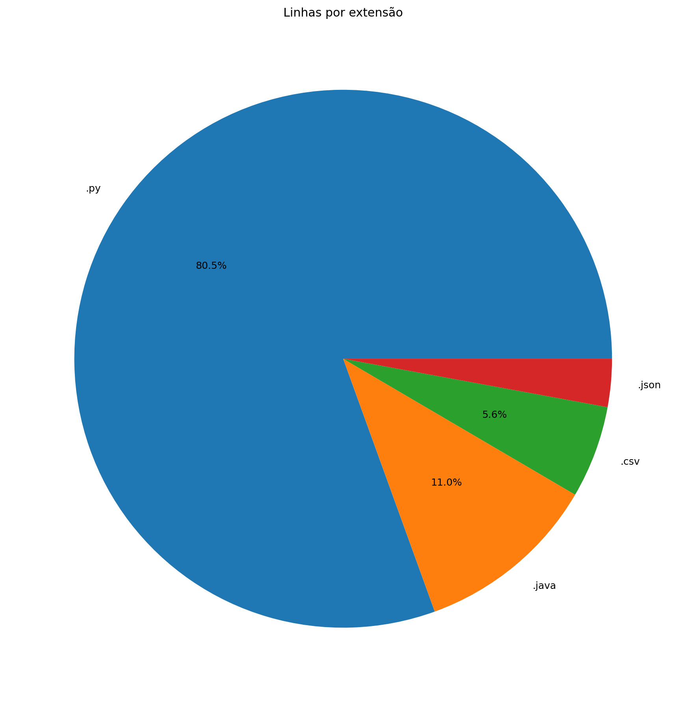

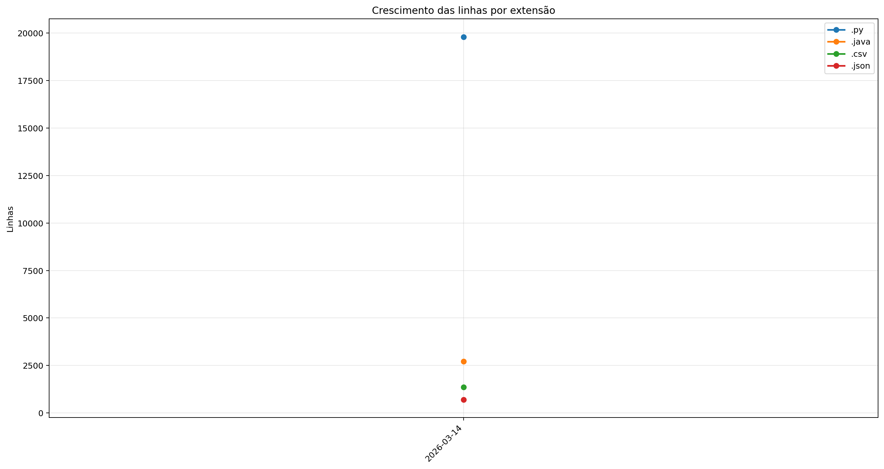

| Ext | Linhas | % das linhas | Arquivos | Peso |
|---:|---:|---:|---:|---:|
| `.py` | 19.792 | 80.53% | 117 | 777.12 KB |
| `.java` | 2.711 | 11.03% | 1 | 117.10 KB |
| `.csv` | 1.364 | 5.55% | 3 | 140.92 KB |
| `.json` | 709 | 2.88% | 5 | 15.98 KB |

## 8. Peso por extensão


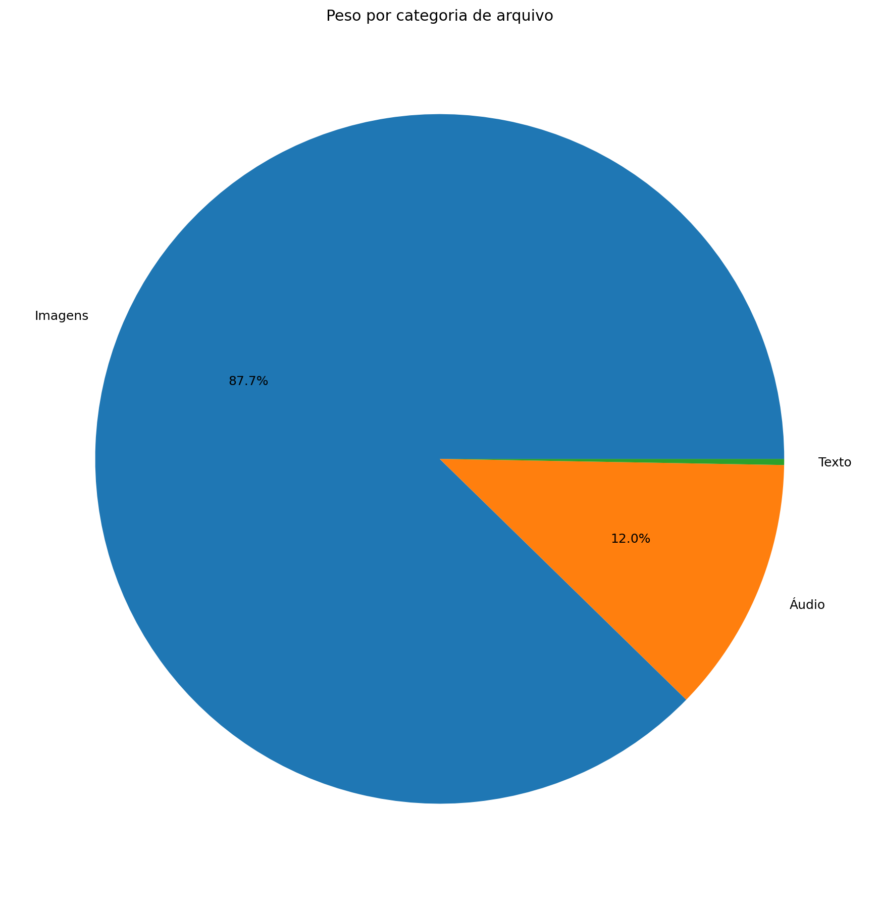

| Ext | Arquivos | Peso | % do jogo |
|---:|---:|---:|---:|
| `.png` | 68.038 | 338.81 MB | 87.54% |
| `.ogg` | 17 | 46.32 MB | 11.97% |
| `.py` | 117 | 777.12 KB | 0.20% |
| `.jpg` | 1 | 623.44 KB | 0.16% |
| `.wav` | 2 | 208.16 KB | 0.05% |
| `.csv` | 3 | 140.92 KB | 0.04% |
| `.java` | 1 | 117.10 KB | 0.03% |
| `.class` | 10 | 46.77 KB | 0.01% |
| `.ttf` | 1 | 26.20 KB | 0.01% |
| `.json` | 5 | 15.98 KB | 0.00% |

## 9. Comparativo com o último relatório

_Sem relatório anterior compatível para montar comparativo._

### Top 3 commits por tamanho de diff

_Sem commits suficientes entre os relatórios para montar top por diff._

## 10. Gráficos de crescimento

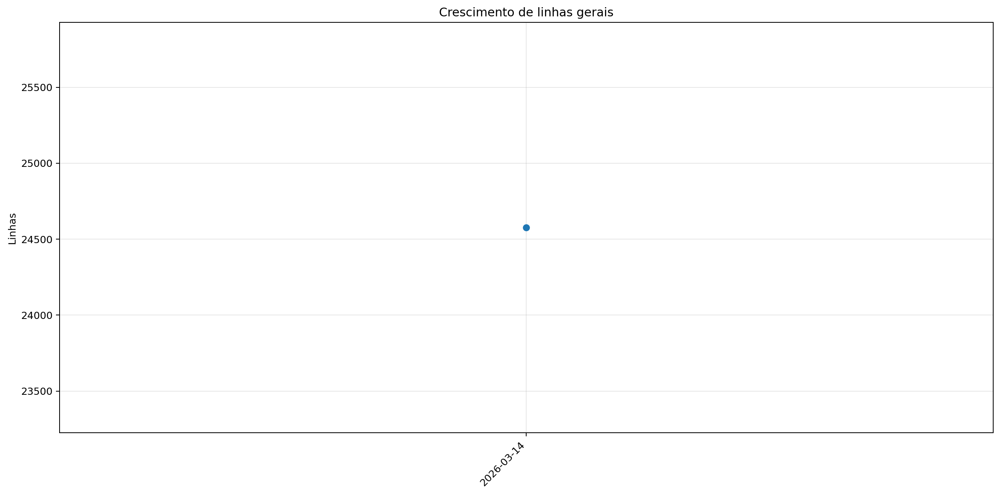

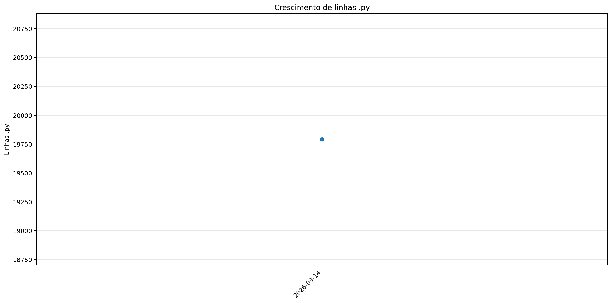

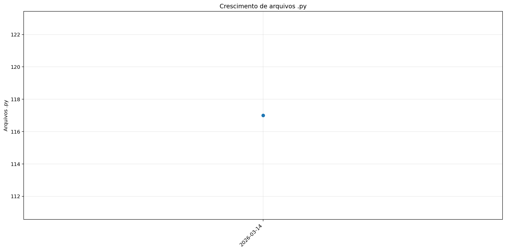


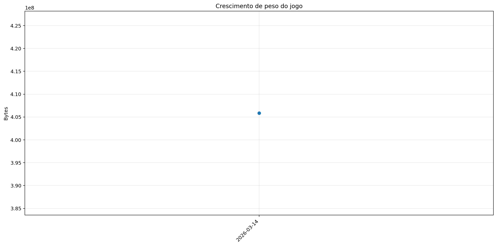

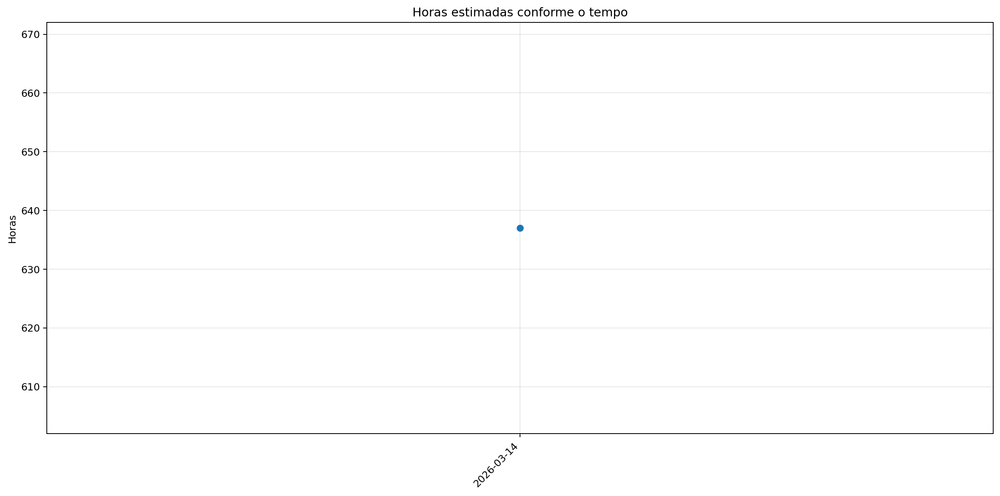
