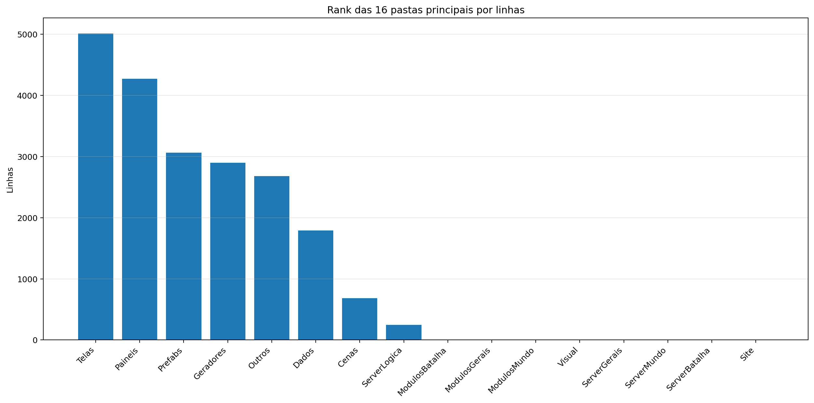
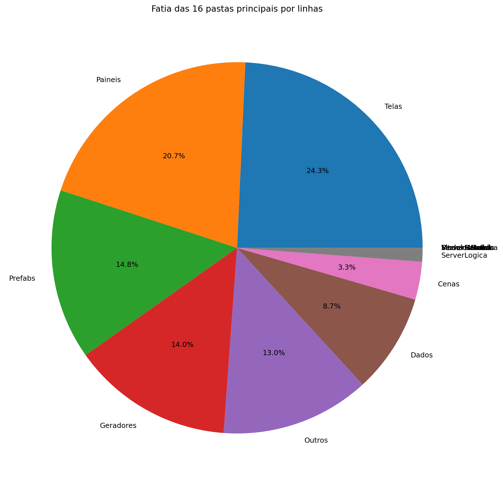
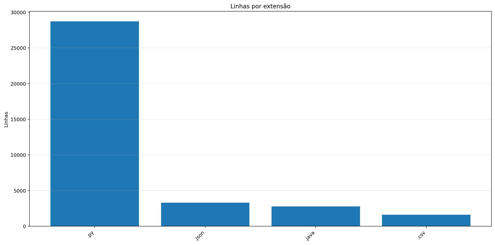
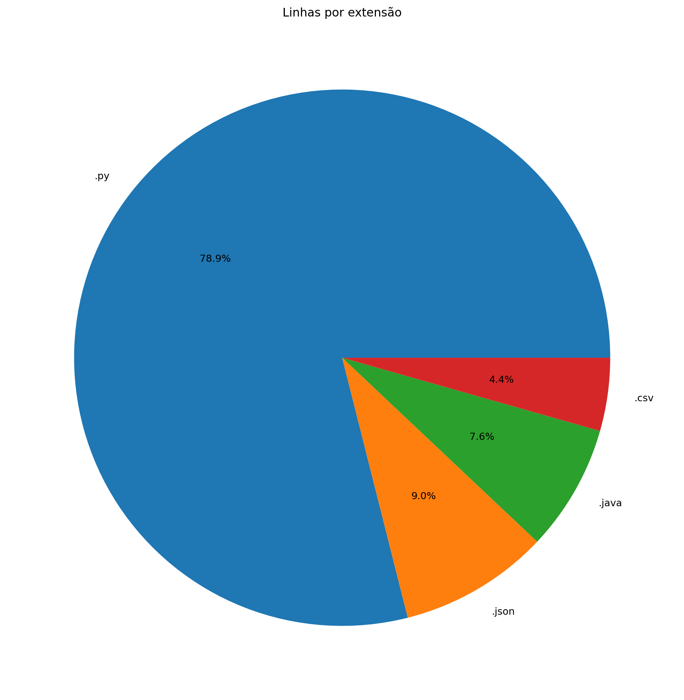
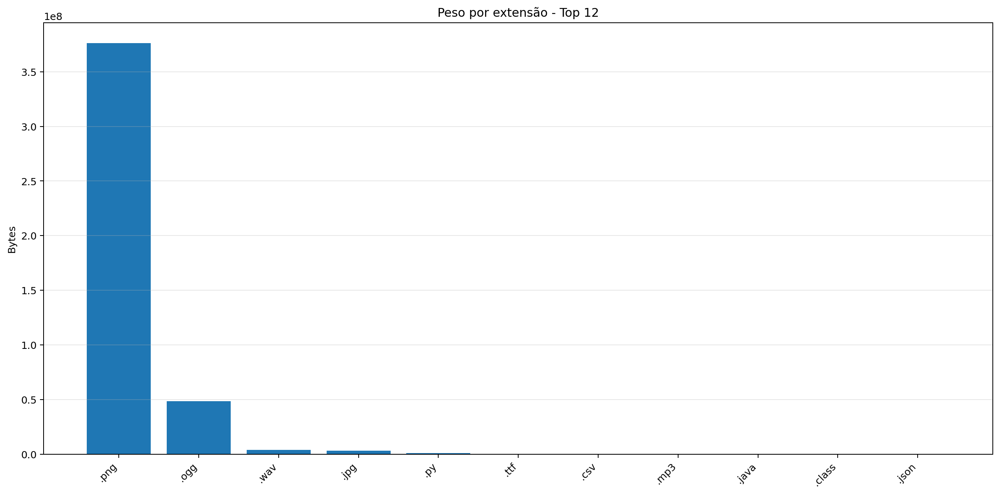
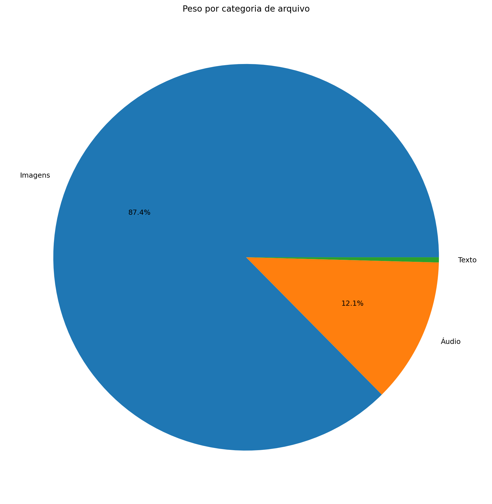
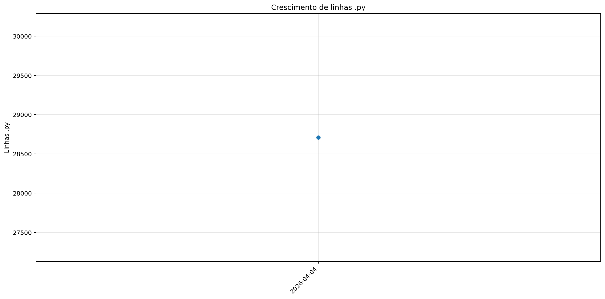
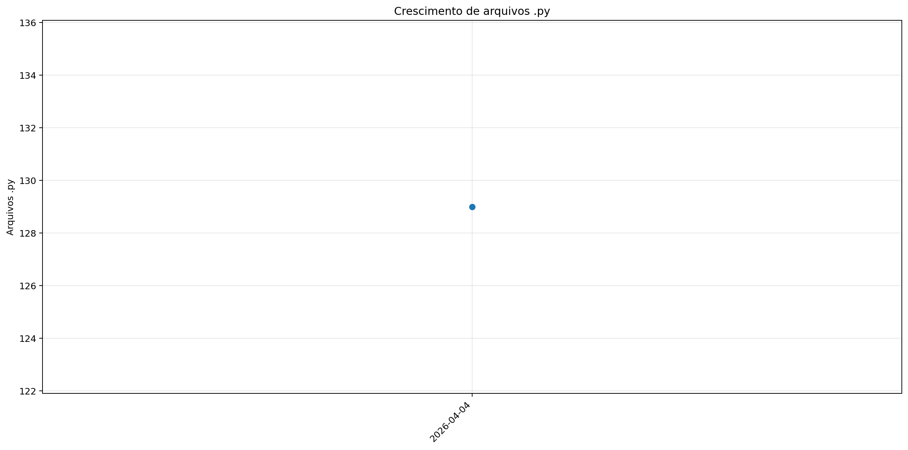
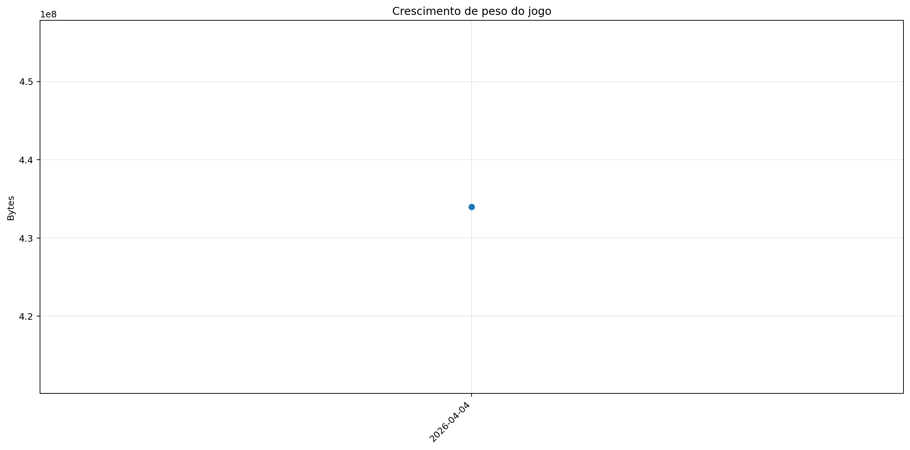

# Registro

**Relatório:** #1  
**Projeto:** `relatorio_rebuild_tcf2c9sf`  
**Gerado em:** 2026-04-29T23:39:42  
**Modelo de relatório:** 10  
**Autor:** Leon Cunha Alvaro Lopez Soto

## 1. Visão geral

- **Pastas:** 1.178
- **Arquivos:** 68.990
- **Arquivos de texto:** 149
- **Peso dos arquivos de texto:** 1536.40 KB
- **Tamanho total:** 0.404 GB (433.973.061 bytes)
- **Dias desde a criação do projeto:** 33
- **Dias desde a criação oficial:** 307
- **Horas estimadas:** 313.00
- **Linhas totais gerais:** 36.371
- **Commits (projeto):** 257

## 2. Python

- **Arquivos `.py`:** 129
- **Linhas totais:** 28.710
- **Tamanho total `.py`:** 1178.84 KB
- **Classes encontradas:** 101
- **Funções encontradas:** 392
- **Métodos encontrados:** 1.209
- **Total funções + métodos:** 1.601
- **Bibliotecas diferentes usadas:** 39

## 3. Principais pastas





| Rank | Pasta | Subpastas | Arquivos | Linhas gerais | Tamanho (KB) |
|---:|---|---:|---:|---:|---:|
| 1 | `Telas` | 1 | 16 | 5.013 | 197.51 |
| 2 | `Paineis` | 0 | 13 | 4.270 | 174.77 |
| 3 | `Prefabs` | 0 | 14 | 3.060 | 110.19 |
| 4 | `Geradores` | 1 | 17 | 2.897 | 130.30 |
| 5 | `Outros` | 0 | 4 | 2.679 | 97.35 |
| 6 | `Dados` | 0 | 8 | 1.790 | 161.30 |
| 7 | `Cenas` | 0 | 7 | 681 | 27.14 |
| 8 | `ServerLogica` | 0 | 3 | 247 | 12.02 |
| 9 | `ModulosBatalha` | 0 | 0 | 0 | 0.00 |
| 10 | `ModulosGerais` | 0 | 0 | 0 | 0.00 |
| 11 | `ModulosMundo` | 0 | 0 | 0 | 0.00 |
| 12 | `Visual` | 0 | 0 | 0 | 0.00 |
| 13 | `ServerGerais` | 0 | 0 | 0 | 0.00 |
| 14 | `ServerMundo` | 0 | 0 | 0 | 0.00 |
| 15 | `ServerBatalha` | 0 | 0 | 0 | 0.00 |
| 16 | `Site` | 0 | 0 | 0 | 0.00 |

## 4. Arquitetura

### `Codigo/`

```text
Codigo/
├── Cenas/
│   ├── CenaCarregamento.py
│   ├── CenaCombate.py
│   ├── CenaLogin.py
│   ├── CenaMenu.py
│   ├── CenaMundo.py
│   ├── CenaPreBatalha.py
│   └── ControladorCenas.py
├── Geradores/
│   ├── Player/
│   │   ├── Controle.py
│   │   ├── Inventario.py
│   │   ├── Perfil.py
│   │   └── Player.py
│   ├── Ator.py
│   ├── Baus.py
│   ├── Dungeon.py
│   ├── Estadio.py
│   ├── EstruturaNaturais.py
│   ├── ItemInventario.py
│   ├── ItemMundo.py
│   ├── Loja.py
│   ├── PokemonBatalha.py
│   ├── PokemonInventario.py
│   ├── PokemonMundo.py
│   ├── Projetil.py
│   └── XpMundo.py
├── InteracaoNPC/
│   ├── Hans.json
│   ├── Josefa.json
│   └── Kleber.json
├── Localidades/
│   ├── Bot.py
│   ├── Combate.py
│   ├── GeradorMundo.py
│   └── GeradorPokemon.py
├── Modulos/
│   ├── ControladorMundo/
│   │   ├── ControladorAtores.py
│   │   ├── ControladorCriaveis.py
│   │   ├── ControladorMundo.py
│   │   ├── ControladorObjetos.py
│   │   ├── ControladorPlayer.py
│   │   ├── LeitorMundo.py
│   │   └── SistemaPacotes.py
│   ├── Arena.py
│   ├── Auxiliares.py
│   ├── Camera.py
│   ├── Carregamento.py
│   ├── Colisor.py
│   ├── ControladorBatalha.py
│   ├── DesenhaAtor.py
│   ├── Discord.py
│   ├── EfeitosTela.py
│   ├── ElementosHud.py
│   ├── ExecutaveisPoção.py
│   ├── SistemaCombate.py
│   └── Sonoridades.py
├── Paineis/
│   ├── Container.py
│   ├── FichaAtaque.py
│   ├── FichaItem.py
│   ├── FichaPokemon.py
│   ├── FichaPokemonCombate.py
│   ├── Musicdex.py
│   ├── PainelArvoreHabilidades.py
│   ├── PainelAuxiliarPoke.py
│   ├── PainelCraft.py
│   ├── PainelReceitas.py
│   ├── PainelTimes.py
│   ├── Pokedex.py
│   └── Skindex.py
├── Prefabs/
│   ├── Arrastavel.py
│   ├── Barra.py
│   ├── BarraPesquisa.py
│   ├── Botao.py
│   ├── CaixaTexto.py
│   ├── EfeitosVisuais.py
│   ├── Fluxos.py
│   ├── Imagem.py
│   ├── Mensagem.py
│   ├── Opcoes.py
│   ├── Painel.py
│   ├── Terminal.py
│   ├── Texto.py
│   └── Tooltip.py
├── Server/
│   ├── Login.py
│   ├── ServerCombate.py
│   ├── ServerMenu.py
│   └── ServerMundo.py
└── Telas/
    ├── Inventario/
    │   ├── Estatisticas.py
    │   ├── InventarioItens.py
    │   ├── InventarioPokemons.py
    │   └── Unificador.py
    ├── Config.py
    ├── Creditos.py
    ├── Mapa.py
    ├── Opções.py
    ├── SubtelaOpcoes.py
    ├── TelaCriarPersonagem.py
    ├── TelaDialogo.py
    ├── TelaLogin.py
    ├── TelaMenu.py
    ├── TelaOperador.py
    ├── TelaServers.py
    └── TelasGenericas.py
```

### `Server/`

```text
SimuladorServerJogo/
├── Controle/
│   ├── Cerebros/
│   │   ├── CerebroBaus.py
│   │   ├── CerebroCentral.py
│   │   ├── CerebroEstruturasNaturais.py
│   │   ├── CerebroItensMundo.py
│   │   ├── CerebroNPCs.py
│   │   ├── CerebroPokemons.py
│   │   ├── CerebroProjeteis.py
│   │   └── CerebroXpMundo.py
│   ├── BancoDados.py
│   ├── EstadoServidor.py
│   ├── ObjetosMundoServer.py
│   ├── PacotesTick.py
│   ├── ServicoInventario.py
│   └── TiqueServidor.py
├── Geradores/
│   ├── Regras/
│   │   └── Geracao.json
│   ├── GeradorBaus.py
│   ├── GeradorMundo.py
│   ├── GeradorPokemon.py
│   ├── WorldGenerator$1.class
│   ├── WorldGenerator$Biome.class
│   ├── WorldGenerator$BiomeRule.class
│   ├── WorldGenerator$Generator.class
│   ├── WorldGenerator$NaturalStructure.class
│   ├── WorldGenerator$Poi.class
│   ├── WorldGenerator$PoiType.class
│   ├── WorldGenerator$Rules$BiomeStructureOverride.class
│   ├── WorldGenerator$Rules.class
│   ├── WorldGenerator$SimpleJson$Parser.class
│   ├── WorldGenerator$SimpleJson.class
│   ├── WorldGenerator$StructureRule.class
│   ├── WorldGenerator$Tile.class
│   ├── WorldGenerator.class
│   └── WorldGenerator.java
├── Logica/
│   ├── AutoridadeCaptura.py
│   ├── ExecutesFrutas.py
│   └── ExecutesPokebolas.py
├── Regras/
│   ├── Cerebro.json
│   ├── EstruturasNaturais.json
│   ├── Geracao.json
│   ├── Loader.py
│   ├── Mundo.json
│   └── Player.json
└── Rotas/
    ├── Ativador.py
    ├── Atualizador.py
    ├── Comandos.py
    ├── Entrada.py
    ├── ServerOperar.py
    └── Terminal.py
```

### `Dados/`

```text
Dados/
├── Pokemon Global Server - Ataques.csv
├── Pokemon Global Server - Baus.csv
├── Pokemon Global Server - Equipaveis.csv
├── Pokemon Global Server - Itens.csv
├── Pokemon Global Server - NPC Combatente.csv
├── Pokemon Global Server - NPC Vendedor.csv
├── Pokemon Global Server - Pokemons.csv
└── Pokemon Global Server - Receitas.json
```

### `Site/`

```text
Site/
└── (pasta não encontrada)
```

### `Outros/`

```text
Outros/
├── AtualizadorReadMe.py
├── ConfigFixa.py
├── GeradorRelatorios.py
└── Mixer.py
```

## 5. Ranks

### Top 50 maiores arquivos `.py` por linhas

| Arquivo | Linhas | Tamanho (KB) |
|---|---:|---:|
| `Outros/GeradorRelatorios.py` | 1.757 | 65.51 |
| `Codigo/Paineis/FichaPokemon.py` | 1.155 | 51.24 |
| `Codigo/Telas/Inventario/InventarioPokemons.py` | 1.064 | 48.40 |
| `Codigo/Geradores/PokemonMundo.py` | 678 | 33.45 |
| `Codigo/Paineis/Container.py` | 637 | 23.33 |
| `Codigo/Modulos/ControladorMundo/ControladorObjetos.py` | 622 | 29.37 |
| `SimuladorServerJogo/Controle/BancoDados.py` | 570 | 26.52 |
| `Codigo/Modulos/ControladorMundo/ControladorPlayer.py` | 560 | 25.19 |
| `SimuladorServerJogo/Controle/EstadoServidor.py` | 554 | 22.10 |
| `Codigo/Prefabs/Texto.py` | 548 | 20.48 |
| `Codigo/Paineis/PainelArvoreHabilidades.py` | 547 | 26.81 |
| `SimuladorServerJogo/Rotas/Comandos.py` | 546 | 21.79 |
| `Codigo/Telas/Inventario/InventarioItens.py` | 509 | 23.76 |
| `Codigo/Telas/TelaServers.py` | 505 | 16.02 |
| `Codigo/Modulos/Sonoridades.py` | 488 | 12.88 |
| `Codigo/Prefabs/Botao.py` | 477 | 17.50 |
| `Codigo/Telas/TelasGenericas.py` | 463 | 15.83 |
| `Outros/AtualizadorReadMe.py` | 461 | 16.36 |
| `SimuladorServerJogo/Geradores/GeradorPokemon.py` | 461 | 18.05 |
| `Outros/Mixer.py` | 460 | 15.31 |
| `Codigo/Paineis/PainelReceitas.py` | 455 | 15.29 |
| `Codigo/Telas/TelaDialogo.py` | 419 | 18.88 |
| `SimuladorServerJogo/Controle/ObjetosMundoServer.py` | 418 | 27.05 |
| `Codigo/Telas/TelaCriarPersonagem.py` | 417 | 15.18 |
| `Codigo/Paineis/PainelCraft.py` | 412 | 16.04 |
| `Codigo/Geradores/Ator.py` | 406 | 17.70 |
| `Codigo/Telas/Inventario/Estatisticas.py` | 401 | 17.82 |
| `Codigo/Geradores/Player/Controle.py` | 373 | 16.13 |
| `SimuladorServerJogo/Rotas/Atualizador.py` | 363 | 15.67 |
| `Codigo/Paineis/FichaAtaque.py` | 361 | 14.50 |
| `Codigo/Telas/TelaOperador.py` | 352 | 11.98 |
| `SimuladorServerJogo/Geradores/GeradorMundo.py` | 341 | 13.76 |
| `SimuladorServerJogo/Controle/Cerebros/CerebroCentral.py` | 339 | 17.88 |
| `Codigo/Geradores/PokemonInventario.py` | 338 | 12.82 |
| `Codigo/Paineis/PainelTimes.py` | 335 | 12.56 |
| `SimuladorServerJogo/Controle/Cerebros/CerebroNPCs.py` | 334 | 17.20 |
| `Codigo/Prefabs/Painel.py` | 300 | 11.15 |
| `Codigo/Cenas/CenaMundo.py` | 295 | 13.91 |
| `Codigo/Modulos/Colisor.py` | 276 | 9.29 |
| `Codigo/Telas/Config.py` | 257 | 8.31 |
| `Codigo/Prefabs/Terminal.py` | 250 | 8.96 |
| `Codigo/Server/ServerMundo.py` | 245 | 9.76 |
| `Codigo/Modulos/ControladorMundo/LeitorMundo.py` | 244 | 11.78 |
| `Codigo/Paineis/PainelAuxiliarPoke.py` | 235 | 9.54 |
| `Codigo/Prefabs/CaixaTexto.py` | 231 | 9.38 |
| `SimuladorServerJogo/Controle/ServicoInventario.py` | 219 | 9.81 |
| `SimuladorServerJogo/Rotas/Ativador.py` | 212 | 9.03 |
| `Codigo/Prefabs/BarraPesquisa.py` | 203 | 7.15 |
| `Codigo/Telas/TelaLogin.py` | 203 | 5.71 |
| `Codigo/Geradores/Player/Perfil.py` | 202 | 11.24 |

### Top 20 maiores classes

| Arquivo | Classe | Linhas |
|---|---|---:|
| `Codigo/Paineis/FichaPokemon.py` | `FichaPokemon` | 1.124 |
| `Codigo/Telas/Inventario/InventarioPokemons.py` | `InventarioPokemons` | 1.036 |
| `Codigo/Geradores/PokemonMundo.py` | `Pokemon` | 654 |
| `Codigo/Paineis/Container.py` | `Container` | 628 |
| `Codigo/Modulos/ControladorMundo/ControladorObjetos.py` | `ControladorObjetos` | 603 |
| `SimuladorServerJogo/Controle/BancoDados.py` | `BancoDadosMundo` | 542 |
| `Codigo/Modulos/ControladorMundo/ControladorPlayer.py` | `ControladorPlayer` | 541 |
| `Codigo/Paineis/PainelArvoreHabilidades.py` | `PainelArvoreHabilidades` | 517 |
| `Codigo/Telas/Inventario/InventarioItens.py` | `InventarioItens` | 492 |
| `Codigo/Paineis/PainelReceitas.py` | `PainelReceitas` | 439 |
| `Codigo/Telas/TelaDialogo.py` | `TelaDialogo` | 404 |
| `Codigo/Paineis/PainelCraft.py` | `PainelCraft` | 398 |
| `Codigo/Geradores/Ator.py` | `Ator` | 386 |
| `Codigo/Telas/Inventario/Estatisticas.py` | `InventarioPerfil` | 386 |
| `Codigo/Geradores/Player/Controle.py` | `Controle` | 360 |
| `Codigo/Prefabs/Botao.py` | `Botao` | 357 |
| `Codigo/Paineis/FichaAtaque.py` | `FichaAtaque` | 351 |
| `Codigo/Telas/TelaCriarPersonagem.py` | `SubtelaCriarPersonagem` | 343 |
| `Codigo/Geradores/PokemonInventario.py` | `PokemonInventario` | 326 |
| `Codigo/Paineis/PainelTimes.py` | `PainelTimes` | 326 |

### Top 20 maiores funções e métodos

| Arquivo | Nome | Tipo | Linhas |
|---|---|---:|---:|
| `Outros/GeradorRelatorios.py` | `coletar_metricas` | funcao | 247 |
| `SimuladorServerJogo/Rotas/Atualizador.py` | `processar_atualizador_json` | funcao | 160 |
| `Codigo/Telas/Inventario/InventarioPokemons.py` | `InventarioPokemons.atualizar` | metodo | 150 |
| `Codigo/Prefabs/Fluxos.py` | `Fluxo.desenhar` | metodo | 141 |
| `Outros/GeradorRelatorios.py` | `gerar_markdown` | funcao | 139 |
| `Outros/GeradorRelatorios.py` | `analisar_python_ast` | funcao | 132 |
| `Codigo/Telas/TelaMenu.py` | `TelaMenu` | funcao | 131 |
| `Codigo/Telas/Inventario/InventarioPokemons.py` | `InventarioPokemons._reconstruir` | metodo | 118 |
| `Codigo/Prefabs/Botao.py` | `Botao.render` | metodo | 117 |
| `Codigo/Telas/TelaCriarPersonagem.py` | `SubtelaCriarPersonagem._rebuild_layout` | metodo | 112 |
| `Outros/Mixer.py` | `main` | funcao | 109 |
| `SimuladorServerJogo/Geradores/GeradorMundo.py` | `_executar_world_generator` | funcao | 103 |
| `SimuladorServerJogo/Controle/Cerebros/CerebroItensMundo.py` | `CerebroItensMundo.executar_tick` | metodo | 101 |
| `Outros/GeradorRelatorios.py` | `main` | funcao | 100 |
| `Codigo/Telas/Config.py` | `_montar_layout` | funcao | 99 |
| `Codigo/Telas/Inventario/InventarioItens.py` | `InventarioItens.atualizar` | metodo | 98 |
| `Codigo/Telas/Inventario/Estatisticas.py` | `InventarioPerfil._reconstruir_layout` | metodo | 95 |
| `Outros/GeradorRelatorios.py` | `gerar_graficos` | funcao | 93 |
| `SimuladorServerJogo/Rotas/Entrada.py` | `processar_entrada_json` | funcao | 89 |
| `Codigo/Telas/TelaServers.py` | `_montar_layout` | funcao | 89 |

### Top 10 arquivos mais importados

| Arquivo | Vezes importado |
|---|---:|
| `Codigo/Prefabs/Texto.py` | 27 |
| `Codigo/Prefabs/Botao.py` | 20 |
| `SimuladorServerJogo/Controle/BancoDados.py` | 14 |
| `Codigo/Geradores/ItemInventario.py` | 13 |
| `Codigo/Modulos/Sonoridades.py` | 12 |
| `SimuladorServerJogo/Rotas/Ativador.py` | 12 |
| `SimuladorServerJogo/Controle/EstadoServidor.py` | 12 |
| `SimuladorServerJogo/Controle/ObjetosMundoServer.py` | 11 |
| `Codigo/Modulos/Colisor.py` | 8 |
| `Codigo/Prefabs/Painel.py` | 8 |

### Top 10 arquivos que mais importam

| Arquivo | Arquivos internos importados | Imports totais | Linhas |
|---|---:|---:|---:|
| `SimuladorServerJogo/Controle/Cerebros/CerebroCentral.py` | 15 | 24 | 339 |
| `Codigo/Telas/Inventario/InventarioPokemons.py` | 14 | 21 | 1.064 |
| `Codigo/Telas/Inventario/InventarioItens.py` | 10 | 13 | 509 |
| `Codigo/Cenas/CenaMundo.py` | 10 | 11 | 295 |
| `Codigo/Paineis/FichaPokemon.py` | 9 | 21 | 1.155 |
| `Codigo/Cenas/ControladorCenas.py` | 9 | 10 | 169 |
| `SimuladorServerJogo/Rotas/Atualizador.py` | 8 | 12 | 363 |
| `SimuladorServerJogo/Controle/EstadoServidor.py` | 7 | 13 | 554 |
| `SimuladorServerJogo/Rotas/Comandos.py` | 7 | 12 | 546 |
| `Codigo/Telas/Inventario/Estatisticas.py` | 7 | 10 | 401 |

### Top 10 maiores arquivos por linhas

| Arquivo | Ext | Linhas |
|---|---:|---:|
| `SimuladorServerJogo/Geradores/WorldGenerator.java` | `.java` | 2.775 |
| `Outros/GeradorRelatorios.py` | `.py` | 1.757 |
| `SimuladorServerJogo/Geradores/Regras/Geracao.json` | `.json` | 1.715 |
| `Dados/Pokemon Global Server - Pokemons.csv` | `.csv` | 1.277 |
| `Codigo/Paineis/FichaPokemon.py` | `.py` | 1.155 |
| `Codigo/Telas/Inventario/InventarioPokemons.py` | `.py` | 1.064 |
| `Codigo/Geradores/PokemonMundo.py` | `.py` | 678 |
| `SimuladorServerJogo/Regras/Geracao.json` | `.json` | 658 |
| `Codigo/Paineis/Container.py` | `.py` | 637 |
| `Codigo/Modulos/ControladorMundo/ControladorObjetos.py` | `.py` | 622 |

## 6. Linhas por extensão





| Ext | Linhas | % das linhas | Arquivos | Peso |
|---:|---:|---:|---:|---:|
| `.py` | 28.710 | 78.94% | 129 | 1.15 MB |
| `.json` | 3.284 | 9.03% | 10 | 79.79 KB |
| `.java` | 2.775 | 7.63% | 1 | 120.61 KB |
| `.csv` | 1.602 | 4.40% | 7 | 157.16 KB |

## 7. Peso por extensão





| Ext | Arquivos | Peso | % do jogo |
|---:|---:|---:|---:|
| `.png` | 68.775 | 358.68 MB | 86.67% |
| `.ogg` | 17 | 46.32 MB | 11.19% |
| `.wav` | 9 | 3.81 MB | 0.92% |
| `.jpg` | 21 | 3.14 MB | 0.76% |
| `.py` | 129 | 1.15 MB | 0.28% |
| `.ttf` | 2 | 196.64 KB | 0.05% |
| `.csv` | 7 | 157.16 KB | 0.04% |
| `.mp3` | 3 | 135.71 KB | 0.03% |
| `.java` | 1 | 120.61 KB | 0.03% |
| `.class` | 14 | 83.59 KB | 0.02% |
| `.json` | 10 | 79.79 KB | 0.02% |

## 8. Comparativo com o último relatório

_Sem relatório anterior compatível para montar comparativo._

### Top 3 commits por tamanho de diff

_Sem commits suficientes entre os relatórios para montar top por diff._

## 9. Gráficos de crescimento








