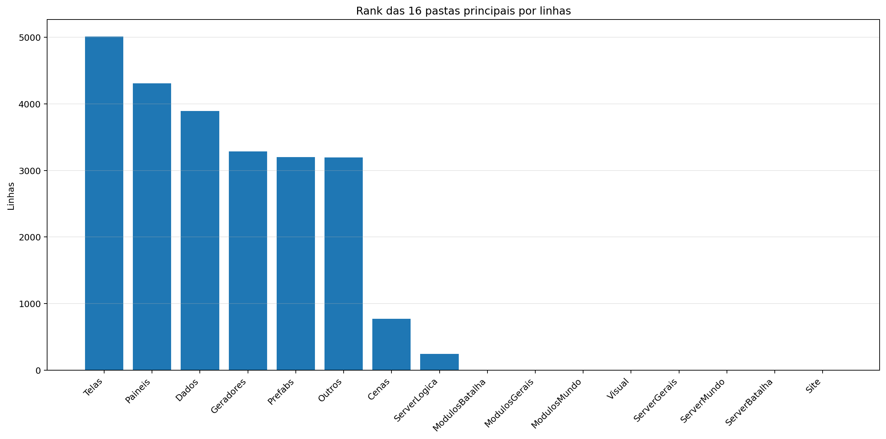
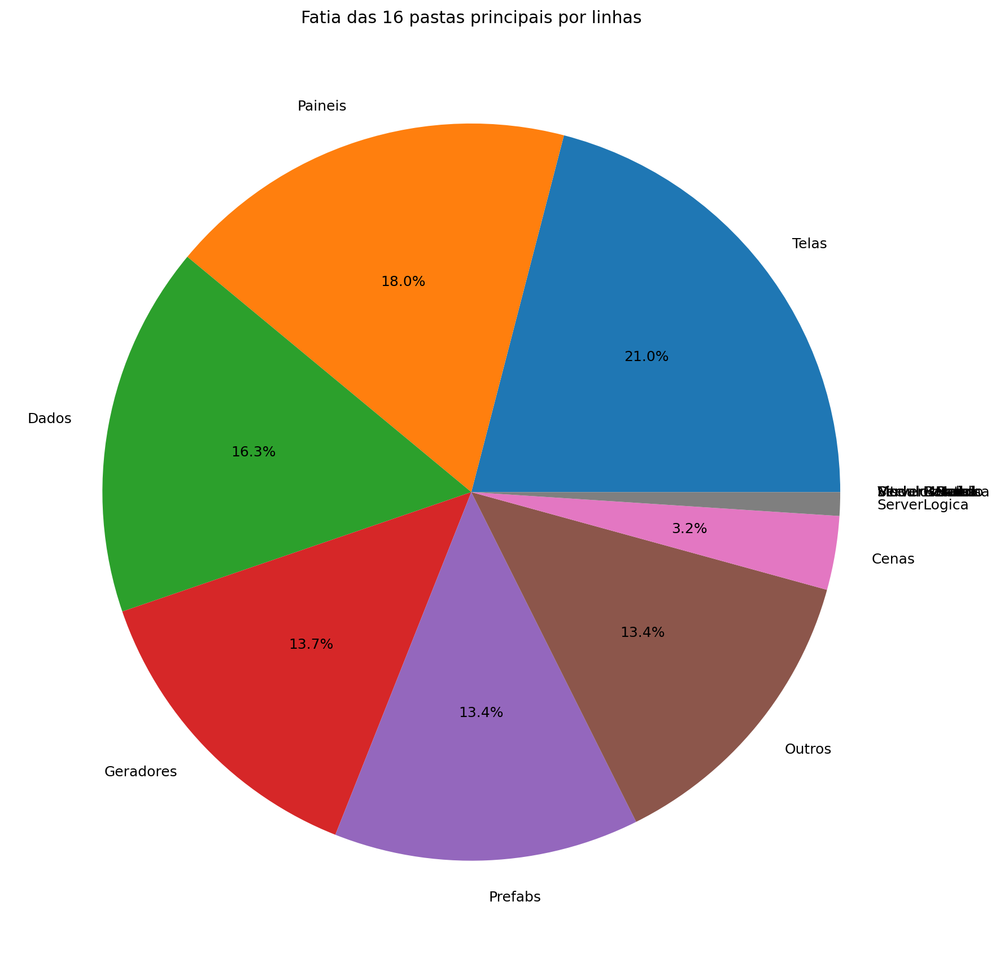
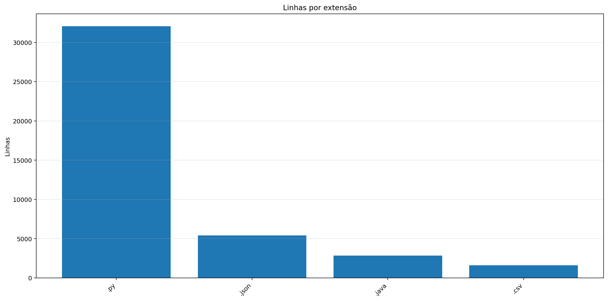
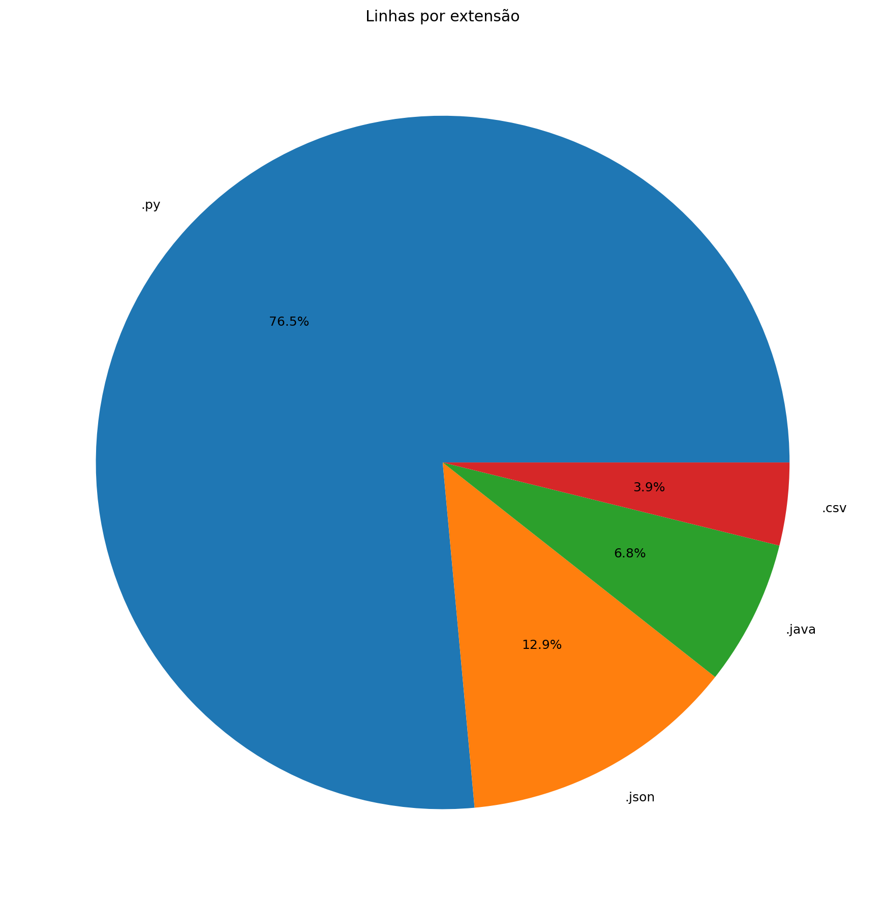
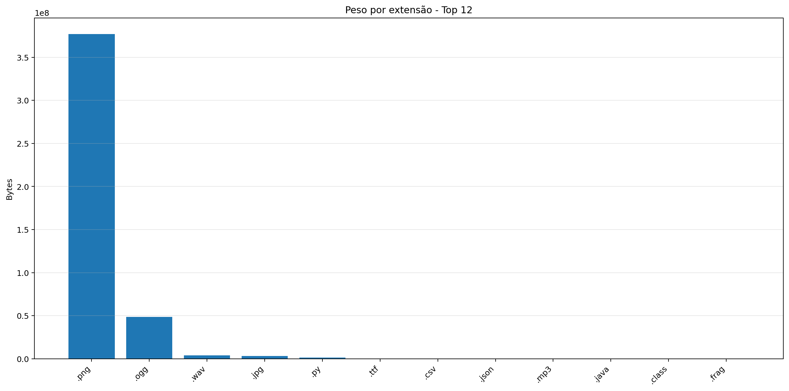
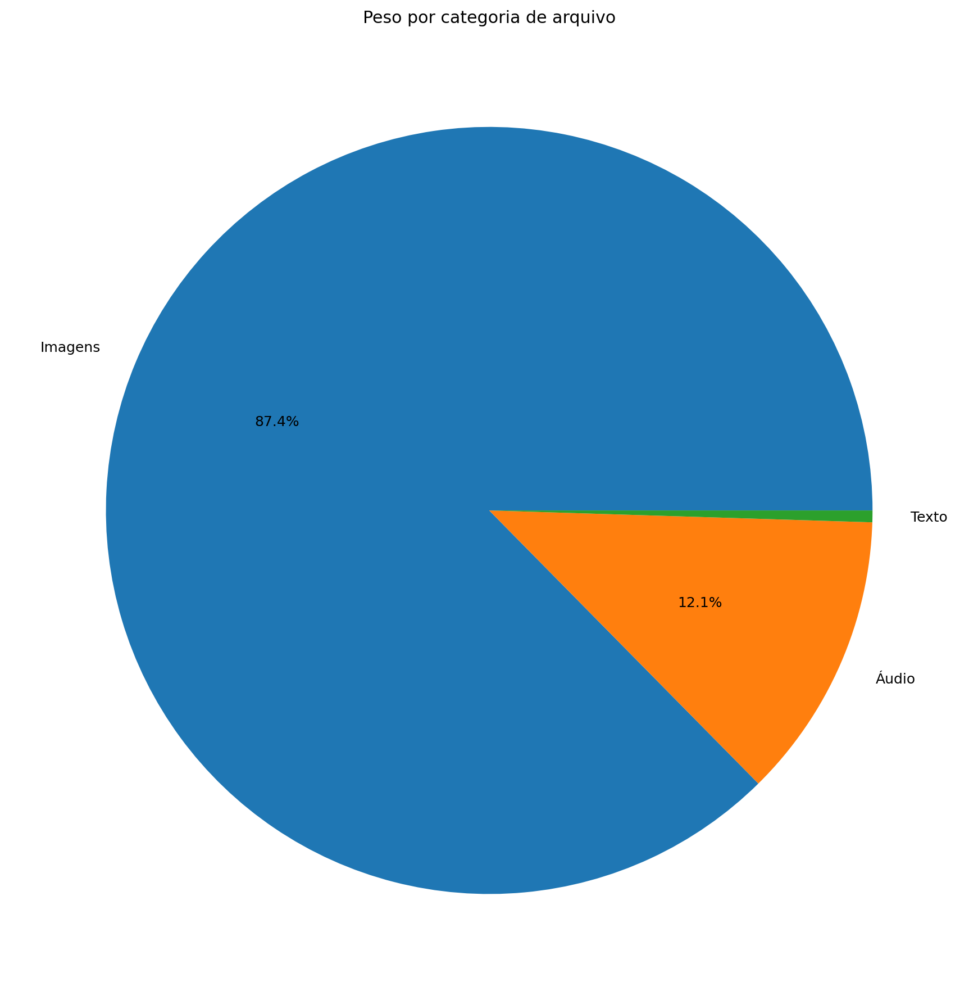
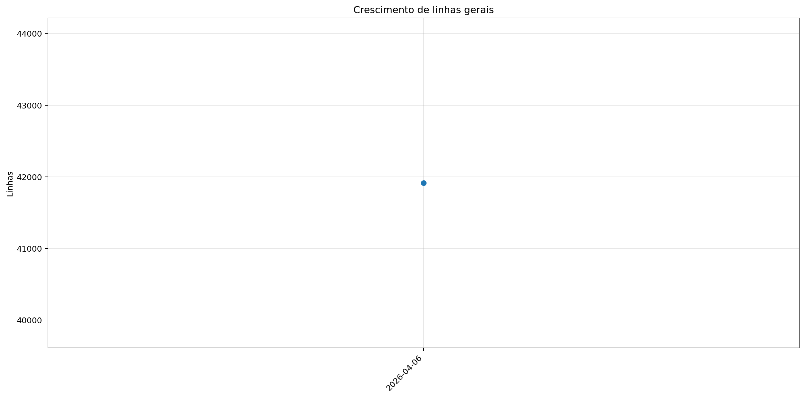
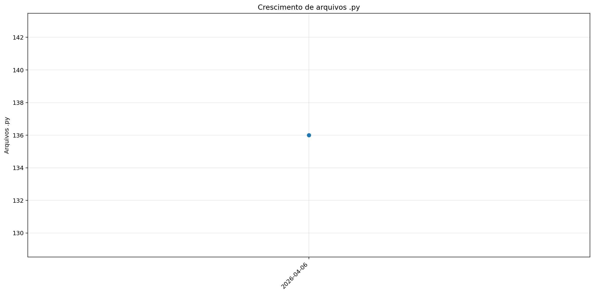
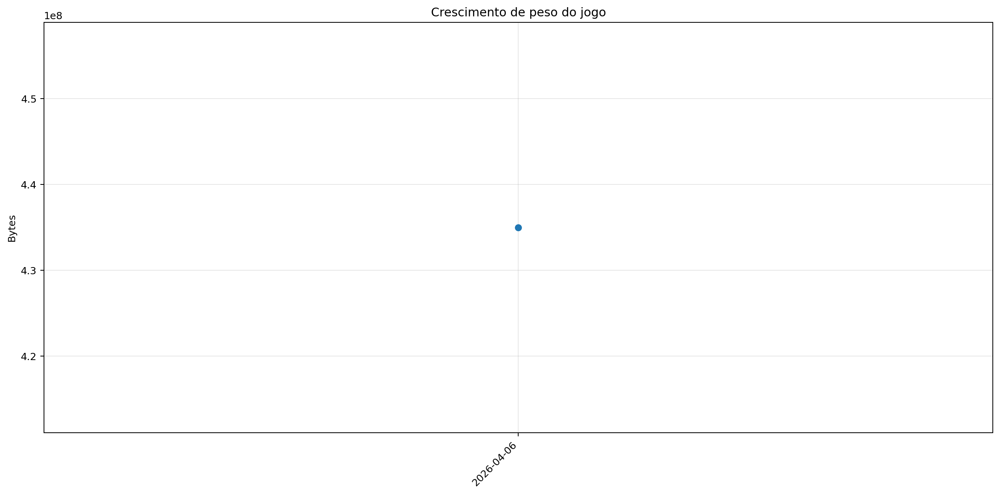

# Registro

**Relatório:** #1  
**Projeto:** `relatorio_rebuild_9rbjexit`  
**Gerado em:** 2026-04-29T23:43:00  
**Modelo de relatório:** 10  
**Autor:** Leon Cunha Alvaro Lopez Soto

## 1. Visão geral

- **Pastas:** 1.183
- **Arquivos:** 69.031
- **Arquivos de texto:** 181
- **Peso dos arquivos de texto:** 1760.08 KB
- **Tamanho total:** 0.405 GB (434.964.736 bytes)
- **Dias desde a criação do projeto:** 35
- **Dias desde a criação oficial:** 309
- **Horas estimadas:** 224.50
- **Linhas totais gerais:** 41.914
- **Commits (projeto):** 285

## 2. Python

- **Arquivos `.py`:** 135
- **Linhas totais:** 32.050
- **Tamanho total `.py`:** 1331.94 KB
- **Classes encontradas:** 114
- **Funções encontradas:** 417
- **Métodos encontrados:** 1.348
- **Total funções + métodos:** 1.765
- **Bibliotecas diferentes usadas:** 41

## 3. Principais pastas





| Rank | Pasta | Subpastas | Arquivos | Linhas gerais | Tamanho (KB) |
|---:|---|---:|---:|---:|---:|
| 1 | `Telas` | 1 | 16 | 5.011 | 197.52 |
| 2 | `Paineis` | 0 | 13 | 4.308 | 176.82 |
| 3 | `Dados` | 3 | 34 | 3.890 | 227.74 |
| 4 | `Geradores` | 1 | 16 | 3.285 | 145.23 |
| 5 | `Prefabs` | 0 | 15 | 3.199 | 115.28 |
| 6 | `Outros` | 0 | 5 | 3.193 | 117.35 |
| 7 | `Cenas` | 0 | 7 | 774 | 32.03 |
| 8 | `ServerLogica` | 0 | 3 | 247 | 12.02 |
| 9 | `ModulosBatalha` | 0 | 0 | 0 | 0.00 |
| 10 | `ModulosGerais` | 0 | 0 | 0 | 0.00 |
| 11 | `ModulosMundo` | 0 | 0 | 0 | 0.00 |
| 12 | `Visual` | 0 | 0 | 0 | 0.00 |
| 13 | `ServerGerais` | 0 | 0 | 0 | 0.00 |
| 14 | `ServerMundo` | 0 | 0 | 0 | 0.00 |
| 15 | `ServerBatalha` | 0 | 0 | 0 | 0.00 |
| 16 | `Site` | 0 | 0 | 0 | 0.00 |

## 4. Arquitetura

### `Codigo/`

```text
Codigo/
├── Cenas/
│   ├── CenaCarregamento.py
│   ├── CenaCombate.py
│   ├── CenaLogin.py
│   ├── CenaMenu.py
│   ├── CenaMundo.py
│   ├── CenaPreBatalha.py
│   └── ControladorCenas.py
├── Geradores/
│   ├── Player/
│   │   ├── Controle.py
│   │   ├── Inventario.py
│   │   ├── Perfil.py
│   │   └── Player.py
│   ├── Ator.py
│   ├── Baus.py
│   ├── Dungeon.py
│   ├── Estadio.py
│   ├── EstruturaNaturais.py
│   ├── ItemInventario.py
│   ├── ItemMundo.py
│   ├── PokemonBatalha.py
│   ├── PokemonInventario.py
│   ├── PokemonMundo.py
│   ├── Projetil.py
│   └── XpMundo.py
├── InteracaoNPC/
│   ├── Hans.json
│   ├── Josefa.json
│   └── Kleber.json
├── Localidades/
│   ├── Bot.py
│   ├── Combate.py
│   ├── GeradorMundo.py
│   └── GeradorPokemon.py
├── Modulos/
│   ├── ControladorMundo/
│   │   ├── ControladorAtores.py
│   │   ├── ControladorCriaveis.py
│   │   ├── ControladorMundo.py
│   │   ├── ControladorObjetos.py
│   │   ├── ControladorPlayer.py
│   │   ├── LeitorMundo.py
│   │   └── SistemaPacotes.py
│   ├── Arena.py
│   ├── Auxiliares.py
│   ├── Camera.py
│   ├── Carregamento.py
│   ├── Colisor.py
│   ├── ControladorBatalha.py
│   ├── DesenhaAtor.py
│   ├── Discord.py
│   ├── EfeitosTela.py
│   ├── ElementosHudCombate.py
│   ├── ElementosHudMundo.py
│   ├── ExecutaveisPoção.py
│   ├── FiltroCamera.py
│   ├── Loja.py
│   ├── SistemaCombate.py
│   └── Sonoridades.py
├── Outros/
│   └── Shaders/
│       ├── mundo.frag
│       └── mundo.vert
├── Paineis/
│   ├── Container.py
│   ├── FichaAtaque.py
│   ├── FichaItem.py
│   ├── FichaPokemon.py
│   ├── FichaPokemonCombate.py
│   ├── Musicdex.py
│   ├── PainelArvoreHabilidades.py
│   ├── PainelAuxiliarPoke.py
│   ├── PainelCraft.py
│   ├── PainelReceitas.py
│   ├── PainelTimes.py
│   ├── Pokedex.py
│   └── Skindex.py
├── Prefabs/
│   ├── Arrastavel.py
│   ├── Barra.py
│   ├── BarraPesquisa.py
│   ├── Botao.py
│   ├── CaixaTexto.py
│   ├── EfeitosVisuais.py
│   ├── Fluxos.py
│   ├── Imagem.py
│   ├── Mensagem.py
│   ├── Mensagens.py
│   ├── Opcoes.py
│   ├── Painel.py
│   ├── Terminal.py
│   ├── Texto.py
│   └── Tooltip.py
├── Server/
│   ├── Login.py
│   ├── ServerCombate.py
│   ├── ServerMenu.py
│   └── ServerMundo.py
└── Telas/
    ├── Inventario/
    │   ├── Estatisticas.py
    │   ├── InventarioItens.py
    │   ├── InventarioPokemons.py
    │   └── Unificador.py
    ├── Config.py
    ├── Creditos.py
    ├── Mapa.py
    ├── Opções.py
    ├── SubtelaOpcoes.py
    ├── TelaCriarPersonagem.py
    ├── TelaDialogo.py
    ├── TelaLogin.py
    ├── TelaMenu.py
    ├── TelaOperador.py
    ├── TelaServers.py
    └── TelasGenericas.py
```

### `Server/`

```text
SimuladorServerJogo/
├── Controle/
│   ├── Cerebros/
│   │   ├── CerebroBaus.py
│   │   ├── CerebroCentral.py
│   │   ├── CerebroEstadios.py
│   │   ├── CerebroEstruturasNaturais.py
│   │   ├── CerebroItensMundo.py
│   │   ├── CerebroNPCs.py
│   │   ├── CerebroPokemons.py
│   │   ├── CerebroProjeteis.py
│   │   ├── CerebroTempo.py
│   │   └── CerebroXpMundo.py
│   ├── BancoDados.py
│   ├── EstadoServidor.py
│   ├── ObjetosMundoServer.py
│   ├── PacotesTick.py
│   ├── ServicoInventario.py
│   └── TiqueServidor.py
├── Geradores/
│   ├── Regras/
│   │   └── Geracao.json
│   ├── GeradorBaus.py
│   ├── GeradorMundo.py
│   ├── GeradorPokemon.py
│   ├── WorldGenerator$1.class
│   ├── WorldGenerator$Biome.class
│   ├── WorldGenerator$BiomeRule.class
│   ├── WorldGenerator$Generator.class
│   ├── WorldGenerator$NaturalStructure.class
│   ├── WorldGenerator$Poi.class
│   ├── WorldGenerator$PoiType.class
│   ├── WorldGenerator$Rules$BiomeStructureOverride.class
│   ├── WorldGenerator$Rules.class
│   ├── WorldGenerator$SimpleJson$Parser.class
│   ├── WorldGenerator$SimpleJson.class
│   ├── WorldGenerator$StructureRule.class
│   ├── WorldGenerator$Tile.class
│   ├── WorldGenerator.class
│   └── WorldGenerator.java
├── Logica/
│   ├── AutoridadeCaptura.py
│   ├── ExecutesFrutas.py
│   └── ExecutesPokebolas.py
├── Regras/
│   ├── Cerebro.json
│   ├── EstruturasNaturais.json
│   ├── Geracao.json
│   ├── Loader.py
│   ├── Mundo.json
│   └── Player.json
└── Rotas/
    ├── Ativador.py
    ├── Atualizador.py
    ├── Comandos.py
    ├── Entrada.py
    ├── ServerOperar.py
    └── Terminal.py
```

### `Dados/`

```text
Dados/
├── InteracoesNPC/
│   ├── Combatentes/
│   │   ├── _ExemploGeralCombatenteComEstadio.json
│   │   ├── _ExemploGeralCombatenteSemEstadio.json
│   │   ├── Alleka.json
│   │   ├── Amable.json
│   │   ├── Caio.json
│   │   ├── Felipox.json
│   │   ├── Felps.json
│   │   ├── Ferraz.json
│   │   ├── Garcia.json
│   │   ├── Guedes.json
│   │   ├── Henrique.json
│   │   ├── João.json
│   │   ├── Lisciele.json
│   │   ├── Murilo.json
│   │   ├── Nathzinha.json
│   │   ├── Paulo.json
│   │   ├── Ph.json
│   │   ├── Ramos.json
│   │   ├── Sidney.json
│   │   ├── Suneiva.json
│   │   ├── Suriane.json
│   │   └── Vasques.json
│   └── Vendedores/
│       ├── _ExemploGeralVendedor.json
│       ├── Hans.json
│       ├── Josefa.json
│       └── Kleber.json
├── Pokemon Global Server - Ataques.csv
├── Pokemon Global Server - Baus.csv
├── Pokemon Global Server - Equipaveis.csv
├── Pokemon Global Server - Itens.csv
├── Pokemon Global Server - NPC Combatente.csv
├── Pokemon Global Server - NPC Vendedor.csv
├── Pokemon Global Server - Pokemons.csv
└── Pokemon Global Server - Receitas.json
```

### `Site/`

```text
Site/
└── (pasta não encontrada)
```

### `Outros/`

```text
Outros/
├── AtualizadorReadMe.py
├── ConfigFixa.py
├── EditorSkins.py
├── GeradorRelatorios.py
└── Mixer.py
```

## 5. Ranks

### Top 50 maiores arquivos `.py` por linhas

| Arquivo | Linhas | Tamanho (KB) |
|---|---:|---:|
| `Outros/GeradorRelatorios.py` | 1.757 | 65.51 |
| `Codigo/Paineis/FichaPokemon.py` | 1.193 | 53.28 |
| `Codigo/Telas/Inventario/InventarioPokemons.py` | 1.064 | 48.40 |
| `Codigo/Modulos/ControladorMundo/ControladorObjetos.py` | 765 | 38.19 |
| `SimuladorServerJogo/Controle/EstadoServidor.py` | 690 | 27.80 |
| `SimuladorServerJogo/Rotas/Comandos.py` | 686 | 28.52 |
| `Codigo/Geradores/PokemonMundo.py` | 678 | 33.45 |
| `Codigo/Modulos/ControladorMundo/ControladorPlayer.py` | 658 | 30.65 |
| `Codigo/Paineis/Container.py` | 637 | 23.33 |
| `SimuladorServerJogo/Controle/BancoDados.py` | 601 | 28.46 |
| `Codigo/Prefabs/Texto.py` | 548 | 20.48 |
| `Codigo/Paineis/PainelArvoreHabilidades.py` | 547 | 26.81 |
| `SimuladorServerJogo/Controle/Cerebros/CerebroNPCs.py` | 531 | 27.34 |
| `Codigo/Modulos/Sonoridades.py` | 525 | 13.50 |
| `Outros/EditorSkins.py` | 514 | 19.97 |
| `Codigo/Telas/Inventario/InventarioItens.py` | 509 | 23.76 |
| `Codigo/Telas/TelaServers.py` | 505 | 16.02 |
| `Codigo/Prefabs/Botao.py` | 477 | 17.50 |
| `SimuladorServerJogo/Controle/ObjetosMundoServer.py` | 467 | 30.09 |
| `SimuladorServerJogo/Rotas/Atualizador.py` | 466 | 21.49 |
| `Codigo/Telas/TelasGenericas.py` | 463 | 15.83 |
| `Outros/AtualizadorReadMe.py` | 461 | 16.36 |
| `SimuladorServerJogo/Geradores/GeradorPokemon.py` | 461 | 18.05 |
| `Outros/Mixer.py` | 460 | 15.31 |
| `Codigo/Paineis/PainelReceitas.py` | 455 | 15.29 |
| `Codigo/Telas/TelaCriarPersonagem.py` | 417 | 15.18 |
| `Codigo/Paineis/PainelCraft.py` | 412 | 16.04 |
| `Codigo/Geradores/Ator.py` | 411 | 18.01 |
| `Codigo/Telas/Inventario/Estatisticas.py` | 401 | 17.82 |
| `Codigo/Geradores/Player/Controle.py` | 400 | 17.09 |
| `Codigo/Telas/TelaDialogo.py` | 387 | 17.61 |
| `Codigo/Telas/TelaOperador.py` | 382 | 13.24 |
| `Codigo/Modulos/Colisor.py` | 379 | 14.48 |
| `SimuladorServerJogo/Geradores/GeradorMundo.py` | 372 | 15.35 |
| `SimuladorServerJogo/Controle/Cerebros/CerebroCentral.py` | 368 | 19.13 |
| `Codigo/Paineis/FichaAtaque.py` | 361 | 14.50 |
| `Codigo/Geradores/PokemonInventario.py` | 338 | 12.82 |
| `Codigo/Modulos/Loja.py` | 336 | 15.88 |
| `Codigo/Cenas/CenaMundo.py` | 335 | 16.45 |
| `Codigo/Paineis/PainelTimes.py` | 335 | 12.56 |
| `Codigo/Modulos/ControladorMundo/LeitorMundo.py` | 329 | 16.17 |
| `Codigo/Geradores/Estadio.py` | 313 | 11.35 |
| `Codigo/Prefabs/Painel.py` | 300 | 11.15 |
| `SimuladorServerJogo/Rotas/Ativador.py` | 282 | 13.08 |
| `Codigo/Telas/Config.py` | 257 | 8.33 |
| `Codigo/Prefabs/Terminal.py` | 250 | 8.96 |
| `Codigo/Server/ServerMundo.py` | 245 | 9.76 |
| `Codigo/Geradores/Player/Perfil.py` | 245 | 13.56 |
| `Codigo/Paineis/PainelAuxiliarPoke.py` | 235 | 9.54 |
| `Codigo/Prefabs/CaixaTexto.py` | 231 | 9.38 |

### Top 20 maiores classes

| Arquivo | Classe | Linhas |
|---|---|---:|
| `Codigo/Paineis/FichaPokemon.py` | `FichaPokemon` | 1.162 |
| `Codigo/Telas/Inventario/InventarioPokemons.py` | `InventarioPokemons` | 1.036 |
| `Codigo/Modulos/ControladorMundo/ControladorObjetos.py` | `ControladorObjetos` | 745 |
| `Codigo/Geradores/PokemonMundo.py` | `Pokemon` | 654 |
| `Codigo/Modulos/ControladorMundo/ControladorPlayer.py` | `ControladorPlayer` | 639 |
| `Codigo/Paineis/Container.py` | `Container` | 628 |
| `SimuladorServerJogo/Controle/BancoDados.py` | `BancoDadosMundo` | 573 |
| `Codigo/Paineis/PainelArvoreHabilidades.py` | `PainelArvoreHabilidades` | 517 |
| `SimuladorServerJogo/Controle/Cerebros/CerebroNPCs.py` | `CerebroNPCs` | 512 |
| `Codigo/Telas/Inventario/InventarioItens.py` | `InventarioItens` | 492 |
| `Codigo/Paineis/PainelReceitas.py` | `PainelReceitas` | 439 |
| `Codigo/Paineis/PainelCraft.py` | `PainelCraft` | 398 |
| `Codigo/Geradores/Ator.py` | `Ator` | 391 |
| `Codigo/Geradores/Player/Controle.py` | `Controle` | 387 |
| `Codigo/Telas/Inventario/Estatisticas.py` | `InventarioPerfil` | 386 |
| `Codigo/Telas/TelaDialogo.py` | `TelaDialogo` | 372 |
| `Codigo/Modulos/Colisor.py` | `Colisor` | 365 |
| `Codigo/Prefabs/Botao.py` | `Botao` | 357 |
| `Codigo/Paineis/FichaAtaque.py` | `FichaAtaque` | 351 |
| `Codigo/Telas/TelaCriarPersonagem.py` | `SubtelaCriarPersonagem` | 343 |

### Top 20 maiores funções e métodos

| Arquivo | Nome | Tipo | Linhas |
|---|---|---:|---:|
| `Outros/GeradorRelatorios.py` | `coletar_metricas` | funcao | 247 |
| `Codigo/Geradores/Estadio.py` | `EstadioInterno.renderizar` | metodo | 212 |
| `SimuladorServerJogo/Rotas/Atualizador.py` | `processar_atualizador_json` | funcao | 178 |
| `Codigo/Telas/Inventario/InventarioPokemons.py` | `InventarioPokemons.atualizar` | metodo | 150 |
| `Codigo/Modulos/Colisor.py` | `Colisor.resolver_movimento_com_colisores` | metodo | 146 |
| `Codigo/Prefabs/Fluxos.py` | `Fluxo.desenhar` | metodo | 141 |
| `Outros/GeradorRelatorios.py` | `gerar_markdown` | funcao | 139 |
| `Outros/GeradorRelatorios.py` | `analisar_python_ast` | funcao | 132 |
| `Codigo/Telas/TelaMenu.py` | `TelaMenu` | funcao | 131 |
| `Codigo/Telas/Inventario/InventarioPokemons.py` | `InventarioPokemons._reconstruir` | metodo | 118 |
| `Codigo/Prefabs/Botao.py` | `Botao.render` | metodo | 117 |
| `Codigo/Telas/TelaCriarPersonagem.py` | `SubtelaCriarPersonagem._rebuild_layout` | metodo | 112 |
| `Outros/Mixer.py` | `main` | funcao | 109 |
| `SimuladorServerJogo/Geradores/GeradorMundo.py` | `_executar_world_generator` | funcao | 106 |
| `SimuladorServerJogo/Controle/Cerebros/CerebroItensMundo.py` | `CerebroItensMundo.executar_tick` | metodo | 101 |
| `Outros/GeradorRelatorios.py` | `main` | funcao | 100 |
| `Codigo/Telas/Config.py` | `_montar_layout` | funcao | 99 |
| `Codigo/Telas/Inventario/InventarioItens.py` | `InventarioItens.atualizar` | metodo | 98 |
| `Codigo/Cenas/CenaMundo.py` | `CenaMundo.Tela` | metodo | 95 |
| `Codigo/Telas/Inventario/Estatisticas.py` | `InventarioPerfil._reconstruir_layout` | metodo | 95 |

### Top 10 arquivos mais importados

| Arquivo | Vezes importado |
|---|---:|
| `Codigo/Prefabs/Texto.py` | 30 |
| `Codigo/Prefabs/Botao.py` | 21 |
| `SimuladorServerJogo/Controle/BancoDados.py` | 14 |
| `SimuladorServerJogo/Controle/EstadoServidor.py` | 13 |
| `Codigo/Geradores/ItemInventario.py` | 13 |
| `Codigo/Modulos/Sonoridades.py` | 12 |
| `SimuladorServerJogo/Rotas/Ativador.py` | 12 |
| `SimuladorServerJogo/Controle/ObjetosMundoServer.py` | 11 |
| `Codigo/Modulos/Colisor.py` | 9 |
| `Codigo/Prefabs/Painel.py` | 8 |

### Top 10 arquivos que mais importam

| Arquivo | Arquivos internos importados | Imports totais | Linhas |
|---|---:|---:|---:|
| `SimuladorServerJogo/Controle/Cerebros/CerebroCentral.py` | 16 | 25 | 368 |
| `Codigo/Telas/Inventario/InventarioPokemons.py` | 14 | 21 | 1.064 |
| `Codigo/Cenas/CenaMundo.py` | 12 | 13 | 335 |
| `Codigo/Telas/Inventario/InventarioItens.py` | 10 | 13 | 509 |
| `Codigo/Paineis/FichaPokemon.py` | 9 | 21 | 1.193 |
| `Codigo/Cenas/ControladorCenas.py` | 9 | 10 | 204 |
| `SimuladorServerJogo/Rotas/Atualizador.py` | 8 | 12 | 466 |
| `SimuladorServerJogo/Controle/EstadoServidor.py` | 7 | 14 | 690 |
| `Codigo/Modulos/ControladorMundo/ControladorObjetos.py` | 7 | 13 | 765 |
| `SimuladorServerJogo/Rotas/Comandos.py` | 7 | 12 | 686 |

### Top 10 maiores arquivos por linhas

| Arquivo | Ext | Linhas |
|---|---:|---:|
| `SimuladorServerJogo/Geradores/WorldGenerator.java` | `.java` | 2.835 |
| `Outros/GeradorRelatorios.py` | `.py` | 1.757 |
| `SimuladorServerJogo/Geradores/Regras/Geracao.json` | `.json` | 1.715 |
| `Dados/Pokemon Global Server - Pokemons.csv` | `.csv` | 1.277 |
| `Codigo/Paineis/FichaPokemon.py` | `.py` | 1.193 |
| `Codigo/Telas/Inventario/InventarioPokemons.py` | `.py` | 1.064 |
| `Codigo/Modulos/ControladorMundo/ControladorObjetos.py` | `.py` | 765 |
| `SimuladorServerJogo/Controle/EstadoServidor.py` | `.py` | 690 |
| `SimuladorServerJogo/Rotas/Comandos.py` | `.py` | 686 |
| `Codigo/Geradores/PokemonMundo.py` | `.py` | 678 |

## 6. Linhas por extensão





| Ext | Linhas | % das linhas | Arquivos | Peso |
|---:|---:|---:|---:|---:|
| `.py` | 32.050 | 76.47% | 135 | 1.30 MB |
| `.json` | 5.413 | 12.91% | 36 | 141.09 KB |
| `.java` | 2.835 | 6.76% | 1 | 123.53 KB |
| `.csv` | 1.616 | 3.86% | 7 | 163.51 KB |

## 7. Peso por extensão





| Ext | Arquivos | Peso | % do jogo |
|---:|---:|---:|---:|
| `.png` | 68.782 | 359.40 MB | 86.64% |
| `.ogg` | 17 | 46.32 MB | 11.17% |
| `.wav` | 9 | 3.81 MB | 0.92% |
| `.jpg` | 21 | 3.14 MB | 0.76% |
| `.py` | 135 | 1.30 MB | 0.31% |
| `.ttf` | 2 | 196.64 KB | 0.05% |
| `.csv` | 7 | 163.51 KB | 0.04% |
| `.json` | 36 | 141.09 KB | 0.03% |
| `.mp3` | 3 | 135.71 KB | 0.03% |
| `.java` | 1 | 123.53 KB | 0.03% |
| `.class` | 14 | 85.29 KB | 0.02% |
| `.frag` | 1 | 7.24 KB | 0.00% |
| `.vert` | 1 | 147 bytes | 0.00% |

## 8. Comparativo com o último relatório

_Sem relatório anterior compatível para montar comparativo._

### Top 3 commits por tamanho de diff

_Sem commits suficientes entre os relatórios para montar top por diff._

## 9. Gráficos de crescimento








