# Registro

**Relatório:** #1  
**Projeto:** `relatorio_rebuild_czk5cmrt`  
**Gerado em:** 2026-05-15T10:25:41  
**Modelo de relatório:** 11  
**Autor:** Leon Cunha Alvaro Lopez Soto

## 1. Visão geral

- **Pastas:** 1.184
- **Arquivos:** 69.044
- **Arquivos de texto:** 192
- **Peso dos arquivos de texto:** 1872.59 KB
- **Tamanho total:** 0.405 GB (434.959.026 bytes)
- **Dias desde a criação do projeto:** 37
- **Dias desde a criação oficial:** 311
- **Horas estimadas:** 241.50
- **Linhas totais gerais:** 44.015
- **Commits (projeto):** 295

## 2. Python

- **Arquivos `.py`:** 142
- **Linhas totais:** 36.273
- **Tamanho total `.py`:** 1498.59 KB
- **Classes encontradas:** 120
- **Funções encontradas:** 528
- **Métodos encontrados:** 1.480
- **Total funções + métodos:** 2.008
- **Bibliotecas diferentes usadas:** 43

## 3. Macro áreas

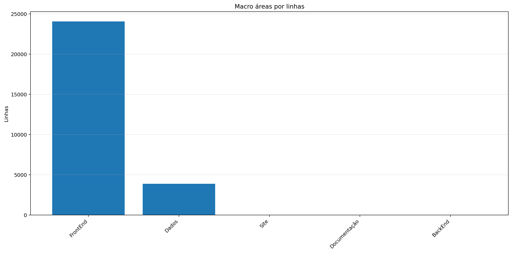

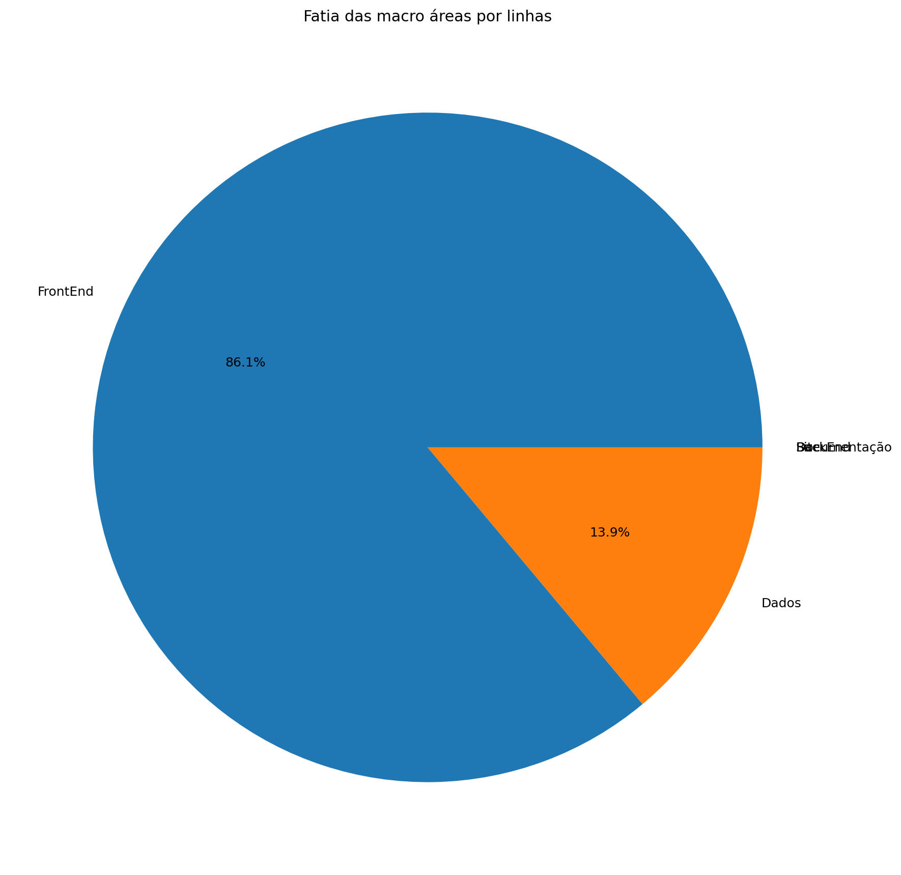

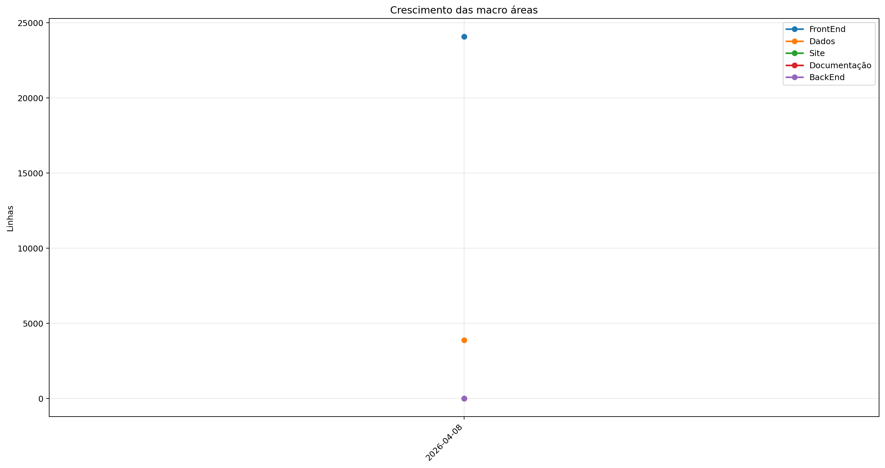

| Rank | Área | Caminho | Subpastas | Arquivos | Linhas gerais | Tamanho (KB) |
|---:|---|---|---:|---:|---:|---:|
| 1 | `FrontEnd` | `Codigo + Game.py` | 14 | 111 | 24.083 | 987.38 |
| 2 | `Dados` | `Dados` | 3 | 34 | 3.890 | 227.83 |
| 3 | `Site` | `Site/src` | 0 | 0 | 0 | 0.00 |
| 4 | `Documentação` | `Documentação` | 0 | 0 | 0 | 0.00 |
| 5 | `BackEnd` | `Servidor + ServidorGeral` | 0 | 0 | 0 | 0.00 |

## 4. Principais pastas

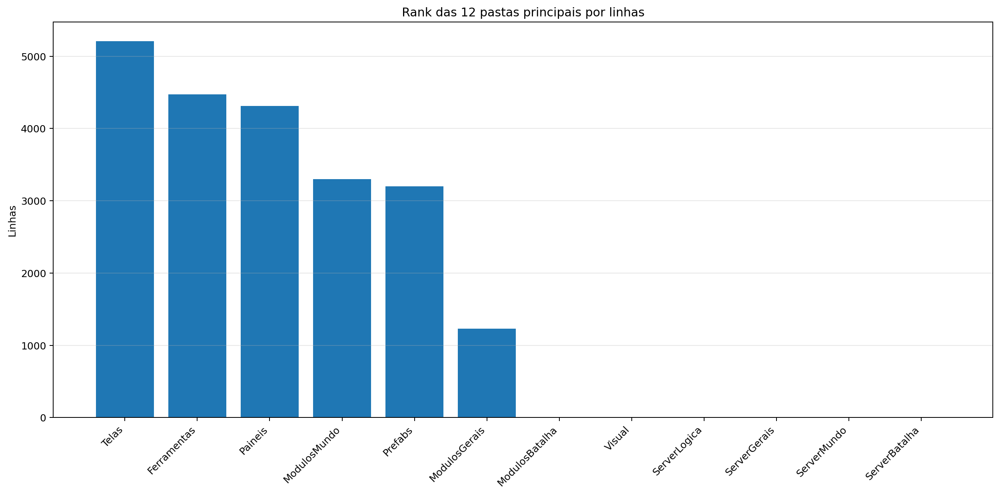

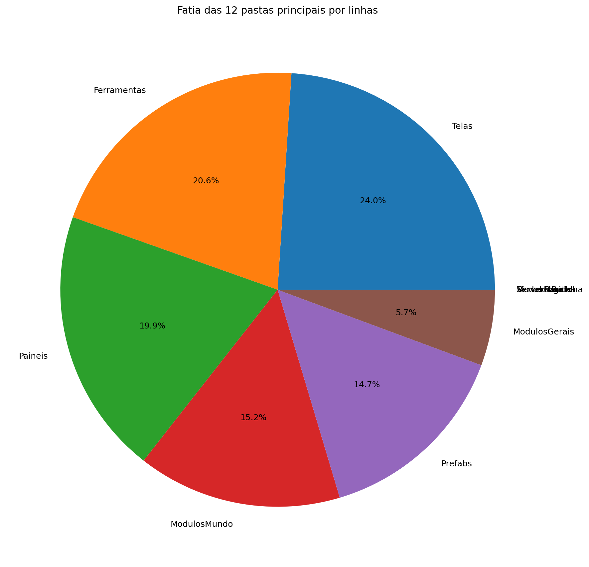

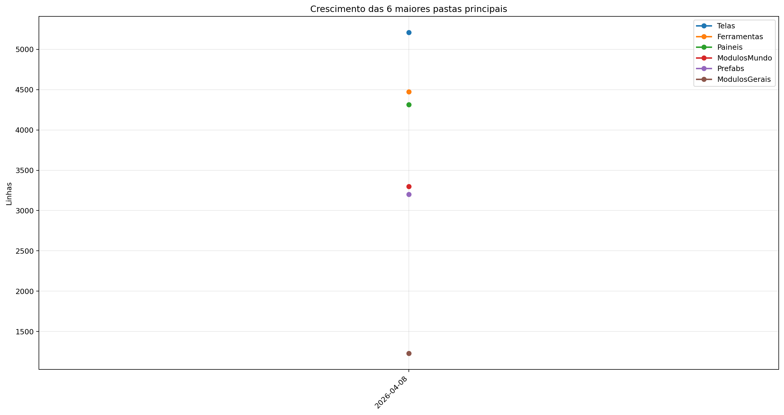

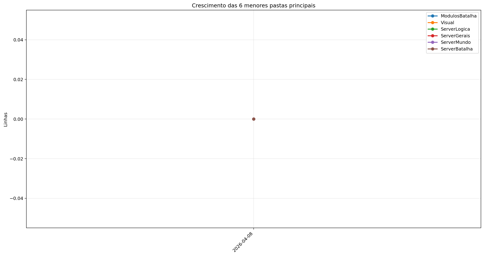

| Rank | Pasta | Subpastas | Arquivos | Linhas gerais | Tamanho (KB) |
|---:|---|---:|---:|---:|---:|
| 1 | `Telas` | 1 | 17 | 5.210 | 205.02 |
| 2 | `Ferramentas` | 0 | 6 | 4.473 | 162.16 |
| 3 | `Paineis` | 0 | 13 | 4.313 | 177.44 |
| 4 | `ModulosMundo` | 1 | 16 | 3.300 | 145.77 |
| 5 | `Prefabs` | 0 | 15 | 3.200 | 115.26 |
| 6 | `ModulosGerais` | 0 | 11 | 1.228 | 49.51 |
| 7 | `ModulosBatalha` | 0 | 0 | 0 | 0.00 |
| 8 | `Visual` | 0 | 0 | 0 | 0.00 |
| 9 | `ServerLogica` | 0 | 0 | 0 | 0.00 |
| 10 | `ServerGerais` | 0 | 0 | 0 | 0.00 |
| 11 | `ServerMundo` | 0 | 0 | 0 | 0.00 |
| 12 | `ServerBatalha` | 0 | 0 | 0 | 0.00 |

## 5. Arquitetura

### `Codigo/`

```text
Codigo/
├── Cenas/
│   ├── CenaCarregamento.py
│   ├── CenaCombate.py
│   ├── CenaLogin.py
│   ├── CenaMenu.py
│   ├── CenaMundo.py
│   ├── CenaPreBatalha.py
│   └── ControladorCenas.py
├── Geradores/
│   ├── Player/
│   │   ├── Controle.py
│   │   ├── Inventario.py
│   │   ├── Perfil.py
│   │   └── Player.py
│   ├── Ator.py
│   ├── Baus.py
│   ├── Dungeon.py
│   ├── Estadio.py
│   ├── EstruturaNaturais.py
│   ├── ItemInventario.py
│   ├── ItemMundo.py
│   ├── PokemonBatalha.py
│   ├── PokemonInventario.py
│   ├── PokemonMundo.py
│   ├── Projetil.py
│   └── XpMundo.py
├── Localidades/
│   ├── Bot.py
│   ├── Combate.py
│   ├── GeradorMundo.py
│   └── GeradorPokemon.py
├── Modulos/
│   ├── ControladorMundo/
│   │   ├── ControladorAtores.py
│   │   ├── ControladorCriaveis.py
│   │   ├── ControladorMundo.py
│   │   ├── ControladorObjetos.py
│   │   ├── ControladorPlayer.py
│   │   ├── LeitorMundo.py
│   │   └── SistemaPacotes.py
│   ├── Arena.py
│   ├── Auxiliares.py
│   ├── Camera.py
│   ├── Carregamento.py
│   ├── Colisor.py
│   ├── CompositorModernGL.py
│   ├── ControladorBatalha.py
│   ├── DesenhaAtor.py
│   ├── Discord.py
│   ├── EfeitosTela.py
│   ├── ElementosHudCombate.py
│   ├── ElementosHudMundo.py
│   ├── ExecutaveisPoção.py
│   ├── FiltroCamera.py
│   ├── Loja.py
│   ├── ModuladorRegras.py
│   ├── PipelineGrafica.py
│   ├── ServicoCraft.py
│   ├── SistemaCombate.py
│   └── Sonoridades.py
├── Outros/
│   └── Shaders/
│       ├── mundo.frag
│       └── mundo.vert
├── Paineis/
│   ├── Container.py
│   ├── FichaAtaque.py
│   ├── FichaItem.py
│   ├── FichaPokemon.py
│   ├── FichaPokemonCombate.py
│   ├── Musicdex.py
│   ├── PainelArvoreHabilidades.py
│   ├── PainelAuxiliarPoke.py
│   ├── PainelCraft.py
│   ├── PainelReceitas.py
│   ├── PainelTimes.py
│   ├── Pokedex.py
│   └── Skindex.py
├── Prefabs/
│   ├── Arrastavel.py
│   ├── Barra.py
│   ├── BarraPesquisa.py
│   ├── Botao.py
│   ├── CaixaTexto.py
│   ├── EfeitosVisuais.py
│   ├── Fluxos.py
│   ├── Imagem.py
│   ├── Mensagem.py
│   ├── Mensagens.py
│   ├── Opcoes.py
│   ├── Painel.py
│   ├── Terminal.py
│   ├── Texto.py
│   └── Tooltip.py
├── Server/
│   ├── Login.py
│   ├── ServerCombate.py
│   ├── ServerMenu.py
│   └── ServerMundo.py
├── shader_demo_ciclo_diario_v5_sem_link_awakening/
│   ├── ciclo_diario_shader_teste_v5.frag
│   ├── ciclo_diario_shader_teste_v5.py
│   ├── ciclo_diario_shader_teste_v5.vert
│   ├── LEIA_ME_shader_demo_v5.txt
│   └── requirements_shader_demo_v5.txt
└── Telas/
    ├── Inventario/
    │   ├── Estatisticas.py
    │   ├── InventarioItens.py
    │   ├── InventarioPokemons.py
    │   └── SubtelaInventario.py
    ├── Creditos.py
    ├── Mapa.py
    ├── Opções.py
    ├── Subtela.py
    ├── SubtelaCriarPersonagem.py
    ├── SubtelaDialogo.py
    ├── SubtelaOpcoes.py
    ├── TelaConfig.py
    ├── TelaLogin.py
    ├── TelaMenu.py
    ├── TelaOperador.py
    ├── TelaServers.py
    └── TelasGenericas.py
```

### `Server/`

```text
Servidor/
└── (pasta não encontrada)
```

### `Dados/`

```text
Dados/
├── InteracoesNPC/
│   ├── Combatentes/
│   │   ├── _ExemploGeralCombatenteComEstadio.json
│   │   ├── _ExemploGeralCombatenteSemEstadio.json
│   │   ├── Alleka.json
│   │   ├── Amable.json
│   │   ├── Caio.json
│   │   ├── Felipox.json
│   │   ├── Felps.json
│   │   ├── Ferraz.json
│   │   ├── Garcia.json
│   │   ├── Guedes.json
│   │   ├── Henrique.json
│   │   ├── João.json
│   │   ├── Lisciele.json
│   │   ├── Murilo.json
│   │   ├── Nathzinha.json
│   │   ├── Paulo.json
│   │   ├── Ph.json
│   │   ├── Ramos.json
│   │   ├── Sidney.json
│   │   ├── Suneiva.json
│   │   ├── Suriane.json
│   │   └── Vasques.json
│   └── Vendedores/
│       ├── _ExemploGeralVendedor.json
│       ├── Hans.json
│       ├── Josefa.json
│       └── Kleber.json
├── Pokemon Global Server - Ataques.csv
├── Pokemon Global Server - Baus.csv
├── Pokemon Global Server - Equipaveis.csv
├── Pokemon Global Server - Itens.csv
├── Pokemon Global Server - NPC Combatente.csv
├── Pokemon Global Server - NPC Vendedor.csv
├── Pokemon Global Server - Pokemons.csv
└── Pokemon Global Server - Receitas.json
```

### `Site/`

```text
Site/
└── public/
```

### `Ferramentas/`

```text
Ferramentas/
├── AtualizadorReadMe.py
└── GeradorRelatorios.py
```

## 6. Ranks

### Top 50 maiores arquivos `.py` por linhas

| Arquivo | Linhas | Tamanho (KB) |
|---|---:|---:|
| `Ferramentas/GeradorRelatorios.py` | 2.117 | 80.24 |
| `Codigo/Paineis/FichaPokemon.py` | 1.269 | 56.91 |
| `Codigo/Telas/Inventario/InventarioPokemons.py` | 1.062 | 48.44 |
| `Codigo/shader_demo_ciclo_diario_v5_sem_link_awakening/ciclo_diario_shader_teste_v5.py` | 1.024 | 34.18 |
| `Outros/GeradorRelatorios.py` | 920 | 30.06 |
| `Codigo/Modulos/ControladorMundo/ControladorObjetos.py` | 800 | 39.68 |
| `SimuladorServerJogo/Controle/EstadoServidor.py` | 754 | 30.40 |
| `Codigo/Modulos/ControladorMundo/ControladorPlayer.py` | 706 | 33.58 |
| `SimuladorServerJogo/Rotas/Comandos.py` | 686 | 28.52 |
| `Codigo/Geradores/PokemonMundo.py` | 681 | 33.59 |
| `Codigo/Paineis/Container.py` | 637 | 23.33 |
| `SimuladorServerJogo/Controle/BancoDados.py` | 601 | 28.47 |
| `Codigo/Prefabs/Texto.py` | 548 | 20.48 |
| `Codigo/Paineis/PainelArvoreHabilidades.py` | 547 | 26.81 |
| `Codigo/Modulos/Sonoridades.py` | 539 | 13.76 |
| `SimuladorServerJogo/Controle/Cerebros/CerebroNPCs.py` | 536 | 27.82 |
| `Outros/EditorSkins.py` | 514 | 19.97 |
| `Codigo/Telas/Inventario/InventarioItens.py` | 509 | 23.76 |
| `SimuladorServerJogo/Rotas/Atualizador.py` | 503 | 23.24 |
| `Codigo/Telas/TelaServers.py` | 492 | 15.66 |
| `Codigo/Prefabs/Botao.py` | 477 | 17.50 |
| `SimuladorServerJogo/Controle/ObjetosMundoServer.py` | 468 | 30.11 |
| `SimuladorServerJogo/Geradores/GeradorPokemon.py` | 464 | 18.26 |
| `Ferramentas/AtualizadorReadMe.py` | 461 | 16.37 |
| `Codigo/Modulos/FiltroCamera.py` | 460 | 21.01 |
| `Outros/Mixer.py` | 460 | 15.31 |
| `Codigo/Paineis/PainelReceitas.py` | 455 | 15.29 |
| `Codigo/Telas/TelasGenericas.py` | 448 | 15.29 |
| `Codigo/Telas/SubtelaDialogo.py` | 429 | 19.46 |
| `Codigo/Telas/SubtelaCriarPersonagem.py` | 423 | 15.30 |
| `Codigo/Geradores/Ator.py` | 409 | 17.86 |
| `Codigo/Telas/Inventario/Estatisticas.py` | 401 | 17.82 |
| `Codigo/Geradores/Player/Controle.py` | 400 | 17.09 |
| `SimuladorServerJogo/Controle/Cerebros/CerebroCentral.py` | 400 | 20.60 |
| `SimuladorServerJogo/Geradores/GeradorMundo.py` | 385 | 15.71 |
| `Codigo/Modulos/Colisor.py` | 379 | 14.48 |
| `Codigo/Telas/TelaOperador.py` | 379 | 13.53 |
| `Codigo/Paineis/FichaAtaque.py` | 361 | 14.50 |
| `Codigo/Modulos/ControladorMundo/LeitorMundo.py` | 355 | 17.00 |
| `Codigo/Paineis/PainelCraft.py` | 341 | 13.03 |
| `Codigo/Geradores/PokemonInventario.py` | 338 | 12.82 |
| `Codigo/Modulos/Loja.py` | 336 | 15.88 |
| `Codigo/Paineis/PainelTimes.py` | 335 | 12.56 |
| `Codigo/Cenas/CenaMundo.py` | 323 | 15.83 |
| `SimuladorServerJogo/Controle/LoaderRegras.py` | 319 | 17.80 |
| `Codigo/Geradores/Estadio.py` | 313 | 11.35 |
| `Codigo/Prefabs/Painel.py` | 300 | 11.15 |
| `SimuladorServerJogo/Rotas/Ativador.py` | 287 | 13.17 |
| `Codigo/Server/ServerMundo.py` | 263 | 10.33 |
| `Codigo/Telas/TelaConfig.py` | 258 | 8.56 |

### Top 20 maiores classes

| Arquivo | Classe | Linhas |
|---|---|---:|
| `Codigo/Paineis/FichaPokemon.py` | `FichaPokemon` | 1.237 |
| `Codigo/Telas/Inventario/InventarioPokemons.py` | `InventarioPokemons` | 1.034 |
| `Codigo/Modulos/ControladorMundo/ControladorObjetos.py` | `ControladorObjetos` | 780 |
| `Codigo/Modulos/ControladorMundo/ControladorPlayer.py` | `ControladorPlayer` | 687 |
| `Codigo/Geradores/PokemonMundo.py` | `Pokemon` | 657 |
| `Codigo/Paineis/Container.py` | `Container` | 628 |
| `SimuladorServerJogo/Controle/BancoDados.py` | `BancoDadosMundo` | 573 |
| `Codigo/Paineis/PainelArvoreHabilidades.py` | `PainelArvoreHabilidades` | 517 |
| `SimuladorServerJogo/Controle/Cerebros/CerebroNPCs.py` | `CerebroNPCs` | 517 |
| `Codigo/Telas/Inventario/InventarioItens.py` | `InventarioItens` | 492 |
| `Codigo/Modulos/FiltroCamera.py` | `FiltroCamera` | 451 |
| `Codigo/Paineis/PainelReceitas.py` | `PainelReceitas` | 439 |
| `Codigo/Telas/SubtelaDialogo.py` | `SubtelaDialogo` | 411 |
| `Codigo/Geradores/Ator.py` | `Ator` | 389 |
| `Codigo/Geradores/Player/Controle.py` | `Controle` | 387 |
| `Codigo/Telas/Inventario/Estatisticas.py` | `InventarioPerfil` | 386 |
| `Codigo/Modulos/Colisor.py` | `Colisor` | 365 |
| `SimuladorServerJogo/Controle/Cerebros/CerebroCentral.py` | `CerebroCentral` | 365 |
| `Codigo/Prefabs/Botao.py` | `Botao` | 357 |
| `Codigo/Paineis/FichaAtaque.py` | `FichaAtaque` | 351 |

### Top 20 maiores funções e métodos

| Arquivo | Nome | Tipo | Linhas |
|---|---|---:|---:|
| `Ferramentas/GeradorRelatorios.py` | `coletar_metricas` | funcao | 252 |
| `Outros/GeradorRelatorios.py` | `coletar_metricas` | funcao | 218 |
| `Codigo/Geradores/Estadio.py` | `EstadioInterno.renderizar` | metodo | 212 |
| `SimuladorServerJogo/Rotas/Atualizador.py` | `processar_atualizador_json` | funcao | 205 |
| `Ferramentas/GeradorRelatorios.py` | `gerar_markdown` | funcao | 151 |
| `Codigo/Telas/Inventario/InventarioPokemons.py` | `InventarioPokemons.atualizar` | metodo | 147 |
| `Codigo/Modulos/Colisor.py` | `Colisor.resolver_movimento_com_colisores` | metodo | 146 |
| `Ferramentas/GeradorRelatorios.py` | `gerar_graficos` | funcao | 146 |
| `Codigo/Prefabs/Fluxos.py` | `Fluxo.desenhar` | metodo | 141 |
| `Ferramentas/GeradorRelatorios.py` | `analisar_python_ast` | funcao | 132 |
| `Codigo/Telas/TelaMenu.py` | `TelaMenu` | funcao | 131 |
| `Codigo/Telas/Inventario/InventarioPokemons.py` | `InventarioPokemons._reconstruir` | metodo | 118 |
| `Codigo/Prefabs/Botao.py` | `Botao.render` | metodo | 117 |
| `Codigo/Telas/SubtelaCriarPersonagem.py` | `SubtelaCriarPersonagem._rebuild_layout` | metodo | 112 |
| `Outros/Mixer.py` | `main` | funcao | 109 |
| `SimuladorServerJogo/Geradores/GeradorMundo.py` | `_executar_world_generator` | funcao | 106 |
| `SimuladorServerJogo/Controle/Cerebros/CerebroItensMundo.py` | `CerebroItensMundo.executar_tick` | metodo | 101 |
| `Codigo/Telas/TelaConfig.py` | `_montar_layout` | funcao | 99 |
| `Codigo/Telas/Inventario/InventarioItens.py` | `InventarioItens.atualizar` | metodo | 98 |
| `SimuladorServerJogo/Rotas/Entrada.py` | `processar_entrada_json` | funcao | 98 |

### Top 10 arquivos mais importados

| Arquivo | Vezes importado |
|---|---:|
| `Codigo/Prefabs/Texto.py` | 30 |
| `Codigo/Prefabs/Botao.py` | 21 |
| `SimuladorServerJogo/Controle/BancoDados.py` | 14 |
| `Codigo/Modulos/Sonoridades.py` | 13 |
| `Codigo/Geradores/ItemInventario.py` | 13 |
| `SimuladorServerJogo/Controle/EstadoServidor.py` | 13 |
| `SimuladorServerJogo/Rotas/Ativador.py` | 12 |
| `SimuladorServerJogo/Controle/ObjetosMundoServer.py` | 11 |
| `Codigo/Modulos/Colisor.py` | 9 |
| `Codigo/Prefabs/Painel.py` | 8 |

### Top 10 arquivos que mais importam

| Arquivo | Arquivos internos importados | Imports totais | Linhas |
|---|---:|---:|---:|
| `SimuladorServerJogo/Controle/Cerebros/CerebroCentral.py` | 16 | 25 | 400 |
| `Codigo/Telas/Inventario/InventarioPokemons.py` | 14 | 21 | 1.062 |
| `Codigo/Cenas/CenaMundo.py` | 14 | 15 | 323 |
| `Codigo/Cenas/ControladorCenas.py` | 11 | 13 | 244 |
| `Codigo/Telas/Inventario/InventarioItens.py` | 10 | 13 | 509 |
| `Codigo/Paineis/FichaPokemon.py` | 9 | 22 | 1.269 |
| `SimuladorServerJogo/Rotas/Atualizador.py` | 9 | 13 | 503 |
| `SimuladorServerJogo/Controle/EstadoServidor.py` | 7 | 15 | 754 |
| `Codigo/Modulos/ControladorMundo/ControladorObjetos.py` | 7 | 13 | 800 |
| `SimuladorServerJogo/Rotas/Comandos.py` | 7 | 12 | 686 |

### Top 10 maiores arquivos por linhas

| Arquivo | Ext | Linhas |
|---|---:|---:|
| `SimuladorServerJogo/Geradores/WorldGenerator.java` | `.java` | 2.835 |
| `Ferramentas/GeradorRelatorios.py` | `.py` | 2.117 |
| `Dados/Pokemon Global Server - Pokemons.csv` | `.csv` | 1.277 |
| `Codigo/Paineis/FichaPokemon.py` | `.py` | 1.269 |
| `Codigo/Telas/Inventario/InventarioPokemons.py` | `.py` | 1.062 |
| `Codigo/shader_demo_ciclo_diario_v5_sem_link_awakening/ciclo_diario_shader_teste_v5.py` | `.py` | 1.024 |
| `Outros/GeradorRelatorios.py` | `.py` | 920 |
| `Codigo/Modulos/ControladorMundo/ControladorObjetos.py` | `.py` | 800 |
| `SimuladorServerJogo/Controle/EstadoServidor.py` | `.py` | 754 |
| `Codigo/Modulos/ControladorMundo/ControladorPlayer.py` | `.py` | 706 |

## 7. Linhas por extensão

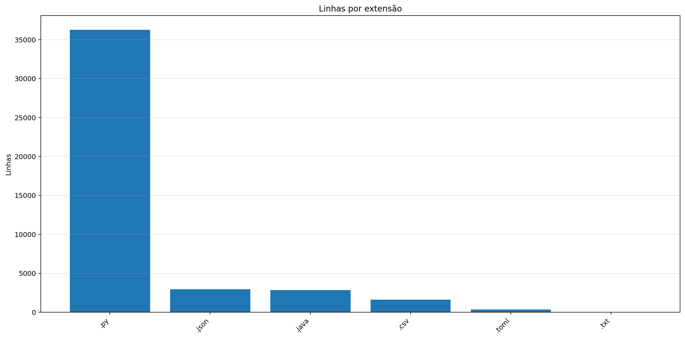

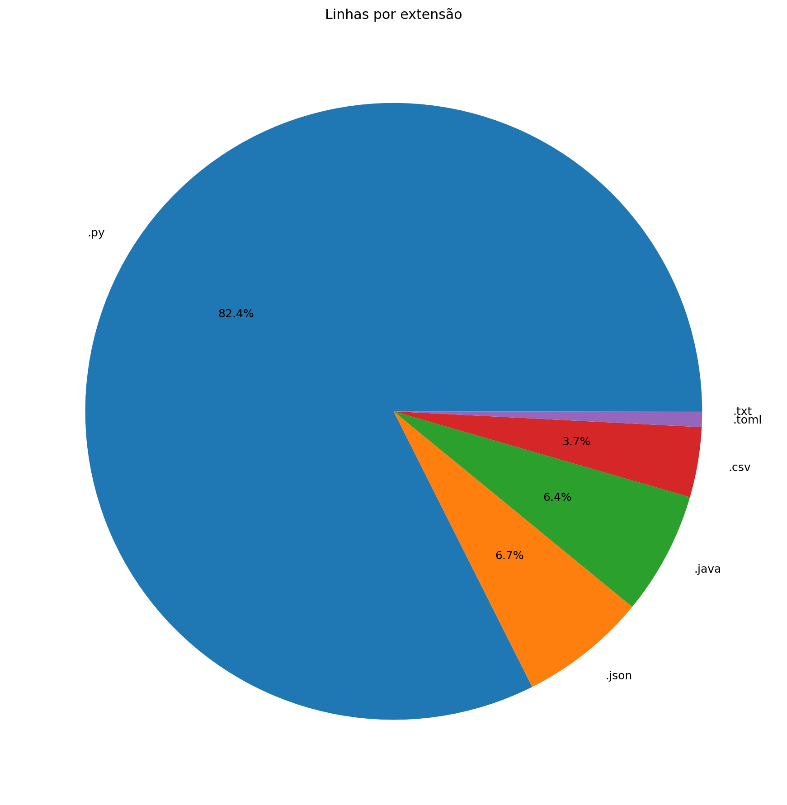

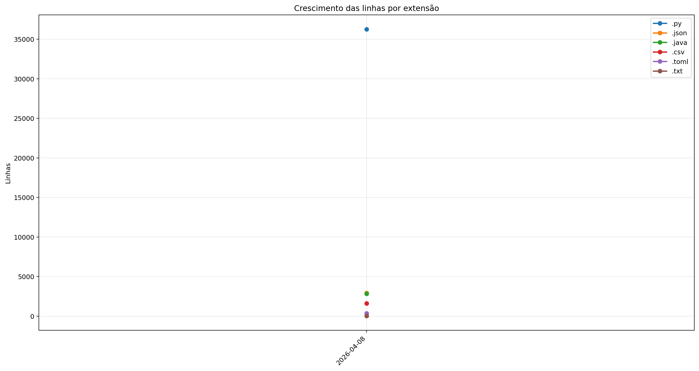

| Ext | Linhas | % das linhas | Arquivos | Peso |
|---:|---:|---:|---:|---:|
| `.py` | 36.273 | 82.41% | 142 | 1.46 MB |
| `.json` | 2.932 | 6.66% | 28 | 78.83 KB |
| `.java` | 2.835 | 6.44% | 1 | 123.53 KB |
| `.csv` | 1.616 | 3.67% | 7 | 163.60 KB |
| `.toml` | 349 | 0.79% | 10 | 7.83 KB |
| `.txt` | 10 | 0.02% | 4 | 233 bytes |

## 8. Peso por extensão

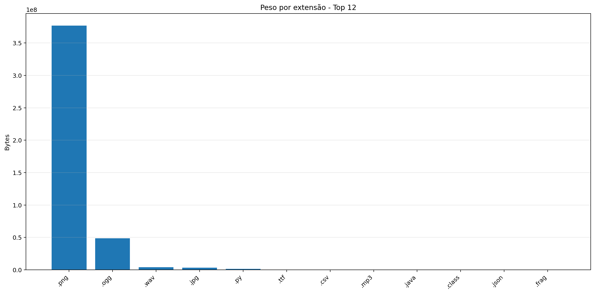

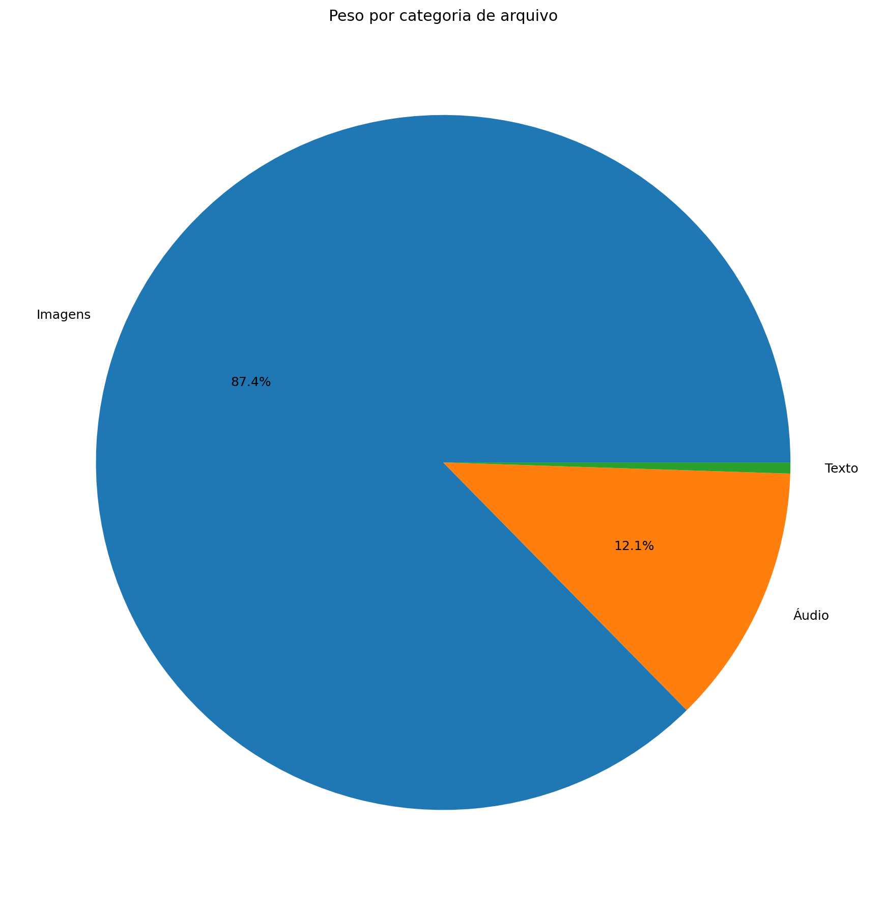

| Ext | Arquivos | Peso | % do jogo |
|---:|---:|---:|---:|
| `.png` | 68.782 | 359.28 MB | 86.61% |
| `.ogg` | 17 | 46.32 MB | 11.17% |
| `.wav` | 9 | 3.81 MB | 0.92% |
| `.jpg` | 21 | 3.14 MB | 0.76% |
| `.py` | 142 | 1.46 MB | 0.35% |
| `.ttf` | 2 | 196.64 KB | 0.05% |
| `.csv` | 7 | 163.60 KB | 0.04% |
| `.mp3` | 3 | 135.71 KB | 0.03% |
| `.java` | 1 | 123.53 KB | 0.03% |
| `.class` | 14 | 85.26 KB | 0.02% |
| `.json` | 28 | 78.83 KB | 0.02% |
| `.frag` | 2 | 14.41 KB | 0.00% |
| `.toml` | 10 | 7.83 KB | 0.00% |
| `.vert` | 2 | 317 bytes | 0.00% |
| `.txt` | 4 | 233 bytes | 0.00% |

## 9. Comparativo com o último relatório

_Sem relatório anterior compatível para montar comparativo._

### Top 3 commits por tamanho de diff

_Sem commits suficientes entre os relatórios para montar top por diff._

## 10. Gráficos de crescimento


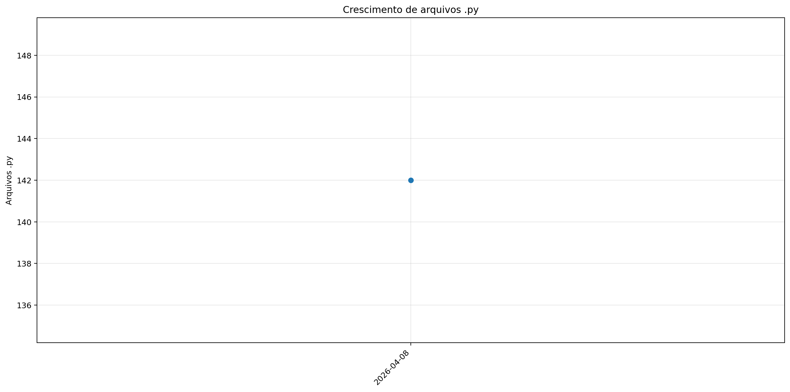

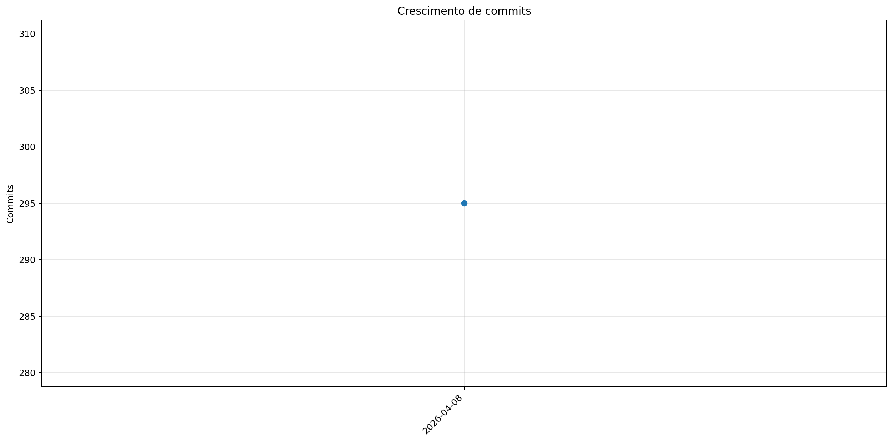

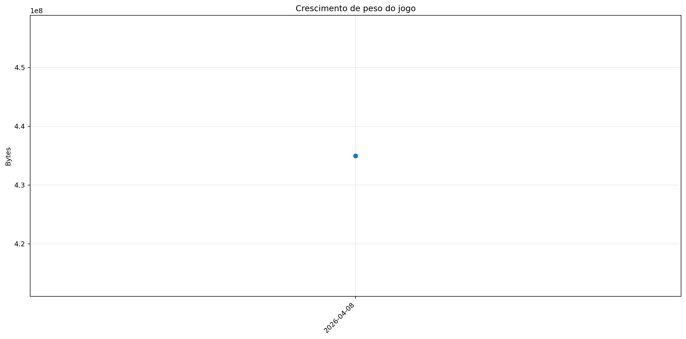

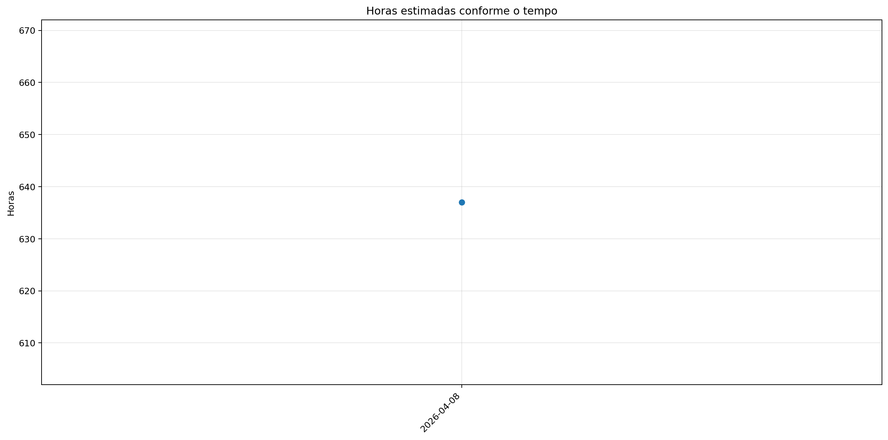
