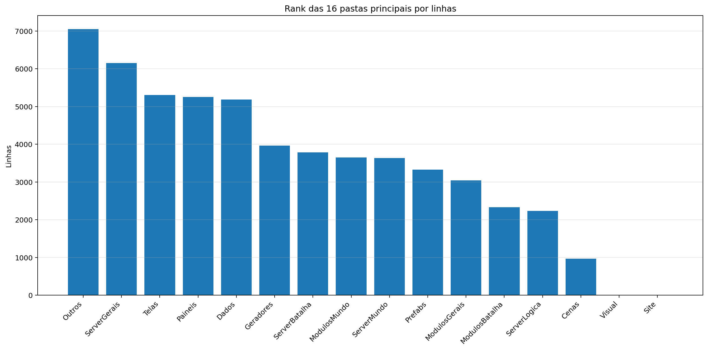
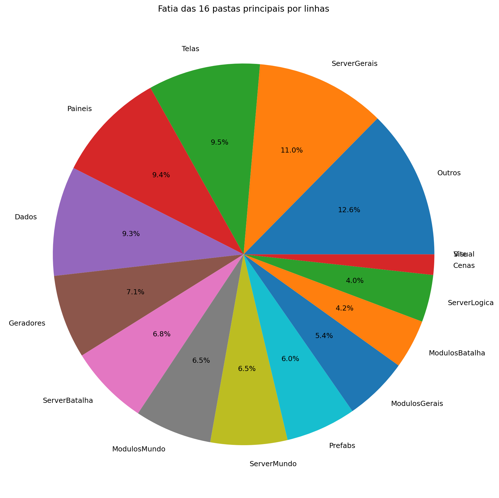
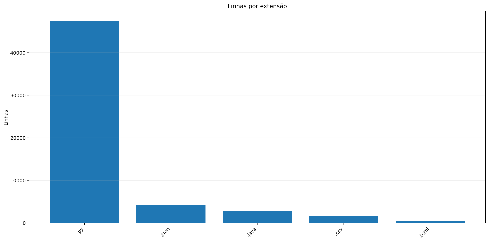
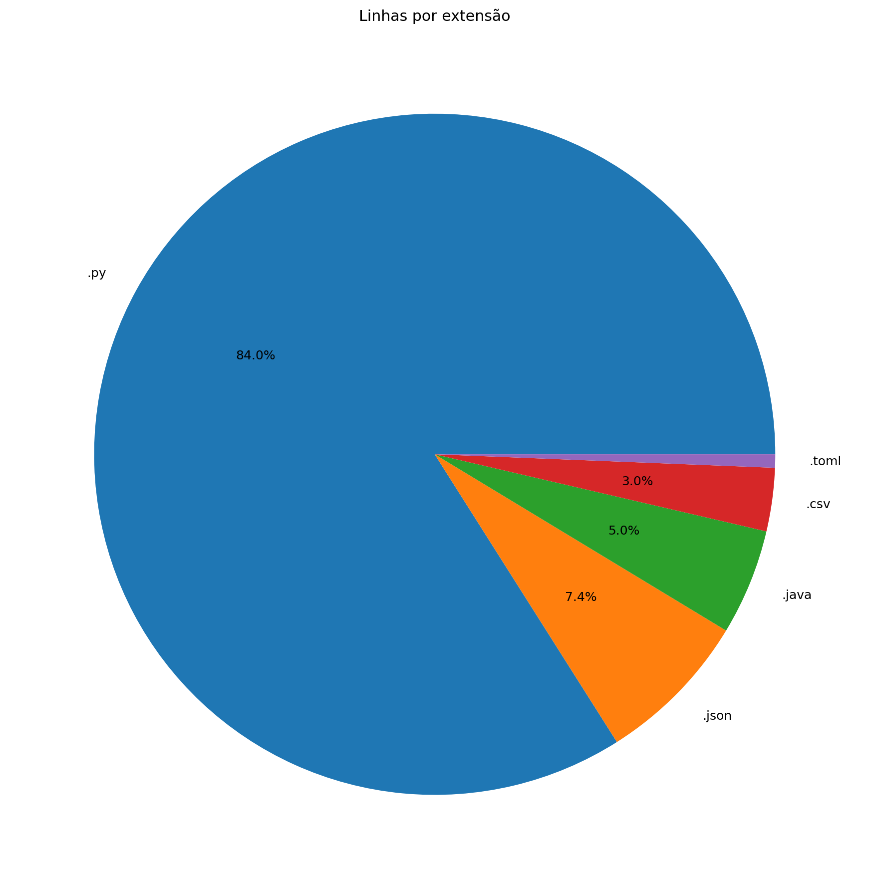
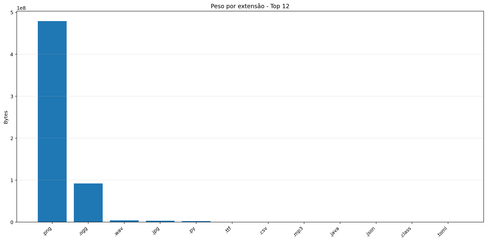
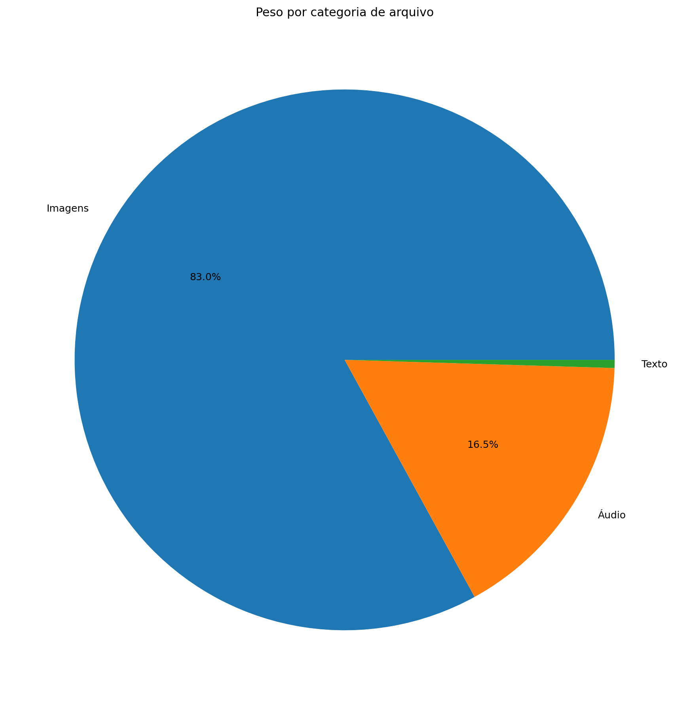
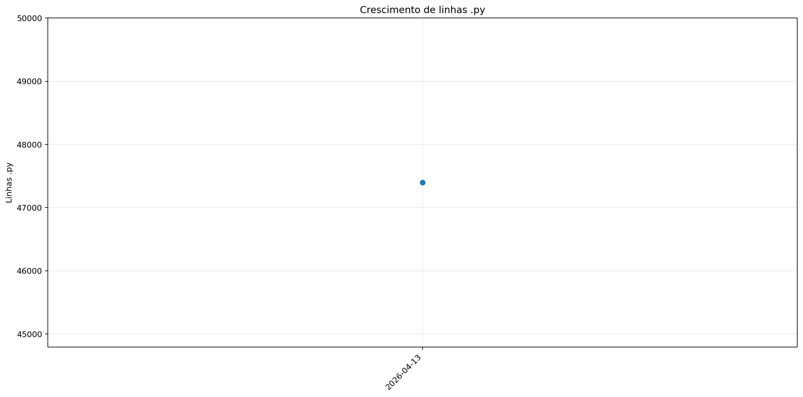
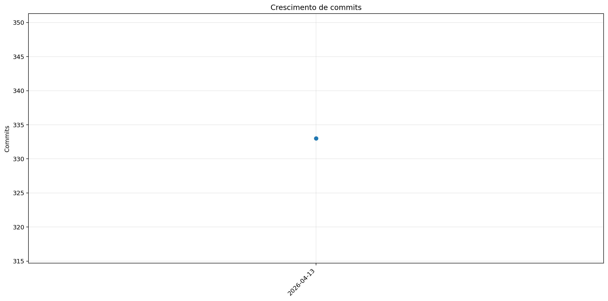
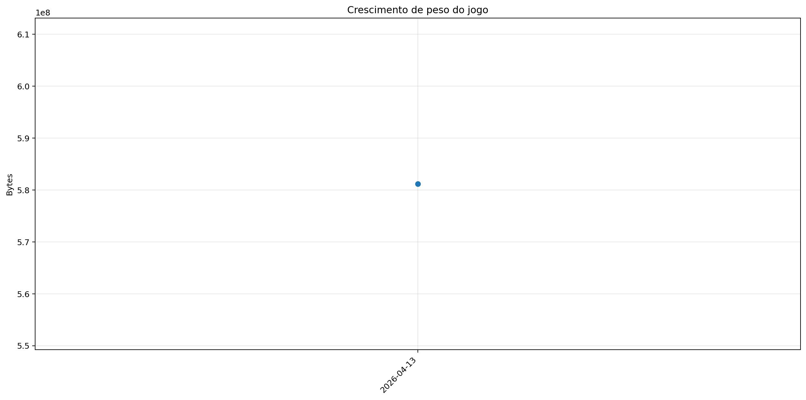

# Registro

**Relatório:** #1  
**Projeto:** `relatorio_rebuild_wkf5q2gi`  
**Gerado em:** 2026-04-29T23:51:00  
**Modelo de relatório:** 10  
**Autor:** Leon Cunha Alvaro Lopez Soto

## 1. Visão geral

- **Pastas:** 1.252
- **Arquivos:** 72.046
- **Arquivos de texto:** 217
- **Peso dos arquivos de texto:** 2435.16 KB
- **Tamanho total:** 0.541 GB (581.176.531 bytes)
- **Dias desde a criação do projeto:** 42
- **Dias desde a criação oficial:** 316
- **Horas estimadas:** 313.00
- **Linhas totais gerais:** 56.440
- **Commits (projeto):** 333

## 2. Python

- **Arquivos `.py`:** 165
- **Linhas totais:** 47.396
- **Tamanho total `.py`:** 2020.63 KB
- **Classes encontradas:** 158
- **Funções encontradas:** 608
- **Métodos encontrados:** 2.037
- **Total funções + métodos:** 2.645
- **Bibliotecas diferentes usadas:** 44

## 3. Principais pastas





| Rank | Pasta | Subpastas | Arquivos | Linhas gerais | Tamanho (KB) |
|---:|---|---:|---:|---:|---:|
| 1 | `Outros` | 0 | 9 | 7.055 | 274.73 |
| 2 | `ServerGerais` | 2 | 25 | 6.154 | 351.86 |
| 3 | `Telas` | 1 | 18 | 5.309 | 208.57 |
| 4 | `Paineis` | 0 | 15 | 5.256 | 221.84 |
| 5 | `Dados` | 3 | 37 | 5.188 | 268.27 |
| 6 | `Geradores` | 1 | 16 | 3.963 | 178.46 |
| 7 | `ServerBatalha` | 1 | 13 | 3.787 | 183.10 |
| 8 | `ModulosMundo` | 0 | 12 | 3.651 | 167.51 |
| 9 | `ServerMundo` | 1 | 16 | 3.637 | 188.85 |
| 10 | `Prefabs` | 0 | 15 | 3.328 | 120.18 |
| 11 | `ModulosGerais` | 0 | 12 | 3.042 | 112.89 |
| 12 | `ModulosBatalha` | 0 | 9 | 2.330 | 109.48 |
| 13 | `ServerLogica` | 3 | 17 | 2.238 | 73.45 |
| 14 | `Cenas` | 0 | 6 | 966 | 42.67 |
| 15 | `Visual` | 0 | 0 | 0 | 0.00 |
| 16 | `Site` | 0 | 0 | 0 | 0.00 |

## 4. Arquitetura

### `Codigo/`

```text
Codigo/
├── Cenas/
│   ├── CenaCarregamento.py
│   ├── CenaCombate.py
│   ├── CenaLogin.py
│   ├── CenaMenu.py
│   ├── CenaMundo.py
│   └── ControladorCenas.py
├── Geradores/
│   ├── Player/
│   │   ├── Controle.py
│   │   ├── Inventario.py
│   │   ├── Perfil.py
│   │   └── Player.py
│   ├── Ator.py
│   ├── Baus.py
│   ├── Dungeon.py
│   ├── Estadio.py
│   ├── EstruturaNaturais.py
│   ├── ItemInventario.py
│   ├── ItemMundo.py
│   ├── PokemonBatalha.py
│   ├── PokemonInventario.py
│   ├── PokemonMundo.py
│   ├── Projetil.py
│   └── XpMundo.py
├── ModulosBatalha/
│   ├── Arena.py
│   ├── ControladorBatalha.py
│   ├── ControladorFluxos.py
│   ├── ElementosHudBatalha.py
│   ├── InicializadorBatalha.py
│   ├── LeitorFluxos.py
│   ├── MontadorJogada.py
│   ├── PlayerBatalha.py
│   └── SistemaBatalha.py
├── ModulosGerais/
│   ├── Auxiliares.py
│   ├── Camera.py
│   ├── Colisor.py
│   ├── CompositorModernGL.py
│   ├── DesenhaAtor.py
│   ├── Discord.py
│   ├── EfeitosTela.py
│   ├── FiltroCamera.py
│   ├── ModuladorRegras.py
│   ├── PipelineGrafica.py
│   ├── PokemonAnimator.py
│   └── Sonoridades.py
├── ModulosMundo/
│   ├── ControladorAtores.py
│   ├── ControladorCriaveis.py
│   ├── ControladorMundo.py
│   ├── ControladorObjetos.py
│   ├── ControladorPlayer.py
│   ├── ElementosHudMundo.py
│   ├── ExecutaveisPoção.py
│   ├── LeitorDialogo.py
│   ├── LeitorMundo.py
│   ├── Loja.py
│   ├── ServicoCraft.py
│   └── SistemaPacotes.py
├── Outros/
│   └── Shaders/
│       ├── mundo.frag
│       └── mundo.vert
├── Paineis/
│   ├── Container.py
│   ├── FichaAtaque.py
│   ├── FichaItem.py
│   ├── FichaPokemon.py
│   ├── FichaPokemonBatalha.py
│   ├── FichaPokemonCombate.py
│   ├── Musicdex.py
│   ├── PainelArvoreHabilidades.py
│   ├── PainelAuxiliarPoke.py
│   ├── PainelCraft.py
│   ├── PainelJogada.py
│   ├── PainelReceitas.py
│   ├── PainelTimes.py
│   ├── Pokedex.py
│   └── Skindex.py
├── Prefabs/
│   ├── Arrastavel.py
│   ├── Barra.py
│   ├── BarraPesquisa.py
│   ├── Botao.py
│   ├── CaixaTexto.py
│   ├── EfeitosVisuais.py
│   ├── Fluxos.py
│   ├── Imagem.py
│   ├── Mensagem.py
│   ├── Mensagens.py
│   ├── Opcoes.py
│   ├── Painel.py
│   ├── Terminal.py
│   ├── Texto.py
│   └── Tooltip.py
├── Server/
│   ├── Login.py
│   ├── ServerBatalha.py
│   ├── ServerCombate.py
│   ├── ServerMenu.py
│   └── ServerMundo.py
└── Telas/
    ├── Inventario/
    │   ├── Estatisticas.py
    │   ├── InventarioItens.py
    │   ├── InventarioPokemons.py
    │   └── SubtelaInventario.py
    ├── Creditos.py
    ├── Mapa.py
    ├── Opções.py
    ├── Subtela.py
    ├── SubtelaCriarPersonagem.py
    ├── SubtelaDialogo.py
    ├── SubtelaOpcoes.py
    ├── SubtelaPreBatalha.py
    ├── TelaConfig.py
    ├── TelaLogin.py
    ├── TelaMenu.py
    ├── TelaOperador.py
    ├── TelaServers.py
    └── TelasGenericas.py
```

### `Server/`

```text
SimuladorServerJogo/
├── Batalha/
│   ├── IA/
│   │   ├── AdaptadorJogo.py
│   │   ├── AvaliadorAcoes.py
│   │   ├── BotBatalha.py
│   │   ├── DificuldadeIA.py
│   │   ├── EstadoIA.py
│   │   └── GeradorAcoes.py
│   ├── FraquezasResistencias.py
│   ├── GerenciadorBatalhas.py
│   ├── LeitorJogadas.py
│   ├── ObjetoBatalha.py
│   ├── PokemonBatalha.py
│   ├── SimuladorFisica.py
│   └── SistemaBatalha.py
├── Gerais/
│   ├── Geradores/
│   │   ├── GeradorBaus.py
│   │   ├── GeradorMundo.py
│   │   ├── GeradorPokemon.py
│   │   ├── WorldGenerator$1.class
│   │   ├── WorldGenerator$Biome.class
│   │   ├── WorldGenerator$BiomeRule.class
│   │   ├── WorldGenerator$Generator.class
│   │   ├── WorldGenerator$NaturalStructure.class
│   │   ├── WorldGenerator$Poi.class
│   │   ├── WorldGenerator$PoiType.class
│   │   ├── WorldGenerator$Rules$BiomeStructureOverride.class
│   │   ├── WorldGenerator$Rules.class
│   │   ├── WorldGenerator$SimpleJson$Parser.class
│   │   ├── WorldGenerator$SimpleJson.class
│   │   ├── WorldGenerator$StructureRule.class
│   │   ├── WorldGenerator$Tile.class
│   │   ├── WorldGenerator.class
│   │   └── WorldGenerator.java
│   ├── Rotas/
│   │   ├── Ativador.py
│   │   ├── Atualizador.py
│   │   ├── Entrada.py
│   │   ├── ServerOperar.py
│   │   └── Terminal.py
│   ├── EstadoServidor.py
│   └── LoaderRegras.py
├── Logica/
│   ├── Comandos/
│   │   └── Comandos.py
│   ├── Executes/
│   │   ├── ExecutesFrutas.py
│   │   ├── ExecutesPokebolas.py
│   │   ├── FuncoesAtaques.py
│   │   ├── PassivasEquipaveis.py
│   │   └── PassivasHabilidades.py
│   └── Regras/
│       ├── Ciclo.toml
│       ├── EstruturasNaturais.toml
│       ├── Geracao.json
│       ├── Gerais.toml
│       ├── Mundo.toml
│       ├── NPCs.toml
│       ├── Player.toml
│       ├── Pokemons.toml
│       ├── Projeteis.toml
│       ├── Server.toml
│       └── Spawn.toml
└── Mundo/
    ├── Cerebros/
    │   ├── CerebroBaus.py
    │   ├── CerebroCentral.py
    │   ├── CerebroEstadios.py
    │   ├── CerebroEstruturasNaturais.py
    │   ├── CerebroItensMundo.py
    │   ├── CerebroNPCs.py
    │   ├── CerebroPokemons.py
    │   ├── CerebroProjeteis.py
    │   ├── CerebroTempo.py
    │   └── CerebroXpMundo.py
    ├── AutoridadeCaptura.py
    ├── BancoDados.py
    ├── ObjetosMundoServer.py
    ├── PacotesTick.py
    ├── ServicoInventario.py
    └── TiqueServidor.py
```

### `Dados/`

```text
Dados/
├── InteracoesNPC/
│   ├── Combatentes/
│   │   ├── Alleka.json
│   │   ├── Amable.json
│   │   ├── Caio.json
│   │   ├── Felipox.json
│   │   ├── Felps.json
│   │   ├── Ferraz.json
│   │   ├── Garcia.json
│   │   ├── Guedes.json
│   │   ├── Henrique.json
│   │   ├── João.json
│   │   ├── Lisciele.json
│   │   ├── Murilo.json
│   │   ├── Nathzinha.json
│   │   ├── Paulo.json
│   │   ├── Ph.json
│   │   ├── Ramos.json
│   │   ├── Sidney.json
│   │   ├── Suneiva.json
│   │   ├── Suriane.json
│   │   └── Vasques.json
│   ├── Vendedores/
│   │   └── Josefa.json
│   ├── ExemploCapitao_Laura.json
│   ├── ExemploDesafiante_Ravi.json
│   ├── ExemploDissociado_Nico.json
│   ├── ExemploLider_Alleka.json
│   └── ManualDialogos.json
├── Pokemon Global Server - Ataques.csv
├── Pokemon Global Server - Baus.csv
├── Pokemon Global Server - Efeitos.csv
├── Pokemon Global Server - Equipaveis.csv
├── Pokemon Global Server - Fluxos.json
├── Pokemon Global Server - Itens.csv
├── Pokemon Global Server - NPC Combatente.csv
├── Pokemon Global Server - NPC Vendedor.csv
├── Pokemon Global Server - Pokemons.csv
├── Pokemon Global Server - Receitas.json
└── Pokemon Global Server - Sistema FR.csv
```

### `Site/`

```text
Site/
└── (pasta não encontrada)
```

### `Outros/`

```text
Outros/
├── AtualizadorReadMe.py
├── AtualizadorRelatorios.py
├── ConfigFixa.py
├── EditorFluxos.py
├── EditorSkins.py
├── GeradorRelatorios.py
├── GeradorRelatoriosFuturo.py
├── Mixer.py
└── PokemonAnimatorEditor.py
```

## 5. Ranks

### Top 50 maiores arquivos `.py` por linhas

| Arquivo | Linhas | Tamanho (KB) |
|---|---:|---:|
| `Outros/EditorFluxos.py` | 1.858 | 85.38 |
| `Outros/GeradorRelatorios.py` | 1.757 | 65.51 |
| `SimuladorServerJogo/Batalha/LeitorJogadas.py` | 1.398 | 76.97 |
| `Outros/GeradorRelatoriosFuturo.py` | 1.290 | 45.48 |
| `Codigo/Paineis/FichaPokemon.py` | 1.277 | 57.22 |
| `Codigo/Telas/Inventario/InventarioPokemons.py` | 1.061 | 48.38 |
| `Codigo/ModulosMundo/ControladorObjetos.py` | 809 | 39.99 |
| `SimuladorServerJogo/Gerais/EstadoServidor.py` | 754 | 30.44 |
| `Codigo/ModulosMundo/ControladorPlayer.py` | 710 | 33.86 |
| `Codigo/ModulosBatalha/ControladorFluxos.py` | 708 | 32.85 |
| `SimuladorServerJogo/Logica/Comandos/Comandos.py` | 686 | 28.54 |
| `Codigo/Geradores/PokemonMundo.py` | 685 | 33.75 |
| `Codigo/Paineis/FichaPokemonBatalha.py` | 642 | 30.94 |
| `Codigo/Paineis/Container.py` | 637 | 23.33 |
| `Codigo/Geradores/PokemonBatalha.py` | 628 | 30.84 |
| `SimuladorServerJogo/Batalha/PokemonBatalha.py` | 613 | 29.23 |
| `SimuladorServerJogo/Mundo/BancoDados.py` | 601 | 28.48 |
| `Codigo/ModulosGerais/PokemonAnimator.py` | 568 | 21.82 |
| `Codigo/Prefabs/Texto.py` | 557 | 20.80 |
| `Codigo/ModulosGerais/Sonoridades.py` | 553 | 14.59 |
| `Codigo/Paineis/PainelArvoreHabilidades.py` | 547 | 26.81 |
| `SimuladorServerJogo/Gerais/Rotas/Atualizador.py` | 534 | 25.62 |
| `Outros/EditorSkins.py` | 514 | 19.97 |
| `SimuladorServerJogo/Gerais/Geradores/GeradorPokemon.py` | 509 | 20.36 |
| `Codigo/Telas/Inventario/InventarioItens.py` | 509 | 23.76 |
| `Outros/AtualizadorRelatorios.py` | 505 | 17.88 |
| `SimuladorServerJogo/Mundo/Cerebros/CerebroNPCs.py` | 500 | 26.01 |
| `Codigo/Telas/TelaServers.py` | 492 | 15.67 |
| `Codigo/Prefabs/Botao.py` | 480 | 17.59 |
| `Codigo/ModulosMundo/LeitorDialogo.py` | 478 | 19.33 |
| `SimuladorServerJogo/Mundo/ObjetosMundoServer.py` | 472 | 30.55 |
| `Outros/AtualizadorReadMe.py` | 461 | 16.36 |
| `Outros/Mixer.py` | 460 | 15.31 |
| `Codigo/ModulosGerais/FiltroCamera.py` | 460 | 21.03 |
| `Codigo/Paineis/PainelReceitas.py` | 455 | 15.29 |
| `Codigo/Telas/TelasGenericas.py` | 448 | 15.30 |
| `SimuladorServerJogo/Gerais/Geradores/GeradorMundo.py` | 438 | 17.13 |
| `Codigo/Telas/SubtelaDialogo.py` | 428 | 18.78 |
| `Codigo/Telas/SubtelaCriarPersonagem.py` | 423 | 15.31 |
| `Codigo/Cenas/CenaMundo.py` | 415 | 21.70 |
| `Codigo/Geradores/Ator.py` | 409 | 17.87 |
| `Codigo/Telas/Inventario/Estatisticas.py` | 401 | 17.83 |
| `SimuladorServerJogo/Mundo/Cerebros/CerebroCentral.py` | 400 | 20.63 |
| `Codigo/Geradores/Player/Controle.py` | 400 | 17.10 |
| `Codigo/ModulosGerais/Colisor.py` | 379 | 14.48 |
| `Codigo/Telas/TelaOperador.py` | 379 | 13.53 |
| `SimuladorServerJogo/Batalha/SistemaBatalha.py` | 358 | 16.16 |
| `Codigo/Geradores/Estadio.py` | 358 | 13.38 |
| `Codigo/ModulosMundo/LeitorMundo.py` | 358 | 17.13 |
| `Codigo/Paineis/FichaAtaque.py` | 357 | 14.31 |

### Top 20 maiores classes

| Arquivo | Classe | Linhas |
|---|---|---:|
| `SimuladorServerJogo/Batalha/LeitorJogadas.py` | `LeitorJogadas` | 1.384 |
| `Codigo/Paineis/FichaPokemon.py` | `FichaPokemon` | 1.245 |
| `Codigo/Telas/Inventario/InventarioPokemons.py` | `InventarioPokemons` | 1.033 |
| `Outros/EditorFluxos.py` | `EditorFluxos` | 986 |
| `Codigo/ModulosMundo/ControladorObjetos.py` | `ControladorObjetos` | 788 |
| `Codigo/ModulosBatalha/ControladorFluxos.py` | `ControladorFluxos` | 694 |
| `Codigo/ModulosMundo/ControladorPlayer.py` | `ControladorPlayer` | 691 |
| `Codigo/Geradores/PokemonMundo.py` | `Pokemon` | 661 |
| `Codigo/Paineis/Container.py` | `Container` | 628 |
| `Codigo/Paineis/FichaPokemonBatalha.py` | `FichaPokemonBatalha` | 624 |
| `Codigo/Geradores/PokemonBatalha.py` | `PokemonBatalha` | 606 |
| `SimuladorServerJogo/Batalha/PokemonBatalha.py` | `PokemonBatalha` | 582 |
| `SimuladorServerJogo/Mundo/BancoDados.py` | `BancoDadosMundo` | 573 |
| `Codigo/Paineis/PainelArvoreHabilidades.py` | `PainelArvoreHabilidades` | 517 |
| `Codigo/Telas/Inventario/InventarioItens.py` | `InventarioItens` | 492 |
| `SimuladorServerJogo/Mundo/Cerebros/CerebroNPCs.py` | `CerebroNPCs` | 480 |
| `Codigo/ModulosGerais/PokemonAnimator.py` | `PokemonAnimator` | 471 |
| `Codigo/ModulosMundo/LeitorDialogo.py` | `LeitorDialogo` | 468 |
| `Codigo/ModulosGerais/FiltroCamera.py` | `FiltroCamera` | 451 |
| `Codigo/Paineis/PainelReceitas.py` | `PainelReceitas` | 439 |

### Top 20 maiores funções e métodos

| Arquivo | Nome | Tipo | Linhas |
|---|---|---:|---:|
| `Codigo/Prefabs/Fluxos.py` | `Fluxo.desenhar` | metodo | 249 |
| `Outros/GeradorRelatorios.py` | `coletar_metricas` | funcao | 247 |
| `SimuladorServerJogo/Batalha/LeitorJogadas.py` | `LeitorJogadas._traduzir_evento_publico` | metodo | 245 |
| `Codigo/Geradores/Estadio.py` | `EstadioInterno.renderizar` | metodo | 232 |
| `SimuladorServerJogo/Gerais/Rotas/Atualizador.py` | `processar_atualizador_json` | funcao | 230 |
| `SimuladorServerJogo/Batalha/LeitorJogadas.py` | `LeitorJogadas.executar_turno` | metodo | 203 |
| `Outros/GeradorRelatoriosFuturo.py` | `coletar_metricas` | funcao | 184 |
| `Codigo/Telas/Inventario/InventarioPokemons.py` | `InventarioPokemons.atualizar` | metodo | 147 |
| `Codigo/ModulosGerais/Colisor.py` | `Colisor.resolver_movimento_com_colisores` | metodo | 146 |
| `Outros/GeradorRelatorios.py` | `gerar_markdown` | funcao | 139 |
| `Outros/GeradorRelatorios.py` | `analisar_python_ast` | funcao | 132 |
| `Outros/GeradorRelatoriosFuturo.py` | `analisar_python_ast` | funcao | 132 |
| `Codigo/Telas/TelaMenu.py` | `TelaMenu` | funcao | 131 |
| `Outros/AtualizadorRelatorios.py` | `main` | funcao | 128 |
| `Outros/EditorFluxos.py` | `EditorFluxos.draw_panel` | metodo | 127 |
| `Codigo/Prefabs/Botao.py` | `Botao.render` | metodo | 119 |
| `Codigo/Telas/Inventario/InventarioPokemons.py` | `InventarioPokemons._reconstruir` | metodo | 118 |
| `SimuladorServerJogo/Gerais/Geradores/GeradorMundo.py` | `_executar_world_generator` | funcao | 113 |
| `Codigo/Telas/SubtelaCriarPersonagem.py` | `SubtelaCriarPersonagem._rebuild_layout` | metodo | 112 |
| `SimuladorServerJogo/Batalha/PokemonBatalha.py` | `PokemonBatalha.Verifica` | metodo | 110 |

### Top 10 arquivos mais importados

| Arquivo | Vezes importado |
|---|---:|
| `Codigo/Prefabs/Texto.py` | 34 |
| `Codigo/Prefabs/Botao.py` | 24 |
| `Codigo/Geradores/ItemInventario.py` | 14 |
| `Codigo/ModulosGerais/Sonoridades.py` | 13 |
| `SimuladorServerJogo/Gerais/EstadoServidor.py` | 13 |
| `SimuladorServerJogo/Gerais/Rotas/Ativador.py` | 12 |
| `Codigo/ModulosGerais/Auxiliares.py` | 10 |
| `SimuladorServerJogo/Gerais/LoaderRegras.py` | 9 |
| `Codigo/ModulosGerais/Colisor.py` | 9 |
| `Codigo/Prefabs/Barra.py` | 9 |

### Top 10 arquivos que mais importam

| Arquivo | Arquivos internos importados | Imports totais | Linhas |
|---|---:|---:|---:|
| `Codigo/Cenas/CenaMundo.py` | 18 | 20 | 415 |
| `Codigo/Telas/Inventario/InventarioPokemons.py` | 14 | 21 | 1.061 |
| `Codigo/Cenas/ControladorCenas.py` | 11 | 13 | 248 |
| `Codigo/Telas/Inventario/InventarioItens.py` | 10 | 13 | 509 |
| `Codigo/Paineis/FichaPokemon.py` | 9 | 22 | 1.277 |
| `Codigo/Paineis/FichaPokemonBatalha.py` | 8 | 13 | 642 |
| `SimuladorServerJogo/Gerais/Rotas/Atualizador.py` | 7 | 16 | 534 |
| `Codigo/ModulosMundo/ControladorObjetos.py` | 7 | 14 | 809 |
| `Codigo/Telas/SubtelaCriarPersonagem.py` | 7 | 10 | 423 |
| `Codigo/Telas/Inventario/Estatisticas.py` | 7 | 10 | 401 |

### Top 10 maiores arquivos por linhas

| Arquivo | Ext | Linhas |
|---|---:|---:|
| `SimuladorServerJogo/Gerais/Geradores/WorldGenerator.java` | `.java` | 2.835 |
| `Outros/EditorFluxos.py` | `.py` | 1.858 |
| `Outros/GeradorRelatorios.py` | `.py` | 1.757 |
| `SimuladorServerJogo/Batalha/LeitorJogadas.py` | `.py` | 1.398 |
| `Outros/GeradorRelatoriosFuturo.py` | `.py` | 1.290 |
| `Dados/Pokemon Global Server - Pokemons.csv` | `.csv` | 1.277 |
| `Codigo/Paineis/FichaPokemon.py` | `.py` | 1.277 |
| `Codigo/Telas/Inventario/InventarioPokemons.py` | `.py` | 1.061 |
| `Codigo/ModulosMundo/ControladorObjetos.py` | `.py` | 809 |
| `SimuladorServerJogo/Gerais/EstadoServidor.py` | `.py` | 754 |

## 6. Linhas por extensão





| Ext | Linhas | % das linhas | Arquivos | Peso |
|---:|---:|---:|---:|---:|
| `.py` | 47.396 | 83.98% | 165 | 1.97 MB |
| `.json` | 4.151 | 7.36% | 29 | 113.51 KB |
| `.java` | 2.835 | 5.02% | 1 | 123.53 KB |
| `.csv` | 1.695 | 3.00% | 9 | 169.36 KB |
| `.toml` | 357 | 0.63% | 10 | 8.07 KB |

## 7. Peso por extensão





| Ext | Arquivos | Peso | % do jogo |
|---:|---:|---:|---:|
| `.png` | 71.744 | 456.84 MB | 82.42% |
| `.ogg` | 34 | 87.67 MB | 15.82% |
| `.wav` | 9 | 3.81 MB | 0.69% |
| `.jpg` | 21 | 3.14 MB | 0.57% |
| `.py` | 165 | 1.97 MB | 0.36% |
| `.ttf` | 2 | 196.64 KB | 0.03% |
| `.csv` | 9 | 169.36 KB | 0.03% |
| `.mp3` | 3 | 135.71 KB | 0.02% |
| `.java` | 1 | 123.53 KB | 0.02% |
| `.json` | 29 | 113.51 KB | 0.02% |
| `.class` | 14 | 85.27 KB | 0.01% |
| `.toml` | 10 | 8.07 KB | 0.00% |
| `.frag` | 1 | 7.18 KB | 0.00% |
| `.vert` | 1 | 170 bytes | 0.00% |

## 8. Comparativo com o último relatório

_Sem relatório anterior compatível para montar comparativo._

### Top 3 commits por tamanho de diff

_Sem commits suficientes entre os relatórios para montar top por diff._

## 9. Gráficos de crescimento








