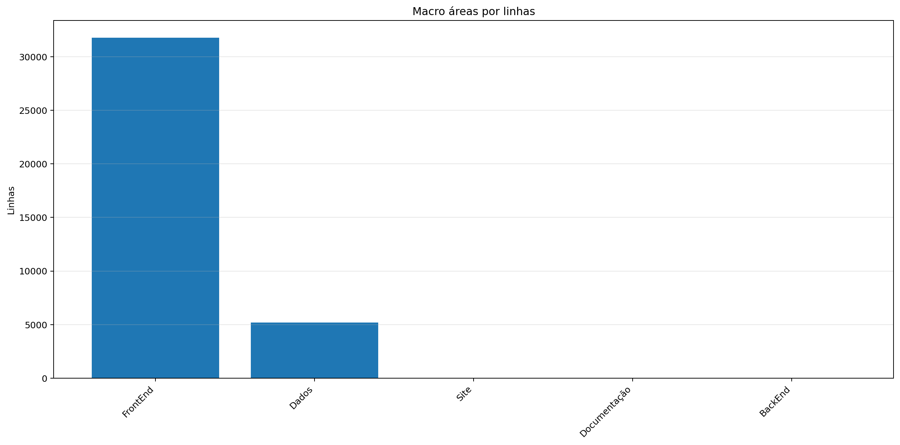
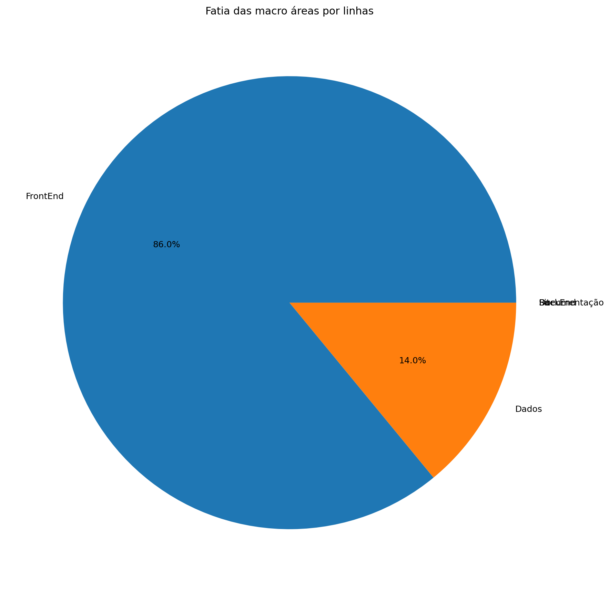
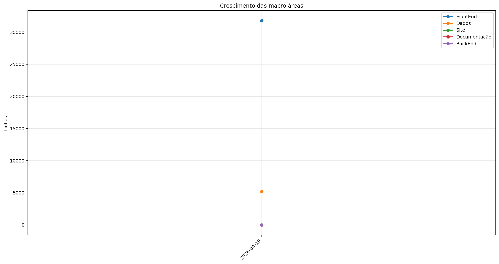
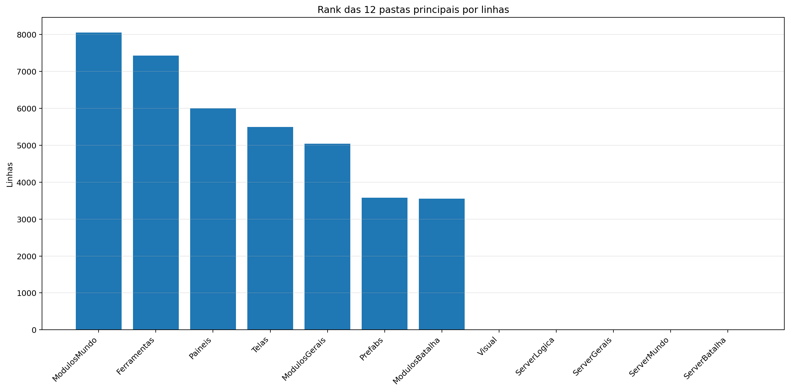
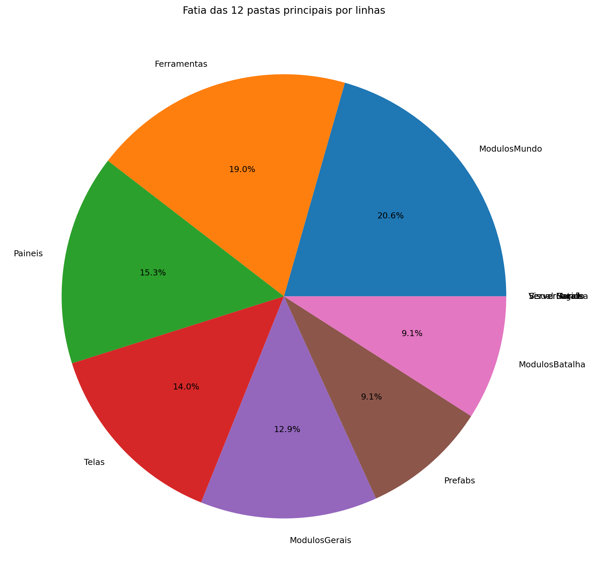
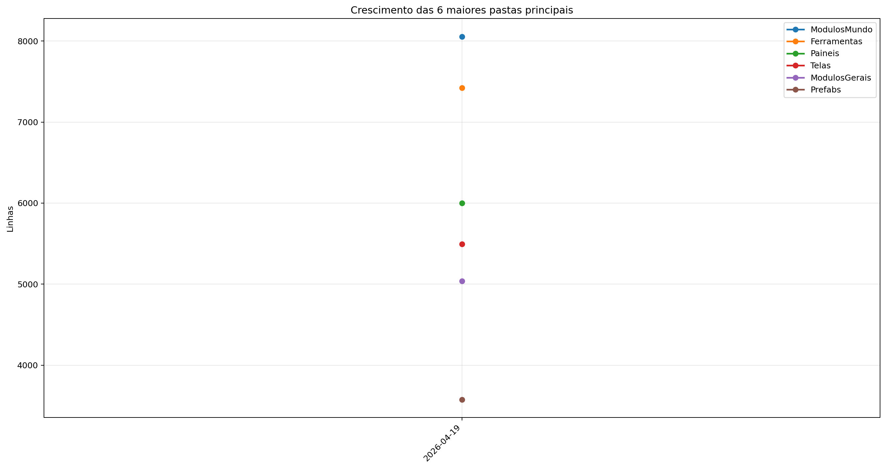
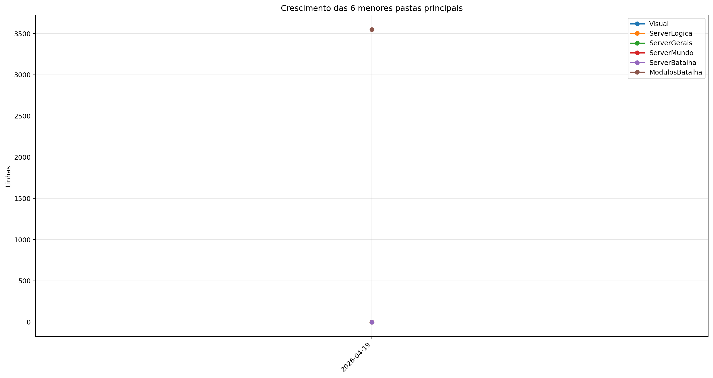
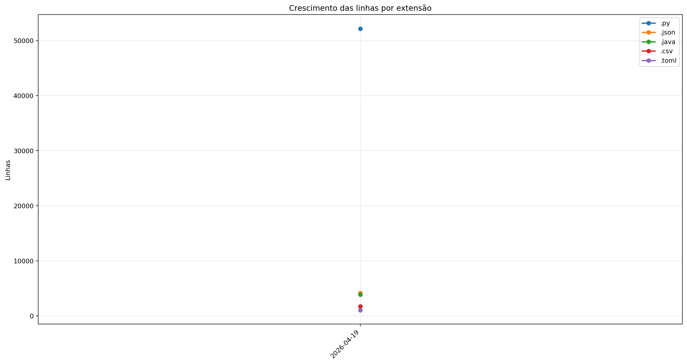
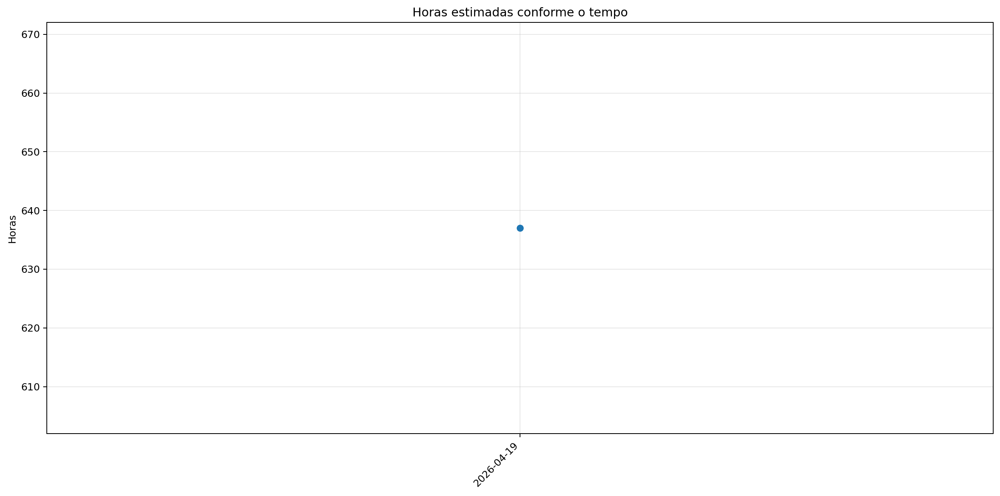

# Registro

**Relatório:** #1  
**Projeto:** `relatorio_rebuild_axgdpvhu`  
**Gerado em:** 2026-05-15T10:46:58  
**Modelo de relatório:** 11  
**Autor:** Leon Cunha Alvaro Lopez Soto

## 1. Visão geral

- **Pastas:** 1.254
- **Arquivos:** 72.098
- **Arquivos de texto:** 228
- **Peso dos arquivos de texto:** 2698.67 KB
- **Tamanho total:** 0.554 GB (594.632.004 bytes)
- **Dias desde a criação do projeto:** 48
- **Dias desde a criação oficial:** 322
- **Horas estimadas:** 343.50
- **Linhas totais gerais:** 62.913
- **Commits (projeto):** 369

## 2. Python

- **Arquivos `.py`:** 168
- **Linhas totais:** 52.176
- **Tamanho total `.py`:** 2240.28 KB
- **Classes encontradas:** 168
- **Funções encontradas:** 657
- **Métodos encontrados:** 2.264
- **Total funções + métodos:** 2.921
- **Bibliotecas diferentes usadas:** 44

## 3. Macro áreas







| Rank | Área | Caminho | Subpastas | Arquivos | Linhas gerais | Tamanho (KB) |
|---:|---|---|---:|---:|---:|---:|
| 1 | `FrontEnd` | `Codigo + Game.py` | 13 | 114 | 31.797 | 1343.57 |
| 2 | `Dados` | `Dados` | 3 | 37 | 5.195 | 277.58 |
| 3 | `Site` | `Site/src` | 0 | 0 | 0 | 0.00 |
| 4 | `Documentação` | `Documentação` | 0 | 0 | 0 | 0.00 |
| 5 | `BackEnd` | `Servidor + ServidorGeral` | 0 | 0 | 0 | 0.00 |

## 4. Principais pastas









| Rank | Pasta | Subpastas | Arquivos | Linhas gerais | Tamanho (KB) |
|---:|---|---:|---:|---:|---:|
| 1 | `ModulosMundo` | 1 | 28 | 8.055 | 365.72 |
| 2 | `Ferramentas` | 0 | 9 | 7.424 | 290.03 |
| 3 | `Paineis` | 0 | 16 | 6.001 | 258.42 |
| 4 | `Telas` | 1 | 19 | 5.496 | 217.43 |
| 5 | `ModulosGerais` | 0 | 23 | 5.039 | 197.62 |
| 6 | `Prefabs` | 0 | 14 | 3.576 | 130.34 |
| 7 | `ModulosBatalha` | 0 | 11 | 3.549 | 164.24 |
| 8 | `Visual` | 0 | 0 | 0 | 0.00 |
| 9 | `ServerLogica` | 0 | 0 | 0 | 0.00 |
| 10 | `ServerGerais` | 0 | 0 | 0 | 0.00 |
| 11 | `ServerMundo` | 0 | 0 | 0 | 0.00 |
| 12 | `ServerBatalha` | 0 | 0 | 0 | 0.00 |

## 5. Arquitetura

### `Codigo/`

```text
Codigo/
├── Cenas/
│   ├── CenaCarregamento.py
│   ├── CenaCombate.py
│   ├── CenaLogin.py
│   ├── CenaMenu.py
│   ├── CenaMundo.py
│   └── ControladorCenas.py
├── Geradores/
│   ├── Player/
│   │   ├── Controle.py
│   │   ├── Inventario.py
│   │   ├── Perfil.py
│   │   └── Player.py
│   ├── Ator.py
│   ├── Baus.py
│   ├── Dungeon.py
│   ├── Estadio.py
│   ├── EstruturaNaturais.py
│   ├── ItemInventario.py
│   ├── ItemMundo.py
│   ├── PokemonBatalha.py
│   ├── PokemonInventario.py
│   ├── PokemonMundo.py
│   ├── Projetil.py
│   └── XpMundo.py
├── ModulosBatalha/
│   ├── Arena.py
│   ├── ControladorBatalha.py
│   ├── ControladorFluxos.py
│   ├── ElementosHudBatalha.py
│   ├── FinalizadorBatalha.py
│   ├── InicializadorBatalha.py
│   ├── LeitorFluxos.py
│   ├── LeitorLogs.py
│   ├── MontadorJogada.py
│   ├── PlayerBatalha.py
│   └── SistemaBatalha.py
├── ModulosGerais/
│   ├── Auxiliares.py
│   ├── Camera.py
│   ├── Colisor.py
│   ├── CompositorModernGL.py
│   ├── DesenhaAtor.py
│   ├── Discord.py
│   ├── EfeitosTela.py
│   ├── FiltroCamera.py
│   ├── GerenciadorTiles.py
│   ├── ModuladorRegras.py
│   ├── PipelineGrafica.py
│   ├── PokemonAnimator.py
│   └── Sonoridades.py
├── ModulosMundo/
│   ├── ControladorAtores.py
│   ├── ControladorCriaveis.py
│   ├── ControladorMundo.py
│   ├── ControladorObjetos.py
│   ├── ControladorPlayer.py
│   ├── ElementosHudMundo.py
│   ├── ExecutaveisPoção.py
│   ├── LeitorDialogo.py
│   ├── LeitorMundo.py
│   ├── Loja.py
│   ├── ServicoCraft.py
│   └── SistemaPacotes.py
├── Outros/
│   └── Shaders/
│       ├── mundo.frag
│       └── mundo.vert
├── Paineis/
│   ├── Container.py
│   ├── FichaAtaque.py
│   ├── FichaItem.py
│   ├── FichaPokemon.py
│   ├── FichaPokemonBatalha.py
│   ├── FichaPokemonCombate.py
│   ├── Musicdex.py
│   ├── PainelArvoreHabilidades.py
│   ├── PainelAuxiliarPoke.py
│   ├── PainelCraft.py
│   ├── PainelJogada.py
│   ├── PainelReceitas.py
│   ├── PainelTimes.py
│   ├── Pokedex.py
│   ├── Skindex.py
│   └── VisualizadorLog.py
├── Prefabs/
│   ├── Arrastavel.py
│   ├── Barra.py
│   ├── BarraPesquisa.py
│   ├── Botao.py
│   ├── CaixaTexto.py
│   ├── EfeitosVisuais.py
│   ├── Fluxos.py
│   ├── Imagem.py
│   ├── Mensagem.py
│   ├── Opcoes.py
│   ├── Painel.py
│   ├── Terminal.py
│   ├── Texto.py
│   └── Tooltip.py
├── Server/
│   ├── Login.py
│   ├── ServerBatalha.py
│   ├── ServerMenu.py
│   └── ServerMundo.py
└── Telas/
    ├── Inventario/
    │   ├── Estatisticas.py
    │   ├── InventarioItens.py
    │   ├── InventarioPokemons.py
    │   └── SubtelaInventario.py
    ├── Creditos.py
    ├── Mapa.py
    ├── Opções.py
    ├── Subtela.py
    ├── SubtelaCriarPersonagem.py
    ├── SubtelaDialogo.py
    ├── SubtelaFinalizacao.py
    ├── SubtelaOpcoes.py
    ├── SubtelaPreBatalha.py
    ├── TelaConfig.py
    ├── TelaLogin.py
    ├── TelaMenu.py
    ├── TelaOperador.py
    ├── TelaServers.py
    └── TelasGenericas.py
```

### `Server/`

```text
Servidor/
└── (pasta não encontrada)
```

### `Dados/`

```text
Dados/
├── InteracoesNPC/
│   ├── Combatentes/
│   │   ├── Alleka.json
│   │   ├── Amable.json
│   │   ├── Caio.json
│   │   ├── Felipox.json
│   │   ├── Felps.json
│   │   ├── Ferraz.json
│   │   ├── Garcia.json
│   │   ├── Guedes.json
│   │   ├── Henrique.json
│   │   ├── João.json
│   │   ├── Lisciele.json
│   │   ├── Murilo.json
│   │   ├── Nathzinha.json
│   │   ├── Paulo.json
│   │   ├── Ph.json
│   │   ├── Ramos.json
│   │   ├── Sidney.json
│   │   ├── Suneiva.json
│   │   ├── Suriane.json
│   │   └── Vasques.json
│   ├── Vendedores/
│   │   └── Josefa.json
│   ├── ExemploCapitao_Laura.json
│   ├── ExemploDesafiante_Ravi.json
│   ├── ExemploDissociado_Nico.json
│   ├── ExemploLider_Alleka.json
│   └── ManualDialogos.json
├── Pokemon Global Server - Ataques.csv
├── Pokemon Global Server - Baus.csv
├── Pokemon Global Server - Efeitos.csv
├── Pokemon Global Server - Equipaveis.csv
├── Pokemon Global Server - Fluxos.json
├── Pokemon Global Server - Itens.csv
├── Pokemon Global Server - NPC Combatente.csv
├── Pokemon Global Server - NPC Vendedor.csv
├── Pokemon Global Server - Pokemons.csv
├── Pokemon Global Server - Receitas.json
└── Pokemon Global Server - Sistema FR.csv
```

### `Site/`

```text
Site/
└── public/
```

### `Ferramentas/`

```text
Ferramentas/
├── AtualizadorReadMe.py
└── GeradorRelatorios.py
```

## 6. Ranks

### Top 50 maiores arquivos `.py` por linhas

| Arquivo | Linhas | Tamanho (KB) |
|---|---:|---:|
| `Ferramentas/GeradorRelatorios.py` | 2.117 | 80.24 |
| `Outros/EditorFluxos.py` | 1.858 | 85.38 |
| `SimuladorServerJogo/Batalha/LeitorJogadas.py` | 1.591 | 86.94 |
| `Outros/GeradorRelatorios.py` | 1.299 | 46.05 |
| `Codigo/Paineis/FichaPokemon.py` | 1.277 | 57.22 |
| `Codigo/Telas/Inventario/InventarioPokemons.py` | 1.061 | 48.38 |
| `Codigo/ModulosMundo/ControladorObjetos.py` | 1.012 | 49.71 |
| `Codigo/Prefabs/Texto.py` | 806 | 30.97 |
| `SimuladorServerJogo/Gerais/EstadoServidor.py` | 780 | 32.17 |
| `Codigo/ModulosGerais/PokemonAnimator.py` | 775 | 30.92 |
| `Codigo/Paineis/VisualizadorLog.py` | 762 | 37.02 |
| `Codigo/ModulosBatalha/ControladorFluxos.py` | 721 | 33.48 |
| `Codigo/ModulosBatalha/LeitorFluxos.py` | 715 | 31.24 |
| `Codigo/ModulosMundo/ControladorPlayer.py` | 710 | 33.85 |
| `Codigo/Geradores/PokemonMundo.py` | 687 | 33.86 |
| `SimuladorServerJogo/Logica/Comandos/Comandos.py` | 686 | 28.53 |
| `SimuladorServerJogo/Gerais/Geradores/GeradorMundo.py` | 672 | 26.86 |
| `SimuladorServerJogo/Mundo/BancoDados.py` | 671 | 32.76 |
| `SimuladorServerJogo/Batalha/PokemonBatalha.py` | 664 | 32.51 |
| `Codigo/Geradores/PokemonBatalha.py` | 645 | 31.69 |
| `Codigo/Paineis/Container.py` | 637 | 23.33 |
| `Codigo/Paineis/FichaPokemonBatalha.py` | 625 | 30.50 |
| `SimuladorServerJogo/Gerais/Rotas/Atualizador.py` | 564 | 27.44 |
| `SimuladorServerJogo/Mundo/Cerebros/CerebroNPCs.py` | 563 | 28.95 |
| `Codigo/ModulosGerais/Sonoridades.py` | 553 | 14.59 |
| `Codigo/Paineis/PainelArvoreHabilidades.py` | 547 | 26.81 |
| `SimuladorServerJogo/Gerais/Geradores/GeradorPokemon.py` | 515 | 20.43 |
| `Outros/EditorSkins.py` | 514 | 19.97 |
| `Codigo/Telas/Inventario/InventarioItens.py` | 509 | 23.76 |
| `Outros/AtualizadorRelatorios.py` | 505 | 17.88 |
| `Codigo/Telas/TelaServers.py` | 492 | 15.67 |
| `SimuladorServerJogo/Mundo/ObjetosMundoServer.py` | 491 | 31.91 |
| `Codigo/ModulosMundo/LeitorMundo.py` | 484 | 22.01 |
| `Codigo/Cenas/CenaMundo.py` | 481 | 25.62 |
| `Codigo/Prefabs/Botao.py` | 480 | 17.59 |
| `Codigo/ModulosMundo/LeitorDialogo.py` | 478 | 19.33 |
| `Codigo/ModulosGerais/FiltroCamera.py` | 469 | 21.24 |
| `Ferramentas/AtualizadorReadMe.py` | 461 | 16.37 |
| `Outros/Mixer.py` | 460 | 15.31 |
| `Codigo/Paineis/PainelReceitas.py` | 455 | 15.29 |
| `Codigo/Telas/TelasGenericas.py` | 448 | 15.30 |
| `SimuladorServerJogo/Batalha/SistemaBatalha.py` | 435 | 19.43 |
| `Codigo/Telas/SubtelaDialogo.py` | 428 | 18.78 |
| `Codigo/Telas/SubtelaCriarPersonagem.py` | 423 | 15.31 |
| `Codigo/Geradores/Ator.py` | 413 | 18.02 |
| `SimuladorServerJogo/Batalha/SimuladorFisica.py` | 412 | 18.19 |
| `Codigo/Geradores/Player/Controle.py` | 408 | 17.30 |
| `SimuladorServerJogo/Gerais/LoaderRegras.py` | 404 | 23.03 |
| `SimuladorServerJogo/Mundo/Cerebros/CerebroCentral.py` | 402 | 20.65 |
| `Codigo/Telas/Inventario/Estatisticas.py` | 401 | 17.83 |

### Top 20 maiores classes

| Arquivo | Classe | Linhas |
|---|---|---:|
| `SimuladorServerJogo/Batalha/LeitorJogadas.py` | `LeitorJogadas` | 1.575 |
| `Codigo/Paineis/FichaPokemon.py` | `FichaPokemon` | 1.245 |
| `Codigo/Telas/Inventario/InventarioPokemons.py` | `InventarioPokemons` | 1.033 |
| `Codigo/ModulosMundo/ControladorObjetos.py` | `ControladorObjetos` | 986 |
| `Outros/EditorFluxos.py` | `EditorFluxos` | 986 |
| `Codigo/ModulosBatalha/ControladorFluxos.py` | `ControladorFluxos` | 707 |
| `Codigo/ModulosMundo/ControladorPlayer.py` | `ControladorPlayer` | 691 |
| `Codigo/ModulosGerais/PokemonAnimator.py` | `PokemonAnimator` | 672 |
| `Codigo/Geradores/PokemonMundo.py` | `Pokemon` | 663 |
| `Codigo/ModulosBatalha/LeitorFluxos.py` | `LeitorFluxos` | 644 |
| `SimuladorServerJogo/Mundo/BancoDados.py` | `BancoDadosMundo` | 643 |
| `SimuladorServerJogo/Batalha/PokemonBatalha.py` | `PokemonBatalha` | 633 |
| `Codigo/Paineis/Container.py` | `Container` | 628 |
| `Codigo/Geradores/PokemonBatalha.py` | `PokemonBatalha` | 623 |
| `Codigo/Paineis/FichaPokemonBatalha.py` | `FichaPokemonBatalha` | 606 |
| `Codigo/Paineis/VisualizadorLog.py` | `VisualizadorLog` | 572 |
| `SimuladorServerJogo/Mundo/Cerebros/CerebroNPCs.py` | `CerebroNPCs` | 543 |
| `Codigo/Paineis/PainelArvoreHabilidades.py` | `PainelArvoreHabilidades` | 517 |
| `Codigo/Telas/Inventario/InventarioItens.py` | `InventarioItens` | 492 |
| `Codigo/ModulosMundo/LeitorDialogo.py` | `LeitorDialogo` | 468 |

### Top 20 maiores funções e métodos

| Arquivo | Nome | Tipo | Linhas |
|---|---|---:|---:|
| `Ferramentas/GeradorRelatorios.py` | `coletar_metricas` | funcao | 252 |
| `SimuladorServerJogo/Gerais/Rotas/Atualizador.py` | `processar_atualizador_json` | funcao | 252 |
| `Codigo/Prefabs/Fluxos.py` | `Fluxo.desenhar` | metodo | 249 |
| `SimuladorServerJogo/Batalha/LeitorJogadas.py` | `LeitorJogadas._traduzir_evento_publico` | metodo | 248 |
| `Codigo/Geradores/Estadio.py` | `EstadioInterno.renderizar` | metodo | 232 |
| `SimuladorServerJogo/Batalha/LeitorJogadas.py` | `LeitorJogadas.executar_turno` | metodo | 216 |
| `Outros/GeradorRelatorios.py` | `coletar_metricas` | funcao | 184 |
| `Codigo/Paineis/VisualizadorLog.py` | `VisualizadorLog._registro_evento` | metodo | 163 |
| `Ferramentas/GeradorRelatorios.py` | `gerar_markdown` | funcao | 151 |
| `Codigo/Telas/Inventario/InventarioPokemons.py` | `InventarioPokemons.atualizar` | metodo | 147 |
| `Codigo/ModulosGerais/Colisor.py` | `Colisor.resolver_movimento_com_colisores` | metodo | 146 |
| `Ferramentas/GeradorRelatorios.py` | `gerar_graficos` | funcao | 146 |
| `SimuladorServerJogo/Gerais/Geradores/GeradorMundo.py` | `_executar_world_generator` | funcao | 145 |
| `Ferramentas/GeradorRelatorios.py` | `analisar_python_ast` | funcao | 132 |
| `Outros/GeradorRelatorios.py` | `analisar_python_ast` | funcao | 132 |
| `Codigo/Telas/TelaMenu.py` | `TelaMenu` | funcao | 131 |
| `Outros/AtualizadorRelatorios.py` | `main` | funcao | 128 |
| `Outros/EditorFluxos.py` | `EditorFluxos.draw_panel` | metodo | 127 |
| `Codigo/Prefabs/Botao.py` | `Botao.render` | metodo | 119 |
| `Codigo/Telas/Inventario/InventarioPokemons.py` | `InventarioPokemons._reconstruir` | metodo | 118 |

### Top 10 arquivos mais importados

| Arquivo | Vezes importado |
|---|---:|
| `Codigo/Prefabs/Texto.py` | 36 |
| `Codigo/Prefabs/Botao.py` | 27 |
| `Codigo/Geradores/ItemInventario.py` | 14 |
| `SimuladorServerJogo/Mundo/BancoDados.py` | 14 |
| `Codigo/ModulosGerais/Sonoridades.py` | 13 |
| `SimuladorServerJogo/Gerais/LoaderRegras.py` | 13 |
| `SimuladorServerJogo/Gerais/EstadoServidor.py` | 13 |
| `Codigo/ModulosGerais/Auxiliares.py` | 12 |
| `SimuladorServerJogo/Gerais/Rotas/Ativador.py` | 12 |
| `SimuladorServerJogo/Mundo/ObjetosMundoServer.py` | 11 |

### Top 10 arquivos que mais importam

| Arquivo | Arquivos internos importados | Imports totais | Linhas |
|---|---:|---:|---:|
| `Codigo/Cenas/CenaMundo.py` | 19 | 21 | 481 |
| `SimuladorServerJogo/Mundo/Cerebros/CerebroCentral.py` | 16 | 25 | 402 |
| `Codigo/Telas/Inventario/InventarioPokemons.py` | 14 | 21 | 1.061 |
| `SimuladorServerJogo/Gerais/Rotas/Atualizador.py` | 12 | 16 | 564 |
| `Codigo/Cenas/ControladorCenas.py` | 11 | 14 | 286 |
| `Codigo/Telas/Inventario/InventarioItens.py` | 10 | 13 | 509 |
| `Codigo/Paineis/FichaPokemon.py` | 9 | 22 | 1.277 |
| `Codigo/Paineis/FichaPokemonBatalha.py` | 9 | 14 | 625 |
| `Codigo/Cenas/CenaCombate.py` | 9 | 10 | 144 |
| `SimuladorServerJogo/Batalha/LeitorJogadas.py` | 8 | 12 | 1.591 |

### Top 10 maiores arquivos por linhas

| Arquivo | Ext | Linhas |
|---|---:|---:|
| `Ferramentas/GeradorRelatorios.py` | `.py` | 2.117 |
| `Outros/EditorFluxos.py` | `.py` | 1.858 |
| `SimuladorServerJogo/Batalha/LeitorJogadas.py` | `.py` | 1.591 |
| `Outros/GeradorRelatorios.py` | `.py` | 1.299 |
| `Codigo/Paineis/FichaPokemon.py` | `.py` | 1.277 |
| `Dados/Pokemon Global Server - Pokemons.csv` | `.csv` | 1.277 |
| `Codigo/Telas/Inventario/InventarioPokemons.py` | `.py` | 1.061 |
| `Codigo/ModulosMundo/ControladorObjetos.py` | `.py` | 1.012 |
| `SimuladorServerJogo/Gerais/Geradores/Java/GeradorTerreno.java` | `.java` | 972 |
| `SimuladorServerJogo/Gerais/Geradores/Java/WorldGenerator.java` | `.java` | 840 |

## 7. Linhas por extensão




| Ext | Linhas | % das linhas | Arquivos | Peso |
|---:|---:|---:|---:|---:|
| `.py` | 52.176 | 82.94% | 168 | 2.19 MB |
| `.json` | 4.151 | 6.60% | 29 | 113.51 KB |
| `.java` | 3.839 | 6.10% | 7 | 144.91 KB |
| `.csv` | 1.702 | 2.71% | 9 | 178.67 KB |
| `.toml` | 1.039 | 1.65% | 14 | 21.23 KB |

## 8. Peso por extensão


| Ext | Arquivos | Peso | % do jogo |
|---:|---:|---:|---:|
| `.png` | 71.766 | 466.32 MB | 82.23% |
| `.ogg` | 35 | 90.64 MB | 15.98% |
| `.wav` | 9 | 3.81 MB | 0.67% |
| `.jpg` | 21 | 3.14 MB | 0.55% |
| `.py` | 168 | 2.19 MB | 0.39% |
| `.ttf` | 2 | 196.64 KB | 0.03% |
| `.csv` | 9 | 178.67 KB | 0.03% |
| `.java` | 7 | 144.91 KB | 0.03% |
| `.mp3` | 3 | 135.71 KB | 0.02% |
| `.class` | 31 | 120.63 KB | 0.02% |
| `.json` | 29 | 113.51 KB | 0.02% |
| `.svg` | 1 | 97.56 KB | 0.02% |
| `.toml` | 14 | 21.23 KB | 0.00% |
| `.frag` | 1 | 7.18 KB | 0.00% |
| `.vert` | 1 | 170 bytes | 0.00% |

## 9. Comparativo com o último relatório

_Sem relatório anterior compatível para montar comparativo._

### Top 3 commits por tamanho de diff

_Sem commits suficientes entre os relatórios para montar top por diff._

## 10. Gráficos de crescimento



