# Registro

**Relatório:** #53  
**Projeto:** `Pokemon-Global-Server-Definitivo`  
**Gerado em:** 2026-05-01T00:12:33  
**Modelo de relatório:** 10  
**Autor:** Leon Cunha Alvaro Lopez Soto

## 1. Visão geral

- **Pastas:** 1.270
- **Arquivos:** 72.289
- **Arquivos de texto:** 323
- **Peso dos arquivos de texto:** 3404.65 KB
- **Tamanho total:** 0.580 GB (623.036.063 bytes)
- **Dias desde a criação do projeto:** 60
- **Dias desde a criação oficial:** 334
- **Horas estimadas:** 477.00
- **Linhas totais gerais:** 84.636
- **Commits (projeto):** 505
- **Adições desde o último relatório:** <span style='color: green'>+10.610</span>
- **Reduções desde o último relatório:** <span style='color: red'>-2.333</span>

## 2. Python

- **Arquivos `.py`:** 215
- **Linhas totais:** 57.993
- **Tamanho total `.py`:** 2503.53 KB
- **Classes encontradas:** 190
- **Funções encontradas:** 862
- **Métodos encontrados:** 2.571
- **Total funções + métodos:** 3.433
- **Bibliotecas diferentes usadas:** 44

## 3. Principais pastas

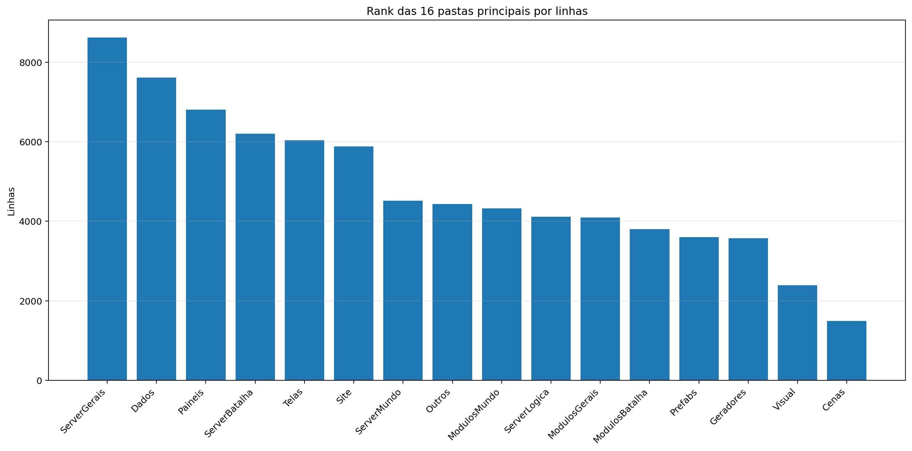

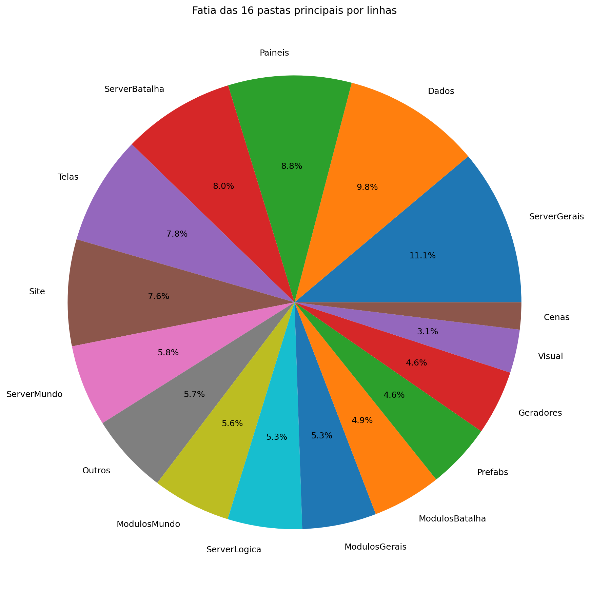

| Rank | Pasta | Subpastas | Arquivos | Linhas gerais | Tamanho (KB) |
|---:|---|---:|---:|---:|---:|
| 1 | `ServerGerais` | 4 | 51 | 8.622 | 477.34 |
| 2 | `Dados` | 6 | 58 | 7.612 | 339.71 |
| 3 | `Paineis` | 0 | 15 | 6.810 | 307.17 |
| 4 | `ServerBatalha` | 1 | 24 | 6.202 | 278.83 |
| 5 | `Telas` | 2 | 19 | 6.039 | 239.74 |
| 6 | `Site` | 6 | 24 | 5.882 | 154.47 |
| 7 | `ServerMundo` | 1 | 17 | 4.520 | 236.33 |
| 8 | `Outros` | 0 | 9 | 4.432 | 158.85 |
| 9 | `ModulosMundo` | 0 | 14 | 4.328 | 199.27 |
| 10 | `ServerLogica` | 4 | 41 | 4.110 | 126.69 |
| 11 | `ModulosGerais` | 1 | 22 | 4.099 | 156.25 |
| 12 | `ModulosBatalha` | 1 | 12 | 3.801 | 179.52 |
| 13 | `Prefabs` | 0 | 14 | 3.599 | 132.01 |
| 14 | `Geradores` | 1 | 16 | 3.570 | 157.25 |
| 15 | `Visual` | 0 | 7 | 2.396 | 99.88 |
| 16 | `Cenas` | 0 | 6 | 1.492 | 70.81 |

## 4. Arquitetura

### `Codigo/`

```text
Codigo/
├── Cenas/
│   ├── CenaCarregamento.py
│   ├── CenaCombate.py
│   ├── CenaLogin.py
│   ├── CenaMenu.py
│   ├── CenaMundo.py
│   └── ControladorCenas.py
├── Geradores/
│   ├── Player/
│   │   ├── Controle.py
│   │   ├── Inventario.py
│   │   ├── Perfil.py
│   │   └── Player.py
│   ├── Ator.py
│   ├── Baus.py
│   ├── Doce.py
│   ├── Dungeon.py
│   ├── Estadio.py
│   ├── EstruturaNaturais.py
│   ├── ItemInventario.py
│   ├── ItemMundo.py
│   ├── PokemonInventario.py
│   ├── PokemonMundo.py
│   ├── Projetil.py
│   └── XpMundo.py
├── ModulosBatalha/
│   ├── IA/
│   ├── Arena.py
│   ├── ClimaBatalha.py
│   ├── ControladorAnimacoes.py
│   ├── ControladorBatalha.py
│   ├── ElementosHudBatalha.py
│   ├── FinalizadorBatalha.py
│   ├── IndicadorAtaque.py
│   ├── InicializadorBatalha.py
│   ├── LeitorLogs.py
│   ├── MontadorJogadas.py
│   ├── PlayerBatalha.py
│   └── PokemonBatalha.py
├── ModulosGerais/
│   ├── Server/
│   │   ├── GerenciadorServerList.py
│   │   ├── Login.py
│   │   ├── ServerBatalha.py
│   │   ├── ServerLogin.py
│   │   ├── ServerMenu.py
│   │   ├── ServerMundo.py
│   │   └── ServerTerminal.py
│   ├── Auxiliares.py
│   ├── Camera.py
│   ├── Colisor.py
│   ├── CompositorModernGL.py
│   ├── DesenhaAtor.py
│   ├── DesenhoMapa.py
│   ├── Discord.py
│   ├── EfeitosTela.py
│   ├── FiltroCamera.py
│   ├── GerenciadorTiles.py
│   ├── ImagensMapa.py
│   ├── LoaderTabelas.py
│   ├── ModuladorRegras.py
│   ├── PipelineGrafica.py
│   └── Sonoridades.py
├── ModulosMundo/
│   ├── ControladorAtores.py
│   ├── ControladorCriaveis.py
│   ├── ControladorMundo.py
│   ├── ControladorObjetos.py
│   ├── ControladorPlayer.py
│   ├── ElementosHudMundo.py
│   ├── ExecutaveisPoção.py
│   ├── LeitorDialogo.py
│   ├── LeitorMundo.py
│   ├── Loja.py
│   ├── Minimapa.py
│   ├── ServicoCraft.py
│   ├── ServicoMapaMundo.py
│   └── SistemaPacotes.py
├── Outros/
│   ├── Shaders/
│   │   ├── mundo.frag
│   │   └── mundo.vert
│   └── TestesBatalha/
├── Paineis/
│   ├── Container.py
│   ├── FichaAtaque.py
│   ├── FichaItem.py
│   ├── FichaPokemon.py
│   ├── FichaPokemonBatalha.py
│   ├── PainelAcoes.py
│   ├── PainelArvoreHabilidades.py
│   ├── PainelAuxiliarPoke.py
│   ├── PainelConhecimento.py
│   ├── PainelCraft.py
│   ├── PainelEstatisticas.py
│   ├── PainelProgresso.py
│   ├── PainelReceitas.py
│   ├── PainelTimes.py
│   └── VisualizadorLog.py
├── Prefabs/
│   ├── Arrastavel.py
│   ├── Barra.py
│   ├── BarraPesquisa.py
│   ├── Botao.py
│   ├── CaixaTexto.py
│   ├── EfeitosVisuais.py
│   ├── Fluxos.py
│   ├── LogoMenuShader.py
│   ├── Mensagem.py
│   ├── Opcoes.py
│   ├── Painel.py
│   ├── Terminal.py
│   ├── Texto.py
│   └── Tooltip.py
├── Telas/
│   ├── Subtelas/
│   │   ├── Subtela.py
│   │   ├── SubtelaCriarPersonagem.py
│   │   ├── SubtelaDialogo.py
│   │   ├── SubtelaFinalizacao.py
│   │   ├── SubtelaInventario.py
│   │   ├── SubtelaInventarioEstatisticas.py
│   │   ├── SubtelaInventarioItens.py
│   │   ├── SubtelaInventarioPokemons.py
│   │   ├── SubtelaOpcoes.py
│   │   └── SubtelaPreBatalha.py
│   └── Telas/
│       ├── TelaConfig.py
│       ├── TelaConfigAvancada.py
│       ├── TelaConta.py
│       ├── TelaLogin.py
│       ├── TelaMapa.py
│       ├── TelaMenu.py
│       ├── TelaOperador.py
│       ├── TelaServers.py
│       └── TelasGenericas.py
└── Visual/
    ├── ArenaAnimator.py
    ├── AuxiliaresVisuais.py
    ├── ContatoIrregularAnimator.py
    ├── PokemonBatalhaAnimator.py
    ├── PokemonBatalhaEstado.py
    ├── PokemonMundoAnimator.py
    └── ProjetilBatalha.py
```

### `Server/`

```text
SimuladorServerJogo/
├── Batalha/
│   ├── BatalhaIA/
│   │   ├── AvaliadorIA.py
│   │   ├── ConfigIA.py
│   │   ├── ContextoIA.py
│   │   ├── ControladorIA.py
│   │   ├── FallbackIA.py
│   │   ├── GeradorAcoesIA.py
│   │   ├── HackerIA.py
│   │   ├── MacroSimulador.py
│   │   ├── MemoriaIA.py
│   │   ├── MetadadosAtaquesIA.json
│   │   ├── MetadadosIA.py
│   │   ├── MicroSimulador.py
│   │   └── PlanejadorIA.py
│   ├── ColetorAcoes.py
│   ├── Construto.py
│   ├── ConstrutorLog.py
│   ├── FraquezasResistencia.py
│   ├── GerenciadorPartidas.py
│   ├── IDsBatalha.py
│   ├── Partida.py
│   ├── PokemonBatalha.py
│   ├── PropriedadesAtaques.py
│   ├── ResolvedorFlags.py
│   └── RodadorTurno.py
├── Gerais/
│   ├── Geradores/
│   │   ├── Java/
│   │   │   ├── classes/
│   │   │   │   ├── Biome.class
│   │   │   │   ├── BiomeDefinition.class
│   │   │   │   ├── BiomeRules.class
│   │   │   │   ├── ClimateSource.class
│   │   │   │   ├── GeneratorContext$1.class
│   │   │   │   ├── GeneratorContext.class
│   │   │   │   ├── GeradorBiomas$1.class
│   │   │   │   ├── GeradorBiomas.class
│   │   │   │   ├── GeradorImagens$1.class
│   │   │   │   ├── GeradorImagens.class
│   │   │   │   ├── GeradorLocalidades.class
│   │   │   │   ├── GeradorObjetos.class
│   │   │   │   ├── GeradorRotas$RouteCandidate.class
│   │   │   │   ├── GeradorRotas$RouteNode.class
│   │   │   │   ├── GeradorRotas.class
│   │   │   │   ├── GeradorTerreno.class
│   │   │   │   ├── LocalityPoiConfig.class
│   │   │   │   ├── LocalityRules.class
│   │   │   │   ├── NaturalStructure.class
│   │   │   │   ├── NoiseLayerConfig.class
│   │   │   │   ├── Poi.class
│   │   │   │   ├── PoiConfig.class
│   │   │   │   ├── PoiType.class
│   │   │   │   ├── RegionData.class
│   │   │   │   ├── RouteData.class
│   │   │   │   ├── RouteRules.class
│   │   │   │   ├── SimpleToml.class
│   │   │   │   ├── TerrainRules.class
│   │   │   │   ├── Tile.class
│   │   │   │   ├── TomlTable.class
│   │   │   │   └── WorldGenerator.class
│   │   │   ├── GeradorBiomas.java
│   │   │   ├── GeradorImagens.java
│   │   │   ├── GeradorLocalidades.java
│   │   │   ├── GeradorObjetos.java
│   │   │   ├── GeradorRotas.java
│   │   │   ├── GeradorTerreno.java
│   │   │   └── WorldGenerator.java
│   │   ├── GeradorBaus.py
│   │   ├── GeradorMundo.py
│   │   └── GeradorPokemon.py
│   ├── Rotas/
│   │   ├── Ativador.py
│   │   ├── Atualizador.py
│   │   ├── Entrada.py
│   │   ├── RotasBatalha.py
│   │   ├── ServerOperar.py
│   │   └── Terminal.py
│   ├── ContextoServidor.py
│   ├── EstadoServidor.py
│   ├── LoaderRegras.py
│   └── LoaderTabelas.py
├── Logica/
│   ├── Comandos/
│   │   └── Comandos.py
│   ├── Executes/
│   │   ├── ExecutesAtaques/
│   │   │   ├── ControladorExecutes.py
│   │   │   ├── ExecutesAgua.py
│   │   │   ├── ExecutesCosmico.py
│   │   │   ├── ExecutesDragao.py
│   │   │   ├── ExecutesEletrico.py
│   │   │   ├── ExecutesFada.py
│   │   │   ├── ExecutesFantasma.py
│   │   │   ├── ExecutesFogo.py
│   │   │   ├── ExecutesGelo.py
│   │   │   ├── ExecutesInseto.py
│   │   │   ├── ExecutesLutador.py
│   │   │   ├── ExecutesMetal.py
│   │   │   ├── ExecutesNormal.py
│   │   │   ├── ExecutesPedra.py
│   │   │   ├── ExecutesPlanta.py
│   │   │   ├── ExecutesPsiquico.py
│   │   │   ├── ExecutesSombrio.py
│   │   │   ├── ExecutesSonoro.py
│   │   │   ├── ExecutesTerra.py
│   │   │   ├── ExecutesVeneno.py
│   │   │   ├── ExecutesVoador.py
│   │   │   └── UtilitariosExecutes.py
│   │   ├── ExecutesFrutas.py
│   │   ├── ExecutesPokebolas.py
│   │   └── PassivasEquipaveis.py
│   └── Regras/
│       ├── Batalha.toml
│       ├── Biomas.toml
│       ├── Ciclo.toml
│       ├── EstruturasNaturais.toml
│       ├── Geracao.json
│       ├── Gerais.toml
│       ├── Localidades.toml
│       ├── Mundo.toml
│       ├── NPCs.toml
│       ├── Player.toml
│       ├── Pokemons.toml
│       ├── Projeteis.toml
│       ├── Server.toml
│       ├── Spawn.toml
│       └── Terreno.toml
└── Mundo/
    ├── Cerebros/
    │   ├── CerebroBaus.py
    │   ├── CerebroCentral.py
    │   ├── CerebroEstadios.py
    │   ├── CerebroEstruturasNaturais.py
    │   ├── CerebroItensMundo.py
    │   ├── CerebroNPCs.py
    │   ├── CerebroPokemons.py
    │   ├── CerebroProjeteis.py
    │   ├── CerebroTempo.py
    │   └── CerebroXpMundo.py
    ├── AutoridadeCaptura.py
    ├── BancoDados.py
    ├── InicializadorNPC.py
    ├── ObjetosMundoServer.py
    ├── PacotesTick.py
    ├── ServicoInventario.py
    └── TiqueServidor.py
```

### `Dados/`

```text
Dados/
├── Catalogo/
│   ├── Musicas.json
│   ├── Pokemon Global Server - Baus.json
│   ├── Pokemon Global Server - Receitas.json
│   └── Sons.json
├── InteracoesNPC/
│   ├── Combatentes/
│   │   ├── Alleka.json
│   │   ├── Amable.json
│   │   ├── Caio.json
│   │   ├── Felipox.json
│   │   ├── Felps.json
│   │   ├── Ferraz.json
│   │   ├── Garcia.json
│   │   ├── Guedes.json
│   │   ├── Henrique.json
│   │   ├── João.json
│   │   ├── Lisciele.json
│   │   ├── Murilo.json
│   │   ├── Nathzinha.json
│   │   ├── Paulo.json
│   │   ├── Ph.json
│   │   ├── Ramos.json
│   │   ├── Sidney.json
│   │   ├── Suneiva.json
│   │   ├── Suriane.json
│   │   └── Vasques.json
│   ├── Vendedores/
│   │   └── Josefa.json
│   ├── ExemploCapitao_Laura.json
│   ├── ExemploDesafiante_Ravi.json
│   ├── ExemploDissociado_Nico.json
│   ├── ExemploLider_Alleka.json
│   └── ManualDialogos.json
├── PropriedadesAtaques/
│   ├── PropriedadesAgua.json
│   ├── PropriedadesCosmico.json
│   ├── PropriedadesDragao.json
│   ├── PropriedadesEletrico.json
│   ├── PropriedadesFada.json
│   ├── PropriedadesFantasma.json
│   ├── PropriedadesFogo.json
│   ├── PropriedadesGelo.json
│   ├── PropriedadesInseto.json
│   ├── PropriedadesLutador.json
│   ├── PropriedadesMetal.json
│   ├── PropriedadesNormal.json
│   ├── PropriedadesPedra.json
│   ├── PropriedadesPlanta.json
│   ├── PropriedadesPsiquico.json
│   ├── PropriedadesSombrio.json
│   ├── PropriedadesSonoro.json
│   ├── PropriedadesTerra.json
│   ├── PropriedadesVeneno.json
│   └── PropriedadesVoador.json
└── Tabelas/
    ├── Pokemon Global Server - Ataques.csv
    ├── Pokemon Global Server - Efeitos.csv
    ├── Pokemon Global Server - Equipaveis.csv
    ├── Pokemon Global Server - Itens.csv
    ├── Pokemon Global Server - NPC Combatente.csv
    ├── Pokemon Global Server - NPC Vendedor.csv
    ├── Pokemon Global Server - Pokemons.csv
    └── Pokemon Global Server - Sistema FR.csv
```

### `Site/`

```text
Site/
├── src/
│   ├── Codigo/
│   │   ├── PokedexRuntime.js
│   │   ├── PokemonWikiDados.js
│   │   └── site.js
│   ├── Componentes/
│   │   ├── Botao.astro
│   │   ├── CardWiki.astro
│   │   ├── Footer.astro
│   │   ├── Header.astro
│   │   └── Layout.astro
│   ├── Estilos/
│   │   ├── auth.css
│   │   ├── global.css
│   │   ├── home.css
│   │   └── wiki.css
│   └── pages/
│       ├── wiki/
│       │   ├── efeitos.astro
│       │   ├── estadios.astro
│       │   ├── index.astro
│       │   ├── itens.astro
│       │   ├── mundo.astro
│       │   └── pokemons.astro
│       ├── conta.astro
│       ├── contato.astro
│       ├── download.astro
│       └── index.astro
├── astro.config.mjs
└── package.json
```

### `Outros/`

```text
Outros/
├── AbridorSite.py
├── AtualizadorReadMe.py
├── AtualizadorRelatorios.py
├── ConfigFixa.py
├── EditorSkins.py
├── GeradorRelatorios.py
├── Mixer.py
├── SimuladorBatalha.py
└── Zipador.py
```

## 5. Ranks

### Top 50 maiores arquivos `.py` por linhas

| Arquivo | Linhas | Tamanho (KB) |
|---|---:|---:|
| `Outros/GeradorRelatorios.py` | 1.828 | 65.99 |
| `Codigo/Paineis/FichaPokemon.py` | 1.267 | 56.92 |
| `Codigo/Telas/Subtelas/SubtelaInventarioPokemons.py` | 1.089 | 49.98 |
| `Codigo/Paineis/VisualizadorLog.py` | 1.073 | 62.04 |
| `Codigo/ModulosMundo/ControladorObjetos.py` | 1.044 | 51.26 |
| `SimuladorServerJogo/Gerais/EstadoServidor.py` | 993 | 39.63 |
| `SimuladorServerJogo/Gerais/Geradores/GeradorPokemon.py` | 837 | 34.52 |
| `Codigo/Prefabs/Texto.py` | 819 | 31.39 |
| `SimuladorServerJogo/Batalha/PokemonBatalha.py` | 779 | 42.69 |
| `SimuladorServerJogo/Mundo/Cerebros/CerebroNPCs.py` | 724 | 38.47 |
| `Codigo/ModulosBatalha/MontadorJogadas.py` | 719 | 35.76 |
| `Codigo/ModulosMundo/ControladorPlayer.py` | 719 | 34.48 |
| `SimuladorServerJogo/Mundo/BancoDados.py` | 719 | 35.12 |
| `SimuladorServerJogo/Logica/Comandos/Comandos.py` | 686 | 28.72 |
| `SimuladorServerJogo/Gerais/Geradores/GeradorMundo.py` | 678 | 27.20 |
| `Codigo/Paineis/FichaPokemonBatalha.py` | 677 | 33.44 |
| `Codigo/Cenas/CenaMundo.py` | 654 | 36.34 |
| `Outros/AtualizadorRelatorios.py` | 651 | 23.61 |
| `Codigo/Paineis/Container.py` | 637 | 23.33 |
| `SimuladorServerJogo/Batalha/Partida.py` | 629 | 30.51 |
| `Codigo/ModulosGerais/ImagensMapa.py` | 610 | 27.21 |
| `Codigo/Visual/PokemonBatalhaEstado.py` | 596 | 26.86 |
| `Codigo/Visual/PokemonBatalhaAnimator.py` | 595 | 25.76 |
| `Codigo/Visual/ContatoIrregularAnimator.py` | 578 | 22.75 |
| `SimuladorServerJogo/Gerais/Rotas/Atualizador.py` | 574 | 28.54 |
| `Codigo/Telas/Telas/TelaServers.py` | 570 | 18.46 |
| `Codigo/Paineis/PainelArvoreHabilidades.py` | 547 | 26.81 |
| `Codigo/Telas/Telas/TelasGenericas.py` | 547 | 19.11 |
| `Codigo/Geradores/PokemonMundo.py` | 542 | 25.51 |
| `Outros/EditorSkins.py` | 514 | 19.97 |
| `Codigo/Telas/Subtelas/SubtelaInventarioItens.py` | 509 | 23.76 |
| `SimuladorServerJogo/Gerais/Rotas/Ativador.py` | 505 | 23.73 |
| `Codigo/ModulosMundo/LeitorDialogo.py` | 494 | 20.36 |
| `SimuladorServerJogo/Mundo/ObjetosMundoServer.py` | 494 | 32.06 |
| `Codigo/Prefabs/Botao.py` | 489 | 18.00 |
| `Codigo/ModulosBatalha/PokemonBatalha.py` | 485 | 22.98 |
| `Codigo/ModulosMundo/LeitorMundo.py` | 485 | 21.85 |
| `SimuladorServerJogo/Batalha/BatalhaIA/AvaliadorIA.py` | 480 | 25.54 |
| `Codigo/ModulosGerais/FiltroCamera.py` | 478 | 21.53 |
| `Codigo/ModulosBatalha/ControladorBatalha.py` | 471 | 22.38 |
| `Codigo/ModulosGerais/Sonoridades.py` | 465 | 12.98 |
| `Outros/AtualizadorReadMe.py` | 461 | 16.36 |
| `SimuladorServerJogo/Mundo/InicializadorNPC.py` | 461 | 23.85 |
| `Outros/Mixer.py` | 460 | 15.31 |
| `Codigo/Telas/Subtelas/SubtelaDialogo.py` | 439 | 19.47 |
| `Codigo/Paineis/PainelReceitas.py` | 438 | 14.70 |
| `SimuladorServerJogo/Mundo/Cerebros/CerebroCentral.py` | 431 | 22.04 |
| `Codigo/Geradores/Ator.py` | 429 | 19.11 |
| `Codigo/ModulosBatalha/Arena.py` | 429 | 20.15 |
| `Codigo/Telas/Subtelas/SubtelaCriarPersonagem.py` | 423 | 15.34 |

### Top 20 maiores classes

| Arquivo | Classe | Linhas |
|---|---|---:|
| `Codigo/Paineis/FichaPokemon.py` | `FichaPokemon` | 1.245 |
| `Codigo/Telas/Subtelas/SubtelaInventarioPokemons.py` | `InventarioPokemons` | 1.060 |
| `Codigo/ModulosMundo/ControladorObjetos.py` | `ControladorObjetos` | 1.018 |
| `Codigo/Paineis/VisualizadorLog.py` | `VisualizadorLog` | 883 |
| `SimuladorServerJogo/Batalha/PokemonBatalha.py` | `PokemonBatalha` | 733 |
| `SimuladorServerJogo/Mundo/Cerebros/CerebroNPCs.py` | `CerebroNPCs` | 704 |
| `Codigo/ModulosMundo/ControladorPlayer.py` | `ControladorPlayer` | 700 |
| `SimuladorServerJogo/Mundo/BancoDados.py` | `BancoDadosMundo` | 691 |
| `Codigo/ModulosBatalha/MontadorJogadas.py` | `MontadorJogadas` | 677 |
| `Codigo/Paineis/FichaPokemonBatalha.py` | `FichaPokemonBatalha` | 657 |
| `Codigo/Paineis/Container.py` | `Container` | 628 |
| `Codigo/Cenas/CenaMundo.py` | `CenaMundo` | 617 |
| `SimuladorServerJogo/Batalha/Partida.py` | `Partida` | 601 |
| `Codigo/Visual/PokemonBatalhaAnimator.py` | `PokemonAnimator` | 564 |
| `Codigo/ModulosGerais/ImagensMapa.py` | `GerenciadorImagensMapa` | 563 |
| `Codigo/Visual/PokemonBatalhaEstado.py` | `PokemonBatalhaEstado` | 543 |
| `Codigo/Geradores/PokemonMundo.py` | `Pokemon` | 518 |
| `Codigo/Paineis/PainelArvoreHabilidades.py` | `PainelArvoreHabilidades` | 517 |
| `Codigo/Visual/ContatoIrregularAnimator.py` | `ContatoIrregularAnimator` | 501 |
| `Codigo/Telas/Subtelas/SubtelaInventarioItens.py` | `InventarioItens` | 492 |

### Top 20 maiores funções e métodos

| Arquivo | Nome | Tipo | Linhas |
|---|---|---:|---:|
| `Codigo/Paineis/VisualizadorLog.py` | `VisualizadorLog._registro_evento` | metodo | 330 |
| `Codigo/Geradores/Estadio.py` | `EstadioInterno.renderizar` | metodo | 254 |
| `SimuladorServerJogo/Gerais/Rotas/Atualizador.py` | `processar_atualizador_json` | funcao | 252 |
| `Codigo/Prefabs/Fluxos.py` | `Fluxo.desenhar` | metodo | 249 |
| `Outros/GeradorRelatorios.py` | `coletar_metricas` | funcao | 247 |
| `Codigo/Telas/Subtelas/SubtelaInventarioPokemons.py` | `InventarioPokemons.atualizar` | metodo | 148 |
| `Codigo/ModulosGerais/Colisor.py` | `Colisor.resolver_movimento_com_colisores` | metodo | 146 |
| `SimuladorServerJogo/Gerais/Geradores/GeradorMundo.py` | `_executar_world_generator` | funcao | 144 |
| `Outros/AtualizadorRelatorios.py` | `main` | funcao | 140 |
| `Outros/GeradorRelatorios.py` | `gerar_markdown` | funcao | 139 |
| `Codigo/Telas/Telas/TelaMapa.py` | `TelaMapa.desenhar` | metodo | 136 |
| `Outros/GeradorRelatorios.py` | `analisar_python_ast` | funcao | 132 |
| `Codigo/ModulosBatalha/ControladorAnimacoes.py` | `ControladorAnimacoes.criar_animacao_de_evento` | metodo | 128 |
| `SimuladorServerJogo/Mundo/Cerebros/CerebroNPCs.py` | `CerebroNPCs.executar_tick` | metodo | 124 |
| `Codigo/Prefabs/Botao.py` | `Botao.render` | metodo | 119 |
| `Codigo/Telas/Subtelas/SubtelaInventarioPokemons.py` | `InventarioPokemons._reconstruir` | metodo | 119 |
| `Codigo/Cenas/CenaMundo.py` | `CenaMundo.atualizar_cena` | metodo | 118 |
| `Codigo/Telas/Subtelas/SubtelaCriarPersonagem.py` | `SubtelaCriarPersonagem._rebuild_layout` | metodo | 112 |
| `Outros/Mixer.py` | `main` | funcao | 109 |
| `SimuladorServerJogo/Gerais/Rotas/Entrada.py` | `processar_entrada_json` | funcao | 109 |

### Top 10 arquivos mais importados

| Arquivo | Vezes importado |
|---|---:|
| `Codigo/Prefabs/Texto.py` | 42 |
| `Codigo/Prefabs/Botao.py` | 32 |
| `SimuladorServerJogo/Logica/Executes/ExecutesAtaques/UtilitariosExecutes.py` | 21 |
| `SimuladorServerJogo/Gerais/EstadoServidor.py` | 16 |
| `Codigo/Geradores/ItemInventario.py` | 15 |
| `Codigo/ModulosGerais/Sonoridades.py` | 14 |
| `SimuladorServerJogo/Mundo/BancoDados.py` | 14 |
| `Codigo/ModulosGerais/Auxiliares.py` | 13 |
| `SimuladorServerJogo/Gerais/Rotas/Ativador.py` | 12 |
| `SimuladorServerJogo/Gerais/Geradores/GeradorPokemon.py` | 11 |

### Top 10 arquivos que mais importam

| Arquivo | Arquivos internos importados | Imports totais | Linhas |
|---|---:|---:|---:|
| `Codigo/Cenas/CenaMundo.py` | 22 | 25 | 654 |
| `SimuladorServerJogo/Logica/Executes/ExecutesAtaques/ControladorExecutes.py` | 22 | 23 | 264 |
| `SimuladorServerJogo/Mundo/Cerebros/CerebroCentral.py` | 16 | 25 | 431 |
| `Codigo/Telas/Subtelas/SubtelaInventarioPokemons.py` | 16 | 21 | 1.089 |
| `SimuladorServerJogo/Batalha/BatalhaIA/ControladorIA.py` | 12 | 16 | 166 |
| `SimuladorServerJogo/Gerais/Rotas/Atualizador.py` | 11 | 16 | 574 |
| `Codigo/Cenas/ControladorCenas.py` | 11 | 16 | 301 |
| `Codigo/Paineis/FichaPokemonBatalha.py` | 10 | 15 | 677 |
| `Codigo/Telas/Subtelas/SubtelaInventarioItens.py` | 10 | 13 | 509 |
| `Codigo/ModulosBatalha/ControladorBatalha.py` | 10 | 13 | 471 |

### Top 10 maiores arquivos por linhas

| Arquivo | Ext | Linhas |
|---|---:|---:|
| `Legado/DiretrizesBatalha_v7_ajustada.md` | `.md` | 4.860 |
| `Legado/PlanoImplementacaoBatalha_5Fases_ajustado.md` | `.md` | 1.872 |
| `Outros/GeradorRelatorios.py` | `.py` | 1.828 |
| `Dados/Tabelas/Pokemon Global Server - Pokemons.csv` | `.csv` | 1.309 |
| `Codigo/Paineis/FichaPokemon.py` | `.py` | 1.267 |
| `Site/src/Estilos/wiki.css` | `.css` | 1.230 |
| `Site/src/Estilos/home.css` | `.css` | 1.097 |
| `Codigo/Telas/Subtelas/SubtelaInventarioPokemons.py` | `.py` | 1.089 |
| `Codigo/Paineis/VisualizadorLog.py` | `.py` | 1.073 |
| `Codigo/ModulosMundo/ControladorObjetos.py` | `.py` | 1.044 |

## 6. Linhas por extensão

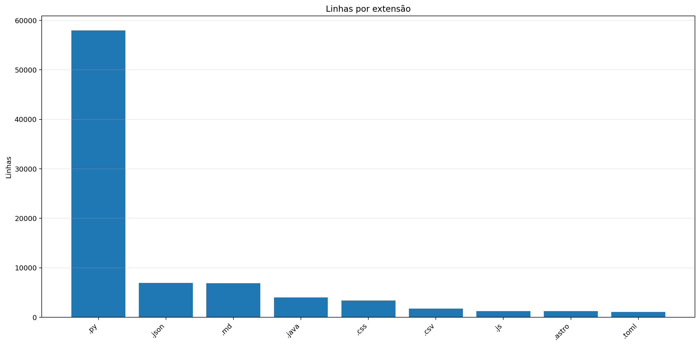

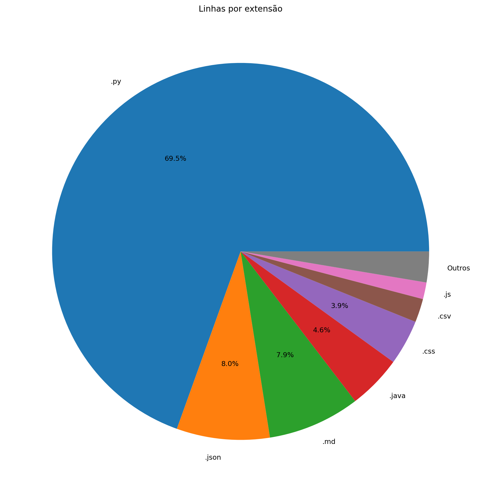

| Ext | Linhas | % das linhas | Arquivos | Peso |
|---:|---:|---:|---:|---:|
| `.py` | 57.993 | 68.58% | 215 | 2.44 MB |
| `.json` | 6.957 | 8.23% | 53 | 175.57 KB |
| `.md` | 6.889 | 8.15% | 3 | 209.39 KB |
| `.java` | 4.033 | 4.77% | 7 | 152.13 KB |
| `.css` | 3.381 | 4.00% | 4 | 65.04 KB |
| `.csv` | 1.765 | 2.09% | 8 | 187.28 KB |
| `.js` | 1.245 | 1.47% | 3 | 42.18 KB |
| `.astro` | 1.241 | 1.47% | 15 | 46.48 KB |
| `.toml` | 1.060 | 1.25% | 14 | 22.04 KB |

## 7. Peso por extensão

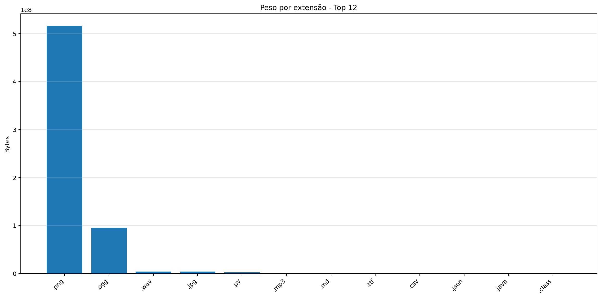

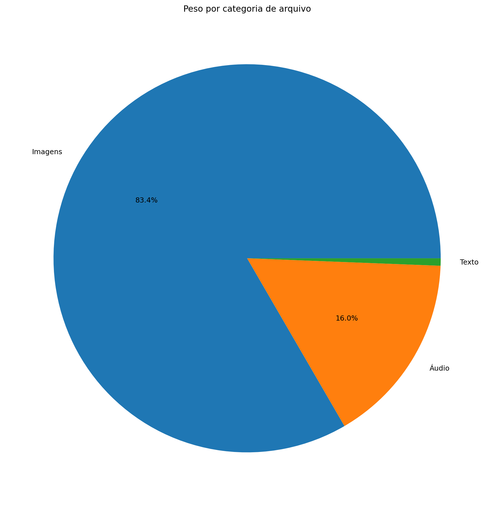

| Ext | Arquivos | Peso | % do jogo |
|---:|---:|---:|---:|
| `.png` | 71.858 | 491.84 MB | 82.78% |
| `.ogg` | 35 | 90.64 MB | 15.25% |
| `.wav` | 9 | 3.81 MB | 0.64% |
| `.jpg` | 23 | 3.61 MB | 0.61% |
| `.py` | 215 | 2.44 MB | 0.41% |
| `.mp3` | 5 | 636.73 KB | 0.10% |
| `.md` | 3 | 209.39 KB | 0.03% |
| `.ttf` | 2 | 196.64 KB | 0.03% |
| `.csv` | 8 | 187.28 KB | 0.03% |
| `.json` | 53 | 175.57 KB | 0.03% |
| `.java` | 7 | 152.13 KB | 0.03% |
| `.class` | 31 | 124.48 KB | 0.02% |
| `.css` | 4 | 65.04 KB | 0.01% |
| `.astro` | 15 | 46.48 KB | 0.01% |
| `.js` | 3 | 42.18 KB | 0.01% |
| `.toml` | 14 | 22.04 KB | 0.00% |
| `.frag` | 1 | 15.48 KB | 0.00% |
| `.mjs` | 1 | 500 bytes | 0.00% |
| `.vert` | 1 | 170 bytes | 0.00% |

## 8. Comparativo com o último relatório

| Métrica | Relatório anterior | Relatório atual | Diferença |
|---|---:|---:|---:|
| Arquivos | 72.240 | 72.289 | +49 |
| Linhas | 79.582 | 84.636 | +5.054 |
| Linhas .py | 56.895 | 57.993 | +1.098 |
| Métodos/funções | 3.343 | 3.433 | +90 |
| Classes | 187 | 190 | +3 |
| Commits | 486 | 505 | +19 |
| Tamanho | 589.69 MB | 594.17 MB | +4.49 MB |

### Top 3 commits por tamanho de diff

| Rank | Commit | Mensagem | Arquivos | Adições | Reduções | Diff total |
|---:|---|---|---:|---:|---:|---:|
| 1 | `c354d15bd72d` | relatorio | 17 | 3.267 | 1.050 | 4.317 |
| 2 | `20b6b185c747` | prototipo inicial da wiki de pokemons | 6 | 1.830 | 27 | 1.857 |
| 3 | `f2f3a7ca740a` | wiki de pokemons melhorada | 8 | 1.026 | 422 | 1.448 |

## 9. Gráficos de crescimento

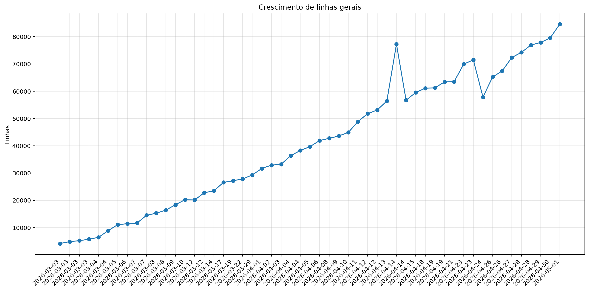

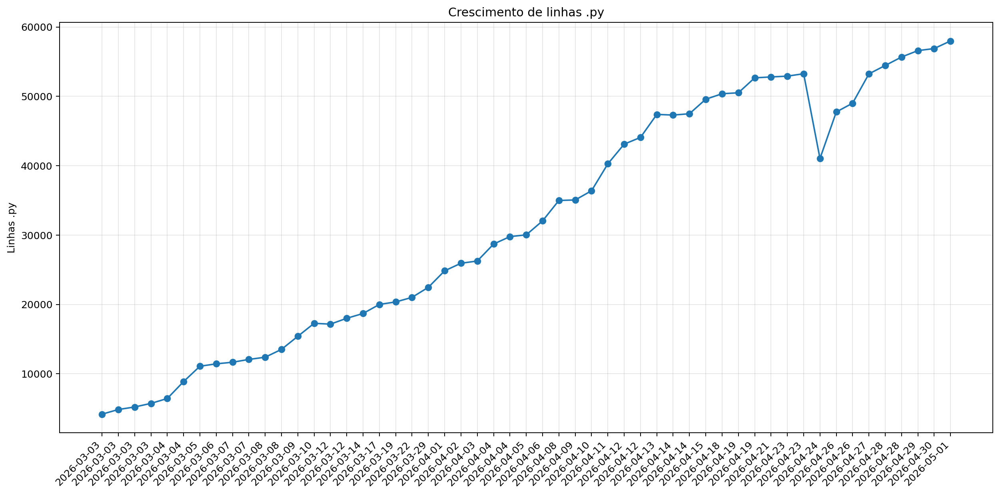

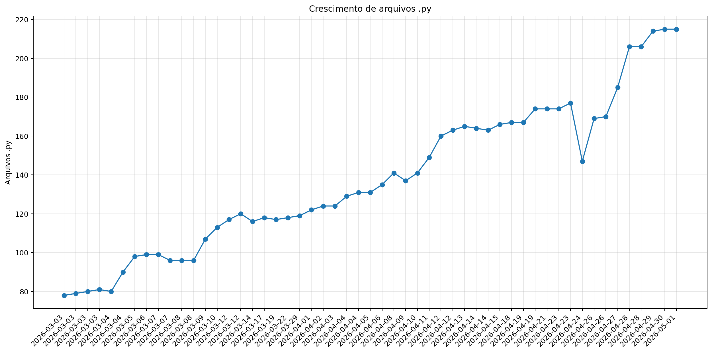

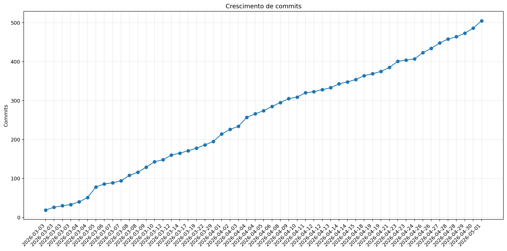

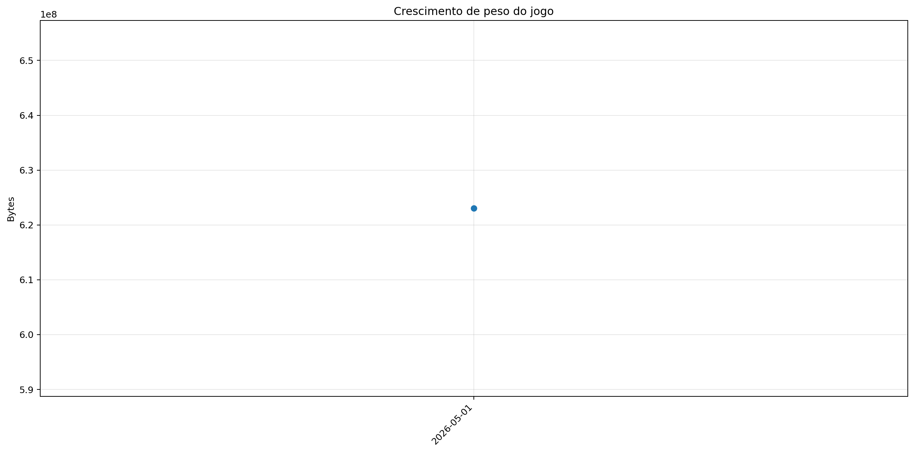
