# Registro

**Relatório:** #1  
**Projeto:** `relatorio_rebuild_3i51p87o`  
**Gerado em:** 2026-05-15T11:16:47  
**Modelo de relatório:** 11  
**Autor:** Leon Cunha Alvaro Lopez Soto

## 1. Visão geral

- **Pastas:** 1.271
- **Arquivos:** 72.329
- **Arquivos de texto:** 351
- **Peso dos arquivos de texto:** 3704.07 KB
- **Tamanho total:** 0.591 GB (634.809.200 bytes)
- **Dias desde a criação do projeto:** 61
- **Dias desde a criação oficial:** 335
- **Horas estimadas:** 499.50
- **Linhas totais gerais:** 89.774
- **Commits (projeto):** 529

## 2. Python

- **Arquivos `.py`:** 225
- **Linhas totais:** 65.177
- **Tamanho total `.py`:** 2820.99 KB
- **Classes encontradas:** 204
- **Funções encontradas:** 1.042
- **Métodos encontrados:** 2.763
- **Total funções + métodos:** 3.805
- **Bibliotecas diferentes usadas:** 47

## 3. Macro áreas

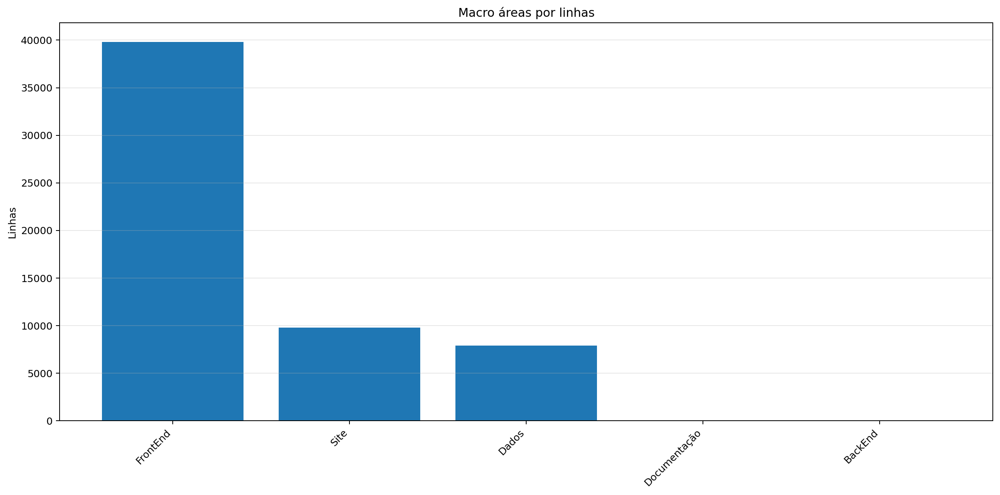

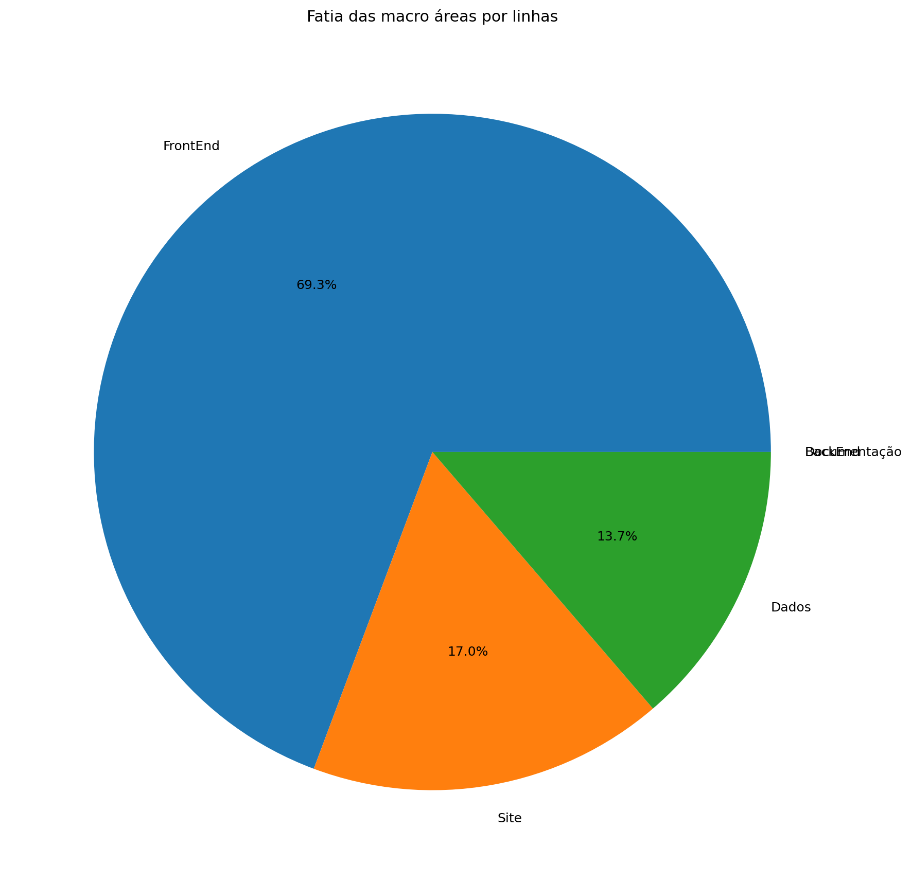

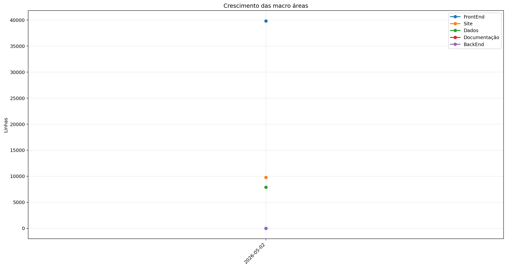

| Rank | Área | Caminho | Subpastas | Arquivos | Linhas gerais | Tamanho (KB) |
|---:|---|---|---:|---:|---:|---:|
| 1 | `FrontEnd` | `Codigo + Game.py` | 17 | 142 | 39.828 | 1730.73 |
| 2 | `Site` | `Site/src` | 5 | 34 | 9.765 | 285.52 |
| 3 | `Dados` | `Dados` | 6 | 59 | 7.877 | 370.14 |
| 4 | `Documentação` | `Documentação` | 0 | 0 | 0 | 0.00 |
| 5 | `BackEnd` | `Servidor + ServidorGeral` | 0 | 0 | 0 | 0.00 |

## 4. Principais pastas

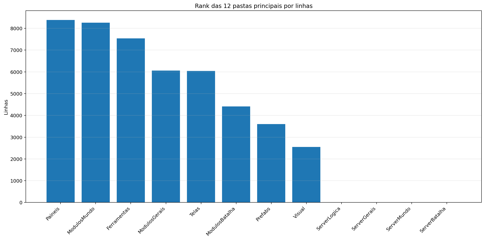

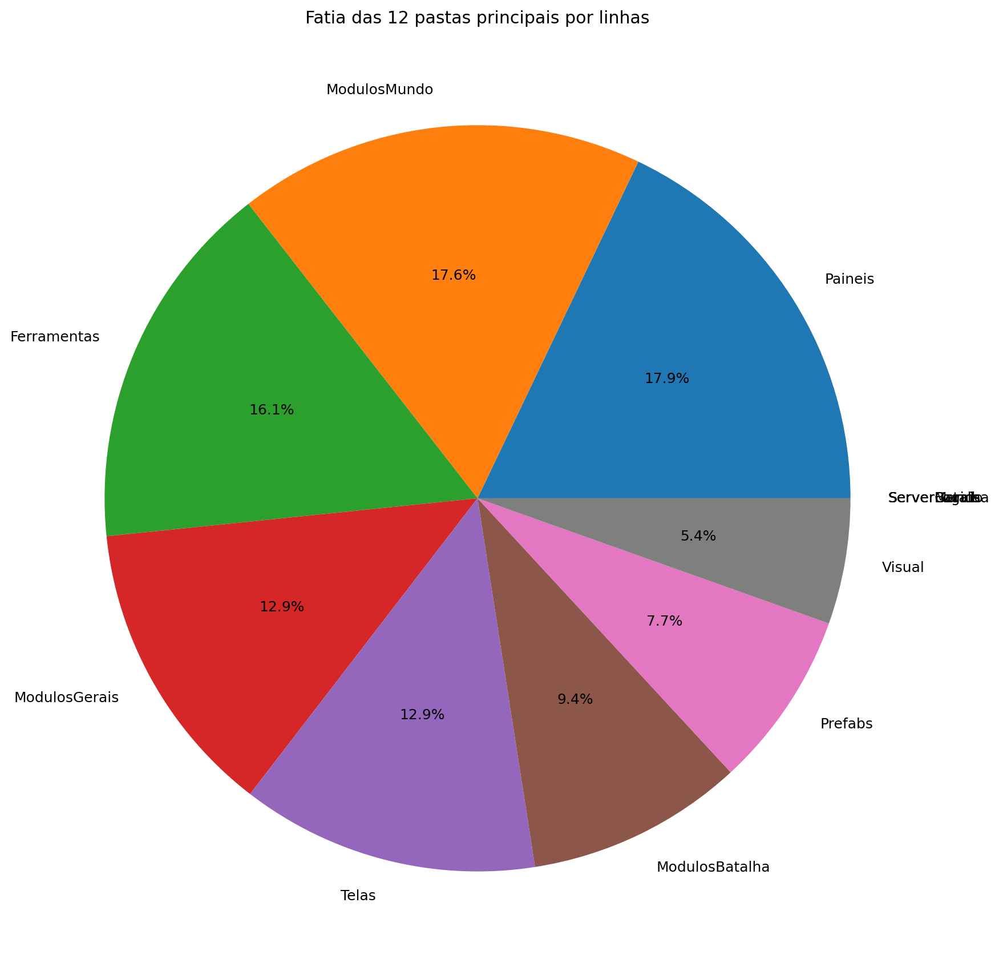

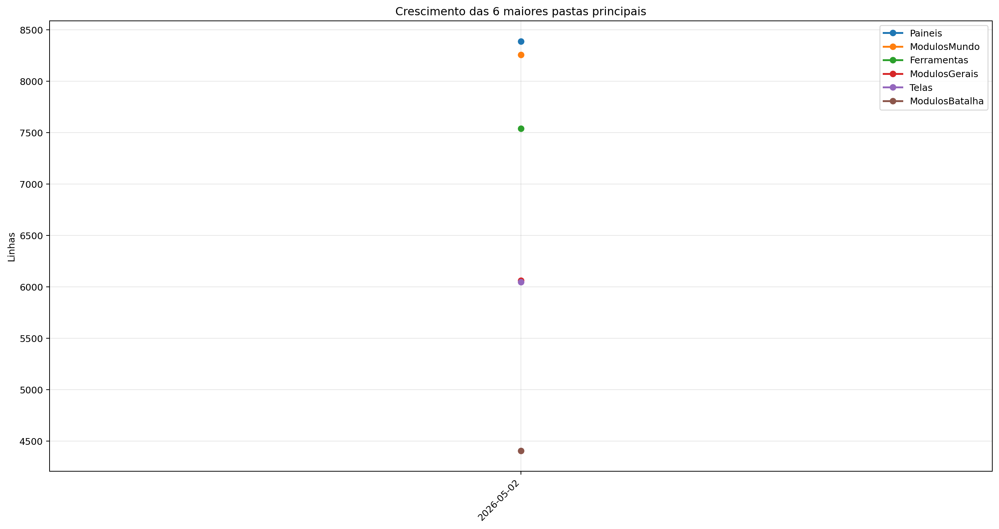

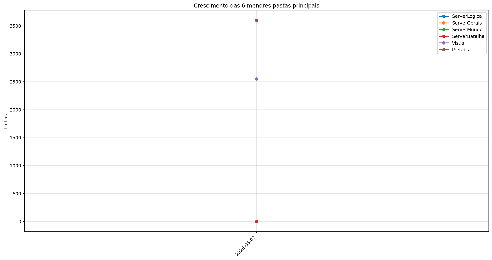

| Rank | Pasta | Subpastas | Arquivos | Linhas gerais | Tamanho (KB) |
|---:|---|---:|---:|---:|---:|
| 1 | `Paineis` | 0 | 16 | 8.388 | 377.83 |
| 2 | `ModulosMundo` | 1 | 30 | 8.258 | 374.88 |
| 3 | `Ferramentas` | 0 | 12 | 7.538 | 275.59 |
| 4 | `ModulosGerais` | 1 | 30 | 6.061 | 245.09 |
| 5 | `Telas` | 2 | 19 | 6.046 | 240.18 |
| 6 | `ModulosBatalha` | 0 | 13 | 4.408 | 211.30 |
| 7 | `Prefabs` | 0 | 14 | 3.599 | 132.12 |
| 8 | `Visual` | 0 | 8 | 2.550 | 109.06 |
| 9 | `ServerLogica` | 0 | 0 | 0 | 0.00 |
| 10 | `ServerGerais` | 0 | 0 | 0 | 0.00 |
| 11 | `ServerMundo` | 0 | 0 | 0 | 0.00 |
| 12 | `ServerBatalha` | 0 | 0 | 0 | 0.00 |

## 5. Arquitetura

### `Codigo/`

```text
Codigo/
├── Cenas/
│   ├── CenaCarregamento.py
│   ├── CenaCombate.py
│   ├── CenaLogin.py
│   ├── CenaMenu.py
│   ├── CenaMundo.py
│   └── ControladorCenas.py
├── Geradores/
│   ├── Player/
│   │   ├── Controle.py
│   │   ├── Inventario.py
│   │   ├── Perfil.py
│   │   └── Player.py
│   ├── Ator.py
│   ├── Baus.py
│   ├── Doce.py
│   ├── Dungeon.py
│   ├── Estadio.py
│   ├── EstruturaNaturais.py
│   ├── ItemInventario.py
│   ├── ItemMundo.py
│   ├── PokemonInventario.py
│   ├── PokemonMundo.py
│   ├── Projetil.py
│   └── XpMundo.py
├── ModulosBatalha/
│   ├── Arena.py
│   ├── ClimaBatalha.py
│   ├── ControladorAnimacoes.py
│   ├── ControladorBatalha.py
│   ├── ElementosHudBatalha.py
│   ├── FinalizadorBatalha.py
│   ├── IndicadorAtaque.py
│   ├── InicializadorBatalha.py
│   ├── LeitorLogs.py
│   ├── MontadorJogadas.py
│   ├── PlayerBatalha.py
│   ├── PokemonBatalha.py
│   └── SeletorCapturaBatalha.py
├── ModulosGerais/
│   ├── Server/
│   │   ├── GerenciadorServerList.py
│   │   ├── Login.py
│   │   ├── ServerBatalha.py
│   │   ├── ServerLogin.py
│   │   ├── ServerMenu.py
│   │   ├── ServerMundo.py
│   │   └── ServerTerminal.py
│   ├── Auxiliares.py
│   ├── Camera.py
│   ├── Colisor.py
│   ├── CompositorModernGL.py
│   ├── DesenhaAtor.py
│   ├── DesenhoMapa.py
│   ├── Discord.py
│   ├── EfeitosTela.py
│   ├── FiltroCamera.py
│   ├── GerenciadorPokemons.py
│   ├── GerenciadorTiles.py
│   ├── ImagensMapa.py
│   ├── LoaderTabelas.py
│   ├── ModuladorRegras.py
│   ├── PipelineGrafica.py
│   ├── PropriedadesAtaques.py
│   └── Sonoridades.py
├── ModulosMundo/
│   ├── ControladorAtores.py
│   ├── ControladorCriaveis.py
│   ├── ControladorMundo.py
│   ├── ControladorObjetos.py
│   ├── ControladorPlayer.py
│   ├── ElementosHudMundo.py
│   ├── ExecutaveisPoção.py
│   ├── LeitorDialogo.py
│   ├── LeitorMundo.py
│   ├── Loja.py
│   ├── Minimapa.py
│   ├── ServicoCraft.py
│   ├── ServicoMapaMundo.py
│   └── SistemaPacotes.py
├── Outros/
│   └── Shaders/
│       ├── mundo.frag
│       └── mundo.vert
├── Paineis/
│   ├── Container.py
│   ├── FichaAtaque.py
│   ├── FichaItem.py
│   ├── FichaPokemon.py
│   ├── FichaPokemonBatalha.py
│   ├── MiniPaineisConhecimentos.py
│   ├── PainelAcoes.py
│   ├── PainelArvoreHabilidades.py
│   ├── PainelAuxiliarPoke.py
│   ├── PainelConhecimento.py
│   ├── PainelCraft.py
│   ├── PainelEstatisticas.py
│   ├── PainelProgresso.py
│   ├── PainelReceitas.py
│   ├── PainelTimes.py
│   └── VisualizadorLog.py
├── Prefabs/
│   ├── Arrastavel.py
│   ├── Barra.py
│   ├── BarraPesquisa.py
│   ├── Botao.py
│   ├── CaixaTexto.py
│   ├── EfeitosVisuais.py
│   ├── Fluxos.py
│   ├── LogoMenuShader.py
│   ├── Mensagem.py
│   ├── Opcoes.py
│   ├── Painel.py
│   ├── Terminal.py
│   ├── Texto.py
│   └── Tooltip.py
├── Shaders/
│   ├── efeitos/
│   │   ├── biomas_mundo.glsl
│   │   ├── captura.glsl
│   │   ├── clima_batalha.glsl
│   │   ├── clima_mundo.glsl
│   │   ├── grade_global.glsl
│   │   └── menu_logo.glsl
│   ├── compositor.frag
│   ├── compositor.vert
│   └── comum.glsl
├── Telas/
│   ├── Subtelas/
│   │   ├── Subtela.py
│   │   ├── SubtelaCriarPersonagem.py
│   │   ├── SubtelaDialogo.py
│   │   ├── SubtelaFinalizacao.py
│   │   ├── SubtelaInventario.py
│   │   ├── SubtelaInventarioEstatisticas.py
│   │   ├── SubtelaInventarioItens.py
│   │   ├── SubtelaInventarioPokemons.py
│   │   ├── SubtelaOpcoes.py
│   │   └── SubtelaPreBatalha.py
│   └── Telas/
│       ├── TelaConfig.py
│       ├── TelaConfigAvancada.py
│       ├── TelaConta.py
│       ├── TelaLogin.py
│       ├── TelaMapa.py
│       ├── TelaMenu.py
│       ├── TelaOperador.py
│       ├── TelaServers.py
│       └── TelasGenericas.py
└── Visual/
    ├── ArenaAnimator.py
    ├── AuxiliaresVisuais.py
    ├── ContatoIrregularAnimator.py
    ├── PokemonBatalhaAnimator.py
    ├── PokemonBatalhaEstado.py
    ├── PokemonMundoAnimator.py
    ├── PokemonMundoEstado.py
    └── ProjetilBatalha.py
```

### `Server/`

```text
Servidor/
└── (pasta não encontrada)
```

### `Dados/`

```text
Dados/
├── Catalogo/
│   ├── Musicas.json
│   ├── Pokemon Global Server - Baus.json
│   ├── Pokemon Global Server - Receitas.json
│   └── Sons.json
├── InteracoesNPC/
│   ├── Combatentes/
│   │   ├── Alleka.json
│   │   ├── Amable.json
│   │   ├── Caio.json
│   │   ├── Felipox.json
│   │   ├── Felps.json
│   │   ├── Ferraz.json
│   │   ├── Garcia.json
│   │   ├── Guedes.json
│   │   ├── Henrique.json
│   │   ├── João.json
│   │   ├── Lisciele.json
│   │   ├── Murilo.json
│   │   ├── Nathzinha.json
│   │   ├── Paulo.json
│   │   ├── Ph.json
│   │   ├── Ramos.json
│   │   ├── Sidney.json
│   │   ├── Suneiva.json
│   │   ├── Suriane.json
│   │   └── Vasques.json
│   ├── Vendedores/
│   │   └── Josefa.json
│   ├── ExemploCapitao_Laura.json
│   ├── ExemploDesafiante_Ravi.json
│   ├── ExemploDissociado_Nico.json
│   ├── ExemploLider_Alleka.json
│   └── ManualDialogos.json
├── PropriedadesAtaques/
│   ├── PropriedadesAgua.json
│   ├── PropriedadesCosmico.json
│   ├── PropriedadesDragao.json
│   ├── PropriedadesEletrico.json
│   ├── PropriedadesFada.json
│   ├── PropriedadesFantasma.json
│   ├── PropriedadesFogo.json
│   ├── PropriedadesGelo.json
│   ├── PropriedadesInseto.json
│   ├── PropriedadesLutador.json
│   ├── PropriedadesMetal.json
│   ├── PropriedadesNormal.json
│   ├── PropriedadesPedra.json
│   ├── PropriedadesPlanta.json
│   ├── PropriedadesPsiquico.json
│   ├── PropriedadesSombrio.json
│   ├── PropriedadesSonoro.json
│   ├── PropriedadesTerra.json
│   ├── PropriedadesVeneno.json
│   └── PropriedadesVoador.json
└── Tabelas/
    ├── Pokemon Global Server - Ataques.csv
    ├── Pokemon Global Server - Dungeons.csv
    ├── Pokemon Global Server - Efeitos.csv
    ├── Pokemon Global Server - Equipaveis.csv
    ├── Pokemon Global Server - Itens.csv
    ├── Pokemon Global Server - NPC Combatente.csv
    ├── Pokemon Global Server - NPC Vendedor.csv
    ├── Pokemon Global Server - Pokemons.csv
    └── Pokemon Global Server - Sistema FR.csv
```

### `Site/`

```text
Site/
├── public/
├── src/
│   ├── Codigo/
│   │   ├── AtaquesRuntime.js
│   │   ├── AtaquesWikiDados.js
│   │   ├── EfeitosRuntime.js
│   │   ├── EfeitosWikiDados.js
│   │   ├── ItemWikiDados.js
│   │   ├── ItensRuntime.js
│   │   ├── MundoWikiDados.js
│   │   ├── PokedexRuntime.js
│   │   ├── PokemonWikiDados.js
│   │   └── site.js
│   ├── Componentes/
│   │   ├── Botao.astro
│   │   ├── CardWiki.astro
│   │   ├── Footer.astro
│   │   ├── Header.astro
│   │   ├── Layout.astro
│   │   └── WikiMenu.astro
│   ├── Estilos/
│   │   ├── auth.css
│   │   ├── global.css
│   │   ├── home.css
│   │   └── wiki.css
│   └── pages/
│       ├── wiki/
│       │   ├── ataques.astro
│       │   ├── combate.astro
│       │   ├── dungeons.astro
│       │   ├── efeitos.astro
│       │   ├── equipaveis.astro
│       │   ├── estadios.astro
│       │   ├── index.astro
│       │   ├── itens.astro
│       │   ├── mundo.astro
│       │   └── pokemons.astro
│       ├── conta.astro
│       ├── contato.astro
│       ├── download.astro
│       └── index.astro
├── astro.config.mjs
└── package.json
```

### `Ferramentas/`

```text
Ferramentas/
├── AtualizadorReadMe.py
└── GeradorRelatorios.py
```

## 6. Ranks

### Top 50 maiores arquivos `.py` por linhas

| Arquivo | Linhas | Tamanho (KB) |
|---|---:|---:|
| `Ferramentas/GeradorRelatorios.py` | 2.117 | 80.24 |
| `Outros/GeradorRelatorios.py` | 1.828 | 67.77 |
| `Codigo/Paineis/FichaPokemon.py` | 1.265 | 56.96 |
| `Codigo/ModulosMundo/ControladorObjetos.py` | 1.107 | 55.03 |
| `Codigo/Paineis/VisualizadorLog.py` | 1.101 | 64.15 |
| `Codigo/Telas/Subtelas/SubtelaInventarioPokemons.py` | 1.096 | 50.19 |
| `SimuladorServerJogo/Gerais/EstadoServidor.py` | 1.062 | 43.79 |
| `SimuladorServerJogo/Gerais/Geradores/GeradorPokemon.py` | 922 | 38.32 |
| `Codigo/Prefabs/Texto.py` | 819 | 31.41 |
| `Codigo/ModulosBatalha/MontadorJogadas.py` | 796 | 40.29 |
| `SimuladorServerJogo/Batalha/PokemonBatalha.py` | 794 | 43.29 |
| `SimuladorServerJogo/Batalha/Partida.py` | 763 | 37.23 |
| `Codigo/ModulosMundo/ControladorPlayer.py` | 733 | 35.17 |
| `SimuladorServerJogo/Mundo/Cerebros/CerebroNPCs.py` | 724 | 38.49 |
| `SimuladorServerJogo/Mundo/BancoDados.py` | 719 | 35.17 |
| `Codigo/Visual/PokemonBatalhaAnimator.py` | 688 | 30.81 |
| `SimuladorServerJogo/Logica/Comandos/Comandos.py` | 686 | 28.74 |
| `Codigo/Cenas/CenaMundo.py` | 685 | 38.46 |
| `Codigo/Geradores/PokemonMundo.py` | 679 | 32.53 |
| `SimuladorServerJogo/Gerais/Geradores/GeradorMundo.py` | 678 | 27.20 |
| `Codigo/Paineis/FichaPokemonBatalha.py` | 677 | 33.43 |
| `Codigo/ModulosBatalha/ControladorBatalha.py` | 652 | 31.52 |
| `Outros/AtualizadorRelatorios.py` | 651 | 23.61 |
| `Codigo/Paineis/Container.py` | 637 | 23.33 |
| `Codigo/ModulosGerais/Sonoridades.py` | 623 | 18.28 |
| `Codigo/Paineis/PainelConhecimento.py` | 617 | 25.33 |
| `Codigo/ModulosGerais/ImagensMapa.py` | 610 | 27.30 |
| `Codigo/Visual/PokemonBatalhaEstado.py` | 596 | 27.44 |
| `SimuladorServerJogo/Gerais/Rotas/Atualizador.py` | 593 | 28.99 |
| `Codigo/Visual/ContatoIrregularAnimator.py` | 578 | 23.32 |
| `Codigo/Telas/Telas/TelaServers.py` | 570 | 18.46 |
| `Codigo/Paineis/PainelArvoreHabilidades.py` | 547 | 26.81 |
| `Codigo/Telas/Telas/TelasGenericas.py` | 547 | 19.11 |
| `Outros/GameTestFPS.py` | 528 | 18.13 |
| `Outros/EditorSkins.py` | 514 | 19.97 |
| `Codigo/Telas/Subtelas/SubtelaInventarioItens.py` | 509 | 23.76 |
| `SimuladorServerJogo/Gerais/Rotas/Ativador.py` | 505 | 23.73 |
| `Codigo/Paineis/PainelProgresso.py` | 497 | 23.02 |
| `Codigo/ModulosMundo/LeitorDialogo.py` | 494 | 20.36 |
| `SimuladorServerJogo/Mundo/ObjetosMundoServer.py` | 494 | 32.08 |
| `Codigo/Prefabs/Botao.py` | 489 | 18.00 |
| `Codigo/ModulosBatalha/PokemonBatalha.py` | 488 | 23.09 |
| `Codigo/ModulosMundo/LeitorMundo.py` | 485 | 22.05 |
| `SimuladorServerJogo/Batalha/BatalhaIA/AvaliadorIA.py` | 480 | 25.54 |
| `Codigo/ModulosGerais/FiltroCamera.py` | 478 | 21.53 |
| `Ferramentas/AtualizadorReadMe.py` | 461 | 16.37 |
| `Outros/AtualizadorReadMe.py` | 461 | 16.36 |
| `Outros/Mixer.py` | 460 | 15.31 |
| `SimuladorServerJogo/Gerais/LoaderRegras.py` | 459 | 28.49 |
| `SimuladorServerJogo/Mundo/InicializadorNPC.py` | 459 | 23.71 |

### Top 20 maiores classes

| Arquivo | Classe | Linhas |
|---|---|---:|
| `Codigo/Paineis/FichaPokemon.py` | `FichaPokemon` | 1.242 |
| `Codigo/ModulosMundo/ControladorObjetos.py` | `ControladorObjetos` | 1.081 |
| `Codigo/Telas/Subtelas/SubtelaInventarioPokemons.py` | `InventarioPokemons` | 1.066 |
| `Codigo/Paineis/VisualizadorLog.py` | `VisualizadorLog` | 911 |
| `Codigo/ModulosBatalha/MontadorJogadas.py` | `MontadorJogadas` | 754 |
| `SimuladorServerJogo/Batalha/PokemonBatalha.py` | `PokemonBatalha` | 748 |
| `SimuladorServerJogo/Batalha/Partida.py` | `Partida` | 733 |
| `Codigo/ModulosMundo/ControladorPlayer.py` | `ControladorPlayer` | 714 |
| `SimuladorServerJogo/Mundo/Cerebros/CerebroNPCs.py` | `CerebroNPCs` | 704 |
| `SimuladorServerJogo/Mundo/BancoDados.py` | `BancoDadosMundo` | 691 |
| `Codigo/Paineis/FichaPokemonBatalha.py` | `FichaPokemonBatalha` | 657 |
| `Codigo/Visual/PokemonBatalhaAnimator.py` | `PokemonAnimator` | 656 |
| `Codigo/Geradores/PokemonMundo.py` | `Pokemon` | 654 |
| `Codigo/Cenas/CenaMundo.py` | `CenaMundo` | 648 |
| `Codigo/ModulosBatalha/ControladorBatalha.py` | `ControladorBatalha` | 629 |
| `Codigo/Paineis/Container.py` | `Container` | 628 |
| `Codigo/ModulosGerais/ImagensMapa.py` | `GerenciadorImagensMapa` | 563 |
| `Codigo/Visual/PokemonBatalhaEstado.py` | `PokemonBatalhaEstado` | 543 |
| `Codigo/Paineis/PainelArvoreHabilidades.py` | `PainelArvoreHabilidades` | 517 |
| `Codigo/Paineis/PainelConhecimento.py` | `PainelConhecimento` | 513 |

### Top 20 maiores funções e métodos

| Arquivo | Nome | Tipo | Linhas |
|---|---|---:|---:|
| `Codigo/Paineis/VisualizadorLog.py` | `VisualizadorLog._registro_evento` | metodo | 340 |
| `SimuladorServerJogo/Gerais/Rotas/Atualizador.py` | `processar_atualizador_json` | funcao | 259 |
| `Codigo/Geradores/Estadio.py` | `EstadioInterno.renderizar` | metodo | 254 |
| `Ferramentas/GeradorRelatorios.py` | `coletar_metricas` | funcao | 252 |
| `Codigo/Prefabs/Fluxos.py` | `Fluxo.desenhar` | metodo | 249 |
| `Outros/GeradorRelatorios.py` | `coletar_metricas` | funcao | 247 |
| `Ferramentas/GeradorRelatorios.py` | `gerar_markdown` | funcao | 151 |
| `Codigo/Telas/Subtelas/SubtelaInventarioPokemons.py` | `InventarioPokemons.atualizar` | metodo | 148 |
| `Codigo/ModulosGerais/Colisor.py` | `Colisor.resolver_movimento_com_colisores` | metodo | 146 |
| `Ferramentas/GeradorRelatorios.py` | `gerar_graficos` | funcao | 146 |
| `SimuladorServerJogo/Gerais/Geradores/GeradorMundo.py` | `_executar_world_generator` | funcao | 144 |
| `Outros/AtualizadorRelatorios.py` | `main` | funcao | 140 |
| `Outros/GeradorRelatorios.py` | `gerar_markdown` | funcao | 139 |
| `Codigo/Telas/Telas/TelaMapa.py` | `TelaMapa.desenhar` | metodo | 136 |
| `Codigo/ModulosBatalha/ControladorAnimacoes.py` | `ControladorAnimacoes.criar_animacao_de_evento` | metodo | 134 |
| `Ferramentas/GeradorRelatorios.py` | `analisar_python_ast` | funcao | 132 |
| `Outros/GeradorRelatorios.py` | `analisar_python_ast` | funcao | 132 |
| `Codigo/Cenas/CenaMundo.py` | `CenaMundo.atualizar_cena` | metodo | 128 |
| `SimuladorServerJogo/Mundo/Cerebros/CerebroNPCs.py` | `CerebroNPCs.executar_tick` | metodo | 124 |
| `Outros/GameTestFPS.py` | `rodar_jogo_instrumentado` | funcao | 122 |

### Top 10 arquivos mais importados

| Arquivo | Vezes importado |
|---|---:|
| `Codigo/Prefabs/Texto.py` | 46 |
| `Codigo/Prefabs/Botao.py` | 32 |
| `SimuladorServerJogo/Logica/Executes/ExecutesAtaques/UtilitariosExecutes.py` | 21 |
| `Codigo/Geradores/ItemInventario.py` | 18 |
| `Codigo/ModulosGerais/Sonoridades.py` | 17 |
| `SimuladorServerJogo/Gerais/EstadoServidor.py` | 16 |
| `Codigo/ModulosGerais/Auxiliares.py` | 14 |
| `SimuladorServerJogo/Mundo/BancoDados.py` | 14 |
| `SimuladorServerJogo/Gerais/Rotas/Ativador.py` | 12 |
| `Codigo/Prefabs/Barra.py` | 11 |

### Top 10 arquivos que mais importam

| Arquivo | Arquivos internos importados | Imports totais | Linhas |
|---|---:|---:|---:|
| `Codigo/Cenas/CenaMundo.py` | 22 | 25 | 685 |
| `SimuladorServerJogo/Logica/Executes/ExecutesAtaques/ControladorExecutes.py` | 22 | 23 | 264 |
| `Codigo/Telas/Subtelas/SubtelaInventarioPokemons.py` | 17 | 22 | 1.096 |
| `SimuladorServerJogo/Mundo/Cerebros/CerebroCentral.py` | 16 | 25 | 437 |
| `Codigo/ModulosBatalha/ControladorBatalha.py` | 13 | 18 | 652 |
| `SimuladorServerJogo/Batalha/BatalhaIA/ControladorIA.py` | 12 | 16 | 166 |
| `Codigo/Cenas/ControladorCenas.py` | 11 | 16 | 301 |
| `Codigo/Paineis/FichaPokemon.py` | 10 | 16 | 1.265 |
| `SimuladorServerJogo/Batalha/Partida.py` | 10 | 16 | 763 |
| `Codigo/Paineis/FichaPokemonBatalha.py` | 10 | 15 | 677 |

### Top 10 maiores arquivos por linhas

| Arquivo | Ext | Linhas |
|---|---:|---:|
| `Site/src/Estilos/wiki.css` | `.css` | 2.131 |
| `Ferramentas/GeradorRelatorios.py` | `.py` | 2.117 |
| `Outros/GeradorRelatorios.py` | `.py` | 1.828 |
| `Dados/Tabelas/Pokemon Global Server - Pokemons.csv` | `.csv` | 1.309 |
| `Codigo/Paineis/FichaPokemon.py` | `.py` | 1.265 |
| `Codigo/ModulosMundo/ControladorObjetos.py` | `.py` | 1.107 |
| `Codigo/Paineis/VisualizadorLog.py` | `.py` | 1.101 |
| `Site/src/Estilos/home.css` | `.css` | 1.097 |
| `Codigo/Telas/Subtelas/SubtelaInventarioPokemons.py` | `.py` | 1.096 |
| `SimuladorServerJogo/Gerais/EstadoServidor.py` | `.py` | 1.062 |

## 7. Linhas por extensão

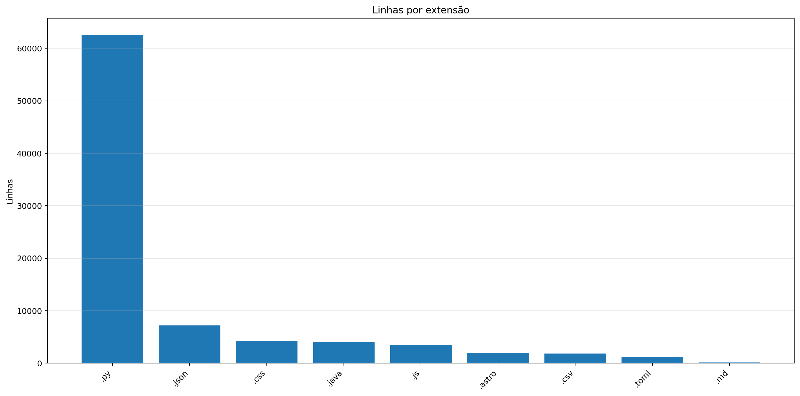

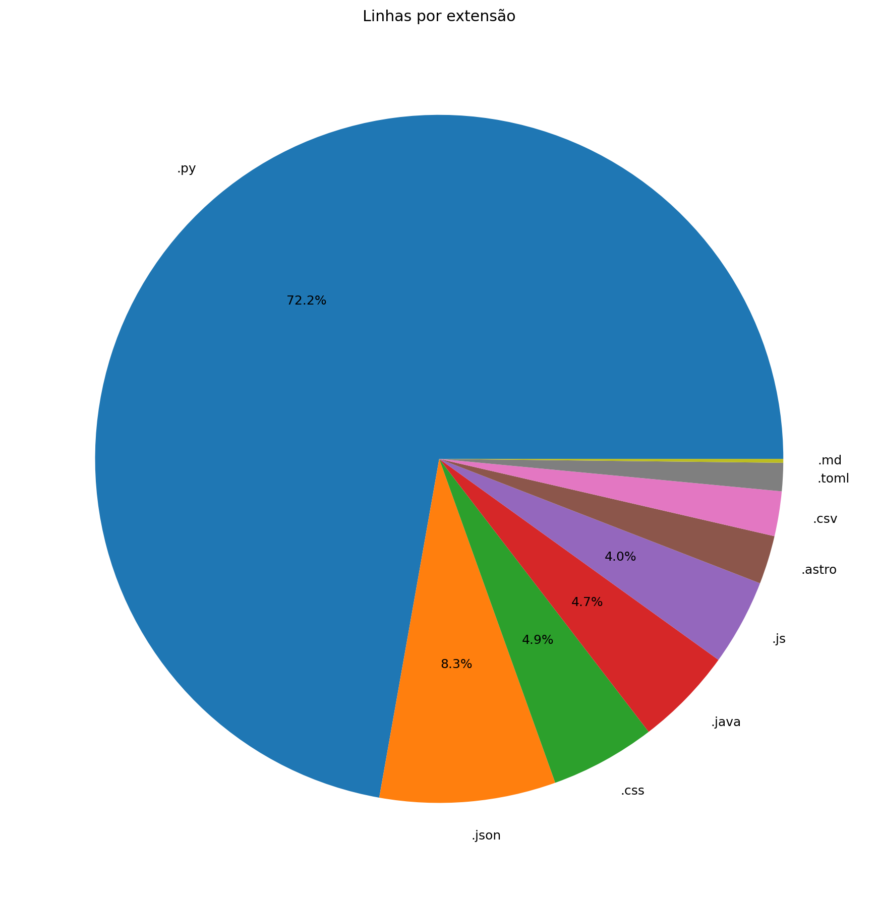

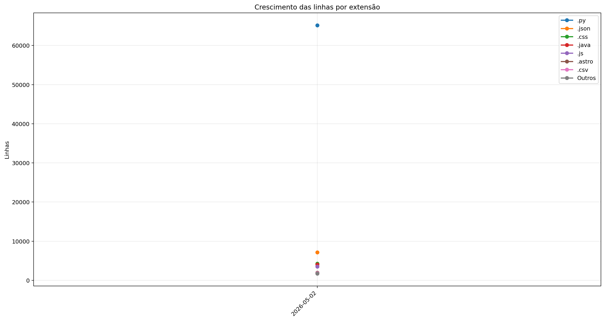

| Ext | Linhas | % das linhas | Arquivos | Peso |
|---:|---:|---:|---:|---:|
| `.py` | 65.177 | 72.66% | 225 | 2.75 MB |
| `.json` | 7.164 | 7.99% | 53 | 181.31 KB |
| `.css` | 4.284 | 4.78% | 4 | 86.31 KB |
| `.java` | 4.033 | 4.50% | 7 | 152.40 KB |
| `.js` | 3.505 | 3.91% | 10 | 122.29 KB |
| `.astro` | 1.976 | 2.20% | 20 | 76.92 KB |
| `.csv` | 1.823 | 2.03% | 9 | 211.98 KB |
| `.toml` | 1.148 | 1.28% | 14 | 24.08 KB |
| `.glsl` | 435 | 0.48% | 7 | 19.71 KB |
| `.md` | 157 | 0.17% | 1 | 7.07 KB |

## 8. Peso por extensão

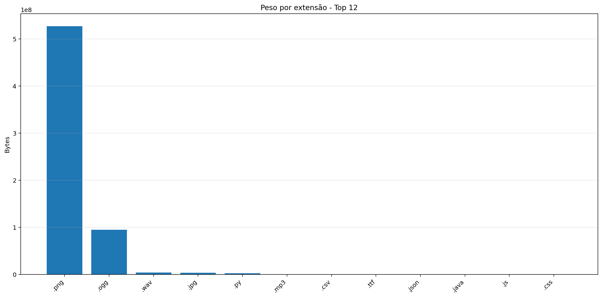

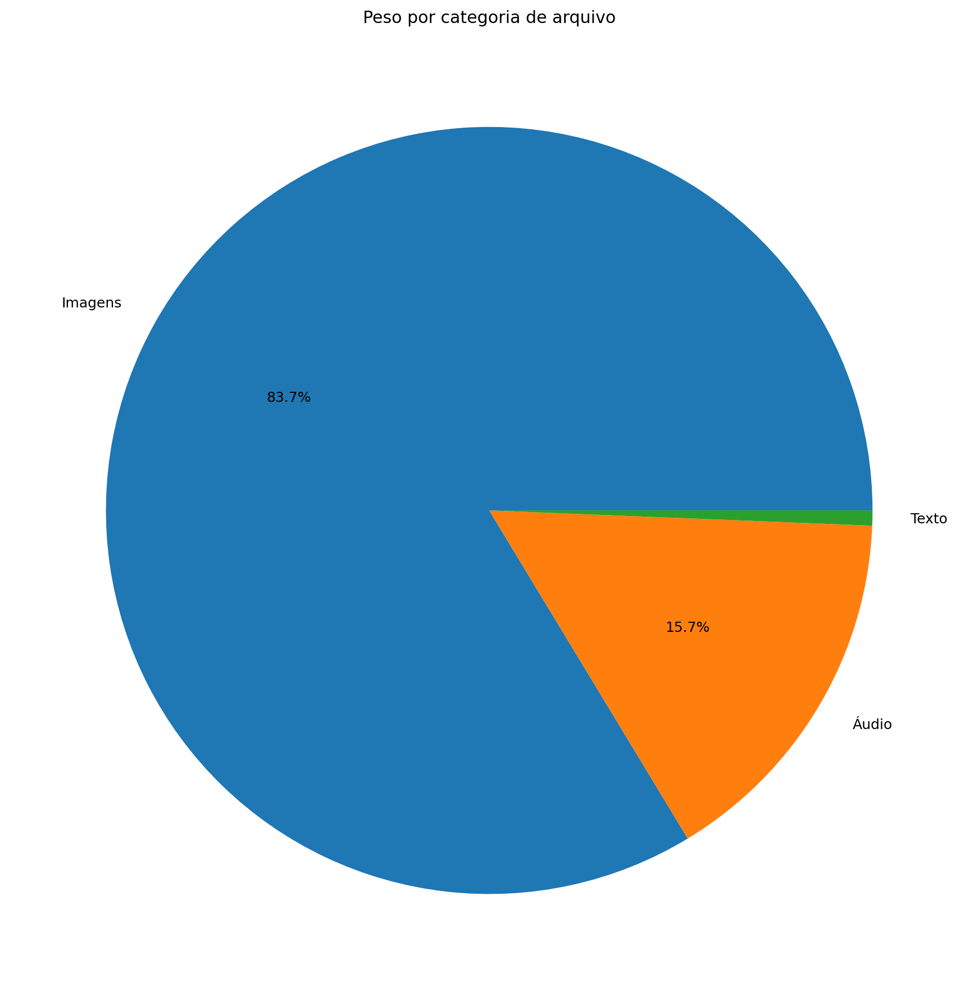

| Ext | Arquivos | Peso | % do jogo |
|---:|---:|---:|---:|
| `.png` | 71.899 | 502.89 MB | 83.07% |
| `.ogg` | 35 | 90.64 MB | 14.97% |
| `.wav` | 9 | 3.81 MB | 0.63% |
| `.jpg` | 23 | 3.61 MB | 0.60% |
| `.py` | 225 | 2.75 MB | 0.46% |
| `.mp3` | 5 | 636.73 KB | 0.10% |
| `.csv` | 9 | 211.98 KB | 0.03% |
| `.ttf` | 2 | 196.64 KB | 0.03% |
| `.json` | 53 | 181.31 KB | 0.03% |
| `.java` | 7 | 152.40 KB | 0.02% |
| `.js` | 10 | 122.29 KB | 0.02% |
| `.css` | 4 | 86.31 KB | 0.01% |
| `.astro` | 20 | 76.92 KB | 0.01% |
| `.toml` | 14 | 24.08 KB | 0.00% |
| `.glsl` | 7 | 19.71 KB | 0.00% |
| `.frag` | 2 | 17.69 KB | 0.00% |
| `.md` | 1 | 7.07 KB | 0.00% |
| `.mjs` | 1 | 500 bytes | 0.00% |
| `.vert` | 2 | 340 bytes | 0.00% |

## 9. Comparativo com o último relatório

_Sem relatório anterior compatível para montar comparativo._

### Top 3 commits por tamanho de diff

_Sem commits suficientes entre os relatórios para montar top por diff._

## 10. Gráficos de crescimento

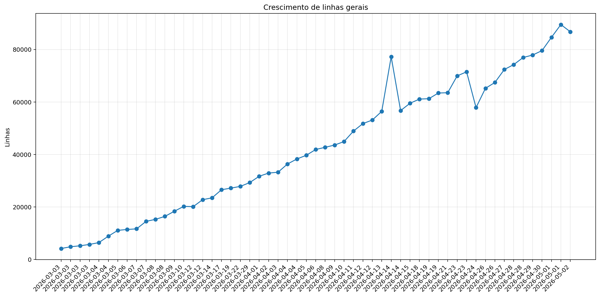

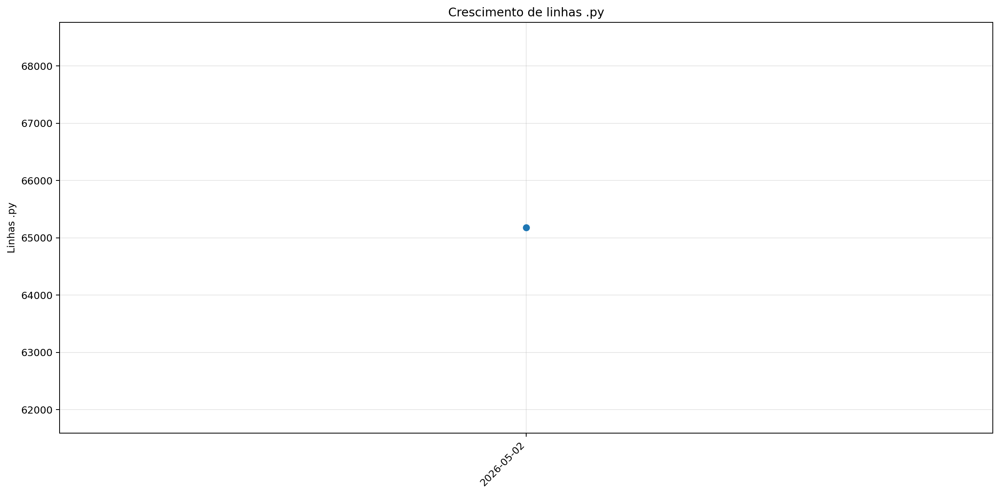

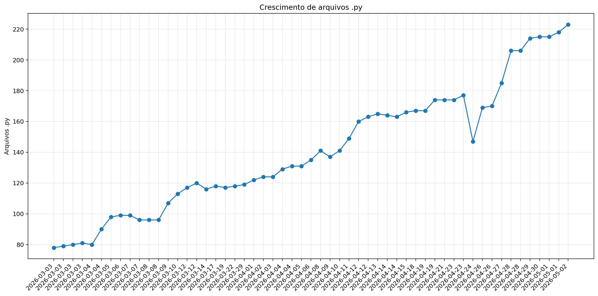

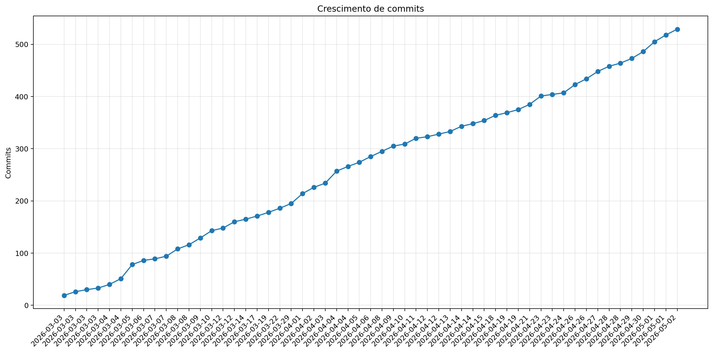

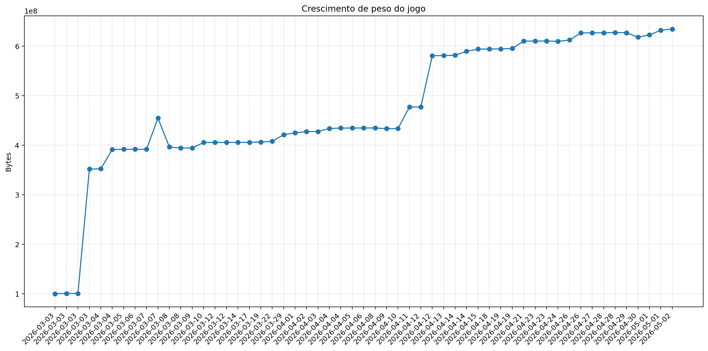

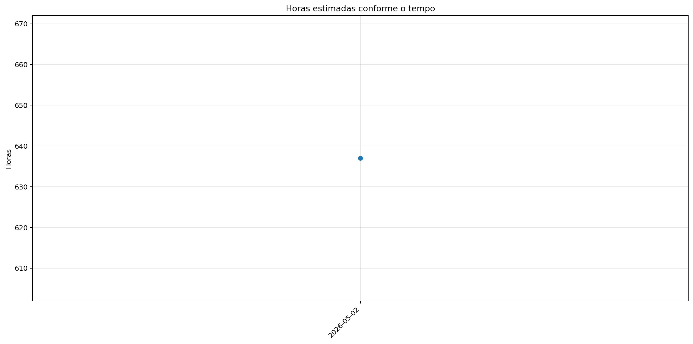
