# Registro

**Relatório:** #59  
**Projeto:** `Pokemon-Global-Server-Definitivo`  
**Gerado em:** 2026-05-06T00:55:19  
**Modelo de relatório:** 10  
**Autor:** Leon Cunha Alvaro Lopez Soto

## 1. Visão geral

- **Pastas:** 1.298
- **Arquivos:** 74.078
- **Arquivos de texto:** 397
- **Peso dos arquivos de texto:** 3979.27 KB
- **Tamanho total:** 0.943 GB (1.012.379.006 bytes)
- **Dias desde a criação do projeto:** 65
- **Dias desde a criação oficial:** 339
- **Horas estimadas:** 541.00
- **Linhas totais gerais:** 93.339
- **Commits (projeto):** 574
- **Adições desde o último relatório:** <span style='color: green'>+11.270</span>
- **Reduções desde o último relatório:** <span style='color: red'>-2.823</span>

## 2. Python

- **Arquivos `.py`:** 240
- **Linhas totais:** 67.626
- **Tamanho total `.py`:** 2978.30 KB
- **Classes encontradas:** 221
- **Funções encontradas:** 1.010
- **Métodos encontrados:** 2.940
- **Total funções + métodos:** 3.950
- **Bibliotecas diferentes usadas:** 47

## 3. Principais pastas

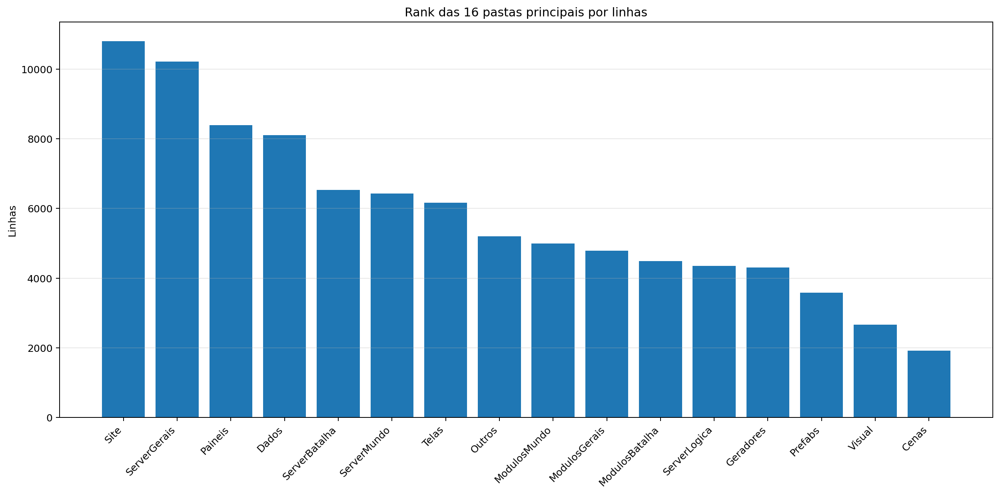

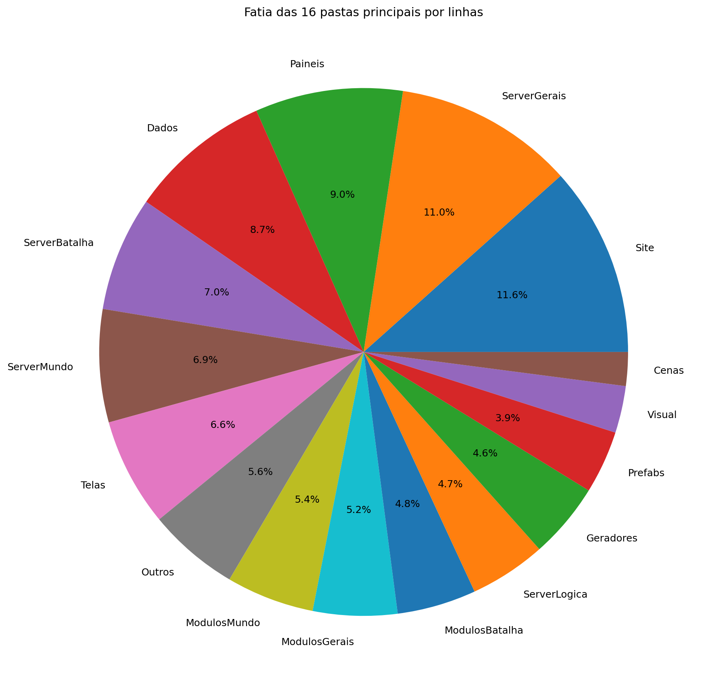

| Rank | Pasta | Subpastas | Arquivos | Linhas gerais | Tamanho (KB) |
|---:|---|---:|---:|---:|---:|
| 1 | `Site` | 23 | 1.625 | 10.802 | 274577.37 |
| 2 | `ServerGerais` | 4 | 55 | 10.214 | 568.95 |
| 3 | `Paineis` | 0 | 16 | 8.388 | 377.83 |
| 4 | `Dados` | 6 | 61 | 8.100 | 402.73 |
| 5 | `ServerBatalha` | 1 | 25 | 6.525 | 293.00 |
| 6 | `ServerMundo` | 2 | 25 | 6.424 | 339.98 |
| 7 | `Telas` | 2 | 20 | 6.163 | 241.68 |
| 8 | `Outros` | 0 | 11 | 5.198 | 188.85 |
| 9 | `ModulosMundo` | 0 | 16 | 4.995 | 235.39 |
| 10 | `ModulosGerais` | 1 | 25 | 4.787 | 183.38 |
| 11 | `ModulosBatalha` | 0 | 13 | 4.490 | 215.32 |
| 12 | `ServerLogica` | 4 | 42 | 4.347 | 134.74 |
| 13 | `Geradores` | 1 | 19 | 4.307 | 195.66 |
| 14 | `Prefabs` | 0 | 14 | 3.580 | 131.89 |
| 15 | `Visual` | 0 | 9 | 2.669 | 114.17 |
| 16 | `Cenas` | 0 | 6 | 1.921 | 97.16 |

## 4. Arquitetura

### `Codigo/`

```text
Codigo/
├── Cenas/
│   ├── CenaCarregamento.py
│   ├── CenaCombate.py
│   ├── CenaLogin.py
│   ├── CenaMenu.py
│   ├── CenaMundo.py
│   └── ControladorCenas.py
├── Geradores/
│   ├── Player/
│   │   ├── Controle.py
│   │   ├── Inventario.py
│   │   ├── Perfil.py
│   │   └── Player.py
│   ├── Armadilhas.py
│   ├── Ator.py
│   ├── Baus.py
│   ├── ConstrutorDungeon.py
│   ├── Doce.py
│   ├── Dungeon.py
│   ├── Estadio.py
│   ├── EstruturaNaturais.py
│   ├── ItemInventario.py
│   ├── ItemMundo.py
│   ├── PokemonInventario.py
│   ├── PokemonMundo.py
│   ├── portal.py
│   ├── Projetil.py
│   └── XpMundo.py
├── ModulosBatalha/
│   ├── Arena.py
│   ├── ClimaBatalha.py
│   ├── ControladorAnimacoes.py
│   ├── ControladorBatalha.py
│   ├── ElementosHudBatalha.py
│   ├── FinalizadorBatalha.py
│   ├── IndicadorAtaque.py
│   ├── InicializadorBatalha.py
│   ├── LeitorLogs.py
│   ├── MontadorJogadas.py
│   ├── PlayerBatalha.py
│   ├── PokemonBatalha.py
│   └── SeletorCapturaBatalha.py
├── ModulosGerais/
│   ├── Server/
│   │   ├── GerenciadorServerList.py
│   │   ├── Login.py
│   │   ├── ServerBatalha.py
│   │   ├── ServerLogin.py
│   │   ├── ServerMenu.py
│   │   ├── ServerMundo.py
│   │   └── ServerTerminal.py
│   ├── Auxiliares.py
│   ├── Camera.py
│   ├── Colisor.py
│   ├── CompositorModernGL.py
│   ├── DesenhaAtor.py
│   ├── DesenhoMapa.py
│   ├── Discord.py
│   ├── EfeitosTela.py
│   ├── FiltroCamera.py
│   ├── GerenciadorPokemons.py
│   ├── GerenciadorTiles.py
│   ├── ImagensMapa.py
│   ├── LoaderTabelas.py
│   ├── LogoMenu.py
│   ├── ModuladorRegras.py
│   ├── PipelineGrafica.py
│   ├── PropriedadesAtaques.py
│   └── Sonoridades.py
├── ModulosMundo/
│   ├── ControladorAtores.py
│   ├── ControladorCriaveis.py
│   ├── ControladorDungeons.py
│   ├── ControladorMundo.py
│   ├── ControladorObjetos.py
│   ├── ControladorPlayer.py
│   ├── ElementosHudMundo.py
│   ├── ExecutaveisPoção.py
│   ├── LeitorDialogo.py
│   ├── LeitorMundo.py
│   ├── Loja.py
│   ├── MecanicasTiles.py
│   ├── Minimapa.py
│   ├── ServicoCraft.py
│   ├── ServicoMapaMundo.py
│   └── SistemaPacotes.py
├── Outros/
│   └── Shaders/
│       ├── mundo.frag
│       └── mundo.vert
├── Paineis/
│   ├── Container.py
│   ├── FichaAtaque.py
│   ├── FichaItem.py
│   ├── FichaPokemon.py
│   ├── FichaPokemonBatalha.py
│   ├── MiniPaineisConhecimentos.py
│   ├── PainelAcoes.py
│   ├── PainelArvoreHabilidades.py
│   ├── PainelAuxiliarPoke.py
│   ├── PainelConhecimento.py
│   ├── PainelCraft.py
│   ├── PainelEstatisticas.py
│   ├── PainelProgresso.py
│   ├── PainelReceitas.py
│   ├── PainelTimes.py
│   └── VisualizadorLog.py
├── Prefabs/
│   ├── Arrastavel.py
│   ├── Barra.py
│   ├── BarraPesquisa.py
│   ├── Botao.py
│   ├── CaixaTexto.py
│   ├── EfeitosVisuais.py
│   ├── Fluxos.py
│   ├── Mensagem.py
│   ├── Opcoes.py
│   ├── Painel.py
│   ├── Terminal.py
│   ├── Texto.py
│   ├── TextoCinematico.py
│   └── Tooltip.py
├── Shaders/
│   ├── comum/
│   │   ├── amostras.glsl
│   │   ├── constantes.glsl
│   │   ├── cores.glsl
│   │   ├── geometria.glsl
│   │   └── ruido.glsl
│   ├── efeitos/
│   │   ├── batalha/
│   │   │   ├── clima_batalha.glsl
│   │   │   └── estados_batalha.glsl
│   │   ├── hud/
│   │   │   ├── menu_logo.glsl
│   │   │   └── texto_cinematico.glsl
│   │   ├── mundo/
│   │   │   ├── biomas_mundo.glsl
│   │   │   ├── captura.glsl
│   │   │   ├── clima_mundo.glsl
│   │   │   ├── dungeon_ambiente.glsl
│   │   │   └── grade_global.glsl
│   │   ├── biomas_mundo.glsl
│   │   ├── captura.glsl
│   │   ├── clima_batalha.glsl
│   │   ├── clima_mundo.glsl
│   │   ├── grade_global.glsl
│   │   └── menu_logo.glsl
│   ├── uniformes/
│   │   ├── batalha.glsl
│   │   ├── globais.glsl
│   │   ├── hud.glsl
│   │   └── mundo.glsl
│   ├── compositor.frag
│   ├── compositor.vert
│   └── comum.glsl
├── Telas/
│   ├── Subtelas/
│   │   ├── Subtela.py
│   │   ├── SubtelaCriarPersonagem.py
│   │   ├── SubtelaDialogo.py
│   │   ├── SubtelaFinalizacao.py
│   │   ├── SubtelaInventario.py
│   │   ├── SubtelaInventarioEstatisticas.py
│   │   ├── SubtelaInventarioItens.py
│   │   ├── SubtelaInventarioPokemons.py
│   │   ├── SubtelaOpcoes.py
│   │   └── SubtelaPreBatalha.py
│   └── Telas/
│       ├── TelaConfig.py
│       ├── TelaConfigAvancada.py
│       ├── TelaConta.py
│       ├── TelaLogin.py
│       ├── TelaMapa.py
│       ├── TelaMenu.py
│       ├── TelaMorrer.py
│       ├── TelaOperador.py
│       ├── TelaServers.py
│       └── TelasGenericas.py
└── Visual/
    ├── ArenaAnimator.py
    ├── AtorEstado.py
    ├── AuxiliaresVisuais.py
    ├── ContatoIrregularAnimator.py
    ├── PokemonBatalhaAnimator.py
    ├── PokemonBatalhaEstado.py
    ├── PokemonMundoAnimator.py
    ├── PokemonMundoEstado.py
    └── ProjetilBatalha.py
```

### `Server/`

```text
SimuladorServerJogo/
├── Batalha/
│   ├── BatalhaIA/
│   │   ├── AvaliadorIA.py
│   │   ├── ConfigIA.py
│   │   ├── ContextoIA.py
│   │   ├── ControladorIA.py
│   │   ├── ControladorIABoss.py
│   │   ├── FallbackIA.py
│   │   ├── GeradorAcoesIA.py
│   │   ├── HackerIA.py
│   │   ├── MacroSimulador.py
│   │   ├── MemoriaIA.py
│   │   ├── MetadadosAtaquesIA.json
│   │   ├── MetadadosIA.py
│   │   ├── MicroSimulador.py
│   │   └── PlanejadorIA.py
│   ├── ColetorAcoes.py
│   ├── Construto.py
│   ├── ConstrutorLog.py
│   ├── FraquezasResistencia.py
│   ├── GerenciadorPartidas.py
│   ├── IDsBatalha.py
│   ├── Partida.py
│   ├── PokemonBatalha.py
│   ├── PropriedadesAtaques.py
│   ├── ResolvedorFlags.py
│   └── RodadorTurno.py
├── Gerais/
│   ├── Geradores/
│   │   ├── Java/
│   │   │   ├── classes/
│   │   │   │   ├── Biome.class
│   │   │   │   ├── BiomeDefinition.class
│   │   │   │   ├── BiomeRules.class
│   │   │   │   ├── ClimateSource.class
│   │   │   │   ├── GeneratorContext$1.class
│   │   │   │   ├── GeneratorContext.class
│   │   │   │   ├── GeradorBiomas$1.class
│   │   │   │   ├── GeradorBiomas.class
│   │   │   │   ├── GeradorDungeons$DungeonDef.class
│   │   │   │   ├── GeradorDungeons.class
│   │   │   │   ├── GeradorImagens$1.class
│   │   │   │   ├── GeradorImagens.class
│   │   │   │   ├── GeradorLocalidades.class
│   │   │   │   ├── GeradorObjetos.class
│   │   │   │   ├── GeradorRotas$RouteCandidate.class
│   │   │   │   ├── GeradorRotas$RouteNode.class
│   │   │   │   ├── GeradorRotas.class
│   │   │   │   ├── GeradorTerreno.class
│   │   │   │   ├── LocalityPoiConfig.class
│   │   │   │   ├── LocalityRules.class
│   │   │   │   ├── NaturalStructure.class
│   │   │   │   ├── NoiseLayerConfig.class
│   │   │   │   ├── Poi.class
│   │   │   │   ├── PoiConfig.class
│   │   │   │   ├── PoiType.class
│   │   │   │   ├── RegionData.class
│   │   │   │   ├── RouteData.class
│   │   │   │   ├── RouteRules.class
│   │   │   │   ├── SimpleToml.class
│   │   │   │   ├── TerrainRules.class
│   │   │   │   ├── Tile.class
│   │   │   │   ├── TomlTable.class
│   │   │   │   └── WorldGenerator.class
│   │   │   ├── GeradorBiomas.java
│   │   │   ├── GeradorDungeons.java
│   │   │   ├── GeradorImagens.java
│   │   │   ├── GeradorLocalidades.java
│   │   │   ├── GeradorObjetos.java
│   │   │   ├── GeradorRotas.java
│   │   │   ├── GeradorTerreno.java
│   │   │   └── WorldGenerator.java
│   │   ├── GeradorBaus.py
│   │   ├── GeradorDungeons.py
│   │   ├── GeradorMundo.py
│   │   └── GeradorPokemon.py
│   ├── Rotas/
│   │   ├── Ativador.py
│   │   ├── Atualizador.py
│   │   ├── Entrada.py
│   │   ├── RotasBatalha.py
│   │   ├── ServerOperar.py
│   │   └── Terminal.py
│   ├── ContextoServidor.py
│   ├── EstadoServidor.py
│   ├── LoaderRegras.py
│   └── LoaderTabelas.py
├── Logica/
│   ├── Comandos/
│   │   └── Comandos.py
│   ├── Executes/
│   │   ├── ExecutesAtaques/
│   │   │   ├── ControladorExecutes.py
│   │   │   ├── ExecutesAgua.py
│   │   │   ├── ExecutesCosmico.py
│   │   │   ├── ExecutesDragao.py
│   │   │   ├── ExecutesEletrico.py
│   │   │   ├── ExecutesFada.py
│   │   │   ├── ExecutesFantasma.py
│   │   │   ├── ExecutesFogo.py
│   │   │   ├── ExecutesGelo.py
│   │   │   ├── ExecutesInseto.py
│   │   │   ├── ExecutesLutador.py
│   │   │   ├── ExecutesMetal.py
│   │   │   ├── ExecutesNormal.py
│   │   │   ├── ExecutesPedra.py
│   │   │   ├── ExecutesPlanta.py
│   │   │   ├── ExecutesPsiquico.py
│   │   │   ├── ExecutesSombrio.py
│   │   │   ├── ExecutesSonoro.py
│   │   │   ├── ExecutesTerra.py
│   │   │   ├── ExecutesVeneno.py
│   │   │   ├── ExecutesVoador.py
│   │   │   └── UtilitariosExecutes.py
│   │   ├── ExecutesFrutas.py
│   │   ├── ExecutesPokebolas.py
│   │   └── PassivasEquipaveis.py
│   └── Regras/
│       ├── Batalha.toml
│       ├── Biomas.toml
│       ├── Camera.toml
│       ├── Ciclo.toml
│       ├── Dungeons.toml
│       ├── EstruturasNaturais.toml
│       ├── Geracao.json
│       ├── Localidades.toml
│       ├── Mundo.toml
│       ├── NPCs.toml
│       ├── Player.toml
│       ├── Pokemons.toml
│       ├── Projeteis.toml
│       ├── Server.toml
│       ├── Spawn.toml
│       └── Terreno.toml
└── Mundo/
    ├── Cerebros/
    │   ├── CerebroBaus.py
    │   ├── CerebroCentral.py
    │   ├── CerebroDungeons.py
    │   ├── CerebroEstadios.py
    │   ├── CerebroEstruturasNaturais.py
    │   ├── CerebroItensMundo.py
    │   ├── CerebroNPCs.py
    │   ├── CerebroPokemons.py
    │   ├── CerebroProjeteis.py
    │   ├── CerebroTempo.py
    │   └── CerebroXpMundo.py
    ├── Dungeons/
    │   ├── __init__.py
    │   └── EstadoDungeon.py
    ├── AutoridadeCaptura.py
    ├── BancoDados.py
    ├── CerebroArmadilhas.py
    ├── Colisor.py
    ├── DungeonBatalha.py
    ├── DungeonGeometria.py
    ├── EstadioGeometria.py
    ├── InicializadorNPC.py
    ├── ObjetosMundoServer.py
    ├── PacotesTick.py
    ├── ServicoInventario.py
    └── TiqueServidor.py
```

### `Dados/`

```text
Dados/
├── Catalogo/
│   ├── Dungeon.json
│   ├── Musicas.json
│   ├── Pokemon Global Server - Baus.json
│   ├── Pokemon Global Server - Receitas.json
│   └── Sons.json
├── InteracoesNPC/
│   ├── Combatentes/
│   │   ├── Alleka.json
│   │   ├── Amable.json
│   │   ├── Caio.json
│   │   ├── Felipox.json
│   │   ├── Felps.json
│   │   ├── Ferraz.json
│   │   ├── Garcia.json
│   │   ├── Guedes.json
│   │   ├── Henrique.json
│   │   ├── João.json
│   │   ├── Lisciele.json
│   │   ├── Murilo.json
│   │   ├── Nathzinha.json
│   │   ├── Paulo.json
│   │   ├── Ph.json
│   │   ├── Ramos.json
│   │   ├── Sidney.json
│   │   ├── Suneiva.json
│   │   ├── Suriane.json
│   │   └── Vasques.json
│   ├── Vendedores/
│   │   └── Josefa.json
│   ├── ExemploCapitao_Laura.json
│   ├── ExemploDesafiante_Ravi.json
│   ├── ExemploDissociado_Nico.json
│   ├── ExemploLider_Alleka.json
│   └── ManualDialogos.json
├── PropriedadesAtaques/
│   ├── PropriedadesAgua.json
│   ├── PropriedadesCosmico.json
│   ├── PropriedadesDragao.json
│   ├── PropriedadesEletrico.json
│   ├── PropriedadesFada.json
│   ├── PropriedadesFantasma.json
│   ├── PropriedadesFogo.json
│   ├── PropriedadesGelo.json
│   ├── PropriedadesInseto.json
│   ├── PropriedadesLutador.json
│   ├── PropriedadesMetal.json
│   ├── PropriedadesNormal.json
│   ├── PropriedadesPedra.json
│   ├── PropriedadesPlanta.json
│   ├── PropriedadesPsiquico.json
│   ├── PropriedadesSombrio.json
│   ├── PropriedadesSonoro.json
│   ├── PropriedadesTerra.json
│   ├── PropriedadesVeneno.json
│   └── PropriedadesVoador.json
└── Tabelas/
    ├── Pokemon Global Server - Ataques.csv
    ├── Pokemon Global Server - Dungeons.csv
    ├── Pokemon Global Server - Efeitos.csv
    ├── Pokemon Global Server - Equipaveis.csv
    ├── Pokemon Global Server - Itens.csv
    ├── Pokemon Global Server - NPC Combatente (1).csv
    ├── Pokemon Global Server - NPC Combatente.csv
    ├── Pokemon Global Server - NPC Vendedor.csv
    ├── Pokemon Global Server - Pokemons.csv
    └── Pokemon Global Server - Sistema FR.csv
```

### `Site/`

```text
Site/
├── public/
│   ├── Ataques/
│   │   ├── Absorção Total.png
│   │   ├── Afiar.png
│   │   ├── Aguas Magicas.png
│   │   ├── Amplificar.png
│   │   ├── Aquecer.png
│   │   ├── Arranhar.png
│   │   ├── Ataque Rapido.png
│   │   ├── Barragem Energetica.png
│   │   ├── Barragem Punho Guardião.png
│   │   ├── Biscoito.png
│   │   ├── Bola Climatica.png
│   │   ├── Bola de Agua.png
│   │   ├── Bola de Fogo.png
│   │   ├── Bola Eletrica.png
│   │   ├── Bola Sombria.png
│   │   ├── Bolhas.png
│   │   ├── Cachoeira.png
│   │   ├── Casco Vivo.png
│   │   ├── Chicote de Vinha.png
│   │   ├── Chifrada.png
│   │   ├── Choque do Trovao.png
│   │   ├── Choque Duplo.png
│   │   ├── Chuva Curativa.png
│   │   ├── Conrole do Oceano.png
│   │   ├── Correnteza.png
│   │   ├── Curto.png
│   │   ├── Dança da chuva.png
│   │   ├── Dança do Sol.png
│   │   ├── Dança Eletrica.png
│   │   ├── Descarga Total.png
│   │   ├── Diluviu.png
│   │   ├── Disparo.png
│   │   ├── Drenagem Hidrica.png
│   │   ├── Dreno.png
│   │   ├── Eletrochoque.png
│   │   ├── Energia.png
│   │   ├── Energizar.png
│   │   ├── Enraivecer.png
│   │   ├── Erupção.png
│   │   ├── Esfera Hidrocaotica.png
│   │   ├── Esguicho Suave.png
│   │   ├── Esmagar.png
│   │   ├── Estocada.png
│   │   ├── Estouro Solar.png
│   │   ├── Explosão Ardente.png
│   │   ├── ferver.png
│   │   ├── Flutuante.png
│   │   ├── Fluxo Infernal.png
│   │   ├── Foguinho.png
│   │   ├── Fonte Termal.png
│   │   ├── Geiser.png
│   │   ├── Golpe Abissal.png
│   │   ├── Golpe de Concha.png
│   │   ├── Golpe Precavido.png
│   │   ├── Gota Pesada.png
│   │   ├── Guilhotina.png
│   │   ├── Hiper Presa.png
│   │   ├── Hiper Raio.png
│   │   ├── Incendiar.png
│   │   ├── Inferno.png
│   │   ├── Inflar.png
│   │   ├── Investida Flamejante.png
│   │   ├── Investida.png
│   │   ├── Jato de Agua.png
│   │   ├── Jato de Lava.png
│   │   ├── Jato Duplo.png
│   │   ├── Jato Triplo.png
│   │   ├── Labareda.png
│   │   ├── Lança de Agua.png
│   │   ├── Laser de Fogo.png
│   │   ├── Martelo Caranguejo.png
│   │   ├── Mergulho.png
│   │   ├── Mimica.png
│   │   ├── Nadador.png
│   │   ├── Normalizar.png
│   │   ├── Ondas de Calor.png
│   │   ├── Pele Aquatica.png
│   │   ├── Proteger.png
│   │   ├── Provocar.png
│   │   ├── Queimadura Eterna.png
│   │   ├── Queimar.png
│   │   ├── Raio Cosmico.png
│   │   ├── Raio de Fogo.png
│   │   ├── Raio Psiquico.png
│   │   ├── Raizes.png
│   │   ├── Recarga.png
│   │   ├── Redemoinho.png
│   │   ├── Reservatorio.png
│   │   ├── Resetar.png
│   │   ├── Seiva Misteriosa.png
│   │   ├── Sintese.png
│   │   ├── Splash.png
│   │   ├── Superaquecer.png
│   │   ├── Surfar.png
│   │   ├── Tankar.png
│   │   ├── Torrente Vital.png
│   │   ├── Transformar.png
│   │   ├── Trevo da Sorte.png
│   │   ├── Tsunami.png
│   │   ├── Ultra Raio Aleatorio.png
│   │   ├── Vampirismo Energetico.png
│   │   └── Voador.png
│   ├── Atributos/
│   │   ├── Acuracia.png
│   │   ├── altura.png
│   │   ├── Amplificação.png
│   │   ├── Assertividade.png
│   │   ├── Atk.png
│   │   ├── Barreira.png
│   │   ├── CrC.png
│   │   ├── CrD.png
│   │   ├── custo.png
│   │   ├── Def.png
│   │   ├── Durabilidade.png
│   │   ├── Ene.png
│   │   ├── Escala.png
│   │   ├── Int.png
│   │   ├── Mag.png
│   │   ├── Per.png
│   │   ├── Peso.png
│   │   ├── SpA.png
│   │   ├── SpD.png
│   │   ├── Vamp.png
│   │   ├── Vel.png
│   │   └── Vida.png
│   ├── Efeitos/
│   │   ├── Abençoada.png
│   │   ├── Abençoado.png
│   │   ├── Amaldiçoada.png
│   │   ├── Amaldiçoado.png
│   │   ├── Amplificado.png
│   │   ├── Atordoado.png
│   │   ├── Bloqueado.png
│   │   ├── Cauterizado.png
│   │   ├── Chuva Acida.png
│   │   ├── Chuva.png
│   │   ├── Confuso.png
│   │   ├── Congelado.png
│   │   ├── Contaminada.png
│   │   ├── Descarregado.png
│   │   ├── Destruida.png
│   │   ├── Dormindo.png
│   │   ├── Elevada.png
│   │   ├── Encantado.png
│   │   ├── Encharcado.png
│   │   ├── Energizada.png
│   │   ├── Energizado.png
│   │   ├── Enfraquecido.png
│   │   ├── Enraizado.png
│   │   ├── Envenenado.png
│   │   ├── Evasivo.png
│   │   ├── Flutuando.png
│   │   ├── Focado.png
│   │   ├── Fortificado.png
│   │   ├── Furtivo.png
│   │   ├── Gravidade Anomala.png
│   │   ├── Imortal.png
│   │   ├── Imparavel.png
│   │   ├── Imune.png
│   │   ├── Incendiada.png
│   │   ├── Intoxicado.png
│   │   ├── Nevasca.png
│   │   ├── Nevoa.png
│   │   ├── Noite Densa.png
│   │   ├── Paralisado.png
│   │   ├── Preparado.png
│   │   ├── Provocando.png
│   │   ├── Quebrado.png
│   │   ├── Queimado.png
│   │   ├── Refletindo.png
│   │   ├── Regeneração.png
│   │   ├── Sagrada.png
│   │   ├── Sol Forte.png
│   │   ├── Tempestade de Areia.png
│   │   ├── Tempestade de Raios.png
│   │   ├── Vampirico.png
│   │   └── Voando.png
│   ├── Equipaveis/
│   │   ├── Amuleto Sintilante.png
│   │   ├── Anjo Guardião.png
│   │   ├── Arco de Ossos.png
│   │   ├── Arco dos Ventos.png
│   │   ├── Armadura Natural.png
│   │   ├── Armadura Reforçada.png
│   │   ├── Bastião Inabalavel.png
│   │   ├── Besta Afiada.png
│   │   ├── Botas Colossais.png
│   │   ├── Botas do Sucesso.png
│   │   ├── Cajado do Som.png
│   │   ├── Capa Alheia.png
│   │   ├── Capa Assombrada.png
│   │   ├── Capa Solari.png
│   │   ├── Cetro Espiritual.png
│   │   ├── Chapéu do Bruxo.png
│   │   ├── Cinto Gigante.png
│   │   ├── Colete de Espinhos.png
│   │   ├── Coração de Ferro.png
│   │   ├── Coração de Gelo.png
│   │   ├── Coroa da Vitória.png
│   │   ├── Coroa do Inverno Eterno.png
│   │   ├── Dente do Fim.png
│   │   ├── Elmo Abençoado.png
│   │   ├── Elmo Cósmico.png
│   │   ├── Elmo Psiônico.png
│   │   ├── Emblema da Chama.png
│   │   ├── Emblema das Sombras.png
│   │   ├── Espada Energizada.png
│   │   ├── Espada Envenenada.png
│   │   ├── Espada Mental.png
│   │   ├── Estaca Terrestre.png
│   │   ├── Estilingue das Folhas.png
│   │   ├── Eternidade.png
│   │   ├── Faca do Dragão.png
│   │   ├── Faixa da Escolha.png
│   │   ├── Fluxo Aquatico.png
│   │   ├── Gota Sagrada.png
│   │   ├── Lamina Fumegante.png
│   │   ├── Machadinha Ignea.png
│   │   ├── Machado Amaldiçoado.png
│   │   ├── Maldição.png
│   │   ├── Mascara de Mosquito Gigante.png
│   │   ├── Mosstomper_Seedling_item.png
│   │   ├── Mão que Tudo Ve.png
│   │   ├── Mão Sinistra.png
│   │   ├── Obreira da Escama Ardente.png
│   │   ├── Pedra Flutuante.png
│   │   ├── Placa Defensiva.png
│   │   ├── Punho Congelado.png
│   │   ├── Punho Robusto.png
│   │   ├── Quebra Barreira.png
│   │   ├── Semblante Congelado.png
│   │   ├── Semblante das Aguas.png
│   │   ├── Serra Toxica.png
│   │   ├── Sino Dourado.png
│   │   ├── Sismitarra Marcada.png
│   │   ├── Tiara Encantada.png
│   │   ├── Trovao Encapsulado.png
│   │   └── Ídolo Perdido.png
│   ├── Ferramentas/
│   │   ├── Balde.png
│   │   ├── Chave.png
│   │   ├── Machado de Ametista.png
│   │   ├── Machado de Diamante.png
│   │   ├── Machado de Madeira.png
│   │   ├── Machado de Ouro.png
│   │   ├── Machado de Pedra.png
│   │   ├── Machado de Rubi.png
│   │   ├── Picareta de Ametista.png
│   │   ├── Picareta de Diamante.png
│   │   ├── Picareta de Madeira.png
│   │   ├── Picareta de Ouro.png
│   │   ├── Picareta de Pedra.png
│   │   └── Picareta de Rubi.png
│   ├── Frutas/
│   │   ├── Abbajuur Berry.png
│   │   ├── Caxi Berry.png
│   │   ├── Desert Berry.png
│   │   ├── Field Berry.png
│   │   ├── Frambo Berry.png
│   │   ├── Frozen Berry.png
│   │   ├── Jujuca Berry.png
│   │   ├── Jungle Berry.png
│   │   ├── Lava Berry.png
│   │   ├── Lum Berry.png
│   │   ├── Magic Berry.png
│   │   ├── Secret Berry.png
│   │   ├── Simp Berry.png
│   │   ├── Super Frambo Berry.png
│   │   ├── Tomper Berry.png
│   │   └── Water Berry.png
│   ├── GlobalServer/
│   │   ├── Icone.png
│   │   ├── Logo.png
│   │   └── QuadroLogo.png
│   ├── Imagens/
│   │   ├── abomasnow.png
│   │   ├── abra.png
│   │   ├── absol.png
│   │   ├── accelgor.png
│   │   ├── aegislash blade.png
│   │   ├── aegislash shield.png
│   │   ├── aerodactyl.png
│   │   ├── aggron.png
│   │   ├── aipom.png
│   │   ├── alakazam.png
│   │   ├── alcremie.png
│   │   ├── alomomola.png
│   │   ├── altaria.png
│   │   ├── amaura.png
│   │   ├── ambipom.png
│   │   ├── amoonguss.png
│   │   ├── ampharos.png
│   │   ├── annihilape.png
│   │   ├── anorith.png
│   │   ├── appletun.png
│   │   ├── applin.png
│   │   ├── araquanid.png
│   │   ├── arbok.png
│   │   ├── arcanine.png
│   │   ├── arceus.png
│   │   ├── archen.png
│   │   ├── archeops.png
│   │   ├── arctovish.png
│   │   ├── arctozolt.png
│   │   ├── ariados.png
│   │   ├── armaldo.png
│   │   ├── aromatisse.png
│   │   ├── aron.png
│   │   ├── arrokuda.png
│   │   ├── articuno.png
│   │   ├── audino.png
│   │   ├── aurorus.png
│   │   ├── avalugg.png
│   │   ├── axew.png
│   │   ├── azelf.png
│   │   ├── azumarill.png
│   │   ├── azurill.png
│   │   ├── bagon.png
│   │   ├── baltoy.png
│   │   ├── banette.png
│   │   ├── barbaracle.png
│   │   ├── barboach.png
│   │   ├── barraskewda.png
│   │   ├── basculegion.png
│   │   ├── basculin.png
│   │   ├── bastiodon.png
│   │   ├── bayleef.png
│   │   ├── beartic.png
│   │   ├── beautifly.png
│   │   ├── beedrill.png
│   │   ├── beheeyem.png
│   │   ├── beldum.png
│   │   ├── bellossom.png
│   │   ├── bellsprout.png
│   │   ├── bergmite.png
│   │   ├── bewear.png
│   │   ├── bibarel.png
│   │   ├── bidoof.png
│   │   ├── binacle.png
│   │   ├── bisharp.png
│   │   ├── blacephalon.png
│   │   ├── blastoise.png
│   │   ├── blaziken.png
│   │   ├── blipbug.png
│   │   ├── blissey.png
│   │   ├── blitzle.png
│   │   ├── boldore.png
│   │   ├── boltund.png
│   │   ├── bonsly.png
│   │   ├── bouffalant.png
│   │   ├── bounsweet.png
│   │   ├── braixen.png
│   │   ├── braviary.png
│   │   ├── breloom.png
│   │   ├── brionne.png
│   │   ├── bronzong.png
│   │   ├── bronzor.png
│   │   ├── bruxish.png
│   │   ├── budew.png
│   │   ├── buizel.png
│   │   ├── bulbasaur.png
│   │   ├── buneary.png
│   │   ├── bunnelby.png
│   │   ├── burmy-plant.png
│   │   ├── butterfree.png
│   │   ├── buzzwole.png
│   │   ├── cacnea.png
│   │   ├── cacturne.png
│   │   ├── camerupt.png
│   │   ├── carbink.png
│   │   ├── carkol.png
│   │   ├── carnivine.png
│   │   ├── carracosta.png
│   │   ├── carvanha.png
│   │   ├── cascoon.png
│   │   ├── castform.png
│   │   ├── caterpie.png
│   │   ├── celebi.png
│   │   ├── celesteela.png
│   │   ├── centiskorch.png
│   │   ├── chandelure.png
│   │   ├── chansey.png
│   │   ├── charizard.png
│   │   ├── charjabug.png
│   │   ├── charmander.png
│   │   ├── charmeleon.png
│   │   ├── chatot.png
│   │   ├── cherrim-overcast.png
│   │   ├── cherubi.png
│   │   ├── chesnaught.png
│   │   ├── chespin.png
│   │   ├── chewtle.png
│   │   ├── chikorita.png
│   │   ├── chimchar.png
│   │   ├── chimecho.png
│   │   ├── chinchou.png
│   │   ├── chingling.png
│   │   ├── cinccino.png
│   │   ├── cinderace.png
│   │   ├── clamperl.png
│   │   ├── clauncher.png
│   │   ├── clawitzer.png
│   │   ├── claydol.png
│   │   ├── clefable.png
│   │   ├── clefairy.png
│   │   ├── cleffa.png
│   │   ├── clobbopus.png
│   │   ├── cloyster.png
│   │   ├── coalossal.png
│   │   ├── cobalion.png
│   │   ├── cofagrigus.png
│   │   ├── combee.png
│   │   ├── combusken.png
│   │   ├── comfey.png
│   │   ├── conkeldurr.png
│   │   ├── copperajah.png
│   │   ├── corphish.png
│   │   ├── corsola.png
│   │   ├── corviknight.png
│   │   ├── corvisquire.png
│   │   ├── cosmoem.png
│   │   ├── cosmog.png
│   │   ├── cottonee.png
│   │   ├── crabominable.png
│   │   ├── crabrawler.png
│   │   ├── cradily.png
│   │   ├── cramorant.png
│   │   ├── cranidos.png
│   │   ├── crawdaunt.png
│   │   ├── cresselia.png
│   │   ├── croagunk.png
│   │   ├── crobat.png
│   │   ├── croconaw.png
│   │   ├── crustle.png
│   │   ├── cryogonal.png
│   │   ├── cubchoo.png
│   │   ├── cubone.png
│   │   ├── cufant.png
│   │   ├── cursola.png
│   │   ├── cutiefly.png
│   │   ├── cyndaquil.png
│   │   ├── darkrai.png
│   │   ├── darmanitan-standard.png
│   │   ├── dartrix.png
│   │   ├── darumaka.png
│   │   ├── decidueye.png
│   │   ├── dedenne.png
│   │   ├── deerling-spring.png
│   │   ├── deino.png
│   │   ├── delcatty.png
│   │   ├── delibird.png
│   │   ├── delphox.png
│   │   ├── deoxys.png
│   │   ├── dewgong.png
│   │   ├── dewott.png
│   │   ├── dewpider.png
│   │   ├── dhelmise.png
│   │   ├── dialga.png
│   │   ├── diancie.png
│   │   ├── diggersby.png
│   │   ├── diglett.png
│   │   ├── ditto.png
│   │   ├── dodrio.png
│   │   ├── doduo.png
│   │   ├── donphan.png
│   │   ├── dottler.png
│   │   ├── doublade.png
│   │   ├── dracovish.png
│   │   ├── dracozolt.png
│   │   ├── dragalge.png
│   │   ├── dragapult.png
│   │   ├── dragonair.png
│   │   ├── dragonite.png
│   │   ├── drakloak.png
│   │   ├── drampa.png
│   │   ├── drapion.png
│   │   ├── dratini.png
│   │   ├── drednaw.png
│   │   ├── dreepy.png
│   │   ├── drifblim.png
│   │   ├── drifloon.png
│   │   ├── drilbur.png
│   │   ├── drizzile.png
│   │   ├── drowzee.png
│   │   ├── druddigon.png
│   │   ├── dubwool.png
│   │   ├── ducklett.png
│   │   ├── dugtrio.png
│   │   ├── dunsparce.png
│   │   ├── duosion.png
│   │   ├── duraludon.png
│   │   ├── durant.png
│   │   ├── dusclops.png
│   │   ├── dusknoir.png
│   │   ├── duskull.png
│   │   ├── dustox.png
│   │   ├── dwebble.png
│   │   ├── eelektrik.png
│   │   ├── eelektross.png
│   │   ├── eevee.png
│   │   ├── eiscue-ice.png
│   │   ├── ekans.png
│   │   ├── eldegoss.png
│   │   ├── electabuzz.png
│   │   ├── electivire.png
│   │   ├── electrike.png
│   │   ├── electrode.png
│   │   ├── elekid.png
│   │   ├── elgyem.png
│   │   ├── emboar.png
│   │   ├── emolga.png
│   │   ├── empoleon.png
│   │   ├── entei.png
│   │   ├── escavalier.png
│   │   ├── espeon.png
│   │   ├── espurr.png
│   │   ├── eternatus.png
│   │   ├── excadrill.png
│   │   ├── exeggcute.png
│   │   ├── exeggutor.png
│   │   ├── exploud.png
│   │   ├── falinks.png
│   │   ├── farfetchd.png
│   │   ├── fearow.png
│   │   ├── feebas.png
│   │   ├── fennekin.png
│   │   ├── feraligatr.png
│   │   ├── ferroseed.png
│   │   ├── ferrothorn.png
│   │   ├── finneon.png
│   │   ├── flaaffy.png
│   │   ├── flabebe-red.png
│   │   ├── flapple.png
│   │   ├── flareon.png
│   │   ├── fletchinder.png
│   │   ├── fletchling.png
│   │   ├── floatzel.png
│   │   ├── floette-red.png
│   │   ├── florges-red.png
│   │   ├── flygon.png
│   │   ├── fomantis.png
│   │   ├── foongus.png
│   │   ├── forretress.png
│   │   ├── fraxure.png
│   │   ├── frillish.png
│   │   ├── froakie.png
│   │   ├── frogadier.png
│   │   ├── froslass.png
│   │   ├── frosmoth.png
│   │   ├── furfrou.png
│   │   ├── furret.png
│   │   ├── gabite.png
│   │   ├── gallade.png
│   │   ├── galvantula.png
│   │   ├── garbodor.png
│   │   ├── garchomp.png
│   │   ├── gardevoir.png
│   │   ├── gastly.png
│   │   ├── gastrodon-west.png
│   │   ├── genesect.png
│   │   ├── gengar.png
│   │   ├── geodude.png
│   │   ├── gible.png
│   │   ├── gigalith.png
│   │   ├── gigantamax alcremie.png
│   │   ├── gigantamax appletun.png
│   │   ├── gigantamax blastoise.png
│   │   ├── gigantamax butterfree.png
│   │   ├── gigantamax centiskorch.png
│   │   ├── gigantamax charizard.png
│   │   ├── gigantamax cinderace.png
│   │   ├── gigantamax coalossal.png
│   │   ├── gigantamax copperajah.png
│   │   ├── gigantamax corviknight.png
│   │   ├── gigantamax drednaw.png
│   │   ├── gigantamax duraludon.png
│   │   ├── gigantamax eevee.png
│   │   ├── gigantamax flapple.png
│   │   ├── gigantamax garbodor.png
│   │   ├── gigantamax gengar.png
│   │   ├── gigantamax grimmsnarl.png
│   │   ├── gigantamax hatterene.png
│   │   ├── gigantamax inteleon.png
│   │   ├── gigantamax kingler.png
│   │   ├── gigantamax lapras.png
│   │   ├── gigantamax machamp.png
│   │   ├── gigantamax melmetal.png
│   │   ├── gigantamax meowth.png
│   │   ├── gigantamax orbeetle.png
│   │   ├── gigantamax pikachu.png
│   │   ├── gigantamax rillaboom.png
│   │   ├── gigantamax sandaconda.png
│   │   ├── gigantamax snorlax.png
│   │   ├── gigantamax toxtricity.png
│   │   ├── gigantamax urshifu rapid strike.png
│   │   ├── gigantamax urshifu single strike.png
│   │   ├── gigantamax venusaur.png
│   │   ├── girafarig.png
│   │   ├── giratina.png
│   │   ├── glaceon.png
│   │   ├── glalie.png
│   │   ├── glameow.png
│   │   ├── glastrier.png
│   │   ├── gligar.png
│   │   ├── gliscor.png
│   │   ├── gloom.png
│   │   ├── gogoat.png
│   │   ├── golbat.png
│   │   ├── goldeen.png
│   │   ├── golduck.png
│   │   ├── golem.png
│   │   ├── golett.png
│   │   ├── golisopod.png
│   │   ├── golurk.png
│   │   ├── goodra.png
│   │   ├── goomy.png
│   │   ├── gorebyss.png
│   │   ├── gossifleur.png
│   │   ├── gothita.png
│   │   ├── gothitelle.png
│   │   ├── gothorita.png
│   │   ├── gourgeist.png
│   │   ├── granbull.png
│   │   ├── grapploct.png
│   │   ├── graveler.png
│   │   ├── greedent.png
│   │   ├── greninja.png
│   │   ├── grimer.png
│   │   ├── grimmsnarl.png
│   │   ├── grookey.png
│   │   ├── grotle.png
│   │   ├── groudon.png
│   │   ├── grovyle.png
│   │   ├── growlithe.png
│   │   ├── grubbin.png
│   │   ├── grumpig.png
│   │   ├── gulpin.png
│   │   ├── gumshoos.png
│   │   ├── gurdurr.png
│   │   ├── guzzlord.png
│   │   ├── gyarados.png
│   │   ├── hakamo-o.png
│   │   ├── happiny.png
│   │   ├── hariyama.png
│   │   ├── hatenna.png
│   │   ├── hatterene.png
│   │   ├── hattrem.png
│   │   ├── haunter.png
│   │   ├── hawlucha.png
│   │   ├── haxorus.png
│   │   ├── heatmor.png
│   │   ├── heatran.png
│   │   ├── heliolisk.png
│   │   ├── helioptile.png
│   │   ├── heracross.png
│   │   ├── herdier.png
│   │   ├── hippopotas.png
│   │   ├── hippowdon.png
│   │   ├── hitmonchan.png
│   │   ├── hitmonlee.png
│   │   ├── hitmontop.png
│   │   ├── ho-oh.png
│   │   ├── honchkrow.png
│   │   ├── honedge.png
│   │   ├── hoopa.png
│   │   ├── hoothoot.png
│   │   ├── hoppip.png
│   │   ├── horsea.png
│   │   ├── houndoom.png
│   │   ├── houndour.png
│   │   ├── huntail.png
│   │   ├── hydreigon.png
│   │   ├── hypno.png
│   │   ├── igglybuff.png
│   │   ├── illumise.png
│   │   ├── impidimp.png
│   │   ├── incineroar.png
│   │   ├── indeedee-male.png
│   │   ├── indeedeefemale.png
│   │   ├── infernape.png
│   │   ├── inkay.png
│   │   ├── inteleon.png
│   │   ├── ivysaur.png
│   │   ├── jangmo-o.png
│   │   ├── jellicent.png
│   │   ├── jigglypuff.png
│   │   ├── jirachi.png
│   │   ├── jolteon.png
│   │   ├── joltik.png
│   │   ├── jumpluff.png
│   │   ├── jynx.png
│   │   ├── kabuto.png
│   │   ├── kabutops.png
│   │   ├── kadabra.png
│   │   ├── kakuna.png
│   │   ├── kangaskhan.png
│   │   ├── karrablast.png
│   │   ├── kartana.png
│   │   ├── kecleon.png
│   │   ├── keldeo.png
│   │   ├── kingdra.png
│   │   ├── kingler.png
│   │   ├── kirlia.png
│   │   ├── klang.png
│   │   ├── kleavor.png
│   │   ├── klefki.png
│   │   ├── klink.png
│   │   ├── klinklang.png
│   │   ├── koffing.png
│   │   ├── komala.png
│   │   ├── kommo-o.png
│   │   ├── krabby.png
│   │   ├── kricketot.png
│   │   ├── kricketune.png
│   │   ├── krokorok.png
│   │   ├── krookodile.png
│   │   ├── kubfu.png
│   │   ├── kyogre.png
│   │   ├── kyurem.png
│   │   ├── lairon.png
│   │   ├── lampent.png
│   │   ├── landorus.png
│   │   ├── lanturn.png
│   │   ├── lapras.png
│   │   ├── larvesta.png
│   │   ├── larvitar.png
│   │   ├── latias.png
│   │   ├── latios.png
│   │   ├── leafeon.png
│   │   ├── leavanny.png
│   │   ├── ledian.png
│   │   ├── ledyba.png
│   │   ├── lickilicky.png
│   │   ├── lickitung.png
│   │   ├── liepard.png
│   │   ├── lileep.png
│   │   ├── lilligant.png
│   │   ├── lillipup.png
│   │   ├── litleo.png
│   │   ├── litten.png
│   │   ├── litwick.png
│   │   ├── lombre.png
│   │   ├── lopunny.png
│   │   ├── lotad.png
│   │   ├── loudred.png
│   │   ├── lucario.png
│   │   ├── ludicolo.png
│   │   ├── lugia.png
│   │   ├── lumineon.png
│   │   ├── lunala.png
│   │   ├── lunatone.png
│   │   ├── lurantis.png
│   │   ├── luvdisc.png
│   │   ├── luxio.png
│   │   ├── luxray.png
│   │   ├── lycanrocdusk.png
│   │   ├── lycanrocmidday.png
│   │   ├── lycanrocmidnight.png
│   │   ├── machamp.png
│   │   ├── machoke.png
│   │   ├── machop.png
│   │   ├── magby.png
│   │   ├── magcargo.png
│   │   ├── magearna.png
│   │   ├── magikarp.png
│   │   ├── magmar.png
│   │   ├── magmortar.png
│   │   ├── magnemite (1).png
│   │   ├── magnemite.png
│   │   ├── magneton.png
│   │   ├── magnezone.png
│   │   ├── makuhita.png
│   │   ├── malamar.png
│   │   ├── mamoswine.png
│   │   ├── manaphy.png
│   │   ├── mandibuzz.png
│   │   ├── manectric.png
│   │   ├── mankey.png
│   │   ├── mantine.png
│   │   ├── mantyke.png
│   │   ├── maractus.png
│   │   ├── mareanie.png
│   │   ├── mareep.png
│   │   ├── marill.png
│   │   ├── marowak.png
│   │   ├── marshadow.png
│   │   ├── marshtomp.png
│   │   ├── masquerain.png
│   │   ├── mawile.png
│   │   ├── medicham.png
│   │   ├── meditite.png
│   │   ├── mega abomasnow.png
│   │   ├── mega absol.png
│   │   ├── mega aerodactyl.png
│   │   ├── mega aggron.png
│   │   ├── mega alakazam.png
│   │   ├── mega altaria.png
│   │   ├── mega ampharos.png
│   │   ├── mega audino.png
│   │   ├── mega banette.png
│   │   ├── mega beedrill.png
│   │   ├── mega blastoise.png
│   │   ├── mega blaziken.png
│   │   ├── mega camerupt.png
│   │   ├── mega charizard .png
│   │   ├── mega diancie.png
│   │   ├── mega gallade.png
│   │   ├── mega garchomp.png
│   │   ├── mega gardevoir.png
│   │   ├── mega gengar.png
│   │   ├── mega glalie.png
│   │   ├── mega gyarados.png
│   │   ├── mega heracross.png
│   │   ├── mega houndoom.png
│   │   ├── mega kangaskhan.png
│   │   ├── mega latias.png
│   │   ├── mega latios.png
│   │   ├── mega lopunny.png
│   │   ├── mega lucario.png
│   │   ├── mega manectric.png
│   │   ├── mega mawile.png
│   │   ├── mega medicham.png
│   │   ├── mega metagross.png
│   │   ├── mega mewtwo.png
│   │   ├── mega pidgeot.png
│   │   ├── mega pinsir.png
│   │   ├── mega rayquaza.png
│   │   ├── mega sableye.png
│   │   ├── mega salamence.png
│   │   ├── mega sceptile.png
│   │   ├── mega scizor.png
│   │   ├── mega sharpedo.png
│   │   ├── mega slowbro.png
│   │   ├── mega steelix.png
│   │   ├── mega swampert.png
│   │   ├── mega tyranitar.png
│   │   ├── mega venusaur.png
│   │   ├── meganium.png
│   │   ├── melmetal.png
│   │   ├── meloetta.png
│   │   ├── meltan.png
│   │   ├── meowsticfemale.png
│   │   ├── meowsticmale.png
│   │   ├── meowth.png
│   │   ├── mesprit.png
│   │   ├── metagross.png
│   │   ├── metang.png
│   │   ├── metapod.png
│   │   ├── mew.png
│   │   ├── mewtwo.png
│   │   ├── mienfoo.png
│   │   ├── mienshao.png
│   │   ├── mightyena.png
│   │   ├── milcery.png
│   │   ├── milotic.png
│   │   ├── miltank.png
│   │   ├── mime-jr.png
│   │   ├── mimikyu.png
│   │   ├── minccino.png
│   │   ├── minior-meteor.png
│   │   ├── minun.png
│   │   ├── misdreavus.png
│   │   ├── mismagius.png
│   │   ├── moltres.png
│   │   ├── monferno.png
│   │   ├── morelull.png
│   │   ├── morgrem.png
│   │   ├── morpeko-full-belly.png
│   │   ├── mr-mime.png
│   │   ├── mr-rime.png
│   │   ├── mudbray.png
│   │   ├── mudkip.png
│   │   ├── mudsdale.png
│   │   ├── muk.png
│   │   ├── munchlax.png
│   │   ├── munna.png
│   │   ├── murkrow.png
│   │   ├── musharna.png
│   │   ├── naganadel.png
│   │   ├── natu.png
│   │   ├── necrozma.png
│   │   ├── nickit.png
│   │   ├── nidoking.png
│   │   ├── nidoqueen.png
│   │   ├── nidorana.png
│   │   ├── nidorano.png
│   │   ├── nidorina.png
│   │   ├── nidorino.png
│   │   ├── nihilego.png
│   │   ├── nincada.png
│   │   ├── ninetales.png
│   │   ├── ninjask.png
│   │   ├── noctowl.png
│   │   ├── noibat.png
│   │   ├── noivern.png
│   │   ├── nosepass.png
│   │   ├── numel.png
│   │   ├── nuzleaf.png
│   │   ├── obstagoon.png
│   │   ├── octillery.png
│   │   ├── oddish.png
│   │   ├── omanyte.png
│   │   ├── omastar.png
│   │   ├── onix.png
│   │   ├── oranguru.png
│   │   ├── orbeetle.png
│   │   ├── oricorio-baile.png
│   │   ├── oshawott.png
│   │   ├── overqwil.png
│   │   ├── pachirisu.png
│   │   ├── palkia.png
│   │   ├── palossand.png
│   │   ├── palpitoad.png
│   │   ├── pancham.png
│   │   ├── pangoro.png
│   │   ├── panpour.png
│   │   ├── pansage.png
│   │   ├── pansear.png
│   │   ├── paras.png
│   │   ├── parasect.png
│   │   ├── passimian.png
│   │   ├── patrat.png
│   │   ├── pawniard.png
│   │   ├── pelipper.png
│   │   ├── perserker.png
│   │   ├── persian.png
│   │   ├── petilil.png
│   │   ├── phanpy.png
│   │   ├── phantump.png
│   │   ├── pheromosa.png
│   │   ├── phione.png
│   │   ├── pichu.png
│   │   ├── pidgeot.png
│   │   ├── pidgeotto.png
│   │   ├── pidgey.png
│   │   ├── pidove.png
│   │   ├── pignite.png
│   │   ├── pikachu.png
│   │   ├── pikipek.png
│   │   ├── piloswine.png
│   │   ├── pincurchin.png
│   │   ├── pineco.png
│   │   ├── pinsir.png
│   │   ├── piplup.png
│   │   ├── plusle.png
│   │   ├── poipole.png
│   │   ├── politoed.png
│   │   ├── poliwag.png
│   │   ├── poliwhirl.png
│   │   ├── poliwrath.png
│   │   ├── polteageist.png
│   │   ├── ponyta.png
│   │   ├── poochyena.png
│   │   ├── popplio.png
│   │   ├── porygon2.png
│   │   ├── porygon-z.png
│   │   ├── porygon.png
│   │   ├── primarina.png
│   │   ├── primeape.png
│   │   ├── prinplup.png
│   │   ├── probopass.png
│   │   ├── psyduck.png
│   │   ├── pumpkaboo.png
│   │   ├── pupitar.png
│   │   ├── purrloin.png
│   │   ├── purugly.png
│   │   ├── pyroar-male.png
│   │   ├── pyukumuku.png
│   │   ├── quagsire.png
│   │   ├── quilava.png
│   │   ├── quilladin.png
│   │   ├── qwilfish.png
│   │   ├── raboot.png
│   │   ├── raichu.png
│   │   ├── raikou.png
│   │   ├── ralts.png
│   │   ├── rampardos.png
│   │   ├── rapidash.png
│   │   ├── raticate.png
│   │   ├── rattata.png
│   │   ├── rayquaza.png
│   │   ├── regice.png
│   │   ├── regidrago.png
│   │   ├── regieleki.png
│   │   ├── regigigas.png
│   │   ├── regirock.png
│   │   ├── registeel.png
│   │   ├── relicanth.png
│   │   ├── remoraid.png
│   │   ├── reshiram.png
│   │   ├── reuniclus.png
│   │   ├── rhydon.png
│   │   ├── rhyhorn.png
│   │   ├── rhyperior.png
│   │   ├── ribombee.png
│   │   ├── rillaboom.png
│   │   ├── riolu.png
│   │   ├── rockruff.png
│   │   ├── roggenrola.png
│   │   ├── rolycoly.png
│   │   ├── rookidee.png
│   │   ├── roselia.png
│   │   ├── roserade.png
│   │   ├── rotom.png
│   │   ├── rowlet.png
│   │   ├── rufflet.png
│   │   ├── runerigus.png
│   │   ├── sableye.png
│   │   ├── salamence.png
│   │   ├── salandit.png
│   │   ├── salazzle.png
│   │   ├── samurott.png
│   │   ├── sandaconda.png
│   │   ├── sandile.png
│   │   ├── sandshrew.png
│   │   ├── sandslash.png
│   │   ├── sandygast.png
│   │   ├── sawk.png
│   │   ├── sawsbuck-spring.png
│   │   ├── scatterbug.png
│   │   ├── sceptile.png
│   │   ├── scizor.png
│   │   ├── scolipede.png
│   │   ├── scorbunny.png
│   │   ├── scrafty.png
│   │   ├── scraggy.png
│   │   ├── scyther.png
│   │   ├── seadra.png
│   │   ├── seaking.png
│   │   ├── sealeo.png
│   │   ├── seedot.png
│   │   ├── seel.png
│   │   ├── seismitoad.png
│   │   ├── sentret.png
│   │   ├── serperior.png
│   │   ├── servine.png
│   │   ├── seviper.png
│   │   ├── sewaddle.png
│   │   ├── sharpedo.png
│   │   ├── shaymin.png
│   │   ├── shedinja.png
│   │   ├── shelgon.png
│   │   ├── shellder.png
│   │   ├── shellos-west.png
│   │   ├── shelmet.png
│   │   ├── shieldon.png
│   │   ├── shiftry.png
│   │   ├── shiinotic.png
│   │   ├── shinx.png
│   │   ├── shroomish.png
│   │   ├── shuckle.png
│   │   ├── shuppet.png
│   │   ├── sigilyph.png
│   │   ├── silcoon.png
│   │   ├── silicobra.png
│   │   ├── silvally.png
│   │   ├── simipour.png
│   │   ├── simisage.png
│   │   ├── simisear.png
│   │   ├── sinistea.png
│   │   ├── sirfetchd.png
│   │   ├── sizzlipede.png
│   │   ├── skarmory.png
│   │   ├── skiddo.png
│   │   ├── skiploom.png
│   │   ├── skitty.png
│   │   ├── skorupi.png
│   │   ├── skrelp.png
│   │   ├── skuntank.png
│   │   ├── skwovet.png
│   │   ├── slaking.png
│   │   ├── slakoth.png
│   │   ├── sliggoo.png
│   │   ├── slowbro.png
│   │   ├── slowking.png
│   │   ├── slowpoke.png
│   │   ├── slugma.png
│   │   ├── slurpuff.png
│   │   ├── smeargle.png
│   │   ├── smoochum.png
│   │   ├── sneasel.png
│   │   ├── snivy.png
│   │   ├── snom.png
│   │   ├── snorlax.png
│   │   ├── snorunt.png
│   │   ├── snover.png
│   │   ├── snubbull.png
│   │   ├── sobble.png
│   │   ├── solgaleo.png
│   │   ├── solosis.png
│   │   ├── solrock.png
│   │   ├── spearow.png
│   │   ├── spectrier.png
│   │   ├── spewpa.png
│   │   ├── spheal.png
│   │   ├── spinarak.png
│   │   ├── spinda.png
│   │   ├── spiritomb.png
│   │   ├── spoink.png
│   │   ├── spritzee.png
│   │   ├── squirtle.png
│   │   ├── stakataka.png
│   │   ├── stantler.png
│   │   ├── staraptor.png
│   │   ├── staravia.png
│   │   ├── starly.png
│   │   ├── starmie.png
│   │   ├── staryu.png
│   │   ├── steelix.png
│   │   ├── steenee.png
│   │   ├── stonjourner.png
│   │   ├── stoutland.png
│   │   ├── stufful.png
│   │   ├── stunfisk.png
│   │   ├── stunky.png
│   │   ├── sudowoodo.png
│   │   ├── suicune.png
│   │   ├── sunflora.png
│   │   ├── sunkern.png
│   │   ├── surskit.png
│   │   ├── swablu.png
│   │   ├── swadloon.png
│   │   ├── swalot.png
│   │   ├── swampert.png
│   │   ├── swanna.png
│   │   ├── swellow.png
│   │   ├── swinub.png
│   │   ├── swirlix.png
│   │   ├── swoobat.png
│   │   ├── sylveon.png
│   │   ├── taillow.png
│   │   ├── talonflame.png
│   │   ├── tangela.png
│   │   ├── tangrowth.png
│   │   ├── tapu-bulu.png
│   │   ├── tapu-fini.png
│   │   ├── tapu-koko.png
│   │   ├── tapu-lele.png
│   │   ├── tauros.png
│   │   ├── teddiursa.png
│   │   ├── tentacool.png
│   │   ├── tentacruel.png
│   │   ├── tepig.png
│   │   ├── terrakion.png
│   │   ├── thievul.png
│   │   ├── throh.png
│   │   ├── thundurus.png
│   │   ├── thwackey.png
│   │   ├── timburr.png
│   │   ├── tirtouga.png
│   │   ├── togedemaru.png
│   │   ├── togekiss.png
│   │   ├── togepi.png
│   │   ├── togetic.png
│   │   ├── torchic.png
│   │   ├── torkoal.png
│   │   ├── tornadus.png
│   │   ├── torracat.png
│   │   ├── torterra.png
│   │   ├── totodile.png
│   │   ├── toucannon.png
│   │   ├── toxapex.png
│   │   ├── toxel.png
│   │   ├── toxicroak.png
│   │   ├── toxtricity-amped.png
│   │   ├── tranquill.png
│   │   ├── trapinch.png
│   │   ├── treecko.png
│   │   ├── trevenant.png
│   │   ├── tropius.png
│   │   ├── trubbish.png
│   │   ├── trumbeak.png
│   │   ├── tsareena.png
│   │   ├── turtonator.png
│   │   ├── turtwig.png
│   │   ├── tympole.png
│   │   ├── tynamo.png
│   │   ├── type-null.png
│   │   ├── typhlosion.png
│   │   ├── tyranitar.png
│   │   ├── tyrantrum.png
│   │   ├── tyrogue.png
│   │   ├── tyrunt.png
│   │   ├── ultra arcanine.png
│   │   ├── ultra articuno.png
│   │   ├── ultra avalugg.png
│   │   ├── ultra charizard.png
│   │   ├── ultra decidueye.png
│   │   ├── ultra dugtrio.png
│   │   ├── ultra exeguttor.png
│   │   ├── ultra geodude.png
│   │   ├── ultra golem.png
│   │   ├── ultra goodra.png
│   │   ├── ultra graveler.png
│   │   ├── ultra greninja.png
│   │   ├── ultra growlithe.png
│   │   ├── ultra lilligant.png
│   │   ├── ultra meowth.png
│   │   ├── ultra mewtwo.png
│   │   ├── ultra moltres.png
│   │   ├── ultra muk.png
│   │   ├── ultra ninetales.png
│   │   ├── ultra persian.png
│   │   ├── ultra ponyta.png
│   │   ├── ultra qwilfish.png
│   │   ├── ultra raichu.png
│   │   ├── ultra rapidash.png
│   │   ├── ultra raticate.png
│   │   ├── ultra rattata.png
│   │   ├── ultra sandshrew.png
│   │   ├── ultra sandslash.png
│   │   ├── ultra sliggoo.png
│   │   ├── ultra slowbro.png
│   │   ├── ultra sneasel.png
│   │   ├── ultra typhlosion.png
│   │   ├── ultra ursaluna.png
│   │   ├── ultra vulpix.png
│   │   ├── ultra weavile.png
│   │   ├── ultra weezing.png
│   │   ├── ultra zapdos.png
│   │   ├── umbreon.png
│   │   ├── unfezant.png
│   │   ├── unown-a.png
│   │   ├── ursaluna.png
│   │   ├── ursaring.png
│   │   ├── urshifu.png
│   │   ├── uxie.png
│   │   ├── vanillish.png
│   │   ├── vanillite.png
│   │   ├── vanilluxe.png
│   │   ├── vaporeon.png
│   │   ├── venipede.png
│   │   ├── venomoth.png
│   │   ├── venonat.png
│   │   ├── venusaur.png
│   │   ├── vespiquen.png
│   │   ├── vibrava.png
│   │   ├── victini.png
│   │   ├── victreebel.png
│   │   ├── vigoroth.png
│   │   ├── vikavolt.png
│   │   ├── vileplume.png
│   │   ├── virizion.png
│   │   ├── vivillon-meadow.png
│   │   ├── volbeat.png
│   │   ├── volcanion.png
│   │   ├── volcarona.png
│   │   ├── voltorb.png
│   │   ├── vullaby.png
│   │   ├── vulpix.png
│   │   ├── wailmer.png
│   │   ├── wailord.png
│   │   ├── walrein.png
│   │   ├── wartortle.png
│   │   ├── watchog.png
│   │   ├── weavile.png
│   │   ├── weedle.png
│   │   ├── weepinbell.png
│   │   ├── weezing.png
│   │   ├── whimsicott.png
│   │   ├── whirlipede.png
│   │   ├── whiscash.png
│   │   ├── whismur.png
│   │   ├── wigglytuff.png
│   │   ├── wimpod.png
│   │   ├── wingull.png
│   │   ├── wishiwashi-solo.png
│   │   ├── wobbuffet.png
│   │   ├── woobat.png
│   │   ├── wooloo.png
│   │   ├── wooper.png
│   │   ├── wormadam-plant.png
│   │   ├── wurmple.png
│   │   ├── wynaut.png
│   │   ├── wyrdeer.png
│   │   ├── xatu.png
│   │   ├── xerneas.png
│   │   ├── xurkitree.png
│   │   ├── yamask.png
│   │   ├── yamper.png
│   │   ├── yanma.png
│   │   ├── yanmega.png
│   │   ├── yungoos.png
│   │   ├── yveltal.png
│   │   ├── zacian.png
│   │   ├── zamazenta.png
│   │   ├── zangoose.png
│   │   ├── zapdos.png
│   │   ├── zarude.png
│   │   ├── zebstrika.png
│   │   ├── zekrom.png
│   │   ├── zeraora.png
│   │   ├── zoroark.png
│   │   ├── zorua.png
│   │   ├── zubat.png
│   │   ├── zweilous.png
│   │   └── zygarde.png
│   ├── Insigneas/
│   │   ├── Agua.png
│   │   ├── Cosmico.png
│   │   ├── Dragão.png
│   │   ├── Eletrico.png
│   │   ├── Fada.png
│   │   ├── Fantasma.png
│   │   ├── Fogo.png
│   │   ├── Gelo.png
│   │   ├── Inseto.png
│   │   ├── Lutador.png
│   │   ├── Metal.png
│   │   ├── Normal.png
│   │   ├── Pedra.png
│   │   ├── Planta.png
│   │   ├── Psiquico.png
│   │   ├── Sombrio.png
│   │   ├── Sonoro.png
│   │   ├── Terrestre.png
│   │   ├── Venenoso.png
│   │   └── Voador.png
│   ├── Medalhoes/
│   │   ├── Dungeon da Caldeira Impossível.png
│   │   ├── Dungeon da Canção Esquecida.png
│   │   ├── Dungeon da Chama da Vitória.png
│   │   ├── Dungeon da Corrupção Carmesim.png
│   │   ├── Dungeon da Estrela dos Desejos.png
│   │   ├── Dungeon da Fenda Ultra.png
│   │   ├── Dungeon da Floresta Atemporal.png
│   │   ├── Dungeon da Forja Titânica.png
│   │   ├── Dungeon da Fornalha Subterrânea.png
│   │   ├── Dungeon da Lâmina Prometida.png
│   │   ├── Dungeon da Máquina Ancestral.png
│   │   ├── Dungeon da Máscara Terastal.png
│   │   ├── Dungeon da Ordem Perfeita.png
│   │   ├── Dungeon da Origem Perdida.png
│   │   ├── Dungeon da Relíquia Mecânica.png
│   │   ├── Dungeon da Ruptura do Espaço-Tempo.png
│   │   ├── Dungeon da Selva Proibida.png
│   │   ├── Dungeon da Serpente Eterna.png
│   │   ├── Dungeon da Sombra Absoluta.png
│   │   ├── Dungeon da Trindade Celeste.png
│   │   ├── Dungeon das Asas Sagradas.png
│   │   ├── Dungeon das Coroas de Aço.png
│   │   ├── Dungeon do Berço das Marés.png
│   │   ├── Dungeon do Colosso Adormecido.png
│   │   ├── Dungeon do Código Artificial.png
│   │   ├── Dungeon do Diamante Sagrado.png
│   │   ├── Dungeon do DNA Cósmico.png
│   │   ├── Dungeon do Eclipse Vital.png
│   │   ├── Dungeon do Jardim Celestial.png
│   │   ├── Dungeon do Julgamento Alpha.png
│   │   ├── Dungeon do Laboratório Proibido.png
│   │   ├── Dungeon do Limiar dos Sonhos.png
│   │   ├── Dungeon do Prisma Negro.png
│   │   ├── Dungeon do Punho Supremo.png
│   │   ├── Dungeon do Raio Errante.png
│   │   ├── Dungeon do Trono Invernal Sombroso.png
│   │   ├── Dungeon do Vazio Congelado.png
│   │   ├── Dungeon dos Anéis do Caos.png
│   │   ├── Dungeon dos Astros Gêmeos.png
│   │   ├── Dungeon dos Cavaleiros da Justiça.png
│   │   ├── Dungeon dos Cinco Selos.png
│   │   ├── Dungeon dos Dragões do Futuro e do Passado.png
│   │   ├── Dungeon dos Dragões do Ideal e da Verdade.png
│   │   ├── Dungeon dos Guardiões da Mente.png
│   │   ├── Dungeon dos Guardiões das Ilhas.png
│   │   ├── Dungeon dos Gêmeos do Horizonte.png
│   │   ├── Dungeon dos Senhores da Tempestade.png
│   │   ├── Dungeon dos Tesouros da Ruína.png
│   │   ├── Dungeon dos Titãs Primordiais.png
│   │   └── Dungeon dos Trovões Ancestrais.png
│   ├── Objetos/
│   │   ├── Ametista.png
│   │   ├── Aquamarine.png
│   │   ├── Arbusto.png
│   │   ├── Arvore2.png
│   │   ├── Arvore3.png
│   │   ├── Arvore Frondosa2.png
│   │   ├── Arvore Frondosa3.png
│   │   ├── Arvore Frondosa.png
│   │   ├── Arvore.png
│   │   ├── Cacto.png
│   │   ├── Carvão.png
│   │   ├── Casa.png
│   │   ├── Cobre.png
│   │   ├── Concha.png
│   │   ├── Diamante.png
│   │   ├── Esmeralda.png
│   │   ├── Ferro.png
│   │   ├── Flor.png
│   │   ├── Jade.png
│   │   ├── Lava2.png
│   │   ├── Lava.png
│   │   ├── Ouro.png
│   │   ├── Palmeira.png
│   │   ├── Pedra.png
│   │   ├── PedraDungeon.png
│   │   ├── Pinheiro.png
│   │   ├── Planta.png
│   │   ├── Rubi.png
│   │   ├── Safira.png
│   │   └── Topazio.png
│   ├── Pokebolas/
│   │   ├── Aquaball.png
│   │   ├── Attemptball.png
│   │   ├── Beastball.png
│   │   ├── Candyball.png
│   │   ├── Fastball.png
│   │   ├── frame_6.png
│   │   ├── frame_7.png
│   │   ├── Fruitball.png
│   │   ├── Furyball.png
│   │   ├── Greatball.png
│   │   ├── Heavyball.png
│   │   ├── Levelball.png
│   │   ├── Loveball.png
│   │   ├── Masterball.png
│   │   ├── Pokeball.png
│   │   ├── Premierball.png
│   │   ├── Secretball.png
│   │   ├── Sniperball.png
│   │   ├── Tallball.png
│   │   └── Ultraball.png
│   ├── Poções/
│   │   ├── Elite_Fast_TM.png
│   │   ├── Elixir.png
│   │   ├── Fast_TM.png
│   │   ├── Hiper Elixir.png
│   │   ├── Hiper Poção.png
│   │   ├── Max Revival.png
│   │   ├── Mega Elixir.png
│   │   ├── Mega Poção.png
│   │   ├── Poção Maxima.png
│   │   ├── Poção Suprema.png
│   │   ├── Poção.png
│   │   ├── Revival.png
│   │   ├── Super Elixir.png
│   │   └── Super Poção.png
│   ├── Recursos/
│   │   ├── Agua.png
│   │   ├── Ametista.png
│   │   ├── Aquamarine.png
│   │   ├── Cobre.png
│   │   ├── Diamante.png
│   │   ├── Esmeralda.png
│   │   ├── Ferro.png
│   │   ├── Jade.png
│   │   ├── Lava.png
│   │   ├── Madeira.png
│   │   ├── Ouro.png
│   │   ├── Pedra.png
│   │   ├── Rubi.png
│   │   ├── Safira.png
│   │   └── Topazio.png
│   ├── Skins/
│   │   ├── 1.png
│   │   ├── 2.png
│   │   ├── 3.png
│   │   ├── 4.png
│   │   ├── 5.png
│   │   ├── 6.png
│   │   ├── 7.png
│   │   ├── 8.png
│   │   ├── 9.png
│   │   ├── 10.png
│   │   ├── 11.png
│   │   ├── 12.png
│   │   ├── 13.png
│   │   ├── 14.png
│   │   ├── 15.png
│   │   ├── 16.png
│   │   ├── 17.png
│   │   ├── 18.png
│   │   ├── 19.png
│   │   ├── 20.png
│   │   ├── 21.png
│   │   ├── 22.png
│   │   ├── 23.png
│   │   ├── 24.png
│   │   ├── 25.png
│   │   ├── 26.png
│   │   ├── 27.png
│   │   ├── 28.png
│   │   ├── 29.png
│   │   ├── 30.png
│   │   ├── 31.png
│   │   ├── 32.png
│   │   ├── 33.png
│   │   ├── 34.png
│   │   ├── 35.png
│   │   ├── 36.png
│   │   ├── 37.png
│   │   ├── 38.png
│   │   ├── 39.png
│   │   ├── 40.png
│   │   ├── 41.png
│   │   ├── 42.png
│   │   ├── 43.png
│   │   ├── 44.png
│   │   ├── 45.png
│   │   ├── 46.png
│   │   ├── 47.png
│   │   ├── 48.png
│   │   ├── 49.png
│   │   ├── 50.png
│   │   ├── 51.png
│   │   ├── 52.png
│   │   ├── 53.png
│   │   ├── 54.png
│   │   ├── 55.png
│   │   ├── 56.png
│   │   ├── 57.png
│   │   ├── 58.png
│   │   ├── 59.png
│   │   ├── 60.png
│   │   ├── 61.png
│   │   ├── 62.png
│   │   ├── 63.png
│   │   ├── 64.png
│   │   ├── 65.png
│   │   ├── 66.png
│   │   ├── 67.png
│   │   ├── 68.png
│   │   ├── 69.png
│   │   ├── 70.png
│   │   ├── 71.png
│   │   ├── 72.png
│   │   ├── 73.png
│   │   ├── 74.png
│   │   ├── 75.png
│   │   ├── 76.png
│   │   ├── 77.png
│   │   ├── 78.png
│   │   ├── 79.png
│   │   ├── 80.png
│   │   ├── 81.png
│   │   ├── 82.png
│   │   ├── 83.png
│   │   ├── 84.png
│   │   ├── 85.png
│   │   ├── 86.png
│   │   ├── 87.png
│   │   ├── 88.png
│   │   ├── 89.png
│   │   ├── 90.png
│   │   ├── 91.png
│   │   ├── 92.png
│   │   ├── 93.png
│   │   ├── 94.png
│   │   ├── 95.png
│   │   ├── 96.png
│   │   └── 97.png
│   └── Tipos/
│       ├── agua.png
│       ├── cosmico.png
│       ├── dragao.png
│       ├── eletrico.png
│       ├── fada.png
│       ├── fantasma.png
│       ├── fogo.png
│       ├── gelo.png
│       ├── inseto.png
│       ├── lutador.png
│       ├── metal.png
│       ├── normal.png
│       ├── pedra.png
│       ├── planta.png
│       ├── psiquico.png
│       ├── sombrio.png
│       ├── sonoro.png
│       ├── terrestre.png
│       ├── venenoso.png
│       └── voador.png
├── src/
│   ├── Codigo/
│   │   ├── AssetsPublicos.js
│   │   ├── AtaquesRuntime.js
│   │   ├── AtaquesWikiDados.js
│   │   ├── CombateWikiDados.js
│   │   ├── DungeonsRuntime.js
│   │   ├── DungeonsWikiDados.js
│   │   ├── EfeitosRuntime.js
│   │   ├── EfeitosWikiDados.js
│   │   ├── EquipaveisRuntime.js
│   │   ├── EquipaveisWikiDados.js
│   │   ├── EstadiosRuntime.js
│   │   ├── ItemWikiDados.js
│   │   ├── ItensRuntime.js
│   │   ├── MundoRuntime.js
│   │   ├── MundoWikiDados.js
│   │   ├── NpcsRuntime.js
│   │   ├── NpcsWikiDados.js
│   │   ├── PokedexRuntime.js
│   │   ├── PokemonWikiDados.js
│   │   ├── RotasSite.js
│   │   ├── site.js
│   │   ├── WikiCsv.js
│   │   └── WikiRuntimeBase.js
│   ├── Componentes/
│   │   ├── Botao.astro
│   │   ├── CardCatalogo.astro
│   │   ├── CardWiki.astro
│   │   ├── Footer.astro
│   │   ├── Header.astro
│   │   ├── Layout.astro
│   │   ├── ModalDetalhe.astro
│   │   ├── ResumoWiki.astro
│   │   ├── TipoIcone.astro
│   │   ├── WikiGrid.astro
│   │   ├── WikiMenu.astro
│   │   ├── WikiToolbar.astro
│   │   └── WikiTopo.astro
│   ├── Estilos/
│   │   ├── auth.css
│   │   ├── global.css
│   │   ├── home.css
│   │   ├── wiki-ataques.css
│   │   ├── wiki-base.css
│   │   ├── wiki-cards.css
│   │   ├── wiki-combate.css
│   │   ├── wiki-dungeons.css
│   │   ├── wiki-equipaveis.css
│   │   ├── wiki-itens.css
│   │   ├── wiki-modal.css
│   │   ├── wiki-mundo.css
│   │   ├── wiki-pokedex.css
│   │   └── wiki.css
│   └── pages/
│       ├── wiki/
│       │   ├── ataques.astro
│       │   ├── comandos.astro
│       │   ├── combate.astro
│       │   ├── dungeons.astro
│       │   ├── efeitos.astro
│       │   ├── equipaveis.astro
│       │   ├── estadios.astro
│       │   ├── index.astro
│       │   ├── itens.astro
│       │   ├── mundo.astro
│       │   ├── npcs.astro
│       │   ├── pokemons.astro
│       │   └── receitas.astro
│       ├── conta.astro
│       ├── contato.astro
│       ├── download.astro
│       └── index.astro
├── astro.config.mjs
└── package.json
```

### `Outros/`

```text
Outros/
├── AbridorSite.py
├── AtualizadorReadMe.py
├── AtualizadorRelatorios.py
├── ConfigFixa.py
├── EditorSkins.py
├── GameTestFPS.py
├── GeradorRelatorios.py
├── Mixer.py
├── SimuladorBatalha.py
├── TesteDungeonLayout.py
└── Zipador.py
```

## 5. Ranks

### Top 50 maiores arquivos `.py` por linhas

| Arquivo | Linhas | Tamanho (KB) |
|---|---:|---:|
| `Outros/GeradorRelatorios.py` | 1.828 | 67.77 |
| `Codigo/Paineis/FichaPokemon.py` | 1.265 | 56.96 |
| `Codigo/ModulosMundo/ControladorObjetos.py` | 1.261 | 64.03 |
| `Codigo/Paineis/VisualizadorLog.py` | 1.101 | 64.15 |
| `Codigo/Telas/Subtelas/SubtelaInventarioPokemons.py` | 1.096 | 50.19 |
| `SimuladorServerJogo/Gerais/EstadoServidor.py` | 1.065 | 44.00 |
| `Codigo/Cenas/CenaMundo.py` | 1.000 | 58.60 |
| `SimuladorServerJogo/Gerais/Geradores/GeradorPokemon.py` | 922 | 38.32 |
| `Codigo/ModulosMundo/ControladorPlayer.py` | 908 | 44.66 |
| `SimuladorServerJogo/Gerais/Geradores/GeradorDungeons.py` | 880 | 39.25 |
| `SimuladorServerJogo/Mundo/Cerebros/CerebroDungeons.py` | 849 | 47.48 |
| `Codigo/Prefabs/Texto.py` | 819 | 31.41 |
| `SimuladorServerJogo/Mundo/BancoDados.py` | 803 | 40.02 |
| `Codigo/ModulosBatalha/MontadorJogadas.py` | 796 | 40.29 |
| `SimuladorServerJogo/Batalha/PokemonBatalha.py` | 794 | 43.29 |
| `SimuladorServerJogo/Batalha/Partida.py` | 770 | 37.97 |
| `SimuladorServerJogo/Gerais/Rotas/Atualizador.py` | 736 | 39.83 |
| `SimuladorServerJogo/Logica/Comandos/Comandos.py` | 729 | 30.92 |
| `SimuladorServerJogo/Mundo/Cerebros/CerebroNPCs.py` | 724 | 38.49 |
| `SimuladorServerJogo/Gerais/Geradores/GeradorMundo.py` | 689 | 27.82 |
| `Codigo/Geradores/PokemonMundo.py` | 688 | 33.20 |
| `Codigo/Visual/PokemonBatalhaAnimator.py` | 688 | 30.81 |
| `Codigo/ModulosBatalha/ControladorBatalha.py` | 677 | 32.60 |
| `Codigo/Paineis/FichaPokemonBatalha.py` | 677 | 33.43 |
| `Outros/AtualizadorRelatorios.py` | 651 | 23.61 |
| `Codigo/Paineis/Container.py` | 637 | 23.33 |
| `Codigo/ModulosGerais/Sonoridades.py` | 626 | 18.40 |
| `Codigo/Paineis/PainelConhecimento.py` | 617 | 25.33 |
| `Codigo/ModulosGerais/ImagensMapa.py` | 610 | 27.30 |
| `Codigo/Visual/PokemonBatalhaEstado.py` | 596 | 26.86 |
| `Codigo/Visual/ContatoIrregularAnimator.py` | 578 | 23.32 |
| `Codigo/Telas/Telas/TelaServers.py` | 570 | 17.90 |
| `SimuladorServerJogo/Gerais/Rotas/Ativador.py` | 552 | 27.41 |
| `Codigo/Paineis/PainelArvoreHabilidades.py` | 547 | 26.81 |
| `Codigo/Telas/Telas/TelasGenericas.py` | 547 | 18.58 |
| `Codigo/ModulosMundo/LeitorMundo.py` | 545 | 24.99 |
| `Outros/GameTestFPS.py` | 528 | 18.13 |
| `SimuladorServerJogo/Gerais/LoaderRegras.py` | 516 | 30.68 |
| `Outros/EditorSkins.py` | 514 | 19.97 |
| `Codigo/Telas/Subtelas/SubtelaInventarioItens.py` | 509 | 23.27 |
| `Codigo/Paineis/PainelProgresso.py` | 497 | 23.02 |
| `Codigo/ModulosMundo/LeitorDialogo.py` | 494 | 20.31 |
| `SimuladorServerJogo/Mundo/ObjetosMundoServer.py` | 494 | 32.08 |
| `Codigo/Prefabs/Botao.py` | 489 | 18.00 |
| `Codigo/ModulosBatalha/PokemonBatalha.py` | 488 | 23.09 |
| `SimuladorServerJogo/Mundo/Cerebros/CerebroCentral.py` | 482 | 24.73 |
| `SimuladorServerJogo/Batalha/BatalhaIA/AvaliadorIA.py` | 480 | 25.08 |
| `Codigo/ModulosGerais/FiltroCamera.py` | 478 | 21.53 |
| `Outros/AtualizadorReadMe.py` | 461 | 16.36 |
| `Outros/Mixer.py` | 460 | 15.31 |

### Top 20 maiores classes

| Arquivo | Classe | Linhas |
|---|---|---:|
| `Codigo/Paineis/FichaPokemon.py` | `FichaPokemon` | 1.242 |
| `Codigo/ModulosMundo/ControladorObjetos.py` | `ControladorObjetos` | 1.232 |
| `Codigo/Telas/Subtelas/SubtelaInventarioPokemons.py` | `InventarioPokemons` | 1.066 |
| `Codigo/Cenas/CenaMundo.py` | `CenaMundo` | 959 |
| `Codigo/Paineis/VisualizadorLog.py` | `VisualizadorLog` | 911 |
| `Codigo/ModulosMundo/ControladorPlayer.py` | `ControladorPlayer` | 889 |
| `SimuladorServerJogo/Mundo/Cerebros/CerebroDungeons.py` | `CerebroDungeons` | 820 |
| `SimuladorServerJogo/Mundo/BancoDados.py` | `BancoDadosMundo` | 773 |
| `Codigo/ModulosBatalha/MontadorJogadas.py` | `MontadorJogadas` | 754 |
| `SimuladorServerJogo/Batalha/PokemonBatalha.py` | `PokemonBatalha` | 748 |
| `SimuladorServerJogo/Batalha/Partida.py` | `Partida` | 739 |
| `SimuladorServerJogo/Mundo/Cerebros/CerebroNPCs.py` | `CerebroNPCs` | 704 |
| `Codigo/Geradores/PokemonMundo.py` | `Pokemon` | 663 |
| `Codigo/Paineis/FichaPokemonBatalha.py` | `FichaPokemonBatalha` | 657 |
| `Codigo/Visual/PokemonBatalhaAnimator.py` | `PokemonAnimator` | 656 |
| `Codigo/ModulosBatalha/ControladorBatalha.py` | `ControladorBatalha` | 654 |
| `Codigo/Paineis/Container.py` | `Container` | 628 |
| `Codigo/ModulosGerais/ImagensMapa.py` | `GerenciadorImagensMapa` | 563 |
| `Codigo/Visual/PokemonBatalhaEstado.py` | `PokemonBatalhaEstado` | 543 |
| `Codigo/ModulosMundo/LeitorMundo.py` | `LeitorMundo` | 526 |

### Top 20 maiores funções e métodos

| Arquivo | Nome | Tipo | Linhas |
|---|---|---:|---:|
| `SimuladorServerJogo/Gerais/Rotas/Atualizador.py` | `processar_atualizador_json` | funcao | 391 |
| `Codigo/Paineis/VisualizadorLog.py` | `VisualizadorLog._registro_evento` | metodo | 340 |
| `Codigo/Prefabs/Fluxos.py` | `Fluxo.desenhar` | metodo | 249 |
| `Outros/GeradorRelatorios.py` | `coletar_metricas` | funcao | 247 |
| `Codigo/Geradores/Estadio.py` | `EstadioInterno.renderizar` | metodo | 196 |
| `SimuladorServerJogo/Gerais/Geradores/GeradorDungeons.py` | `gerar_dungeon_layout` | funcao | 182 |
| `Codigo/Cenas/CenaMundo.py` | `CenaMundo.atualizar_cena` | metodo | 167 |
| `Codigo/Telas/Telas/TelaMapa.py` | `TelaMapa.desenhar` | metodo | 164 |
| `Codigo/Telas/Subtelas/SubtelaInventarioPokemons.py` | `InventarioPokemons.atualizar` | metodo | 148 |
| `Codigo/ModulosGerais/Colisor.py` | `Colisor.resolver_movimento_com_colisores` | metodo | 146 |
| `SimuladorServerJogo/Gerais/Geradores/GeradorMundo.py` | `_executar_world_generator` | funcao | 144 |
| `Outros/AtualizadorRelatorios.py` | `main` | funcao | 140 |
| `Outros/GeradorRelatorios.py` | `gerar_markdown` | funcao | 139 |
| `SimuladorServerJogo/Gerais/Rotas/Ativador.py` | `processar_ativador_json` | funcao | 139 |
| `Codigo/ModulosBatalha/ControladorAnimacoes.py` | `ControladorAnimacoes.criar_animacao_de_evento` | metodo | 134 |
| `Outros/GeradorRelatorios.py` | `analisar_python_ast` | funcao | 132 |
| `SimuladorServerJogo/Mundo/Cerebros/CerebroNPCs.py` | `CerebroNPCs.executar_tick` | metodo | 124 |
| `SimuladorServerJogo/Mundo/Cerebros/CerebroPokemons.py` | `CerebroPokemons.atualizar_movimento` | metodo | 123 |
| `Outros/GameTestFPS.py` | `rodar_jogo_instrumentado` | funcao | 122 |
| `Codigo/Prefabs/Botao.py` | `Botao.render` | metodo | 119 |

### Top 10 arquivos mais importados

| Arquivo | Vezes importado |
|---|---:|
| `Codigo/Prefabs/Texto.py` | 46 |
| `Codigo/Prefabs/Botao.py` | 33 |
| `SimuladorServerJogo/Logica/Executes/ExecutesAtaques/UtilitariosExecutes.py` | 21 |
| `Codigo/Geradores/ItemInventario.py` | 18 |
| `SimuladorServerJogo/Gerais/EstadoServidor.py` | 18 |
| `Codigo/ModulosGerais/Sonoridades.py` | 17 |
| `SimuladorServerJogo/Mundo/BancoDados.py` | 17 |
| `Codigo/ModulosGerais/Auxiliares.py` | 14 |
| `SimuladorServerJogo/Gerais/Geradores/GeradorPokemon.py` | 12 |
| `SimuladorServerJogo/Gerais/Rotas/Ativador.py` | 12 |

### Top 10 arquivos que mais importam

| Arquivo | Arquivos internos importados | Imports totais | Linhas |
|---|---:|---:|---:|
| `Codigo/Cenas/CenaMundo.py` | 24 | 29 | 1.000 |
| `SimuladorServerJogo/Logica/Executes/ExecutesAtaques/ControladorExecutes.py` | 22 | 23 | 264 |
| `SimuladorServerJogo/Mundo/Cerebros/CerebroCentral.py` | 17 | 26 | 482 |
| `Codigo/Telas/Subtelas/SubtelaInventarioPokemons.py` | 17 | 22 | 1.096 |
| `Codigo/ModulosBatalha/ControladorBatalha.py` | 13 | 18 | 677 |
| `SimuladorServerJogo/Gerais/Rotas/Atualizador.py` | 12 | 17 | 736 |
| `SimuladorServerJogo/Batalha/BatalhaIA/ControladorIA.py` | 12 | 16 | 166 |
| `SimuladorServerJogo/Batalha/Partida.py` | 11 | 17 | 770 |
| `Codigo/Cenas/ControladorCenas.py` | 11 | 16 | 304 |
| `Codigo/ModulosMundo/ControladorObjetos.py` | 10 | 17 | 1.261 |

### Top 10 maiores arquivos por linhas

| Arquivo | Ext | Linhas |
|---|---:|---:|
| `Outros/GeradorRelatorios.py` | `.py` | 1.828 |
| `Dados/Tabelas/Pokemon Global Server - Pokemons.csv` | `.csv` | 1.309 |
| `Codigo/Paineis/FichaPokemon.py` | `.py` | 1.265 |
| `Codigo/ModulosMundo/ControladorObjetos.py` | `.py` | 1.261 |
| `Codigo/Paineis/VisualizadorLog.py` | `.py` | 1.101 |
| `Codigo/Telas/Subtelas/SubtelaInventarioPokemons.py` | `.py` | 1.096 |
| `SimuladorServerJogo/Gerais/EstadoServidor.py` | `.py` | 1.065 |
| `Site/src/Estilos/wiki-pokedex.css` | `.css` | 1.050 |
| `Codigo/Cenas/CenaMundo.py` | `.py` | 1.000 |
| `SimuladorServerJogo/Gerais/Geradores/Java/GeradorTerreno.java` | `.java` | 972 |

## 6. Linhas por extensão

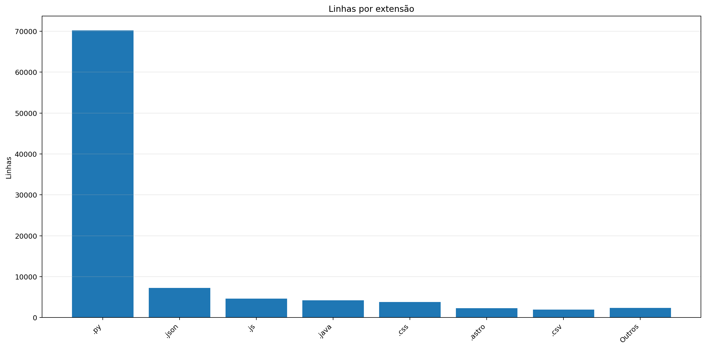

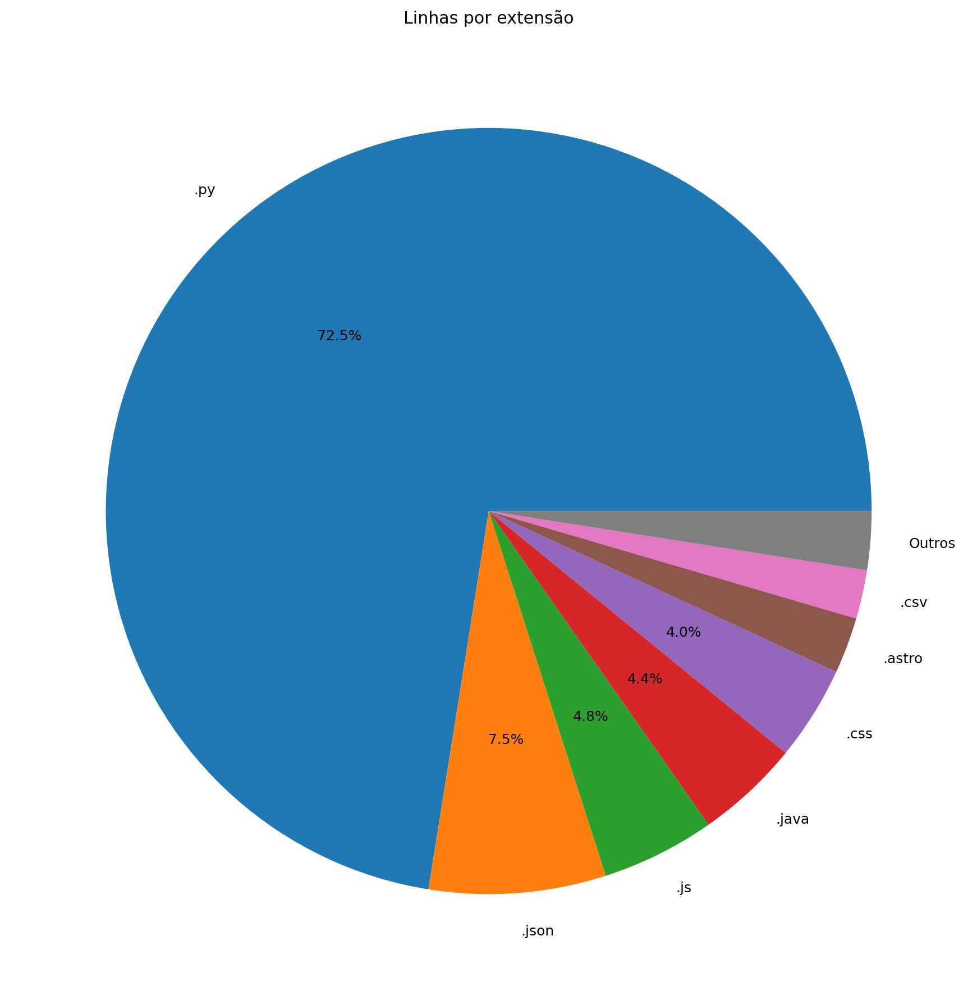

| Ext | Linhas | % das linhas | Arquivos | Peso |
|---:|---:|---:|---:|---:|
| `.py` | 67.626 | 72.54% | 240 | 2.91 MB |
| `.json` | 7.225 | 7.75% | 54 | 178.61 KB |
| `.js` | 4.639 | 4.98% | 23 | 185.49 KB |
| `.java` | 4.254 | 4.56% | 8 | 161.53 KB |
| `.css` | 3.851 | 4.13% | 14 | 90.88 KB |
| `.astro` | 2.297 | 2.46% | 30 | 103.70 KB |
| `.csv` | 1.985 | 2.13% | 10 | 246.83 KB |
| `.toml` | 1.194 | 1.28% | 15 | 25.25 KB |
| `.md` | 157 | 0.17% | 1 | 7.07 KB |

## 7. Peso por extensão

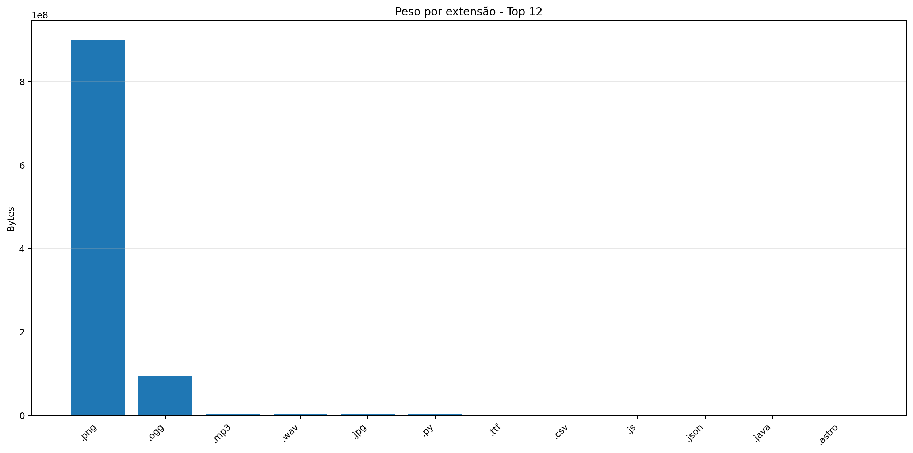

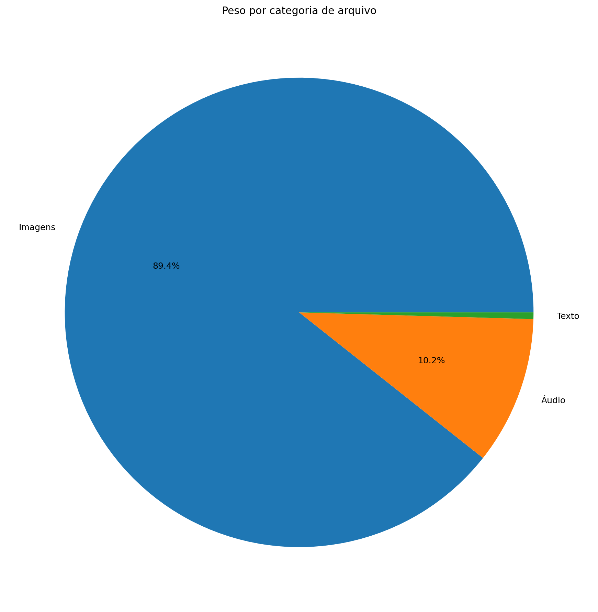

| Ext | Arquivos | Peso | % do jogo |
|---:|---:|---:|---:|
| `.png` | 73.542 | 859.05 MB | 88.98% |
| `.ogg` | 35 | 90.64 MB | 9.39% |
| `.mp3` | 6 | 3.97 MB | 0.41% |
| `.wav` | 9 | 3.81 MB | 0.39% |
| `.jpg` | 23 | 3.61 MB | 0.37% |
| `.py` | 240 | 2.91 MB | 0.30% |
| `.ttf` | 3 | 320.02 KB | 0.03% |
| `.csv` | 10 | 246.83 KB | 0.03% |
| `.js` | 23 | 185.49 KB | 0.02% |
| `.json` | 54 | 178.61 KB | 0.02% |
| `.java` | 8 | 161.53 KB | 0.02% |
| `.class` | 33 | 135.55 KB | 0.01% |
| `.astro` | 30 | 103.70 KB | 0.01% |
| `.css` | 14 | 90.88 KB | 0.01% |
| `.glsl` | 25 | 46.73 KB | 0.00% |
| `.toml` | 15 | 25.25 KB | 0.00% |
| `.frag` | 2 | 18.39 KB | 0.00% |
| `.md` | 1 | 7.07 KB | 0.00% |
| `.yml` | 1 | 605 bytes | 0.00% |
| `.mjs` | 1 | 562 bytes | 0.00% |
| `.vert` | 2 | 330 bytes | 0.00% |

## 8. Comparativo com o último relatório

| Métrica | Relatório anterior | Relatório atual | Diferença |
|---|---:|---:|---:|
| Arquivos | 74.043 | 74.078 | +35 |
| Linhas | 90.858 | 93.339 | +2.481 |
| Linhas .py | 65.529 | 67.626 | +2.097 |
| Métodos/funções | 3.848 | 3.950 | +102 |
| Classes | 212 | 221 | +9 |
| Commits | 566 | 574 | +8 |
| Tamanho | 944.79 MB | 965.48 MB | +20.69 MB |

### Top 3 commits por tamanho de diff

| Rank | Commit | Mensagem | Arquivos | Adições | Reduções | Diff total |
|---:|---|---|---:|---:|---:|---:|
| 1 | `50e845735b24` | relatorio | 16 | 6.111 | 167 | 6.278 |
| 2 | `b74cacadb0d7` | MELHORIA SITE | 129 | 2.717 | 2.366 | 5.083 |
| 3 | `55902194f0a5` | Merge branch 'main' of https://github.com/Leonn190/Pokemon-Global-Server-Definitivo | 129 | 2.717 | 2.366 | 5.083 |

## 9. Gráficos de crescimento

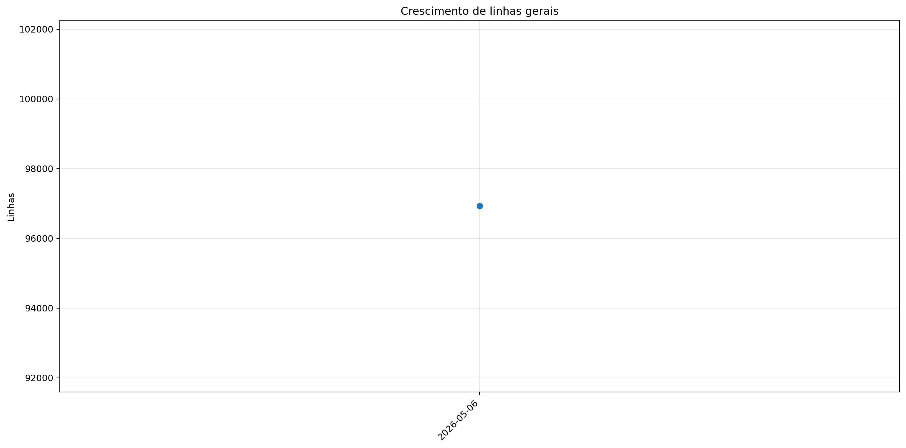

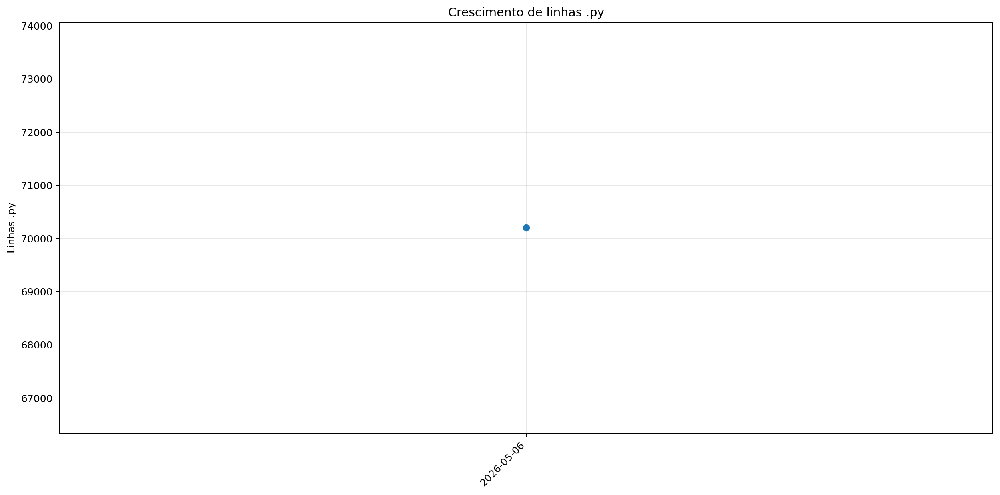

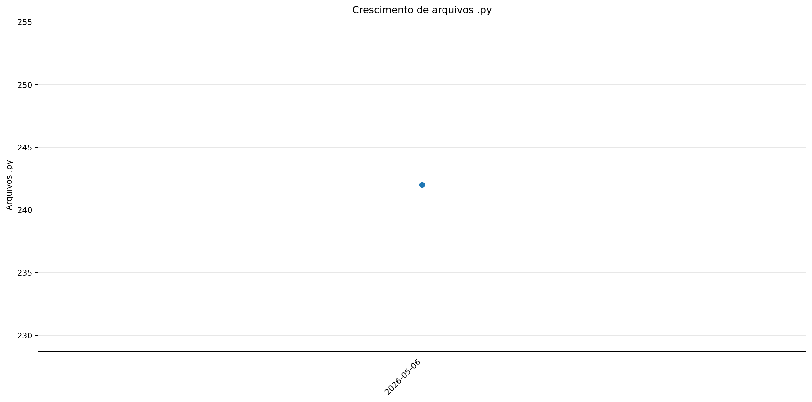

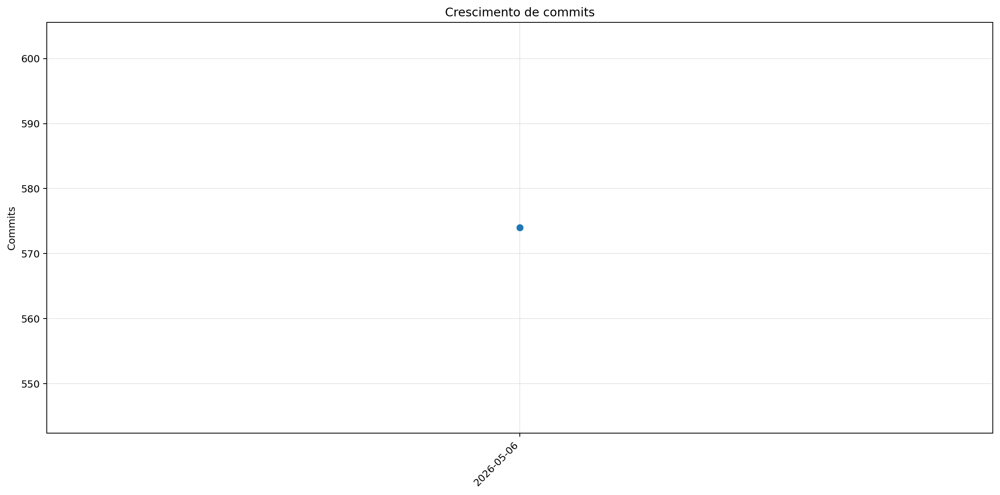

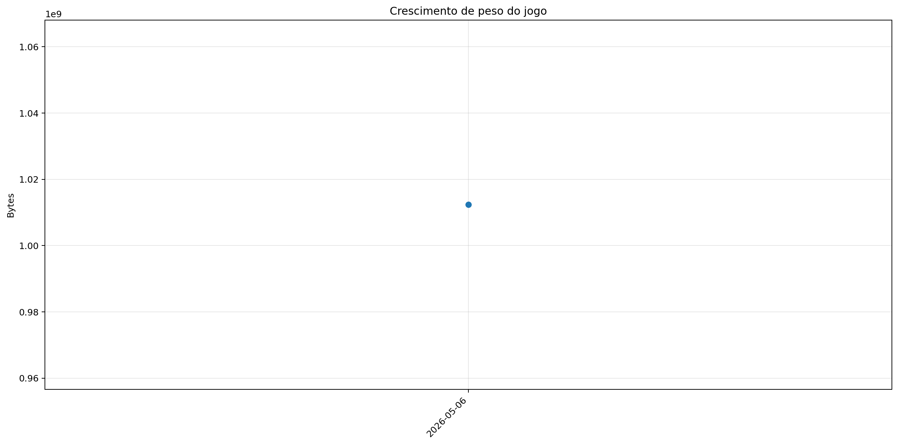
