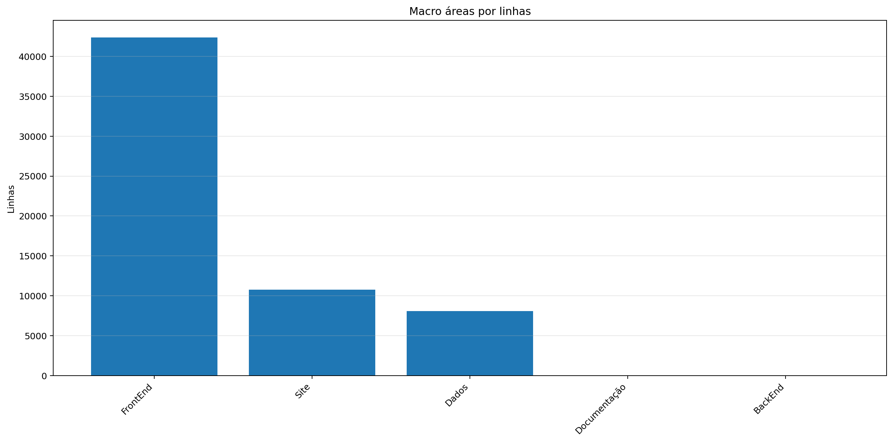
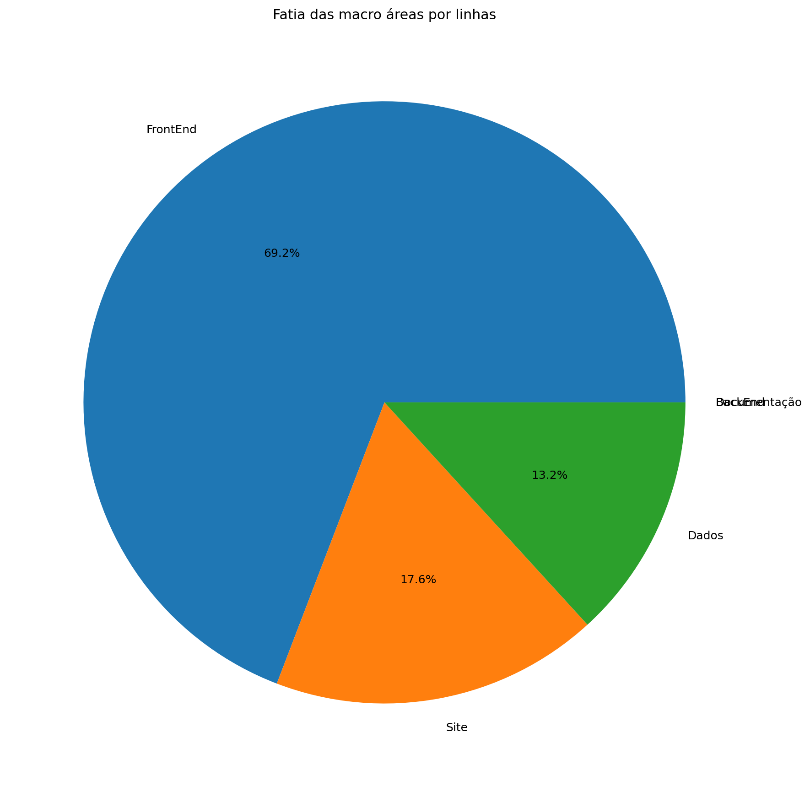
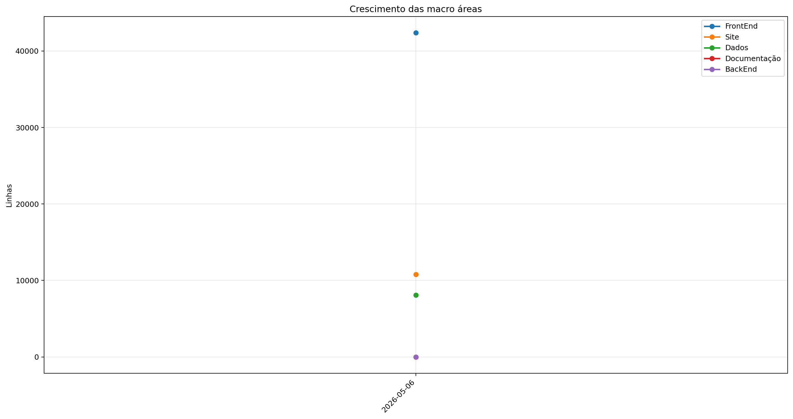
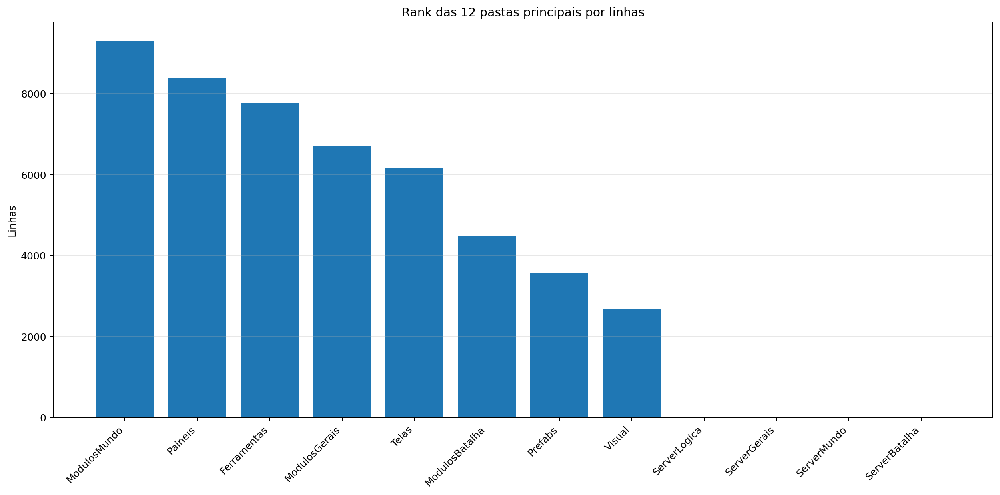
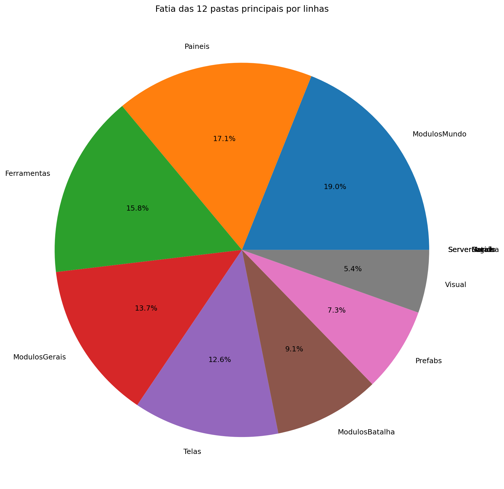
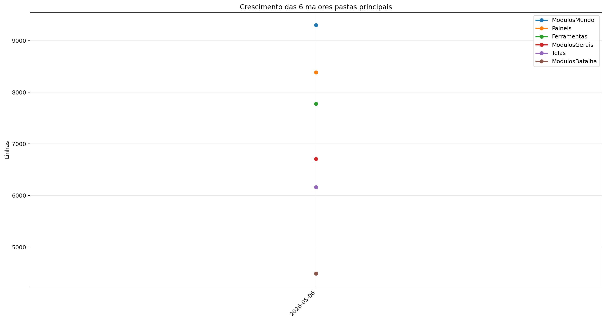
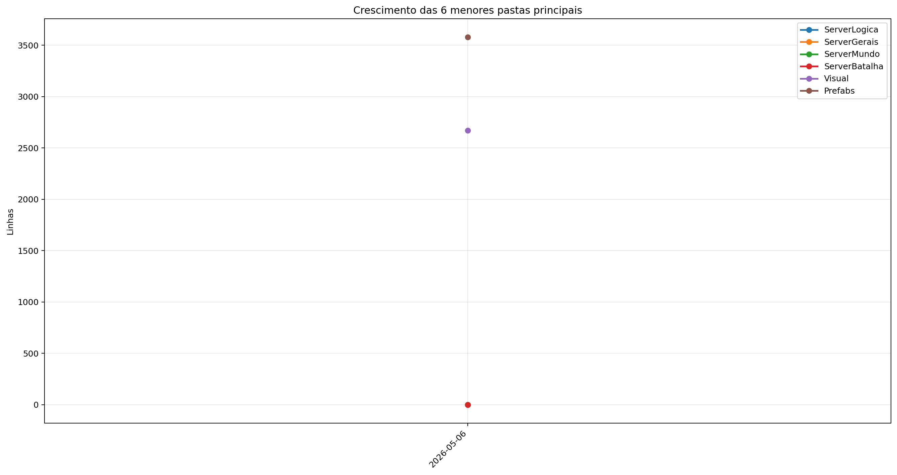
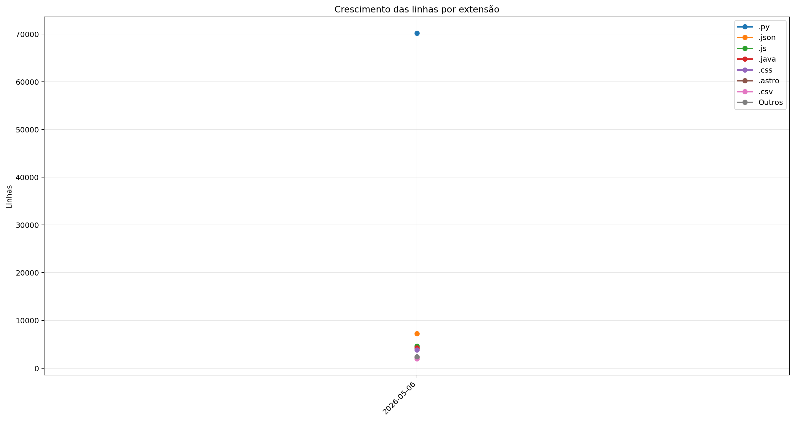
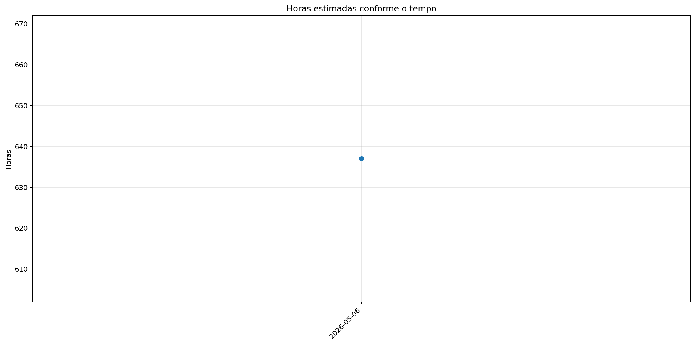

# Registro

**Relatório:** #1  
**Projeto:** `relatorio_rebuild_9tiw4e5i`  
**Gerado em:** 2026-05-15T11:25:01  
**Modelo de relatório:** 11  
**Autor:** Leon Cunha Alvaro Lopez Soto

## 1. Visão geral

- **Pastas:** 1.299
- **Arquivos:** 74.047
- **Arquivos de texto:** 424
- **Peso dos arquivos de texto:** 4143.14 KB
- **Tamanho total:** 0.943 GB (1.012.360.197 bytes)
- **Dias desde a criação do projeto:** 65
- **Dias desde a criação oficial:** 339
- **Horas estimadas:** 541.00
- **Linhas totais gerais:** 96.927
- **Commits (projeto):** 574

## 2. Python

- **Arquivos `.py`:** 242
- **Linhas totais:** 70.204
- **Tamanho total `.py`:** 3087.96 KB
- **Classes encontradas:** 221
- **Funções encontradas:** 1.126
- **Métodos encontrados:** 2.940
- **Total funções + métodos:** 4.066
- **Bibliotecas diferentes usadas:** 47

## 3. Macro áreas







| Rank | Área | Caminho | Subpastas | Arquivos | Linhas gerais | Tamanho (KB) |
|---:|---|---|---:|---:|---:|---:|
| 1 | `FrontEnd` | `Codigo + Game.py` | 22 | 168 | 42.393 | 1867.13 |
| 2 | `Site` | `Site/src` | 5 | 67 | 10.787 | 383.59 |
| 3 | `Dados` | `Dados` | 6 | 61 | 8.100 | 406.12 |
| 4 | `Documentação` | `Documentação` | 0 | 0 | 0 | 0.00 |
| 5 | `BackEnd` | `Servidor + ServidorGeral` | 0 | 0 | 0 | 0.00 |

## 4. Principais pastas









| Rank | Pasta | Subpastas | Arquivos | Linhas gerais | Tamanho (KB) |
|---:|---|---:|---:|---:|---:|
| 1 | `ModulosMundo` | 1 | 35 | 9.302 | 432.24 |
| 2 | `Paineis` | 0 | 16 | 8.388 | 377.83 |
| 3 | `Ferramentas` | 0 | 13 | 7.776 | 285.67 |
| 4 | `ModulosGerais` | 1 | 31 | 6.708 | 280.96 |
| 5 | `Telas` | 2 | 20 | 6.163 | 245.48 |
| 6 | `ModulosBatalha` | 0 | 13 | 4.490 | 215.81 |
| 7 | `Prefabs` | 0 | 14 | 3.580 | 131.92 |
| 8 | `Visual` | 0 | 9 | 2.669 | 114.88 |
| 9 | `ServerLogica` | 0 | 0 | 0 | 0.00 |
| 10 | `ServerGerais` | 0 | 0 | 0 | 0.00 |
| 11 | `ServerMundo` | 0 | 0 | 0 | 0.00 |
| 12 | `ServerBatalha` | 0 | 0 | 0 | 0.00 |

## 5. Arquitetura

### `Codigo/`

```text
Codigo/
├── Cenas/
│   ├── CenaCarregamento.py
│   ├── CenaCombate.py
│   ├── CenaLogin.py
│   ├── CenaMenu.py
│   ├── CenaMundo.py
│   └── ControladorCenas.py
├── Geradores/
│   ├── Player/
│   │   ├── Controle.py
│   │   ├── Inventario.py
│   │   ├── Perfil.py
│   │   └── Player.py
│   ├── Armadilhas.py
│   ├── Ator.py
│   ├── Baus.py
│   ├── ConstrutorDungeon.py
│   ├── Doce.py
│   ├── Dungeon.py
│   ├── Estadio.py
│   ├── EstruturaNaturais.py
│   ├── ItemInventario.py
│   ├── ItemMundo.py
│   ├── PokemonInventario.py
│   ├── PokemonMundo.py
│   ├── portal.py
│   ├── Projetil.py
│   └── XpMundo.py
├── ModulosBatalha/
│   ├── Arena.py
│   ├── ClimaBatalha.py
│   ├── ControladorAnimacoes.py
│   ├── ControladorBatalha.py
│   ├── ElementosHudBatalha.py
│   ├── FinalizadorBatalha.py
│   ├── IndicadorAtaque.py
│   ├── InicializadorBatalha.py
│   ├── LeitorLogs.py
│   ├── MontadorJogadas.py
│   ├── PlayerBatalha.py
│   ├── PokemonBatalha.py
│   └── SeletorCapturaBatalha.py
├── ModulosGerais/
│   ├── Server/
│   │   ├── GerenciadorServerList.py
│   │   ├── Login.py
│   │   ├── ServerBatalha.py
│   │   ├── ServerLogin.py
│   │   ├── ServerMenu.py
│   │   ├── ServerMundo.py
│   │   └── ServerTerminal.py
│   ├── Auxiliares.py
│   ├── Camera.py
│   ├── Colisor.py
│   ├── CompositorModernGL.py
│   ├── DesenhaAtor.py
│   ├── DesenhoMapa.py
│   ├── Discord.py
│   ├── EfeitosTela.py
│   ├── FiltroCamera.py
│   ├── GerenciadorPokemons.py
│   ├── GerenciadorTiles.py
│   ├── ImagensMapa.py
│   ├── LoaderTabelas.py
│   ├── LogoMenu.py
│   ├── ModuladorRegras.py
│   ├── PipelineGrafica.py
│   ├── PropriedadesAtaques.py
│   └── Sonoridades.py
├── ModulosMundo/
│   ├── ControladorAtores.py
│   ├── ControladorCriaveis.py
│   ├── ControladorDungeons.py
│   ├── ControladorMundo.py
│   ├── ControladorObjetos.py
│   ├── ControladorPlayer.py
│   ├── ElementosHudMundo.py
│   ├── ExecutaveisPoção.py
│   ├── LeitorDialogo.py
│   ├── LeitorMundo.py
│   ├── Loja.py
│   ├── MecanicasTiles.py
│   ├── Minimapa.py
│   ├── ServicoCraft.py
│   ├── ServicoMapaMundo.py
│   └── SistemaPacotes.py
├── Outros/
│   └── Shaders/
│       ├── mundo.frag
│       └── mundo.vert
├── Paineis/
│   ├── Container.py
│   ├── FichaAtaque.py
│   ├── FichaItem.py
│   ├── FichaPokemon.py
│   ├── FichaPokemonBatalha.py
│   ├── MiniPaineisConhecimentos.py
│   ├── PainelAcoes.py
│   ├── PainelArvoreHabilidades.py
│   ├── PainelAuxiliarPoke.py
│   ├── PainelConhecimento.py
│   ├── PainelCraft.py
│   ├── PainelEstatisticas.py
│   ├── PainelProgresso.py
│   ├── PainelReceitas.py
│   ├── PainelTimes.py
│   └── VisualizadorLog.py
├── Prefabs/
│   ├── Arrastavel.py
│   ├── Barra.py
│   ├── BarraPesquisa.py
│   ├── Botao.py
│   ├── CaixaTexto.py
│   ├── EfeitosVisuais.py
│   ├── Fluxos.py
│   ├── Mensagem.py
│   ├── Opcoes.py
│   ├── Painel.py
│   ├── Terminal.py
│   ├── Texto.py
│   ├── TextoCinematico.py
│   └── Tooltip.py
├── Shaders/
│   ├── comum/
│   │   ├── amostras.glsl
│   │   ├── constantes.glsl
│   │   ├── cores.glsl
│   │   ├── geometria.glsl
│   │   └── ruido.glsl
│   ├── efeitos/
│   │   ├── batalha/
│   │   │   ├── clima_batalha.glsl
│   │   │   └── estados_batalha.glsl
│   │   ├── hud/
│   │   │   ├── menu_logo.glsl
│   │   │   └── texto_cinematico.glsl
│   │   ├── mundo/
│   │   │   ├── biomas_mundo.glsl
│   │   │   ├── captura.glsl
│   │   │   ├── clima_mundo.glsl
│   │   │   ├── dungeon_ambiente.glsl
│   │   │   └── grade_global.glsl
│   │   ├── biomas_mundo.glsl
│   │   ├── captura.glsl
│   │   ├── clima_batalha.glsl
│   │   ├── clima_mundo.glsl
│   │   ├── grade_global.glsl
│   │   └── menu_logo.glsl
│   ├── uniformes/
│   │   ├── batalha.glsl
│   │   ├── globais.glsl
│   │   ├── hud.glsl
│   │   └── mundo.glsl
│   ├── compositor.frag
│   ├── compositor.vert
│   └── comum.glsl
├── Telas/
│   ├── Subtelas/
│   │   ├── Subtela.py
│   │   ├── SubtelaCriarPersonagem.py
│   │   ├── SubtelaDialogo.py
│   │   ├── SubtelaFinalizacao.py
│   │   ├── SubtelaInventario.py
│   │   ├── SubtelaInventarioEstatisticas.py
│   │   ├── SubtelaInventarioItens.py
│   │   ├── SubtelaInventarioPokemons.py
│   │   ├── SubtelaOpcoes.py
│   │   └── SubtelaPreBatalha.py
│   └── Telas/
│       ├── TelaConfig.py
│       ├── TelaConfigAvancada.py
│       ├── TelaConta.py
│       ├── TelaLogin.py
│       ├── TelaMapa.py
│       ├── TelaMenu.py
│       ├── TelaMorrer.py
│       ├── TelaOperador.py
│       ├── TelaServers.py
│       └── TelasGenericas.py
└── Visual/
    ├── ArenaAnimator.py
    ├── AtorEstado.py
    ├── AuxiliaresVisuais.py
    ├── ContatoIrregularAnimator.py
    ├── PokemonBatalhaAnimator.py
    ├── PokemonBatalhaEstado.py
    ├── PokemonMundoAnimator.py
    ├── PokemonMundoEstado.py
    └── ProjetilBatalha.py
```

### `Server/`

```text
Servidor/
└── (pasta não encontrada)
```

### `Dados/`

```text
Dados/
├── Catalogo/
│   ├── Dungeon.json
│   ├── Musicas.json
│   ├── Pokemon Global Server - Baus.json
│   ├── Pokemon Global Server - Receitas.json
│   └── Sons.json
├── InteracoesNPC/
│   ├── Combatentes/
│   │   ├── Alleka.json
│   │   ├── Amable.json
│   │   ├── Caio.json
│   │   ├── Felipox.json
│   │   ├── Felps.json
│   │   ├── Ferraz.json
│   │   ├── Garcia.json
│   │   ├── Guedes.json
│   │   ├── Henrique.json
│   │   ├── João.json
│   │   ├── Lisciele.json
│   │   ├── Murilo.json
│   │   ├── Nathzinha.json
│   │   ├── Paulo.json
│   │   ├── Ph.json
│   │   ├── Ramos.json
│   │   ├── Sidney.json
│   │   ├── Suneiva.json
│   │   ├── Suriane.json
│   │   └── Vasques.json
│   ├── Vendedores/
│   │   └── Josefa.json
│   ├── ExemploCapitao_Laura.json
│   ├── ExemploDesafiante_Ravi.json
│   ├── ExemploDissociado_Nico.json
│   ├── ExemploLider_Alleka.json
│   └── ManualDialogos.json
├── PropriedadesAtaques/
│   ├── PropriedadesAgua.json
│   ├── PropriedadesCosmico.json
│   ├── PropriedadesDragao.json
│   ├── PropriedadesEletrico.json
│   ├── PropriedadesFada.json
│   ├── PropriedadesFantasma.json
│   ├── PropriedadesFogo.json
│   ├── PropriedadesGelo.json
│   ├── PropriedadesInseto.json
│   ├── PropriedadesLutador.json
│   ├── PropriedadesMetal.json
│   ├── PropriedadesNormal.json
│   ├── PropriedadesPedra.json
│   ├── PropriedadesPlanta.json
│   ├── PropriedadesPsiquico.json
│   ├── PropriedadesSombrio.json
│   ├── PropriedadesSonoro.json
│   ├── PropriedadesTerra.json
│   ├── PropriedadesVeneno.json
│   └── PropriedadesVoador.json
└── Tabelas/
    ├── Pokemon Global Server - Ataques.csv
    ├── Pokemon Global Server - Dungeons.csv
    ├── Pokemon Global Server - Efeitos.csv
    ├── Pokemon Global Server - Equipaveis.csv
    ├── Pokemon Global Server - Itens.csv
    ├── Pokemon Global Server - NPC Combatente (1).csv
    ├── Pokemon Global Server - NPC Combatente.csv
    ├── Pokemon Global Server - NPC Vendedor.csv
    ├── Pokemon Global Server - Pokemons.csv
    └── Pokemon Global Server - Sistema FR.csv
```

### `Site/`

```text
Site/
├── public/
│   ├── Ataques/
│   ├── Atributos/
│   ├── Efeitos/
│   ├── Equipaveis/
│   ├── Ferramentas/
│   ├── Frutas/
│   ├── GlobalServer/
│   ├── Imagens/
│   ├── Insigneas/
│   ├── Medalhoes/
│   ├── Objetos/
│   ├── Pokebolas/
│   ├── Poções/
│   ├── Recursos/
│   ├── Skins/
│   └── Tipos/
├── src/
│   ├── Codigo/
│   │   ├── AssetsPublicos.js
│   │   ├── AtaquesRuntime.js
│   │   ├── AtaquesWikiDados.js
│   │   ├── CombateWikiDados.js
│   │   ├── DungeonsRuntime.js
│   │   ├── DungeonsWikiDados.js
│   │   ├── EfeitosRuntime.js
│   │   ├── EfeitosWikiDados.js
│   │   ├── EquipaveisRuntime.js
│   │   ├── EquipaveisWikiDados.js
│   │   ├── EstadiosRuntime.js
│   │   ├── ItemWikiDados.js
│   │   ├── ItensRuntime.js
│   │   ├── MundoRuntime.js
│   │   ├── MundoWikiDados.js
│   │   ├── NpcsRuntime.js
│   │   ├── NpcsWikiDados.js
│   │   ├── PokedexRuntime.js
│   │   ├── PokemonWikiDados.js
│   │   ├── RotasSite.js
│   │   ├── site.js
│   │   ├── WikiCsv.js
│   │   └── WikiRuntimeBase.js
│   ├── Componentes/
│   │   ├── Botao.astro
│   │   ├── CardCatalogo.astro
│   │   ├── CardWiki.astro
│   │   ├── Footer.astro
│   │   ├── Header.astro
│   │   ├── Layout.astro
│   │   ├── ModalDetalhe.astro
│   │   ├── ResumoWiki.astro
│   │   ├── TipoIcone.astro
│   │   ├── WikiGrid.astro
│   │   ├── WikiMenu.astro
│   │   ├── WikiToolbar.astro
│   │   └── WikiTopo.astro
│   ├── Estilos/
│   │   ├── auth.css
│   │   ├── global.css
│   │   ├── home.css
│   │   ├── wiki-ataques.css
│   │   ├── wiki-base.css
│   │   ├── wiki-cards.css
│   │   ├── wiki-combate.css
│   │   ├── wiki-dungeons.css
│   │   ├── wiki-equipaveis.css
│   │   ├── wiki-itens.css
│   │   ├── wiki-modal.css
│   │   ├── wiki-mundo.css
│   │   ├── wiki-pokedex.css
│   │   └── wiki.css
│   └── pages/
│       ├── wiki/
│       │   ├── ataques.astro
│       │   ├── comandos.astro
│       │   ├── combate.astro
│       │   ├── dungeons.astro
│       │   ├── efeitos.astro
│       │   ├── equipaveis.astro
│       │   ├── estadios.astro
│       │   ├── index.astro
│       │   ├── itens.astro
│       │   ├── mundo.astro
│       │   ├── npcs.astro
│       │   ├── pokemons.astro
│       │   └── receitas.astro
│       ├── conta.astro
│       ├── contato.astro
│       ├── download.astro
│       └── index.astro
├── astro.config.mjs
└── package.json
```

### `Ferramentas/`

```text
Ferramentas/
├── AtualizadorReadMe.py
└── GeradorRelatorios.py
```

## 6. Ranks

### Top 50 maiores arquivos `.py` por linhas

| Arquivo | Linhas | Tamanho (KB) |
|---|---:|---:|
| `Ferramentas/GeradorRelatorios.py` | 2.117 | 80.24 |
| `Outros/GeradorRelatorios.py` | 1.828 | 67.77 |
| `Codigo/Paineis/FichaPokemon.py` | 1.265 | 56.96 |
| `Codigo/ModulosMundo/ControladorObjetos.py` | 1.261 | 64.20 |
| `Codigo/Paineis/VisualizadorLog.py` | 1.101 | 64.15 |
| `Codigo/Telas/Subtelas/SubtelaInventarioPokemons.py` | 1.096 | 50.19 |
| `SimuladorServerJogo/Gerais/EstadoServidor.py` | 1.065 | 44.01 |
| `Codigo/Cenas/CenaMundo.py` | 1.000 | 58.87 |
| `SimuladorServerJogo/Gerais/Geradores/GeradorPokemon.py` | 922 | 38.32 |
| `Codigo/ModulosMundo/ControladorPlayer.py` | 908 | 44.88 |
| `SimuladorServerJogo/Gerais/Geradores/GeradorDungeons.py` | 880 | 40.11 |
| `SimuladorServerJogo/Mundo/Cerebros/CerebroDungeons.py` | 849 | 48.31 |
| `Codigo/Prefabs/Texto.py` | 819 | 31.41 |
| `SimuladorServerJogo/Mundo/BancoDados.py` | 803 | 40.04 |
| `Codigo/ModulosBatalha/MontadorJogadas.py` | 796 | 40.29 |
| `SimuladorServerJogo/Batalha/PokemonBatalha.py` | 794 | 43.29 |
| `SimuladorServerJogo/Batalha/Partida.py` | 770 | 37.99 |
| `SimuladorServerJogo/Gerais/Rotas/Atualizador.py` | 736 | 39.94 |
| `SimuladorServerJogo/Logica/Comandos/Comandos.py` | 729 | 30.92 |
| `SimuladorServerJogo/Mundo/Cerebros/CerebroNPCs.py` | 724 | 38.49 |
| `SimuladorServerJogo/Gerais/Geradores/GeradorMundo.py` | 689 | 27.82 |
| `Codigo/Geradores/PokemonMundo.py` | 688 | 33.21 |
| `Codigo/Visual/PokemonBatalhaAnimator.py` | 688 | 30.81 |
| `Codigo/ModulosBatalha/ControladorBatalha.py` | 677 | 32.62 |
| `Codigo/Paineis/FichaPokemonBatalha.py` | 677 | 33.43 |
| `Outros/AtualizadorRelatorios.py` | 651 | 23.61 |
| `Codigo/Paineis/Container.py` | 637 | 23.33 |
| `Codigo/ModulosGerais/Sonoridades.py` | 626 | 18.41 |
| `Codigo/Paineis/PainelConhecimento.py` | 617 | 25.33 |
| `Codigo/ModulosGerais/ImagensMapa.py` | 610 | 27.30 |
| `Codigo/Visual/PokemonBatalhaEstado.py` | 596 | 27.44 |
| `Codigo/Visual/ContatoIrregularAnimator.py` | 578 | 23.32 |
| `Codigo/Telas/Telas/TelaServers.py` | 570 | 18.46 |
| `SimuladorServerJogo/Gerais/Rotas/Ativador.py` | 552 | 27.44 |
| `Codigo/Paineis/PainelArvoreHabilidades.py` | 547 | 26.81 |
| `Codigo/Telas/Telas/TelasGenericas.py` | 547 | 19.11 |
| `Codigo/ModulosMundo/LeitorMundo.py` | 545 | 25.01 |
| `Outros/GameTestFPS.py` | 528 | 18.13 |
| `SimuladorServerJogo/Gerais/LoaderRegras.py` | 516 | 30.76 |
| `Outros/EditorSkins.py` | 514 | 19.97 |
| `Codigo/Telas/Subtelas/SubtelaInventarioItens.py` | 509 | 23.76 |
| `Codigo/Paineis/PainelProgresso.py` | 497 | 23.02 |
| `Codigo/ModulosMundo/LeitorDialogo.py` | 494 | 20.36 |
| `SimuladorServerJogo/Mundo/ObjetosMundoServer.py` | 494 | 32.08 |
| `Codigo/Prefabs/Botao.py` | 489 | 18.00 |
| `Codigo/ModulosBatalha/PokemonBatalha.py` | 488 | 23.09 |
| `SimuladorServerJogo/Mundo/Cerebros/CerebroCentral.py` | 482 | 24.75 |
| `SimuladorServerJogo/Batalha/BatalhaIA/AvaliadorIA.py` | 480 | 25.54 |
| `Codigo/ModulosGerais/FiltroCamera.py` | 478 | 21.53 |
| `Ferramentas/AtualizadorReadMe.py` | 461 | 16.37 |

### Top 20 maiores classes

| Arquivo | Classe | Linhas |
|---|---|---:|
| `Codigo/Paineis/FichaPokemon.py` | `FichaPokemon` | 1.242 |
| `Codigo/ModulosMundo/ControladorObjetos.py` | `ControladorObjetos` | 1.232 |
| `Codigo/Telas/Subtelas/SubtelaInventarioPokemons.py` | `InventarioPokemons` | 1.066 |
| `Codigo/Cenas/CenaMundo.py` | `CenaMundo` | 959 |
| `Codigo/Paineis/VisualizadorLog.py` | `VisualizadorLog` | 911 |
| `Codigo/ModulosMundo/ControladorPlayer.py` | `ControladorPlayer` | 889 |
| `SimuladorServerJogo/Mundo/Cerebros/CerebroDungeons.py` | `CerebroDungeons` | 820 |
| `SimuladorServerJogo/Mundo/BancoDados.py` | `BancoDadosMundo` | 773 |
| `Codigo/ModulosBatalha/MontadorJogadas.py` | `MontadorJogadas` | 754 |
| `SimuladorServerJogo/Batalha/PokemonBatalha.py` | `PokemonBatalha` | 748 |
| `SimuladorServerJogo/Batalha/Partida.py` | `Partida` | 739 |
| `SimuladorServerJogo/Mundo/Cerebros/CerebroNPCs.py` | `CerebroNPCs` | 704 |
| `Codigo/Geradores/PokemonMundo.py` | `Pokemon` | 663 |
| `Codigo/Paineis/FichaPokemonBatalha.py` | `FichaPokemonBatalha` | 657 |
| `Codigo/Visual/PokemonBatalhaAnimator.py` | `PokemonAnimator` | 656 |
| `Codigo/ModulosBatalha/ControladorBatalha.py` | `ControladorBatalha` | 654 |
| `Codigo/Paineis/Container.py` | `Container` | 628 |
| `Codigo/ModulosGerais/ImagensMapa.py` | `GerenciadorImagensMapa` | 563 |
| `Codigo/Visual/PokemonBatalhaEstado.py` | `PokemonBatalhaEstado` | 543 |
| `Codigo/ModulosMundo/LeitorMundo.py` | `LeitorMundo` | 526 |

### Top 20 maiores funções e métodos

| Arquivo | Nome | Tipo | Linhas |
|---|---|---:|---:|
| `SimuladorServerJogo/Gerais/Rotas/Atualizador.py` | `processar_atualizador_json` | funcao | 391 |
| `Codigo/Paineis/VisualizadorLog.py` | `VisualizadorLog._registro_evento` | metodo | 340 |
| `Ferramentas/GeradorRelatorios.py` | `coletar_metricas` | funcao | 252 |
| `Codigo/Prefabs/Fluxos.py` | `Fluxo.desenhar` | metodo | 249 |
| `Outros/GeradorRelatorios.py` | `coletar_metricas` | funcao | 247 |
| `Codigo/Geradores/Estadio.py` | `EstadioInterno.renderizar` | metodo | 196 |
| `SimuladorServerJogo/Gerais/Geradores/GeradorDungeons.py` | `gerar_dungeon_layout` | funcao | 182 |
| `Codigo/Cenas/CenaMundo.py` | `CenaMundo.atualizar_cena` | metodo | 167 |
| `Codigo/Telas/Telas/TelaMapa.py` | `TelaMapa.desenhar` | metodo | 164 |
| `Ferramentas/GeradorRelatorios.py` | `gerar_markdown` | funcao | 151 |
| `Codigo/Telas/Subtelas/SubtelaInventarioPokemons.py` | `InventarioPokemons.atualizar` | metodo | 148 |
| `Codigo/ModulosGerais/Colisor.py` | `Colisor.resolver_movimento_com_colisores` | metodo | 146 |
| `Ferramentas/GeradorRelatorios.py` | `gerar_graficos` | funcao | 146 |
| `SimuladorServerJogo/Gerais/Geradores/GeradorMundo.py` | `_executar_world_generator` | funcao | 144 |
| `Outros/AtualizadorRelatorios.py` | `main` | funcao | 140 |
| `Outros/GeradorRelatorios.py` | `gerar_markdown` | funcao | 139 |
| `SimuladorServerJogo/Gerais/Rotas/Ativador.py` | `processar_ativador_json` | funcao | 139 |
| `Codigo/ModulosBatalha/ControladorAnimacoes.py` | `ControladorAnimacoes.criar_animacao_de_evento` | metodo | 134 |
| `Ferramentas/GeradorRelatorios.py` | `analisar_python_ast` | funcao | 132 |
| `Outros/GeradorRelatorios.py` | `analisar_python_ast` | funcao | 132 |

### Top 10 arquivos mais importados

| Arquivo | Vezes importado |
|---|---:|
| `Codigo/Prefabs/Texto.py` | 46 |
| `Codigo/Prefabs/Botao.py` | 33 |
| `SimuladorServerJogo/Logica/Executes/ExecutesAtaques/UtilitariosExecutes.py` | 21 |
| `Codigo/Geradores/ItemInventario.py` | 18 |
| `SimuladorServerJogo/Gerais/EstadoServidor.py` | 18 |
| `Codigo/ModulosGerais/Sonoridades.py` | 17 |
| `SimuladorServerJogo/Mundo/BancoDados.py` | 17 |
| `Codigo/ModulosGerais/Auxiliares.py` | 14 |
| `SimuladorServerJogo/Gerais/Geradores/GeradorPokemon.py` | 12 |
| `SimuladorServerJogo/Gerais/Rotas/Ativador.py` | 12 |

### Top 10 arquivos que mais importam

| Arquivo | Arquivos internos importados | Imports totais | Linhas |
|---|---:|---:|---:|
| `Codigo/Cenas/CenaMundo.py` | 24 | 29 | 1.000 |
| `SimuladorServerJogo/Logica/Executes/ExecutesAtaques/ControladorExecutes.py` | 22 | 23 | 264 |
| `SimuladorServerJogo/Mundo/Cerebros/CerebroCentral.py` | 17 | 26 | 482 |
| `Codigo/Telas/Subtelas/SubtelaInventarioPokemons.py` | 17 | 22 | 1.096 |
| `Codigo/ModulosBatalha/ControladorBatalha.py` | 13 | 18 | 677 |
| `SimuladorServerJogo/Gerais/Rotas/Atualizador.py` | 12 | 17 | 736 |
| `SimuladorServerJogo/Batalha/BatalhaIA/ControladorIA.py` | 12 | 16 | 166 |
| `SimuladorServerJogo/Batalha/Partida.py` | 11 | 17 | 770 |
| `Codigo/Cenas/ControladorCenas.py` | 11 | 16 | 304 |
| `Codigo/ModulosMundo/ControladorObjetos.py` | 10 | 17 | 1.261 |

### Top 10 maiores arquivos por linhas

| Arquivo | Ext | Linhas |
|---|---:|---:|
| `Ferramentas/GeradorRelatorios.py` | `.py` | 2.117 |
| `Outros/GeradorRelatorios.py` | `.py` | 1.828 |
| `Dados/Tabelas/Pokemon Global Server - Pokemons.csv` | `.csv` | 1.309 |
| `Codigo/Paineis/FichaPokemon.py` | `.py` | 1.265 |
| `Codigo/ModulosMundo/ControladorObjetos.py` | `.py` | 1.261 |
| `Codigo/Paineis/VisualizadorLog.py` | `.py` | 1.101 |
| `Codigo/Telas/Subtelas/SubtelaInventarioPokemons.py` | `.py` | 1.096 |
| `SimuladorServerJogo/Gerais/EstadoServidor.py` | `.py` | 1.065 |
| `Site/src/Estilos/wiki-pokedex.css` | `.css` | 1.050 |
| `Codigo/Cenas/CenaMundo.py` | `.py` | 1.000 |

## 7. Linhas por extensão




| Ext | Linhas | % das linhas | Arquivos | Peso |
|---:|---:|---:|---:|---:|
| `.py` | 70.204 | 72.48% | 242 | 3.02 MB |
| `.json` | 7.225 | 7.46% | 54 | 182.44 KB |
| `.js` | 4.639 | 4.79% | 23 | 187.89 KB |
| `.java` | 4.254 | 4.39% | 8 | 161.53 KB |
| `.css` | 3.851 | 3.98% | 14 | 90.88 KB |
| `.astro` | 2.297 | 2.37% | 30 | 104.82 KB |
| `.csv` | 1.985 | 2.05% | 10 | 246.83 KB |
| `.toml` | 1.194 | 1.23% | 15 | 25.32 KB |
| `.glsl` | 1.010 | 1.04% | 25 | 46.76 KB |
| `.md` | 157 | 0.16% | 1 | 7.07 KB |
| `.yml` | 39 | 0.04% | 1 | 644 bytes |

## 8. Peso por extensão


| Ext | Arquivos | Peso | % do jogo |
|---:|---:|---:|---:|
| `.png` | 73.542 | 859.05 MB | 88.98% |
| `.ogg` | 35 | 90.64 MB | 9.39% |
| `.mp3` | 6 | 3.97 MB | 0.41% |
| `.wav` | 9 | 3.81 MB | 0.39% |
| `.jpg` | 23 | 3.61 MB | 0.37% |
| `.py` | 242 | 3.02 MB | 0.31% |
| `.ttf` | 3 | 320.02 KB | 0.03% |
| `.csv` | 10 | 246.83 KB | 0.03% |
| `.js` | 23 | 187.89 KB | 0.02% |
| `.json` | 54 | 182.44 KB | 0.02% |
| `.java` | 8 | 161.53 KB | 0.02% |
| `.astro` | 30 | 104.82 KB | 0.01% |
| `.css` | 14 | 90.88 KB | 0.01% |
| `.glsl` | 25 | 46.76 KB | 0.00% |
| `.toml` | 15 | 25.32 KB | 0.00% |
| `.frag` | 2 | 18.40 KB | 0.00% |
| `.md` | 1 | 7.07 KB | 0.00% |
| `.yml` | 1 | 644 bytes | 0.00% |
| `.mjs` | 1 | 585 bytes | 0.00% |
| `.vert` | 2 | 340 bytes | 0.00% |

## 9. Comparativo com o último relatório

_Sem relatório anterior compatível para montar comparativo._

### Top 3 commits por tamanho de diff

_Sem commits suficientes entre os relatórios para montar top por diff._

## 10. Gráficos de crescimento



