# Registro

**Relatório:** #63  
**Projeto:** `Pokemon-Global-Server-Definitivo`  
**Gerado em:** 2026-05-10T01:17:50  
**Modelo de relatório:** 10  
**Autor:** Leon Cunha Alvaro Lopez Soto

## 1. Visão geral

- **Pastas:** 1.300
- **Arquivos:** 74.382
- **Arquivos de texto:** 410
- **Peso dos arquivos de texto:** 4325.98 KB
- **Tamanho total:** 1.277 GB (1.371.004.123 bytes)
- **Dias desde a criação do projeto:** 69
- **Dias desde a criação oficial:** 343
- **Horas estimadas:** 581.00
- **Linhas totais gerais:** 103.612
- **Commits (projeto):** 626
- **Adições desde o último relatório:** <span style='color: green'>+10.902</span>
- **Reduções desde o último relatório:** <span style='color: red'>-587</span>

## 2. Python

- **Arquivos `.py`:** 241
- **Linhas totais:** 72.255
- **Tamanho total `.py`:** 3206.11 KB
- **Classes encontradas:** 223
- **Funções encontradas:** 1.086
- **Métodos encontrados:** 3.107
- **Total funções + métodos:** 4.193
- **Bibliotecas diferentes usadas:** 47

## 3. Principais pastas

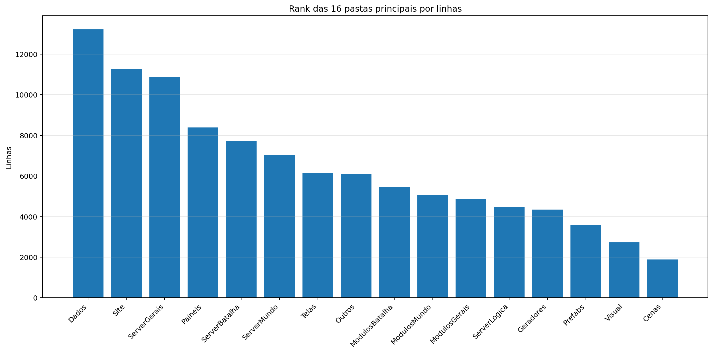

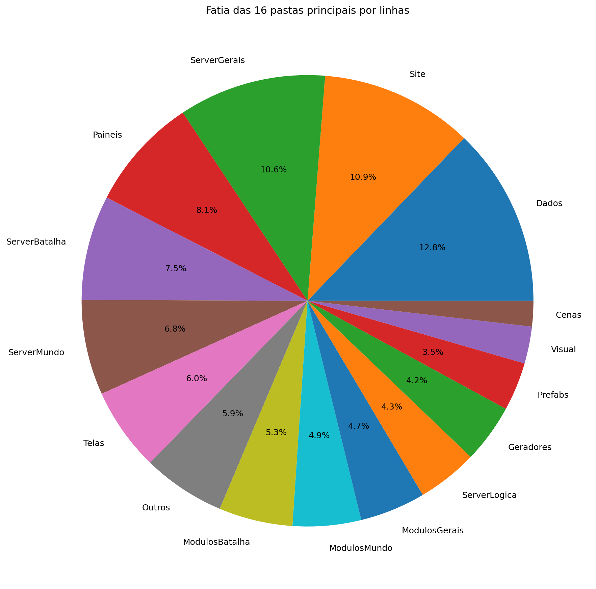

| Rank | Pasta | Subpastas | Arquivos | Linhas gerais | Tamanho (KB) |
|---:|---|---:|---:|---:|---:|
| 1 | `Dados` | 6 | 61 | 13.228 | 510.62 |
| 2 | `Site` | 24 | 1.637 | 11.286 | 30757.49 |
| 3 | `ServerGerais` | 4 | 57 | 10.888 | 609.69 |
| 4 | `Paineis` | 0 | 16 | 8.388 | 376.11 |
| 5 | `ServerBatalha` | 1 | 26 | 7.736 | 351.56 |
| 6 | `ServerMundo` | 2 | 26 | 7.040 | 371.18 |
| 7 | `Telas` | 2 | 20 | 6.163 | 245.11 |
| 8 | `Outros` | 0 | 10 | 6.106 | 228.73 |
| 9 | `ModulosBatalha` | 0 | 13 | 5.455 | 263.59 |
| 10 | `ModulosMundo` | 0 | 16 | 5.045 | 238.57 |
| 11 | `ModulosGerais` | 1 | 25 | 4.846 | 185.66 |
| 12 | `ServerLogica` | 4 | 42 | 4.459 | 138.58 |
| 13 | `Geradores` | 1 | 19 | 4.345 | 197.86 |
| 14 | `Prefabs` | 0 | 14 | 3.580 | 131.89 |
| 15 | `Visual` | 0 | 9 | 2.732 | 120.24 |
| 16 | `Cenas` | 0 | 6 | 1.886 | 94.66 |

## 4. Arquitetura

### `Codigo/`

```text
Codigo/
├── Cenas/
│   ├── CenaCarregamento.py
│   ├── CenaCombate.py
│   ├── CenaLogin.py
│   ├── CenaMenu.py
│   ├── CenaMundo.py
│   └── ControladorCenas.py
├── Geradores/
│   ├── Player/
│   │   ├── Controle.py
│   │   ├── Inventario.py
│   │   ├── Perfil.py
│   │   └── Player.py
│   ├── Armadilhas.py
│   ├── Ator.py
│   ├── Baus.py
│   ├── ConstrutorDungeon.py
│   ├── Doce.py
│   ├── Dungeon.py
│   ├── Estadio.py
│   ├── EstruturaNaturais.py
│   ├── ItemInventario.py
│   ├── ItemMundo.py
│   ├── PokemonInventario.py
│   ├── PokemonMundo.py
│   ├── portal.py
│   ├── Projetil.py
│   └── XpMundo.py
├── ModulosBatalha/
│   ├── Arena.py
│   ├── ClimaBatalha.py
│   ├── ControladorAnimacoes.py
│   ├── ControladorBatalha.py
│   ├── ElementosHudBatalha.py
│   ├── FinalizadorBatalha.py
│   ├── IndicadorAtaque.py
│   ├── InicializadorBatalha.py
│   ├── LeitorLogs.py
│   ├── MontadorJogadas.py
│   ├── PlayerBatalha.py
│   ├── PokemonBatalha.py
│   └── SeletorCapturaBatalha.py
├── ModulosGerais/
│   ├── Server/
│   │   ├── GerenciadorServerList.py
│   │   ├── Login.py
│   │   ├── ServerBatalha.py
│   │   ├── ServerLogin.py
│   │   ├── ServerMenu.py
│   │   ├── ServerMundo.py
│   │   └── ServerTerminal.py
│   ├── Auxiliares.py
│   ├── Camera.py
│   ├── Colisor.py
│   ├── CompositorModernGL.py
│   ├── DesenhaAtor.py
│   ├── DesenhoMapa.py
│   ├── Discord.py
│   ├── EfeitosTela.py
│   ├── FiltroCamera.py
│   ├── GerenciadorPokemons.py
│   ├── GerenciadorTiles.py
│   ├── ImagensMapa.py
│   ├── LoaderTabelas.py
│   ├── LogoMenu.py
│   ├── ModuladorRegras.py
│   ├── PipelineGrafica.py
│   ├── PropriedadesAtaques.py
│   └── Sonoridades.py
├── ModulosMundo/
│   ├── ControladorAtores.py
│   ├── ControladorCriaveis.py
│   ├── ControladorDungeons.py
│   ├── ControladorMundo.py
│   ├── ControladorObjetos.py
│   ├── ControladorPlayer.py
│   ├── ElementosHudMundo.py
│   ├── ExecutaveisPoção.py
│   ├── LeitorDialogo.py
│   ├── LeitorMundo.py
│   ├── Loja.py
│   ├── MecanicasTiles.py
│   ├── Minimapa.py
│   ├── ServicoCraft.py
│   ├── ServicoMapaMundo.py
│   └── SistemaPacotes.py
├── Outros/
│   ├── Shaders/
│   │   ├── mundo.frag
│   │   └── mundo.vert
│   └── TestesBatalha/
├── Paineis/
│   ├── Container.py
│   ├── FichaAtaque.py
│   ├── FichaItem.py
│   ├── FichaPokemon.py
│   ├── FichaPokemonBatalha.py
│   ├── MiniPaineisConhecimentos.py
│   ├── PainelAcoes.py
│   ├── PainelArvoreHabilidades.py
│   ├── PainelAuxiliarPoke.py
│   ├── PainelConhecimento.py
│   ├── PainelCraft.py
│   ├── PainelEstatisticas.py
│   ├── PainelProgresso.py
│   ├── PainelReceitas.py
│   ├── PainelTimes.py
│   └── VisualizadorLog.py
├── Prefabs/
│   ├── Arrastavel.py
│   ├── Barra.py
│   ├── BarraPesquisa.py
│   ├── Botao.py
│   ├── CaixaTexto.py
│   ├── EfeitosVisuais.py
│   ├── Fluxos.py
│   ├── Mensagem.py
│   ├── Opcoes.py
│   ├── Painel.py
│   ├── Terminal.py
│   ├── Texto.py
│   ├── TextoCinematico.py
│   └── Tooltip.py
├── Shaders/
│   ├── comum/
│   │   ├── amostras.glsl
│   │   ├── constantes.glsl
│   │   ├── cores.glsl
│   │   ├── geometria.glsl
│   │   └── ruido.glsl
│   ├── efeitos/
│   │   ├── batalha/
│   │   │   ├── clima_batalha.glsl
│   │   │   └── estados_batalha.glsl
│   │   ├── hud/
│   │   │   ├── menu_logo.glsl
│   │   │   └── texto_cinematico.glsl
│   │   ├── mundo/
│   │   │   ├── biomas_mundo.glsl
│   │   │   ├── captura.glsl
│   │   │   ├── clima_mundo.glsl
│   │   │   ├── dungeon_ambiente.glsl
│   │   │   └── grade_global.glsl
│   │   ├── biomas_mundo.glsl
│   │   ├── captura.glsl
│   │   ├── clima_batalha.glsl
│   │   ├── clima_mundo.glsl
│   │   ├── grade_global.glsl
│   │   └── menu_logo.glsl
│   ├── uniformes/
│   │   ├── batalha.glsl
│   │   ├── globais.glsl
│   │   ├── hud.glsl
│   │   └── mundo.glsl
│   ├── compositor.frag
│   ├── compositor.vert
│   └── comum.glsl
├── Telas/
│   ├── Subtelas/
│   │   ├── Subtela.py
│   │   ├── SubtelaCriarPersonagem.py
│   │   ├── SubtelaDialogo.py
│   │   ├── SubtelaFinalizacao.py
│   │   ├── SubtelaInventario.py
│   │   ├── SubtelaInventarioEstatisticas.py
│   │   ├── SubtelaInventarioItens.py
│   │   ├── SubtelaInventarioPokemons.py
│   │   ├── SubtelaOpcoes.py
│   │   └── SubtelaPreBatalha.py
│   └── Telas/
│       ├── TelaConfig.py
│       ├── TelaConfigAvancada.py
│       ├── TelaConta.py
│       ├── TelaLogin.py
│       ├── TelaMapa.py
│       ├── TelaMenu.py
│       ├── TelaMorrer.py
│       ├── TelaOperador.py
│       ├── TelaServers.py
│       └── TelasGenericas.py
└── Visual/
    ├── ArenaAnimator.py
    ├── AtorEstado.py
    ├── AuxiliaresVisuais.py
    ├── ContatoIrregularAnimator.py
    ├── PokemonBatalhaAnimator.py
    ├── PokemonBatalhaEstado.py
    ├── PokemonMundoAnimator.py
    ├── PokemonMundoEstado.py
    └── ProjetilBatalha.py
```

### `Server/`

```text
SimuladorServerJogo/
├── Batalha/
│   ├── BatalhaIA/
│   │   ├── AvaliadorIA.py
│   │   ├── ConfigIA.py
│   │   ├── ContextoIA.py
│   │   ├── ControladorIA.py
│   │   ├── ControladorIABoss.py
│   │   ├── FallbackIA.py
│   │   ├── GeradorAcoesIA.py
│   │   ├── HackerIA.py
│   │   ├── MacroSimulador.py
│   │   ├── MemoriaIA.py
│   │   ├── MetadadosAtaquesIA.json
│   │   ├── MetadadosIA.py
│   │   ├── MicroSimulador.py
│   │   └── PlanejadorIA.py
│   ├── Alvificacao.py
│   ├── ColetorAcoes.py
│   ├── Construto.py
│   ├── ConstrutorLog.py
│   ├── FraquezasResistencia.py
│   ├── GerenciadorPartidas.py
│   ├── IDsBatalha.py
│   ├── Partida.py
│   ├── PokemonBatalha.py
│   ├── PropriedadesAtaques.py
│   ├── ResolvedorFlags.py
│   └── RodadorTurno.py
├── Gerais/
│   ├── Geradores/
│   │   ├── Java/
│   │   │   ├── classes/
│   │   │   │   ├── BeachRules.class
│   │   │   │   ├── Biome.class
│   │   │   │   ├── BiomeDefinition.class
│   │   │   │   ├── BiomeRules.class
│   │   │   │   ├── ClimateSource.class
│   │   │   │   ├── GeneratorContext$1.class
│   │   │   │   ├── GeneratorContext.class
│   │   │   │   ├── GeradorBiomas$1.class
│   │   │   │   ├── GeradorBiomas.class
│   │   │   │   ├── GeradorDungeons$DungeonDef.class
│   │   │   │   ├── GeradorDungeons.class
│   │   │   │   ├── GeradorImagens$1.class
│   │   │   │   ├── GeradorImagens.class
│   │   │   │   ├── GeradorLocalidades.class
│   │   │   │   ├── GeradorObjetos.class
│   │   │   │   ├── GeradorRotas$RouteCandidate.class
│   │   │   │   ├── GeradorRotas$RouteNode.class
│   │   │   │   ├── GeradorRotas.class
│   │   │   │   ├── GeradorTerreno.class
│   │   │   │   ├── IceRules.class
│   │   │   │   ├── LocalityPoiConfig.class
│   │   │   │   ├── LocalityRules.class
│   │   │   │   ├── NaturalStructure.class
│   │   │   │   ├── NoiseLayerConfig.class
│   │   │   │   ├── Poi.class
│   │   │   │   ├── PoiConfig.class
│   │   │   │   ├── PoiType.class
│   │   │   │   ├── RegionData.class
│   │   │   │   ├── RouteData.class
│   │   │   │   ├── RouteRules.class
│   │   │   │   ├── SimpleToml.class
│   │   │   │   ├── TerrainRules.class
│   │   │   │   ├── Tile.class
│   │   │   │   ├── TomlTable.class
│   │   │   │   └── WorldGenerator.class
│   │   │   ├── GeradorBiomas.java
│   │   │   ├── GeradorDungeons.java
│   │   │   ├── GeradorImagens.java
│   │   │   ├── GeradorLocalidades.java
│   │   │   ├── GeradorObjetos.java
│   │   │   ├── GeradorRotas.java
│   │   │   ├── GeradorTerreno.java
│   │   │   └── WorldGenerator.java
│   │   ├── GeradorBaus.py
│   │   ├── GeradorDungeons.py
│   │   ├── GeradorMundo.py
│   │   └── GeradorPokemon.py
│   ├── Rotas/
│   │   ├── Ativador.py
│   │   ├── Atualizador.py
│   │   ├── Entrada.py
│   │   ├── RotasBatalha.py
│   │   ├── ServerOperar.py
│   │   └── Terminal.py
│   ├── ContextoServidor.py
│   ├── EstadoServidor.py
│   ├── LoaderRegras.py
│   └── LoaderTabelas.py
├── Logica/
│   ├── Comandos/
│   │   └── Comandos.py
│   ├── Executes/
│   │   ├── ExecutesAtaques/
│   │   │   ├── ControladorExecutes.py
│   │   │   ├── ExecutesAgua.py
│   │   │   ├── ExecutesCosmico.py
│   │   │   ├── ExecutesDragao.py
│   │   │   ├── ExecutesEletrico.py
│   │   │   ├── ExecutesFada.py
│   │   │   ├── ExecutesFantasma.py
│   │   │   ├── ExecutesFogo.py
│   │   │   ├── ExecutesGelo.py
│   │   │   ├── ExecutesInseto.py
│   │   │   ├── ExecutesLutador.py
│   │   │   ├── ExecutesMetal.py
│   │   │   ├── ExecutesNormal.py
│   │   │   ├── ExecutesPedra.py
│   │   │   ├── ExecutesPlanta.py
│   │   │   ├── ExecutesPsiquico.py
│   │   │   ├── ExecutesSombrio.py
│   │   │   ├── ExecutesSonoro.py
│   │   │   ├── ExecutesTerra.py
│   │   │   ├── ExecutesVeneno.py
│   │   │   ├── ExecutesVoador.py
│   │   │   └── UtilitariosExecutes.py
│   │   ├── ExecutesFrutas.py
│   │   ├── ExecutesPokebolas.py
│   │   └── PassivasEquipaveis.py
│   └── Regras/
│       ├── Batalha.toml
│       ├── Biomas.toml
│       ├── Camera.toml
│       ├── Ciclo.toml
│       ├── Dungeons.toml
│       ├── EstruturasNaturais.toml
│       ├── Geracao.json
│       ├── Localidades.toml
│       ├── Mundo.toml
│       ├── NPCs.toml
│       ├── Player.toml
│       ├── Pokemons.toml
│       ├── Projeteis.toml
│       ├── Server.toml
│       ├── Spawn.toml
│       └── Terreno.toml
└── Mundo/
    ├── Cerebros/
    │   ├── CerebroBaus.py
    │   ├── CerebroCentral.py
    │   ├── CerebroDungeons.py
    │   ├── CerebroEstadios.py
    │   ├── CerebroEstruturasNaturais.py
    │   ├── CerebroItensMundo.py
    │   ├── CerebroNPCs.py
    │   ├── CerebroPokemons.py
    │   ├── CerebroProjeteis.py
    │   ├── CerebroSpawnPokemons.py
    │   ├── CerebroTempo.py
    │   └── CerebroXpMundo.py
    ├── Dungeons/
    │   ├── __init__.py
    │   └── EstadoDungeon.py
    ├── AutoridadeCaptura.py
    ├── BancoDados.py
    ├── CerebroArmadilhas.py
    ├── Colisor.py
    ├── DungeonBatalha.py
    ├── DungeonGeometria.py
    ├── EstadioGeometria.py
    ├── InicializadorNPC.py
    ├── ObjetosMundoServer.py
    ├── PacotesTick.py
    ├── ServicoInventario.py
    └── TiqueServidor.py
```

### `Dados/`

```text
Dados/
├── Catalogo/
│   ├── Dungeon.json
│   ├── Musicas.json
│   ├── Pokemon Global Server - Baus.json
│   ├── Pokemon Global Server - Receitas.json
│   └── Sons.json
├── InteracoesNPC/
│   ├── Combatentes/
│   │   ├── Alleka.json
│   │   ├── Amable.json
│   │   ├── Caio.json
│   │   ├── Felipox.json
│   │   ├── Felps.json
│   │   ├── Ferraz.json
│   │   ├── Garcia.json
│   │   ├── Guedes.json
│   │   ├── Henrique.json
│   │   ├── João.json
│   │   ├── Lisciele.json
│   │   ├── Murilo.json
│   │   ├── Nathzinha.json
│   │   ├── Paulo.json
│   │   ├── Ph.json
│   │   ├── Ramos.json
│   │   ├── Sidney.json
│   │   ├── Suneiva.json
│   │   ├── Suriane.json
│   │   └── Vasques.json
│   ├── Vendedores/
│   │   └── Josefa.json
│   ├── ExemploCapitao_Laura.json
│   ├── ExemploDesafiante_Ravi.json
│   ├── ExemploDissociado_Nico.json
│   ├── ExemploLider_Alleka.json
│   └── ManualDialogos.json
├── PropriedadesAtaques/
│   ├── PropriedadesAgua.json
│   ├── PropriedadesCosmico.json
│   ├── PropriedadesDragao.json
│   ├── PropriedadesEletrico.json
│   ├── PropriedadesFada.json
│   ├── PropriedadesFantasma.json
│   ├── PropriedadesFogo.json
│   ├── PropriedadesGelo.json
│   ├── PropriedadesInseto.json
│   ├── PropriedadesLutador.json
│   ├── PropriedadesMetal.json
│   ├── PropriedadesNormal.json
│   ├── PropriedadesPedra.json
│   ├── PropriedadesPlanta.json
│   ├── PropriedadesPsiquico.json
│   ├── PropriedadesSombrio.json
│   ├── PropriedadesSonoro.json
│   ├── PropriedadesTerra.json
│   ├── PropriedadesVeneno.json
│   └── PropriedadesVoador.json
└── Tabelas/
    ├── Pokemon Global Server - Ataques.csv
    ├── Pokemon Global Server - Dungeons.csv
    ├── Pokemon Global Server - Efeitos.csv
    ├── Pokemon Global Server - Equipaveis.csv
    ├── Pokemon Global Server - Itens.csv
    ├── Pokemon Global Server - NPC Combatente.csv
    ├── Pokemon Global Server - NPC Vendedor.csv
    ├── Pokemon Global Server - Pokemons.csv
    ├── Pokemon Global Server - Sistema FR.csv
    └── Pokemon Global Server - Spawn.csv
```

### `Site/`

```text
Site/
├── img/
├── public/
│   ├── Ataques/
│   │   ├── Absorção Total.webp
│   │   ├── Afiar.webp
│   │   ├── Aguas Magicas.webp
│   │   ├── Amplificar.webp
│   │   ├── Aquecer.webp
│   │   ├── Arranhar.webp
│   │   ├── Ataque Rapido.webp
│   │   ├── Barragem Energetica.webp
│   │   ├── Barragem Punho Guardião.webp
│   │   ├── Biscoito.webp
│   │   ├── Bola Climatica.webp
│   │   ├── Bola de Agua.webp
│   │   ├── Bola de Fogo.webp
│   │   ├── Bola Eletrica.webp
│   │   ├── Bola Sombria.webp
│   │   ├── Bolhas.webp
│   │   ├── Cachoeira.webp
│   │   ├── Casco Vivo.webp
│   │   ├── Chicote de Vinha.webp
│   │   ├── Chifrada.webp
│   │   ├── Choque do Trovao.webp
│   │   ├── Choque Duplo.webp
│   │   ├── Chuva Curativa.webp
│   │   ├── Conrole do Oceano.webp
│   │   ├── Correnteza.webp
│   │   ├── Curto.webp
│   │   ├── Dança da chuva.webp
│   │   ├── Dança do Sol.webp
│   │   ├── Dança Eletrica.webp
│   │   ├── Descarga Total.webp
│   │   ├── Diluviu.webp
│   │   ├── Disparo.webp
│   │   ├── Drenagem Hidrica.webp
│   │   ├── Dreno.webp
│   │   ├── Eletrochoque.webp
│   │   ├── Energia.webp
│   │   ├── Energizar.webp
│   │   ├── Enraivecer.webp
│   │   ├── Erupção.webp
│   │   ├── Esfera Hidrocaotica.webp
│   │   ├── Esguicho Suave.webp
│   │   ├── Esmagar.webp
│   │   ├── Estocada.webp
│   │   ├── Estouro Solar.webp
│   │   ├── Explosão Ardente.webp
│   │   ├── ferver.webp
│   │   ├── Flutuante.webp
│   │   ├── Fluxo Infernal.webp
│   │   ├── Foguinho.webp
│   │   ├── Fonte Termal.webp
│   │   ├── Geiser.webp
│   │   ├── Golpe Abissal.webp
│   │   ├── Golpe de Concha.webp
│   │   ├── Golpe Precavido.webp
│   │   ├── Gota Pesada.webp
│   │   ├── Guilhotina.webp
│   │   ├── Hiper Presa.webp
│   │   ├── Hiper Raio.webp
│   │   ├── Incendiar.webp
│   │   ├── Inferno.webp
│   │   ├── Inflar.webp
│   │   ├── Investida Flamejante.webp
│   │   ├── Investida.webp
│   │   ├── Jato de Agua.webp
│   │   ├── Jato de Lava.webp
│   │   ├── Jato Duplo.webp
│   │   ├── Jato Triplo.webp
│   │   ├── Labareda.webp
│   │   ├── Lança de Agua.webp
│   │   ├── Laser de Fogo.webp
│   │   ├── Martelo Caranguejo.webp
│   │   ├── Mergulho.webp
│   │   ├── Mimica.webp
│   │   ├── Nadador.webp
│   │   ├── Normalizar.webp
│   │   ├── Ondas de Calor.webp
│   │   ├── Pele Aquatica.webp
│   │   ├── Proteger.webp
│   │   ├── Provocar.webp
│   │   ├── Queimadura Eterna.webp
│   │   ├── Queimar.webp
│   │   ├── Raio Cosmico.webp
│   │   ├── Raio de Fogo.webp
│   │   ├── Raio Psiquico.webp
│   │   ├── Raizes.webp
│   │   ├── Recarga.webp
│   │   ├── Redemoinho.webp
│   │   ├── Reservatorio.webp
│   │   ├── Resetar.webp
│   │   ├── Seiva Misteriosa.webp
│   │   ├── Sintese.webp
│   │   ├── Splash.webp
│   │   ├── Superaquecer.webp
│   │   ├── Surfar.webp
│   │   ├── Tankar.webp
│   │   ├── Torrente Vital.webp
│   │   ├── Transformar.webp
│   │   ├── Trevo da Sorte.webp
│   │   ├── Tsunami.webp
│   │   ├── Ultra Raio Aleatorio.webp
│   │   ├── Vampirismo Energetico.webp
│   │   └── Voador.webp
│   ├── Atributos/
│   │   ├── Acuracia.webp
│   │   ├── altura.png
│   │   ├── Amplificação.png
│   │   ├── Assertividade.webp
│   │   ├── Atk.png
│   │   ├── Barreira.png
│   │   ├── CrC.png
│   │   ├── CrD.png
│   │   ├── custo.webp
│   │   ├── Def.png
│   │   ├── Durabilidade.png
│   │   ├── Ene.png
│   │   ├── Escala.png
│   │   ├── Int.webp
│   │   ├── Mag.png
│   │   ├── Per.png
│   │   ├── Peso.webp
│   │   ├── SpA.png
│   │   ├── SpD.png
│   │   ├── Vamp.png
│   │   ├── Vel.png
│   │   └── Vida.png
│   ├── Efeitos/
│   │   ├── Abençoada.webp
│   │   ├── Abençoado.webp
│   │   ├── Amaldiçoada.webp
│   │   ├── Amaldiçoado.webp
│   │   ├── Amplificado.webp
│   │   ├── Atordoado.webp
│   │   ├── Bloqueado.webp
│   │   ├── Cauterizado.webp
│   │   ├── Chuva Acida.webp
│   │   ├── Chuva.webp
│   │   ├── Confuso.webp
│   │   ├── Congelado.webp
│   │   ├── Contaminada.webp
│   │   ├── Descarregado.webp
│   │   ├── Destruida.webp
│   │   ├── Dormindo.webp
│   │   ├── Elevada.webp
│   │   ├── Encantado.webp
│   │   ├── Encharcado.webp
│   │   ├── Energizada.webp
│   │   ├── Energizado.webp
│   │   ├── Enfraquecido.webp
│   │   ├── Enraizado.webp
│   │   ├── Envenenado.webp
│   │   ├── Evasivo.webp
│   │   ├── Flutuando.webp
│   │   ├── Focado.webp
│   │   ├── Fortificado.webp
│   │   ├── Furtivo.webp
│   │   ├── Gravidade Anomala.webp
│   │   ├── Imortal.webp
│   │   ├── Imparavel.webp
│   │   ├── Imune.webp
│   │   ├── Incendiada.webp
│   │   ├── Intoxicado.webp
│   │   ├── Nevasca.webp
│   │   ├── Nevoa.webp
│   │   ├── Noite Densa.webp
│   │   ├── Paralisado.webp
│   │   ├── Preparado.webp
│   │   ├── Provocando.webp
│   │   ├── Quebrado.webp
│   │   ├── Queimado.webp
│   │   ├── Refletindo.webp
│   │   ├── Regeneração.webp
│   │   ├── Sagrada.webp
│   │   ├── Sol Forte.webp
│   │   ├── Tempestade de Areia.webp
│   │   ├── Tempestade de Raios.webp
│   │   ├── Vampirico.webp
│   │   └── Voando.webp
│   ├── Equipaveis/
│   │   ├── Amuleto Sintilante.png
│   │   ├── Anjo Guardião.png
│   │   ├── Arco de Ossos.png
│   │   ├── Arco dos Ventos.png
│   │   ├── Armadura Natural.webp
│   │   ├── Armadura Reforçada.webp
│   │   ├── Bastião Inabalavel.png
│   │   ├── Besta Afiada.png
│   │   ├── Botas Colossais.png
│   │   ├── Botas do Sucesso.png
│   │   ├── Cajado do Som.png
│   │   ├── Capa Alheia.png
│   │   ├── Capa Assombrada.png
│   │   ├── Capa Solari.webp
│   │   ├── Cetro Espiritual.png
│   │   ├── Chapéu do Bruxo.png
│   │   ├── Cinto Gigante.png
│   │   ├── Colete de Espinhos.png
│   │   ├── Coração de Ferro.png
│   │   ├── Coração de Gelo.png
│   │   ├── Coroa da Vitória.png
│   │   ├── Coroa do Inverno Eterno.png
│   │   ├── Dente do Fim.png
│   │   ├── Elmo Abençoado.png
│   │   ├── Elmo Cósmico.png
│   │   ├── Elmo Psiônico.png
│   │   ├── Emblema da Chama.png
│   │   ├── Emblema das Sombras.png
│   │   ├── Espada Energizada.png
│   │   ├── Espada Envenenada.png
│   │   ├── Espada Mental.png
│   │   ├── Estaca Terrestre.png
│   │   ├── Estilingue das Folhas.png
│   │   ├── Eternidade.png
│   │   ├── Faca do Dragão.png
│   │   ├── Faixa da Escolha.png
│   │   ├── Fluxo Aquatico.png
│   │   ├── Gota Sagrada.png
│   │   ├── Lamina Fumegante.png
│   │   ├── Machadinha Ignea.png
│   │   ├── Machado Amaldiçoado.png
│   │   ├── Maldição.png
│   │   ├── Mascara de Mosquito Gigante.png
│   │   ├── Mosstomper_Seedling_item.png
│   │   ├── Mão que Tudo Ve.png
│   │   ├── Mão Sinistra.png
│   │   ├── Obreira da Escama Ardente.png
│   │   ├── Pedra Flutuante.png
│   │   ├── Placa Defensiva.png
│   │   ├── Punho Congelado.png
│   │   ├── Punho Robusto.png
│   │   ├── Quebra Barreira.png
│   │   ├── Semblante Congelado.webp
│   │   ├── Semblante das Aguas.png
│   │   ├── Serra Toxica.png
│   │   ├── Sino Dourado.png
│   │   ├── Sismitarra Marcada.png
│   │   ├── Tiara Encantada.png
│   │   ├── Trovao Encapsulado.png
│   │   └── Ídolo Perdido.png
│   ├── Ferramentas/
│   │   ├── Balde.webp
│   │   ├── Chave.webp
│   │   ├── Machado de Ametista.webp
│   │   ├── Machado de Diamante.webp
│   │   ├── Machado de Madeira.webp
│   │   ├── Machado de Ouro.webp
│   │   ├── Machado de Pedra.webp
│   │   ├── Machado de Rubi.webp
│   │   ├── Picareta de Ametista.webp
│   │   ├── Picareta de Diamante.webp
│   │   ├── Picareta de Madeira.png
│   │   ├── Picareta de Ouro.webp
│   │   ├── Picareta de Pedra.webp
│   │   └── Picareta de Rubi.webp
│   ├── Frutas/
│   │   ├── Abbajuur Berry.webp
│   │   ├── Caxi Berry.webp
│   │   ├── Desert Berry.webp
│   │   ├── Field Berry.webp
│   │   ├── Frambo Berry.webp
│   │   ├── Frozen Berry.webp
│   │   ├── Jujuca Berry.webp
│   │   ├── Jungle Berry.webp
│   │   ├── Lava Berry.webp
│   │   ├── Lum Berry.webp
│   │   ├── Magic Berry.webp
│   │   ├── Secret Berry.webp
│   │   ├── Simp Berry.webp
│   │   ├── Super Frambo Berry.webp
│   │   ├── Tomper Berry.webp
│   │   └── Water Berry.webp
│   ├── GlobalServer/
│   │   ├── Icone.png
│   │   ├── Logo.webp
│   │   └── QuadroLogo.webp
│   ├── Imagens/
│   │   ├── abomasnow.webp
│   │   ├── abra.png
│   │   ├── absol.webp
│   │   ├── accelgor.png
│   │   ├── aegislash blade.png
│   │   ├── aegislash shield.png
│   │   ├── aerodactyl.webp
│   │   ├── aggron.webp
│   │   ├── aipom.webp
│   │   ├── alakazam.webp
│   │   ├── alcremie.png
│   │   ├── alomomola.png
│   │   ├── altaria.webp
│   │   ├── amaura.png
│   │   ├── ambipom.webp
│   │   ├── amoonguss.webp
│   │   ├── ampharos.webp
│   │   ├── annihilape.webp
│   │   ├── anorith.png
│   │   ├── appletun.png
│   │   ├── applin.png
│   │   ├── araquanid.png
│   │   ├── arbok.webp
│   │   ├── arcanine.webp
│   │   ├── arceus.webp
│   │   ├── archen.png
│   │   ├── archeops.webp
│   │   ├── arctovish.webp
│   │   ├── arctozolt.webp
│   │   ├── ariados.png
│   │   ├── armaldo.webp
│   │   ├── aromatisse.png
│   │   ├── aron.png
│   │   ├── arrokuda.png
│   │   ├── articuno.webp
│   │   ├── audino.png
│   │   ├── aurorus.webp
│   │   ├── avalugg.png
│   │   ├── axew.png
│   │   ├── azelf.png
│   │   ├── azumarill.webp
│   │   ├── azurill.png
│   │   ├── bagon.png
│   │   ├── baltoy.png
│   │   ├── banette.webp
│   │   ├── barbaracle.png
│   │   ├── barboach.png
│   │   ├── barraskewda.png
│   │   ├── basculegion.webp
│   │   ├── basculin.png
│   │   ├── bastiodon.webp
│   │   ├── bayleef.png
│   │   ├── beartic.webp
│   │   ├── beautifly.webp
│   │   ├── beedrill.webp
│   │   ├── beheeyem.png
│   │   ├── beldum.png
│   │   ├── bellossom.png
│   │   ├── bellsprout.png
│   │   ├── bergmite.png
│   │   ├── bewear.png
│   │   ├── bibarel.png
│   │   ├── bidoof.png
│   │   ├── binacle.png
│   │   ├── bisharp.png
│   │   ├── blacephalon.png
│   │   ├── blastoise.webp
│   │   ├── blaziken.webp
│   │   ├── blipbug.webp
│   │   ├── blissey.webp
│   │   ├── blitzle.png
│   │   ├── boldore.png
│   │   ├── boltund.webp
│   │   ├── bonsly.png
│   │   ├── bouffalant.png
│   │   ├── bounsweet.png
│   │   ├── braixen.png
│   │   ├── braviary.png
│   │   ├── breloom.webp
│   │   ├── brionne.png
│   │   ├── bronzong.webp
│   │   ├── bronzor.png
│   │   ├── bruxish.png
│   │   ├── budew.png
│   │   ├── buizel.png
│   │   ├── bulbasaur.png
│   │   ├── buneary.png
│   │   ├── bunnelby.png
│   │   ├── burmy-plant.png
│   │   ├── butterfree.webp
│   │   ├── buzzwole.webp
│   │   ├── cacnea.png
│   │   ├── cacturne.webp
│   │   ├── camerupt.webp
│   │   ├── carbink.png
│   │   ├── carkol.png
│   │   ├── carnivine.png
│   │   ├── carracosta.webp
│   │   ├── carvanha.png
│   │   ├── cascoon.png
│   │   ├── castform.png
│   │   ├── caterpie.png
│   │   ├── celebi.png
│   │   ├── celesteela.webp
│   │   ├── centiskorch.webp
│   │   ├── chandelure.webp
│   │   ├── chansey.webp
│   │   ├── charizard.webp
│   │   ├── charjabug.png
│   │   ├── charmander.png
│   │   ├── charmeleon.png
│   │   ├── chatot.png
│   │   ├── cherrim-overcast.png
│   │   ├── cherubi.png
│   │   ├── chesnaught.webp
│   │   ├── chespin.png
│   │   ├── chewtle.png
│   │   ├── chikorita.png
│   │   ├── chimchar.png
│   │   ├── chimecho.png
│   │   ├── chinchou.png
│   │   ├── chingling.png
│   │   ├── cinccino.webp
│   │   ├── cinderace.webp
│   │   ├── clamperl.png
│   │   ├── clauncher.png
│   │   ├── clawitzer.png
│   │   ├── claydol.webp
│   │   ├── clefable.webp
│   │   ├── clefairy.png
│   │   ├── cleffa.png
│   │   ├── clobbopus.webp
│   │   ├── cloyster.webp
│   │   ├── coalossal.webp
│   │   ├── cobalion.webp
│   │   ├── cofagrigus.png
│   │   ├── combee.png
│   │   ├── combusken.webp
│   │   ├── comfey.png
│   │   ├── conkeldurr.webp
│   │   ├── copperajah.png
│   │   ├── corphish.png
│   │   ├── corsola.png
│   │   ├── corviknight.webp
│   │   ├── corvisquire.png
│   │   ├── cosmoem.webp
│   │   ├── cosmog.png
│   │   ├── cottonee.png
│   │   ├── crabominable.webp
│   │   ├── crabrawler.png
│   │   ├── cradily.webp
│   │   ├── cramorant.png
│   │   ├── cranidos.png
│   │   ├── crawdaunt.webp
│   │   ├── cresselia.webp
│   │   ├── croagunk.png
│   │   ├── crobat.webp
│   │   ├── croconaw.png
│   │   ├── crustle.png
│   │   ├── cryogonal.webp
│   │   ├── cubchoo.png
│   │   ├── cubone.png
│   │   ├── cufant.png
│   │   ├── cursola.webp
│   │   ├── cutiefly.png
│   │   ├── cyndaquil.png
│   │   ├── darkrai.webp
│   │   ├── darmanitan-standard.png
│   │   ├── dartrix.png
│   │   ├── darumaka.png
│   │   ├── decidueye.webp
│   │   ├── dedenne.png
│   │   ├── deerling-spring.png
│   │   ├── deino.png
│   │   ├── delcatty.webp
│   │   ├── delibird.png
│   │   ├── delphox.webp
│   │   ├── deoxys.webp
│   │   ├── dewgong.png
│   │   ├── dewott.png
│   │   ├── dewpider.png
│   │   ├── dhelmise.webp
│   │   ├── dialga.webp
│   │   ├── diancie.png
│   │   ├── diggersby.png
│   │   ├── diglett.png
│   │   ├── ditto.png
│   │   ├── dodrio.webp
│   │   ├── doduo.png
│   │   ├── donphan.webp
│   │   ├── dottler.webp
│   │   ├── doublade.png
│   │   ├── dracovish.webp
│   │   ├── dracozolt.webp
│   │   ├── dragalge.png
│   │   ├── dragapult.webp
│   │   ├── dragonair.png
│   │   ├── dragonite.webp
│   │   ├── drakloak.png
│   │   ├── drampa.webp
│   │   ├── drapion.webp
│   │   ├── dratini.png
│   │   ├── drednaw.webp
│   │   ├── dreepy.png
│   │   ├── drifblim.png
│   │   ├── drifloon.png
│   │   ├── drilbur.png
│   │   ├── drizzile.png
│   │   ├── drowzee.png
│   │   ├── druddigon.webp
│   │   ├── dubwool.webp
│   │   ├── ducklett.png
│   │   ├── dugtrio.png
│   │   ├── dunsparce.png
│   │   ├── duosion.png
│   │   ├── duraludon.png
│   │   ├── durant.png
│   │   ├── dusclops.webp
│   │   ├── dusknoir.webp
│   │   ├── duskull.png
│   │   ├── dustox.webp
│   │   ├── dwebble.png
│   │   ├── eelektrik.png
│   │   ├── eelektross.webp
│   │   ├── eevee.png
│   │   ├── eiscue-ice.png
│   │   ├── ekans.png
│   │   ├── eldegoss.png
│   │   ├── electabuzz.webp
│   │   ├── electivire.webp
│   │   ├── electrike.png
│   │   ├── electrode.png
│   │   ├── elekid.png
│   │   ├── elgyem.png
│   │   ├── emboar.webp
│   │   ├── emolga.png
│   │   ├── empoleon.webp
│   │   ├── entei.webp
│   │   ├── escavalier.png
│   │   ├── espeon.webp
│   │   ├── espurr.png
│   │   ├── eternatus.webp
│   │   ├── excadrill.png
│   │   ├── exeggcute.png
│   │   ├── exeggutor.webp
│   │   ├── exploud.webp
│   │   ├── falinks.png
│   │   ├── farfetchd.png
│   │   ├── fearow.webp
│   │   ├── feebas.png
│   │   ├── fennekin.png
│   │   ├── feraligatr.webp
│   │   ├── ferroseed.png
│   │   ├── ferrothorn.png
│   │   ├── finneon.png
│   │   ├── flaaffy.webp
│   │   ├── flabebe-red.png
│   │   ├── flapple.webp
│   │   ├── flareon.webp
│   │   ├── fletchinder.png
│   │   ├── fletchling.png
│   │   ├── floatzel.webp
│   │   ├── floette-red.png
│   │   ├── florges-red.webp
│   │   ├── flygon.webp
│   │   ├── fomantis.png
│   │   ├── foongus.png
│   │   ├── forretress.webp
│   │   ├── fraxure.png
│   │   ├── frillish.png
│   │   ├── froakie.png
│   │   ├── frogadier.png
│   │   ├── froslass.png
│   │   ├── frosmoth.png
│   │   ├── furfrou.webp
│   │   ├── furret.webp
│   │   ├── gabite.webp
│   │   ├── gallade.png
│   │   ├── galvantula.png
│   │   ├── garbodor.webp
│   │   ├── garchomp.webp
│   │   ├── gardevoir.webp
│   │   ├── gastly.png
│   │   ├── gastrodon-west.webp
│   │   ├── genesect.png
│   │   ├── gengar.webp
│   │   ├── geodude.png
│   │   ├── gible.png
│   │   ├── gigalith.webp
│   │   ├── gigantamax alcremie.webp
│   │   ├── gigantamax appletun.webp
│   │   ├── gigantamax blastoise.webp
│   │   ├── gigantamax butterfree.webp
│   │   ├── gigantamax centiskorch.webp
│   │   ├── gigantamax charizard.webp
│   │   ├── gigantamax cinderace.webp
│   │   ├── gigantamax coalossal.webp
│   │   ├── gigantamax copperajah.webp
│   │   ├── gigantamax corviknight.webp
│   │   ├── gigantamax drednaw.webp
│   │   ├── gigantamax duraludon.webp
│   │   ├── gigantamax eevee.webp
│   │   ├── gigantamax flapple.webp
│   │   ├── gigantamax garbodor.webp
│   │   ├── gigantamax gengar.webp
│   │   ├── gigantamax grimmsnarl.webp
│   │   ├── gigantamax hatterene.webp
│   │   ├── gigantamax inteleon.webp
│   │   ├── gigantamax kingler.webp
│   │   ├── gigantamax lapras.webp
│   │   ├── gigantamax machamp.webp
│   │   ├── gigantamax melmetal.webp
│   │   ├── gigantamax meowth.webp
│   │   ├── gigantamax orbeetle.webp
│   │   ├── gigantamax pikachu.webp
│   │   ├── gigantamax rillaboom.webp
│   │   ├── gigantamax sandaconda.webp
│   │   ├── gigantamax snorlax.webp
│   │   ├── gigantamax toxtricity.webp
│   │   ├── gigantamax urshifu rapid strike.webp
│   │   ├── gigantamax urshifu single strike.webp
│   │   ├── gigantamax venusaur.webp
│   │   ├── girafarig.png
│   │   ├── giratina.webp
│   │   ├── glaceon.webp
│   │   ├── glalie.webp
│   │   ├── glameow.png
│   │   ├── glastrier.webp
│   │   ├── gligar.webp
│   │   ├── gliscor.webp
│   │   ├── gloom.png
│   │   ├── gogoat.png
│   │   ├── golbat.webp
│   │   ├── goldeen.png
│   │   ├── golduck.webp
│   │   ├── golem.webp
│   │   ├── golett.png
│   │   ├── golisopod.webp
│   │   ├── golurk.webp
│   │   ├── goodra.webp
│   │   ├── goomy.png
│   │   ├── gorebyss.png
│   │   ├── gossifleur.png
│   │   ├── gothita.png
│   │   ├── gothitelle.webp
│   │   ├── gothorita.png
│   │   ├── gourgeist.png
│   │   ├── granbull.webp
│   │   ├── grapploct.webp
│   │   ├── graveler.webp
│   │   ├── greedent.webp
│   │   ├── greninja.webp
│   │   ├── grimer.png
│   │   ├── grimmsnarl.webp
│   │   ├── grookey.png
│   │   ├── grotle.webp
│   │   ├── groudon.webp
│   │   ├── grovyle.webp
│   │   ├── growlithe.png
│   │   ├── grubbin.png
│   │   ├── grumpig.webp
│   │   ├── gulpin.png
│   │   ├── gumshoos.png
│   │   ├── gurdurr.webp
│   │   ├── guzzlord.webp
│   │   ├── gyarados.webp
│   │   ├── hakamo-o.png
│   │   ├── happiny.png
│   │   ├── hariyama.webp
│   │   ├── hatenna.png
│   │   ├── hatterene.webp
│   │   ├── hattrem.png
│   │   ├── haunter.png
│   │   ├── hawlucha.png
│   │   ├── haxorus.webp
│   │   ├── heatmor.png
│   │   ├── heatran.webp
│   │   ├── heliolisk.png
│   │   ├── helioptile.png
│   │   ├── heracross.png
│   │   ├── herdier.png
│   │   ├── hippopotas.png
│   │   ├── hippowdon.webp
│   │   ├── hitmonchan.png
│   │   ├── hitmonlee.png
│   │   ├── hitmontop.png
│   │   ├── ho-oh.webp
│   │   ├── honchkrow.png
│   │   ├── honedge.png
│   │   ├── hoopa.webp
│   │   ├── hoothoot.png
│   │   ├── hoppip.png
│   │   ├── horsea.png
│   │   ├── houndoom.webp
│   │   ├── houndour.png
│   │   ├── huntail.webp
│   │   ├── hydreigon.webp
│   │   ├── hypno.webp
│   │   ├── igglybuff.png
│   │   ├── illumise.png
│   │   ├── impidimp.png
│   │   ├── incineroar.webp
│   │   ├── indeedee-male.png
│   │   ├── indeedeefemale.png
│   │   ├── infernape.webp
│   │   ├── inkay.png
│   │   ├── inteleon.png
│   │   ├── ivysaur.webp
│   │   ├── jangmo-o.png
│   │   ├── jellicent.webp
│   │   ├── jigglypuff.png
│   │   ├── jirachi.png
│   │   ├── jolteon.webp
│   │   ├── joltik.png
│   │   ├── jumpluff.webp
│   │   ├── jynx.webp
│   │   ├── kabuto.png
│   │   ├── kabutops.webp
│   │   ├── kadabra.webp
│   │   ├── kakuna.png
│   │   ├── kangaskhan.webp
│   │   ├── karrablast.png
│   │   ├── kartana.png
│   │   ├── kecleon.webp
│   │   ├── keldeo.png
│   │   ├── kingdra.webp
│   │   ├── kingler.webp
│   │   ├── kirlia.png
│   │   ├── klang.png
│   │   ├── kleavor.webp
│   │   ├── klefki.png
│   │   ├── klink.png
│   │   ├── klinklang.png
│   │   ├── koffing.png
│   │   ├── komala.png
│   │   ├── kommo-o.webp
│   │   ├── krabby.png
│   │   ├── kricketot.png
│   │   ├── kricketune.webp
│   │   ├── krokorok.png
│   │   ├── krookodile.webp
│   │   ├── kubfu.png
│   │   ├── kyogre.webp
│   │   ├── kyurem.webp
│   │   ├── lairon.webp
│   │   ├── lampent.png
│   │   ├── landorus.webp
│   │   ├── lanturn.png
│   │   ├── lapras.webp
│   │   ├── larvesta.png
│   │   ├── larvitar.png
│   │   ├── latias.webp
│   │   ├── latios.webp
│   │   ├── leafeon.webp
│   │   ├── leavanny.webp
│   │   ├── ledian.png
│   │   ├── ledyba.png
│   │   ├── lickilicky.webp
│   │   ├── lickitung.webp
│   │   ├── liepard.png
│   │   ├── lileep.png
│   │   ├── lilligant.png
│   │   ├── lillipup.png
│   │   ├── litleo.png
│   │   ├── litten.png
│   │   ├── litwick.png
│   │   ├── lombre.png
│   │   ├── lopunny.png
│   │   ├── lotad.png
│   │   ├── loudred.webp
│   │   ├── lucario.png
│   │   ├── ludicolo.webp
│   │   ├── lugia.webp
│   │   ├── lumineon.png
│   │   ├── lunala.webp
│   │   ├── lunatone.png
│   │   ├── lurantis.png
│   │   ├── luvdisc.png
│   │   ├── luxio.webp
│   │   ├── luxray.webp
│   │   ├── lycanrocdusk.png
│   │   ├── lycanrocmidday.webp
│   │   ├── lycanrocmidnight.png
│   │   ├── machamp.webp
│   │   ├── machoke.webp
│   │   ├── machop.png
│   │   ├── magby.png
│   │   ├── magcargo.png
│   │   ├── magearna.webp
│   │   ├── magikarp.png
│   │   ├── magmar.webp
│   │   ├── magmortar.webp
│   │   ├── magnemite (1).png
│   │   ├── magnemite.png
│   │   ├── magneton.webp
│   │   ├── magnezone.webp
│   │   ├── makuhita.png
│   │   ├── malamar.webp
│   │   ├── mamoswine.webp
│   │   ├── manaphy.png
│   │   ├── mandibuzz.png
│   │   ├── manectric.webp
│   │   ├── mankey.png
│   │   ├── mantine.png
│   │   ├── mantyke.png
│   │   ├── maractus.png
│   │   ├── mareanie.png
│   │   ├── mareep.png
│   │   ├── marill.png
│   │   ├── marowak.png
│   │   ├── marshadow.png
│   │   ├── marshtomp.png
│   │   ├── masquerain.webp
│   │   ├── mawile.webp
│   │   ├── medicham.png
│   │   ├── meditite.png
│   │   ├── mega abomasnow.png
│   │   ├── mega absol.png
│   │   ├── mega aerodactyl.png
│   │   ├── mega aggron.png
│   │   ├── mega alakazam.png
│   │   ├── mega altaria.png
│   │   ├── mega ampharos.png
│   │   ├── mega audino.png
│   │   ├── mega banette.png
│   │   ├── mega beedrill.png
│   │   ├── mega blastoise.png
│   │   ├── mega blaziken.png
│   │   ├── mega camerupt.png
│   │   ├── mega charizard .png
│   │   ├── mega diancie.png
│   │   ├── mega gallade.png
│   │   ├── mega garchomp.png
│   │   ├── mega gardevoir.png
│   │   ├── mega gengar.png
│   │   ├── mega glalie.png
│   │   ├── mega gyarados.png
│   │   ├── mega heracross.png
│   │   ├── mega houndoom.png
│   │   ├── mega kangaskhan.png
│   │   ├── mega latias.png
│   │   ├── mega latios.png
│   │   ├── mega lopunny.png
│   │   ├── mega lucario.png
│   │   ├── mega manectric.png
│   │   ├── mega mawile.png
│   │   ├── mega medicham.png
│   │   ├── mega metagross.png
│   │   ├── mega mewtwo.png
│   │   ├── mega pidgeot.png
│   │   ├── mega pinsir.png
│   │   ├── mega rayquaza.png
│   │   ├── mega sableye.png
│   │   ├── mega salamence.png
│   │   ├── mega sceptile.png
│   │   ├── mega scizor.png
│   │   ├── mega sharpedo.png
│   │   ├── mega slowbro.png
│   │   ├── mega steelix.png
│   │   ├── mega swampert.png
│   │   ├── mega tyranitar.png
│   │   ├── mega venusaur.png
│   │   ├── meganium.webp
│   │   ├── melmetal.webp
│   │   ├── meloetta.png
│   │   ├── meltan.png
│   │   ├── meowsticfemale.png
│   │   ├── meowsticmale.png
│   │   ├── meowth.png
│   │   ├── mesprit.png
│   │   ├── metagross.webp
│   │   ├── metang.webp
│   │   ├── metapod.png
│   │   ├── mew.png
│   │   ├── mewtwo.webp
│   │   ├── mienfoo.png
│   │   ├── mienshao.png
│   │   ├── mightyena.png
│   │   ├── milcery.png
│   │   ├── milotic.webp
│   │   ├── miltank.png
│   │   ├── mime-jr.png
│   │   ├── mimikyu.png
│   │   ├── minccino.png
│   │   ├── minior-meteor.png
│   │   ├── minun.png
│   │   ├── misdreavus.png
│   │   ├── mismagius.png
│   │   ├── moltres.webp
│   │   ├── monferno.webp
│   │   ├── morelull.png
│   │   ├── morgrem.webp
│   │   ├── morpeko-full-belly.png
│   │   ├── mr-mime.webp
│   │   ├── mr-rime.webp
│   │   ├── mudbray.png
│   │   ├── mudkip.png
│   │   ├── mudsdale.png
│   │   ├── muk.webp
│   │   ├── munchlax.png
│   │   ├── munna.png
│   │   ├── murkrow.png
│   │   ├── musharna.png
│   │   ├── naganadel.webp
│   │   ├── natu.png
│   │   ├── necrozma.webp
│   │   ├── nickit.png
│   │   ├── nidoking.webp
│   │   ├── nidoqueen.webp
│   │   ├── nidorana.png
│   │   ├── nidorano.png
│   │   ├── nidorina.png
│   │   ├── nidorino.png
│   │   ├── nihilego.png
│   │   ├── nincada.png
│   │   ├── ninetales.webp
│   │   ├── ninjask.png
│   │   ├── noctowl.png
│   │   ├── noibat.png
│   │   ├── noivern.webp
│   │   ├── nosepass.png
│   │   ├── numel.png
│   │   ├── nuzleaf.webp
│   │   ├── obstagoon.webp
│   │   ├── octillery.png
│   │   ├── oddish.png
│   │   ├── omanyte.png
│   │   ├── omastar.webp
│   │   ├── onix.webp
│   │   ├── oranguru.webp
│   │   ├── orbeetle.webp
│   │   ├── oricorio-baile.png
│   │   ├── oshawott.png
│   │   ├── overqwil.png
│   │   ├── pachirisu.png
│   │   ├── palkia.webp
│   │   ├── palossand.png
│   │   ├── palpitoad.png
│   │   ├── pancham.png
│   │   ├── pangoro.png
│   │   ├── panpour.png
│   │   ├── pansage.png
│   │   ├── pansear.png
│   │   ├── paras.png
│   │   ├── parasect.webp
│   │   ├── passimian.png
│   │   ├── patrat.png
│   │   ├── pawniard.png
│   │   ├── pelipper.png
│   │   ├── perserker.png
│   │   ├── persian.webp
│   │   ├── petilil.png
│   │   ├── phanpy.png
│   │   ├── phantump.png
│   │   ├── pheromosa.webp
│   │   ├── phione.png
│   │   ├── pichu.png
│   │   ├── pidgeot.webp
│   │   ├── pidgeotto.png
│   │   ├── pidgey.png
│   │   ├── pidove.png
│   │   ├── pignite.png
│   │   ├── pikachu.png
│   │   ├── pikipek.png
│   │   ├── piloswine.png
│   │   ├── pincurchin.png
│   │   ├── pineco.png
│   │   ├── pinsir.webp
│   │   ├── piplup.png
│   │   ├── plusle.png
│   │   ├── poipole.png
│   │   ├── politoed.webp
│   │   ├── poliwag.png
│   │   ├── poliwhirl.webp
│   │   ├── poliwrath.webp
│   │   ├── polteageist.webp
│   │   ├── ponyta.png
│   │   ├── poochyena.png
│   │   ├── popplio.png
│   │   ├── porygon2.png
│   │   ├── porygon-z.png
│   │   ├── porygon.png
│   │   ├── primarina.webp
│   │   ├── primeape.webp
│   │   ├── prinplup.png
│   │   ├── probopass.webp
│   │   ├── psyduck.png
│   │   ├── pumpkaboo.png
│   │   ├── pupitar.png
│   │   ├── purrloin.png
│   │   ├── purugly.webp
│   │   ├── pyroar-male.webp
│   │   ├── pyukumuku.png
│   │   ├── quagsire.png
│   │   ├── quilava.webp
│   │   ├── quilladin.webp
│   │   ├── qwilfish.png
│   │   ├── raboot.png
│   │   ├── raichu.webp
│   │   ├── raikou.webp
│   │   ├── ralts.png
│   │   ├── rampardos.webp
│   │   ├── rapidash.webp
│   │   ├── raticate.webp
│   │   ├── rattata.png
│   │   ├── rayquaza.webp
│   │   ├── regice.webp
│   │   ├── regidrago.png
│   │   ├── regieleki.webp
│   │   ├── regigigas.webp
│   │   ├── regirock.webp
│   │   ├── registeel.webp
│   │   ├── relicanth.png
│   │   ├── remoraid.png
│   │   ├── reshiram.webp
│   │   ├── reuniclus.webp
│   │   ├── rhydon.webp
│   │   ├── rhyhorn.png
│   │   ├── rhyperior.webp
│   │   ├── ribombee.png
│   │   ├── rillaboom.webp
│   │   ├── riolu.png
│   │   ├── rockruff.png
│   │   ├── roggenrola.png
│   │   ├── rolycoly.png
│   │   ├── rookidee.png
│   │   ├── roselia.png
│   │   ├── roserade.png
│   │   ├── rotom.png
│   │   ├── rowlet.png
│   │   ├── rufflet.png
│   │   ├── runerigus.webp
│   │   ├── sableye.png
│   │   ├── salamence.webp
│   │   ├── salandit.png
│   │   ├── salazzle.png
│   │   ├── samurott.webp
│   │   ├── sandaconda.png
│   │   ├── sandile.png
│   │   ├── sandshrew.png
│   │   ├── sandslash.webp
│   │   ├── sandygast.png
│   │   ├── sawk.png
│   │   ├── sawsbuck-spring.png
│   │   ├── scatterbug.png
│   │   ├── sceptile.webp
│   │   ├── scizor.webp
│   │   ├── scolipede.png
│   │   ├── scorbunny.png
│   │   ├── scrafty.png
│   │   ├── scraggy.png
│   │   ├── scyther.webp
│   │   ├── seadra.png
│   │   ├── seaking.png
│   │   ├── sealeo.webp
│   │   ├── seedot.png
│   │   ├── seel.png
│   │   ├── seismitoad.png
│   │   ├── sentret.png
│   │   ├── serperior.webp
│   │   ├── servine.png
│   │   ├── seviper.webp
│   │   ├── sewaddle.png
│   │   ├── sharpedo.png
│   │   ├── shaymin.png
│   │   ├── shedinja.png
│   │   ├── shelgon.png
│   │   ├── shellder.png
│   │   ├── shellos-west.png
│   │   ├── shelmet.png
│   │   ├── shieldon.png
│   │   ├── shiftry.webp
│   │   ├── shiinotic.webp
│   │   ├── shinx.png
│   │   ├── shroomish.png
│   │   ├── shuckle.png
│   │   ├── shuppet.png
│   │   ├── sigilyph.png
│   │   ├── silcoon.png
│   │   ├── silicobra.png
│   │   ├── silvally.webp
│   │   ├── simipour.png
│   │   ├── simisage.png
│   │   ├── simisear.png
│   │   ├── sinistea.png
│   │   ├── sirfetchd.png
│   │   ├── sizzlipede.png
│   │   ├── skarmory.webp
│   │   ├── skiddo.png
│   │   ├── skiploom.png
│   │   ├── skitty.png
│   │   ├── skorupi.png
│   │   ├── skrelp.png
│   │   ├── skuntank.webp
│   │   ├── skwovet.png
│   │   ├── slaking.webp
│   │   ├── slakoth.png
│   │   ├── sliggoo.png
│   │   ├── slowbro.webp
│   │   ├── slowking.webp
│   │   ├── slowpoke.png
│   │   ├── slugma.png
│   │   ├── slurpuff.png
│   │   ├── smeargle.webp
│   │   ├── smoochum.png
│   │   ├── sneasel.png
│   │   ├── snivy.png
│   │   ├── snom.png
│   │   ├── snorlax.webp
│   │   ├── snorunt.png
│   │   ├── snover.png
│   │   ├── snubbull.png
│   │   ├── sobble.png
│   │   ├── solgaleo.webp
│   │   ├── solosis.png
│   │   ├── solrock.webp
│   │   ├── spearow.png
│   │   ├── spectrier.webp
│   │   ├── spewpa.png
│   │   ├── spheal.png
│   │   ├── spinarak.png
│   │   ├── spinda.png
│   │   ├── spiritomb.png
│   │   ├── spoink.png
│   │   ├── spritzee.png
│   │   ├── squirtle.png
│   │   ├── stakataka.webp
│   │   ├── stantler.webp
│   │   ├── staraptor.webp
│   │   ├── staravia.png
│   │   ├── starly.png
│   │   ├── starmie.webp
│   │   ├── staryu.png
│   │   ├── steelix.webp
│   │   ├── steenee.png
│   │   ├── stonjourner.webp
│   │   ├── stoutland.webp
│   │   ├── stufful.png
│   │   ├── stunfisk.png
│   │   ├── stunky.png
│   │   ├── sudowoodo.webp
│   │   ├── suicune.webp
│   │   ├── sunflora.png
│   │   ├── sunkern.png
│   │   ├── surskit.png
│   │   ├── swablu.png
│   │   ├── swadloon.png
│   │   ├── swalot.png
│   │   ├── swampert.webp
│   │   ├── swanna.png
│   │   ├── swellow.png
│   │   ├── swinub.png
│   │   ├── swirlix.png
│   │   ├── swoobat.png
│   │   ├── sylveon.png
│   │   ├── taillow.png
│   │   ├── talonflame.webp
│   │   ├── tangela.png
│   │   ├── tangrowth.webp
│   │   ├── tapu-bulu.webp
│   │   ├── tapu-fini.webp
│   │   ├── tapu-koko.webp
│   │   ├── tapu-lele.png
│   │   ├── tauros.webp
│   │   ├── teddiursa.png
│   │   ├── tentacool.png
│   │   ├── tentacruel.webp
│   │   ├── tepig.png
│   │   ├── terrakion.webp
│   │   ├── thievul.webp
│   │   ├── throh.png
│   │   ├── thundurus.webp
│   │   ├── thwackey.png
│   │   ├── timburr.png
│   │   ├── tirtouga.png
│   │   ├── togedemaru.png
│   │   ├── togekiss.png
│   │   ├── togepi.png
│   │   ├── togetic.png
│   │   ├── torchic.png
│   │   ├── torkoal.webp
│   │   ├── tornadus.webp
│   │   ├── torracat.png
│   │   ├── torterra.webp
│   │   ├── totodile.png
│   │   ├── toucannon.webp
│   │   ├── toxapex.webp
│   │   ├── toxel.png
│   │   ├── toxicroak.webp
│   │   ├── toxtricity-amped.png
│   │   ├── tranquill.png
│   │   ├── trapinch.png
│   │   ├── treecko.png
│   │   ├── trevenant.webp
│   │   ├── tropius.webp
│   │   ├── trubbish.png
│   │   ├── trumbeak.png
│   │   ├── tsareena.webp
│   │   ├── turtonator.webp
│   │   ├── turtwig.png
│   │   ├── tympole.png
│   │   ├── tynamo.png
│   │   ├── type-null.webp
│   │   ├── typhlosion.webp
│   │   ├── tyranitar.webp
│   │   ├── tyrantrum.png
│   │   ├── tyrogue.png
│   │   ├── tyrunt.png
│   │   ├── ultra arcanine.webp
│   │   ├── ultra articuno.png
│   │   ├── ultra avalugg.png
│   │   ├── ultra charizard.png
│   │   ├── ultra decidueye.webp
│   │   ├── ultra dugtrio.webp
│   │   ├── ultra exeguttor.png
│   │   ├── ultra geodude.png
│   │   ├── ultra golem.webp
│   │   ├── ultra goodra.webp
│   │   ├── ultra graveler.webp
│   │   ├── ultra greninja.png
│   │   ├── ultra growlithe.png
│   │   ├── ultra lilligant.png
│   │   ├── ultra meowth.png
│   │   ├── ultra mewtwo.png
│   │   ├── ultra moltres.webp
│   │   ├── ultra muk.webp
│   │   ├── ultra ninetales.webp
│   │   ├── ultra persian.webp
│   │   ├── ultra ponyta.png
│   │   ├── ultra qwilfish.png
│   │   ├── ultra raichu.png
│   │   ├── ultra rapidash.webp
│   │   ├── ultra raticate.webp
│   │   ├── ultra rattata.png
│   │   ├── ultra sandshrew.png
│   │   ├── ultra sandslash.webp
│   │   ├── ultra sliggoo.png
│   │   ├── ultra slowbro.webp
│   │   ├── ultra sneasel.png
│   │   ├── ultra typhlosion.webp
│   │   ├── ultra ursaluna.webp
│   │   ├── ultra vulpix.png
│   │   ├── ultra weavile.png
│   │   ├── ultra weezing.png
│   │   ├── ultra zapdos.webp
│   │   ├── umbreon.png
│   │   ├── unfezant.png
│   │   ├── unown-a.png
│   │   ├── ursaluna.webp
│   │   ├── ursaring.webp
│   │   ├── urshifu.webp
│   │   ├── uxie.png
│   │   ├── vanillish.png
│   │   ├── vanillite.png
│   │   ├── vanilluxe.webp
│   │   ├── vaporeon.webp
│   │   ├── venipede.png
│   │   ├── venomoth.png
│   │   ├── venonat.png
│   │   ├── venusaur.webp
│   │   ├── vespiquen.webp
│   │   ├── vibrava.png
│   │   ├── victini.png
│   │   ├── victreebel.webp
│   │   ├── vigoroth.webp
│   │   ├── vikavolt.webp
│   │   ├── vileplume.webp
│   │   ├── virizion.webp
│   │   ├── vivillon-meadow.webp
│   │   ├── volbeat.png
│   │   ├── volcanion.webp
│   │   ├── volcarona.webp
│   │   ├── voltorb.png
│   │   ├── vullaby.png
│   │   ├── vulpix.png
│   │   ├── wailmer.png
│   │   ├── wailord.webp
│   │   ├── walrein.webp
│   │   ├── wartortle.webp
│   │   ├── watchog.png
│   │   ├── weavile.webp
│   │   ├── weedle.png
│   │   ├── weepinbell.png
│   │   ├── weezing.webp
│   │   ├── whimsicott.webp
│   │   ├── whirlipede.png
│   │   ├── whiscash.png
│   │   ├── whismur.png
│   │   ├── wigglytuff.png
│   │   ├── wimpod.png
│   │   ├── wingull.png
│   │   ├── wishiwashi-solo.png
│   │   ├── wobbuffet.png
│   │   ├── woobat.png
│   │   ├── wooloo.png
│   │   ├── wooper.png
│   │   ├── wormadam-plant.png
│   │   ├── wurmple.png
│   │   ├── wynaut.png
│   │   ├── wyrdeer.webp
│   │   ├── xatu.png
│   │   ├── xerneas.png
│   │   ├── xurkitree.webp
│   │   ├── yamask.png
│   │   ├── yamper.webp
│   │   ├── yanma.webp
│   │   ├── yanmega.webp
│   │   ├── yungoos.png
│   │   ├── yveltal.png
│   │   ├── zacian.png
│   │   ├── zamazenta.png
│   │   ├── zangoose.png
│   │   ├── zapdos.webp
│   │   ├── zarude.webp
│   │   ├── zebstrika.png
│   │   ├── zekrom.webp
│   │   ├── zeraora.webp
│   │   ├── zoroark.webp
│   │   ├── zorua.png
│   │   ├── zubat.png
│   │   ├── zweilous.png
│   │   └── zygarde.png
│   ├── Insigneas/
│   │   ├── Agua.webp
│   │   ├── Cosmico.webp
│   │   ├── Dragão.webp
│   │   ├── Eletrico.webp
│   │   ├── Fada.webp
│   │   ├── Fantasma.webp
│   │   ├── Fogo.webp
│   │   ├── Gelo.webp
│   │   ├── Inseto.webp
│   │   ├── Lutador.webp
│   │   ├── Metal.webp
│   │   ├── Normal.webp
│   │   ├── Pedra.webp
│   │   ├── Planta.webp
│   │   ├── Psiquico.webp
│   │   ├── Sombrio.webp
│   │   ├── Sonoro.webp
│   │   ├── Terrestre.webp
│   │   ├── Venenoso.webp
│   │   └── Voador.webp
│   ├── Medalhoes/
│   │   ├── Dungeon da Caldeira Impossível.webp
│   │   ├── Dungeon da Canção Esquecida.webp
│   │   ├── Dungeon da Chama da Vitória.webp
│   │   ├── Dungeon da Corrupção Carmesim.webp
│   │   ├── Dungeon da Estrela dos Desejos.webp
│   │   ├── Dungeon da Fenda Ultra.webp
│   │   ├── Dungeon da Floresta Atemporal.webp
│   │   ├── Dungeon da Forja Titânica.webp
│   │   ├── Dungeon da Fornalha Subterrânea.webp
│   │   ├── Dungeon da Lâmina Prometida.webp
│   │   ├── Dungeon da Máquina Ancestral.webp
│   │   ├── Dungeon da Máscara Terastal.webp
│   │   ├── Dungeon da Ordem Perfeita.webp
│   │   ├── Dungeon da Origem Perdida.webp
│   │   ├── Dungeon da Relíquia Mecânica.webp
│   │   ├── Dungeon da Ruptura do Espaço-Tempo.webp
│   │   ├── Dungeon da Selva Proibida.webp
│   │   ├── Dungeon da Serpente Eterna.webp
│   │   ├── Dungeon da Sombra Absoluta.webp
│   │   ├── Dungeon da Trindade Celeste.webp
│   │   ├── Dungeon das Asas Sagradas.webp
│   │   ├── Dungeon das Coroas de Aço.webp
│   │   ├── Dungeon do Berço das Marés.webp
│   │   ├── Dungeon do Colosso Adormecido.webp
│   │   ├── Dungeon do Código Artificial.webp
│   │   ├── Dungeon do Diamante Sagrado.webp
│   │   ├── Dungeon do DNA Cósmico.webp
│   │   ├── Dungeon do Eclipse Vital.webp
│   │   ├── Dungeon do Jardim Celestial.webp
│   │   ├── Dungeon do Julgamento Alpha.webp
│   │   ├── Dungeon do Laboratório Proibido.webp
│   │   ├── Dungeon do Limiar dos Sonhos.webp
│   │   ├── Dungeon do Prisma Negro.webp
│   │   ├── Dungeon do Punho Supremo.webp
│   │   ├── Dungeon do Raio Errante.webp
│   │   ├── Dungeon do Trono Invernal Sombroso.webp
│   │   ├── Dungeon do Vazio Congelado.webp
│   │   ├── Dungeon dos Anéis do Caos.webp
│   │   ├── Dungeon dos Astros Gêmeos.webp
│   │   ├── Dungeon dos Cavaleiros da Justiça.webp
│   │   ├── Dungeon dos Cinco Selos.webp
│   │   ├── Dungeon dos Dragões do Futuro e do Passado.webp
│   │   ├── Dungeon dos Dragões do Ideal e da Verdade.webp
│   │   ├── Dungeon dos Guardiões da Mente.webp
│   │   ├── Dungeon dos Guardiões das Ilhas.webp
│   │   ├── Dungeon dos Gêmeos do Horizonte.webp
│   │   ├── Dungeon dos Senhores da Tempestade.webp
│   │   ├── Dungeon dos Tesouros da Ruína.webp
│   │   ├── Dungeon dos Titãs Primordiais.webp
│   │   └── Dungeon dos Trovões Ancestrais.webp
│   ├── Objetos/
│   │   ├── Ametista.webp
│   │   ├── Aquamarine.png
│   │   ├── Arbusto.png
│   │   ├── Arvore2.png
│   │   ├── Arvore3.png
│   │   ├── Arvore Frondosa2.png
│   │   ├── Arvore Frondosa3.png
│   │   ├── Arvore Frondosa.png
│   │   ├── Arvore.png
│   │   ├── Cacto.webp
│   │   ├── Carvão.png
│   │   ├── Casa.webp
│   │   ├── Cobre.png
│   │   ├── Concha.png
│   │   ├── Diamante.png
│   │   ├── Esmeralda.webp
│   │   ├── Ferro.png
│   │   ├── Flor.png
│   │   ├── Jade.png
│   │   ├── Lava2.webp
│   │   ├── Lava.png
│   │   ├── Ouro.png
│   │   ├── Palmeira.webp
│   │   ├── Pedra.png
│   │   ├── PedraDungeon.png
│   │   ├── Pinheiro.webp
│   │   ├── Planta.png
│   │   ├── Rubi.webp
│   │   ├── Safira.png
│   │   └── Topazio.png
│   ├── Pokebolas/
│   │   ├── Aquaball.png
│   │   ├── Attemptball.png
│   │   ├── Beastball.png
│   │   ├── Candyball.png
│   │   ├── Fastball.png
│   │   ├── frame_6.png
│   │   ├── frame_7.png
│   │   ├── Fruitball.png
│   │   ├── Furyball.png
│   │   ├── Greatball.png
│   │   ├── Heavyball.png
│   │   ├── Levelball.png
│   │   ├── Loveball.png
│   │   ├── Masterball.png
│   │   ├── Pokeball.png
│   │   ├── Premierball.png
│   │   ├── Secretball.png
│   │   ├── Sniperball.png
│   │   ├── Tallball.png
│   │   └── Ultraball.png
│   ├── Poções/
│   │   ├── Elite_Fast_TM.webp
│   │   ├── Elixir.webp
│   │   ├── Fast_TM.webp
│   │   ├── Hiper Elixir.webp
│   │   ├── Hiper Poção.webp
│   │   ├── Max Revival.webp
│   │   ├── Mega Elixir.webp
│   │   ├── Mega Poção.webp
│   │   ├── Poção Maxima.webp
│   │   ├── Poção Suprema.webp
│   │   ├── Poção.webp
│   │   ├── Revival.webp
│   │   ├── Super Elixir.webp
│   │   └── Super Poção.webp
│   ├── Recursos/
│   │   ├── Agua.webp
│   │   ├── Ametista.webp
│   │   ├── Aquamarine.webp
│   │   ├── Cobre.webp
│   │   ├── Diamante.webp
│   │   ├── Esmeralda.webp
│   │   ├── Ferro.webp
│   │   ├── Jade.webp
│   │   ├── Lava.webp
│   │   ├── Madeira.webp
│   │   ├── Ouro.webp
│   │   ├── Pedra.webp
│   │   ├── Rubi.webp
│   │   ├── Safira.webp
│   │   └── Topazio.webp
│   ├── Skins/
│   │   ├── 1.png
│   │   ├── 2.png
│   │   ├── 3.png
│   │   ├── 4.png
│   │   ├── 5.png
│   │   ├── 6.png
│   │   ├── 7.png
│   │   ├── 8.png
│   │   ├── 9.png
│   │   ├── 10.png
│   │   ├── 11.png
│   │   ├── 12.png
│   │   ├── 13.webp
│   │   ├── 14.png
│   │   ├── 15.png
│   │   ├── 16.png
│   │   ├── 17.webp
│   │   ├── 18.png
│   │   ├── 19.webp
│   │   ├── 20.png
│   │   ├── 21.png
│   │   ├── 22.png
│   │   ├── 23.webp
│   │   ├── 24.webp
│   │   ├── 25.png
│   │   ├── 26.png
│   │   ├── 27.webp
│   │   ├── 28.png
│   │   ├── 29.png
│   │   ├── 30.png
│   │   ├── 31.png
│   │   ├── 32.webp
│   │   ├── 33.webp
│   │   ├── 34.webp
│   │   ├── 35.png
│   │   ├── 36.png
│   │   ├── 37.png
│   │   ├── 38.png
│   │   ├── 39.webp
│   │   ├── 40.webp
│   │   ├── 41.png
│   │   ├── 42.png
│   │   ├── 43.png
│   │   ├── 44.png
│   │   ├── 45.webp
│   │   ├── 46.webp
│   │   ├── 47.png
│   │   ├── 48.webp
│   │   ├── 49.png
│   │   ├── 50.webp
│   │   ├── 51.png
│   │   ├── 52.png
│   │   ├── 53.webp
│   │   ├── 54.webp
│   │   ├── 55.png
│   │   ├── 56.png
│   │   ├── 57.png
│   │   ├── 58.png
│   │   ├── 59.webp
│   │   ├── 60.webp
│   │   ├── 61.png
│   │   ├── 62.png
│   │   ├── 63.png
│   │   ├── 64.png
│   │   ├── 65.png
│   │   ├── 66.png
│   │   ├── 67.png
│   │   ├── 68.png
│   │   ├── 69.png
│   │   ├── 70.webp
│   │   ├── 71.png
│   │   ├── 72.png
│   │   ├── 73.webp
│   │   ├── 74.png
│   │   ├── 75.png
│   │   ├── 76.png
│   │   ├── 77.png
│   │   ├── 78.png
│   │   ├── 79.webp
│   │   ├── 80.webp
│   │   ├── 81.png
│   │   ├── 82.webp
│   │   ├── 83.png
│   │   ├── 84.webp
│   │   ├── 85.png
│   │   ├── 86.png
│   │   ├── 87.png
│   │   ├── 88.webp
│   │   ├── 89.png
│   │   ├── 90.png
│   │   ├── 91.webp
│   │   ├── 92.png
│   │   ├── 93.png
│   │   ├── 94.png
│   │   ├── 95.webp
│   │   ├── 96.png
│   │   └── 97.webp
│   └── Tipos/
│       ├── agua.webp
│       ├── cosmico.webp
│       ├── dragao.webp
│       ├── eletrico.webp
│       ├── fada.webp
│       ├── fantasma.webp
│       ├── fogo.webp
│       ├── gelo.webp
│       ├── inseto.webp
│       ├── lutador.webp
│       ├── metal.webp
│       ├── normal.webp
│       ├── pedra.webp
│       ├── planta.webp
│       ├── psiquico.webp
│       ├── sombrio.webp
│       ├── sonoro.webp
│       ├── terrestre.webp
│       ├── venenoso.webp
│       └── voador.webp
├── src/
│   ├── Codigo/
│   │   ├── AssetsPublicos.js
│   │   ├── AtaquesRuntime.js
│   │   ├── AtaquesWikiDados.js
│   │   ├── CombateWikiDados.js
│   │   ├── DungeonsRuntime.js
│   │   ├── DungeonsWikiDados.js
│   │   ├── EfeitosRuntime.js
│   │   ├── EfeitosWikiDados.js
│   │   ├── EquipaveisRuntime.js
│   │   ├── EquipaveisWikiDados.js
│   │   ├── EstadiosRuntime.js
│   │   ├── ItemWikiDados.js
│   │   ├── ItensRuntime.js
│   │   ├── MundoRuntime.js
│   │   ├── MundoWikiDados.js
│   │   ├── NpcsRuntime.js
│   │   ├── NpcsWikiDados.js
│   │   ├── PokedexRuntime.js
│   │   ├── PokemonWikiDados.js
│   │   ├── RotasSite.js
│   │   ├── site.js
│   │   ├── WikiCsv.js
│   │   └── WikiRuntimeBase.js
│   ├── Componentes/
│   │   ├── Botao.astro
│   │   ├── CampoBuscaWiki.astro
│   │   ├── CardCatalogo.astro
│   │   ├── CardWiki.astro
│   │   ├── DetalheTopo.astro
│   │   ├── FiltroTipoIcones.astro
│   │   ├── Footer.astro
│   │   ├── Header.astro
│   │   ├── JsonPayload.astro
│   │   ├── Layout.astro
│   │   ├── ModalControles.astro
│   │   ├── ModalDetalhe.astro
│   │   ├── NpcDetalheModal.astro
│   │   ├── PainelDetalhe.astro
│   │   ├── PokemonDetalheModal.astro
│   │   ├── ResumoWiki.astro
│   │   ├── SelectFiltroWiki.astro
│   │   ├── TipoIcone.astro
│   │   ├── WikiCatalogoShell.astro
│   │   ├── WikiGrid.astro
│   │   ├── WikiMenu.astro
│   │   ├── WikiStatus.astro
│   │   ├── WikiToolbar.astro
│   │   ├── WikiTopo.astro
│   │   └── WikiVazio.astro
│   ├── Estilos/
│   │   ├── auth.css
│   │   ├── global.css
│   │   ├── home.css
│   │   ├── wiki-ataques.css
│   │   ├── wiki-base.css
│   │   ├── wiki-cards.css
│   │   ├── wiki-combate.css
│   │   ├── wiki-dungeons.css
│   │   ├── wiki-equipaveis.css
│   │   ├── wiki-itens.css
│   │   ├── wiki-modal.css
│   │   ├── wiki-mundo.css
│   │   ├── wiki-pokedex.css
│   │   └── wiki.css
│   └── pages/
│       ├── wiki/
│       │   ├── ataques.astro
│       │   ├── comandos.astro
│       │   ├── combate.astro
│       │   ├── dungeons.astro
│       │   ├── efeitos.astro
│       │   ├── equipaveis.astro
│       │   ├── estadios.astro
│       │   ├── index.astro
│       │   ├── itens.astro
│       │   ├── mundo.astro
│       │   ├── npcs.astro
│       │   ├── pokemons.astro
│       │   └── receitas.astro
│       ├── conta.astro
│       ├── contato.astro
│       ├── download.astro
│       └── index.astro
├── astro.config.mjs
└── package.json
```

### `Outros/`

```text
Outros/
├── AtualizadorReadMe.py
├── AtualizadorRelatorios.py
├── ConfigFixa.py
├── EditorAnimaçãoAtaques.py
├── EditorSkins.py
├── GameTestFPS.py
├── GeradorRelatorios.py
├── Mixer.py
├── OtimizadorSite.py
└── SimuladorBatalha.py
```

## 5. Ranks

### Top 50 maiores arquivos `.py` por linhas

| Arquivo | Linhas | Tamanho (KB) |
|---|---:|---:|
| `Outros/GeradorRelatorios.py` | 1.828 | 65.99 |
| `SimuladorServerJogo/Gerais/EstadoServidor.py` | 1.397 | 60.82 |
| `Codigo/Paineis/FichaPokemon.py` | 1.265 | 56.94 |
| `Codigo/ModulosMundo/ControladorObjetos.py` | 1.261 | 64.20 |
| `Codigo/ModulosBatalha/MontadorJogadas.py` | 1.217 | 61.39 |
| `SimuladorServerJogo/Gerais/Geradores/GeradorDungeons.py` | 1.161 | 52.61 |
| `SimuladorServerJogo/Batalha/PokemonBatalha.py` | 1.121 | 58.43 |
| `Outros/EditorAnimaçãoAtaques.py` | 1.118 | 49.12 |
| `Codigo/Paineis/VisualizadorLog.py` | 1.101 | 64.11 |
| `Codigo/Telas/Subtelas/SubtelaInventarioPokemons.py` | 1.096 | 50.13 |
| `SimuladorServerJogo/Batalha/Partida.py` | 1.028 | 51.19 |
| `Codigo/Cenas/CenaMundo.py` | 965 | 56.19 |
| `SimuladorServerJogo/Gerais/Geradores/GeradorPokemon.py` | 926 | 38.46 |
| `Codigo/ModulosMundo/ControladorPlayer.py` | 923 | 45.52 |
| `SimuladorServerJogo/Mundo/Cerebros/CerebroDungeons.py` | 919 | 53.79 |
| `SimuladorServerJogo/Mundo/BancoDados.py` | 821 | 40.71 |
| `Codigo/Prefabs/Texto.py` | 819 | 31.39 |
| `Codigo/Visual/PokemonBatalhaAnimator.py` | 770 | 34.65 |
| `SimuladorServerJogo/Gerais/Rotas/Atualizador.py` | 747 | 40.70 |
| `SimuladorServerJogo/Mundo/Cerebros/CerebroNPCs.py` | 747 | 39.56 |
| `SimuladorServerJogo/Logica/Comandos/Comandos.py` | 729 | 30.88 |
| `Codigo/ModulosBatalha/ControladorAnimacoes.py` | 694 | 35.76 |
| `SimuladorServerJogo/Gerais/Geradores/GeradorMundo.py` | 689 | 27.82 |
| `Codigo/Geradores/PokemonMundo.py` | 688 | 33.21 |
| `Codigo/ModulosBatalha/ControladorBatalha.py` | 680 | 32.82 |
| `Codigo/Paineis/FichaPokemonBatalha.py` | 677 | 33.43 |
| `Codigo/ModulosGerais/ImagensMapa.py` | 669 | 29.83 |
| `Outros/AtualizadorRelatorios.py` | 651 | 23.61 |
| `Codigo/Paineis/Container.py` | 637 | 23.33 |
| `Codigo/ModulosGerais/Sonoridades.py` | 626 | 18.41 |
| `Codigo/Paineis/PainelConhecimento.py` | 617 | 24.73 |
| `Codigo/Visual/PokemonBatalhaEstado.py` | 596 | 26.86 |
| `Codigo/Telas/Telas/TelaServers.py` | 570 | 18.46 |
| `SimuladorServerJogo/Gerais/Rotas/Ativador.py` | 568 | 28.26 |
| `Codigo/ModulosMundo/LeitorMundo.py` | 547 | 25.05 |
| `Codigo/Paineis/PainelArvoreHabilidades.py` | 547 | 26.81 |
| `Codigo/Telas/Telas/TelasGenericas.py` | 547 | 19.11 |
| `SimuladorServerJogo/Mundo/InicializadorNPC.py` | 531 | 27.09 |
| `Codigo/Visual/ContatoIrregularAnimator.py` | 529 | 24.09 |
| `Outros/GameTestFPS.py` | 528 | 17.62 |
| `SimuladorServerJogo/Gerais/LoaderRegras.py` | 521 | 31.21 |
| `Outros/EditorSkins.py` | 514 | 19.97 |
| `Codigo/Telas/Subtelas/SubtelaInventarioItens.py` | 509 | 23.76 |
| `Codigo/ModulosMundo/LeitorDialogo.py` | 498 | 20.66 |
| `Codigo/Paineis/PainelProgresso.py` | 497 | 22.53 |
| `SimuladorServerJogo/Mundo/ObjetosMundoServer.py` | 494 | 32.08 |
| `Codigo/Prefabs/Botao.py` | 489 | 18.00 |
| `Codigo/ModulosBatalha/PokemonBatalha.py` | 488 | 23.08 |
| `SimuladorServerJogo/Mundo/Cerebros/CerebroCentral.py` | 485 | 24.97 |
| `SimuladorServerJogo/Batalha/BatalhaIA/AvaliadorIA.py` | 480 | 25.54 |

### Top 20 maiores classes

| Arquivo | Classe | Linhas |
|---|---|---:|
| `Codigo/Paineis/FichaPokemon.py` | `FichaPokemon` | 1.242 |
| `Codigo/ModulosMundo/ControladorObjetos.py` | `ControladorObjetos` | 1.232 |
| `Codigo/ModulosBatalha/MontadorJogadas.py` | `MontadorJogadas` | 1.170 |
| `Codigo/Telas/Subtelas/SubtelaInventarioPokemons.py` | `InventarioPokemons` | 1.066 |
| `SimuladorServerJogo/Batalha/PokemonBatalha.py` | `PokemonBatalha` | 1.057 |
| `SimuladorServerJogo/Batalha/Partida.py` | `Partida` | 984 |
| `Codigo/Cenas/CenaMundo.py` | `CenaMundo` | 924 |
| `Codigo/Paineis/VisualizadorLog.py` | `VisualizadorLog` | 911 |
| `Codigo/ModulosMundo/ControladorPlayer.py` | `ControladorPlayer` | 904 |
| `SimuladorServerJogo/Mundo/Cerebros/CerebroDungeons.py` | `CerebroDungeons` | 882 |
| `SimuladorServerJogo/Mundo/BancoDados.py` | `BancoDadosMundo` | 791 |
| `Codigo/Visual/PokemonBatalhaAnimator.py` | `PokemonAnimator` | 738 |
| `SimuladorServerJogo/Mundo/Cerebros/CerebroNPCs.py` | `CerebroNPCs` | 727 |
| `Codigo/Geradores/PokemonMundo.py` | `Pokemon` | 663 |
| `Codigo/ModulosBatalha/ControladorBatalha.py` | `ControladorBatalha` | 657 |
| `Codigo/Paineis/FichaPokemonBatalha.py` | `FichaPokemonBatalha` | 657 |
| `Codigo/ModulosBatalha/ControladorAnimacoes.py` | `ControladorAnimacoes` | 632 |
| `Codigo/Paineis/Container.py` | `Container` | 628 |
| `Codigo/ModulosGerais/ImagensMapa.py` | `GerenciadorImagensMapa` | 622 |
| `Codigo/Visual/PokemonBatalhaEstado.py` | `PokemonBatalhaEstado` | 543 |

### Top 20 maiores funções e métodos

| Arquivo | Nome | Tipo | Linhas |
|---|---|---:|---:|
| `SimuladorServerJogo/Gerais/Rotas/Atualizador.py` | `processar_atualizador_json` | funcao | 392 |
| `Codigo/Paineis/VisualizadorLog.py` | `VisualizadorLog._registro_evento` | metodo | 340 |
| `Codigo/Prefabs/Fluxos.py` | `Fluxo.desenhar` | metodo | 249 |
| `Outros/GeradorRelatorios.py` | `coletar_metricas` | funcao | 247 |
| `Codigo/Geradores/Estadio.py` | `EstadioInterno.renderizar` | metodo | 196 |
| `SimuladorServerJogo/Gerais/Geradores/GeradorDungeons.py` | `gerar_dungeon_layout` | funcao | 179 |
| `SimuladorServerJogo/Batalha/PokemonBatalha.py` | `PokemonBatalha.ReceberDano` | metodo | 174 |
| `Codigo/Cenas/CenaMundo.py` | `CenaMundo.atualizar_cena` | metodo | 169 |
| `Codigo/Telas/Telas/TelaMapa.py` | `TelaMapa.desenhar` | metodo | 164 |
| `SimuladorServerJogo/Batalha/PokemonBatalha.py` | `PokemonBatalha.ReceberEfeito` | metodo | 156 |
| `Codigo/Telas/Subtelas/SubtelaInventarioPokemons.py` | `InventarioPokemons.atualizar` | metodo | 148 |
| `Codigo/ModulosGerais/Colisor.py` | `Colisor.resolver_movimento_com_colisores` | metodo | 146 |
| `SimuladorServerJogo/Gerais/Geradores/GeradorMundo.py` | `_executar_world_generator` | funcao | 144 |
| `Outros/AtualizadorRelatorios.py` | `main` | funcao | 140 |
| `Outros/GeradorRelatorios.py` | `gerar_markdown` | funcao | 139 |
| `SimuladorServerJogo/Gerais/Rotas/Ativador.py` | `processar_ativador_json` | funcao | 139 |
| `Outros/GeradorRelatorios.py` | `analisar_python_ast` | funcao | 132 |
| `SimuladorServerJogo/Mundo/Cerebros/CerebroNPCs.py` | `CerebroNPCs.executar_tick` | metodo | 124 |
| `SimuladorServerJogo/Mundo/Cerebros/CerebroPokemons.py` | `CerebroPokemons.atualizar_movimento` | metodo | 123 |
| `Outros/GameTestFPS.py` | `rodar_jogo_instrumentado` | funcao | 122 |

### Top 10 arquivos mais importados

| Arquivo | Vezes importado |
|---|---:|
| `Codigo/Prefabs/Texto.py` | 46 |
| `Codigo/Prefabs/Botao.py` | 33 |
| `SimuladorServerJogo/Logica/Executes/ExecutesAtaques/UtilitariosExecutes.py` | 22 |
| `Codigo/Geradores/ItemInventario.py` | 18 |
| `SimuladorServerJogo/Gerais/EstadoServidor.py` | 18 |
| `SimuladorServerJogo/Mundo/BancoDados.py` | 18 |
| `Codigo/ModulosGerais/Sonoridades.py` | 17 |
| `Codigo/ModulosGerais/Auxiliares.py` | 14 |
| `SimuladorServerJogo/Gerais/Rotas/Ativador.py` | 13 |
| `SimuladorServerJogo/Mundo/ObjetosMundoServer.py` | 13 |

### Top 10 arquivos que mais importam

| Arquivo | Arquivos internos importados | Imports totais | Linhas |
|---|---:|---:|---:|
| `Codigo/Cenas/CenaMundo.py` | 24 | 27 | 965 |
| `SimuladorServerJogo/Logica/Executes/ExecutesAtaques/ControladorExecutes.py` | 23 | 25 | 284 |
| `SimuladorServerJogo/Mundo/Cerebros/CerebroCentral.py` | 18 | 27 | 485 |
| `Codigo/Telas/Subtelas/SubtelaInventarioPokemons.py` | 17 | 22 | 1.096 |
| `Codigo/ModulosBatalha/ControladorBatalha.py` | 13 | 18 | 680 |
| `SimuladorServerJogo/Gerais/Rotas/Atualizador.py` | 12 | 17 | 747 |
| `SimuladorServerJogo/Batalha/BatalhaIA/ControladorIA.py` | 12 | 16 | 166 |
| `SimuladorServerJogo/Batalha/Partida.py` | 11 | 19 | 1.028 |
| `Codigo/Cenas/ControladorCenas.py` | 11 | 16 | 304 |
| `Codigo/ModulosMundo/ControladorObjetos.py` | 10 | 17 | 1.261 |

### Top 10 maiores arquivos por linhas

| Arquivo | Ext | Linhas |
|---|---:|---:|
| `Dados/Catalogo/Dungeon.json` | `.json` | 5.051 |
| `Outros/GeradorRelatorios.py` | `.py` | 1.828 |
| `SimuladorServerJogo/Gerais/EstadoServidor.py` | `.py` | 1.397 |
| `Dados/Tabelas/Pokemon Global Server - Pokemons.csv` | `.csv` | 1.309 |
| `Codigo/Paineis/FichaPokemon.py` | `.py` | 1.265 |
| `Codigo/ModulosMundo/ControladorObjetos.py` | `.py` | 1.261 |
| `Codigo/ModulosBatalha/MontadorJogadas.py` | `.py` | 1.217 |
| `Site/src/Estilos/wiki-pokedex.css` | `.css` | 1.202 |
| `SimuladorServerJogo/Gerais/Geradores/GeradorDungeons.py` | `.py` | 1.161 |
| `SimuladorServerJogo/Batalha/PokemonBatalha.py` | `.py` | 1.121 |

## 6. Linhas por extensão

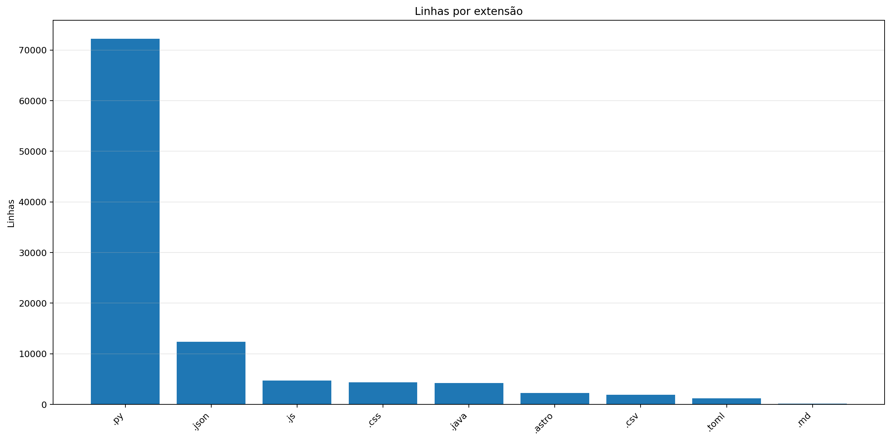

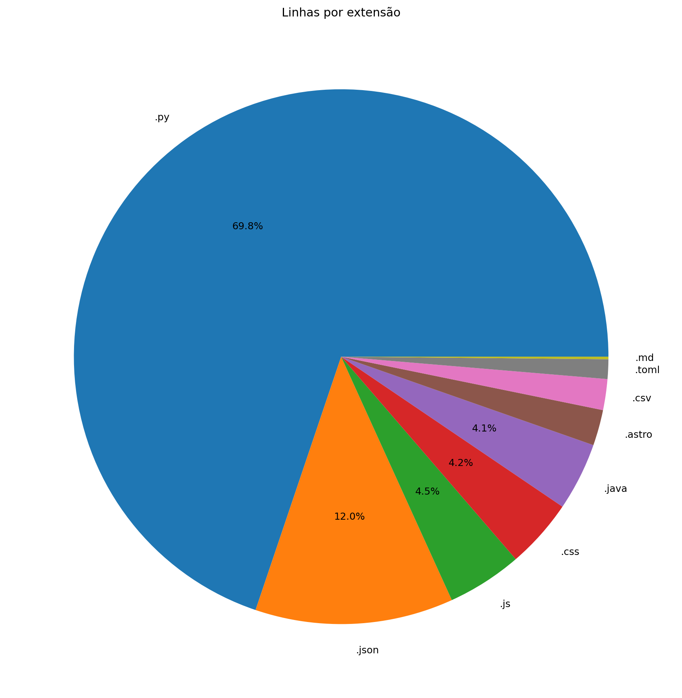

| Ext | Linhas | % das linhas | Arquivos | Peso |
|---:|---:|---:|---:|---:|
| `.py` | 72.255 | 69.81% | 241 | 3.13 MB |
| `.json` | 12.404 | 11.98% | 54 | 293.40 KB |
| `.js` | 4.692 | 4.53% | 23 | 188.79 KB |
| `.css` | 4.342 | 4.20% | 14 | 107.28 KB |
| `.java` | 4.254 | 4.11% | 8 | 161.49 KB |
| `.astro` | 2.237 | 2.16% | 42 | 94.09 KB |
| `.csv` | 1.934 | 1.87% | 10 | 240.37 KB |
| `.toml` | 1.226 | 1.18% | 15 | 25.73 KB |
| `.md` | 157 | 0.15% | 1 | 7.07 KB |

## 7. Peso por extensão

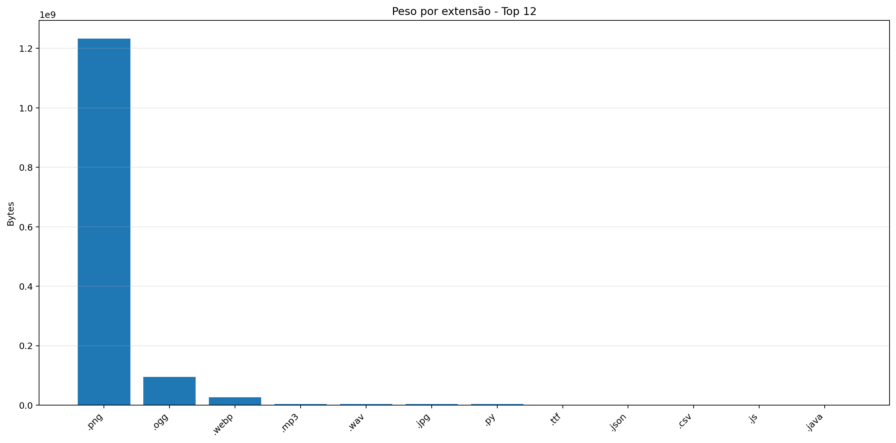

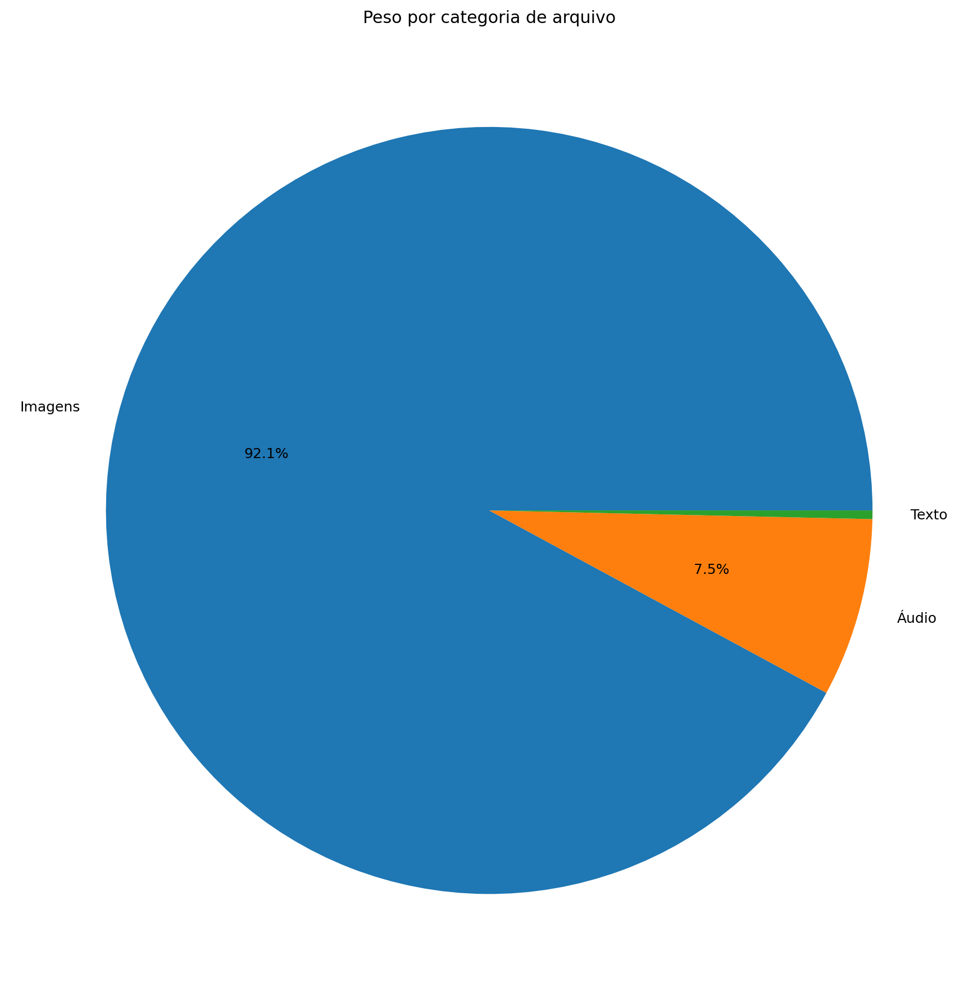

| Ext | Arquivos | Peso | % do jogo |
|---:|---:|---:|---:|
| `.png` | 73.090 | 1.148 GB | 89.91% |
| `.ogg` | 35 | 90.64 MB | 6.93% |
| `.webp` | 741 | 25.20 MB | 1.93% |
| `.mp3` | 6 | 3.97 MB | 0.30% |
| `.wav` | 9 | 3.81 MB | 0.29% |
| `.jpg` | 23 | 3.61 MB | 0.28% |
| `.py` | 241 | 3.13 MB | 0.24% |
| `.ttf` | 3 | 320.02 KB | 0.02% |
| `.json` | 54 | 293.40 KB | 0.02% |
| `.csv` | 10 | 240.37 KB | 0.02% |
| `.js` | 23 | 188.79 KB | 0.01% |
| `.java` | 8 | 161.49 KB | 0.01% |
| `.class` | 35 | 142.32 KB | 0.01% |
| `.css` | 14 | 107.28 KB | 0.01% |
| `.astro` | 42 | 94.09 KB | 0.01% |
| `.glsl` | 25 | 45.85 KB | 0.00% |
| `.toml` | 15 | 25.73 KB | 0.00% |
| `.frag` | 2 | 18.06 KB | 0.00% |
| `.md` | 1 | 7.07 KB | 0.00% |
| `.yml` | 1 | 644 bytes | 0.00% |
| `.mjs` | 1 | 585 bytes | 0.00% |
| `.vert` | 2 | 330 bytes | 0.00% |

## 8. Comparativo com o último relatório

| Métrica | Relatório anterior | Relatório atual | Diferença |
|---|---:|---:|---:|
| Arquivos | 74.280 | 74.382 | +102 |
| Linhas | 97.749 | 103.612 | +5.863 |
| Linhas .py | 71.386 | 72.255 | +869 |
| Métodos/funções | 4.134 | 4.193 | +59 |
| Classes | 222 | 223 | +1 |
| Commits | 609 | 626 | +17 |
| Tamanho | 1.075 GB | 1.277 GB | +206.90 MB |

### Top 3 commits por tamanho de diff

| Rank | Commit | Mensagem | Arquivos | Adições | Reduções | Diff total |
|---:|---|---|---:|---:|---:|---:|
| 1 | `d64e37e702d5` | relatorio | 16 | 4.585 | 133 | 4.718 |
| 2 | `2c2aac0485d8` | Novas Salas (30 salas) | 1 | 4.217 | 2 | 4.219 |
| 3 | `f659d65217c5` | Sistema aprimorado de salas de dungeon | 7 | 1.377 | 233 | 1.610 |

## 9. Gráficos de crescimento

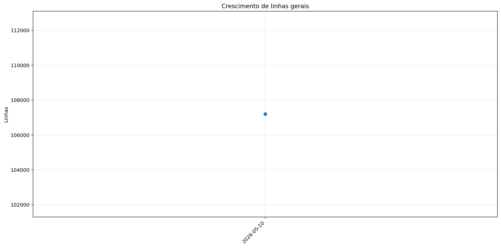

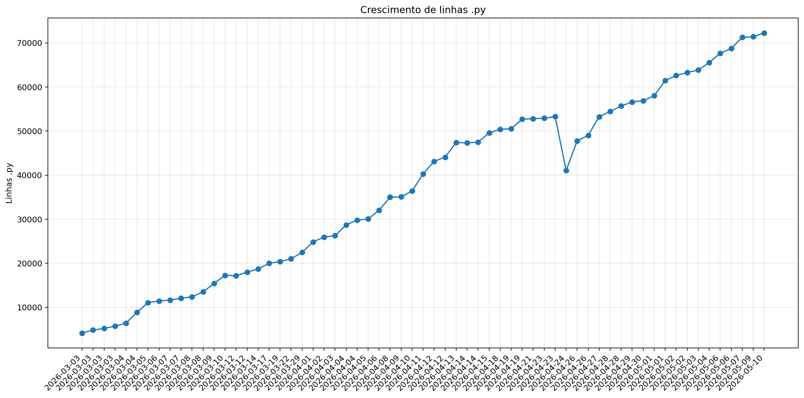

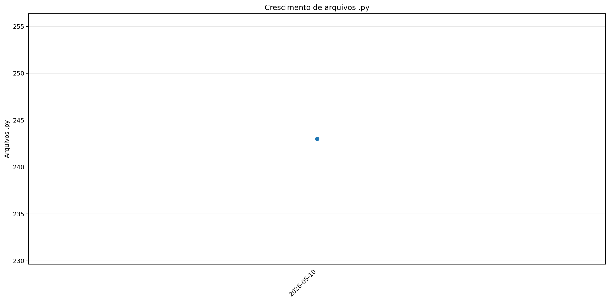

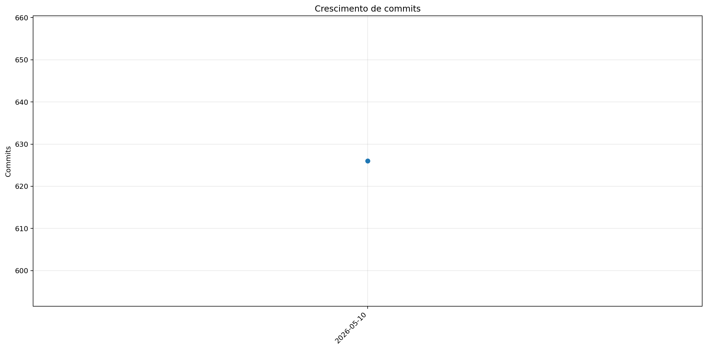

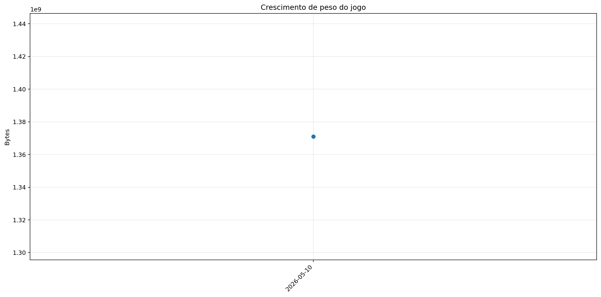
