# Registro

**Relatório:** #1  
**Projeto:** `relatorio_rebuild_hthx2bpf`  
**Gerado em:** 2026-05-15T11:42:09  
**Modelo de relatório:** 11  
**Autor:** Leon Cunha Alvaro Lopez Soto

## 1. Visão geral

- **Pastas:** 1.287
- **Arquivos:** 74.018
- **Arquivos de texto:** 452
- **Peso dos arquivos de texto:** 4846.74 KB
- **Tamanho total:** 1.730 GB (1.857.246.124 bytes)
- **Dias desde a criação do projeto:** 72
- **Dias desde a criação oficial:** 346
- **Horas estimadas:** 607.00
- **Linhas totais gerais:** 114.283
- **Commits (projeto):** 658

## 2. Python

- **Arquivos `.py`:** 244
- **Linhas totais:** 78.778
- **Tamanho total `.py`:** 3493.59 KB
- **Classes encontradas:** 224
- **Funções encontradas:** 1.416
- **Métodos encontrados:** 3.130
- **Total funções + métodos:** 4.546
- **Bibliotecas diferentes usadas:** 47

## 3. Macro áreas

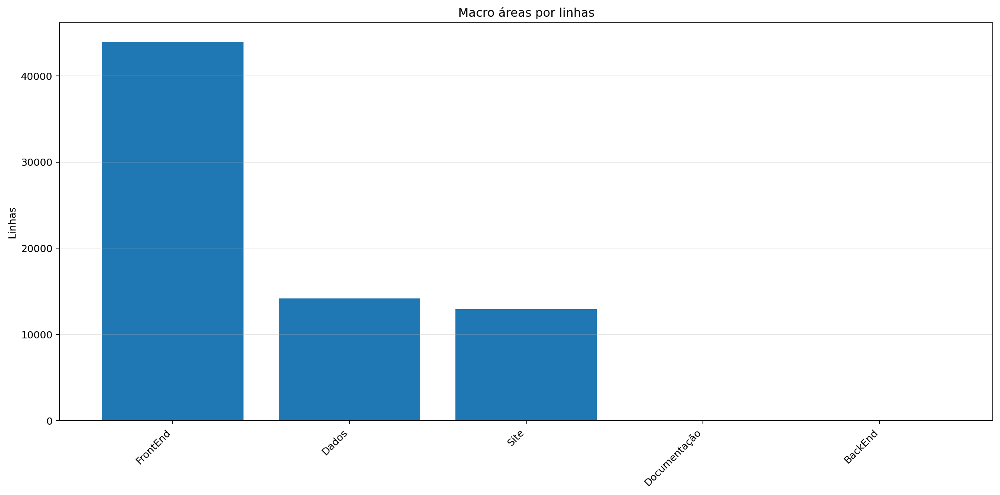

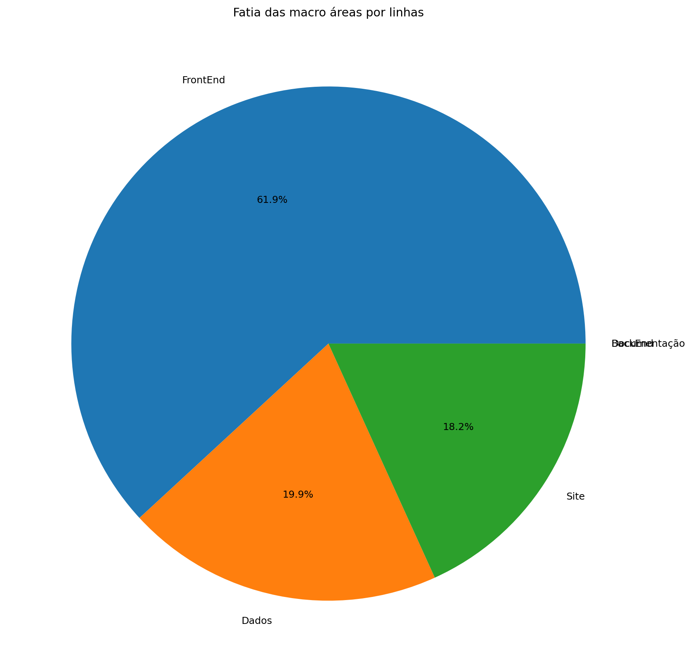

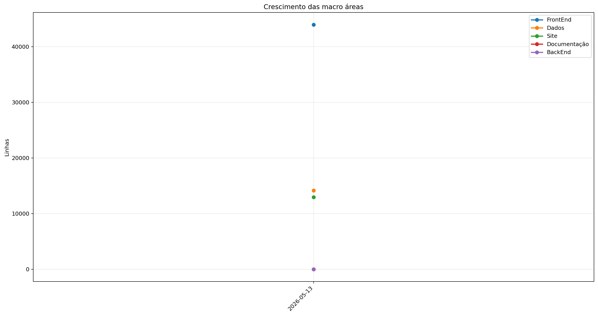

| Rank | Área | Caminho | Subpastas | Arquivos | Linhas gerais | Tamanho (KB) |
|---:|---|---|---:|---:|---:|---:|
| 1 | `FrontEnd` | `Codigo + Game.py` | 22 | 169 | 43.955 | 1945.18 |
| 2 | `Dados` | `Dados` | 6 | 61 | 14.160 | 618.54 |
| 3 | `Site` | `Site/src` | 6 | 93 | 12.940 | 450.19 |
| 4 | `Documentação` | `Documentação` | 0 | 0 | 0 | 0.00 |
| 5 | `BackEnd` | `Servidor + ServidorGeral` | 0 | 0 | 0 | 0.00 |

## 4. Principais pastas

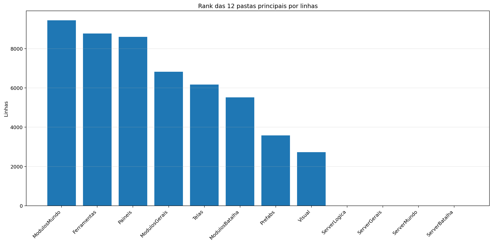

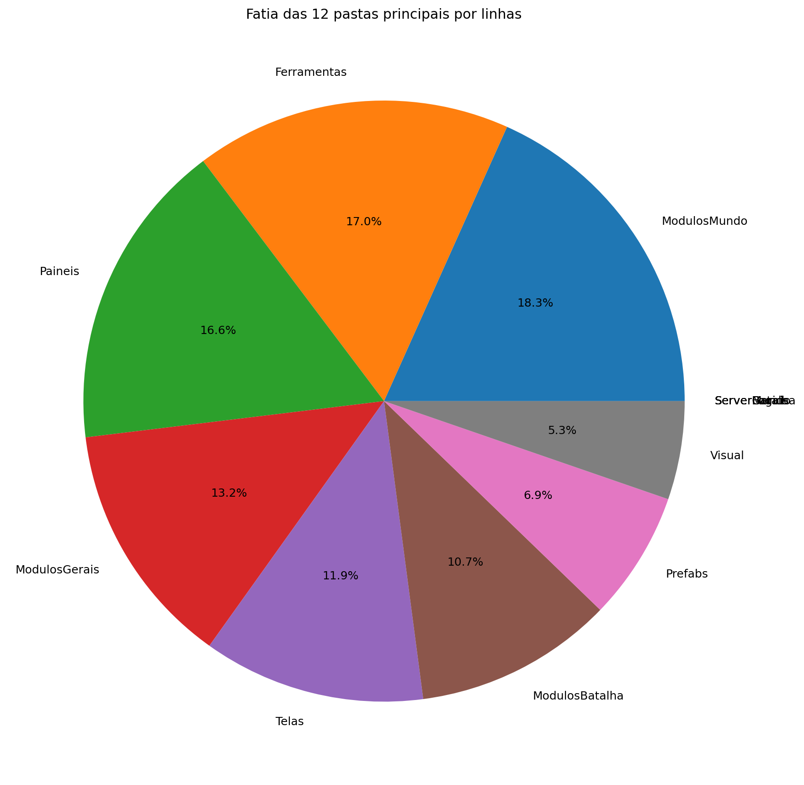

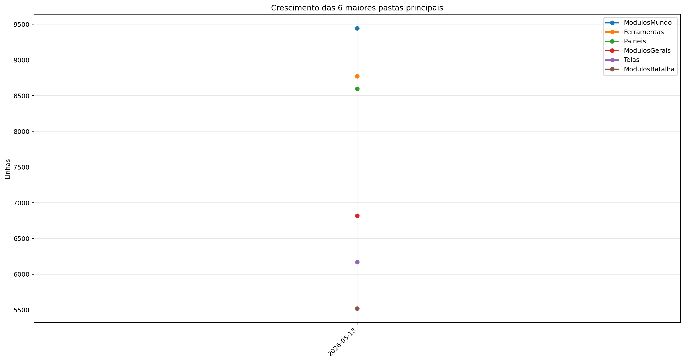

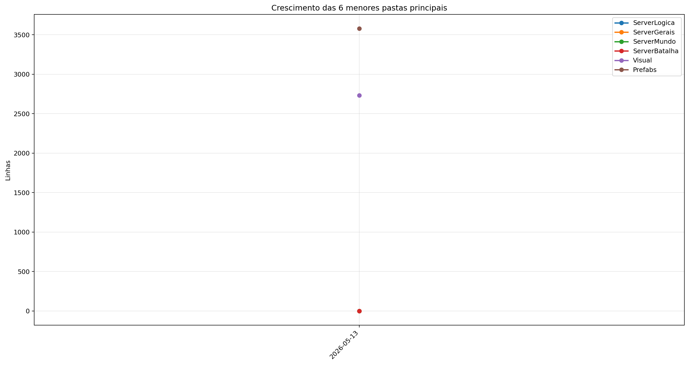

| Rank | Pasta | Subpastas | Arquivos | Linhas gerais | Tamanho (KB) |
|---:|---|---:|---:|---:|---:|
| 1 | `ModulosMundo` | 1 | 35 | 9.444 | 439.57 |
| 2 | `Ferramentas` | 0 | 12 | 8.771 | 330.42 |
| 3 | `Paineis` | 0 | 17 | 8.596 | 386.79 |
| 4 | `ModulosGerais` | 1 | 31 | 6.820 | 284.25 |
| 5 | `Telas` | 2 | 20 | 6.169 | 245.92 |
| 6 | `ModulosBatalha` | 0 | 13 | 5.521 | 267.60 |
| 7 | `Prefabs` | 0 | 14 | 3.580 | 131.92 |
| 8 | `Visual` | 0 | 9 | 2.732 | 121.11 |
| 9 | `ServerLogica` | 0 | 0 | 0 | 0.00 |
| 10 | `ServerGerais` | 0 | 0 | 0 | 0.00 |
| 11 | `ServerMundo` | 0 | 0 | 0 | 0.00 |
| 12 | `ServerBatalha` | 0 | 0 | 0 | 0.00 |

## 5. Arquitetura

### `Codigo/`

```text
Codigo/
├── Cenas/
│   ├── CenaCarregamento.py
│   ├── CenaCombate.py
│   ├── CenaLogin.py
│   ├── CenaMenu.py
│   ├── CenaMundo.py
│   └── ControladorCenas.py
├── Geradores/
│   ├── Player/
│   │   ├── Controle.py
│   │   ├── Inventario.py
│   │   ├── Perfil.py
│   │   └── Player.py
│   ├── Armadilhas.py
│   ├── Ator.py
│   ├── Baus.py
│   ├── ConstrutorDungeon.py
│   ├── Doce.py
│   ├── Dungeon.py
│   ├── Estadio.py
│   ├── EstruturaNaturais.py
│   ├── ItemInventario.py
│   ├── ItemMundo.py
│   ├── PokemonInventario.py
│   ├── PokemonMundo.py
│   ├── portal.py
│   ├── Projetil.py
│   └── XpMundo.py
├── ModulosBatalha/
│   ├── Arena.py
│   ├── ClimaBatalha.py
│   ├── ControladorAnimacoes.py
│   ├── ControladorBatalha.py
│   ├── ElementosHudBatalha.py
│   ├── FinalizadorBatalha.py
│   ├── IndicadorAtaque.py
│   ├── InicializadorBatalha.py
│   ├── LeitorLogs.py
│   ├── MontadorJogadas.py
│   ├── PlayerBatalha.py
│   ├── PokemonBatalha.py
│   └── SeletorCapturaBatalha.py
├── ModulosGerais/
│   ├── Server/
│   │   ├── GerenciadorServerList.py
│   │   ├── Login.py
│   │   ├── ServerBatalha.py
│   │   ├── ServerLogin.py
│   │   ├── ServerMenu.py
│   │   ├── ServerMundo.py
│   │   └── ServerTerminal.py
│   ├── Auxiliares.py
│   ├── Camera.py
│   ├── Colisor.py
│   ├── CompositorModernGL.py
│   ├── DesenhaAtor.py
│   ├── DesenhoMapa.py
│   ├── Discord.py
│   ├── EfeitosTela.py
│   ├── FiltroCamera.py
│   ├── GerenciadorPokemons.py
│   ├── GerenciadorTiles.py
│   ├── ImagensMapa.py
│   ├── LoaderTabelas.py
│   ├── LogoMenu.py
│   ├── ModuladorRegras.py
│   ├── PipelineGrafica.py
│   ├── PropriedadesAtaques.py
│   └── Sonoridades.py
├── ModulosMundo/
│   ├── ControladorAtores.py
│   ├── ControladorCriaveis.py
│   ├── ControladorDungeons.py
│   ├── ControladorMundo.py
│   ├── ControladorObjetos.py
│   ├── ControladorPlayer.py
│   ├── ElementosHudMundo.py
│   ├── ExecutaveisPoção.py
│   ├── LeitorDialogo.py
│   ├── LeitorMundo.py
│   ├── Loja.py
│   ├── MecanicasTiles.py
│   ├── Minimapa.py
│   ├── ServicoCraft.py
│   ├── ServicoMapaMundo.py
│   └── SistemaPacotes.py
├── Outros/
│   └── Shaders/
│       ├── mundo.frag
│       └── mundo.vert
├── Paineis/
│   ├── Container.py
│   ├── FichaAtaque.py
│   ├── FichaItem.py
│   ├── FichaPokemon.py
│   ├── FichaPokemonBatalha.py
│   ├── MiniPaineisConhecimentos.py
│   ├── PainelAcoes.py
│   ├── PainelArvoreHabilidades.py
│   ├── PainelAuxiliarPoke.py
│   ├── PainelCaptura.py
│   ├── PainelConhecimento.py
│   ├── PainelCraft.py
│   ├── PainelEstatisticas.py
│   ├── PainelProgresso.py
│   ├── PainelReceitas.py
│   ├── PainelTimes.py
│   └── VisualizadorLog.py
├── Prefabs/
│   ├── Arrastavel.py
│   ├── Barra.py
│   ├── BarraPesquisa.py
│   ├── Botao.py
│   ├── CaixaTexto.py
│   ├── EfeitosVisuais.py
│   ├── Fluxos.py
│   ├── Mensagem.py
│   ├── Opcoes.py
│   ├── Painel.py
│   ├── Terminal.py
│   ├── Texto.py
│   ├── TextoCinematico.py
│   └── Tooltip.py
├── Shaders/
│   ├── comum/
│   │   ├── amostras.glsl
│   │   ├── constantes.glsl
│   │   ├── cores.glsl
│   │   ├── geometria.glsl
│   │   └── ruido.glsl
│   ├── efeitos/
│   │   ├── batalha/
│   │   │   ├── clima_batalha.glsl
│   │   │   └── estados_batalha.glsl
│   │   ├── hud/
│   │   │   ├── menu_logo.glsl
│   │   │   └── texto_cinematico.glsl
│   │   ├── mundo/
│   │   │   ├── biomas_mundo.glsl
│   │   │   ├── captura.glsl
│   │   │   ├── clima_mundo.glsl
│   │   │   ├── dungeon_ambiente.glsl
│   │   │   └── grade_global.glsl
│   │   ├── biomas_mundo.glsl
│   │   ├── captura.glsl
│   │   ├── clima_batalha.glsl
│   │   ├── clima_mundo.glsl
│   │   ├── grade_global.glsl
│   │   └── menu_logo.glsl
│   ├── uniformes/
│   │   ├── batalha.glsl
│   │   ├── globais.glsl
│   │   ├── hud.glsl
│   │   └── mundo.glsl
│   ├── compositor.frag
│   ├── compositor.vert
│   └── comum.glsl
├── Telas/
│   ├── Subtelas/
│   │   ├── Subtela.py
│   │   ├── SubtelaCriarPersonagem.py
│   │   ├── SubtelaDialogo.py
│   │   ├── SubtelaFinalizacao.py
│   │   ├── SubtelaInventario.py
│   │   ├── SubtelaInventarioEstatisticas.py
│   │   ├── SubtelaInventarioItens.py
│   │   ├── SubtelaInventarioPokemons.py
│   │   ├── SubtelaOpcoes.py
│   │   └── SubtelaPreBatalha.py
│   └── Telas/
│       ├── TelaConfig.py
│       ├── TelaConfigAvancada.py
│       ├── TelaConta.py
│       ├── TelaLogin.py
│       ├── TelaMapa.py
│       ├── TelaMenu.py
│       ├── TelaMorrer.py
│       ├── TelaOperador.py
│       ├── TelaServers.py
│       └── TelasGenericas.py
└── Visual/
    ├── ArenaAnimator.py
    ├── AtorEstado.py
    ├── AuxiliaresVisuais.py
    ├── ContatoIrregularAnimator.py
    ├── PokemonBatalhaAnimator.py
    ├── PokemonBatalhaEstado.py
    ├── PokemonMundoAnimator.py
    ├── PokemonMundoEstado.py
    └── ProjetilBatalha.py
```

### `Server/`

```text
Servidor/
└── (pasta não encontrada)
```

### `Dados/`

```text
Dados/
├── Catalogo/
│   ├── Dungeon.json
│   ├── Musicas.json
│   ├── Pokemon Global Server - Baus.json
│   ├── Pokemon Global Server - Receitas.json
│   └── Sons.json
├── InteracoesNPC/
│   ├── Combatentes/
│   │   ├── Alleka.json
│   │   ├── Amable.json
│   │   ├── Caio.json
│   │   ├── Felipox.json
│   │   ├── Felps.json
│   │   ├── Ferraz.json
│   │   ├── Garcia.json
│   │   ├── Guedes.json
│   │   ├── Henrique.json
│   │   ├── João.json
│   │   ├── Lisciele.json
│   │   ├── Murilo.json
│   │   ├── Nathzinha.json
│   │   ├── Paulo.json
│   │   ├── Ph.json
│   │   ├── Ramos.json
│   │   ├── Sidney.json
│   │   ├── Suneiva.json
│   │   ├── Suriane.json
│   │   └── Vasques.json
│   ├── Vendedores/
│   │   └── Josefa.json
│   ├── ExemploCapitao_Laura.json
│   ├── ExemploDesafiante_Ravi.json
│   ├── ExemploDissociado_Nico.json
│   ├── ExemploLider_Alleka.json
│   └── ManualDialogos.json
├── PropriedadesAtaques/
│   ├── PropriedadesAgua.json
│   ├── PropriedadesCosmico.json
│   ├── PropriedadesDragao.json
│   ├── PropriedadesEletrico.json
│   ├── PropriedadesFada.json
│   ├── PropriedadesFantasma.json
│   ├── PropriedadesFogo.json
│   ├── PropriedadesGelo.json
│   ├── PropriedadesInseto.json
│   ├── PropriedadesLutador.json
│   ├── PropriedadesMetal.json
│   ├── PropriedadesNormal.json
│   ├── PropriedadesPedra.json
│   ├── PropriedadesPlanta.json
│   ├── PropriedadesPsiquico.json
│   ├── PropriedadesSombrio.json
│   ├── PropriedadesSonoro.json
│   ├── PropriedadesTerra.json
│   ├── PropriedadesVeneno.json
│   └── PropriedadesVoador.json
└── Tabelas/
    ├── Pokemon Global Server - Ataques.csv
    ├── Pokemon Global Server - Dungeons.csv
    ├── Pokemon Global Server - Efeitos.csv
    ├── Pokemon Global Server - Equipaveis.csv
    ├── Pokemon Global Server - Itens.csv
    ├── Pokemon Global Server - NPC Combatente.csv
    ├── Pokemon Global Server - NPC Vendedor.csv
    ├── Pokemon Global Server - Pokemons.csv
    ├── Pokemon Global Server - Sistema FR.csv
    └── Pokemon Global Server - Spawn.csv
```

### `Site/`

```text
Site/
├── public/
│   ├── Ataques/
│   ├── Atributos/
│   ├── Efeitos/
│   ├── Equipaveis/
│   ├── Ferramentas/
│   ├── Frutas/
│   ├── GlobalServer/
│   ├── Imagens/
│   ├── Insigneas/
│   ├── Medalhoes/
│   ├── Musicas/
│   │   ├── Batalha/
│   │   │   ├── BatalhasTipos/
│   │   │   ├── Confrontos/
│   │   │   ├── Fechamento/
│   │   │   └── Lideres/
│   │   ├── Menu/
│   │   └── Mundo/
│   ├── Objetos/
│   ├── Pokebolas/
│   ├── Poções/
│   ├── Recursos/
│   ├── Skins/
│   └── Tipos/
├── src/
│   ├── Codigo/
│   │   ├── AssetsPublicos.js
│   │   ├── AtaquesRuntime.js
│   │   ├── AtaquesWikiDados.js
│   │   ├── CombateWikiDados.js
│   │   ├── DungeonsRuntime.js
│   │   ├── DungeonsWikiDados.js
│   │   ├── EfeitosRuntime.js
│   │   ├── EfeitosWikiDados.js
│   │   ├── EquipaveisRuntime.js
│   │   ├── EquipaveisWikiDados.js
│   │   ├── EstadiosRuntime.js
│   │   ├── ItemWikiDados.js
│   │   ├── ItensRuntime.js
│   │   ├── MundoRuntime.js
│   │   ├── MundoWikiDados.js
│   │   ├── MusicasRuntime.js
│   │   ├── MusicasWikiDados.js
│   │   ├── NpcsRuntime.js
│   │   ├── NpcsWikiDados.js
│   │   ├── PokedexRuntime.js
│   │   ├── PokemonWikiDados.js
│   │   ├── RelatoriosDados.js
│   │   ├── RelatoriosRuntime.js
│   │   ├── RotasSite.js
│   │   ├── SistemasPorTrasDoJogo.js
│   │   ├── site.js
│   │   ├── WikiCsv.js
│   │   └── WikiRuntimeBase.js
│   ├── Componentes/
│   │   ├── Botao.astro
│   │   ├── CampoBuscaWiki.astro
│   │   ├── CardCatalogo.astro
│   │   ├── CardWiki.astro
│   │   ├── DetalheTopo.astro
│   │   ├── FaixaMusica.astro
│   │   ├── FiltroTipoIcones.astro
│   │   ├── Footer.astro
│   │   ├── Header.astro
│   │   ├── JsonPayload.astro
│   │   ├── Layout.astro
│   │   ├── ModalControles.astro
│   │   ├── ModalDetalhe.astro
│   │   ├── NpcDetalheModal.astro
│   │   ├── PainelDetalhe.astro
│   │   ├── PokemonDetalheModal.astro
│   │   ├── ResumoWiki.astro
│   │   ├── SelectFiltroWiki.astro
│   │   ├── TipoIcone.astro
│   │   ├── WikiCatalogoShell.astro
│   │   ├── WikiGrid.astro
│   │   ├── WikiMenu.astro
│   │   ├── WikiStatus.astro
│   │   ├── WikiToolbar.astro
│   │   ├── WikiTopo.astro
│   │   └── WikiVazio.astro
│   ├── Estilos/
│   │   ├── auth.css
│   │   ├── global.css
│   │   ├── home.css
│   │   ├── por-tras-do-jogo.css
│   │   ├── wiki-ataques.css
│   │   ├── wiki-base.css
│   │   ├── wiki-cards.css
│   │   ├── wiki-combate.css
│   │   ├── wiki-dungeons.css
│   │   ├── wiki-equipaveis.css
│   │   ├── wiki-itens.css
│   │   ├── wiki-modal.css
│   │   ├── wiki-mundo.css
│   │   ├── wiki-musicas.css
│   │   ├── wiki-pokedex.css
│   │   └── wiki.css
│   └── pages/
│       ├── por-tras-do-jogo/
│       │   ├── [sistema].astro
│       │   ├── index.astro
│       │   └── relatorio.astro
│       ├── wiki/
│       │   ├── ataques.astro
│       │   ├── comandos.astro
│       │   ├── combate.astro
│       │   ├── dungeons.astro
│       │   ├── efeitos.astro
│       │   ├── equipaveis.astro
│       │   ├── estadios.astro
│       │   ├── habilidades.astro
│       │   ├── index.astro
│       │   ├── itens.astro
│       │   ├── mundo.astro
│       │   ├── musicas.astro
│       │   ├── npcs.astro
│       │   ├── pokemons.astro
│       │   ├── receitas.astro
│       │   └── tipos.astro
│       ├── conta.astro
│       ├── contato.astro
│       ├── download.astro
│       └── index.astro
├── astro.config.mjs
└── package.json
```

### `Ferramentas/`

```text
Ferramentas/
├── AtualizadorReadMe.py
└── GeradorRelatorios.py
```

## 6. Ranks

### Top 50 maiores arquivos `.py` por linhas

| Arquivo | Linhas | Tamanho (KB) |
|---|---:|---:|
| `Ferramentas/GeradorRelatorios.py` | 2.117 | 80.24 |
| `Outros/GeradorRelatorios.py` | 1.828 | 67.77 |
| `SimuladorServerJogo/Gerais/EstadoServidor.py` | 1.397 | 60.90 |
| `Codigo/ModulosMundo/ControladorObjetos.py` | 1.310 | 66.61 |
| `Codigo/Paineis/FichaPokemon.py` | 1.269 | 57.16 |
| `Codigo/ModulosBatalha/MontadorJogadas.py` | 1.210 | 61.00 |
| `SimuladorServerJogo/Gerais/Geradores/GeradorDungeons.py` | 1.168 | 52.96 |
| `SimuladorServerJogo/Batalha/PokemonBatalha.py` | 1.152 | 60.05 |
| `Outros/EditorAnimaçãoAtaques.py` | 1.118 | 49.12 |
| `Codigo/Paineis/VisualizadorLog.py` | 1.101 | 64.15 |
| `Codigo/Telas/Subtelas/SubtelaInventarioPokemons.py` | 1.096 | 50.19 |
| `SimuladorServerJogo/Batalha/Partida.py` | 1.055 | 52.78 |
| `Codigo/Cenas/CenaMundo.py` | 976 | 56.75 |
| `SimuladorServerJogo/Gerais/Geradores/GeradorPokemon.py` | 926 | 38.57 |
| `Codigo/ModulosMundo/ControladorPlayer.py` | 923 | 45.52 |
| `SimuladorServerJogo/Mundo/Cerebros/CerebroDungeons.py` | 919 | 53.79 |
| `SimuladorServerJogo/Mundo/BancoDados.py` | 821 | 40.74 |
| `Codigo/Prefabs/Texto.py` | 819 | 31.41 |
| `SimuladorServerJogo/Gerais/Rotas/Atualizador.py` | 786 | 42.77 |
| `Codigo/Visual/PokemonBatalhaAnimator.py` | 770 | 34.65 |
| `SimuladorServerJogo/Mundo/Cerebros/CerebroNPCs.py` | 747 | 39.56 |
| `SimuladorServerJogo/Logica/Comandos/Comandos.py` | 729 | 30.92 |
| `Codigo/Paineis/FichaPokemonBatalha.py` | 725 | 35.63 |
| `Codigo/ModulosGerais/Sonoridades.py` | 718 | 21.84 |
| `Codigo/ModulosBatalha/ControladorAnimacoes.py` | 716 | 36.99 |
| `SimuladorServerJogo/Gerais/Geradores/GeradorMundo.py` | 689 | 27.82 |
| `Codigo/Geradores/PokemonMundo.py` | 688 | 33.25 |
| `Codigo/ModulosBatalha/ControladorBatalha.py` | 680 | 32.87 |
| `SimuladorServerJogo/Logica/Executes/ExecutesAtaques/ExecutesAgua.py` | 678 | 30.64 |
| `Codigo/ModulosGerais/ImagensMapa.py` | 669 | 29.83 |
| `SimuladorServerJogo/Logica/Executes/ExecutesAtaques/ExecutesLutador.py` | 662 | 29.40 |
| `Outros/AtualizadorRelatorios.py` | 651 | 23.61 |
| `Codigo/Paineis/Container.py` | 637 | 23.33 |
| `Codigo/Paineis/PainelConhecimento.py` | 617 | 25.33 |
| `Codigo/Visual/PokemonBatalhaEstado.py` | 596 | 27.44 |
| `Codigo/Telas/Telas/TelaServers.py` | 570 | 18.46 |
| `SimuladorServerJogo/Gerais/Rotas/Ativador.py` | 568 | 28.26 |
| `Codigo/ModulosMundo/LeitorMundo.py` | 547 | 25.05 |
| `Codigo/Paineis/PainelArvoreHabilidades.py` | 547 | 26.81 |
| `Codigo/Telas/Telas/TelasGenericas.py` | 547 | 19.11 |
| `SimuladorServerJogo/Batalha/RodadorTurno.py` | 541 | 28.68 |
| `SimuladorServerJogo/Mundo/InicializadorNPC.py` | 538 | 27.66 |
| `Codigo/Visual/ContatoIrregularAnimator.py` | 529 | 24.09 |
| `Outros/GameTestFPS.py` | 528 | 18.13 |
| `SimuladorServerJogo/Gerais/LoaderRegras.py` | 528 | 31.92 |
| `SimuladorServerJogo/Logica/Executes/ExecutesAtaques/UtilitariosExecutes.py` | 518 | 22.92 |
| `Outros/EditorSkins.py` | 514 | 19.97 |
| `Codigo/ModulosBatalha/PokemonBatalha.py` | 509 | 24.29 |
| `Codigo/Telas/Subtelas/SubtelaInventarioItens.py` | 509 | 23.76 |
| `Codigo/ModulosMundo/LeitorDialogo.py` | 499 | 20.71 |

### Top 20 maiores classes

| Arquivo | Classe | Linhas |
|---|---|---:|
| `Codigo/ModulosMundo/ControladorObjetos.py` | `ControladorObjetos` | 1.281 |
| `Codigo/Paineis/FichaPokemon.py` | `FichaPokemon` | 1.246 |
| `Codigo/ModulosBatalha/MontadorJogadas.py` | `MontadorJogadas` | 1.163 |
| `SimuladorServerJogo/Batalha/PokemonBatalha.py` | `PokemonBatalha` | 1.088 |
| `Codigo/Telas/Subtelas/SubtelaInventarioPokemons.py` | `InventarioPokemons` | 1.066 |
| `SimuladorServerJogo/Batalha/Partida.py` | `Partida` | 1.011 |
| `Codigo/Cenas/CenaMundo.py` | `CenaMundo` | 935 |
| `Codigo/Paineis/VisualizadorLog.py` | `VisualizadorLog` | 911 |
| `Codigo/ModulosMundo/ControladorPlayer.py` | `ControladorPlayer` | 904 |
| `SimuladorServerJogo/Mundo/Cerebros/CerebroDungeons.py` | `CerebroDungeons` | 882 |
| `SimuladorServerJogo/Mundo/BancoDados.py` | `BancoDadosMundo` | 791 |
| `Codigo/Visual/PokemonBatalhaAnimator.py` | `PokemonAnimator` | 738 |
| `SimuladorServerJogo/Mundo/Cerebros/CerebroNPCs.py` | `CerebroNPCs` | 727 |
| `Codigo/Paineis/FichaPokemonBatalha.py` | `FichaPokemonBatalha` | 705 |
| `Codigo/Geradores/PokemonMundo.py` | `Pokemon` | 663 |
| `Codigo/ModulosBatalha/ControladorBatalha.py` | `ControladorBatalha` | 657 |
| `Codigo/ModulosBatalha/ControladorAnimacoes.py` | `ControladorAnimacoes` | 654 |
| `Codigo/Paineis/Container.py` | `Container` | 628 |
| `Codigo/ModulosGerais/ImagensMapa.py` | `GerenciadorImagensMapa` | 622 |
| `Codigo/Visual/PokemonBatalhaEstado.py` | `PokemonBatalhaEstado` | 543 |

### Top 20 maiores funções e métodos

| Arquivo | Nome | Tipo | Linhas |
|---|---|---:|---:|
| `SimuladorServerJogo/Gerais/Rotas/Atualizador.py` | `processar_atualizador_json` | funcao | 392 |
| `Codigo/Paineis/VisualizadorLog.py` | `VisualizadorLog._registro_evento` | metodo | 340 |
| `Ferramentas/GeradorRelatorios.py` | `coletar_metricas` | funcao | 252 |
| `Codigo/Prefabs/Fluxos.py` | `Fluxo.desenhar` | metodo | 249 |
| `Outros/GeradorRelatorios.py` | `coletar_metricas` | funcao | 247 |
| `Codigo/Geradores/Estadio.py` | `EstadioInterno.renderizar` | metodo | 196 |
| `SimuladorServerJogo/Gerais/Geradores/GeradorDungeons.py` | `gerar_dungeon_layout` | funcao | 186 |
| `SimuladorServerJogo/Batalha/PokemonBatalha.py` | `PokemonBatalha.ReceberDano` | metodo | 174 |
| `Codigo/Cenas/CenaMundo.py` | `CenaMundo.atualizar_cena` | metodo | 169 |
| `Codigo/Telas/Telas/TelaMapa.py` | `TelaMapa.desenhar` | metodo | 164 |
| `SimuladorServerJogo/Batalha/PokemonBatalha.py` | `PokemonBatalha.ReceberEfeito` | metodo | 156 |
| `Ferramentas/GeradorRelatorios.py` | `gerar_markdown` | funcao | 151 |
| `Codigo/Telas/Subtelas/SubtelaInventarioPokemons.py` | `InventarioPokemons.atualizar` | metodo | 148 |
| `Codigo/ModulosGerais/Colisor.py` | `Colisor.resolver_movimento_com_colisores` | metodo | 146 |
| `Ferramentas/GeradorRelatorios.py` | `gerar_graficos` | funcao | 146 |
| `SimuladorServerJogo/Gerais/Geradores/GeradorMundo.py` | `_executar_world_generator` | funcao | 144 |
| `Outros/AtualizadorRelatorios.py` | `main` | funcao | 140 |
| `Outros/GeradorRelatorios.py` | `gerar_markdown` | funcao | 139 |
| `SimuladorServerJogo/Gerais/Rotas/Ativador.py` | `processar_ativador_json` | funcao | 139 |
| `Ferramentas/GeradorRelatorios.py` | `analisar_python_ast` | funcao | 132 |

### Top 10 arquivos mais importados

| Arquivo | Vezes importado |
|---|---:|
| `Codigo/Prefabs/Texto.py` | 46 |
| `Codigo/Prefabs/Botao.py` | 33 |
| `SimuladorServerJogo/Logica/Executes/ExecutesAtaques/UtilitariosExecutes.py` | 22 |
| `Codigo/Geradores/ItemInventario.py` | 18 |
| `SimuladorServerJogo/Gerais/EstadoServidor.py` | 18 |
| `SimuladorServerJogo/Mundo/BancoDados.py` | 18 |
| `Codigo/ModulosGerais/Sonoridades.py` | 17 |
| `Codigo/ModulosGerais/Auxiliares.py` | 14 |
| `SimuladorServerJogo/Gerais/Rotas/Ativador.py` | 13 |
| `SimuladorServerJogo/Mundo/ObjetosMundoServer.py` | 13 |

### Top 10 arquivos que mais importam

| Arquivo | Arquivos internos importados | Imports totais | Linhas |
|---|---:|---:|---:|
| `Codigo/Cenas/CenaMundo.py` | 24 | 27 | 976 |
| `SimuladorServerJogo/Logica/Executes/ExecutesAtaques/ControladorExecutes.py` | 23 | 25 | 285 |
| `SimuladorServerJogo/Mundo/Cerebros/CerebroCentral.py` | 18 | 27 | 492 |
| `Codigo/Telas/Subtelas/SubtelaInventarioPokemons.py` | 17 | 22 | 1.096 |
| `Codigo/ModulosBatalha/ControladorBatalha.py` | 13 | 18 | 680 |
| `SimuladorServerJogo/Gerais/Rotas/Atualizador.py` | 12 | 17 | 786 |
| `SimuladorServerJogo/Batalha/BatalhaIA/ControladorIA.py` | 12 | 16 | 166 |
| `SimuladorServerJogo/Batalha/Partida.py` | 11 | 19 | 1.055 |
| `Codigo/Cenas/ControladorCenas.py` | 11 | 16 | 304 |
| `Codigo/ModulosMundo/ControladorObjetos.py` | 10 | 17 | 1.310 |

### Top 10 maiores arquivos por linhas

| Arquivo | Ext | Linhas |
|---|---:|---:|
| `Dados/Catalogo/Dungeon.json` | `.json` | 5.051 |
| `Ferramentas/GeradorRelatorios.py` | `.py` | 2.117 |
| `Outros/GeradorRelatorios.py` | `.py` | 1.828 |
| `SimuladorServerJogo/Gerais/EstadoServidor.py` | `.py` | 1.397 |
| `Codigo/ModulosMundo/ControladorObjetos.py` | `.py` | 1.310 |
| `Dados/Tabelas/Pokemon Global Server - Pokemons.csv` | `.csv` | 1.309 |
| `Codigo/Paineis/FichaPokemon.py` | `.py` | 1.269 |
| `Site/src/Estilos/wiki-pokedex.css` | `.css` | 1.220 |
| `Codigo/ModulosBatalha/MontadorJogadas.py` | `.py` | 1.210 |
| `SimuladorServerJogo/Gerais/Geradores/GeradorDungeons.py` | `.py` | 1.168 |

## 7. Linhas por extensão

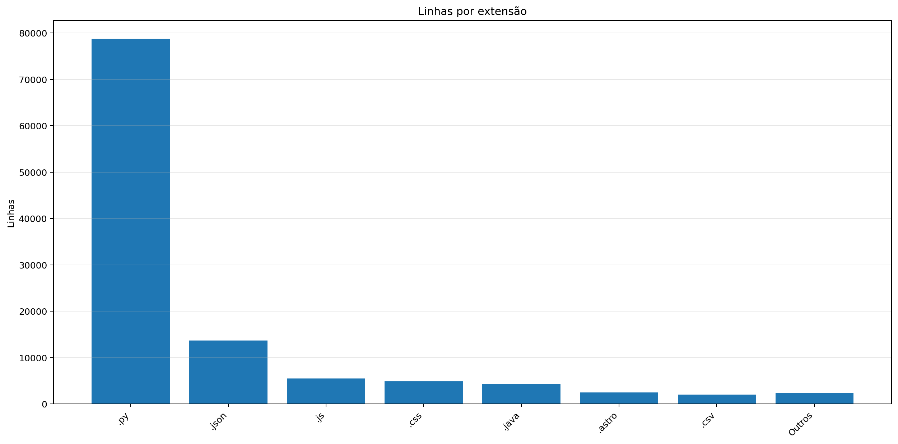

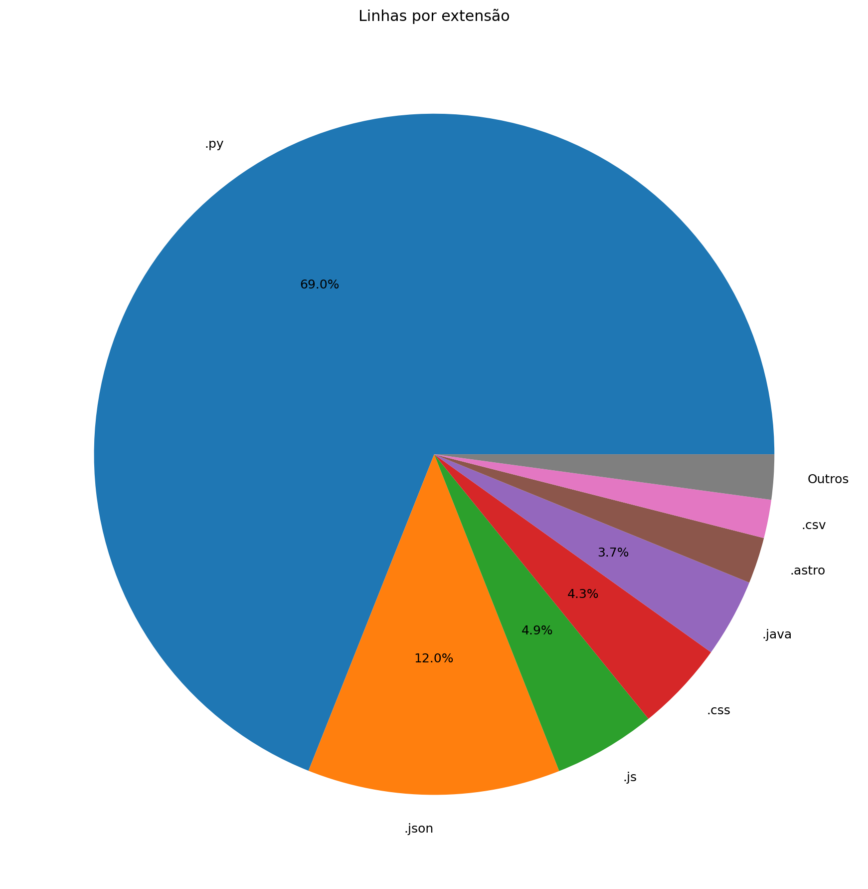

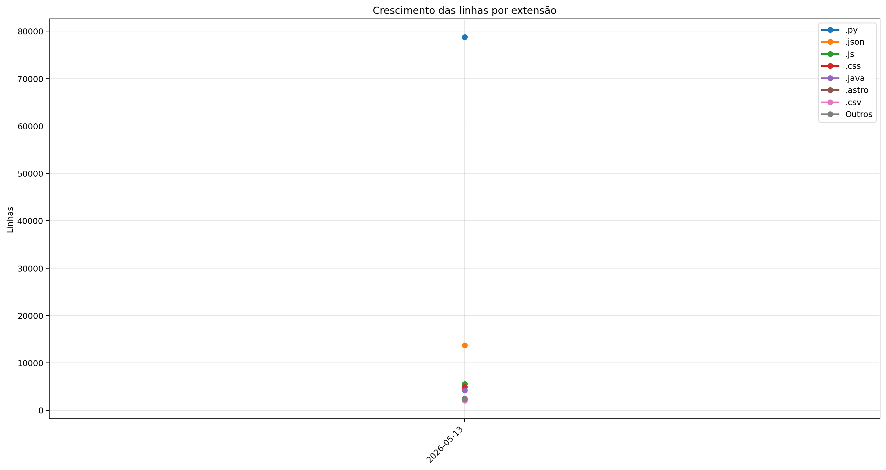

| Ext | Linhas | % das linhas | Arquivos | Peso |
|---:|---:|---:|---:|---:|
| `.py` | 78.778 | 68.98% | 244 | 3.41 MB |
| `.json` | 13.720 | 12.01% | 54 | 381.18 KB |
| `.js` | 5.545 | 4.86% | 28 | 223.46 KB |
| `.css` | 4.893 | 4.28% | 16 | 121.11 KB |
| `.java` | 4.254 | 3.72% | 8 | 161.54 KB |
| `.astro` | 2.502 | 2.19% | 49 | 105.63 KB |
| `.csv` | 2.080 | 1.82% | 10 | 278.78 KB |
| `.toml` | 1.233 | 1.08% | 15 | 25.98 KB |
| `.glsl` | 1.010 | 0.88% | 25 | 46.76 KB |
| `.md` | 157 | 0.14% | 1 | 7.07 KB |
| `.yml` | 39 | 0.03% | 1 | 644 bytes |

## 8. Peso por extensão

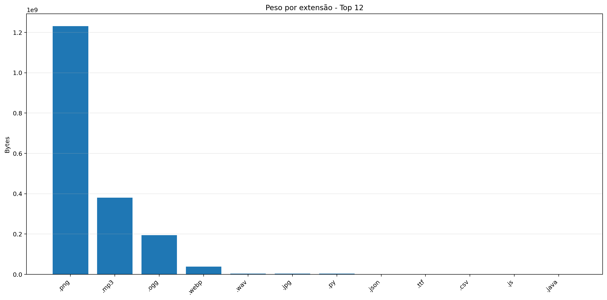

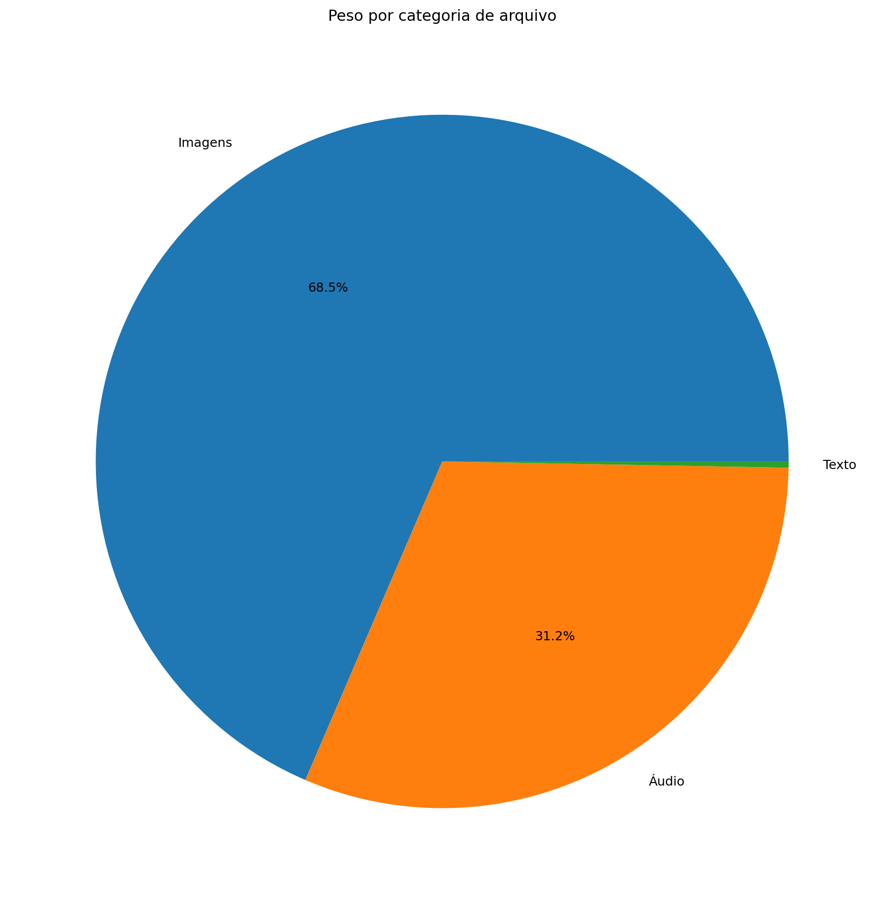

| Ext | Arquivos | Peso | % do jogo |
|---:|---:|---:|---:|
| `.png` | 72.440 | 1.146 GB | 66.27% |
| `.mp3` | 47 | 362.80 MB | 20.48% |
| `.ogg` | 72 | 185.63 MB | 10.48% |
| `.webp` | 967 | 36.48 MB | 2.06% |
| `.wav` | 9 | 3.81 MB | 0.22% |
| `.jpg` | 23 | 3.61 MB | 0.20% |
| `.py` | 244 | 3.41 MB | 0.19% |
| `.json` | 54 | 381.18 KB | 0.02% |
| `.ttf` | 3 | 320.02 KB | 0.02% |
| `.csv` | 10 | 278.78 KB | 0.02% |
| `.js` | 28 | 223.46 KB | 0.01% |
| `.java` | 8 | 161.54 KB | 0.01% |
| `.css` | 16 | 121.11 KB | 0.01% |
| `.astro` | 49 | 105.63 KB | 0.01% |
| `.glsl` | 25 | 46.76 KB | 0.00% |
| `.toml` | 15 | 25.98 KB | 0.00% |
| `.frag` | 2 | 18.40 KB | 0.00% |
| `.md` | 1 | 7.07 KB | 0.00% |
| `.yml` | 1 | 644 bytes | 0.00% |
| `.mjs` | 1 | 585 bytes | 0.00% |
| `.vert` | 2 | 340 bytes | 0.00% |

## 9. Comparativo com o último relatório

_Sem relatório anterior compatível para montar comparativo._

### Top 3 commits por tamanho de diff

_Sem commits suficientes entre os relatórios para montar top por diff._

## 10. Gráficos de crescimento

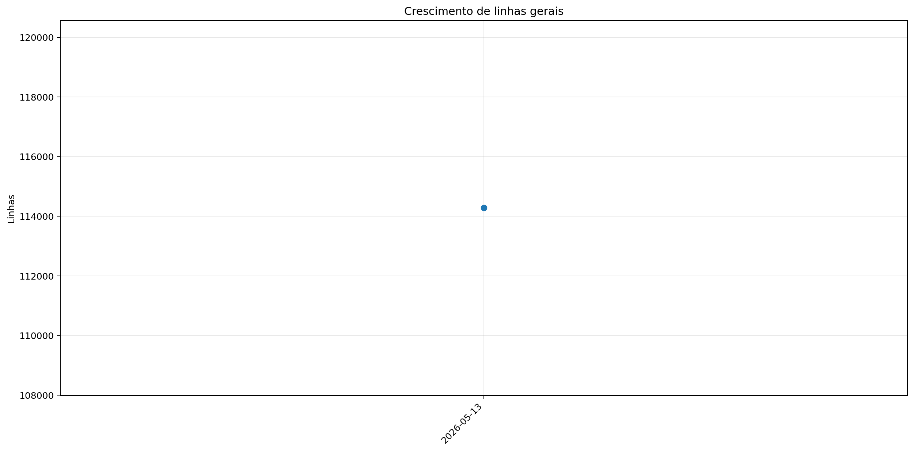

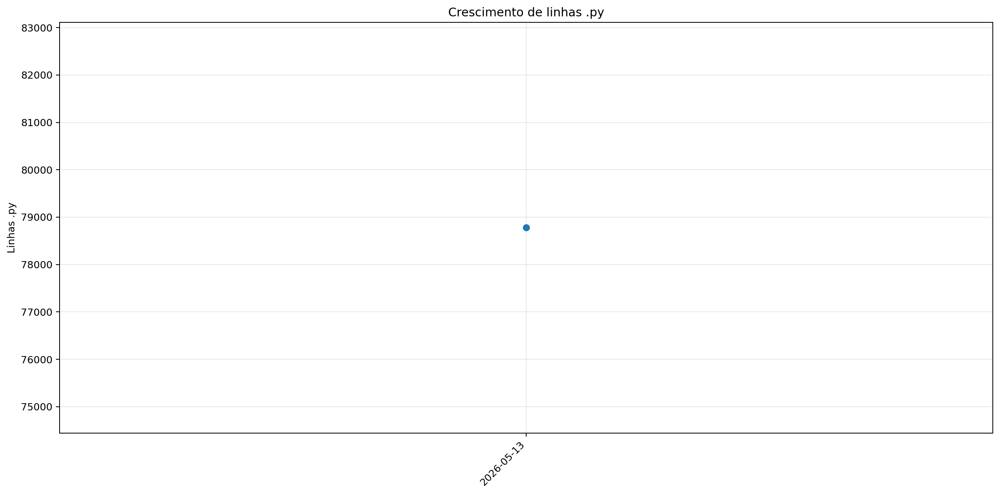

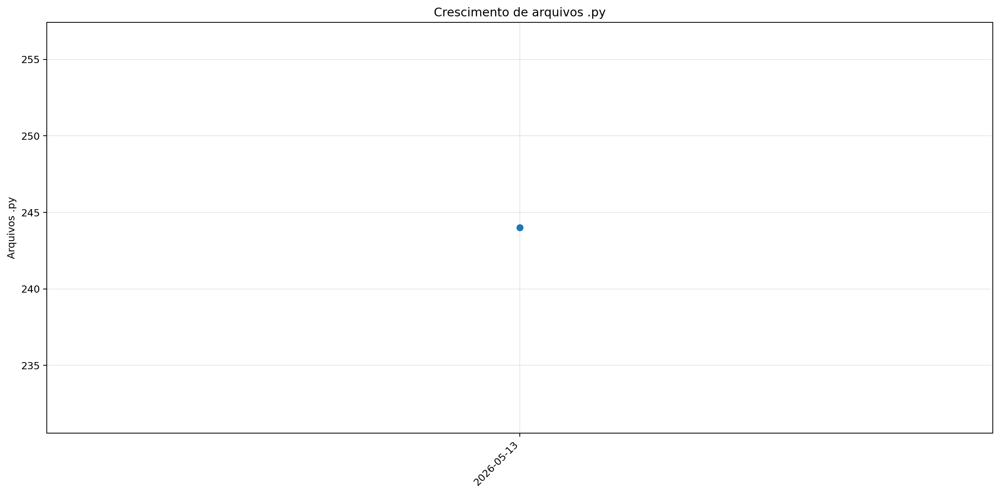

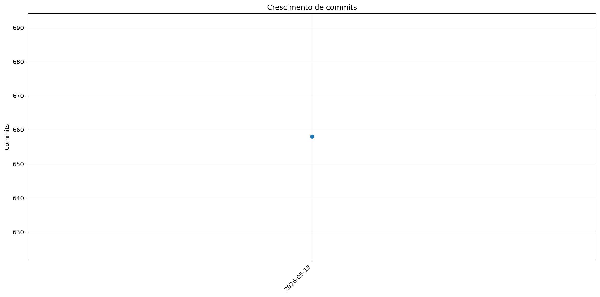

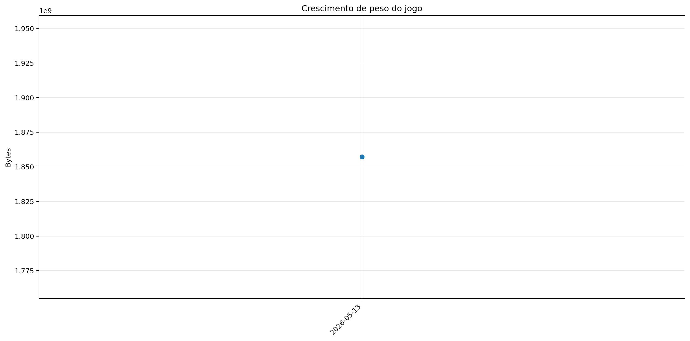


