# Registro

**Relatório:** #74  
**Projeto:** `Pokemon-Global-Server-Definitivo`  
**Gerado em:** 2026-05-19T21:46:34  
**Modelo de relatório:** 11  
**Autor:** Leon Cunha Alvaro Lopez Soto

## 1. Visão geral

- **Pastas:** 1.388
- **Arquivos:** 74.308
- **Arquivos de texto:** 680
- **Peso dos arquivos de texto:** 7006.95 KB
- **Tamanho total:** 1.921 GB (2.062.294.803 bytes)
- **Dias desde a criação do projeto:** 78
- **Dias desde a criação oficial:** 352
- **Horas estimadas:** 637.00
- **Linhas totais gerais:** 193.290
- **Commits (projeto):** 747
- **Adições desde o último relatório:** <span style='color: green'>+14.893</span>
- **Reduções desde o último relatório:** <span style='color: red'>-980</span>

## 2. Python

- **Arquivos `.py`:** 271
- **Linhas totais:** 87.691
- **Tamanho total `.py`:** 3862.47 KB
- **Classes encontradas:** 249
- **Funções encontradas:** 1.763
- **Métodos encontrados:** 3.427
- **Total funções + métodos:** 5.190
- **Bibliotecas diferentes usadas:** 48

## 3. Macro áreas

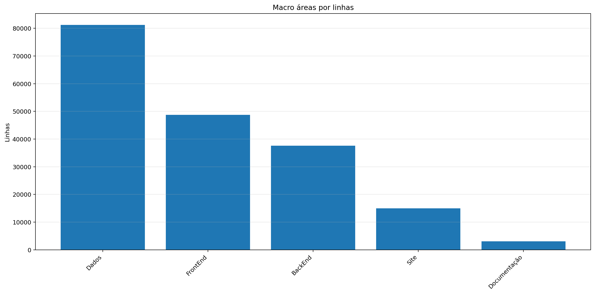

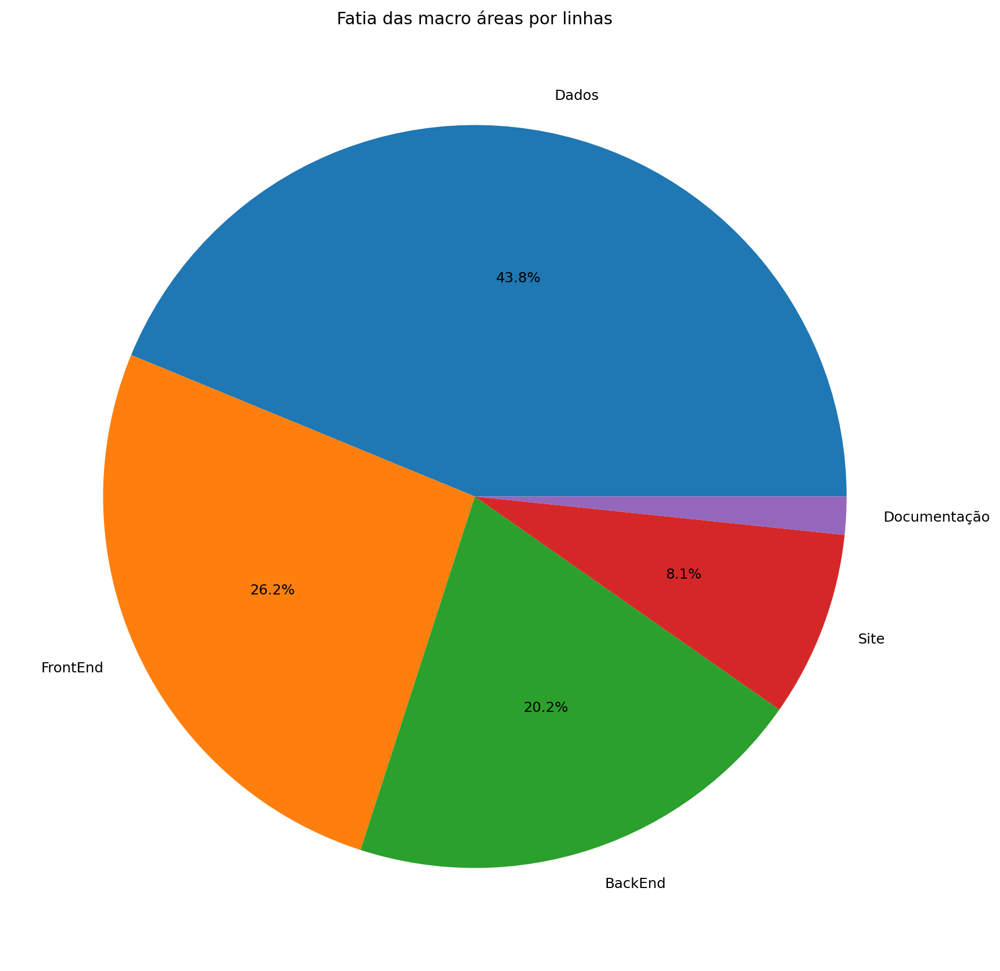

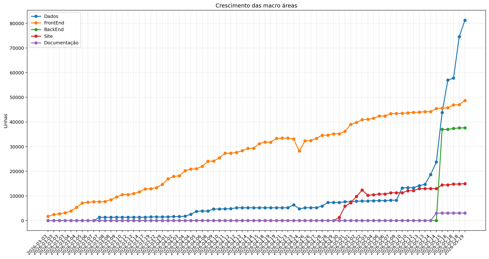

| Rank | Área | Caminho | Subpastas | Arquivos | Linhas gerais | Tamanho (KB) |
|---:|---|---|---:|---:|---:|---:|
| 1 | `Dados` | `Dados` | 17 | 177 | 81.271 | 2293.87 |
| 2 | `FrontEnd` | `Codigo + Game.py` | 20 | 190 | 48.721 | 2126.31 |
| 3 | `BackEnd` | `Servidor + ServidorGeral` | 14 | 141 | 37.587 | 1833.48 |
| 4 | `Site` | `Site/src` | 6 | 99 | 14.998 | 520.14 |
| 5 | `Documentação` | `Documentação` | 91 | 90 | 3.060 | 75.77 |

## 4. Principais pastas

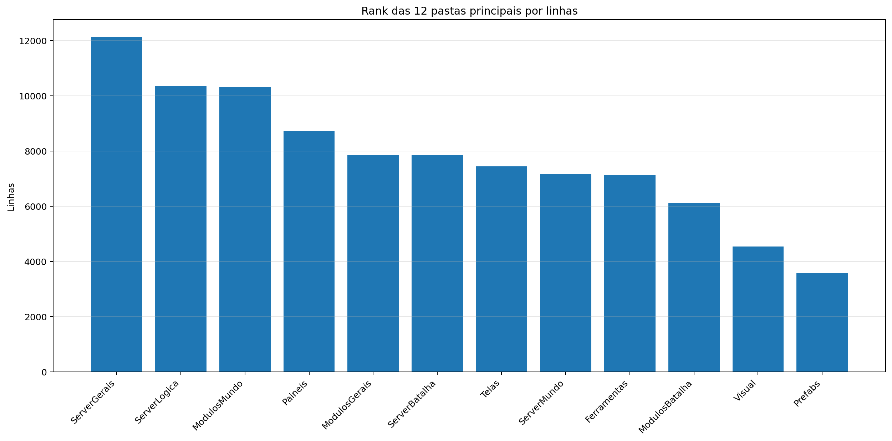

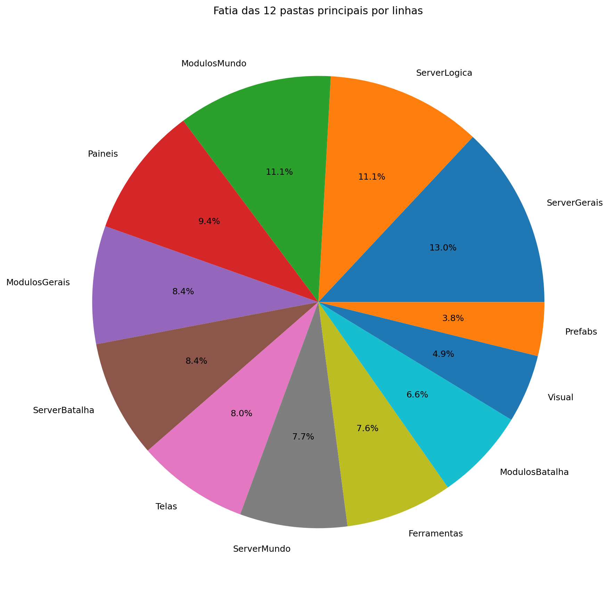

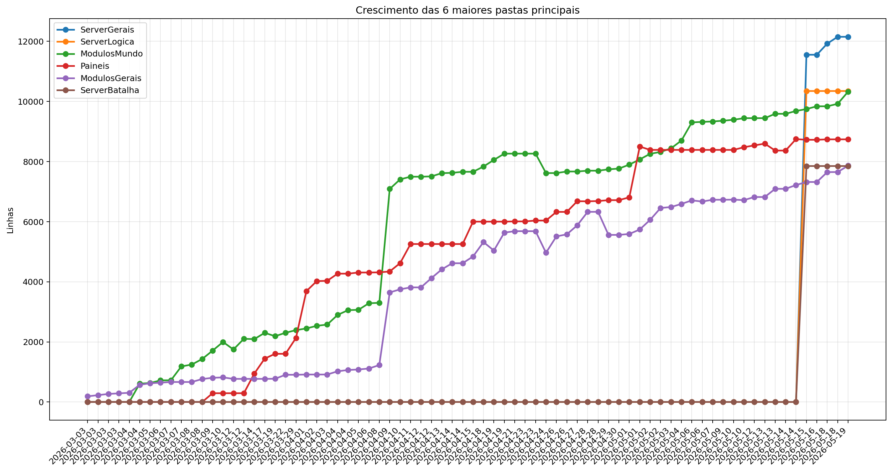

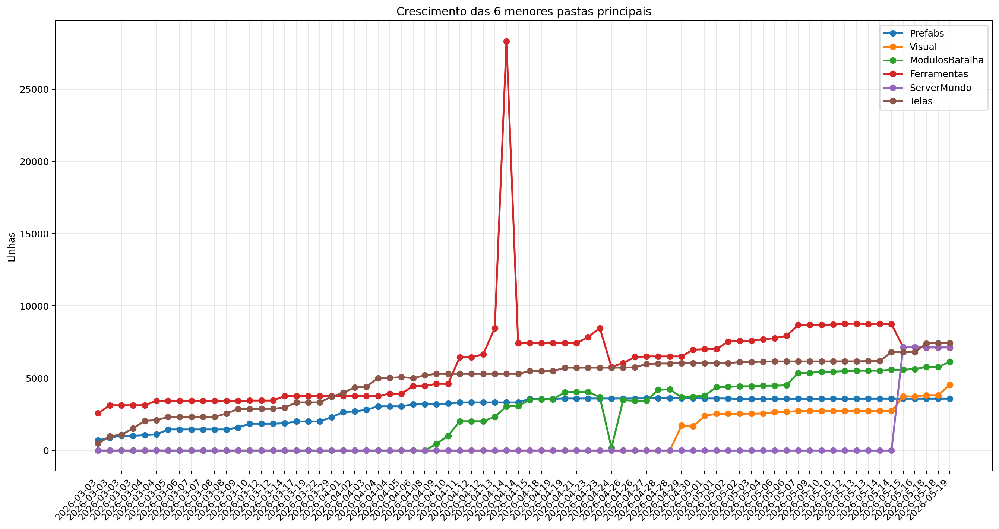

| Rank | Pasta | Subpastas | Arquivos | Linhas gerais | Tamanho (KB) |
|---:|---|---:|---:|---:|---:|
| 1 | `ServerGerais` | 4 | 57 | 12.151 | 652.44 |
| 2 | `ServerLogica` | 3 | 29 | 10.347 | 436.85 |
| 3 | `ModulosMundo` | 2 | 42 | 10.325 | 482.06 |
| 4 | `Paineis` | 0 | 18 | 8.739 | 390.24 |
| 5 | `ModulosGerais` | 2 | 36 | 7.863 | 326.01 |
| 6 | `ServerBatalha` | 1 | 28 | 7.851 | 363.74 |
| 7 | `Telas` | 2 | 22 | 7.446 | 293.66 |
| 8 | `ServerMundo` | 2 | 26 | 7.160 | 377.90 |
| 9 | `Ferramentas` | 0 | 11 | 7.131 | 275.36 |
| 10 | `ModulosBatalha` | 0 | 17 | 6.134 | 289.75 |
| 11 | `Visual` | 7 | 40 | 4.545 | 209.98 |
| 12 | `Prefabs` | 0 | 14 | 3.583 | 132.01 |

## 5. Arquitetura

### `Codigo/`

```text
Codigo/
├── ModulosBatalha/
│   ├── AnimadorAtaquesBatalha.py
│   ├── AplicadorDiffBatalhaCliente.py
│   ├── Arena.py
│   ├── ClimaBatalha.py
│   ├── ControladorAnimacoes.py
│   ├── ControladorBatalha.py
│   ├── ElementosHudBatalha.py
│   ├── FinalizadorBatalha.py
│   ├── FluxoBatalha.py
│   ├── IndicadorAtaque.py
│   ├── InicializadorBatalha.py
│   ├── LeitorLogs.py
│   ├── MontadorJogadas.py
│   ├── PlayerBatalha.py
│   ├── PokemonBatalha.py
│   ├── RenderizadorBatalha.py
│   └── SeletorCapturaBatalha.py
├── ModulosGerais/
│   ├── Cenas/
│   │   ├── CenaCarregamento.py
│   │   ├── CenaCombate.py
│   │   ├── CenaLogin.py
│   │   ├── CenaMenu.py
│   │   ├── CenaMundo.py
│   │   ├── ControladorCenas.py
│   │   ├── EventosCenaMundo.py
│   │   ├── FluxoCenaMundo.py
│   │   └── RenderCenaMundo.py
│   ├── Server/
│   │   ├── GerenciadorServerList.py
│   │   ├── Login.py
│   │   ├── ServerBatalha.py
│   │   ├── ServerLogin.py
│   │   ├── ServerMenu.py
│   │   ├── ServerMundo.py
│   │   └── ServerTerminal.py
│   ├── Auxiliares.py
│   ├── Camera.py
│   ├── Colisor.py
│   ├── CompositorModernGL.py
│   ├── DesenhaAtor.py
│   ├── DesenhoMapa.py
│   ├── Discord.py
│   ├── EfeitosTela.py
│   ├── FiltroCamera.py
│   ├── GerenciadorPokemons.py
│   ├── GerenciadorTiles.py
│   ├── ImagensMapa.py
│   ├── LoaderCatalogos.py
│   ├── LoaderTabelas.py
│   ├── LogoMenu.py
│   ├── ModuladorRegras.py
│   ├── PipelineGrafica.py
│   ├── PropriedadesAtaques.py
│   ├── ServicoSkills.py
│   └── Sonoridades.py
├── ModulosMundo/
│   ├── Geradores/
│   │   ├── Player/
│   │   │   ├── Controle.py
│   │   │   ├── Inventario.py
│   │   │   ├── Perfil.py
│   │   │   └── Player.py
│   │   ├── Armadilhas.py
│   │   ├── Ator.py
│   │   ├── Baus.py
│   │   ├── ConstrutorDungeon.py
│   │   ├── Doce.py
│   │   ├── Dungeon.py
│   │   ├── Estadio.py
│   │   ├── EstruturaNaturais.py
│   │   ├── ItemInventario.py
│   │   ├── ItemMundo.py
│   │   ├── PokemonInventario.py
│   │   ├── PokemonMundo.py
│   │   ├── portal.py
│   │   ├── Projetil.py
│   │   └── XpMundo.py
│   ├── AtualizadorObjetos.py
│   ├── CacheChunksMundo.py
│   ├── ControladorAtores.py
│   ├── ControladorCriaveis.py
│   ├── ControladorDungeons.py
│   ├── ControladorMundo.py
│   ├── ControladorObjetos.py
│   ├── ControladorPlayer.py
│   ├── ElementosHudMundo.py
│   ├── ExecutaveisPoção.py
│   ├── InteracoesObjetos.py
│   ├── InteracoesPlayer.py
│   ├── LeitorDialogo.py
│   ├── LeitorMundo.py
│   ├── Loja.py
│   ├── MecanicasTiles.py
│   ├── Minimapa.py
│   ├── MovimentoPlayer.py
│   ├── RenderizadorChunksMundo.py
│   ├── RenderizadorObjetos.py
│   ├── ServicoCraft.py
│   ├── ServicoMapaMundo.py
│   └── SistemaPacotes.py
├── Paineis/
│   ├── Container.py
│   ├── FichaAtaque.py
│   ├── FichaItem.py
│   ├── FichaPokemon.py
│   ├── FichaPokemonBatalha.py
│   ├── MiniPaineisConhecimentos.py
│   ├── PainelAcoes.py
│   ├── PainelArvoreHabilidades.py
│   ├── PainelAuxiliarPoke.py
│   ├── PainelCaptura.py
│   ├── PainelConhecimento.py
│   ├── PainelCraft.py
│   ├── PainelEstatisticas.py
│   ├── PainelGaleria.py
│   ├── PainelProgresso.py
│   ├── PainelReceitas.py
│   ├── PainelTimes.py
│   └── VisualizadorLog.py
├── Prefabs/
│   ├── Arrastavel.py
│   ├── Barra.py
│   ├── BarraPesquisa.py
│   ├── Botao.py
│   ├── CaixaTexto.py
│   ├── EfeitosVisuais.py
│   ├── Fluxos.py
│   ├── Mensagem.py
│   ├── Opcoes.py
│   ├── Painel.py
│   ├── Terminal.py
│   ├── Texto.py
│   ├── TextoCinematico.py
│   └── Tooltip.py
├── Telas/
│   ├── Subtelas/
│   │   ├── Subtela.py
│   │   ├── SubtelaCriarPersonagem.py
│   │   ├── SubtelaDialogo.py
│   │   ├── SubtelaFinalizacao.py
│   │   ├── SubtelaInventario.py
│   │   ├── SubtelaInventarioEstatisticas.py
│   │   ├── SubtelaInventarioItens.py
│   │   ├── SubtelaInventarioPokemons.py
│   │   ├── SubtelaMundo.py
│   │   ├── SubtelaOpcoes.py
│   │   └── SubtelaPreBatalha.py
│   └── Telas/
│       ├── TelaConfig.py
│       ├── TelaConfigAvancada.py
│       ├── TelaConta.py
│       ├── TelaCreditos.py
│       ├── TelaLogin.py
│       ├── TelaMapa.py
│       ├── TelaMenu.py
│       ├── TelaMorrer.py
│       ├── TelaOperador.py
│       ├── TelaServers.py
│       └── TelasGenericas.py
└── Visual/
    ├── Shaders/
    │   ├── comum/
    │   │   ├── amostras.glsl
    │   │   ├── constantes.glsl
    │   │   ├── cores.glsl
    │   │   ├── geometria.glsl
    │   │   └── ruido.glsl
    │   ├── efeitos/
    │   │   ├── batalha/
    │   │   │   ├── areas_batalha.glsl
    │   │   │   ├── ataques_batalha.glsl
    │   │   │   ├── clima_batalha.glsl
    │   │   │   └── estados_batalha.glsl
    │   │   ├── hud/
    │   │   │   ├── menu_logo.glsl
    │   │   │   └── texto_cinematico.glsl
    │   │   ├── mundo/
    │   │   │   ├── biomas_mundo.glsl
    │   │   │   ├── captura.glsl
    │   │   │   ├── clima_mundo.glsl
    │   │   │   ├── dungeon_ambiente.glsl
    │   │   │   └── grade_global.glsl
    │   │   ├── biomas_mundo.glsl
    │   │   ├── captura.glsl
    │   │   ├── clima_batalha.glsl
    │   │   ├── clima_mundo.glsl
    │   │   ├── grade_global.glsl
    │   │   └── menu_logo.glsl
    │   ├── uniformes/
    │   │   ├── ataques.glsl
    │   │   ├── batalha.glsl
    │   │   ├── globais.glsl
    │   │   ├── hud.glsl
    │   │   └── mundo.glsl
    │   ├── compositor.frag
    │   ├── compositor.vert
    │   └── comum.glsl
    ├── ArenaAnimator.py
    ├── ArenaBatalhaVisual.py
    ├── AtorEstado.py
    ├── AuxiliaresVisuais.py
    ├── ContatoIrregularAnimator.py
    ├── PokemonBatalhaAnimator.py
    ├── PokemonBatalhaEstado.py
    ├── PokemonMundoAnimator.py
    ├── PokemonMundoEstado.py
    └── ProjetilBatalha.py
```

### `Server/`

```text
Servidor/
├── Batalha/
│   ├── BatalhaIA/
│   │   ├── AvaliadorIA.py
│   │   ├── ConfigIA.py
│   │   ├── ContextoIA.py
│   │   ├── ControladorIA.py
│   │   ├── ControladorIABoss.py
│   │   ├── FallbackIA.py
│   │   ├── GeradorAcoesIA.py
│   │   ├── HackerIA.py
│   │   ├── MacroSimulador.py
│   │   ├── MemoriaIA.py
│   │   ├── MetadadosIA.py
│   │   ├── MicroSimulador.py
│   │   └── PlanejadorIA.py
│   ├── Alvificacao.py
│   ├── CalculoDanoBatalha.py
│   ├── ColetorAcoes.py
│   ├── Construto.py
│   ├── ConstrutorLog.py
│   ├── ExecutorAcoesBatalha.py
│   ├── FraquezasResistencia.py
│   ├── GerenciadorPartidas.py
│   ├── IDsBatalha.py
│   ├── InicializadorPartida.py
│   ├── Partida.py
│   ├── PokemonBatalha.py
│   ├── PropriedadesAtaques.py
│   ├── ResolvedorFlags.py
│   └── RodadorTurno.py
├── Gerais/
│   ├── Geradores/
│   │   ├── Java/
│   │   │   ├── classes/
│   │   │   │   ├── Biome.class
│   │   │   │   ├── BiomeDefinition.class
│   │   │   │   ├── BiomeRules.class
│   │   │   │   ├── ClimateSource.class
│   │   │   │   ├── GeneratorContext$1.class
│   │   │   │   ├── GeneratorContext.class
│   │   │   │   ├── GeradorBiomas$1.class
│   │   │   │   ├── GeradorBiomas.class
│   │   │   │   ├── GeradorDungeons$DungeonDef.class
│   │   │   │   ├── GeradorDungeons.class
│   │   │   │   ├── GeradorImagens$1.class
│   │   │   │   ├── GeradorImagens.class
│   │   │   │   ├── GeradorLocalidades.class
│   │   │   │   ├── GeradorObjetos.class
│   │   │   │   ├── GeradorRotas$RouteCandidate.class
│   │   │   │   ├── GeradorRotas$RouteNode.class
│   │   │   │   ├── GeradorRotas.class
│   │   │   │   ├── GeradorTerreno.class
│   │   │   │   ├── LocalityPoiConfig.class
│   │   │   │   ├── LocalityRules.class
│   │   │   │   ├── NaturalStructure.class
│   │   │   │   ├── NoiseLayerConfig.class
│   │   │   │   ├── Poi.class
│   │   │   │   ├── PoiConfig.class
│   │   │   │   ├── PoiType.class
│   │   │   │   ├── RegionData.class
│   │   │   │   ├── RouteData.class
│   │   │   │   ├── RouteRules.class
│   │   │   │   ├── SimpleToml.class
│   │   │   │   ├── TerrainRules.class
│   │   │   │   ├── Tile.class
│   │   │   │   ├── TomlTable.class
│   │   │   │   └── WorldGenerator.class
│   │   │   ├── GeradorBiomas.java
│   │   │   ├── GeradorDungeons.java
│   │   │   ├── GeradorImagens.java
│   │   │   ├── GeradorLocalidades.java
│   │   │   ├── GeradorObjetos.java
│   │   │   ├── GeradorRotas.java
│   │   │   ├── GeradorTerreno.java
│   │   │   └── WorldGenerator.java
│   │   ├── AplicadorConfigMundo.py
│   │   ├── GeradorBaus.py
│   │   ├── GeradorDungeons.py
│   │   ├── GeradorMundo.py
│   │   └── GeradorPokemon.py
│   ├── Rotas/
│   │   ├── Ativador.py
│   │   ├── Atualizador.py
│   │   ├── Entrada.py
│   │   ├── RotasBatalha.py
│   │   ├── ServerOperar.py
│   │   └── Terminal.py
│   ├── ContextoServidor.py
│   ├── EstadoServidor.py
│   ├── LoaderCatalogos.py
│   ├── LoaderRegras.py
│   └── LoaderTabelas.py
├── Logica/
│   ├── Comandos/
│   │   ├── Comandos.py
│   │   ├── ComandosBatalha.py
│   │   ├── ComandosGeral.py
│   │   └── ComandosMundo.py
│   └── Executes/
│       ├── ExecutesAtaques/
│       │   ├── ControladorExecutes.py
│       │   ├── ExecutesAgua.py
│       │   ├── ExecutesCosmico.py
│       │   ├── ExecutesDragao.py
│       │   ├── ExecutesEletrico.py
│       │   ├── ExecutesFada.py
│       │   ├── ExecutesFantasma.py
│       │   ├── ExecutesFogo.py
│       │   ├── ExecutesGelo.py
│       │   ├── ExecutesInseto.py
│       │   ├── ExecutesLutador.py
│       │   ├── ExecutesMetal.py
│       │   ├── ExecutesNormal.py
│       │   ├── ExecutesPedra.py
│       │   ├── ExecutesPlanta.py
│       │   ├── ExecutesPsiquico.py
│       │   ├── ExecutesSombrio.py
│       │   ├── ExecutesSonoro.py
│       │   ├── ExecutesTerrestre.py
│       │   ├── ExecutesVeneno.py
│       │   ├── ExecutesVoador.py
│       │   └── UtilitariosExecutes.py
│       ├── ExecutesFrutas.py
│       ├── ExecutesPokebolas.py
│       └── PassivasEquipaveis.py
└── Mundo/
    ├── Cerebros/
    │   ├── CerebroBaus.py
    │   ├── CerebroCentral.py
    │   ├── CerebroDungeons.py
    │   ├── CerebroEstadios.py
    │   ├── CerebroEstruturasNaturais.py
    │   ├── CerebroItensMundo.py
    │   ├── CerebroNPCs.py
    │   ├── CerebroPokemons.py
    │   ├── CerebroProjeteis.py
    │   ├── CerebroSpawnPokemons.py
    │   ├── CerebroTempo.py
    │   └── CerebroXpMundo.py
    ├── Dungeons/
    │   ├── __init__.py
    │   └── EstadoDungeon.py
    ├── AutoridadeCaptura.py
    ├── BancoDados.py
    ├── CerebroArmadilhas.py
    ├── Colisor.py
    ├── DungeonBatalha.py
    ├── DungeonGeometria.py
    ├── EstadioGeometria.py
    ├── InicializadorNPC.py
    ├── ObjetosMundoServer.py
    ├── PacotesTick.py
    ├── ServicoInventario.py
    └── TiqueServidor.py
```

### `Dados/`

```text
Dados/
├── Ataques/
│   ├── MetaDadosAtaques/
│   │   ├── MetaDadosAgua.json
│   │   ├── MetaDadosCosmico.json
│   │   ├── MetaDadosDragao.json
│   │   ├── MetaDadosEletrico.json
│   │   ├── MetaDadosFada.json
│   │   ├── MetaDadosFantasma.json
│   │   ├── MetaDadosFogo.json
│   │   ├── MetaDadosGelo.json
│   │   ├── MetaDadosInseto.json
│   │   ├── MetaDadosLutador.json
│   │   ├── MetaDadosMetal.json
│   │   ├── MetaDadosNormal.json
│   │   ├── MetaDadosPedra.json
│   │   ├── MetaDadosPlanta.json
│   │   ├── MetaDadosPsiquico.json
│   │   ├── MetaDadosSombrio.json
│   │   ├── MetaDadosSonoro.json
│   │   ├── MetaDadosTerrestre.json
│   │   ├── MetaDadosVeneno.json
│   │   └── MetaDadosVoador.json
│   └── PropriedadesAtaques/
│       ├── PropriedadesAgua.json
│       ├── PropriedadesCosmico.json
│       ├── PropriedadesDragao.json
│       ├── PropriedadesEletrico.json
│       ├── PropriedadesFada.json
│       ├── PropriedadesFantasma.json
│       ├── PropriedadesFogo.json
│       ├── PropriedadesGelo.json
│       ├── PropriedadesInseto.json
│       ├── PropriedadesLutador.json
│       ├── PropriedadesMetal.json
│       ├── PropriedadesNormal.json
│       ├── PropriedadesPedra.json
│       ├── PropriedadesPlanta.json
│       ├── PropriedadesPsiquico.json
│       ├── PropriedadesSombrio.json
│       ├── PropriedadesSonoro.json
│       ├── PropriedadesTerrestre.json
│       ├── PropriedadesVeneno.json
│       └── PropriedadesVoador.json
├── Catalogos/
│   ├── Baus.json
│   ├── Comandos.json
│   ├── Creditos.json
│   ├── Dungeon.json
│   ├── MoveList.json
│   ├── Musicas.json
│   ├── Receitas.json
│   └── Sons.json
├── Dialogos/
│   ├── Combatentes/
│   │   ├── Capitaes/
│   │   │   ├── Bento Seda.json
│   │   │   ├── Breno Punho.json
│   │   │   ├── Caio Ferraz.json
│   │   │   ├── Cássio Estelar.json
│   │   │   ├── Dante Brasa.json
│   │   │   ├── Flora Encanto.json
│   │   │   ├── Gaia Verde.json
│   │   │   ├── Helena Voltz.json
│   │   │   ├── Isabela Geada.json
│   │   │   ├── Luan Eco.json
│   │   │   ├── Luna Véu.json
│   │   │   ├── Marina Maré.json
│   │   │   ├── Mauro Umbra.json
│   │   │   ├── Nora Campos.json
│   │   │   ├── Nádia Víbora.json
│   │   │   ├── Petra Rocha.json
│   │   │   ├── Ryu Draconi.json
│   │   │   ├── Téo Barro.json
│   │   │   ├── Vânia Celeste.json
│   │   │   └── Ícaro Mente.json
│   │   ├── Desafiantes/
│   │   │   ├── Alice Ferraz.json
│   │   │   ├── Aurora Cosmo.json
│   │   │   ├── Bianca Neve.json
│   │   │   ├── Cael Víbora.json
│   │   │   ├── Clara Campos.json
│   │   │   ├── Cíntia Véu.json
│   │   │   ├── Davi Areia.json
│   │   │   ├── Enzo Raio.json
│   │   │   ├── Hugo Punho.json
│   │   │   ├── Ian Casulo.json
│   │   │   ├── Kael Draco.json
│   │   │   ├── Lia Azul.json
│   │   │   ├── Melina Eco.json
│   │   │   ├── Mirela Encanto.json
│   │   │   ├── Olívia Broto.json
│   │   │   ├── Otávio Umbra.json
│   │   │   ├── Raul Granito.json
│   │   │   ├── Ravi Chamas.json
│   │   │   ├── Sofia Prisma.json
│   │   │   └── Yuri Asa.json
│   │   ├── Dissociados/
│   │   │   └── .gitkeep
│   │   └── Lideres/
│   │       ├── Alleka.json
│   │       ├── Amable.json
│   │       ├── Caio.json
│   │       ├── Felipox.json
│   │       ├── Felps.json
│   │       ├── Ferraz.json
│   │       ├── Garcia.json
│   │       ├── Guedes.json
│   │       ├── Henrique.json
│   │       ├── João.json
│   │       ├── Lisciele.json
│   │       ├── Murilo.json
│   │       ├── Nathzinha.json
│   │       ├── Paulo.json
│   │       ├── Ph.json
│   │       ├── Ramos.json
│   │       ├── Sidney.json
│   │       ├── Suneiva.json
│   │       ├── Suriane.json
│   │       └── Vasques.json
│   ├── Exemplos/
│   │   ├── ExemploCapitao_Laura.json
│   │   ├── ExemploDesafiante_Ravi.json
│   │   ├── ExemploDissociado_Nico.json
│   │   ├── ExemploLider_Alleka.json
│   │   └── ManualDialogos.json
│   └── Vendedores/
│       ├── Itens/
│       │   ├── .gitkeep
│       │   ├── Bianca.json
│       │   ├── Cecília.json
│       │   ├── Dário.json
│       │   ├── Estela.json
│       │   ├── Igor.json
│       │   ├── Osvaldo.json
│       │   ├── Priscila.json
│       │   ├── Ramon.json
│       │   ├── Samira.json
│       │   └── Valter.json
│       ├── Moedas/
│       │   ├── Bruno.json
│       │   ├── Clarice.json
│       │   ├── Danilo.json
│       │   ├── Edward Newgate.json
│       │   ├── Hans.json
│       │   ├── Helena.json
│       │   ├── Josefa.json
│       │   ├── Kleber.json
│       │   ├── Lia.json
│       │   ├── Marina.json
│       │   ├── Michel.json
│       │   ├── Mirela.json
│       │   ├── Mortis.json
│       │   ├── Nicolas.json
│       │   ├── Olavo.json
│       │   ├── Ravena.json
│       │   ├── Rubiano.json
│       │   ├── Selena.json
│       │   ├── Tatiana.json
│       │   └── Vanessa.json
│       └── Pokemons/
│           ├── .gitkeep
│           ├── Baltazar.json
│           ├── Carmen Noctis.json
│           ├── Morigan.json
│           ├── Nair Sombria.json
│           └── Vlad.json
├── Regras/
│   ├── Batalha.toml
│   ├── Biomas.toml
│   ├── Camera.toml
│   ├── Ciclo.toml
│   ├── Dungeons.toml
│   ├── EstruturasNaturais.toml
│   ├── Localidades.toml
│   ├── Mundo.toml
│   ├── NPCs.toml
│   ├── Player.toml
│   ├── Pokemons.toml
│   ├── Projeteis.toml
│   ├── Server.toml
│   ├── Skils.toml
│   ├── Spawn.toml
│   └── Terreno.toml
└── Tabelas/
    ├── Pokemon Global Server - Ataques.csv
    ├── Pokemon Global Server - Dungeons.csv
    ├── Pokemon Global Server - Efeitos.csv
    ├── Pokemon Global Server - Equipaveis.csv
    ├── Pokemon Global Server - Itens.csv
    ├── Pokemon Global Server - NPC Combatente.csv
    ├── Pokemon Global Server - NPC Vendedor.csv
    ├── Pokemon Global Server - Pokemons.csv
    ├── Pokemon Global Server - Sistema FR.csv
    └── Pokemon Global Server - Spawn.csv
```

### `Site/`

```text
Site/
├── public/
│   ├── Ataques/
│   ├── Atributos/
│   ├── Efeitos/
│   ├── Equipaveis/
│   ├── Ferramentas/
│   ├── Frutas/
│   ├── GlobalServer/
│   ├── Imagens/
│   ├── Insigneas/
│   ├── Medalhoes/
│   ├── Musicas/
│   │   ├── Batalha/
│   │   │   ├── BatalhasTipos/
│   │   │   ├── Bosses/
│   │   │   ├── Confrontos/
│   │   │   ├── Fechamento/
│   │   │   └── Lideres/
│   │   ├── Menu/
│   │   └── Mundo/
│   ├── Objetos/
│   ├── Pokebolas/
│   ├── Poções/
│   ├── Recursos/
│   ├── Skins/
│   └── Tipos/
├── src/
│   ├── Codigo/
│   │   ├── AssetsPublicos.js
│   │   ├── AtaquesRuntime.js
│   │   ├── AtaquesWikiDados.js
│   │   ├── ComandosRuntime.js
│   │   ├── ComandosWikiDados.js
│   │   ├── CombateWikiDados.js
│   │   ├── DungeonsRuntime.js
│   │   ├── DungeonsWikiDados.js
│   │   ├── EfeitosRuntime.js
│   │   ├── EfeitosWikiDados.js
│   │   ├── EquipaveisRuntime.js
│   │   ├── EquipaveisWikiDados.js
│   │   ├── EstadiosRuntime.js
│   │   ├── HabilidadesRuntime.js
│   │   ├── HabilidadesWikiDados.js
│   │   ├── ItemWikiDados.js
│   │   ├── ItensRuntime.js
│   │   ├── MundoRuntime.js
│   │   ├── MundoWikiDados.js
│   │   ├── MusicasRuntime.js
│   │   ├── MusicasWikiDados.js
│   │   ├── NpcsRuntime.js
│   │   ├── NpcsWikiDados.js
│   │   ├── PokedexRuntime.js
│   │   ├── PokemonWikiDados.js
│   │   ├── RelatoriosDados.js
│   │   ├── RelatoriosRuntime.js
│   │   ├── RotasSite.js
│   │   ├── SistemasPorTrasDoJogo.js
│   │   ├── site.js
│   │   ├── WikiCsv.js
│   │   └── WikiRuntimeBase.js
│   ├── Componentes/
│   │   ├── Botao.astro
│   │   ├── CampoBuscaWiki.astro
│   │   ├── CardCatalogo.astro
│   │   ├── CardWiki.astro
│   │   ├── DetalheTopo.astro
│   │   ├── FaixaMusica.astro
│   │   ├── FiltroTipoIcones.astro
│   │   ├── Footer.astro
│   │   ├── Header.astro
│   │   ├── JsonPayload.astro
│   │   ├── Layout.astro
│   │   ├── ModalControles.astro
│   │   ├── ModalDetalhe.astro
│   │   ├── NpcDetalheModal.astro
│   │   ├── PainelDetalhe.astro
│   │   ├── PokemonDetalheModal.astro
│   │   ├── ResumoWiki.astro
│   │   ├── SelectFiltroWiki.astro
│   │   ├── TipoIcone.astro
│   │   ├── WikiCatalogoShell.astro
│   │   ├── WikiGrid.astro
│   │   ├── WikiMenu.astro
│   │   ├── WikiStatus.astro
│   │   ├── WikiToolbar.astro
│   │   ├── WikiTopo.astro
│   │   └── WikiVazio.astro
│   ├── Estilos/
│   │   ├── auth.css
│   │   ├── global.css
│   │   ├── home.css
│   │   ├── por-tras-do-jogo.css
│   │   ├── wiki-ataques.css
│   │   ├── wiki-base.css
│   │   ├── wiki-cards.css
│   │   ├── wiki-catalogos.css
│   │   ├── wiki-combate.css
│   │   ├── wiki-dungeons.css
│   │   ├── wiki-equipaveis.css
│   │   ├── wiki-itens.css
│   │   ├── wiki-modal.css
│   │   ├── wiki-mundo.css
│   │   ├── wiki-musicas.css
│   │   ├── wiki-pokedex.css
│   │   └── wiki.css
│   └── pages/
│       ├── por-tras-do-jogo/
│       │   ├── [sistema].astro
│       │   ├── index.astro
│       │   └── relatorio.astro
│       ├── wiki/
│       │   ├── ataques.astro
│       │   ├── comandos.astro
│       │   ├── combate.astro
│       │   ├── dungeons.astro
│       │   ├── efeitos.astro
│       │   ├── equipaveis.astro
│       │   ├── estadios.astro
│       │   ├── habilidades.astro
│       │   ├── index.astro
│       │   ├── itens.astro
│       │   ├── lore.astro
│       │   ├── mundo.astro
│       │   ├── musicas.astro
│       │   ├── npcs.astro
│       │   ├── pokemons.astro
│       │   ├── receitas.astro
│       │   └── tipos.astro
│       ├── conta.astro
│       ├── contato.astro
│       ├── download.astro
│       └── index.astro
├── astro.config.mjs
└── package.json
```

### `Ferramentas/`

```text
Ferramentas/
├── AtualizadorReadMe.py
├── AtualizadorRelatorios.py
├── ConfigFixa.py
├── EditorAnimaçãoAtaques.py
├── EditorSkins.py
├── GameTestFPS.py
├── GeradorRelatorios.py
├── IlustradorSalas.py
├── Mixer.py
├── OtimizadorSite.py
└── SimuladorBatalha.py
```

## 6. Ranks

### Top 50 maiores arquivos `.py` por linhas

| Arquivo | Linhas | Tamanho (KB) |
|---|---:|---:|
| `Ferramentas/GeradorRelatorios.py` | 2.117 | 80.24 |
| `Servidor/Gerais/EstadoServidor.py` | 1.930 | 81.56 |
| `Codigo/Paineis/FichaPokemon.py` | 1.269 | 57.20 |
| `Codigo/ModulosBatalha/MontadorJogadas.py` | 1.210 | 60.39 |
| `Servidor/Gerais/Geradores/GeradorDungeons.py` | 1.167 | 52.78 |
| `Servidor/Gerais/Geradores/GeradorPokemon.py` | 1.152 | 47.15 |
| `Ferramentas/EditorAnimaçãoAtaques.py` | 1.118 | 48.05 |
| `Codigo/Telas/Subtelas/SubtelaInventarioPokemons.py` | 1.105 | 50.69 |
| `Codigo/Paineis/VisualizadorLog.py` | 1.101 | 64.15 |
| `Servidor/Batalha/PokemonBatalha.py` | 1.066 | 53.90 |
| `Servidor/Batalha/Partida.py` | 1.031 | 51.44 |
| `Servidor/Logica/Executes/ExecutesAtaques/UtilitariosExecutes.py` | 1.019 | 43.10 |
| `Servidor/Mundo/Cerebros/CerebroDungeons.py` | 944 | 55.30 |
| `Servidor/Mundo/BancoDados.py` | 821 | 40.67 |
| `Codigo/Prefabs/Texto.py` | 819 | 31.41 |
| `Servidor/Gerais/Rotas/Atualizador.py` | 786 | 42.57 |
| `Codigo/ModulosMundo/Loja.py` | 785 | 38.47 |
| `Codigo/ModulosGerais/Sonoridades.py` | 770 | 23.69 |
| `Codigo/Visual/PokemonBatalhaAnimator.py` | 770 | 34.54 |
| `Servidor/Gerais/Geradores/GeradorMundo.py` | 770 | 30.84 |
| `Servidor/Mundo/Cerebros/CerebroNPCs.py` | 747 | 39.45 |
| `Codigo/Paineis/FichaPokemonBatalha.py` | 733 | 35.90 |
| `Ferramentas/IlustradorSalas.py` | 695 | 31.49 |
| `Codigo/ModulosMundo/Geradores/PokemonMundo.py` | 688 | 33.25 |
| `Servidor/Logica/Executes/ExecutesAtaques/ExecutesAgua.py` | 678 | 29.96 |
| `Codigo/ModulosGerais/ImagensMapa.py` | 669 | 29.71 |
| `Servidor/Logica/Executes/ExecutesAtaques/ExecutesLutador.py` | 662 | 28.73 |
| `Codigo/Paineis/Container.py` | 640 | 23.55 |
| `Ferramentas/AtualizadorRelatorios.py` | 639 | 22.97 |
| `Servidor/Logica/Comandos/ComandosMundo.py` | 628 | 25.72 |
| `Codigo/Telas/Telas/TelaCreditos.py` | 622 | 26.98 |
| `Codigo/Paineis/PainelConhecimento.py` | 616 | 25.24 |
| `Codigo/ModulosMundo/Geradores/Player/Perfil.py` | 613 | 33.11 |
| `Servidor/Gerais/LoaderRegras.py` | 609 | 35.45 |
| `Codigo/Visual/PokemonBatalhaEstado.py` | 599 | 27.12 |
| `Servidor/Gerais/Rotas/Ativador.py` | 589 | 29.20 |
| `Codigo/Telas/Telas/TelaServers.py` | 581 | 18.36 |
| `Codigo/Telas/Subtelas/SubtelaMundo.py` | 571 | 20.55 |
| `Servidor/Logica/Executes/ExecutesAtaques/ExecutesVoador.py` | 559 | 23.83 |
| `Codigo/ModulosBatalha/ControladorAnimacoes.py` | 553 | 25.20 |
| `Codigo/Telas/Telas/TelasGenericas.py` | 547 | 18.58 |
| `Codigo/ModulosGerais/Cenas/ControladorCenas.py` | 540 | 22.66 |
| `Servidor/Mundo/InicializadorNPC.py` | 538 | 27.63 |
| `Codigo/Visual/ContatoIrregularAnimator.py` | 529 | 23.57 |
| `Codigo/ModulosGerais/CompositorModernGL.py` | 528 | 23.59 |
| `Ferramentas/GameTestFPS.py` | 528 | 18.17 |
| `Codigo/ModulosBatalha/Arena.py` | 520 | 23.68 |
| `Codigo/Telas/Subtelas/SubtelaInventarioItens.py` | 517 | 23.76 |
| `Servidor/Logica/Executes/ExecutesAtaques/ExecutesPsiquico.py` | 517 | 23.93 |
| `Codigo/ModulosBatalha/PokemonBatalha.py` | 514 | 24.97 |

### Top 20 maiores classes

| Arquivo | Classe | Linhas |
|---|---|---:|
| `Codigo/Paineis/FichaPokemon.py` | `FichaPokemon` | 1.246 |
| `Codigo/ModulosBatalha/MontadorJogadas.py` | `MontadorJogadas` | 1.163 |
| `Codigo/Telas/Subtelas/SubtelaInventarioPokemons.py` | `InventarioPokemons` | 1.075 |
| `Servidor/Batalha/Partida.py` | `Partida` | 987 |
| `Servidor/Batalha/PokemonBatalha.py` | `PokemonBatalha` | 983 |
| `Codigo/Paineis/VisualizadorLog.py` | `VisualizadorLog` | 911 |
| `Servidor/Mundo/Cerebros/CerebroDungeons.py` | `CerebroDungeons` | 906 |
| `Servidor/Mundo/BancoDados.py` | `BancoDadosMundo` | 791 |
| `Codigo/ModulosMundo/Loja.py` | `Loja` | 768 |
| `Codigo/Visual/PokemonBatalhaAnimator.py` | `PokemonAnimator` | 738 |
| `Servidor/Mundo/Cerebros/CerebroNPCs.py` | `CerebroNPCs` | 727 |
| `Codigo/Paineis/FichaPokemonBatalha.py` | `FichaPokemonBatalha` | 713 |
| `Codigo/ModulosMundo/Geradores/PokemonMundo.py` | `Pokemon` | 663 |
| `Codigo/Paineis/Container.py` | `Container` | 630 |
| `Codigo/ModulosGerais/ImagensMapa.py` | `GerenciadorImagensMapa` | 622 |
| `Codigo/ModulosMundo/Geradores/Player/Perfil.py` | `Perfil` | 606 |
| `Codigo/Telas/Telas/TelaCreditos.py` | `TelaCreditos` | 558 |
| `Codigo/Visual/PokemonBatalhaEstado.py` | `PokemonBatalhaEstado` | 543 |
| `Servidor/Mundo/InicializadorNPC.py` | `InicializadorNPC` | 523 |
| `Codigo/ModulosGerais/Cenas/ControladorCenas.py` | `ControladorCenas` | 519 |

### Top 20 maiores funções e métodos

| Arquivo | Nome | Tipo | Linhas |
|---|---|---:|---:|
| `Servidor/Gerais/Rotas/Atualizador.py` | `processar_atualizador_json` | funcao | 392 |
| `Codigo/Paineis/VisualizadorLog.py` | `VisualizadorLog._registro_evento` | metodo | 340 |
| `Ferramentas/GeradorRelatorios.py` | `coletar_metricas` | funcao | 252 |
| `Codigo/Prefabs/Fluxos.py` | `Fluxo.desenhar` | metodo | 249 |
| `Codigo/ModulosMundo/Geradores/Estadio.py` | `EstadioInterno.renderizar` | metodo | 196 |
| `Servidor/Gerais/Geradores/GeradorDungeons.py` | `gerar_dungeon_layout` | funcao | 186 |
| `Codigo/ModulosGerais/Cenas/FluxoCenaMundo.py` | `FluxoCenaMundoMixin.atualizar_cena` | metodo | 185 |
| `Servidor/Batalha/PokemonBatalha.py` | `PokemonBatalha.ReceberDano` | metodo | 177 |
| `Codigo/Telas/Telas/TelaMapa.py` | `TelaMapa.desenhar` | metodo | 164 |
| `Servidor/Batalha/PokemonBatalha.py` | `PokemonBatalha.ReceberEfeito` | metodo | 156 |
| `Servidor/Gerais/EstadoServidor.py` | `_mesclar_perfil_atualizacao` | funcao | 154 |
| `Ferramentas/GeradorRelatorios.py` | `gerar_markdown` | funcao | 151 |
| `Codigo/Telas/Subtelas/SubtelaInventarioPokemons.py` | `InventarioPokemons.atualizar` | metodo | 148 |
| `Servidor/Gerais/Geradores/GeradorMundo.py` | `_executar_world_generator` | funcao | 148 |
| `Codigo/ModulosGerais/Colisor.py` | `Colisor.resolver_movimento_com_colisores` | metodo | 146 |
| `Ferramentas/GeradorRelatorios.py` | `gerar_graficos` | funcao | 146 |
| `Servidor/Gerais/EstadoServidor.py` | `_normalizar_perfil` | funcao | 142 |
| `Servidor/Gerais/Rotas/Ativador.py` | `processar_ativador_json` | funcao | 142 |
| `Codigo/ModulosGerais/CompositorModernGL.py` | `CompositorModernGL.renderizar` | metodo | 132 |
| `Ferramentas/GeradorRelatorios.py` | `analisar_python_ast` | funcao | 132 |

### Top 10 arquivos mais importados

| Arquivo | Vezes importado |
|---|---:|
| `Codigo/Prefabs/Texto.py` | 48 |
| `Codigo/Prefabs/Botao.py` | 35 |
| `Servidor/Gerais/EstadoServidor.py` | 22 |
| `Servidor/Logica/Executes/ExecutesAtaques/UtilitariosExecutes.py` | 22 |
| `Codigo/ModulosGerais/Sonoridades.py` | 20 |
| `Codigo/ModulosMundo/Geradores/ItemInventario.py` | 18 |
| `Servidor/Mundo/BancoDados.py` | 18 |
| `Codigo/ModulosGerais/Auxiliares.py` | 15 |
| `Servidor/Gerais/LoaderRegras.py` | 14 |
| `Servidor/Mundo/ObjetosMundoServer.py` | 14 |

### Top 10 arquivos que mais importam

| Arquivo | Arquivos internos importados | Imports totais | Linhas |
|---|---:|---:|---:|
| `Servidor/Logica/Executes/ExecutesAtaques/ControladorExecutes.py` | 23 | 25 | 285 |
| `Servidor/Mundo/Cerebros/CerebroCentral.py` | 18 | 27 | 492 |
| `Codigo/Telas/Subtelas/SubtelaInventarioPokemons.py` | 17 | 22 | 1.105 |
| `Codigo/ModulosBatalha/ControladorBatalha.py` | 14 | 18 | 432 |
| `Codigo/ModulosGerais/Cenas/FluxoCenaMundo.py` | 14 | 17 | 469 |
| `Codigo/ModulosGerais/Cenas/ControladorCenas.py` | 13 | 19 | 540 |
| `Servidor/Gerais/Rotas/Atualizador.py` | 12 | 17 | 786 |
| `Servidor/Batalha/BatalhaIA/ControladorIA.py` | 12 | 16 | 166 |
| `Codigo/ModulosGerais/Cenas/CenaMundo.py` | 12 | 12 | 94 |
| `Servidor/Gerais/EstadoServidor.py` | 11 | 24 | 1.930 |

### Top 10 maiores arquivos por linhas

| Arquivo | Ext | Linhas |
|---|---:|---:|
| `Dados/Catalogos/Dungeon.json` | `.json` | 6.429 |
| `Ferramentas/GeradorRelatorios.py` | `.py` | 2.117 |
| `Servidor/Gerais/EstadoServidor.py` | `.py` | 1.930 |
| `Dados/Dialogos/Combatentes/Lideres/Vasques.json` | `.json` | 1.678 |
| `Dados/Dialogos/Combatentes/Lideres/Caio.json` | `.json` | 1.580 |
| `Dados/Dialogos/Combatentes/Lideres/Garcia.json` | `.json` | 1.393 |
| `Dados/Dialogos/Combatentes/Lideres/Guedes.json` | `.json` | 1.384 |
| `Dados/Dialogos/Combatentes/Lideres/Paulo.json` | `.json` | 1.342 |
| `Dados/Dialogos/Combatentes/Lideres/Alleka.json` | `.json` | 1.325 |
| `Dados/Tabelas/Pokemon Global Server - Pokemons.csv` | `.csv` | 1.309 |

## 7. Linhas por extensão

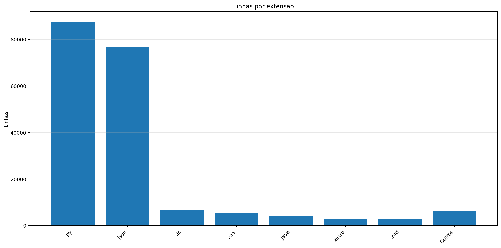

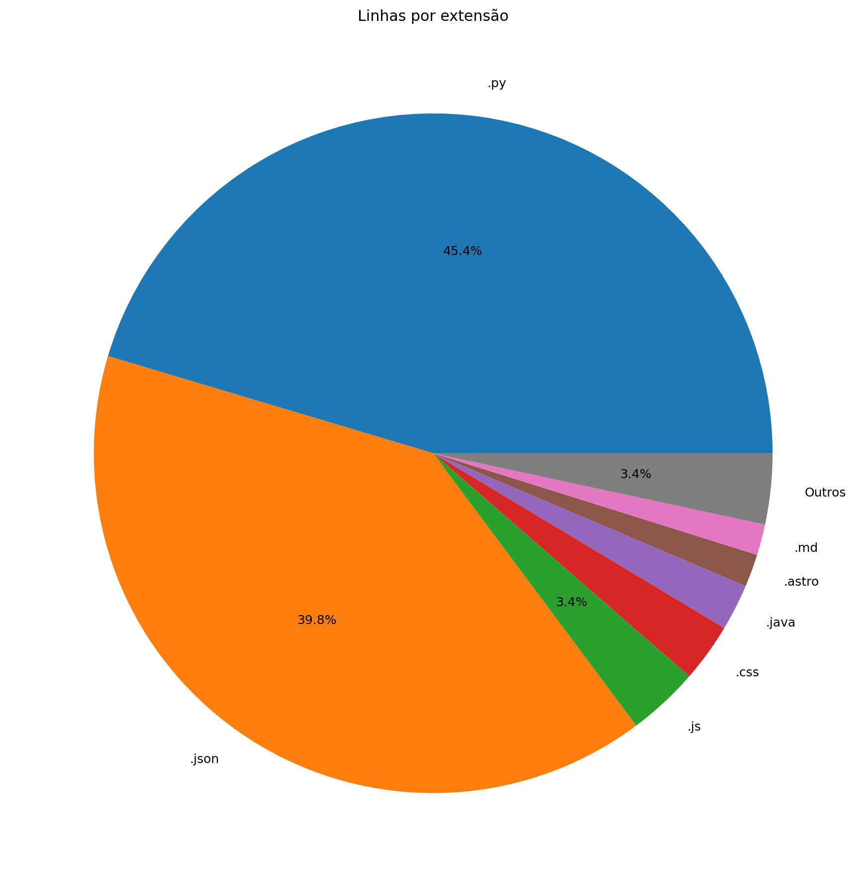

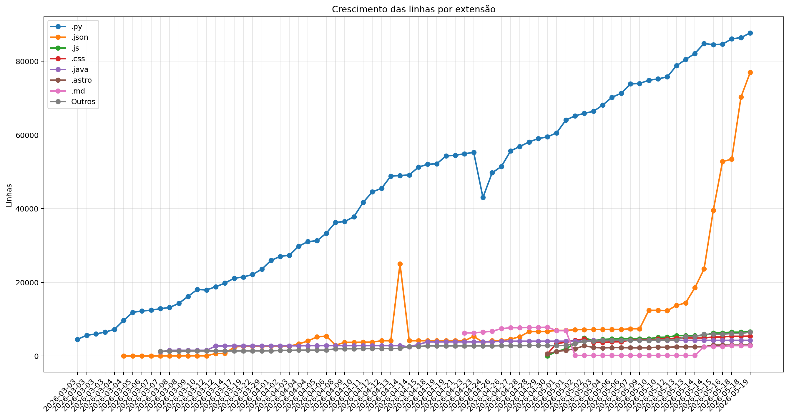

| Ext | Linhas | % das linhas | Arquivos | Peso |
|---:|---:|---:|---:|---:|
| `.py` | 87.691 | 45.38% | 271 | 3.77 MB |
| `.json` | 76.939 | 39.82% | 149 | 1.92 MB |
| `.js` | 6.586 | 3.41% | 32 | 262.81 KB |
| `.css` | 5.401 | 2.80% | 17 | 133.48 KB |
| `.java` | 4.254 | 2.20% | 8 | 161.54 KB |
| `.astro` | 3.011 | 1.56% | 50 | 123.84 KB |
| `.md` | 2.826 | 1.46% | 49 | 71.94 KB |
| `.toml` | 2.265 | 1.17% | 16 | 50.17 KB |
| `.csv` | 2.082 | 1.08% | 10 | 278.53 KB |
| `.glsl` | 1.494 | 0.77% | 28 | 72.62 KB |
| `.mmd` | 630 | 0.33% | 45 | 22.50 KB |
| `.yml` | 39 | 0.02% | 1 | 605 bytes |

## 8. Peso por extensão

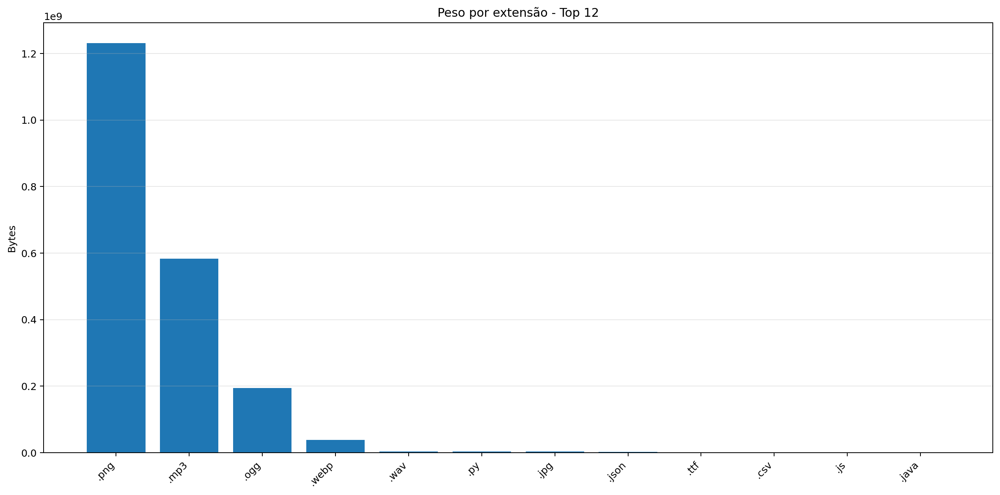

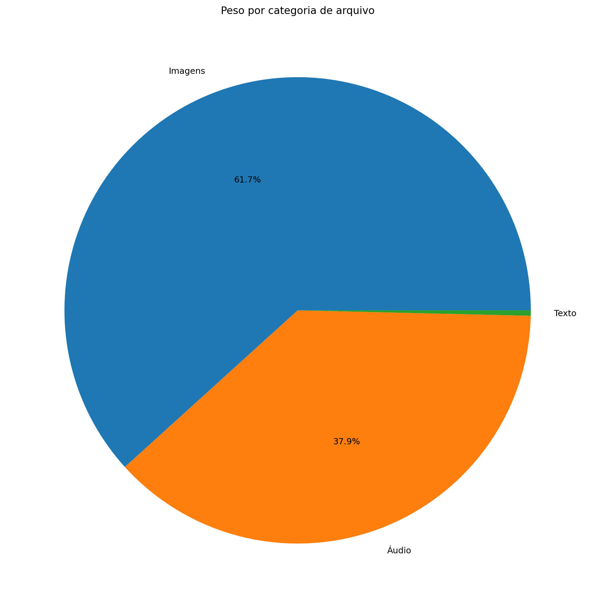

| Ext | Arquivos | Peso | % do jogo |
|---:|---:|---:|---:|
| `.png` | 72.441 | 1.146 GB | 59.68% |
| `.mp3` | 77 | 556.09 MB | 28.27% |
| `.ogg` | 72 | 185.63 MB | 9.44% |
| `.webp` | 967 | 36.48 MB | 1.85% |
| `.wav` | 9 | 3.81 MB | 0.19% |
| `.py` | 271 | 3.77 MB | 0.19% |
| `.jpg` | 23 | 3.61 MB | 0.18% |
| `.json` | 149 | 1.92 MB | 0.10% |
| `.ttf` | 3 | 320.02 KB | 0.02% |
| `.csv` | 10 | 278.53 KB | 0.01% |
| `.js` | 32 | 262.81 KB | 0.01% |
| `.java` | 8 | 161.54 KB | 0.01% |
| `.class` | 33 | 135.56 KB | 0.01% |
| `.css` | 17 | 133.48 KB | 0.01% |
| `.astro` | 50 | 123.84 KB | 0.01% |
| `.glsl` | 28 | 72.62 KB | 0.00% |
| `.md` | 49 | 71.94 KB | 0.00% |
| `.toml` | 16 | 50.17 KB | 0.00% |
| `.mmd` | 45 | 22.50 KB | 0.00% |
| `.frag` | 1 | 2.80 KB | 0.00% |
| `.yml` | 1 | 605 bytes | 0.00% |
| `.mjs` | 1 | 562 bytes | 0.00% |
| `.vert` | 1 | 170 bytes | 0.00% |

## 9. Comparativo com o último relatório

| Métrica | Relatório anterior | Relatório atual | Diferença |
|---|---:|---:|---:|
| Arquivos | 74.304 | 74.308 | +4 |
| Linhas | 184.719 | 193.290 | +8.571 |
| Linhas .py | 86.387 | 87.691 | +1.304 |
| Métodos/funções | 5.118 | 5.190 | +72 |
| Classes | 248 | 249 | +1 |
| Commits | 736 | 747 | +11 |
| Tamanho | 1.921 GB | 1.921 GB | +159.54 KB |

### Top 3 commits por tamanho de diff

| Rank | Commit | Mensagem | Arquivos | Adições | Reduções | Diff total |
|---:|---|---|---:|---:|---:|---:|
| 1 | `5286aad08356` | relatorio | 40 | 5.406 | 69 | 5.475 |
| 2 | `a16fe5aa8ee1` | animações de ataques melhoradas 1 | 7 | 3.098 | 341 | 3.439 |
| 3 | `ab6609b53dcd` | animação de ataques melhoradas 2 | 6 | 2.449 | 262 | 2.711 |

## 10. Gráficos de crescimento

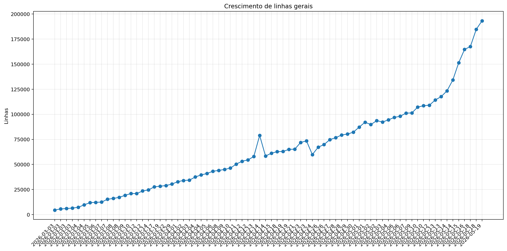

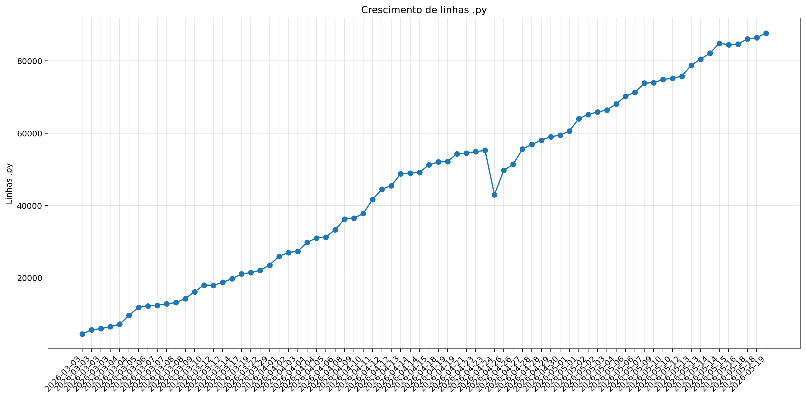

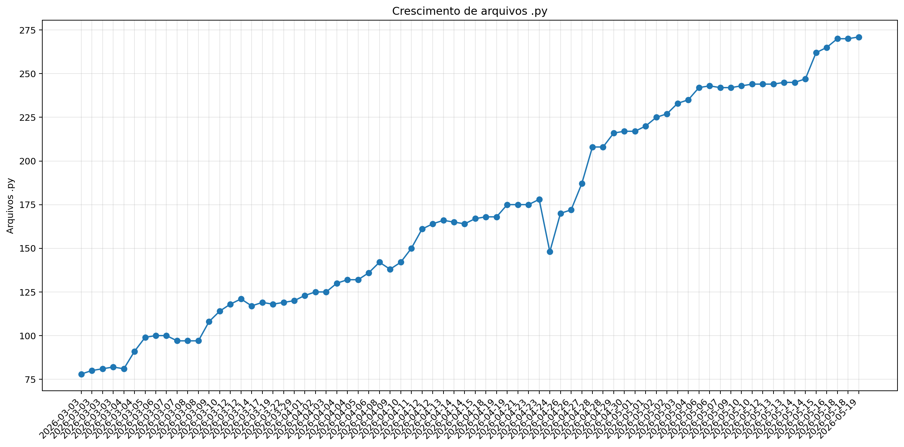

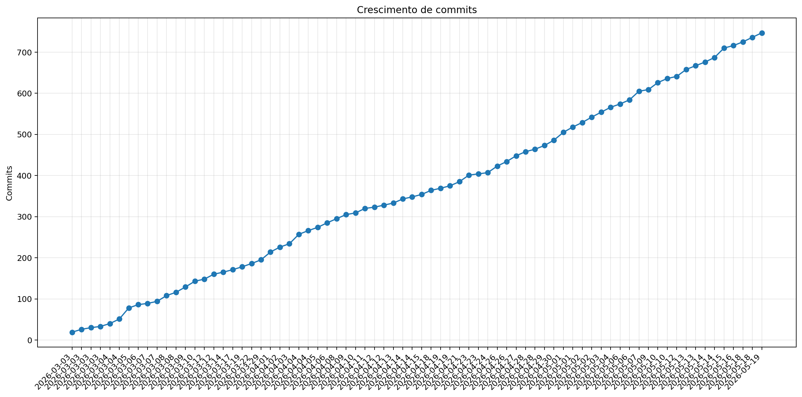

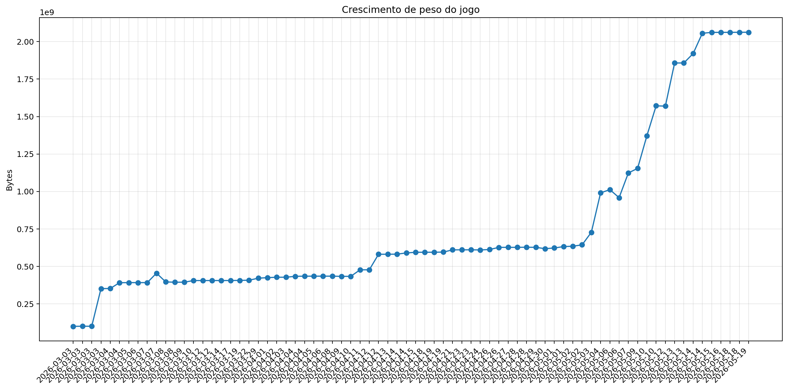

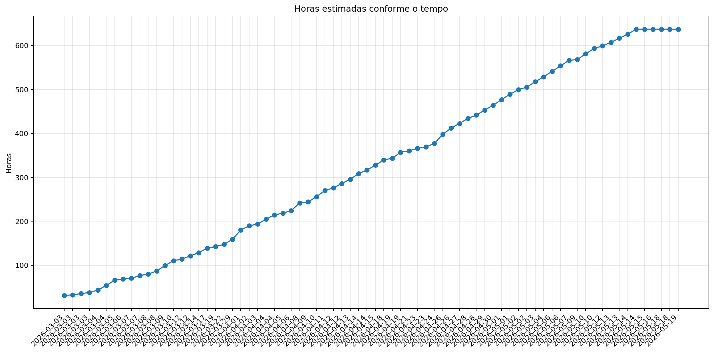
