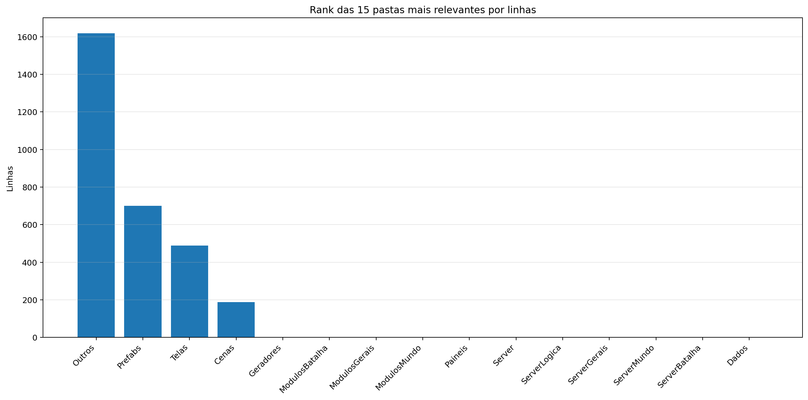
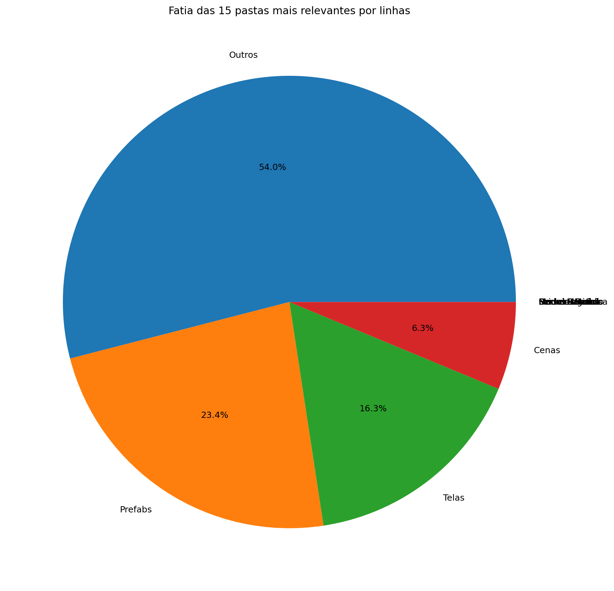
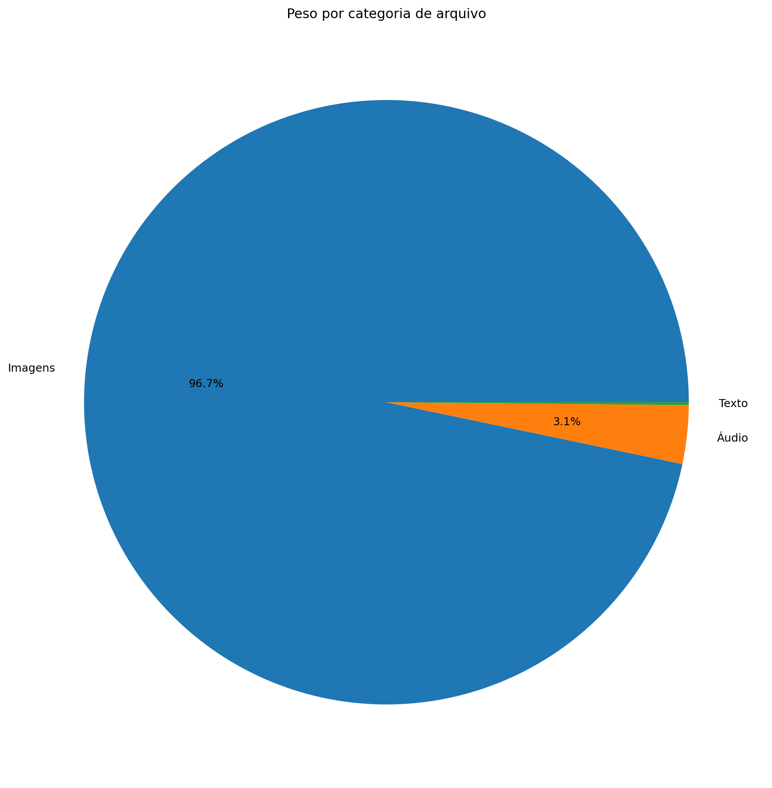
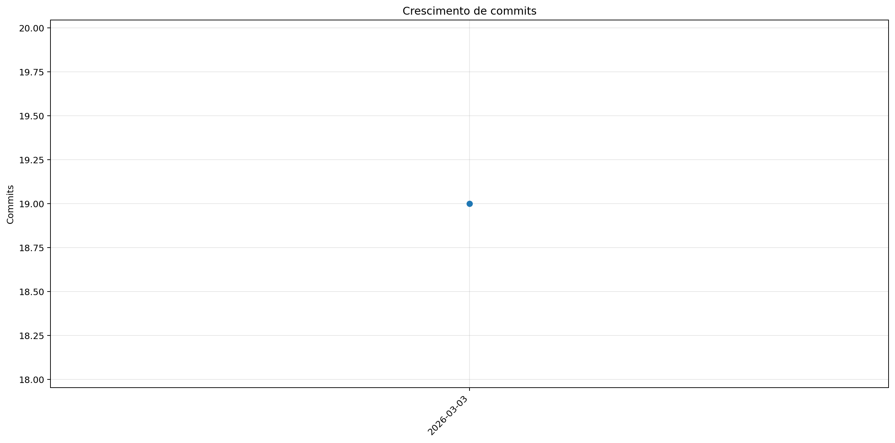

# Registro

**Relatório:** #1  
**Repo:** `relatorio_rebuild_l4s8onff`  
**Gerado em:** 2026-04-23T18:47:14  
**Modelo de relatório:** 9  
**Autor:** Leon Cunha Alvaro Lopez Soto

## Visão geral

- **Pastas:** 32
- **Arquivos:** 543
- **Arquivos de texto:** 86
- **Peso dos arquivos de texto:** 120.28 KB
- **Tamanho total:** 0.093 GB (100.269.764 bytes)
- **Dias desde a criação do repo:** 1
- **Dias desde a criação oficial:** 275
- **Horas estimadas:** 313.00
- **Linhas totais gerais:** 3.580
- **Commits (repo):** 19

## Python

- **Arquivos `.py`:** 77
- **Linhas totais:** 3.580
- **Tamanho total `.py`:** 120.28 KB
- **Classes encontradas:** 9
- **Funções encontradas:** 105
- **Métodos encontrados:** 52
- **Total funções + métodos:** 157
- **Bibliotecas diferentes usadas:** 17

## Rank das 15 pastas mais relevantes por linhas

| Rank | Pasta | Subpastas | Arquivos | Linhas gerais | Tamanho (KB) |
|---:|---|---:|---:|---:|---:|
| 1 | `Outros` | 0 | 1 | 1.619 | 57.87 |
| 2 | `Prefabs` | 0 | 9 | 701 | 24.16 |
| 3 | `Telas` | 1 | 13 | 489 | 15.75 |
| 4 | `Cenas` | 0 | 7 | 188 | 5.39 |
| 5 | `Geradores` | 0 | 11 | 0 | 0.00 |
| 6 | `ModulosBatalha` | 0 | 0 | 0 | 0.00 |
| 7 | `ModulosGerais` | 0 | 0 | 0 | 0.00 |
| 8 | `ModulosMundo` | 0 | 0 | 0 | 0.00 |
| 9 | `Paineis` | 0 | 7 | 0 | 0.00 |
| 10 | `Server` | 0 | 4 | 0 | 0.00 |
| 11 | `ServerLogica` | 0 | 0 | 0 | 0.00 |
| 12 | `ServerGerais` | 0 | 0 | 0 | 0.00 |
| 13 | `ServerMundo` | 0 | 0 | 0 | 0.00 |
| 14 | `ServerBatalha` | 0 | 0 | 0 | 0.00 |
| 15 | `Dados` | 0 | 2 | 0 | 0.00 |

## Top 50 maiores arquivos `.py` por linhas

| Arquivo | Linhas | Tamanho (KB) |
|---|---:|---:|
| `Outros/GeradorRelatorios.py` | 1.619 | 57.87 |
| `Codigo/Prefabs/Botao.py` | 373 | 12.59 |
| `Codigo/Prefabs/Texto.py` | 235 | 8.08 |
| `Codigo/Telas/Config.py` | 203 | 6.30 |
| `Codigo/Modulos/Sonoridades.py` | 197 | 6.39 |
| `Codigo/Telas/TelaMenu.py` | 156 | 5.38 |
| `Mixer.py` | 141 | 4.39 |
| `Codigo/Telas/TelaServers.py` | 130 | 4.06 |
| `Codigo/Cenas/ControladorCenas.py` | 112 | 3.42 |
| `Registro.py` | 98 | 2.51 |
| `Codigo/Modulos/EfeitosTela.py` | 98 | 2.62 |
| `Codigo/Prefabs/Barra.py` | 93 | 3.49 |
| `Game.py` | 43 | 1.00 |
| `Codigo/Cenas/CenaMenu.py` | 34 | 0.94 |
| `Codigo/Cenas/CenaCarregamento.py` | 14 | 0.35 |
| `Codigo/Cenas/CenaCombate.py` | 14 | 0.34 |
| `Codigo/Cenas/CenaMundo.py` | 14 | 0.34 |
| `ServerList.py` | 5 | 0.19 |
| `ConfigFixa.py` | 1 | 0.02 |
| `Sinalizador.py` | 0 | 0.00 |
| `ServerSimulador/Ativador.py` | 0 | 0.00 |
| `ServerSimulador/Bot.py` | 0 | 0.00 |
| `ServerSimulador/Cerebro.py` | 0 | 0.00 |
| `ServerSimulador/Combate.py` | 0 | 0.00 |
| `ServerSimulador/GeradorMundo.py` | 0 | 0.00 |
| `ServerSimulador/GeradorPokemon.py` | 0 | 0.00 |
| `ServerSimulador/PropriedadesMundo.py` | 0 | 0.00 |
| `ServerSimulador/Server.py` | 0 | 0.00 |
| `Codigo/Cenas/CenaLogin.py` | 0 | 0.00 |
| `Codigo/Cenas/CenaPreBatalha.py` | 0 | 0.00 |
| `Codigo/Geradores/Baus.py` | 0 | 0.00 |
| `Codigo/Geradores/Camera.py` | 0 | 0.00 |
| `Codigo/Geradores/Dungeon.py` | 0 | 0.00 |
| `Codigo/Geradores/Estadio.py` | 0 | 0.00 |
| `Codigo/Geradores/EstruturaNaturais.py` | 0 | 0.00 |
| `Codigo/Geradores/LeitorMundo.py` | 0 | 0.00 |
| `Codigo/Geradores/Loja.py` | 0 | 0.00 |
| `Codigo/Geradores/NPC.py` | 0 | 0.00 |
| `Codigo/Geradores/Player.py` | 0 | 0.00 |
| `Codigo/Geradores/PokemonCombate.py` | 0 | 0.00 |
| `Codigo/Geradores/PokemonMundo.py` | 0 | 0.00 |
| `Codigo/Localidades/Bot.py` | 0 | 0.00 |
| `Codigo/Localidades/Combate.py` | 0 | 0.00 |
| `Codigo/Localidades/GeradorMundo.py` | 0 | 0.00 |
| `Codigo/Localidades/GeradorPokemon.py` | 0 | 0.00 |
| `Codigo/Modulos/Carregamento.py` | 0 | 0.00 |
| `Codigo/Modulos/Comandos.py` | 0 | 0.00 |
| `Codigo/Modulos/Discord.py` | 0 | 0.00 |
| `Codigo/Modulos/FisicaCombate.py` | 0 | 0.00 |
| `Codigo/Modulos/SistemaCombate.py` | 0 | 0.00 |

## Top 20 maiores funções e métodos

| Arquivo | Nome | Tipo | Linhas |
|---|---|---:|---:|
| `Outros/GeradorRelatorios.py` | `coletar_metricas` | funcao | 239 |
| `Outros/GeradorRelatorios.py` | `analisar_python_ast` | funcao | 132 |
| `Outros/GeradorRelatorios.py` | `gerar_markdown` | funcao | 126 |
| `Codigo/Telas/TelaMenu.py` | `TelaMenu` | funcao | 122 |
| `Codigo/Prefabs/Botao.py` | `Botao.render` | metodo | 107 |
| `Codigo/Telas/Config.py` | `_montar_layout` | funcao | 86 |
| `Outros/GeradorRelatorios.py` | `main` | funcao | 83 |
| `Codigo/Prefabs/Texto.py` | `Texto._ensure_structure` | metodo | 81 |
| `Outros/GeradorRelatorios.py` | `gerar_graficos` | funcao | 76 |
| `Codigo/Telas/TelaServers.py` | `_montar_layout` | funcao | 68 |
| `Registro.py` | `main` | funcao | 52 |
| `Outros/GeradorRelatorios.py` | `coletar_historico_relatorios` | funcao | 50 |
| `Outros/GeradorRelatorios.py` | `coletar_metricas_pasta_importante` | funcao | 42 |
| `Codigo/Cenas/ControladorCenas.py` | `ControladorCenas.__init__` | metodo | 42 |
| `Codigo/Modulos/Sonoridades.py` | `TransicaoMusica` | funcao | 40 |
| `Codigo/Prefabs/Barra.py` | `Barra.render` | metodo | 40 |
| `Codigo/Prefabs/Botao.py` | `Botao.__init__` | metodo | 37 |
| `Outros/GeradorRelatorios.py` | `visitar` | funcao | 35 |
| `Codigo/Telas/TelaServers.py` | `_gerar_estilos` | funcao | 33 |
| `Outros/GeradorRelatorios.py` | `extrair_metricas_historicas` | funcao | 32 |

## Top 20 maiores classes

| Arquivo | Classe | Linhas |
|---|---|---:|
| `Codigo/Prefabs/Botao.py` | `Botao` | 292 |
| `Codigo/Prefabs/Texto.py` | `Texto` | 229 |
| `Codigo/Cenas/ControladorCenas.py` | `ControladorCenas` | 102 |
| `Codigo/Prefabs/Barra.py` | `Barra` | 85 |
| `Codigo/Prefabs/Botao.py` | `BotaoAlavanca` | 59 |
| `Codigo/Cenas/CenaMenu.py` | `CenaMenu` | 27 |
| `Codigo/Cenas/CenaCarregamento.py` | `CenaCarregamento` | 11 |
| `Codigo/Cenas/CenaCombate.py` | `CenaCombate` | 11 |
| `Codigo/Cenas/CenaMundo.py` | `CenaMundo` | 11 |

## Top 10 arquivos mais importados

| Arquivo | Vezes importado |
|---|---:|
| `Codigo/Modulos/EfeitosTela.py` | 5 |
| `Codigo/Modulos/Sonoridades.py` | 4 |
| `Codigo/Prefabs/Texto.py` | 4 |
| `Codigo/Prefabs/Botao.py` | 3 |
| `Codigo/Cenas/ControladorCenas.py` | 1 |
| `ConfigFixa.py` | 1 |
| `Codigo/Telas/Config.py` | 1 |
| `Codigo/Telas/TelaMenu.py` | 1 |
| `Codigo/Telas/TelaServers.py` | 1 |
| `Codigo/Cenas/CenaCarregamento.py` | 1 |

## Top 10 arquivos que mais importam

| Arquivo | Arquivos internos importados | Imports totais | Linhas |
|---|---:|---:|---:|
| `Codigo/Cenas/ControladorCenas.py` | 7 | 8 | 112 |
| `Codigo/Cenas/CenaMenu.py` | 5 | 5 | 34 |
| `Codigo/Telas/Config.py` | 4 | 6 | 203 |
| `Game.py` | 3 | 6 | 43 |
| `Codigo/Telas/TelaServers.py` | 2 | 3 | 130 |
| `Codigo/Telas/TelaMenu.py` | 1 | 3 | 156 |
| `Codigo/Prefabs/Botao.py` | 1 | 2 | 373 |
| `Codigo/Prefabs/Barra.py` | 1 | 2 | 93 |
| `Codigo/Cenas/CenaCarregamento.py` | 1 | 1 | 14 |
| `Codigo/Cenas/CenaCombate.py` | 1 | 1 | 14 |

## Top 10 maiores arquivos por linhas

| Arquivo | Ext | Linhas |
|---|---:|---:|
| `Outros/GeradorRelatorios.py` | `.py` | 1.619 |
| `Codigo/Prefabs/Botao.py` | `.py` | 373 |
| `Codigo/Prefabs/Texto.py` | `.py` | 235 |
| `Codigo/Telas/Config.py` | `.py` | 203 |
| `Codigo/Modulos/Sonoridades.py` | `.py` | 197 |
| `Codigo/Telas/TelaMenu.py` | `.py` | 156 |
| `Mixer.py` | `.py` | 141 |
| `Codigo/Telas/TelaServers.py` | `.py` | 130 |
| `Codigo/Cenas/ControladorCenas.py` | `.py` | 112 |
| `Registro.py` | `.py` | 98 |

## Linhas por extensão

| Ext | Linhas |
|---:|---:|
| `.py` | 3.580 |

## Peso por extensão

| Ext | Arquivos | Peso | % do jogo |
|---:|---:|---:|---:|
| `.png` | 454 | 91.88 MB | 96.08% |
| `.ogg` | 1 | 2.99 MB | 3.13% |
| `.jpg` | 1 | 623.44 KB | 0.64% |
| `.py` | 77 | 120.28 KB | 0.12% |
| `.ttf` | 1 | 26.20 KB | 0.03% |

## Comparativo com o último relatório

_Sem relatório anterior compatível para montar comparativo._

### Top 3 commits por tamanho de diff

_Sem commits suficientes entre os relatórios para montar top por diff._

## Gráficos de crescimento

