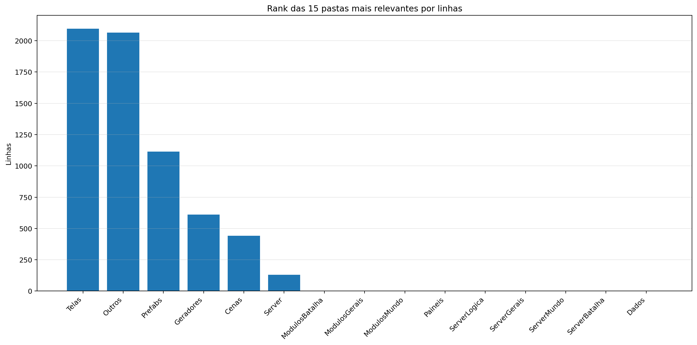
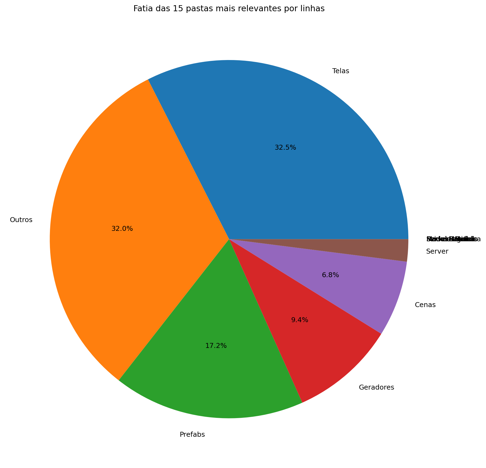
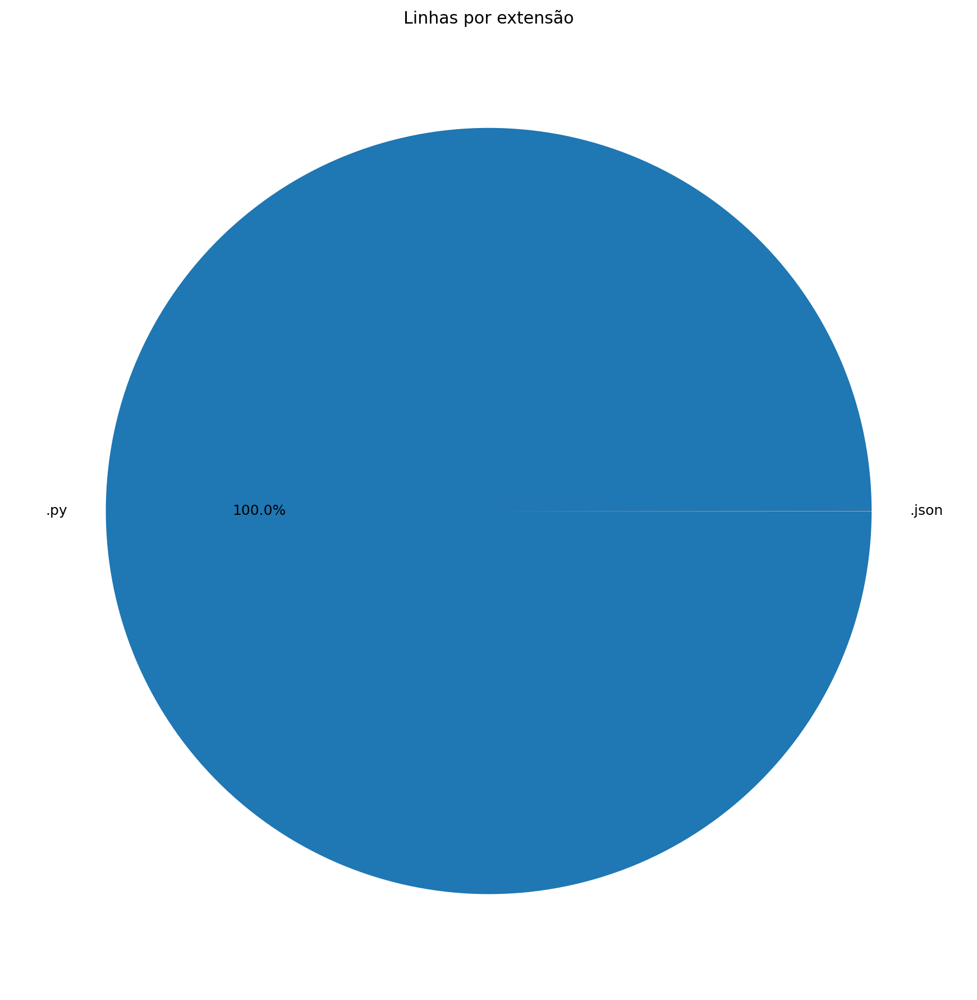
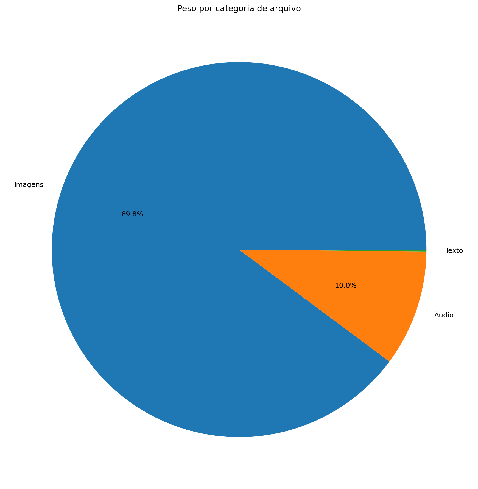
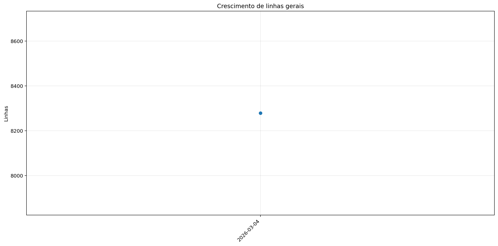
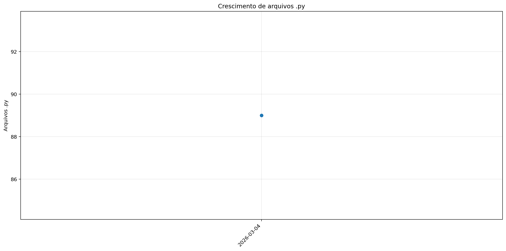
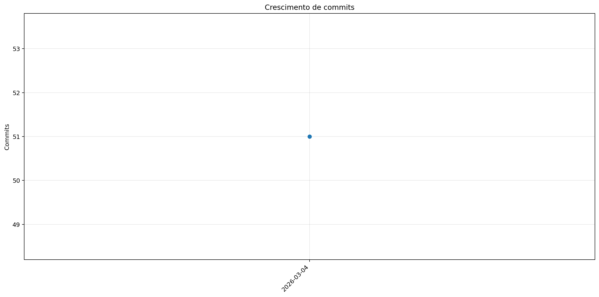

# Registro

**Relatório:** #1  
**Repo:** `relatorio_rebuild_0a8o3mgu`  
**Gerado em:** 2026-04-23T18:50:52  
**Modelo de relatório:** 9  
**Autor:** Leon Cunha Alvaro Lopez Soto

## Visão geral

- **Pastas:** 1.131
- **Arquivos:** 67.951
- **Arquivos de texto:** 96
- **Peso dos arquivos de texto:** 580.86 KB
- **Tamanho total:** 0.364 GB (391.323.000 bytes)
- **Dias desde a criação do repo:** 2
- **Dias desde a criação oficial:** 276
- **Horas estimadas:** 313.00
- **Linhas totais gerais:** 8.279
- **Commits (repo):** 51

## Python

- **Arquivos `.py`:** 89
- **Linhas totais:** 8.278
- **Tamanho total `.py`:** 280.08 KB
- **Classes encontradas:** 39
- **Funções encontradas:** 193
- **Métodos encontrados:** 230
- **Total funções + métodos:** 423
- **Bibliotecas diferentes usadas:** 23

## Rank das 15 pastas mais relevantes por linhas

| Rank | Pasta | Subpastas | Arquivos | Linhas gerais | Tamanho (KB) |
|---:|---|---:|---:|---:|---:|
| 1 | `Telas` | 1 | 14 | 2.097 | 67.99 |
| 2 | `Outros` | 0 | 3 | 2.065 | 72.91 |
| 3 | `Prefabs` | 0 | 10 | 1.114 | 39.22 |
| 4 | `Geradores` | 0 | 13 | 610 | 21.20 |
| 5 | `Cenas` | 0 | 7 | 442 | 14.29 |
| 6 | `Server` | 0 | 3 | 130 | 3.77 |
| 7 | `ModulosBatalha` | 0 | 0 | 0 | 0.00 |
| 8 | `ModulosGerais` | 0 | 0 | 0 | 0.00 |
| 9 | `ModulosMundo` | 0 | 0 | 0 | 0.00 |
| 10 | `Paineis` | 0 | 7 | 0 | 0.00 |
| 11 | `ServerLogica` | 0 | 0 | 0 | 0.00 |
| 12 | `ServerGerais` | 0 | 0 | 0 | 0.00 |
| 13 | `ServerMundo` | 0 | 0 | 0 | 0.00 |
| 14 | `ServerBatalha` | 0 | 0 | 0 | 0.00 |
| 15 | `Dados` | 0 | 2 | 0 | 0.00 |

## Top 50 maiores arquivos `.py` por linhas

| Arquivo | Linhas | Tamanho (KB) |
|---|---:|---:|
| `Outros/GeradorRelatorios.py` | 1.619 | 57.87 |
| `Codigo/Telas/TelaServers.py` | 493 | 15.26 |
| `Outros/Mixer.py` | 445 | 14.87 |
| `Codigo/Telas/TelaCriarPersonagem.py` | 437 | 15.88 |
| `Codigo/Prefabs/Botao.py` | 432 | 14.71 |
| `Codigo/Telas/TelasGenericas.py` | 305 | 10.24 |
| `Codigo/Telas/TelaOperador.py` | 253 | 7.53 |
| `Codigo/Telas/Config.py` | 250 | 7.98 |
| `Codigo/Modulos/Sonoridades.py` | 246 | 7.86 |
| `Codigo/Prefabs/Texto.py` | 235 | 8.08 |
| `Codigo/Telas/TelaLogin.py` | 203 | 5.71 |
| `Codigo/Prefabs/CaixaTexto.py` | 189 | 7.33 |
| `Codigo/Modulos/GameObjeto.py` | 162 | 5.72 |
| `SimuladorServerJogo/BancoDados.py` | 161 | 6.62 |
| `SimuladorServerJogo/Ativador.py` | 156 | 5.19 |
| `Codigo/Telas/TelaMenu.py` | 156 | 5.38 |
| `Codigo/Geradores/LeitorMundo.py` | 153 | 5.84 |
| `Codigo/Prefabs/Mensagem.py` | 147 | 4.92 |
| `Codigo/Cenas/CenaCarregamento.py` | 136 | 4.46 |
| `Codigo/Modulos/DesenhaAtor.py` | 121 | 3.96 |
| `Codigo/Modulos/colisor.py` | 120 | 3.88 |
| `Codigo/Cenas/CenaMundo.py` | 118 | 4.30 |
| `Codigo/Cenas/ControladorCenas.py` | 115 | 3.54 |
| `Codigo/Prefabs/Barra.py` | 111 | 4.18 |
| `Codigo/Server/ServerMenu.py` | 107 | 3.19 |
| `Codigo/Geradores/Ator.py` | 102 | 3.33 |
| `Codigo/Modulos/EfeitosTela.py` | 98 | 2.62 |
| `SimuladorServerJogo/Atualizador.py` | 94 | 3.39 |
| `SimuladorServerJogo/Entrada.py` | 94 | 3.86 |
| `Codigo/Geradores/PokemonMundo.py` | 94 | 3.32 |
| `SimuladorServerJogo/EstadoServidor.py` | 81 | 2.33 |
| `SimuladorServerJogo/GeradorMundo.py` | 81 | 2.38 |
| `SimuladorServerJogo/ObjetosMundoServer.py` | 78 | 3.12 |
| `SimuladorServerJogo/ServerOperar.py` | 71 | 2.17 |
| `Codigo/Geradores/PlayerController.py` | 71 | 2.33 |
| `Codigo/Modulos/Projetil.py` | 71 | 2.34 |
| `Codigo/Geradores/EstruturaNaturais.py` | 70 | 2.41 |
| `Codigo/Modulos/Entidade.py` | 65 | 2.04 |
| `Codigo/Geradores/Camera.py` | 50 | 1.81 |
| `Game.py` | 44 | 1.07 |
| `SimuladorServerGeral/Main.py` | 41 | 1.23 |
| `Codigo/Cenas/CenaMenu.py` | 41 | 1.16 |
| `Codigo/Geradores/Fruta.py` | 35 | 1.07 |
| `Codigo/Geradores/Pokebola.py` | 35 | 1.08 |
| `Codigo/Modulos/Estrutura.py` | 33 | 0.86 |
| `Codigo/Server/Login.py` | 23 | 0.58 |
| `Codigo/Cenas/CenaLogin.py` | 18 | 0.49 |
| `Codigo/Cenas/CenaCombate.py` | 14 | 0.34 |
| `ServerList.py` | 3 | 0.08 |
| `Outros/ConfigFixa.py` | 1 | 0.17 |

## Top 20 maiores funções e métodos

| Arquivo | Nome | Tipo | Linhas |
|---|---|---:|---:|
| `Outros/GeradorRelatorios.py` | `coletar_metricas` | funcao | 239 |
| `Outros/GeradorRelatorios.py` | `analisar_python_ast` | funcao | 132 |
| `Outros/GeradorRelatorios.py` | `gerar_markdown` | funcao | 126 |
| `Codigo/Telas/TelaMenu.py` | `TelaMenu` | funcao | 122 |
| `Codigo/Prefabs/Botao.py` | `Botao.render` | metodo | 115 |
| `Codigo/Telas/TelaCriarPersonagem.py` | `SubtelaCriarPersonagem._rebuild_layout` | metodo | 112 |
| `Outros/Mixer.py` | `main` | funcao | 109 |
| `Codigo/Telas/Config.py` | `_montar_layout` | funcao | 99 |
| `Codigo/Telas/TelaServers.py` | `_montar_layout` | funcao | 89 |
| `Codigo/Modulos/GameObjeto.py` | `GameObjeto.aplicar_campo_forca` | metodo | 84 |
| `Outros/GeradorRelatorios.py` | `main` | funcao | 83 |
| `SimuladorServerJogo/Ativador.py` | `processar_ativador_json` | funcao | 83 |
| `Codigo/Prefabs/Texto.py` | `Texto._ensure_structure` | metodo | 81 |
| `SimuladorServerJogo/Entrada.py` | `processar_entrada_json` | funcao | 77 |
| `Outros/GeradorRelatorios.py` | `gerar_graficos` | funcao | 76 |
| `Codigo/Telas/TelasGenericas.py` | `SubtelaTexto.__init__` | metodo | 69 |
| `SimuladorServerJogo/Atualizador.py` | `processar_atualizador_json` | funcao | 66 |
| `Codigo/Telas/TelaLogin.py` | `_montar_layout` | funcao | 65 |
| `Codigo/Telas/TelaCriarPersonagem.py` | `SubtelaCriarPersonagem.render` | metodo | 63 |
| `Codigo/Prefabs/Mensagem.py` | `Mensagem.render` | metodo | 61 |

## Top 20 maiores classes

| Arquivo | Classe | Linhas |
|---|---|---:|
| `Codigo/Telas/TelaCriarPersonagem.py` | `SubtelaCriarPersonagem` | 364 |
| `Codigo/Prefabs/Botao.py` | `Botao` | 318 |
| `Codigo/Prefabs/Texto.py` | `Texto` | 229 |
| `Codigo/Prefabs/CaixaTexto.py` | `CaixaTexto` | 184 |
| `Outros/Mixer.py` | `LoopEditor` | 176 |
| `Codigo/Modulos/GameObjeto.py` | `GameObjeto` | 150 |
| `Codigo/Prefabs/Mensagem.py` | `Mensagem` | 144 |
| `SimuladorServerJogo/BancoDados.py` | `BancoDadosMundo` | 139 |
| `Codigo/Geradores/LeitorMundo.py` | `LeitorMundo` | 139 |
| `Codigo/Telas/TelasGenericas.py` | `SubtelaTexto` | 131 |
| `Codigo/Cenas/CenaCarregamento.py` | `CenaCarregamento` | 128 |
| `Codigo/Cenas/CenaMundo.py` | `CenaMundo` | 106 |
| `Codigo/Modulos/colisor.py` | `Colisor` | 106 |
| `Codigo/Cenas/ControladorCenas.py` | `ControladorCenas` | 104 |
| `Codigo/Prefabs/Barra.py` | `Barra` | 103 |
| `Codigo/Telas/TelasGenericas.py` | `SubtelaConfirmacao` | 89 |
| `Codigo/Geradores/Ator.py` | `Ator` | 88 |
| `Codigo/Modulos/DesenhaAtor.py` | `DesenhaAtor` | 87 |
| `Codigo/Geradores/PokemonMundo.py` | `PokemonMundo` | 81 |
| `Codigo/Geradores/PlayerController.py` | `PlayerController` | 62 |

## Top 10 arquivos mais importados

| Arquivo | Vezes importado |
|---|---:|
| `Codigo/Prefabs/Botao.py` | 8 |
| `Codigo/Prefabs/Texto.py` | 8 |
| `Codigo/Modulos/Sonoridades.py` | 6 |
| `Codigo/Modulos/EfeitosTela.py` | 6 |
| `Codigo/Server/ServerMenu.py` | 4 |
| `SimuladorServerJogo/BancoDados.py` | 3 |
| `SimuladorServerJogo/Ativador.py` | 3 |
| `SimuladorServerJogo/EstadoServidor.py` | 3 |
| `Codigo/Modulos/Entidade.py` | 3 |
| `Codigo/Telas/TelasGenericas.py` | 3 |

## Top 10 arquivos que mais importam

| Arquivo | Arquivos internos importados | Imports totais | Linhas |
|---|---:|---:|---:|
| `Codigo/Cenas/ControladorCenas.py` | 8 | 9 | 115 |
| `Codigo/Telas/TelaServers.py` | 6 | 8 | 493 |
| `Codigo/Cenas/CenaMundo.py` | 6 | 8 | 118 |
| `Codigo/Cenas/CenaMenu.py` | 6 | 7 | 41 |
| `Codigo/Telas/TelaCriarPersonagem.py` | 5 | 8 | 437 |
| `Codigo/Telas/TelaOperador.py` | 5 | 7 | 253 |
| `Codigo/Telas/Config.py` | 5 | 7 | 250 |
| `Codigo/Telas/TelaLogin.py` | 5 | 7 | 203 |
| `SimuladorServerJogo/Atualizador.py` | 4 | 8 | 94 |
| `Codigo/Server/ServerMenu.py` | 4 | 5 | 107 |

## Top 10 maiores arquivos por linhas

| Arquivo | Ext | Linhas |
|---|---:|---:|
| `Outros/GeradorRelatorios.py` | `.py` | 1.619 |
| `Codigo/Telas/TelaServers.py` | `.py` | 493 |
| `Outros/Mixer.py` | `.py` | 445 |
| `Codigo/Telas/TelaCriarPersonagem.py` | `.py` | 437 |
| `Codigo/Prefabs/Botao.py` | `.py` | 432 |
| `Codigo/Telas/TelasGenericas.py` | `.py` | 305 |
| `Codigo/Telas/TelaOperador.py` | `.py` | 253 |
| `Codigo/Telas/Config.py` | `.py` | 250 |
| `Codigo/Modulos/Sonoridades.py` | `.py` | 246 |
| `Codigo/Prefabs/Texto.py` | `.py` | 235 |

## Linhas por extensão

| Ext | Linhas |
|---:|---:|
| `.py` | 8.278 |
| `.json` | 1 |

## Peso por extensão

| Ext | Arquivos | Peso | % do jogo |
|---:|---:|---:|---:|
| `.png` | 67.837 | 334.59 MB | 89.66% |
| `.ogg` | 14 | 37.19 MB | 9.97% |
| `.jpg` | 1 | 623.44 KB | 0.16% |
| `.json` | 1 | 300.77 KB | 0.08% |
| `.py` | 89 | 280.08 KB | 0.07% |
| `.wav` | 2 | 208.16 KB | 0.05% |
| `.ttf` | 1 | 26.20 KB | 0.01% |

## Comparativo com o último relatório

_Sem relatório anterior compatível para montar comparativo._

### Top 3 commits por tamanho de diff

_Sem commits suficientes entre os relatórios para montar top por diff._

## Gráficos de crescimento

