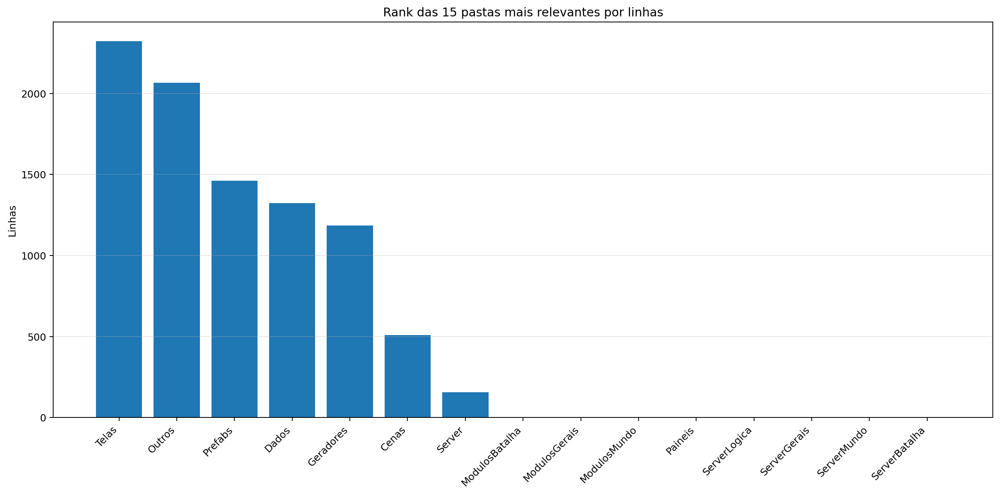
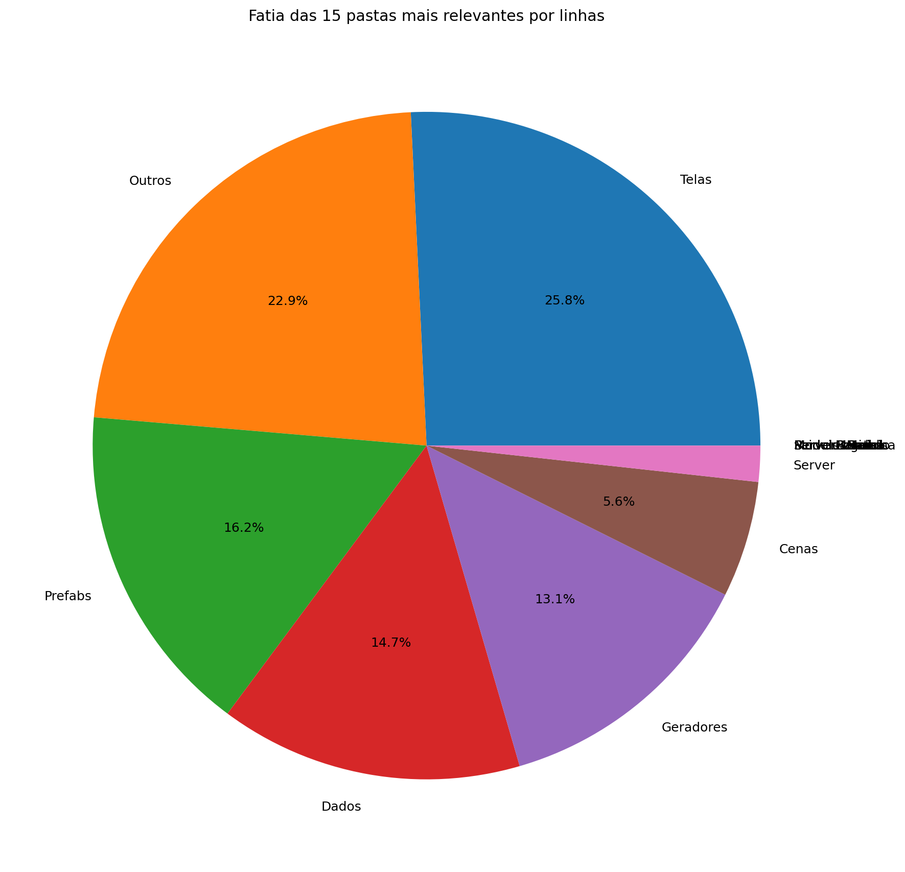
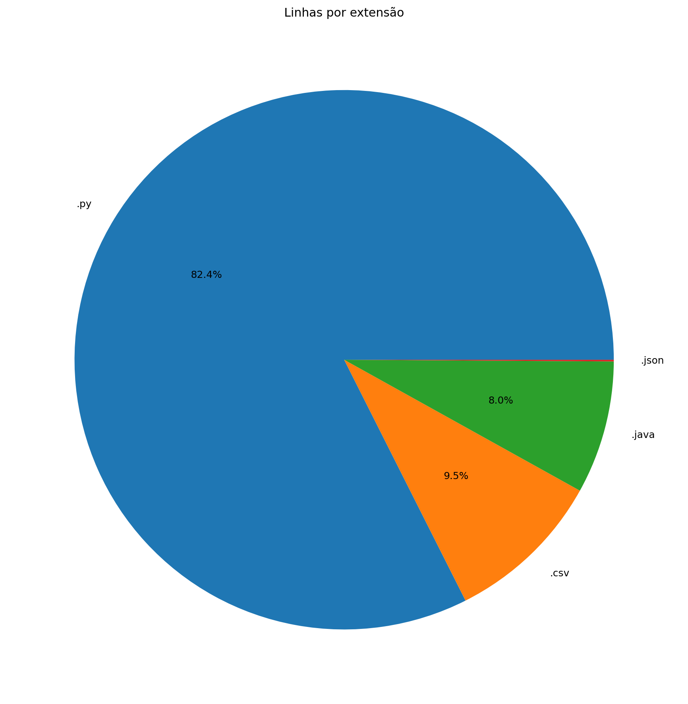
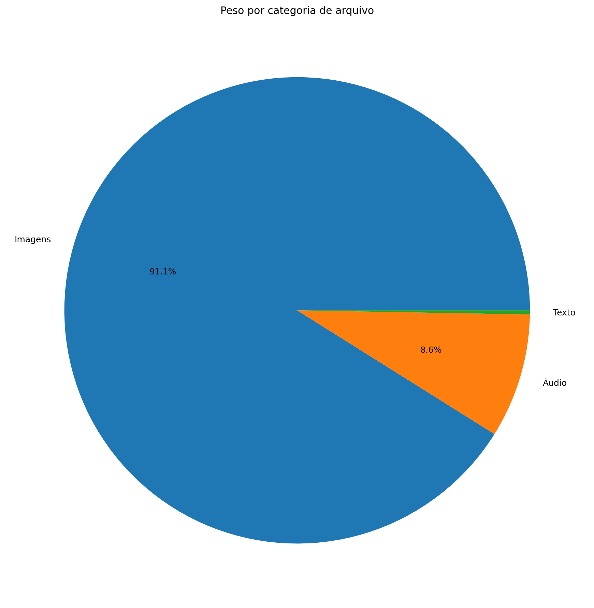
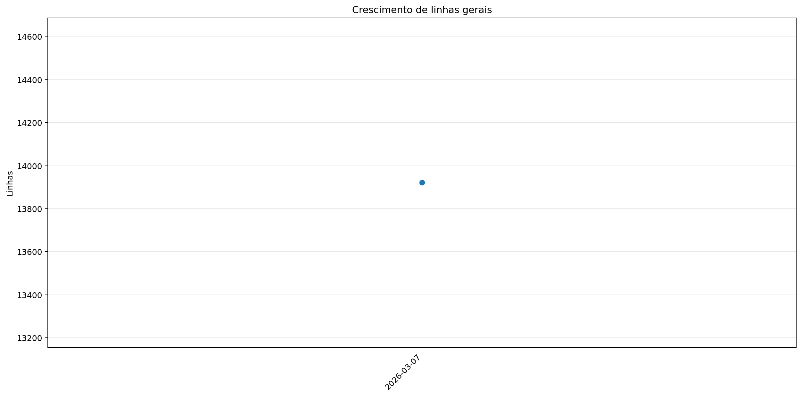
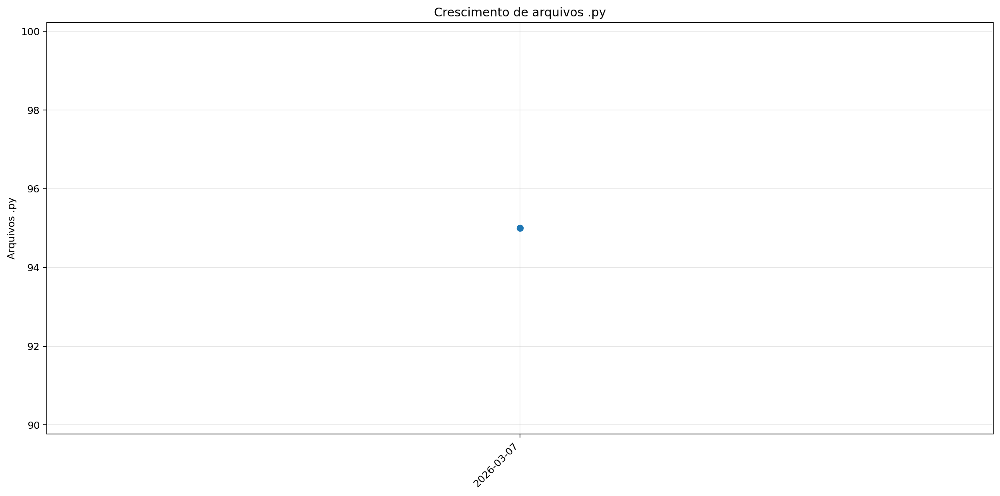
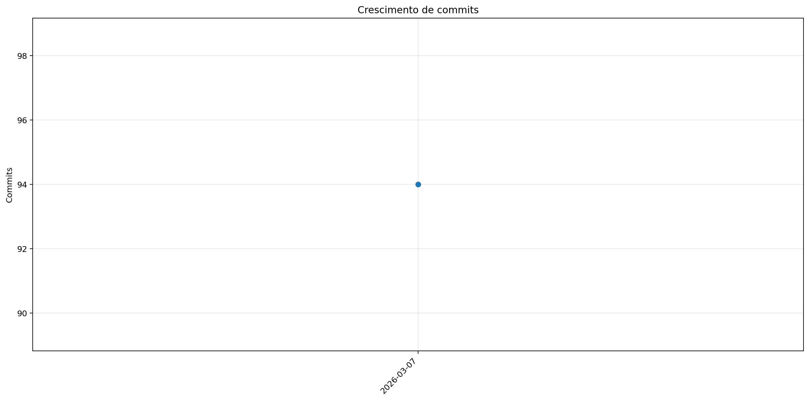

# Registro

**Relatório:** #1  
**Repo:** `relatorio_rebuild_x1zpb68l`  
**Gerado em:** 2026-04-23T18:56:50  
**Modelo de relatório:** 9  
**Autor:** Leon Cunha Alvaro Lopez Soto

## Visão geral

- **Pastas:** 1.142
- **Arquivos:** 68.149
- **Arquivos de texto:** 104
- **Peso dos arquivos de texto:** 1192.65 KB
- **Tamanho total:** 0.424 GB (454.947.008 bytes)
- **Dias desde a criação do repo:** 5
- **Dias desde a criação oficial:** 279
- **Horas estimadas:** 313.00
- **Linhas totais gerais:** 13.922
- **Commits (repo):** 94

## Python

- **Arquivos `.py`:** 95
- **Linhas totais:** 11.476
- **Tamanho total `.py`:** 407.95 KB
- **Classes encontradas:** 59
- **Funções encontradas:** 217
- **Métodos encontrados:** 395
- **Total funções + métodos:** 612
- **Bibliotecas diferentes usadas:** 25

## Rank das 15 pastas mais relevantes por linhas

| Rank | Pasta | Subpastas | Arquivos | Linhas gerais | Tamanho (KB) |
|---:|---|---:|---:|---:|---:|
| 1 | `Telas` | 1 | 14 | 2.323 | 76.93 |
| 2 | `Outros` | 0 | 3 | 2.065 | 72.91 |
| 3 | `Prefabs` | 0 | 11 | 1.460 | 51.75 |
| 4 | `Dados` | 0 | 2 | 1.323 | 139.23 |
| 5 | `Geradores` | 1 | 17 | 1.184 | 43.58 |
| 6 | `Cenas` | 0 | 7 | 508 | 17.60 |
| 7 | `Server` | 0 | 4 | 157 | 4.50 |
| 8 | `ModulosBatalha` | 0 | 0 | 0 | 0.00 |
| 9 | `ModulosGerais` | 0 | 0 | 0 | 0.00 |
| 10 | `ModulosMundo` | 0 | 0 | 0 | 0.00 |
| 11 | `Paineis` | 0 | 6 | 0 | 0.00 |
| 12 | `ServerLogica` | 0 | 0 | 0 | 0.00 |
| 13 | `ServerGerais` | 0 | 0 | 0 | 0.00 |
| 14 | `ServerMundo` | 0 | 0 | 0 | 0.00 |
| 15 | `ServerBatalha` | 0 | 0 | 0 | 0.00 |

## Top 50 maiores arquivos `.py` por linhas

| Arquivo | Linhas | Tamanho (KB) |
|---|---:|---:|
| `Outros/GeradorRelatorios.py` | 1.619 | 57.87 |
| `Codigo/Telas/TelaServers.py` | 497 | 15.50 |
| `Outros/Mixer.py` | 445 | 14.87 |
| `Codigo/Telas/TelaCriarPersonagem.py` | 436 | 15.85 |
| `Codigo/Prefabs/Botao.py` | 432 | 14.71 |
| `Codigo/Modulos/ControladorObjetos.py` | 424 | 17.87 |
| `Codigo/Telas/TelasGenericas.py` | 305 | 10.24 |
| `Codigo/Modulos/LeitorMundo.py` | 304 | 12.51 |
| `SimuladorServerJogo/BancoDados.py` | 290 | 12.57 |
| `Codigo/Modulos/Colisor.py` | 276 | 9.29 |
| `Codigo/Geradores/Player/PlayerControle.py` | 267 | 10.84 |
| `Codigo/Telas/TelaOperador.py` | 262 | 7.97 |
| `SimuladorServerJogo/Cerebro.py` | 261 | 10.86 |
| `Codigo/Telas/Config.py` | 257 | 8.31 |
| `Codigo/Modulos/Sonoridades.py` | 246 | 7.86 |
| `Codigo/Prefabs/Texto.py` | 235 | 8.08 |
| `SimuladorServerJogo/GeradorMundo.py` | 227 | 7.95 |
| `SimuladorServerJogo/EstadoServidor.py` | 220 | 6.82 |
| `Codigo/Geradores/GameObjeto.py` | 216 | 7.89 |
| `Codigo/Telas/TelaLogin.py` | 203 | 5.71 |
| `Codigo/Prefabs/CaixaTexto.py` | 189 | 7.33 |
| `SimuladorServerJogo/Ativador.py` | 180 | 6.26 |
| `Codigo/Geradores/Ator.py` | 169 | 5.56 |
| `Codigo/Cenas/ControladorCenas.py` | 168 | 5.71 |
| `Codigo/Telas/TelaMenu.py` | 167 | 5.67 |
| `Codigo/Prefabs/Mensagem.py` | 161 | 5.36 |
| `Codigo/Modulos/DesenhaAtor.py` | 159 | 5.88 |
| `Codigo/Prefabs/Barra.py` | 151 | 5.54 |
| `SimuladorServerJogo/ObjetosMundoServer.py` | 136 | 5.37 |
| `Codigo/Cenas/CenaCarregamento.py` | 136 | 4.46 |
| `SimuladorServerJogo/Entrada.py` | 130 | 6.06 |
| `Codigo/Cenas/CenaMundo.py` | 130 | 5.35 |
| `Codigo/Prefabs/Painel.py` | 119 | 4.88 |
| `SimuladorServerJogo/Atualizador.py` | 113 | 4.30 |
| `Codigo/Prefabs/Imagem.py` | 113 | 3.61 |
| `Codigo/Modulos/SubtelaOpcoes.py` | 112 | 4.04 |
| `Codigo/Geradores/EstruturaNaturais.py` | 110 | 3.51 |
| `Codigo/Modulos/EfeitosTela.py` | 98 | 2.62 |
| `Codigo/Geradores/Player/PlayerPerfil.py` | 96 | 5.29 |
| `SimuladorServerJogo/GeradorPokemon.py` | 94 | 3.63 |
| `Codigo/Geradores/PokemonMundo.py` | 94 | 3.33 |
| `Codigo/Telas/Inventario/Itens.py` | 94 | 4.01 |
| `Codigo/Modulos/Discord.py` | 92 | 2.59 |
| `Codigo/Modulos/Camera.py` | 87 | 3.57 |
| `Codigo/Telas/Inventario/Unificador.py` | 82 | 3.04 |
| `SimuladorServerJogo/ServerOperar.py` | 78 | 2.47 |
| `Codigo/Server/ServerMenu.py` | 72 | 2.03 |
| `Codigo/Modulos/Projetil.py` | 71 | 2.35 |
| `Codigo/Geradores/Entidade.py` | 65 | 2.04 |
| `Codigo/Modulos/Ferramentas.py` | 64 | 2.30 |

## Top 20 maiores funções e métodos

| Arquivo | Nome | Tipo | Linhas |
|---|---|---:|---:|
| `Outros/GeradorRelatorios.py` | `coletar_metricas` | funcao | 239 |
| `Outros/GeradorRelatorios.py` | `analisar_python_ast` | funcao | 132 |
| `Codigo/Telas/TelaMenu.py` | `TelaMenu` | funcao | 131 |
| `Outros/GeradorRelatorios.py` | `gerar_markdown` | funcao | 126 |
| `Codigo/Prefabs/Botao.py` | `Botao.render` | metodo | 115 |
| `Codigo/Telas/TelaCriarPersonagem.py` | `SubtelaCriarPersonagem._rebuild_layout` | metodo | 112 |
| `Outros/Mixer.py` | `main` | funcao | 109 |
| `SimuladorServerJogo/Entrada.py` | `processar_entrada_json` | funcao | 109 |
| `Codigo/Modulos/LeitorMundo.py` | `LeitorMundo.renderizar_mundo` | metodo | 105 |
| `Codigo/Telas/Config.py` | `_montar_layout` | funcao | 99 |
| `Codigo/Telas/TelaServers.py` | `_montar_layout` | funcao | 89 |
| `Codigo/Geradores/GameObjeto.py` | `GameObjeto.aplicar_campo_forca` | metodo | 84 |
| `Outros/GeradorRelatorios.py` | `main` | funcao | 83 |
| `SimuladorServerJogo/Ativador.py` | `processar_ativador_json` | funcao | 83 |
| `Codigo/Prefabs/Texto.py` | `Texto._ensure_structure` | metodo | 81 |
| `Outros/GeradorRelatorios.py` | `gerar_graficos` | funcao | 76 |
| `Codigo/Prefabs/Mensagem.py` | `Mensagem.render` | metodo | 75 |
| `Codigo/Modulos/Colisor.py` | `Colisor.resolver_movimento_com_colisores` | metodo | 73 |
| `SimuladorServerJogo/Atualizador.py` | `processar_atualizador_json` | funcao | 70 |
| `Codigo/Telas/TelasGenericas.py` | `SubtelaTexto.__init__` | metodo | 69 |

## Top 20 maiores classes

| Arquivo | Classe | Linhas |
|---|---|---:|
| `Codigo/Modulos/ControladorObjetos.py` | `ControladorObjetos` | 409 |
| `Codigo/Telas/TelaCriarPersonagem.py` | `SubtelaCriarPersonagem` | 363 |
| `Codigo/Prefabs/Botao.py` | `Botao` | 318 |
| `Codigo/Modulos/LeitorMundo.py` | `LeitorMundo` | 290 |
| `SimuladorServerJogo/BancoDados.py` | `BancoDadosMundo` | 266 |
| `Codigo/Modulos/Colisor.py` | `Colisor` | 262 |
| `Codigo/Geradores/Player/PlayerControle.py` | `PlayerController` | 256 |
| `SimuladorServerJogo/Cerebro.py` | `CerebroServer` | 238 |
| `Codigo/Prefabs/Texto.py` | `Texto` | 229 |
| `Codigo/Geradores/GameObjeto.py` | `GameObjeto` | 201 |
| `Codigo/Prefabs/CaixaTexto.py` | `CaixaTexto` | 184 |
| `Outros/Mixer.py` | `LoopEditor` | 176 |
| `Codigo/Prefabs/Mensagem.py` | `Mensagem` | 158 |
| `Codigo/Cenas/ControladorCenas.py` | `ControladorCenas` | 156 |
| `Codigo/Geradores/Ator.py` | `Ator` | 151 |
| `Codigo/Telas/TelasGenericas.py` | `SubtelaTexto` | 131 |
| `Codigo/Cenas/CenaCarregamento.py` | `CenaCarregamento` | 128 |
| `Codigo/Modulos/DesenhaAtor.py` | `DesenhaAtor` | 128 |
| `Codigo/Cenas/CenaMundo.py` | `CenaMundo` | 116 |
| `Codigo/Prefabs/Imagem.py` | `Imagem` | 105 |

## Top 10 arquivos mais importados

| Arquivo | Vezes importado |
|---|---:|
| `Codigo/Prefabs/Botao.py` | 11 |
| `Codigo/Prefabs/Texto.py` | 10 |
| `Codigo/Modulos/Sonoridades.py` | 6 |
| `Codigo/Modulos/EfeitosTela.py` | 6 |
| `SimuladorServerJogo/BancoDados.py` | 5 |
| `SimuladorServerJogo/Ativador.py` | 5 |
| `SimuladorServerJogo/ObjetosMundoServer.py` | 4 |
| `Codigo/Modulos/Colisor.py` | 4 |
| `Codigo/Prefabs/Barra.py` | 4 |
| `SimuladorServerJogo/EstadoServidor.py` | 3 |

## Top 10 arquivos que mais importam

| Arquivo | Arquivos internos importados | Imports totais | Linhas |
|---|---:|---:|---:|
| `Codigo/Cenas/CenaMundo.py` | 10 | 11 | 130 |
| `Codigo/Cenas/ControladorCenas.py` | 9 | 10 | 168 |
| `Codigo/Telas/TelaServers.py` | 6 | 8 | 497 |
| `Codigo/Cenas/CenaMenu.py` | 6 | 7 | 42 |
| `Codigo/Telas/TelaCriarPersonagem.py` | 5 | 8 | 436 |
| `Codigo/Telas/TelaOperador.py` | 5 | 7 | 262 |
| `Codigo/Telas/Config.py` | 5 | 7 | 257 |
| `Codigo/Telas/TelaLogin.py` | 5 | 7 | 203 |
| `SimuladorServerJogo/Cerebro.py` | 4 | 13 | 261 |
| `Codigo/Modulos/ControladorObjetos.py` | 4 | 9 | 424 |

## Top 10 maiores arquivos por linhas

| Arquivo | Ext | Linhas |
|---|---:|---:|
| `Outros/GeradorRelatorios.py` | `.py` | 1.619 |
| `Dados/Global server - Pokemons.csv` | `.csv` | 1.277 |
| `WorldGenerator.java` | `.java` | 1.109 |
| `Codigo/Telas/TelaServers.py` | `.py` | 497 |
| `Outros/Mixer.py` | `.py` | 445 |
| `Codigo/Telas/TelaCriarPersonagem.py` | `.py` | 436 |
| `Codigo/Prefabs/Botao.py` | `.py` | 432 |
| `Codigo/Modulos/ControladorObjetos.py` | `.py` | 424 |
| `Codigo/Telas/TelasGenericas.py` | `.py` | 305 |
| `Codigo/Modulos/LeitorMundo.py` | `.py` | 304 |

## Linhas por extensão

| Ext | Linhas |
|---:|---:|
| `.py` | 11.476 |
| `.csv` | 1.323 |
| `.java` | 1.109 |
| `.json` | 14 |

## Peso por extensão

| Ext | Arquivos | Peso | % do jogo |
|---:|---:|---:|---:|
| `.png` | 68.016 | 394.64 MB | 90.96% |
| `.ogg` | 14 | 37.19 MB | 8.57% |
| `.jpg` | 1 | 623.44 KB | 0.14% |
| `.json` | 2 | 602.15 KB | 0.14% |
| `.py` | 95 | 407.95 KB | 0.09% |
| `.wav` | 2 | 208.16 KB | 0.05% |
| `.csv` | 2 | 139.23 KB | 0.03% |
| `.java` | 1 | 43.32 KB | 0.01% |
| `.class` | 11 | 37.48 KB | 0.01% |
| `.ttf` | 1 | 26.20 KB | 0.01% |

## Comparativo com o último relatório

_Sem relatório anterior compatível para montar comparativo._

### Top 3 commits por tamanho de diff

_Sem commits suficientes entre os relatórios para montar top por diff._

## Gráficos de crescimento

