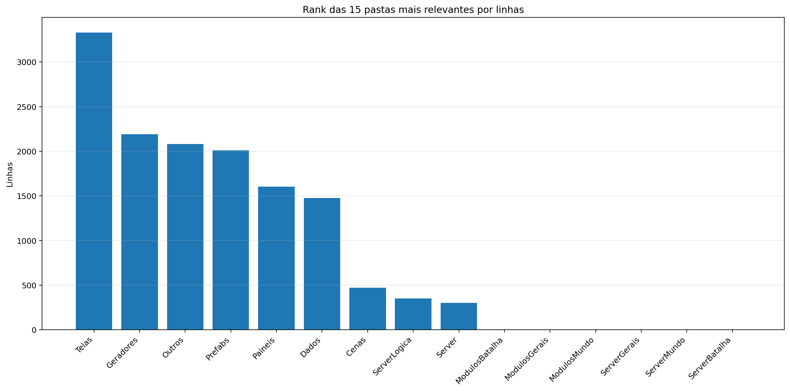
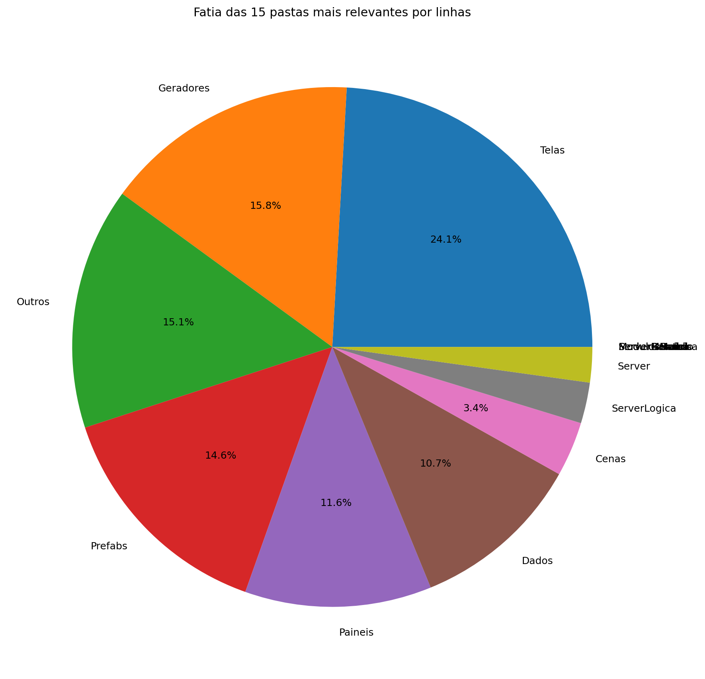
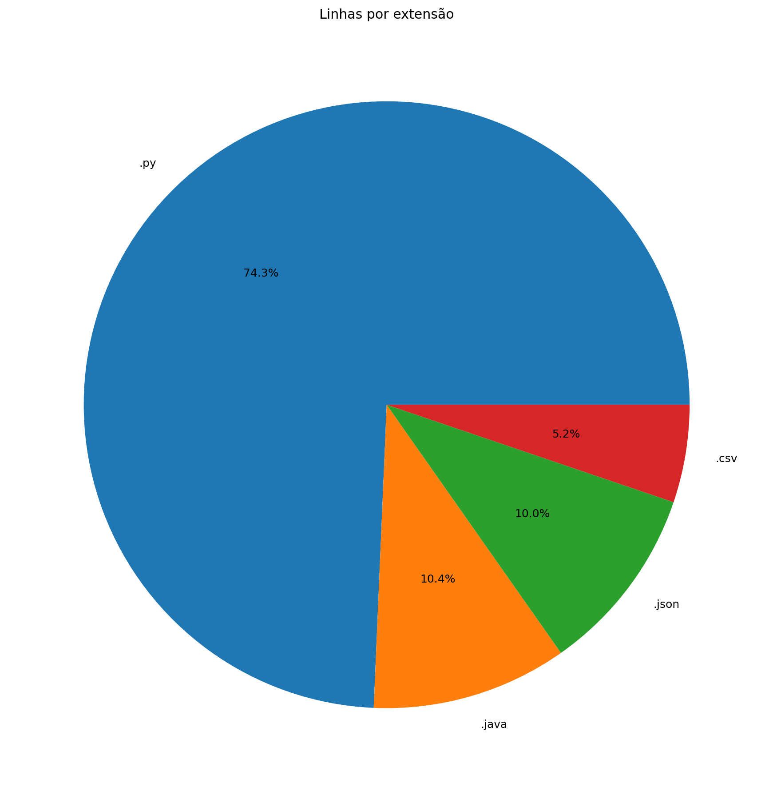
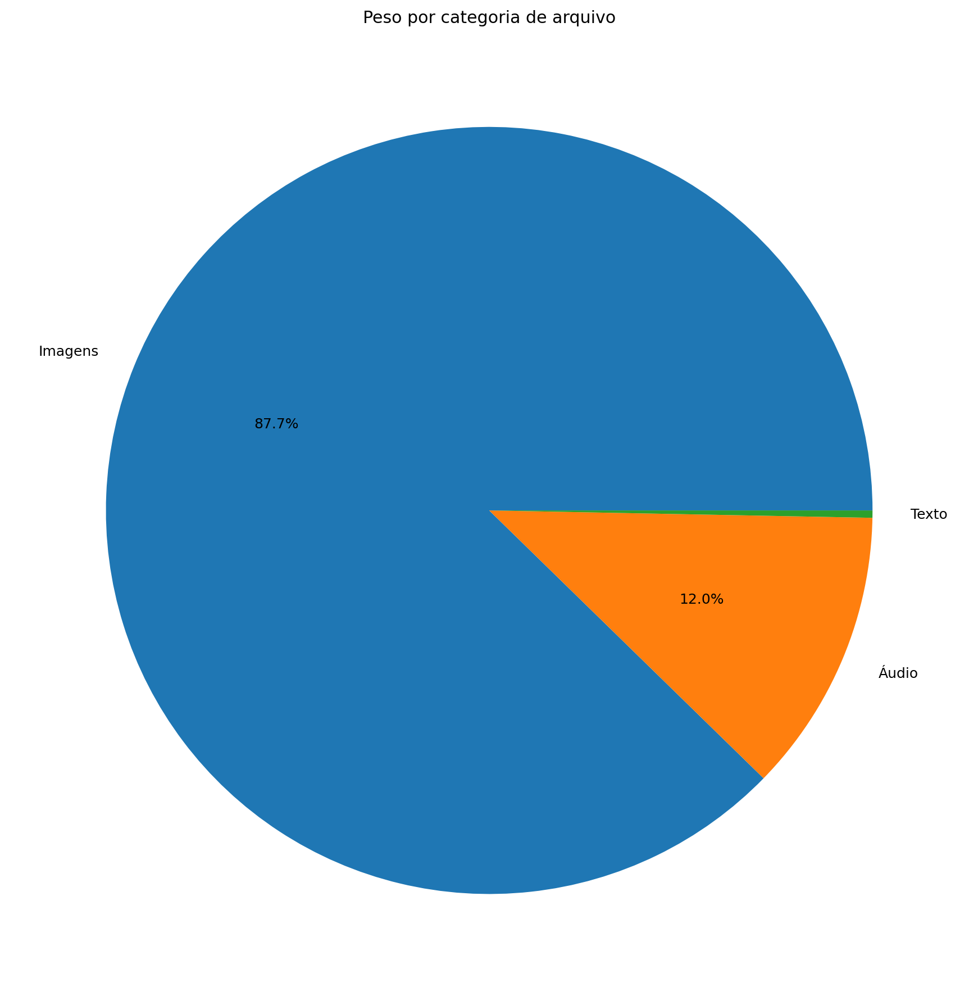
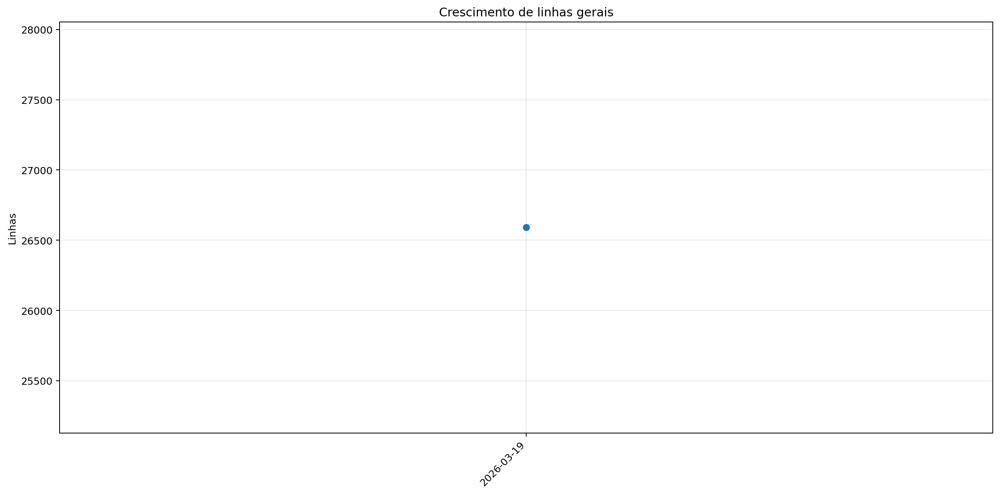
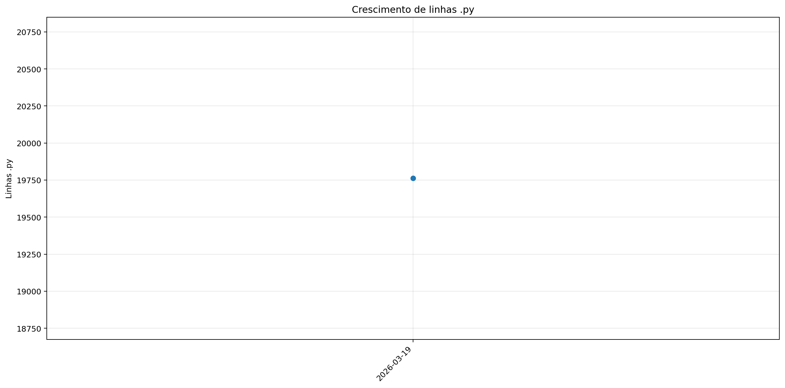
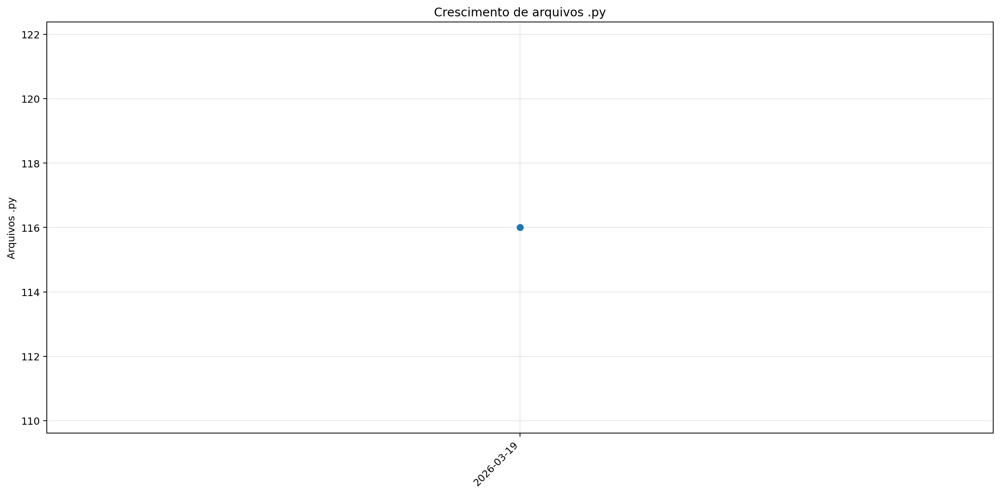

# Registro

**Relatório:** #1  
**Repo:** `relatorio_rebuild_5v2uof92`  
**Gerado em:** 2026-04-23T19:09:29  
**Modelo de relatório:** 9  
**Autor:** Leon Cunha Alvaro Lopez Soto

## Visão geral

- **Pastas:** 1.156
- **Arquivos:** 68.222
- **Arquivos de texto:** 130
- **Peso dos arquivos de texto:** 1109.37 KB
- **Tamanho total:** 0.379 GB (406.665.320 bytes)
- **Dias desde a criação do repo:** 17
- **Dias desde a criação oficial:** 291
- **Horas estimadas:** 313.00
- **Linhas totais gerais:** 26.591
- **Commits (repo):** 178

## Python

- **Arquivos `.py`:** 116
- **Linhas totais:** 19.762
- **Tamanho total `.py`:** 781.38 KB
- **Classes encontradas:** 78
- **Funções encontradas:** 306
- **Métodos encontrados:** 788
- **Total funções + métodos:** 1.094
- **Bibliotecas diferentes usadas:** 28

## Rank das 15 pastas mais relevantes por linhas

| Rank | Pasta | Subpastas | Arquivos | Linhas gerais | Tamanho (KB) |
|---:|---|---:|---:|---:|---:|
| 1 | `Telas` | 1 | 15 | 3.331 | 118.83 |
| 2 | `Geradores` | 1 | 16 | 2.189 | 96.56 |
| 3 | `Outros` | 0 | 3 | 2.080 | 73.35 |
| 4 | `Prefabs` | 0 | 12 | 2.010 | 69.33 |
| 5 | `Paineis` | 0 | 10 | 1.603 | 56.76 |
| 6 | `Dados` | 0 | 4 | 1.476 | 145.12 |
| 7 | `Cenas` | 0 | 7 | 470 | 16.53 |
| 8 | `ServerLogica` | 0 | 3 | 351 | 16.36 |
| 9 | `Server` | 0 | 4 | 303 | 10.94 |
| 10 | `ModulosBatalha` | 0 | 0 | 0 | 0.00 |
| 11 | `ModulosGerais` | 0 | 0 | 0 | 0.00 |
| 12 | `ModulosMundo` | 0 | 0 | 0 | 0.00 |
| 13 | `ServerGerais` | 0 | 0 | 0 | 0.00 |
| 14 | `ServerMundo` | 0 | 0 | 0 | 0.00 |
| 15 | `ServerBatalha` | 0 | 0 | 0 | 0.00 |

## Top 50 maiores arquivos `.py` por linhas

| Arquivo | Linhas | Tamanho (KB) |
|---|---:|---:|
| `Outros/GeradorRelatorios.py` | 1.619 | 57.87 |
| `Codigo/Modulos/ControladorMundo/ControladorObjetos.py` | 614 | 28.25 |
| `SimuladorServerJogo/Controle/BancoDados.py` | 570 | 26.52 |
| `Codigo/Geradores/PokemonMundo.py` | 534 | 26.08 |
| `Codigo/Telas/TelaServers.py` | 502 | 15.93 |
| `Codigo/Modulos/ControladorMundo/ControladorPlayer.py` | 495 | 21.84 |
| `SimuladorServerJogo/Controle/EstadoServidor.py` | 463 | 17.67 |
| `Codigo/Telas/TelasGenericas.py` | 463 | 15.83 |
| `Outros/Mixer.py` | 460 | 15.31 |
| `Codigo/Modulos/Sonoridades.py` | 448 | 11.62 |
| `Codigo/Prefabs/Botao.py` | 432 | 14.71 |
| `Codigo/Telas/TelaCriarPersonagem.py` | 417 | 15.19 |
| `Codigo/Paineis/PainelReceitas.py` | 412 | 13.70 |
| `SimuladorServerJogo/Rotas/Comandos.py` | 408 | 16.37 |
| `Codigo/Telas/Inventario/InventarioItens.py` | 383 | 17.01 |
| `Codigo/Paineis/Container.py` | 370 | 12.15 |
| `Codigo/Geradores/Player/Controle.py` | 354 | 15.28 |
| `Codigo/Paineis/PainelCraft.py` | 353 | 13.49 |
| `Codigo/Telas/TelaOperador.py` | 352 | 11.98 |
| `Codigo/Telas/Inventario/InventarioPokemons.py` | 348 | 14.26 |
| `SimuladorServerJogo/Geradores/GeradorMundo.py` | 338 | 13.64 |
| `SimuladorServerJogo/Controle/ObjetosMundoServer.py` | 305 | 21.22 |
| `SimuladorServerJogo/Controle/Cerebros/CerebroCentral.py` | 299 | 15.49 |
| `Codigo/Paineis/PainelTimes.py` | 280 | 9.77 |
| `Codigo/Geradores/Ator.py` | 279 | 11.72 |
| `Codigo/Modulos/Colisor.py` | 276 | 9.29 |
| `Codigo/Telas/Config.py` | 257 | 8.31 |
| `Codigo/Prefabs/Painel.py` | 254 | 8.84 |
| `Codigo/Prefabs/Terminal.py` | 244 | 8.67 |
| `Codigo/Modulos/ControladorMundo/LeitorMundo.py` | 244 | 11.78 |
| `Codigo/Prefabs/Texto.py` | 235 | 8.08 |
| `SimuladorServerJogo/Logica/AutoridadeCaptura.py` | 228 | 9.51 |
| `SimuladorServerJogo/Geradores/GeradorBaus.py` | 218 | 9.88 |
| `SimuladorServerJogo/Rotas/Ativador.py` | 212 | 9.03 |
| `Codigo/Server/ServerMundo.py` | 208 | 8.32 |
| `Codigo/Geradores/PokemonInventario.py` | 203 | 7.40 |
| `Codigo/Telas/TelaLogin.py` | 203 | 5.71 |
| `Codigo/Prefabs/CaixaTexto.py` | 200 | 7.94 |
| `SimuladorServerJogo/Controle/ServicoInventario.py` | 192 | 8.66 |
| `Codigo/Paineis/FichaItem.py` | 188 | 7.66 |
| `Codigo/Cenas/ControladorCenas.py` | 168 | 5.73 |
| `SimuladorServerJogo/Rotas/Atualizador.py` | 167 | 7.49 |
| `Codigo/Telas/TelaMenu.py` | 167 | 5.67 |
| `Codigo/Prefabs/Mensagem.py` | 161 | 5.36 |
| `Codigo/Modulos/DesenhaAtor.py` | 160 | 5.96 |
| `Codigo/Modulos/ControladorMundo/ControladorCriaveis.py` | 159 | 8.40 |
| `Codigo/Prefabs/Fluxos.py` | 157 | 4.65 |
| `SimuladorServerJogo/Controle/Cerebros/CerebroItensMundo.py` | 155 | 11.29 |
| `SimuladorServerJogo/Controle/Cerebros/CerebroPokemons.py` | 152 | 7.83 |
| `Codigo/Prefabs/Barra.py` | 151 | 5.54 |

## Top 20 maiores funções e métodos

| Arquivo | Nome | Tipo | Linhas |
|---|---|---:|---:|
| `Outros/GeradorRelatorios.py` | `coletar_metricas` | funcao | 239 |
| `Codigo/Prefabs/Fluxos.py` | `Fluxo.desenhar` | metodo | 141 |
| `Outros/GeradorRelatorios.py` | `analisar_python_ast` | funcao | 132 |
| `Codigo/Telas/TelaMenu.py` | `TelaMenu` | funcao | 131 |
| `Outros/GeradorRelatorios.py` | `gerar_markdown` | funcao | 126 |
| `SimuladorServerJogo/Rotas/Atualizador.py` | `processar_atualizador_json` | funcao | 124 |
| `Codigo/Prefabs/Botao.py` | `Botao.render` | metodo | 115 |
| `Codigo/Telas/TelaCriarPersonagem.py` | `SubtelaCriarPersonagem._rebuild_layout` | metodo | 112 |
| `Outros/Mixer.py` | `main` | funcao | 109 |
| `SimuladorServerJogo/Geradores/GeradorMundo.py` | `_executar_world_generator` | funcao | 103 |
| `SimuladorServerJogo/Controle/Cerebros/CerebroItensMundo.py` | `CerebroItensMundo.executar_tick` | metodo | 101 |
| `Codigo/Telas/Config.py` | `_montar_layout` | funcao | 99 |
| `SimuladorServerJogo/Logica/AutoridadeCaptura.py` | `resolver_captura` | funcao | 95 |
| `SimuladorServerJogo/Rotas/Entrada.py` | `processar_entrada_json` | funcao | 89 |
| `Codigo/Telas/TelaServers.py` | `_montar_layout` | funcao | 89 |
| `Outros/GeradorRelatorios.py` | `main` | funcao | 83 |
| `Codigo/Prefabs/Texto.py` | `Texto._ensure_structure` | metodo | 81 |
| `Outros/GeradorRelatorios.py` | `gerar_graficos` | funcao | 76 |
| `Codigo/Telas/Inventario/InventarioItens.py` | `InventarioItens.atualizar` | metodo | 76 |
| `Codigo/Prefabs/Mensagem.py` | `Mensagem.render` | metodo | 75 |

## Top 20 maiores classes

| Arquivo | Classe | Linhas |
|---|---|---:|
| `Codigo/Modulos/ControladorMundo/ControladorObjetos.py` | `ControladorObjetos` | 593 |
| `SimuladorServerJogo/Controle/BancoDados.py` | `BancoDadosMundo` | 542 |
| `Codigo/Geradores/PokemonMundo.py` | `Pokemon` | 512 |
| `Codigo/Modulos/ControladorMundo/ControladorPlayer.py` | `ControladorPlayer` | 476 |
| `Codigo/Paineis/PainelReceitas.py` | `PainelReceitas` | 395 |
| `Codigo/Telas/Inventario/InventarioItens.py` | `InventarioItens` | 368 |
| `Codigo/Paineis/Container.py` | `Container` | 361 |
| `Codigo/Telas/TelaCriarPersonagem.py` | `SubtelaCriarPersonagem` | 343 |
| `Codigo/Geradores/Player/Controle.py` | `Controle` | 342 |
| `Codigo/Paineis/PainelCraft.py` | `PainelCraft` | 339 |
| `Codigo/Telas/Inventario/InventarioPokemons.py` | `InventarioPokemons` | 334 |
| `Codigo/Prefabs/Botao.py` | `Botao` | 318 |
| `Codigo/Paineis/PainelTimes.py` | `PainelTimes` | 270 |
| `SimuladorServerJogo/Controle/Cerebros/CerebroCentral.py` | `CerebroCentral` | 268 |
| `Codigo/Modulos/Colisor.py` | `Colisor` | 262 |
| `Codigo/Geradores/Ator.py` | `Ator` | 260 |
| `Codigo/Prefabs/Terminal.py` | `Terminal` | 233 |
| `Codigo/Modulos/ControladorMundo/LeitorMundo.py` | `LeitorMundo` | 230 |
| `Codigo/Prefabs/Texto.py` | `Texto` | 229 |
| `Codigo/Prefabs/CaixaTexto.py` | `CaixaTexto` | 195 |

## Top 10 arquivos mais importados

| Arquivo | Vezes importado |
|---|---:|
| `Codigo/Prefabs/Texto.py` | 19 |
| `SimuladorServerJogo/Controle/BancoDados.py` | 12 |
| `Codigo/Prefabs/Botao.py` | 12 |
| `SimuladorServerJogo/Rotas/Ativador.py` | 11 |
| `SimuladorServerJogo/Controle/EstadoServidor.py` | 10 |
| `Codigo/Geradores/ItemInventario.py` | 10 |
| `SimuladorServerJogo/Controle/ObjetosMundoServer.py` | 9 |
| `Codigo/Modulos/Colisor.py` | 8 |
| `Codigo/Prefabs/Painel.py` | 7 |
| `Codigo/Modulos/EfeitosTela.py` | 6 |

## Top 10 arquivos que mais importam

| Arquivo | Arquivos internos importados | Imports totais | Linhas |
|---|---:|---:|---:|
| `SimuladorServerJogo/Controle/Cerebros/CerebroCentral.py` | 13 | 21 | 299 |
| `Codigo/Cenas/ControladorCenas.py` | 9 | 10 | 168 |
| `Codigo/Cenas/CenaMundo.py` | 9 | 10 | 113 |
| `Codigo/Modulos/ControladorMundo/ControladorObjetos.py` | 8 | 14 | 614 |
| `Codigo/Telas/Inventario/InventarioItens.py` | 8 | 11 | 383 |
| `SimuladorServerJogo/Rotas/Comandos.py` | 7 | 12 | 408 |
| `Codigo/Modulos/ControladorMundo/ControladorPlayer.py` | 6 | 12 | 495 |
| `SimuladorServerJogo/Controle/EstadoServidor.py` | 6 | 11 | 463 |
| `SimuladorServerJogo/Rotas/Atualizador.py` | 6 | 10 | 167 |
| `Codigo/Telas/TelaCriarPersonagem.py` | 6 | 9 | 417 |

## Top 10 maiores arquivos por linhas

| Arquivo | Ext | Linhas |
|---|---:|---:|
| `SimuladorServerJogo/Geradores/WorldGenerator.java` | `.java` | 2.775 |
| `SimuladorServerJogo/Geradores/Regras/Geracao.json` | `.json` | 1.715 |
| `Outros/GeradorRelatorios.py` | `.py` | 1.619 |
| `Dados/Global server - Pokemons.csv` | `.csv` | 1.277 |
| `SimuladorServerJogo/Regras/Geracao.json` | `.json` | 658 |
| `Codigo/Modulos/ControladorMundo/ControladorObjetos.py` | `.py` | 614 |
| `SimuladorServerJogo/Controle/BancoDados.py` | `.py` | 570 |
| `Codigo/Geradores/PokemonMundo.py` | `.py` | 534 |
| `Codigo/Telas/TelaServers.py` | `.py` | 502 |
| `Codigo/Modulos/ControladorMundo/ControladorPlayer.py` | `.py` | 495 |

## Linhas por extensão

| Ext | Linhas |
|---:|---:|
| `.py` | 19.762 |
| `.java` | 2.775 |
| `.json` | 2.670 |
| `.csv` | 1.384 |

## Peso por extensão

| Ext | Arquivos | Peso | % do jogo |
|---:|---:|---:|---:|
| `.png` | 68.058 | 339.50 MB | 87.54% |
| `.ogg` | 17 | 46.32 MB | 11.94% |
| `.py` | 116 | 781.38 KB | 0.20% |
| `.jpg` | 1 | 623.44 KB | 0.16% |
| `.wav` | 2 | 208.16 KB | 0.05% |
| `.csv` | 3 | 142.88 KB | 0.04% |
| `.java` | 1 | 120.61 KB | 0.03% |
| `.class` | 13 | 80.81 KB | 0.02% |
| `.json` | 7 | 64.51 KB | 0.02% |
| `.ttf` | 1 | 26.20 KB | 0.01% |

## Comparativo com o último relatório

_Sem relatório anterior compatível para montar comparativo._

### Top 3 commits por tamanho de diff

_Sem commits suficientes entre os relatórios para montar top por diff._

## Gráficos de crescimento

