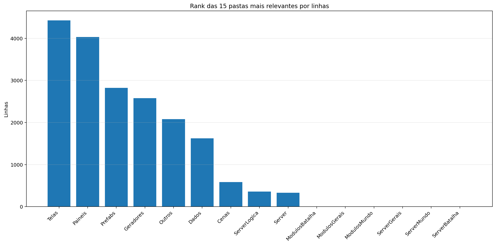
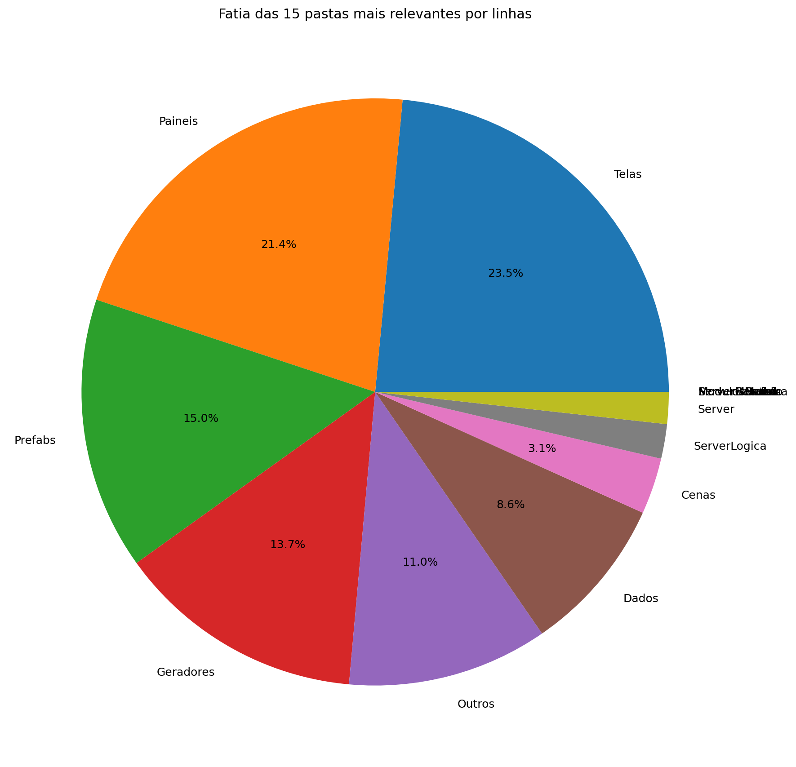
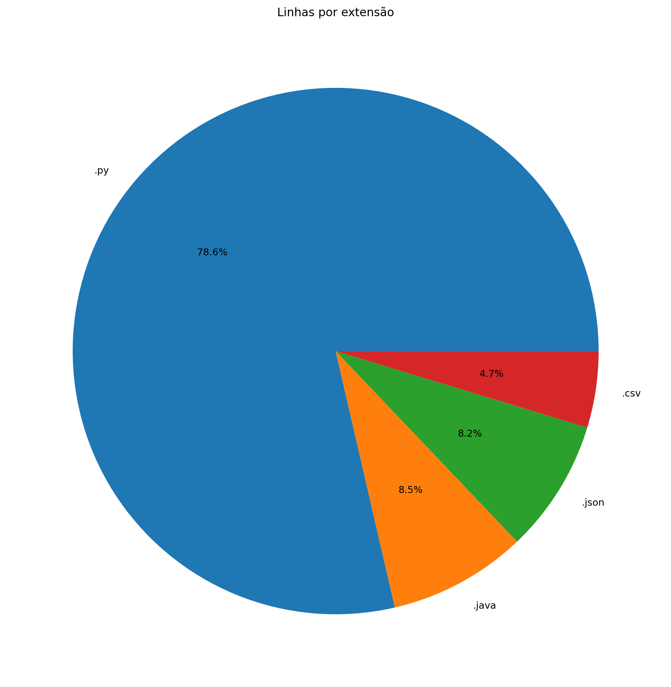
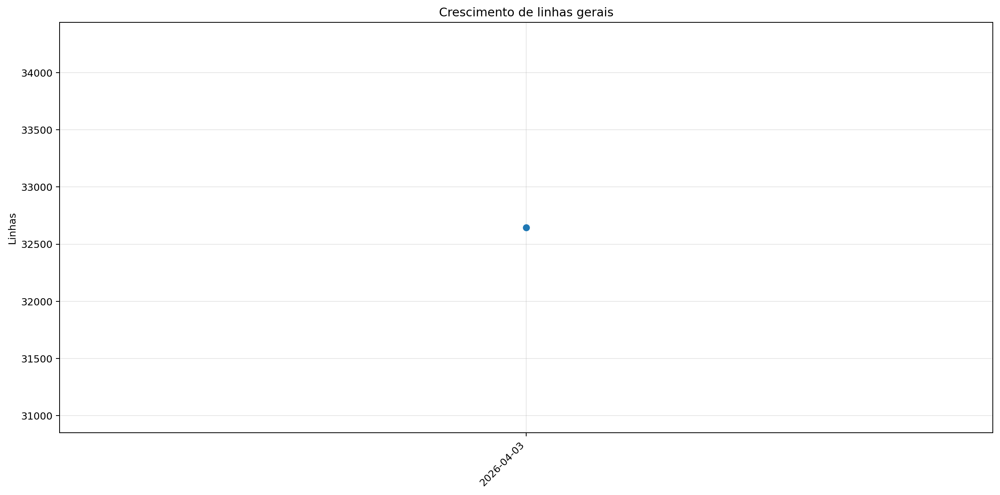
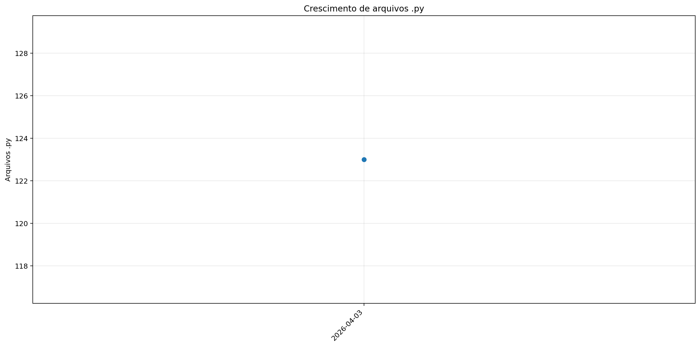

# Registro

**Relatório:** #1  
**Repo:** `relatorio_rebuild_7iw1uiu4`  
**Gerado em:** 2026-04-23T19:15:59  
**Modelo de relatório:** 9  
**Autor:** Leon Cunha Alvaro Lopez Soto

## Visão geral

- **Pastas:** 1.179
- **Arquivos:** 68.945
- **Arquivos de texto:** 138
- **Peso dos arquivos de texto:** 1379.91 KB
- **Tamanho total:** 0.398 GB (427.824.328 bytes)
- **Dias desde a criação do repo:** 32
- **Dias desde a criação oficial:** 306
- **Horas estimadas:** 313.00
- **Linhas totais gerais:** 32.645
- **Commits (repo):** 234

## Python

- **Arquivos `.py`:** 123
- **Linhas totais:** 25.664
- **Tamanho total `.py`:** 1039.42 KB
- **Classes encontradas:** 93
- **Funções encontradas:** 348
- **Métodos encontrados:** 1.099
- **Total funções + métodos:** 1.447
- **Bibliotecas diferentes usadas:** 37

## Rank das 15 pastas mais relevantes por linhas

| Rank | Pasta | Subpastas | Arquivos | Linhas gerais | Tamanho (KB) |
|---:|---|---:|---:|---:|---:|
| 1 | `Telas` | 1 | 15 | 4.428 | 171.50 |
| 2 | `Paineis` | 0 | 13 | 4.032 | 164.49 |
| 3 | `Prefabs` | 0 | 14 | 2.823 | 100.76 |
| 4 | `Geradores` | 1 | 16 | 2.576 | 114.22 |
| 5 | `Outros` | 0 | 3 | 2.080 | 73.35 |
| 6 | `Dados` | 0 | 6 | 1.625 | 157.56 |
| 7 | `Cenas` | 0 | 7 | 584 | 22.16 |
| 8 | `ServerLogica` | 0 | 3 | 358 | 16.77 |
| 9 | `Server` | 0 | 4 | 330 | 11.91 |
| 10 | `ModulosBatalha` | 0 | 0 | 0 | 0.00 |
| 11 | `ModulosGerais` | 0 | 0 | 0 | 0.00 |
| 12 | `ModulosMundo` | 0 | 0 | 0 | 0.00 |
| 13 | `ServerGerais` | 0 | 0 | 0 | 0.00 |
| 14 | `ServerMundo` | 0 | 0 | 0 | 0.00 |
| 15 | `ServerBatalha` | 0 | 0 | 0 | 0.00 |

## Top 50 maiores arquivos `.py` por linhas

| Arquivo | Linhas | Tamanho (KB) |
|---|---:|---:|
| `Outros/GeradorRelatorios.py` | 1.619 | 57.87 |
| `Codigo/Paineis/FichaPokemon.py` | 1.129 | 50.21 |
| `Codigo/Telas/Inventario/InventarioPokemons.py` | 960 | 43.88 |
| `Codigo/Modulos/ControladorMundo/ControladorObjetos.py` | 623 | 28.92 |
| `SimuladorServerJogo/Controle/BancoDados.py` | 570 | 26.52 |
| `Codigo/Geradores/PokemonMundo.py` | 562 | 27.04 |
| `Codigo/Modulos/ControladorMundo/ControladorPlayer.py` | 544 | 24.33 |
| `SimuladorServerJogo/Controle/EstadoServidor.py` | 540 | 21.50 |
| `Codigo/Paineis/Container.py` | 534 | 19.03 |
| `Codigo/Paineis/PainelArvoreHabilidades.py` | 504 | 24.54 |
| `Codigo/Telas/TelaServers.py` | 502 | 15.93 |
| `Codigo/Telas/Inventario/InventarioItens.py` | 488 | 22.90 |
| `Codigo/Prefabs/Botao.py` | 476 | 17.47 |
| `Codigo/Telas/TelasGenericas.py` | 463 | 15.83 |
| `Outros/Mixer.py` | 460 | 15.31 |
| `Codigo/Paineis/PainelReceitas.py` | 452 | 15.07 |
| `SimuladorServerJogo/Rotas/Comandos.py` | 450 | 18.17 |
| `Codigo/Modulos/Sonoridades.py` | 448 | 11.62 |
| `SimuladorServerJogo/Geradores/GeradorPokemon.py` | 428 | 16.81 |
| `Codigo/Telas/TelaCriarPersonagem.py` | 417 | 15.19 |
| `Codigo/Paineis/PainelCraft.py` | 412 | 16.04 |
| `Codigo/Geradores/Ator.py` | 397 | 17.37 |
| `Codigo/Geradores/Player/Controle.py` | 370 | 15.91 |
| `Codigo/Telas/Inventario/Estatisticas.py` | 368 | 16.27 |
| `Codigo/Telas/TelaOperador.py` | 352 | 11.98 |
| `SimuladorServerJogo/Controle/ObjetosMundoServer.py` | 346 | 22.82 |
| `SimuladorServerJogo/Rotas/Atualizador.py` | 339 | 14.56 |
| `SimuladorServerJogo/Geradores/GeradorMundo.py` | 338 | 13.64 |
| `Codigo/Paineis/PainelTimes.py` | 335 | 12.55 |
| `Codigo/Prefabs/Texto.py` | 332 | 11.77 |
| `Codigo/Paineis/FichaAtaque.py` | 322 | 13.30 |
| `SimuladorServerJogo/Controle/Cerebros/CerebroCentral.py` | 313 | 16.60 |
| `Codigo/Prefabs/Painel.py` | 300 | 11.15 |
| `Codigo/Geradores/PokemonInventario.py` | 298 | 11.33 |
| `Codigo/Modulos/Colisor.py` | 276 | 9.29 |
| `Codigo/Telas/Config.py` | 257 | 8.31 |
| `Codigo/Prefabs/Terminal.py` | 250 | 8.96 |
| `Codigo/Modulos/ControladorMundo/LeitorMundo.py` | 244 | 11.78 |
| `Codigo/Server/ServerMundo.py` | 235 | 9.28 |
| `Codigo/Prefabs/CaixaTexto.py` | 231 | 9.38 |
| `SimuladorServerJogo/Logica/AutoridadeCaptura.py` | 229 | 9.61 |
| `Codigo/Paineis/PainelAuxiliarPoke.py` | 215 | 8.54 |
| `SimuladorServerJogo/Rotas/Ativador.py` | 212 | 9.03 |
| `Codigo/Telas/TelaLogin.py` | 203 | 5.71 |
| `Codigo/Prefabs/Barra.py` | 201 | 7.35 |
| `Codigo/Cenas/CenaMundo.py` | 198 | 8.93 |
| `SimuladorServerJogo/Controle/ServicoInventario.py` | 192 | 8.67 |
| `Codigo/Prefabs/Tooltip.py` | 192 | 6.95 |
| `Codigo/Geradores/Player/Perfil.py` | 187 | 10.59 |
| `Codigo/Prefabs/BarraPesquisa.py` | 185 | 6.54 |

## Top 20 maiores funções e métodos

| Arquivo | Nome | Tipo | Linhas |
|---|---|---:|---:|
| `Outros/GeradorRelatorios.py` | `coletar_metricas` | funcao | 239 |
| `Codigo/Telas/Inventario/InventarioPokemons.py` | `InventarioPokemons.atualizar` | metodo | 145 |
| `Codigo/Prefabs/Fluxos.py` | `Fluxo.desenhar` | metodo | 141 |
| `SimuladorServerJogo/Rotas/Atualizador.py` | `processar_atualizador_json` | funcao | 138 |
| `Outros/GeradorRelatorios.py` | `analisar_python_ast` | funcao | 132 |
| `Codigo/Telas/TelaMenu.py` | `TelaMenu` | funcao | 131 |
| `Outros/GeradorRelatorios.py` | `gerar_markdown` | funcao | 126 |
| `Codigo/Prefabs/Botao.py` | `Botao.render` | metodo | 116 |
| `Codigo/Telas/TelaCriarPersonagem.py` | `SubtelaCriarPersonagem._rebuild_layout` | metodo | 112 |
| `Outros/Mixer.py` | `main` | funcao | 109 |
| `SimuladorServerJogo/Geradores/GeradorMundo.py` | `_executar_world_generator` | funcao | 103 |
| `SimuladorServerJogo/Controle/Cerebros/CerebroItensMundo.py` | `CerebroItensMundo.executar_tick` | metodo | 101 |
| `Codigo/Telas/Config.py` | `_montar_layout` | funcao | 99 |
| `SimuladorServerJogo/Logica/AutoridadeCaptura.py` | `resolver_captura` | funcao | 96 |
| `Codigo/Telas/Inventario/Estatisticas.py` | `InventarioPerfil._reconstruir_layout` | metodo | 95 |
| `Codigo/Telas/Inventario/InventarioItens.py` | `InventarioItens.atualizar` | metodo | 93 |
| `SimuladorServerJogo/Rotas/Entrada.py` | `processar_entrada_json` | funcao | 89 |
| `Codigo/Telas/TelaServers.py` | `_montar_layout` | funcao | 89 |
| `Codigo/Geradores/Ator.py` | `Ator.desenhar` | metodo | 88 |
| `Codigo/Telas/Inventario/InventarioPokemons.py` | `InventarioPokemons._reconstruir` | metodo | 85 |

## Top 20 maiores classes

| Arquivo | Classe | Linhas |
|---|---|---:|
| `Codigo/Paineis/FichaPokemon.py` | `FichaPokemon` | 1.098 |
| `Codigo/Telas/Inventario/InventarioPokemons.py` | `InventarioPokemons` | 934 |
| `Codigo/Modulos/ControladorMundo/ControladorObjetos.py` | `ControladorObjetos` | 602 |
| `SimuladorServerJogo/Controle/BancoDados.py` | `BancoDadosMundo` | 542 |
| `Codigo/Geradores/PokemonMundo.py` | `Pokemon` | 539 |
| `Codigo/Paineis/Container.py` | `Container` | 525 |
| `Codigo/Modulos/ControladorMundo/ControladorPlayer.py` | `ControladorPlayer` | 525 |
| `Codigo/Paineis/PainelArvoreHabilidades.py` | `PainelArvoreHabilidades` | 474 |
| `Codigo/Telas/Inventario/InventarioItens.py` | `InventarioItens` | 472 |
| `Codigo/Paineis/PainelReceitas.py` | `PainelReceitas` | 436 |
| `Codigo/Paineis/PainelCraft.py` | `PainelCraft` | 398 |
| `Codigo/Geradores/Ator.py` | `Ator` | 377 |
| `Codigo/Geradores/Player/Controle.py` | `Controle` | 358 |
| `Codigo/Prefabs/Botao.py` | `Botao` | 356 |
| `Codigo/Telas/Inventario/Estatisticas.py` | `InventarioPerfil` | 354 |
| `Codigo/Telas/TelaCriarPersonagem.py` | `SubtelaCriarPersonagem` | 343 |
| `Codigo/Paineis/PainelTimes.py` | `PainelTimes` | 326 |
| `Codigo/Paineis/FichaAtaque.py` | `FichaAtaque` | 312 |
| `Codigo/Geradores/PokemonInventario.py` | `PokemonInventario` | 286 |
| `SimuladorServerJogo/Controle/Cerebros/CerebroCentral.py` | `CerebroCentral` | 281 |

## Top 10 arquivos mais importados

| Arquivo | Vezes importado |
|---|---:|
| `Codigo/Prefabs/Texto.py` | 26 |
| `Codigo/Prefabs/Botao.py` | 18 |
| `Codigo/Geradores/ItemInventario.py` | 13 |
| `SimuladorServerJogo/Controle/BancoDados.py` | 12 |
| `SimuladorServerJogo/Rotas/Ativador.py` | 11 |
| `SimuladorServerJogo/Controle/EstadoServidor.py` | 10 |
| `SimuladorServerJogo/Controle/ObjetosMundoServer.py` | 9 |
| `Codigo/Modulos/Colisor.py` | 8 |
| `Codigo/Prefabs/Painel.py` | 8 |
| `Codigo/Prefabs/Barra.py` | 7 |

## Top 10 arquivos que mais importam

| Arquivo | Arquivos internos importados | Imports totais | Linhas |
|---|---:|---:|---:|
| `SimuladorServerJogo/Controle/Cerebros/CerebroCentral.py` | 14 | 22 | 313 |
| `Codigo/Telas/Inventario/InventarioPokemons.py` | 12 | 19 | 960 |
| `Codigo/Paineis/FichaPokemon.py` | 9 | 21 | 1.129 |
| `Codigo/Telas/Inventario/InventarioItens.py` | 9 | 12 | 488 |
| `Codigo/Cenas/CenaMundo.py` | 9 | 10 | 198 |
| `Codigo/Cenas/ControladorCenas.py` | 9 | 10 | 169 |
| `Codigo/Modulos/ControladorMundo/ControladorObjetos.py` | 8 | 14 | 623 |
| `SimuladorServerJogo/Controle/EstadoServidor.py` | 7 | 13 | 540 |
| `SimuladorServerJogo/Rotas/Comandos.py` | 7 | 12 | 450 |
| `SimuladorServerJogo/Rotas/Atualizador.py` | 7 | 11 | 339 |

## Top 10 maiores arquivos por linhas

| Arquivo | Ext | Linhas |
|---|---:|---:|
| `SimuladorServerJogo/Geradores/WorldGenerator.java` | `.java` | 2.775 |
| `SimuladorServerJogo/Geradores/Regras/Geracao.json` | `.json` | 1.715 |
| `Outros/GeradorRelatorios.py` | `.py` | 1.619 |
| `Dados/Pokemon Global Server - Pokemons.csv` | `.csv` | 1.277 |
| `Codigo/Paineis/FichaPokemon.py` | `.py` | 1.129 |
| `Codigo/Telas/Inventario/InventarioPokemons.py` | `.py` | 960 |
| `SimuladorServerJogo/Regras/Geracao.json` | `.json` | 658 |
| `Codigo/Modulos/ControladorMundo/ControladorObjetos.py` | `.py` | 623 |
| `SimuladorServerJogo/Controle/BancoDados.py` | `.py` | 570 |
| `Codigo/Geradores/PokemonMundo.py` | `.py` | 562 |

## Linhas por extensão

| Ext | Linhas |
|---:|---:|
| `.py` | 25.664 |
| `.java` | 2.775 |
| `.json` | 2.673 |
| `.csv` | 1.533 |

## Peso por extensão

| Ext | Arquivos | Peso | % do jogo |
|---:|---:|---:|---:|
| `.png` | 68.750 | 356.71 MB | 87.43% |
| `.ogg` | 17 | 46.32 MB | 11.35% |
| `.jpg` | 21 | 3.14 MB | 0.77% |
| `.py` | 123 | 1.02 MB | 0.25% |
| `.wav` | 3 | 214.57 KB | 0.05% |
| `.ttf` | 2 | 196.64 KB | 0.05% |
| `.csv` | 5 | 155.32 KB | 0.04% |
| `.java` | 1 | 120.61 KB | 0.03% |
| `.class` | 14 | 83.59 KB | 0.02% |
| `.json` | 7 | 64.57 KB | 0.02% |

## Comparativo com o último relatório

_Sem relatório anterior compatível para montar comparativo._

### Top 3 commits por tamanho de diff

_Sem commits suficientes entre os relatórios para montar top por diff._

## Gráficos de crescimento

