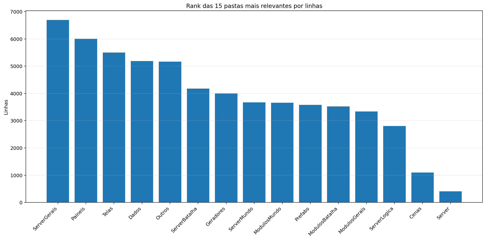
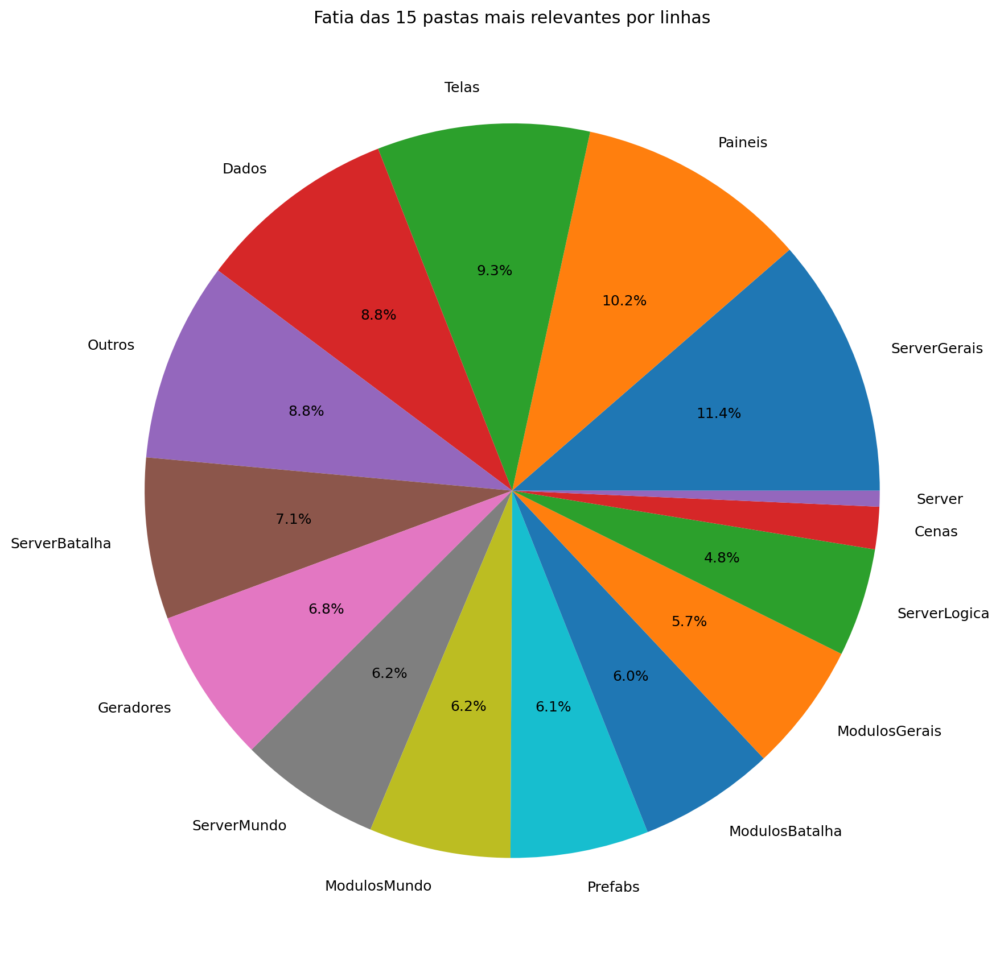
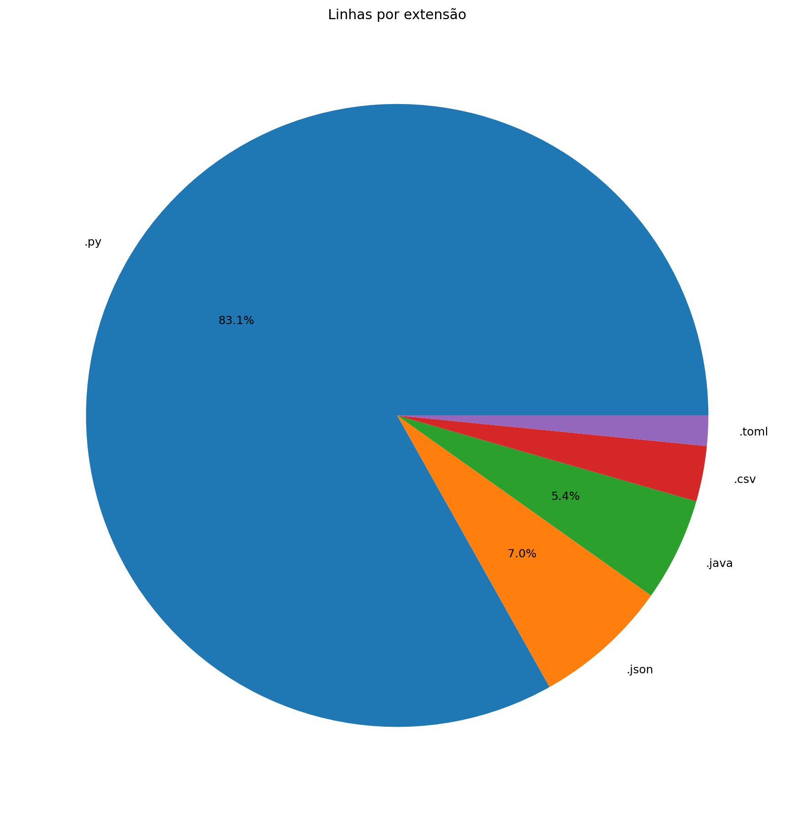
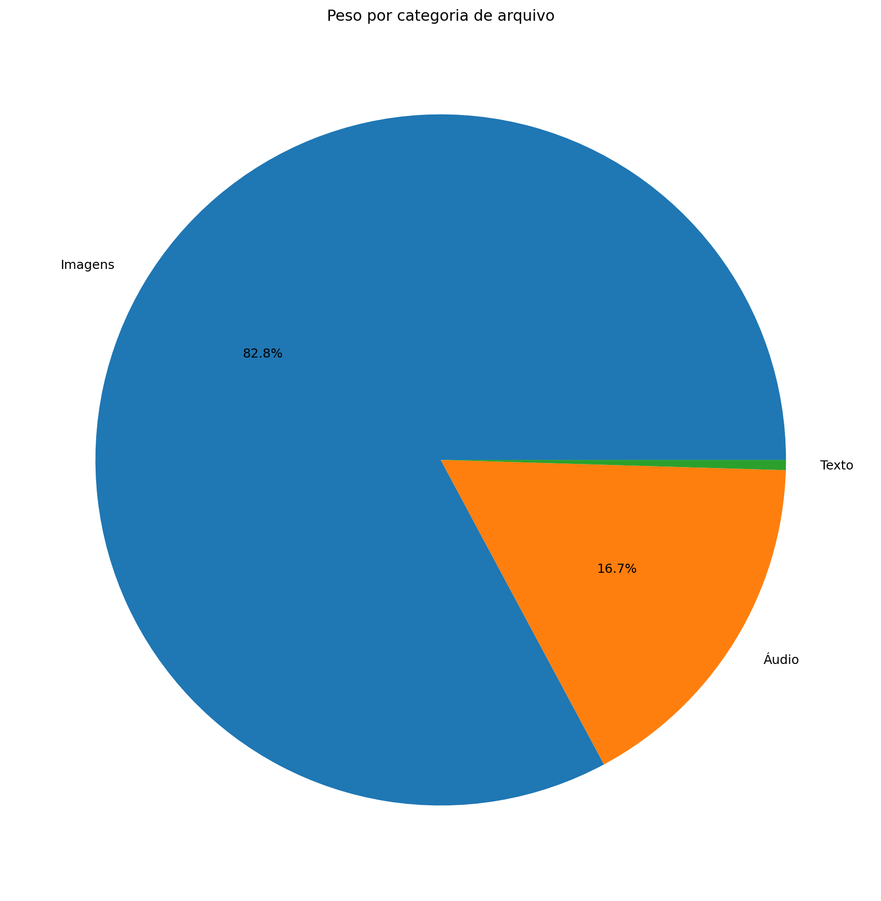
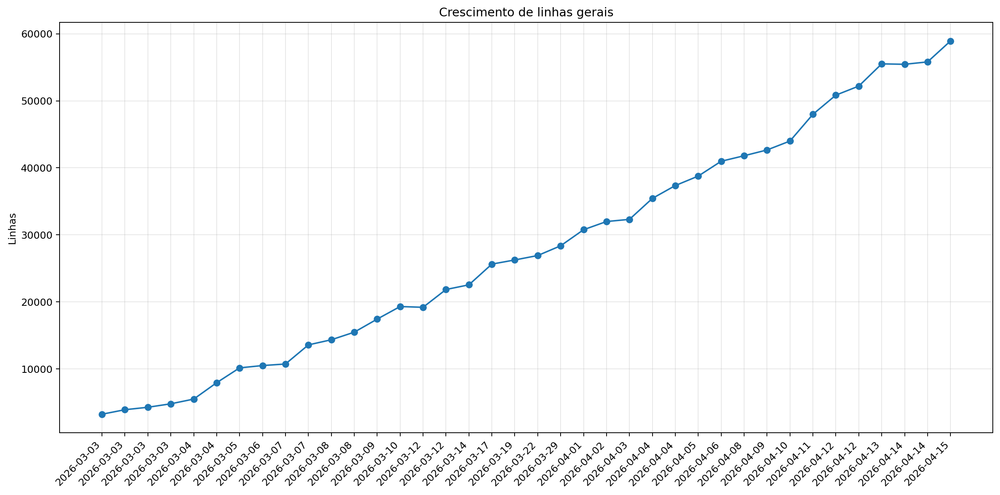
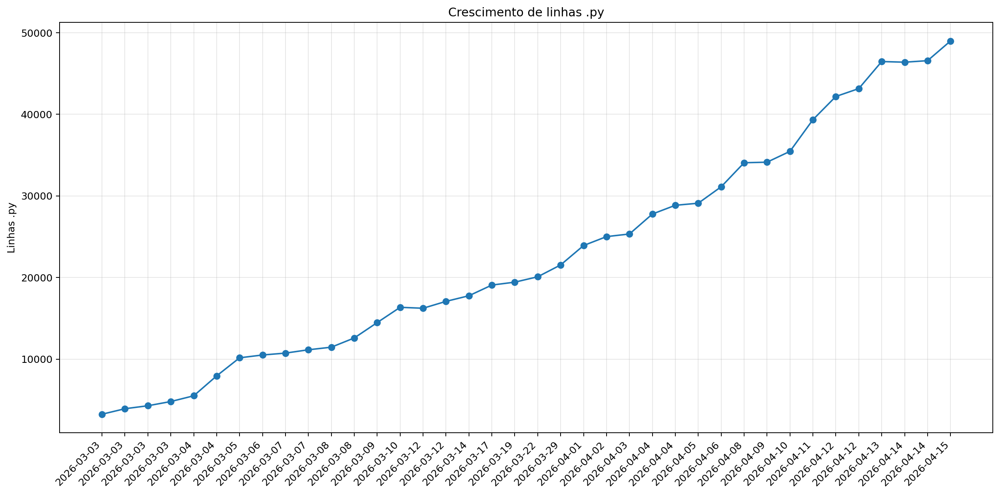
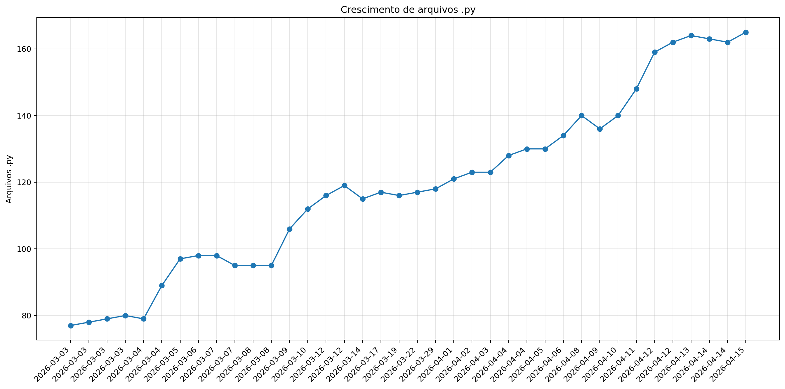
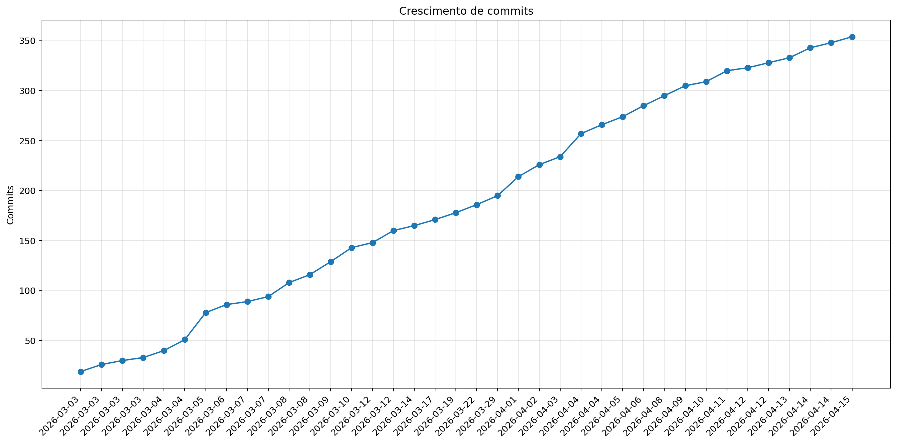

# Registro

**Relatório:** #38  
**Repo:** `relatorio_rebuild_6lbihjmb`  
**Gerado em:** 2026-04-23T19:34:46  
**Modelo de relatório:** 9  
**Autor:** Leon Cunha Alvaro Lopez Soto

## Visão geral

- **Pastas:** 1.251
- **Arquivos:** 72.062
- **Arquivos de texto:** 224
- **Peso dos arquivos de texto:** 2538.91 KB
- **Tamanho total:** 0.553 GB (594.244.983 bytes)
- **Dias desde a criação do repo:** 44
- **Dias desde a criação oficial:** 318
- **Horas estimadas:** 313.00
- **Linhas totais gerais:** 58.927
- **Commits (repo):** 354
- **Adições desde o último relatório:** +4.754
- **Reduções desde o último relatório:** -474

## Python

- **Arquivos `.py`:** 165
- **Linhas totais:** 48.988
- **Tamanho total `.py`:** 2113.01 KB
- **Classes encontradas:** 166
- **Funções encontradas:** 539
- **Métodos encontrados:** 2.226
- **Total funções + métodos:** 2.765
- **Bibliotecas diferentes usadas:** 43

## Rank das 15 pastas mais relevantes por linhas

| Rank | Pasta | Subpastas | Arquivos | Linhas gerais | Tamanho (KB) |
|---:|---|---:|---:|---:|---:|
| 1 | `ServerGerais` | 3 | 16 | 6.697 | 273.18 |
| 2 | `Paineis` | 0 | 16 | 6.001 | 258.42 |
| 3 | `Telas` | 1 | 19 | 5.496 | 217.43 |
| 4 | `Dados` | 3 | 37 | 5.188 | 272.12 |
| 5 | `Outros` | 0 | 7 | 5.166 | 205.24 |
| 6 | `ServerBatalha` | 1 | 13 | 4.176 | 202.46 |
| 7 | `Geradores` | 1 | 16 | 3.998 | 180.77 |
| 8 | `ServerMundo` | 1 | 16 | 3.670 | 190.25 |
| 9 | `ModulosMundo` | 0 | 12 | 3.661 | 168.21 |
| 10 | `Prefabs` | 0 | 14 | 3.576 | 130.34 |
| 11 | `ModulosBatalha` | 0 | 11 | 3.520 | 163.11 |
| 12 | `ModulosGerais` | 0 | 12 | 3.337 | 124.88 |
| 13 | `ServerLogica` | 3 | 21 | 2.805 | 84.27 |
| 14 | `Cenas` | 0 | 6 | 1.095 | 49.40 |
| 15 | `Server` | 0 | 4 | 410 | 15.00 |

## Top 50 maiores arquivos `.py` por linhas

| Arquivo | Linhas | Tamanho (KB) |
|---|---:|---:|
| `Outros/EditorFluxos.py` | 1.858 | 85.38 |
| `Outros/GeradorRelatorios.py` | 1.619 | 57.87 |
| `SimuladorServerJogo/Batalha/LeitorJogadas.py` | 1.591 | 86.94 |
| `Codigo/Paineis/FichaPokemon.py` | 1.277 | 57.22 |
| `Codigo/Telas/Inventario/InventarioPokemons.py` | 1.061 | 48.38 |
| `Codigo/ModulosMundo/ControladorObjetos.py` | 819 | 40.53 |
| `Codigo/Prefabs/Texto.py` | 806 | 30.97 |
| `Codigo/ModulosGerais/PokemonAnimator.py` | 769 | 30.62 |
| `Codigo/Paineis/VisualizadorLog.py` | 762 | 37.02 |
| `SimuladorServerJogo/Gerais/EstadoServidor.py` | 754 | 30.42 |
| `Codigo/ModulosBatalha/LeitorFluxos.py` | 715 | 31.24 |
| `Codigo/ModulosBatalha/ControladorFluxos.py` | 711 | 33.08 |
| `Codigo/ModulosMundo/ControladorPlayer.py` | 710 | 33.86 |
| `SimuladorServerJogo/Logica/Comandos/Comandos.py` | 686 | 28.53 |
| `Codigo/Geradores/PokemonMundo.py` | 685 | 33.75 |
| `SimuladorServerJogo/Batalha/PokemonBatalha.py` | 664 | 32.51 |
| `Codigo/Geradores/PokemonBatalha.py` | 639 | 31.39 |
| `Codigo/Paineis/Container.py` | 637 | 23.33 |
| `Codigo/Paineis/FichaPokemonBatalha.py` | 625 | 30.50 |
| `SimuladorServerJogo/Mundo/BancoDados.py` | 602 | 28.55 |
| `SimuladorServerJogo/Gerais/Geradores/GeradorMundo.py` | 583 | 22.71 |
| `SimuladorServerJogo/Gerais/Rotas/Atualizador.py` | 553 | 26.82 |
| `Codigo/ModulosGerais/Sonoridades.py` | 553 | 14.59 |
| `Codigo/Paineis/PainelArvoreHabilidades.py` | 547 | 26.81 |
| `SimuladorServerJogo/Mundo/Cerebros/CerebroNPCs.py` | 528 | 27.10 |
| `Outros/EditorSkins.py` | 514 | 19.97 |
| `SimuladorServerJogo/Gerais/Geradores/GeradorPokemon.py` | 509 | 20.35 |
| `Codigo/Telas/Inventario/InventarioItens.py` | 509 | 23.76 |
| `Outros/AtualizadorRelatorios.py` | 505 | 17.88 |
| `Codigo/Telas/TelaServers.py` | 492 | 15.67 |
| `Codigo/Prefabs/Botao.py` | 480 | 17.59 |
| `Codigo/ModulosMundo/LeitorDialogo.py` | 478 | 19.33 |
| `SimuladorServerJogo/Mundo/ObjetosMundoServer.py` | 474 | 30.78 |
| `Codigo/Cenas/CenaMundo.py` | 474 | 24.87 |
| `Outros/Mixer.py` | 460 | 15.31 |
| `Codigo/ModulosGerais/FiltroCamera.py` | 460 | 21.03 |
| `Codigo/Paineis/PainelReceitas.py` | 455 | 15.29 |
| `Codigo/Telas/TelasGenericas.py` | 448 | 15.30 |
| `SimuladorServerJogo/Batalha/SistemaBatalha.py` | 431 | 19.36 |
| `Codigo/Telas/SubtelaDialogo.py` | 428 | 18.78 |
| `Codigo/Telas/SubtelaCriarPersonagem.py` | 423 | 15.31 |
| `SimuladorServerJogo/Batalha/SimuladorFisica.py` | 415 | 18.27 |
| `Codigo/Geradores/Ator.py` | 409 | 17.87 |
| `Codigo/Telas/Inventario/Estatisticas.py` | 401 | 17.83 |
| `SimuladorServerJogo/Mundo/Cerebros/CerebroCentral.py` | 400 | 20.60 |
| `Codigo/Geradores/Player/Controle.py` | 400 | 17.10 |
| `SimuladorServerJogo/Gerais/LoaderRegras.py` | 383 | 22.27 |
| `Codigo/ModulosGerais/Colisor.py` | 379 | 14.48 |
| `Codigo/Telas/TelaOperador.py` | 379 | 13.53 |
| `Codigo/Geradores/Estadio.py` | 372 | 14.03 |

## Top 20 maiores funções e métodos

| Arquivo | Nome | Tipo | Linhas |
|---|---|---:|---:|
| `Codigo/Prefabs/Fluxos.py` | `Fluxo.desenhar` | metodo | 249 |
| `SimuladorServerJogo/Batalha/LeitorJogadas.py` | `LeitorJogadas._traduzir_evento_publico` | metodo | 248 |
| `SimuladorServerJogo/Gerais/Rotas/Atualizador.py` | `processar_atualizador_json` | funcao | 247 |
| `Outros/GeradorRelatorios.py` | `coletar_metricas` | funcao | 239 |
| `Codigo/Geradores/Estadio.py` | `EstadioInterno.renderizar` | metodo | 232 |
| `SimuladorServerJogo/Batalha/LeitorJogadas.py` | `LeitorJogadas.executar_turno` | metodo | 216 |
| `Codigo/Paineis/VisualizadorLog.py` | `VisualizadorLog._registro_evento` | metodo | 163 |
| `Codigo/Telas/Inventario/InventarioPokemons.py` | `InventarioPokemons.atualizar` | metodo | 147 |
| `Codigo/ModulosGerais/Colisor.py` | `Colisor.resolver_movimento_com_colisores` | metodo | 146 |
| `SimuladorServerJogo/Gerais/Geradores/GeradorMundo.py` | `_executar_world_generator` | funcao | 140 |
| `Outros/GeradorRelatorios.py` | `analisar_python_ast` | funcao | 132 |
| `Codigo/Telas/TelaMenu.py` | `TelaMenu` | funcao | 131 |
| `Outros/AtualizadorRelatorios.py` | `main` | funcao | 128 |
| `Outros/EditorFluxos.py` | `EditorFluxos.draw_panel` | metodo | 127 |
| `Outros/GeradorRelatorios.py` | `gerar_markdown` | funcao | 126 |
| `Codigo/Prefabs/Botao.py` | `Botao.render` | metodo | 119 |
| `Codigo/Telas/Inventario/InventarioPokemons.py` | `InventarioPokemons._reconstruir` | metodo | 118 |
| `Codigo/Telas/SubtelaCriarPersonagem.py` | `SubtelaCriarPersonagem._rebuild_layout` | metodo | 112 |
| `SimuladorServerJogo/Batalha/PokemonBatalha.py` | `PokemonBatalha.Verifica` | metodo | 110 |
| `Outros/Mixer.py` | `main` | funcao | 109 |

## Top 20 maiores classes

| Arquivo | Classe | Linhas |
|---|---|---:|
| `SimuladorServerJogo/Batalha/LeitorJogadas.py` | `LeitorJogadas` | 1.575 |
| `Codigo/Paineis/FichaPokemon.py` | `FichaPokemon` | 1.245 |
| `Codigo/Telas/Inventario/InventarioPokemons.py` | `InventarioPokemons` | 1.033 |
| `Outros/EditorFluxos.py` | `EditorFluxos` | 986 |
| `Codigo/ModulosMundo/ControladorObjetos.py` | `ControladorObjetos` | 798 |
| `Codigo/ModulosBatalha/ControladorFluxos.py` | `ControladorFluxos` | 697 |
| `Codigo/ModulosMundo/ControladorPlayer.py` | `ControladorPlayer` | 691 |
| `Codigo/ModulosGerais/PokemonAnimator.py` | `PokemonAnimator` | 672 |
| `Codigo/Geradores/PokemonMundo.py` | `Pokemon` | 661 |
| `Codigo/ModulosBatalha/LeitorFluxos.py` | `LeitorFluxos` | 644 |
| `SimuladorServerJogo/Batalha/PokemonBatalha.py` | `PokemonBatalha` | 633 |
| `Codigo/Paineis/Container.py` | `Container` | 628 |
| `Codigo/Geradores/PokemonBatalha.py` | `PokemonBatalha` | 617 |
| `Codigo/Paineis/FichaPokemonBatalha.py` | `FichaPokemonBatalha` | 606 |
| `SimuladorServerJogo/Mundo/BancoDados.py` | `BancoDadosMundo` | 574 |
| `Codigo/Paineis/VisualizadorLog.py` | `VisualizadorLog` | 572 |
| `Codigo/Paineis/PainelArvoreHabilidades.py` | `PainelArvoreHabilidades` | 517 |
| `SimuladorServerJogo/Mundo/Cerebros/CerebroNPCs.py` | `CerebroNPCs` | 508 |
| `Codigo/Telas/Inventario/InventarioItens.py` | `InventarioItens` | 492 |
| `Codigo/ModulosMundo/LeitorDialogo.py` | `LeitorDialogo` | 468 |

## Top 10 arquivos mais importados

| Arquivo | Vezes importado |
|---|---:|
| `Codigo/Prefabs/Texto.py` | 36 |
| `Codigo/Prefabs/Botao.py` | 27 |
| `SimuladorServerJogo/Mundo/BancoDados.py` | 14 |
| `Codigo/Geradores/ItemInventario.py` | 14 |
| `Codigo/ModulosGerais/Sonoridades.py` | 13 |
| `SimuladorServerJogo/Gerais/LoaderRegras.py` | 13 |
| `SimuladorServerJogo/Gerais/EstadoServidor.py` | 13 |
| `SimuladorServerJogo/Gerais/Rotas/Ativador.py` | 12 |
| `Codigo/ModulosGerais/Auxiliares.py` | 12 |
| `SimuladorServerJogo/Mundo/ObjetosMundoServer.py` | 11 |

## Top 10 arquivos que mais importam

| Arquivo | Arquivos internos importados | Imports totais | Linhas |
|---|---:|---:|---:|
| `Codigo/Cenas/CenaMundo.py` | 19 | 21 | 474 |
| `SimuladorServerJogo/Mundo/Cerebros/CerebroCentral.py` | 16 | 25 | 400 |
| `Codigo/Telas/Inventario/InventarioPokemons.py` | 14 | 21 | 1.061 |
| `SimuladorServerJogo/Gerais/Rotas/Atualizador.py` | 12 | 16 | 553 |
| `Codigo/Cenas/ControladorCenas.py` | 11 | 14 | 286 |
| `Codigo/Telas/Inventario/InventarioItens.py` | 10 | 13 | 509 |
| `Codigo/Paineis/FichaPokemon.py` | 9 | 22 | 1.277 |
| `Codigo/Paineis/FichaPokemonBatalha.py` | 9 | 14 | 625 |
| `Codigo/Cenas/CenaCombate.py` | 9 | 10 | 131 |
| `SimuladorServerJogo/Batalha/LeitorJogadas.py` | 8 | 12 | 1.591 |

## Top 10 maiores arquivos por linhas

| Arquivo | Ext | Linhas |
|---|---:|---:|
| `Outros/EditorFluxos.py` | `.py` | 1.858 |
| `Outros/GeradorRelatorios.py` | `.py` | 1.619 |
| `SimuladorServerJogo/Batalha/LeitorJogadas.py` | `.py` | 1.591 |
| `Dados/Pokemon Global Server - Pokemons.csv` | `.csv` | 1.277 |
| `Codigo/Paineis/FichaPokemon.py` | `.py` | 1.277 |
| `Codigo/Telas/Inventario/InventarioPokemons.py` | `.py` | 1.061 |
| `SimuladorServerJogo/Gerais/Geradores/Java/GeradorTerreno.java` | `.java` | 937 |
| `Codigo/ModulosMundo/ControladorObjetos.py` | `.py` | 819 |
| `Codigo/Prefabs/Texto.py` | `.py` | 806 |
| `SimuladorServerJogo/Gerais/Geradores/Java/WorldGenerator.java` | `.java` | 792 |

## Linhas por extensão

| Ext | Linhas |
|---:|---:|
| `.py` | 48.988 |
| `.json` | 4.151 |
| `.java` | 3.163 |
| `.csv` | 1.695 |
| `.toml` | 924 |

## Peso por extensão

| Ext | Arquivos | Peso | % do jogo |
|---:|---:|---:|---:|
| `.png` | 71.766 | 466.32 MB | 82.28% |
| `.ogg` | 35 | 90.64 MB | 15.99% |
| `.wav` | 9 | 3.81 MB | 0.67% |
| `.jpg` | 21 | 3.14 MB | 0.55% |
| `.py` | 165 | 2.06 MB | 0.36% |
| `.ttf` | 2 | 196.64 KB | 0.03% |
| `.csv` | 9 | 173.21 KB | 0.03% |
| `.mp3` | 3 | 135.71 KB | 0.02% |
| `.java` | 6 | 120.21 KB | 0.02% |
| `.json` | 29 | 113.51 KB | 0.02% |
| `.toml` | 14 | 18.90 KB | 0.00% |
| `.frag` | 1 | 7.18 KB | 0.00% |
| `.vert` | 1 | 170 bytes | 0.00% |

## Comparativo com o último relatório

| Métrica | Relatório anterior | Relatório atual | Diferença |
|---|---:|---:|---:|
| Arquivos | 72.077 | 72.062 | -15 |
| Linhas | 55.805 | 58.927 | +3.122 |
| Linhas .py | 46.574 | 48.988 | +2.414 |
| Métodos/funções | 2.635 | 2.765 | +130 |
| Classes | 160 | 166 | +6 |
| Commits | 348 | 354 | +6 |
| Tamanho | 562.41 MB | 566.72 MB | +4.31 MB |

### Top 3 commits por tamanho de diff

| Rank | Commit | Mensagem | Arquivos | Adições | Reduções | Diff total |
|---:|---|---|---:|---:|---:|---:|
| 1 | `7c19aa35e315` | Visualizador de Logs | 53 | 22.516 | 31 | 22.547 |
| 2 | `f0f0302239a5` | finalização de batalha (esta uma bosta de cavalo) | 61 | 947 | 21.348 | 22.295 |
| 3 | `3fdb1d305ff3` | relatorio | 10 | 1.524 | 46 | 1.570 |

## Gráficos de crescimento

