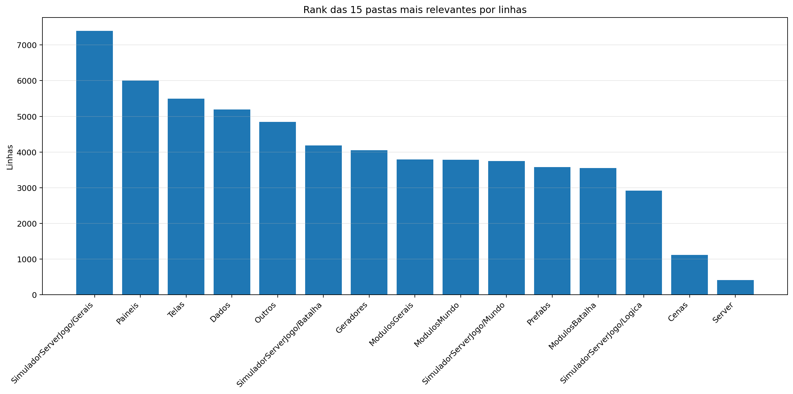
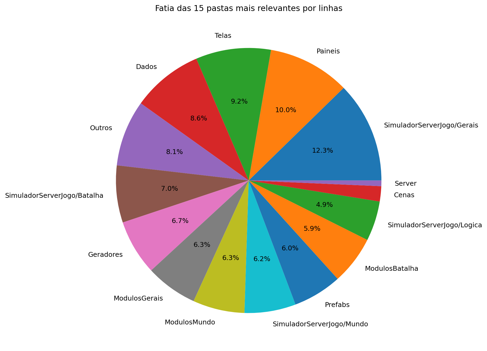
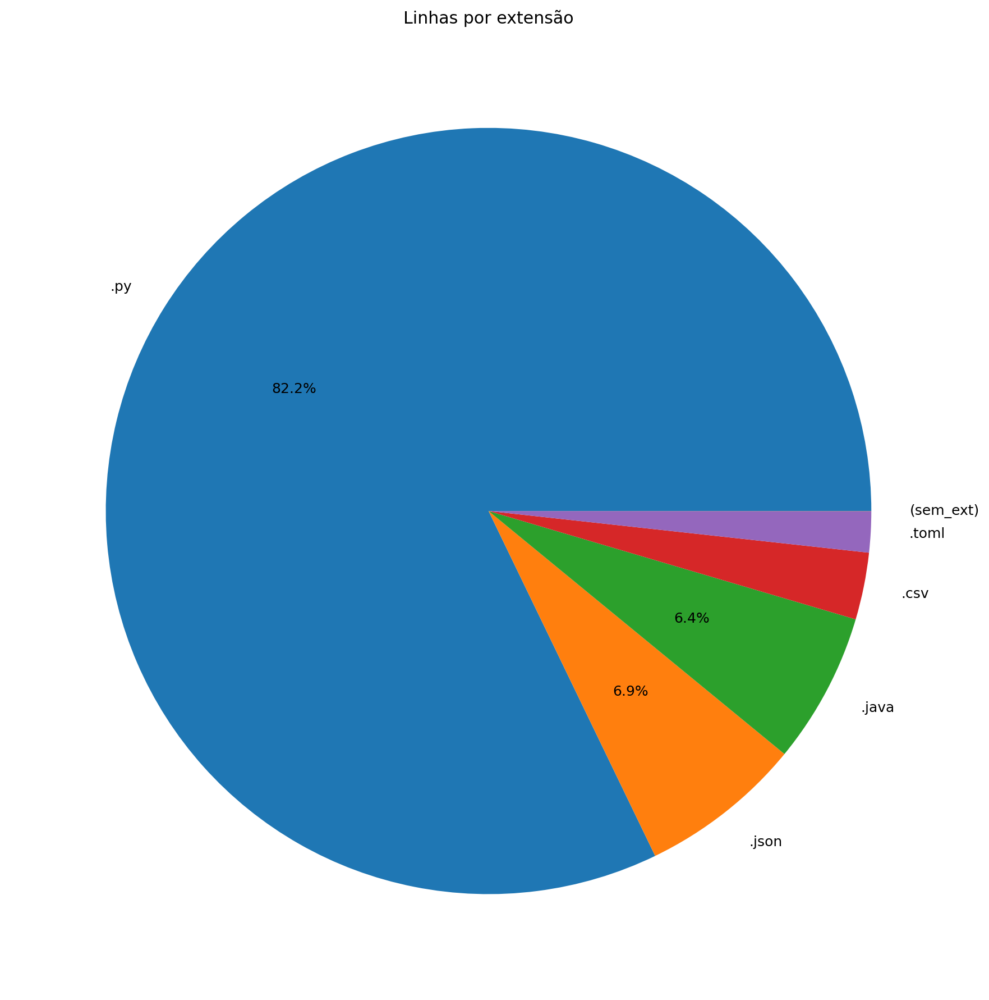
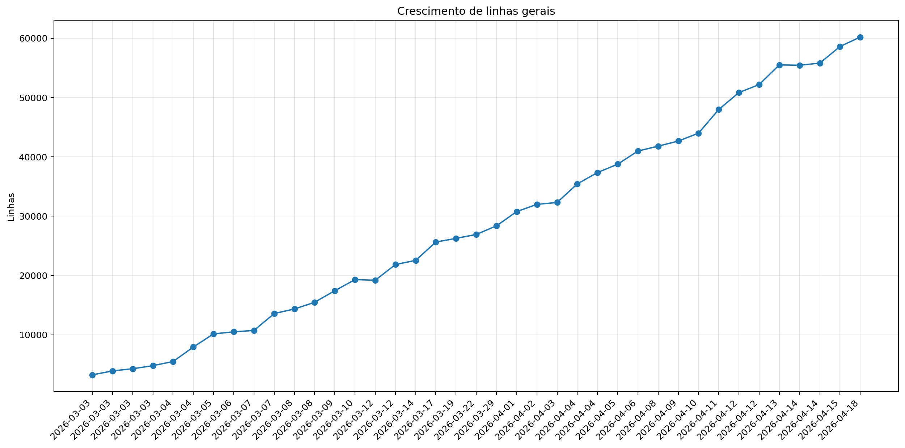
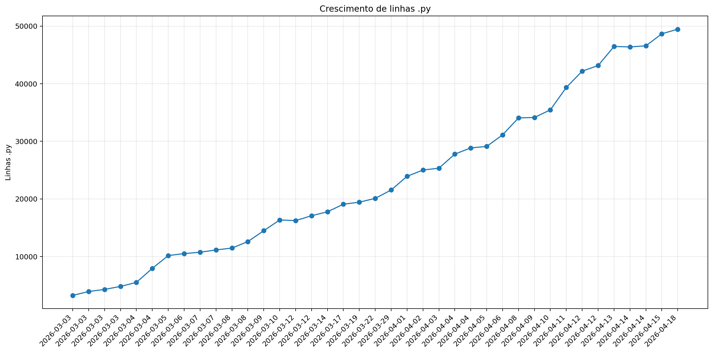
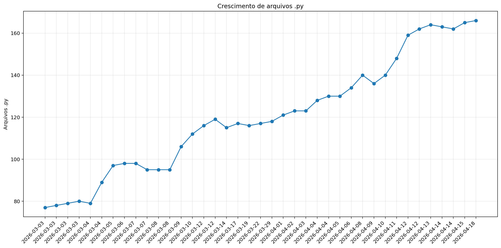

# Registro

**Relatório:** #39  
**Repo:** `Pokemon-Global-Server-Definitivo`  
**Gerado em:** 2026-04-18T17:57:02-03:00  
**Modelo de relatório:** 8  
**Autor:** Leon Cunha Alvaro Lopez Soto

## Visão geral

- **Pastas:** 1.254
- **Arquivos:** 72.095
- **Arquivos de texto:** 226
- **Peso dos arquivos de texto:** 2591.10 KB
- **Tamanho total:** 0.554 GB (594.421.875 bytes)
- **Dias desde a criação do repo:** 47
- **Horas estimadas:** 313.00
- **Linhas totais gerais:** 60.195
- **Commits (repo):** 364

## Python

- **Arquivos `.py`:** 166
- **Linhas totais:** 49.461
- **Tamanho total `.py`:** 2133.02 KB
- **Classes encontradas:** 169
- **Funções encontradas:** 531
- **Métodos encontrados:** 2.272
- **Total funções + métodos:** 2.803
- **Bibliotecas diferentes usadas:** 43

## Rank das 15 pastas mais relevantes por linhas

| Rank | Pasta | Caminho | Subpastas | Arquivos | Linhas gerais | Tamanho (KB) |
|---:|---|---|---:|---:|---:|---:|
| 1 | `SimuladorServerJogo/Gerais` | `SimuladorServerJogo/Gerais` | 4 | 48 | 7.396 | 419.87 |
| 2 | `Paineis` | `Codigo/Paineis` | 1 | 16 | 6.001 | 258.14 |
| 3 | `Telas` | `Codigo/Telas` | 1 | 19 | 5.496 | 217.43 |
| 4 | `Dados` | `Dados` | 3 | 37 | 5.195 | 277.58 |
| 5 | `Outros` | `Outros` | 0 | 7 | 4.846 | 191.61 |
| 6 | `SimuladorServerJogo/Batalha` | `SimuladorServerJogo/Batalha` | 1 | 13 | 4.180 | 201.51 |
| 7 | `Geradores` | `Codigo/Geradores` | 1 | 16 | 4.047 | 182.55 |
| 8 | `ModulosGerais` | `Codigo/ModulosGerais` | 0 | 13 | 3.796 | 144.11 |
| 9 | `ModulosMundo` | `Codigo/ModulosMundo` | 0 | 12 | 3.787 | 173.48 |
| 10 | `SimuladorServerJogo/Mundo` | `SimuladorServerJogo/Mundo` | 1 | 16 | 3.750 | 194.85 |
| 11 | `Prefabs` | `Codigo/Prefabs` | 0 | 14 | 3.576 | 130.14 |
| 12 | `ModulosBatalha` | `Codigo/ModulosBatalha` | 0 | 11 | 3.549 | 164.19 |
| 13 | `SimuladorServerJogo/Logica` | `SimuladorServerJogo/Logica` | 3 | 21 | 2.920 | 86.60 |
| 14 | `Cenas` | `Codigo/Cenas` | 0 | 6 | 1.115 | 50.77 |
| 15 | `Server` | `Codigo/Server` | 0 | 4 | 410 | 15.00 |

## Top 50 maiores arquivos `.py` por linhas

| Arquivo | Linhas | Tamanho (KB) |
|---|---:|---:|
| `Outros/EditorFluxos.py` | 1.858 | 83.57 |
| `SimuladorServerJogo/Batalha/LeitorJogadas.py` | 1.591 | 86.94 |
| `Outros/GeradorRelatorios.py` | 1.299 | 46.05 |
| `Codigo/Paineis/FichaPokemon.py` | 1.277 | 57.22 |
| `Codigo/Telas/Inventario/InventarioPokemons.py` | 1.061 | 48.38 |
| `Codigo/ModulosMundo/ControladorObjetos.py` | 824 | 40.63 |
| `Codigo/Prefabs/Texto.py` | 806 | 30.97 |
| `Codigo/ModulosGerais/PokemonAnimator.py` | 775 | 30.92 |
| `SimuladorServerJogo/Gerais/EstadoServidor.py` | 768 | 31.17 |
| `Codigo/Paineis/VisualizadorLog.py` | 762 | 37.02 |
| `Codigo/ModulosBatalha/ControladorFluxos.py` | 721 | 33.48 |
| `Codigo/ModulosBatalha/LeitorFluxos.py` | 715 | 31.24 |
| `Codigo/ModulosMundo/ControladorPlayer.py` | 710 | 33.86 |
| `Codigo/Geradores/PokemonMundo.py` | 687 | 33.86 |
| `SimuladorServerJogo/Logica/Comandos/Comandos.py` | 686 | 28.53 |
| `SimuladorServerJogo/Mundo/BancoDados.py` | 672 | 32.42 |
| `SimuladorServerJogo/Batalha/PokemonBatalha.py` | 664 | 32.51 |
| `Codigo/Geradores/PokemonBatalha.py` | 645 | 31.69 |
| `Codigo/Paineis/Container.py` | 637 | 23.33 |
| `Codigo/Paineis/FichaPokemonBatalha.py` | 625 | 30.50 |
| `SimuladorServerJogo/Gerais/Geradores/GeradorMundo.py` | 589 | 22.92 |
| `SimuladorServerJogo/Gerais/Rotas/Atualizador.py` | 553 | 26.82 |
| `Codigo/ModulosGerais/Sonoridades.py` | 553 | 14.59 |
| `Codigo/Paineis/PainelArvoreHabilidades.py` | 547 | 26.81 |
| `SimuladorServerJogo/Mundo/Cerebros/CerebroNPCs.py` | 528 | 27.10 |
| `Outros/EditorSkins.py` | 514 | 19.97 |
| `SimuladorServerJogo/Gerais/Geradores/GeradorPokemon.py` | 509 | 20.35 |
| `Codigo/Telas/Inventario/InventarioItens.py` | 509 | 23.76 |
| `Outros/AtualizadorRelatorios.py` | 505 | 17.88 |
| `Codigo/Telas/TelaServers.py` | 492 | 15.67 |
| `Codigo/Cenas/CenaMundo.py` | 481 | 25.65 |
| `Codigo/Prefabs/Botao.py` | 480 | 17.58 |
| `Codigo/ModulosMundo/LeitorDialogo.py` | 478 | 19.33 |
| `Codigo/ModulosMundo/LeitorMundo.py` | 476 | 22.15 |
| `SimuladorServerJogo/Mundo/ObjetosMundoServer.py` | 474 | 30.78 |
| `Codigo/ModulosGerais/FiltroCamera.py` | 469 | 21.24 |
| `Outros/Mixer.py` | 460 | 15.31 |
| `Codigo/Paineis/PainelReceitas.py` | 455 | 15.29 |
| `Codigo/Telas/TelasGenericas.py` | 448 | 15.30 |
| `SimuladorServerJogo/Batalha/SistemaBatalha.py` | 435 | 19.43 |
| `Codigo/Telas/SubtelaDialogo.py` | 428 | 18.78 |
| `Codigo/Telas/SubtelaCriarPersonagem.py` | 423 | 15.31 |
| `SimuladorServerJogo/Batalha/SimuladorFisica.py` | 415 | 18.27 |
| `Codigo/ModulosGerais/GerenciadorTiles.py` | 414 | 17.11 |
| `Codigo/Geradores/Ator.py` | 409 | 17.87 |
| `Codigo/Telas/Inventario/Estatisticas.py` | 401 | 17.83 |
| `SimuladorServerJogo/Mundo/Cerebros/CerebroCentral.py` | 400 | 20.60 |
| `Codigo/Geradores/Player/Controle.py` | 400 | 17.10 |
| `SimuladorServerJogo/Gerais/LoaderRegras.py` | 389 | 23.05 |
| `Codigo/ModulosGerais/Colisor.py` | 379 | 14.48 |

## Top 20 maiores funções e métodos

| Arquivo | Nome | Tipo | Linhas |
|---|---|---:|---:|
| `Codigo/Prefabs/Fluxos.py` | `Fluxo.desenhar` | metodo | 249 |
| `SimuladorServerJogo/Batalha/LeitorJogadas.py` | `LeitorJogadas._traduzir_evento_publico` | metodo | 248 |
| `SimuladorServerJogo/Gerais/Rotas/Atualizador.py` | `processar_atualizador_json` | funcao | 247 |
| `Codigo/Geradores/Estadio.py` | `EstadioInterno.renderizar` | metodo | 232 |
| `SimuladorServerJogo/Batalha/LeitorJogadas.py` | `LeitorJogadas.executar_turno` | metodo | 216 |
| `Outros/GeradorRelatorios.py` | `coletar_metricas` | funcao | 184 |
| `Codigo/Paineis/VisualizadorLog.py` | `VisualizadorLog._registro_evento` | metodo | 163 |
| `Codigo/Telas/Inventario/InventarioPokemons.py` | `InventarioPokemons.atualizar` | metodo | 147 |
| `Codigo/ModulosGerais/Colisor.py` | `Colisor.resolver_movimento_com_colisores` | metodo | 146 |
| `SimuladorServerJogo/Gerais/Geradores/GeradorMundo.py` | `_executar_world_generator` | funcao | 145 |
| `Outros/GeradorRelatorios.py` | `analisar_python_ast` | funcao | 132 |
| `Codigo/Telas/TelaMenu.py` | `TelaMenu` | funcao | 131 |
| `Outros/AtualizadorRelatorios.py` | `main` | funcao | 128 |
| `Outros/EditorFluxos.py` | `EditorFluxos.draw_panel` | metodo | 127 |
| `Codigo/Prefabs/Botao.py` | `Botao.render` | metodo | 119 |
| `Codigo/Telas/Inventario/InventarioPokemons.py` | `InventarioPokemons._reconstruir` | metodo | 118 |
| `Codigo/Telas/SubtelaCriarPersonagem.py` | `SubtelaCriarPersonagem._rebuild_layout` | metodo | 112 |
| `SimuladorServerJogo/Batalha/PokemonBatalha.py` | `PokemonBatalha.Verifica` | metodo | 110 |
| `Outros/Mixer.py` | `main` | funcao | 109 |
| `Outros/GeradorRelatorios.py` | `gerar_markdown` | funcao | 104 |

## Top 20 maiores classes

| Arquivo | Classe | Linhas |
|---|---|---:|
| `SimuladorServerJogo/Batalha/LeitorJogadas.py` | `LeitorJogadas` | 1.575 |
| `Codigo/Paineis/FichaPokemon.py` | `FichaPokemon` | 1.245 |
| `Codigo/Telas/Inventario/InventarioPokemons.py` | `InventarioPokemons` | 1.033 |
| `Outros/EditorFluxos.py` | `EditorFluxos` | 986 |
| `Codigo/ModulosMundo/ControladorObjetos.py` | `ControladorObjetos` | 798 |
| `Codigo/ModulosBatalha/ControladorFluxos.py` | `ControladorFluxos` | 707 |
| `Codigo/ModulosMundo/ControladorPlayer.py` | `ControladorPlayer` | 691 |
| `Codigo/ModulosGerais/PokemonAnimator.py` | `PokemonAnimator` | 672 |
| `Codigo/Geradores/PokemonMundo.py` | `Pokemon` | 663 |
| `SimuladorServerJogo/Mundo/BancoDados.py` | `BancoDadosMundo` | 644 |
| `Codigo/ModulosBatalha/LeitorFluxos.py` | `LeitorFluxos` | 644 |
| `SimuladorServerJogo/Batalha/PokemonBatalha.py` | `PokemonBatalha` | 633 |
| `Codigo/Paineis/Container.py` | `Container` | 628 |
| `Codigo/Geradores/PokemonBatalha.py` | `PokemonBatalha` | 623 |
| `Codigo/Paineis/FichaPokemonBatalha.py` | `FichaPokemonBatalha` | 606 |
| `Codigo/Paineis/VisualizadorLog.py` | `VisualizadorLog` | 572 |
| `Codigo/Paineis/PainelArvoreHabilidades.py` | `PainelArvoreHabilidades` | 517 |
| `SimuladorServerJogo/Mundo/Cerebros/CerebroNPCs.py` | `CerebroNPCs` | 508 |
| `Codigo/Telas/Inventario/InventarioItens.py` | `InventarioItens` | 492 |
| `Codigo/ModulosMundo/LeitorDialogo.py` | `LeitorDialogo` | 468 |

## Top 10 arquivos mais importados

| Arquivo | Vezes importado |
|---|---:|
| `Codigo/Prefabs/Texto.py` | 36 |
| `Codigo/Prefabs/Botao.py` | 27 |
| `SimuladorServerJogo/Mundo/BancoDados.py` | 14 |
| `Codigo/Geradores/ItemInventario.py` | 14 |
| `Codigo/ModulosGerais/Sonoridades.py` | 13 |
| `SimuladorServerJogo/Gerais/LoaderRegras.py` | 13 |
| `SimuladorServerJogo/Gerais/EstadoServidor.py` | 13 |
| `SimuladorServerJogo/Gerais/Rotas/Ativador.py` | 12 |
| `Codigo/ModulosGerais/Auxiliares.py` | 12 |
| `SimuladorServerJogo/Mundo/ObjetosMundoServer.py` | 11 |

## Top 10 arquivos que mais importam

| Arquivo | Arquivos internos importados | Imports totais | Linhas |
|---|---:|---:|---:|
| `Codigo/Cenas/CenaMundo.py` | 19 | 21 | 481 |
| `SimuladorServerJogo/Mundo/Cerebros/CerebroCentral.py` | 16 | 25 | 400 |
| `Codigo/Telas/Inventario/InventarioPokemons.py` | 14 | 21 | 1.061 |
| `SimuladorServerJogo/Gerais/Rotas/Atualizador.py` | 12 | 16 | 553 |
| `Codigo/Cenas/ControladorCenas.py` | 11 | 14 | 286 |
| `Codigo/Telas/Inventario/InventarioItens.py` | 10 | 13 | 509 |
| `Codigo/Paineis/FichaPokemon.py` | 9 | 22 | 1.277 |
| `Codigo/Paineis/FichaPokemonBatalha.py` | 9 | 14 | 625 |
| `Codigo/Cenas/CenaCombate.py` | 9 | 10 | 144 |
| `SimuladorServerJogo/Batalha/LeitorJogadas.py` | 8 | 12 | 1.591 |

## Top 10 maiores arquivos por linhas

| Arquivo | Ext | Linhas |
|---|---:|---:|
| `Outros/EditorFluxos.py` | `.py` | 1.858 |
| `SimuladorServerJogo/Batalha/LeitorJogadas.py` | `.py` | 1.591 |
| `Outros/GeradorRelatorios.py` | `.py` | 1.299 |
| `Dados/Pokemon Global Server - Pokemons.csv` | `.csv` | 1.277 |
| `Codigo/Paineis/FichaPokemon.py` | `.py` | 1.277 |
| `Codigo/Telas/Inventario/InventarioPokemons.py` | `.py` | 1.061 |
| `SimuladorServerJogo/Gerais/Geradores/Java/GeradorTerreno.java` | `.java` | 972 |
| `SimuladorServerJogo/Gerais/Geradores/Java/WorldGenerator.java` | `.java` | 840 |
| `Codigo/ModulosMundo/ControladorObjetos.py` | `.py` | 824 |
| `Codigo/Prefabs/Texto.py` | `.py` | 806 |

## Linhas por extensão

| Ext | Linhas |
|---:|---:|
| `.py` | 49.461 |
| `.json` | 4.151 |
| `.java` | 3.836 |
| `.csv` | 1.702 |
| `.toml` | 1.039 |
| `(sem_ext)` | 6 |

## Gráficos de crescimento

