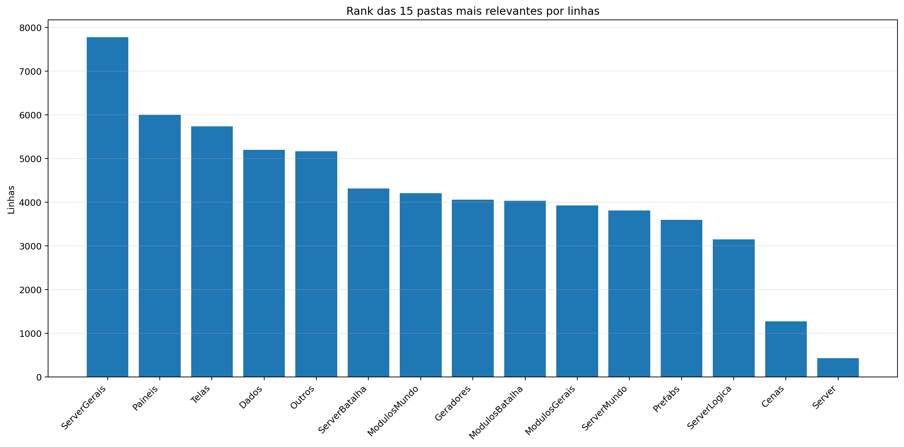
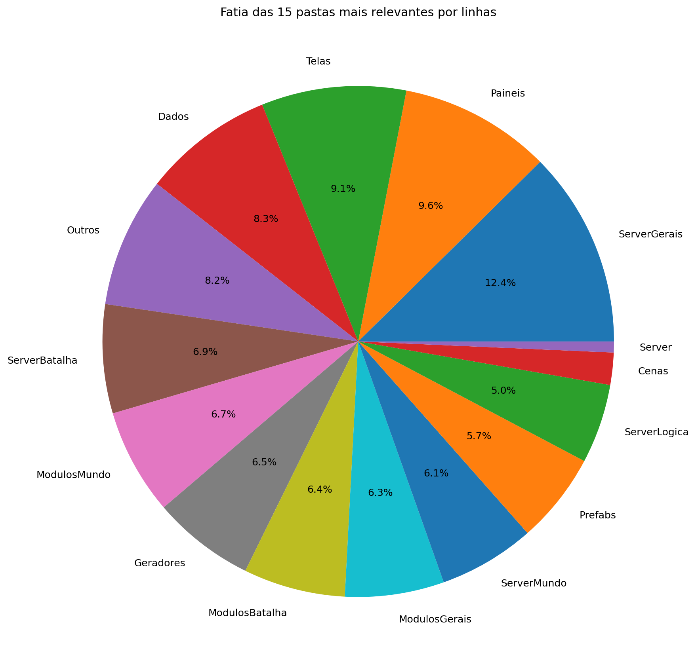
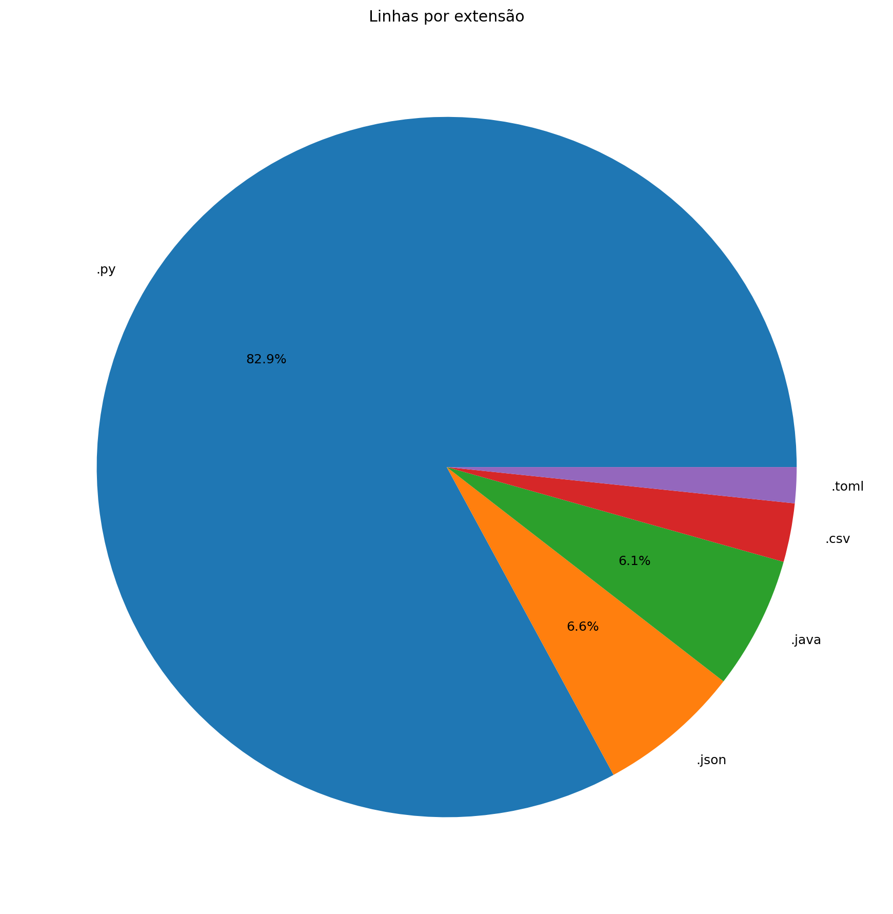
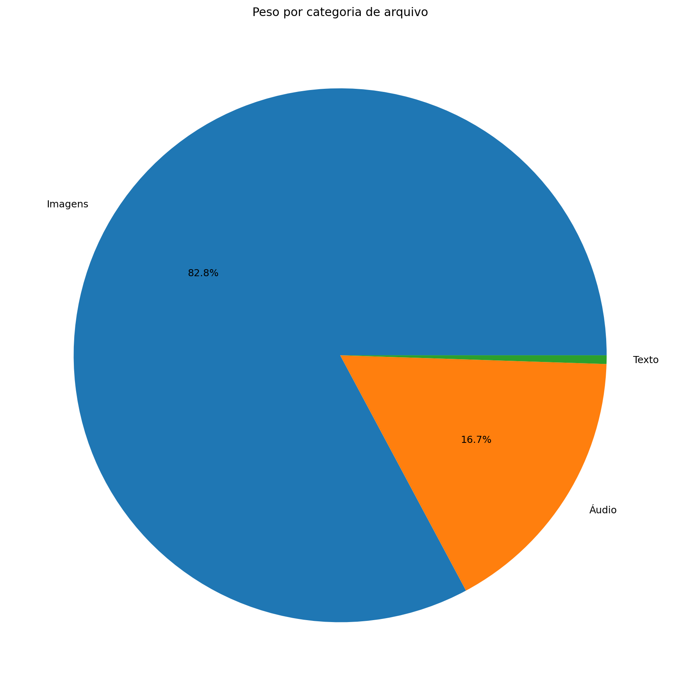
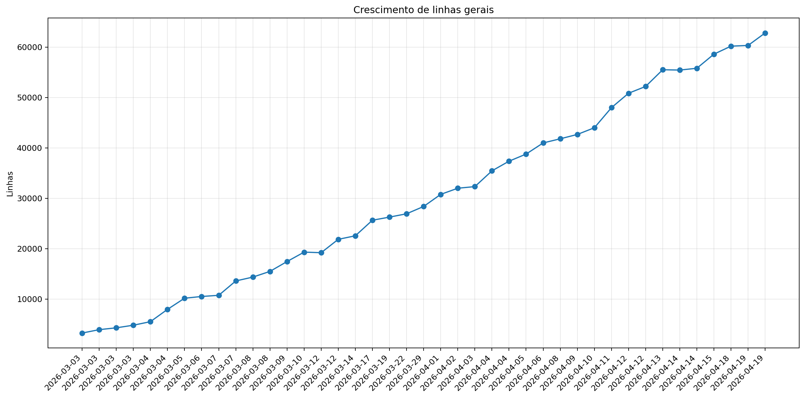
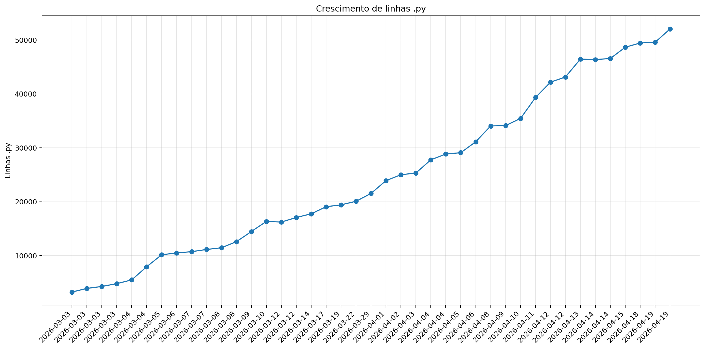
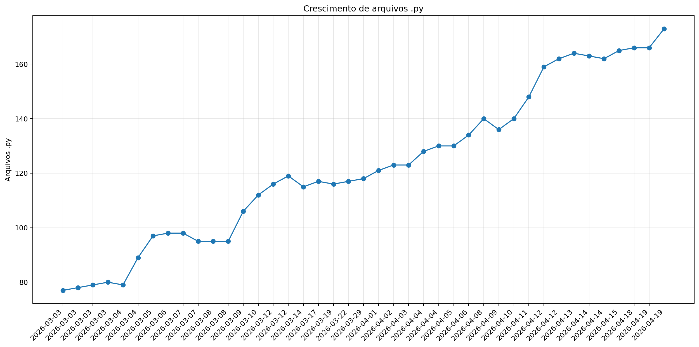
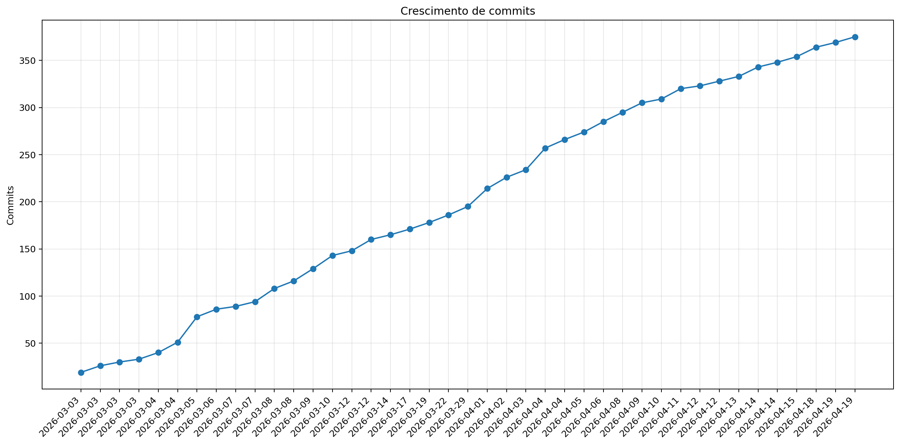

# Registro

**Relatório:** #41  
**Repo:** `relatorio_rebuild_ni3iezho`  
**Gerado em:** 2026-04-23T19:39:03  
**Modelo de relatório:** 9  
**Autor:** Leon Cunha Alvaro Lopez Soto

## Visão geral

- **Pastas:** 1.252
- **Arquivos:** 72.104
- **Arquivos de texto:** 233
- **Peso dos arquivos de texto:** 2711.67 KB
- **Tamanho total:** 0.555 GB (595.563.846 bytes)
- **Dias desde a criação do repo:** 48
- **Dias desde a criação oficial:** 322
- **Horas estimadas:** 313.00
- **Linhas totais gerais:** 62.816
- **Commits (repo):** 375
- **Adições desde o último relatório:** +3.867
- **Reduções desde o último relatório:** -207

## Python

- **Arquivos `.py`:** 173
- **Linhas totais:** 52.075
- **Tamanho total `.py`:** 2253.06 KB
- **Classes encontradas:** 173
- **Funções encontradas:** 578
- **Métodos encontrados:** 2.334
- **Total funções + métodos:** 2.912
- **Bibliotecas diferentes usadas:** 43

## Rank das 15 pastas mais relevantes por linhas

| Rank | Pasta | Subpastas | Arquivos | Linhas gerais | Tamanho (KB) |
|---:|---|---:|---:|---:|---:|
| 1 | `ServerGerais` | 4 | 48 | 7.778 | 438.00 |
| 2 | `Paineis` | 0 | 16 | 6.001 | 258.42 |
| 3 | `Telas` | 1 | 19 | 5.733 | 228.58 |
| 4 | `Dados` | 3 | 37 | 5.195 | 277.58 |
| 5 | `Outros` | 0 | 7 | 5.166 | 205.27 |
| 6 | `ServerBatalha` | 1 | 13 | 4.316 | 207.61 |
| 7 | `ModulosMundo` | 0 | 14 | 4.204 | 191.93 |
| 8 | `Geradores` | 1 | 16 | 4.059 | 182.75 |
| 9 | `ModulosBatalha` | 0 | 12 | 4.036 | 185.62 |
| 10 | `ModulosGerais` | 0 | 15 | 3.926 | 149.80 |
| 11 | `ServerMundo` | 1 | 16 | 3.814 | 198.74 |
| 12 | `Prefabs` | 0 | 14 | 3.597 | 131.39 |
| 13 | `ServerLogica` | 3 | 22 | 3.148 | 96.36 |
| 14 | `Cenas` | 0 | 6 | 1.277 | 60.49 |
| 15 | `Server` | 0 | 5 | 433 | 15.84 |

## Top 50 maiores arquivos `.py` por linhas

| Arquivo | Linhas | Tamanho (KB) |
|---|---:|---:|
| `Outros/EditorFluxos.py` | 1.858 | 85.38 |
| `SimuladorServerJogo/Batalha/LeitorJogadas.py` | 1.670 | 89.72 |
| `Outros/GeradorRelatorios.py` | 1.619 | 57.87 |
| `Codigo/Paineis/FichaPokemon.py` | 1.277 | 57.22 |
| `Codigo/ModulosBatalha/LeitorFluxos.py` | 1.152 | 50.34 |
| `Codigo/Telas/Inventario/InventarioPokemons.py` | 1.061 | 48.38 |
| `Codigo/ModulosMundo/ControladorObjetos.py` | 1.012 | 49.71 |
| `SimuladorServerJogo/Gerais/EstadoServidor.py` | 839 | 34.36 |
| `Codigo/Prefabs/Texto.py` | 806 | 30.97 |
| `Codigo/ModulosGerais/PokemonAnimator.py` | 775 | 30.92 |
| `Codigo/ModulosBatalha/ControladorFluxos.py` | 768 | 35.60 |
| `Codigo/Paineis/VisualizadorLog.py` | 762 | 37.02 |
| `Codigo/ModulosMundo/ControladorPlayer.py` | 710 | 33.85 |
| `Codigo/Geradores/PokemonMundo.py` | 687 | 33.86 |
| `SimuladorServerJogo/Logica/Comandos/Comandos.py` | 686 | 28.53 |
| `SimuladorServerJogo/Gerais/Geradores/GeradorMundo.py` | 672 | 26.86 |
| `SimuladorServerJogo/Mundo/BancoDados.py` | 671 | 32.76 |
| `SimuladorServerJogo/Batalha/PokemonBatalha.py` | 664 | 32.51 |
| `Codigo/Geradores/PokemonBatalha.py` | 645 | 31.69 |
| `Codigo/Paineis/Container.py` | 637 | 23.33 |
| `Codigo/Paineis/FichaPokemonBatalha.py` | 625 | 30.50 |
| `Codigo/Cenas/CenaMundo.py` | 575 | 31.38 |
| `SimuladorServerJogo/Gerais/Rotas/Atualizador.py` | 564 | 27.44 |
| `SimuladorServerJogo/Mundo/Cerebros/CerebroNPCs.py` | 563 | 28.95 |
| `Codigo/ModulosGerais/Sonoridades.py` | 553 | 14.59 |
| `Codigo/Paineis/PainelArvoreHabilidades.py` | 547 | 26.81 |
| `SimuladorServerJogo/Gerais/Geradores/GeradorPokemon.py` | 515 | 20.43 |
| `Outros/EditorSkins.py` | 514 | 19.97 |
| `Codigo/Telas/Inventario/InventarioItens.py` | 509 | 23.76 |
| `Outros/AtualizadorRelatorios.py` | 505 | 17.88 |
| `Codigo/Telas/TelaServers.py` | 492 | 15.67 |
| `SimuladorServerJogo/Mundo/ObjetosMundoServer.py` | 491 | 31.91 |
| `Codigo/ModulosMundo/LeitorMundo.py` | 484 | 22.01 |
| `Codigo/Prefabs/Botao.py` | 480 | 17.59 |
| `Codigo/ModulosMundo/LeitorDialogo.py` | 478 | 19.33 |
| `SimuladorServerJogo/Gerais/Rotas/Ativador.py` | 470 | 21.97 |
| `Codigo/ModulosGerais/FiltroCamera.py` | 469 | 21.24 |
| `Outros/Mixer.py` | 460 | 15.31 |
| `SimuladorServerJogo/Batalha/SimuladorFisica.py` | 456 | 19.94 |
| `Codigo/Paineis/PainelReceitas.py` | 455 | 15.29 |
| `Codigo/Telas/TelasGenericas.py` | 448 | 15.30 |
| `SimuladorServerJogo/Batalha/SistemaBatalha.py` | 435 | 19.43 |
| `Codigo/Telas/SubtelaDialogo.py` | 428 | 18.78 |
| `Codigo/Telas/SubtelaCriarPersonagem.py` | 423 | 15.31 |
| `Codigo/Geradores/Ator.py` | 413 | 18.02 |
| `Codigo/Geradores/Player/Controle.py` | 408 | 17.30 |
| `SimuladorServerJogo/Gerais/LoaderRegras.py` | 404 | 23.03 |
| `SimuladorServerJogo/Mundo/Cerebros/CerebroCentral.py` | 402 | 20.65 |
| `Codigo/Telas/Inventario/Estatisticas.py` | 401 | 17.83 |
| `Codigo/ModulosGerais/Colisor.py` | 379 | 14.48 |

## Top 20 maiores funções e métodos

| Arquivo | Nome | Tipo | Linhas |
|---|---|---:|---:|
| `SimuladorServerJogo/Gerais/Rotas/Atualizador.py` | `processar_atualizador_json` | funcao | 252 |
| `Codigo/Prefabs/Fluxos.py` | `Fluxo.desenhar` | metodo | 249 |
| `SimuladorServerJogo/Batalha/LeitorJogadas.py` | `LeitorJogadas._traduzir_evento_publico` | metodo | 248 |
| `Outros/GeradorRelatorios.py` | `coletar_metricas` | funcao | 239 |
| `Codigo/Geradores/Estadio.py` | `EstadioInterno.renderizar` | metodo | 232 |
| `SimuladorServerJogo/Batalha/LeitorJogadas.py` | `LeitorJogadas.executar_turno` | metodo | 216 |
| `Codigo/Paineis/VisualizadorLog.py` | `VisualizadorLog._registro_evento` | metodo | 163 |
| `Codigo/ModulosBatalha/LeitorFluxos.py` | `LeitorFluxos._construir_formas_fluxo` | metodo | 157 |
| `Codigo/Telas/Inventario/InventarioPokemons.py` | `InventarioPokemons.atualizar` | metodo | 147 |
| `Codigo/ModulosGerais/Colisor.py` | `Colisor.resolver_movimento_com_colisores` | metodo | 146 |
| `SimuladorServerJogo/Gerais/Geradores/GeradorMundo.py` | `_executar_world_generator` | funcao | 145 |
| `SimuladorServerJogo/Batalha/LeitorJogadas.py` | `LeitorJogadas._resolver_objeto` | metodo | 138 |
| `Outros/GeradorRelatorios.py` | `analisar_python_ast` | funcao | 132 |
| `Codigo/Telas/TelaMenu.py` | `TelaMenu` | funcao | 131 |
| `Outros/AtualizadorRelatorios.py` | `main` | funcao | 128 |
| `Outros/EditorFluxos.py` | `EditorFluxos.draw_panel` | metodo | 127 |
| `Outros/GeradorRelatorios.py` | `gerar_markdown` | funcao | 126 |
| `Codigo/Prefabs/Botao.py` | `Botao.render` | metodo | 119 |
| `Codigo/Telas/Inventario/InventarioPokemons.py` | `InventarioPokemons._reconstruir` | metodo | 118 |
| `Codigo/Telas/TelaMapa.py` | `TelaMapa.desenhar` | metodo | 116 |

## Top 20 maiores classes

| Arquivo | Classe | Linhas |
|---|---|---:|
| `SimuladorServerJogo/Batalha/LeitorJogadas.py` | `LeitorJogadas` | 1.654 |
| `Codigo/Paineis/FichaPokemon.py` | `FichaPokemon` | 1.245 |
| `Codigo/ModulosBatalha/LeitorFluxos.py` | `LeitorFluxos` | 1.081 |
| `Codigo/Telas/Inventario/InventarioPokemons.py` | `InventarioPokemons` | 1.033 |
| `Outros/EditorFluxos.py` | `EditorFluxos` | 986 |
| `Codigo/ModulosMundo/ControladorObjetos.py` | `ControladorObjetos` | 986 |
| `Codigo/ModulosBatalha/ControladorFluxos.py` | `ControladorFluxos` | 754 |
| `Codigo/ModulosMundo/ControladorPlayer.py` | `ControladorPlayer` | 691 |
| `Codigo/ModulosGerais/PokemonAnimator.py` | `PokemonAnimator` | 672 |
| `Codigo/Geradores/PokemonMundo.py` | `Pokemon` | 663 |
| `SimuladorServerJogo/Mundo/BancoDados.py` | `BancoDadosMundo` | 643 |
| `SimuladorServerJogo/Batalha/PokemonBatalha.py` | `PokemonBatalha` | 633 |
| `Codigo/Paineis/Container.py` | `Container` | 628 |
| `Codigo/Geradores/PokemonBatalha.py` | `PokemonBatalha` | 623 |
| `Codigo/Paineis/FichaPokemonBatalha.py` | `FichaPokemonBatalha` | 606 |
| `Codigo/Paineis/VisualizadorLog.py` | `VisualizadorLog` | 572 |
| `SimuladorServerJogo/Mundo/Cerebros/CerebroNPCs.py` | `CerebroNPCs` | 543 |
| `Codigo/Cenas/CenaMundo.py` | `CenaMundo` | 539 |
| `Codigo/Paineis/PainelArvoreHabilidades.py` | `PainelArvoreHabilidades` | 517 |
| `Codigo/Telas/Inventario/InventarioItens.py` | `InventarioItens` | 492 |

## Top 10 arquivos mais importados

| Arquivo | Vezes importado |
|---|---:|
| `Codigo/Prefabs/Texto.py` | 37 |
| `Codigo/Prefabs/Botao.py` | 28 |
| `SimuladorServerJogo/Mundo/BancoDados.py` | 14 |
| `SimuladorServerJogo/Gerais/EstadoServidor.py` | 14 |
| `Codigo/Geradores/ItemInventario.py` | 14 |
| `Codigo/ModulosGerais/Sonoridades.py` | 13 |
| `SimuladorServerJogo/Gerais/LoaderRegras.py` | 13 |
| `SimuladorServerJogo/Gerais/Rotas/Ativador.py` | 12 |
| `Codigo/ModulosGerais/Auxiliares.py` | 12 |
| `SimuladorServerJogo/Mundo/ObjetosMundoServer.py` | 11 |

## Top 10 arquivos que mais importam

| Arquivo | Arquivos internos importados | Imports totais | Linhas |
|---|---:|---:|---:|
| `Codigo/Cenas/CenaMundo.py` | 22 | 25 | 575 |
| `SimuladorServerJogo/Mundo/Cerebros/CerebroCentral.py` | 16 | 25 | 402 |
| `Codigo/Telas/Inventario/InventarioPokemons.py` | 14 | 21 | 1.061 |
| `SimuladorServerJogo/Gerais/Rotas/Atualizador.py` | 12 | 16 | 564 |
| `Codigo/Cenas/ControladorCenas.py` | 11 | 16 | 295 |
| `Codigo/Cenas/CenaCombate.py` | 11 | 12 | 192 |
| `Codigo/Telas/Inventario/InventarioItens.py` | 10 | 13 | 509 |
| `Codigo/Paineis/FichaPokemon.py` | 9 | 22 | 1.277 |
| `Codigo/Paineis/FichaPokemonBatalha.py` | 9 | 14 | 625 |
| `SimuladorServerJogo/Batalha/LeitorJogadas.py` | 8 | 12 | 1.670 |

## Top 10 maiores arquivos por linhas

| Arquivo | Ext | Linhas |
|---|---:|---:|
| `Outros/EditorFluxos.py` | `.py` | 1.858 |
| `SimuladorServerJogo/Batalha/LeitorJogadas.py` | `.py` | 1.670 |
| `Outros/GeradorRelatorios.py` | `.py` | 1.619 |
| `Dados/Pokemon Global Server - Pokemons.csv` | `.csv` | 1.277 |
| `Codigo/Paineis/FichaPokemon.py` | `.py` | 1.277 |
| `Codigo/ModulosBatalha/LeitorFluxos.py` | `.py` | 1.152 |
| `Codigo/Telas/Inventario/InventarioPokemons.py` | `.py` | 1.061 |
| `Codigo/ModulosMundo/ControladorObjetos.py` | `.py` | 1.012 |
| `SimuladorServerJogo/Gerais/Geradores/Java/GeradorTerreno.java` | `.java` | 972 |
| `SimuladorServerJogo/Gerais/Geradores/Java/WorldGenerator.java` | `.java` | 844 |

## Linhas por extensão

| Ext | Linhas |
|---:|---:|
| `.py` | 52.075 |
| `.json` | 4.151 |
| `.java` | 3.843 |
| `.csv` | 1.702 |
| `.toml` | 1.039 |

## Peso por extensão

| Ext | Arquivos | Peso | % do jogo |
|---:|---:|---:|---:|
| `.png` | 71.767 | 467.19 MB | 82.26% |
| `.ogg` | 35 | 90.64 MB | 15.96% |
| `.wav` | 9 | 3.81 MB | 0.67% |
| `.jpg` | 21 | 3.14 MB | 0.55% |
| `.py` | 173 | 2.20 MB | 0.39% |
| `.ttf` | 2 | 196.64 KB | 0.03% |
| `.csv` | 9 | 178.67 KB | 0.03% |
| `.java` | 7 | 145.13 KB | 0.03% |
| `.mp3` | 3 | 135.71 KB | 0.02% |
| `.class` | 31 | 120.63 KB | 0.02% |
| `.json` | 29 | 113.51 KB | 0.02% |
| `.svg` | 1 | 97.56 KB | 0.02% |
| `.toml` | 14 | 21.23 KB | 0.00% |
| `.frag` | 1 | 7.18 KB | 0.00% |
| `.vert` | 1 | 170 bytes | 0.00% |

## Comparativo com o último relatório

| Métrica | Relatório anterior | Relatório atual | Diferença |
|---|---:|---:|---:|
| Arquivos | 72.096 | 72.104 | +8 |
| Linhas | 60.335 | 62.816 | +2.481 |
| Linhas .py | 49.598 | 52.075 | +2.477 |
| Métodos/funções | 2.805 | 2.912 | +107 |
| Classes | 168 | 173 | +5 |
| Commits | 369 | 375 | +6 |
| Tamanho | 566.99 MB | 567.97 MB | +1008.18 KB |

### Top 3 commits por tamanho de diff

| Rank | Commit | Mensagem | Arquivos | Adições | Reduções | Diff total |
|---:|---|---|---:|---:|---:|---:|
| 1 | `1d8f263f7d5a` | relatorio | 10 | 1.561 | 62 | 1.623 |
| 2 | `14b4845b1475` | Minimapa e mapa adicionados | 17 | 1.211 | 18 | 1.229 |
| 3 | `e783b577c46a` | Correções nos fluxos (ricochet, atravessar, colisao) | 14 | 655 | 48 | 703 |

## Gráficos de crescimento

