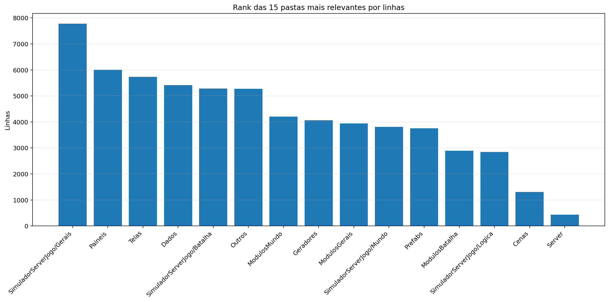
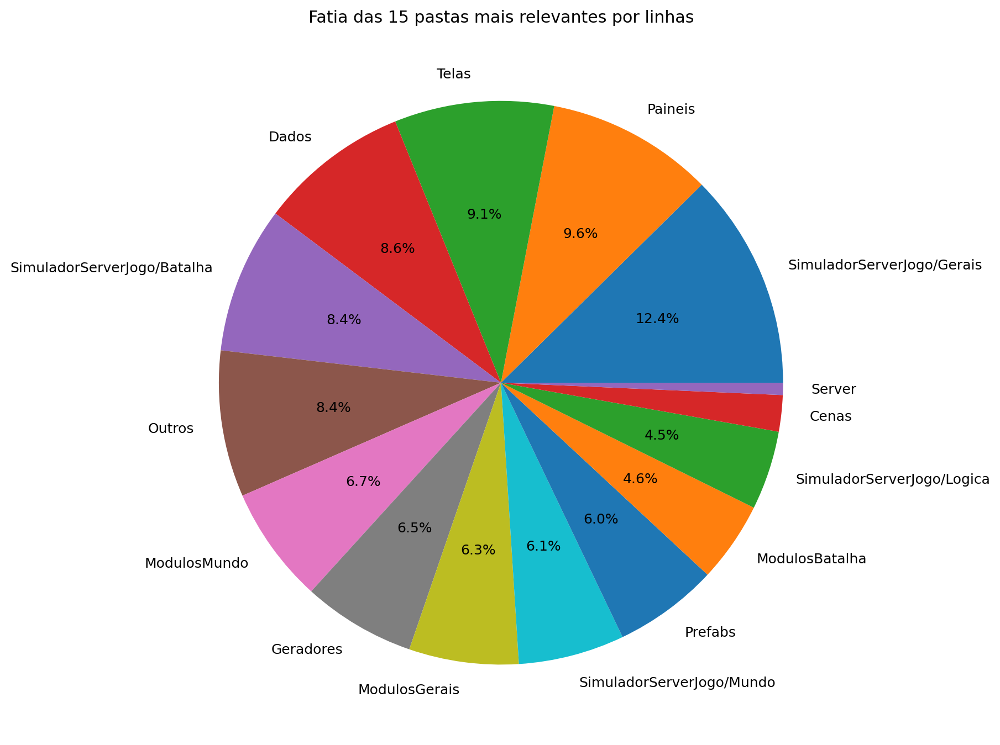
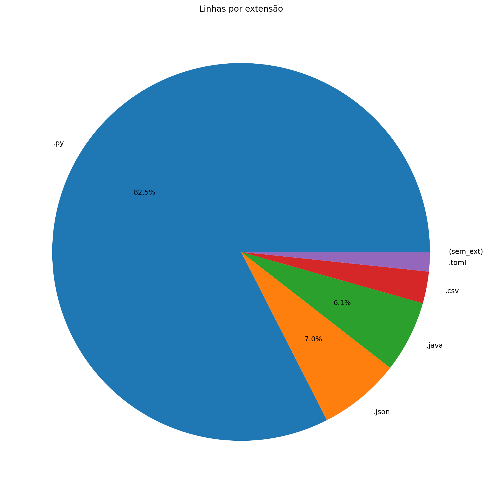
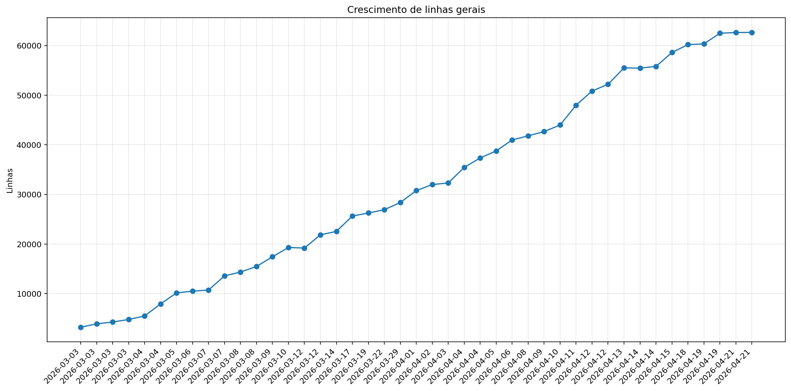
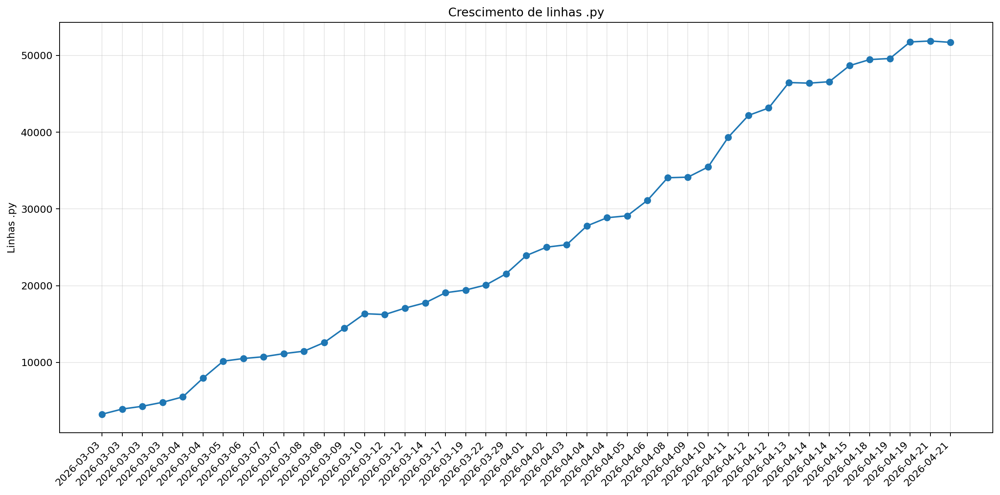
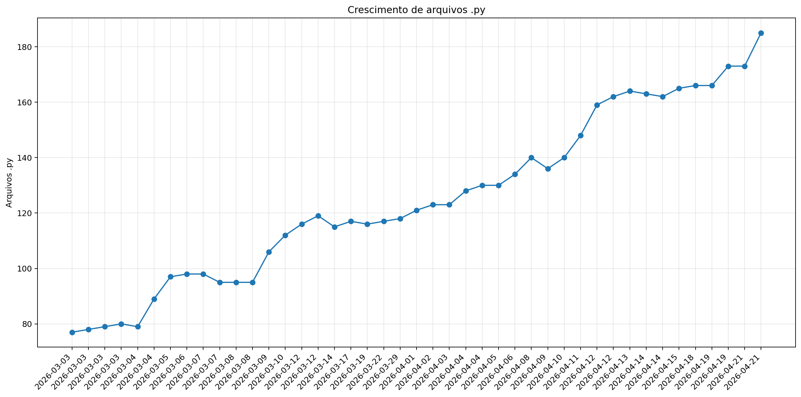
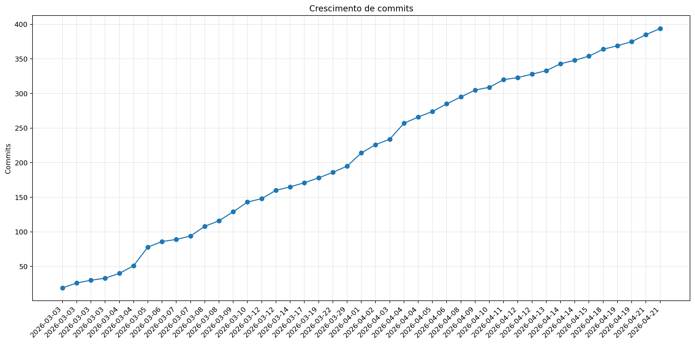

# Registro

**Relatório:** #43  
**Repo:** `Pokemon-Global-Server-Definitivo`  
**Gerado em:** 2026-04-21T21:53:54-03:00  
**Modelo de relatório:** 8  
**Autor:** Leon Cunha Alvaro Lopez Soto

## Visão geral

- **Pastas:** 1.255
- **Arquivos:** 72.151
- **Arquivos de texto:** 245
- **Peso dos arquivos de texto:** 2676.66 KB
- **Tamanho total:** 0.568 GB (610.257.683 bytes)
- **Dias desde a criação do repo:** 50
- **Horas estimadas:** 313.00
- **Linhas totais gerais:** 62.663
- **Commits (repo):** 394

## Python

- **Arquivos `.py`:** 185
- **Linhas totais:** 51.701
- **Tamanho total `.py`:** 2219.57 KB
- **Classes encontradas:** 195
- **Funções encontradas:** 664
- **Métodos encontrados:** 2.304
- **Total funções + métodos:** 2.968
- **Bibliotecas diferentes usadas:** 43

## Rank das 15 pastas mais relevantes por linhas

| Rank | Pasta | Caminho | Subpastas | Arquivos | Linhas gerais | Tamanho (KB) |
|---:|---|---|---:|---:|---:|---:|
| 1 | `SimuladorServerJogo/Gerais` | `SimuladorServerJogo/Gerais` | 4 | 48 | 7.779 | 437.82 |
| 2 | `Paineis` | `Codigo/Paineis` | 0 | 16 | 6.008 | 258.83 |
| 3 | `Telas` | `Codigo/Telas` | 1 | 19 | 5.733 | 228.58 |
| 4 | `Dados` | `Dados` | 3 | 37 | 5.416 | 276.09 |
| 5 | `SimuladorServerJogo/Batalha` | `SimuladorServerJogo/Batalha` | 2 | 24 | 5.279 | 228.56 |
| 6 | `Outros` | `Outros` | 1 | 8 | 5.269 | 211.79 |
| 7 | `ModulosMundo` | `Codigo/ModulosMundo` | 0 | 14 | 4.203 | 191.30 |
| 8 | `Geradores` | `Codigo/Geradores` | 1 | 16 | 4.061 | 182.56 |
| 9 | `ModulosGerais` | `Codigo/ModulosGerais` | 0 | 15 | 3.941 | 149.99 |
| 10 | `SimuladorServerJogo/Mundo` | `SimuladorServerJogo/Mundo` | 1 | 16 | 3.814 | 198.58 |
| 11 | `Prefabs` | `Codigo/Prefabs` | 0 | 15 | 3.753 | 137.08 |
| 12 | `ModulosBatalha` | `Codigo/ModulosBatalha` | 0 | 13 | 2.895 | 134.85 |
| 13 | `SimuladorServerJogo/Logica` | `SimuladorServerJogo/Logica` | 3 | 21 | 2.840 | 85.07 |
| 14 | `Cenas` | `Codigo/Cenas` | 0 | 6 | 1.309 | 61.33 |
| 15 | `Server` | `Codigo/Server` | 0 | 5 | 437 | 15.94 |

## Top 50 maiores arquivos `.py` por linhas

| Arquivo | Linhas | Tamanho (KB) |
|---|---:|---:|
| `Outros/EditorFluxos.py` | 1.858 | 85.38 |
| `Outros/GeradorRelatorios.py` | 1.299 | 46.05 |
| `Codigo/Paineis/FichaPokemon.py` | 1.277 | 57.22 |
| `Codigo/Telas/Inventario/InventarioPokemons.py` | 1.061 | 48.38 |
| `Codigo/ModulosMundo/ControladorObjetos.py` | 1.012 | 49.38 |
| `SimuladorServerJogo/Gerais/EstadoServidor.py` | 839 | 34.36 |
| `Codigo/Prefabs/Texto.py` | 806 | 30.97 |
| `Codigo/ModulosGerais/PokemonAnimator.py` | 775 | 30.92 |
| `Codigo/Paineis/VisualizadorLog.py` | 762 | 37.02 |
| `Codigo/ModulosMundo/ControladorPlayer.py` | 710 | 33.85 |
| `Codigo/Geradores/PokemonMundo.py` | 687 | 33.86 |
| `SimuladorServerJogo/Logica/Comandos/Comandos.py` | 686 | 28.53 |
| `SimuladorServerJogo/Batalha/Combate/ExecutorTurno.py` | 681 | 39.52 |
| `SimuladorServerJogo/Gerais/Geradores/GeradorMundo.py` | 672 | 26.71 |
| `SimuladorServerJogo/Mundo/BancoDados.py` | 671 | 32.74 |
| `SimuladorServerJogo/Batalha/PokemonBatalha.py` | 666 | 32.61 |
| `Codigo/Geradores/PokemonBatalha.py` | 647 | 31.57 |
| `Codigo/Paineis/Container.py` | 637 | 23.33 |
| `Codigo/Paineis/FichaPokemonBatalha.py` | 632 | 30.91 |
| `Codigo/Cenas/CenaMundo.py` | 571 | 31.03 |
| `SimuladorServerJogo/Gerais/Rotas/Atualizador.py` | 564 | 27.44 |
| `SimuladorServerJogo/Mundo/Cerebros/CerebroNPCs.py` | 563 | 28.89 |
| `Codigo/ModulosGerais/Sonoridades.py` | 553 | 14.59 |
| `Codigo/Paineis/PainelArvoreHabilidades.py` | 547 | 26.81 |
| `SimuladorServerJogo/Gerais/Geradores/GeradorPokemon.py` | 516 | 20.43 |
| `Outros/EditorSkins.py` | 514 | 19.97 |
| `Codigo/Telas/Inventario/InventarioItens.py` | 509 | 23.76 |
| `Outros/AtualizadorRelatorios.py` | 505 | 17.88 |
| `Codigo/Telas/TelaServers.py` | 492 | 15.67 |
| `SimuladorServerJogo/Mundo/ObjetosMundoServer.py` | 491 | 31.86 |
| `Codigo/ModulosBatalha/ControladorJogadas.py` | 486 | 22.40 |
| `Codigo/ModulosMundo/LeitorMundo.py` | 484 | 21.81 |
| `Codigo/Prefabs/Botao.py` | 480 | 17.59 |
| `Codigo/ModulosGerais/FiltroCamera.py` | 478 | 21.53 |
| `Codigo/ModulosMundo/LeitorDialogo.py` | 478 | 19.33 |
| `SimuladorServerJogo/Gerais/Rotas/Ativador.py` | 470 | 21.97 |
| `Outros/Mixer.py` | 460 | 15.31 |
| `SimuladorServerJogo/Batalha/Combate/AplicadorEfeitos.py` | 460 | 21.61 |
| `Codigo/Paineis/PainelReceitas.py` | 455 | 15.29 |
| `Codigo/Telas/TelasGenericas.py` | 448 | 15.30 |
| `SimuladorServerJogo/Batalha/SistemaBatalha.py` | 437 | 19.36 |
| `Codigo/Telas/SubtelaDialogo.py` | 428 | 18.78 |
| `Codigo/Telas/SubtelaCriarPersonagem.py` | 423 | 15.31 |
| `Codigo/Geradores/Ator.py` | 413 | 18.01 |
| `Codigo/Geradores/Player/Controle.py` | 408 | 17.28 |
| `SimuladorServerJogo/Gerais/LoaderRegras.py` | 404 | 23.04 |
| `SimuladorServerJogo/Mundo/Cerebros/CerebroCentral.py` | 402 | 20.64 |
| `Codigo/Telas/Inventario/Estatisticas.py` | 401 | 17.83 |
| `Codigo/ModulosBatalha/ControladorBatalha.py` | 397 | 19.47 |
| `Codigo/ModulosGerais/Colisor.py` | 379 | 14.48 |

## Top 20 maiores funções e métodos

| Arquivo | Nome | Tipo | Linhas |
|---|---|---:|---:|
| `SimuladorServerJogo/Gerais/Rotas/Atualizador.py` | `processar_atualizador_json` | funcao | 252 |
| `Codigo/Prefabs/Fluxos.py` | `Fluxo.desenhar` | metodo | 249 |
| `Codigo/Geradores/Estadio.py` | `EstadioInterno.renderizar` | metodo | 232 |
| `Outros/GeradorRelatorios.py` | `coletar_metricas` | funcao | 184 |
| `Codigo/Paineis/VisualizadorLog.py` | `VisualizadorLog._registro_evento` | metodo | 163 |
| `Codigo/Telas/Inventario/InventarioPokemons.py` | `InventarioPokemons.atualizar` | metodo | 147 |
| `Codigo/ModulosGerais/Colisor.py` | `Colisor.resolver_movimento_com_colisores` | metodo | 146 |
| `SimuladorServerJogo/Gerais/Geradores/GeradorMundo.py` | `_executar_world_generator` | funcao | 145 |
| `Outros/GeradorRelatorios.py` | `analisar_python_ast` | funcao | 132 |
| `Codigo/Telas/TelaMenu.py` | `TelaMenu` | funcao | 131 |
| `Outros/AtualizadorRelatorios.py` | `main` | funcao | 128 |
| `Outros/EditorFluxos.py` | `EditorFluxos.draw_panel` | metodo | 127 |
| `Codigo/Prefabs/Botao.py` | `Botao.render` | metodo | 119 |
| `Codigo/Telas/Inventario/InventarioPokemons.py` | `InventarioPokemons._reconstruir` | metodo | 118 |
| `Codigo/Telas/TelaMapa.py` | `TelaMapa.desenhar` | metodo | 116 |
| `Codigo/Cenas/CenaMundo.py` | `CenaMundo.atualizar_cena` | metodo | 114 |
| `Codigo/Telas/SubtelaCriarPersonagem.py` | `SubtelaCriarPersonagem._rebuild_layout` | metodo | 112 |
| `SimuladorServerJogo/Batalha/PokemonBatalha.py` | `PokemonBatalha.Verifica` | metodo | 110 |
| `Outros/Mixer.py` | `main` | funcao | 109 |
| `SimuladorServerJogo/Batalha/Combate/ExecutorTurno.py` | `ExecutorTurno._aplicar_efeitos_da_jogada` | metodo | 105 |

## Top 20 maiores classes

| Arquivo | Classe | Linhas |
|---|---|---:|
| `Codigo/Paineis/FichaPokemon.py` | `FichaPokemon` | 1.245 |
| `Codigo/Telas/Inventario/InventarioPokemons.py` | `InventarioPokemons` | 1.033 |
| `Outros/EditorFluxos.py` | `EditorFluxos` | 986 |
| `Codigo/ModulosMundo/ControladorObjetos.py` | `ControladorObjetos` | 986 |
| `Codigo/ModulosMundo/ControladorPlayer.py` | `ControladorPlayer` | 691 |
| `Codigo/ModulosGerais/PokemonAnimator.py` | `PokemonAnimator` | 672 |
| `Codigo/Geradores/PokemonMundo.py` | `Pokemon` | 663 |
| `SimuladorServerJogo/Mundo/BancoDados.py` | `BancoDadosMundo` | 643 |
| `SimuladorServerJogo/Batalha/Combate/ExecutorTurno.py` | `ExecutorTurno` | 638 |
| `SimuladorServerJogo/Batalha/PokemonBatalha.py` | `PokemonBatalha` | 635 |
| `Codigo/Paineis/Container.py` | `Container` | 628 |
| `Codigo/Geradores/PokemonBatalha.py` | `PokemonBatalha` | 625 |
| `Codigo/Paineis/FichaPokemonBatalha.py` | `FichaPokemonBatalha` | 613 |
| `Codigo/Paineis/VisualizadorLog.py` | `VisualizadorLog` | 572 |
| `SimuladorServerJogo/Mundo/Cerebros/CerebroNPCs.py` | `CerebroNPCs` | 543 |
| `Codigo/Cenas/CenaMundo.py` | `CenaMundo` | 535 |
| `Codigo/Paineis/PainelArvoreHabilidades.py` | `PainelArvoreHabilidades` | 517 |
| `Codigo/Telas/Inventario/InventarioItens.py` | `InventarioItens` | 492 |
| `Codigo/ModulosBatalha/ControladorJogadas.py` | `ControladorJogadas` | 472 |
| `Codigo/ModulosGerais/FiltroCamera.py` | `FiltroCamera` | 469 |

## Top 10 arquivos mais importados

| Arquivo | Vezes importado |
|---|---:|
| `Codigo/Prefabs/Texto.py` | 37 |
| `Codigo/Prefabs/Botao.py` | 28 |
| `SimuladorServerJogo/Mundo/BancoDados.py` | 14 |
| `SimuladorServerJogo/Gerais/EstadoServidor.py` | 14 |
| `Codigo/Geradores/ItemInventario.py` | 14 |
| `Codigo/ModulosGerais/Sonoridades.py` | 13 |
| `SimuladorServerJogo/Gerais/Rotas/Ativador.py` | 12 |
| `Codigo/ModulosGerais/Auxiliares.py` | 12 |
| `SimuladorServerJogo/Gerais/LoaderRegras.py` | 11 |
| `SimuladorServerJogo/Mundo/ObjetosMundoServer.py` | 11 |

## Top 10 arquivos que mais importam

| Arquivo | Arquivos internos importados | Imports totais | Linhas |
|---|---:|---:|---:|
| `Codigo/Cenas/CenaMundo.py` | 22 | 25 | 571 |
| `SimuladorServerJogo/Mundo/Cerebros/CerebroCentral.py` | 16 | 25 | 402 |
| `Codigo/Telas/Inventario/InventarioPokemons.py` | 14 | 21 | 1.061 |
| `SimuladorServerJogo/Gerais/Rotas/Atualizador.py` | 12 | 16 | 564 |
| `Codigo/Cenas/ControladorCenas.py` | 11 | 16 | 299 |
| `Codigo/Cenas/CenaCombate.py` | 11 | 12 | 192 |
| `SimuladorServerJogo/Batalha/Combate/ExecutorTurno.py` | 10 | 13 | 681 |
| `Codigo/Telas/Inventario/InventarioItens.py` | 10 | 13 | 509 |
| `Codigo/Paineis/FichaPokemon.py` | 9 | 22 | 1.277 |
| `Codigo/Paineis/FichaPokemonBatalha.py` | 9 | 14 | 632 |

## Top 10 maiores arquivos por linhas

| Arquivo | Ext | Linhas |
|---|---:|---:|
| `Outros/EditorFluxos.py` | `.py` | 1.858 |
| `Outros/GeradorRelatorios.py` | `.py` | 1.299 |
| `Dados/Pokemon Global Server - Pokemons.csv` | `.csv` | 1.277 |
| `Codigo/Paineis/FichaPokemon.py` | `.py` | 1.277 |
| `Codigo/Telas/Inventario/InventarioPokemons.py` | `.py` | 1.061 |
| `Codigo/ModulosMundo/ControladorObjetos.py` | `.py` | 1.012 |
| `SimuladorServerJogo/Gerais/Geradores/Java/GeradorTerreno.java` | `.java` | 972 |
| `SimuladorServerJogo/Gerais/Geradores/Java/WorldGenerator.java` | `.java` | 844 |
| `SimuladorServerJogo/Gerais/EstadoServidor.py` | `.py` | 839 |
| `Codigo/Prefabs/Texto.py` | `.py` | 806 |

## Linhas por extensão

| Ext | Linhas |
|---:|---:|
| `.py` | 51.701 |
| `.json` | 4.372 |
| `.java` | 3.843 |
| `.csv` | 1.702 |
| `.toml` | 1.039 |
| `(sem_ext)` | 6 |

## Gráficos de crescimento

