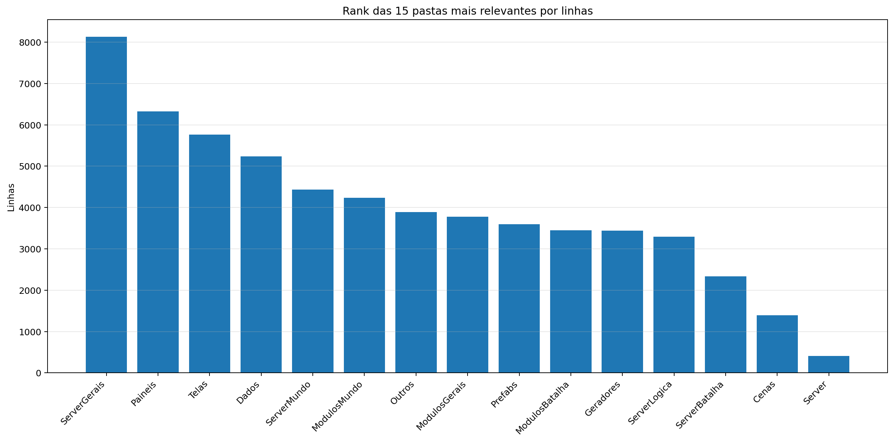
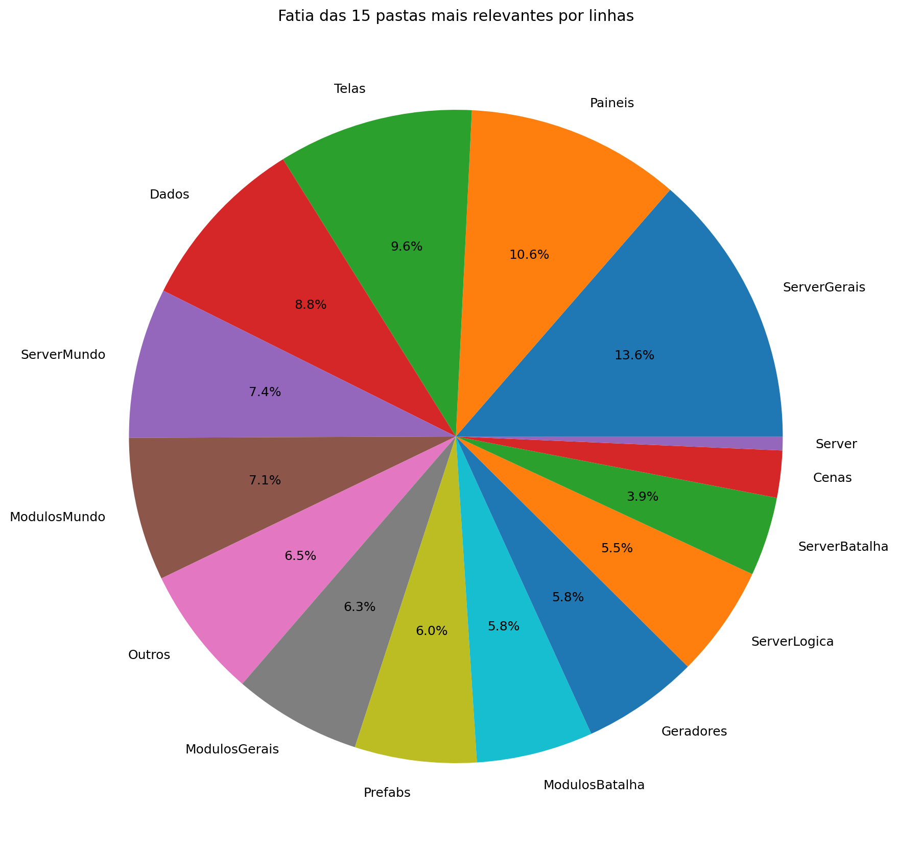
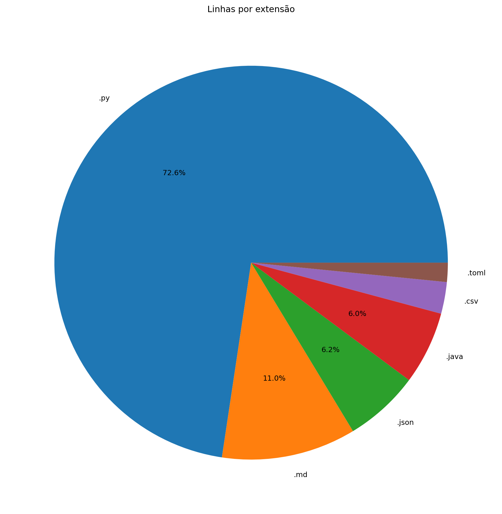
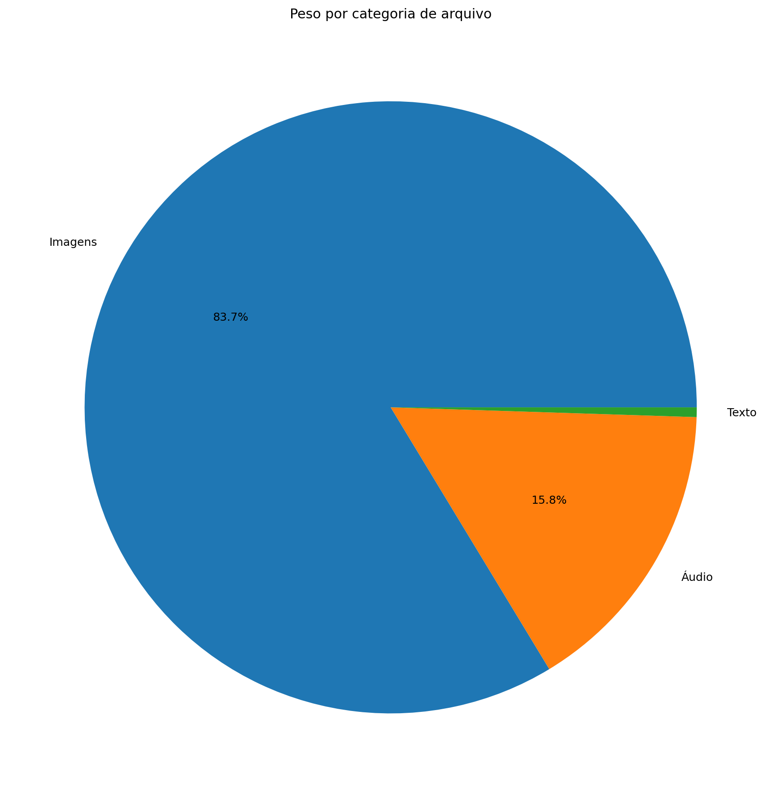
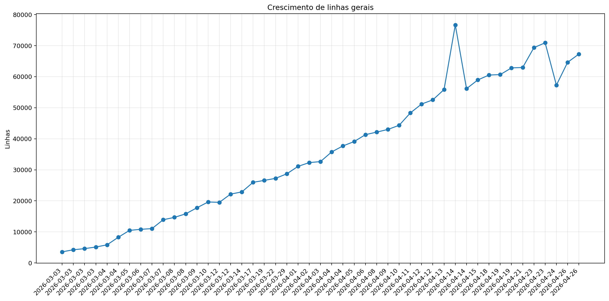
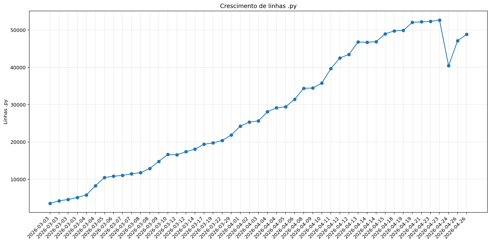
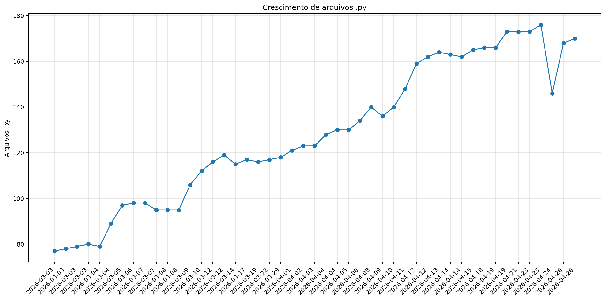
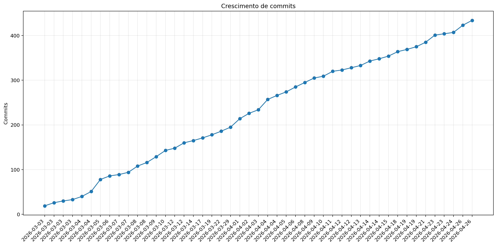

# Registro

**Relatório:** #47  
**Repo:** `Pokemon-Global-Server-Definitivo`  
**Gerado em:** 2026-04-26T21:25:17  
**Modelo de relatório:** 9  
**Autor:** Leon Cunha Alvaro Lopez Soto

## Visão geral

- **Pastas:** 1.258
- **Arquivos:** 72.152
- **Arquivos de texto:** 233
- **Peso dos arquivos de texto:** 2789.54 KB
- **Tamanho total:** 0.584 GB (626.847.447 bytes)
- **Dias desde a criação do repo:** 55
- **Dias desde a criação oficial:** 329
- **Horas estimadas:** 313.00
- **Linhas totais gerais:** 67.259
- **Commits (repo):** 434
- **Adições desde o último relatório:** +6.741
- **Reduções desde o último relatório:** -1.756

## Python

- **Arquivos `.py`:** 170
- **Linhas totais:** 48.844
- **Tamanho total `.py`:** 2103.78 KB
- **Classes encontradas:** 155
- **Funções encontradas:** 627
- **Métodos encontrados:** 2.177
- **Total funções + métodos:** 2.804
- **Bibliotecas diferentes usadas:** 44

## Rank das 15 pastas mais relevantes por linhas

| Rank | Pasta | Subpastas | Arquivos | Linhas gerais | Tamanho (KB) |
|---:|---|---:|---:|---:|---:|
| 1 | `ServerGerais` | 4 | 49 | 8.134 | 455.50 |
| 2 | `Paineis` | 0 | 16 | 6.325 | 281.72 |
| 3 | `Telas` | 1 | 19 | 5.761 | 230.19 |
| 4 | `Dados` | 3 | 37 | 5.236 | 272.61 |
| 5 | `ServerMundo` | 1 | 17 | 4.435 | 231.08 |
| 6 | `ModulosMundo` | 0 | 14 | 4.232 | 193.38 |
| 7 | `Outros` | 0 | 7 | 3.890 | 139.85 |
| 8 | `ModulosGerais` | 0 | 15 | 3.781 | 143.88 |
| 9 | `Prefabs` | 0 | 14 | 3.597 | 131.39 |
| 10 | `ModulosBatalha` | 1 | 11 | 3.447 | 161.93 |
| 11 | `Geradores` | 1 | 15 | 3.437 | 151.88 |
| 12 | `ServerLogica` | 3 | 23 | 3.296 | 100.23 |
| 13 | `ServerBatalha` | 1 | 9 | 2.336 | 109.99 |
| 14 | `Cenas` | 0 | 6 | 1.391 | 64.99 |
| 15 | `Server` | 0 | 5 | 406 | 14.96 |

## Top 50 maiores arquivos `.py` por linhas

| Arquivo | Linhas | Tamanho (KB) |
|---|---:|---:|
| `Outros/GeradorRelatorios.py` | 1.629 | 58.23 |
| `Codigo/Paineis/FichaPokemon.py` | 1.277 | 57.22 |
| `Codigo/Telas/Inventario/InventarioPokemons.py` | 1.061 | 48.38 |
| `Codigo/ModulosMundo/ControladorObjetos.py` | 1.029 | 50.58 |
| `Codigo/Paineis/VisualizadorLog.py` | 1.011 | 56.61 |
| `SimuladorServerJogo/Gerais/EstadoServidor.py` | 843 | 34.70 |
| `Codigo/Prefabs/Texto.py` | 806 | 30.97 |
| `Codigo/ModulosBatalha/PokemonBatalha.py` | 753 | 36.20 |
| `SimuladorServerJogo/Mundo/Cerebros/CerebroNPCs.py` | 718 | 37.56 |
| `Codigo/ModulosBatalha/MontadorJogadas.py` | 716 | 35.42 |
| `Codigo/ModulosMundo/ControladorPlayer.py` | 712 | 33.99 |
| `Codigo/Geradores/PokemonMundo.py` | 687 | 33.86 |
| `SimuladorServerJogo/Mundo/BancoDados.py` | 686 | 33.68 |
| `SimuladorServerJogo/Logica/Comandos/Comandos.py` | 686 | 28.53 |
| `SimuladorServerJogo/Gerais/Geradores/GeradorMundo.py` | 681 | 27.51 |
| `Codigo/Paineis/FichaPokemonBatalha.py` | 671 | 33.03 |
| `SimuladorServerJogo/Logica/Executes/ExecuteAtaques.py` | 656 | 24.16 |
| `SimuladorServerJogo/Batalha/PokemonBatalha.py` | 651 | 33.74 |
| `Codigo/Paineis/Container.py` | 637 | 23.33 |
| `SimuladorServerJogo/Gerais/Geradores/GeradorPokemon.py` | 622 | 25.53 |
| `Outros/AtualizadorRelatorios.py` | 619 | 22.07 |
| `Codigo/ModulosGerais/PokemonAnimator.py` | 611 | 24.56 |
| `Codigo/Cenas/CenaMundo.py` | 596 | 32.61 |
| `SimuladorServerJogo/Gerais/Rotas/Atualizador.py` | 559 | 27.60 |
| `Codigo/ModulosGerais/Sonoridades.py` | 553 | 14.59 |
| `Codigo/Paineis/PainelArvoreHabilidades.py` | 547 | 26.81 |
| `Outros/EditorSkins.py` | 514 | 19.97 |
| `SimuladorServerJogo/Batalha/Partida.py` | 514 | 24.25 |
| `Codigo/Telas/Inventario/InventarioItens.py` | 509 | 23.76 |
| `SimuladorServerJogo/Mundo/ObjetosMundoServer.py` | 494 | 32.06 |
| `Codigo/Telas/TelaServers.py` | 492 | 15.67 |
| `Codigo/ModulosMundo/LeitorMundo.py` | 484 | 21.81 |
| `Codigo/Prefabs/Botao.py` | 480 | 17.59 |
| `Codigo/ModulosGerais/FiltroCamera.py` | 478 | 21.53 |
| `Codigo/ModulosMundo/LeitorDialogo.py` | 478 | 19.33 |
| `SimuladorServerJogo/Gerais/Rotas/Ativador.py` | 472 | 22.16 |
| `Outros/Mixer.py` | 460 | 15.31 |
| `Codigo/Paineis/PainelReceitas.py` | 455 | 15.29 |
| `Codigo/ModulosBatalha/ControladorBatalha.py` | 453 | 21.12 |
| `SimuladorServerJogo/Mundo/InicializadorNPC.py` | 448 | 22.71 |
| `Codigo/Telas/TelasGenericas.py` | 448 | 15.30 |
| `Codigo/Telas/SubtelaDialogo.py` | 429 | 18.87 |
| `Codigo/Telas/SubtelaCriarPersonagem.py` | 423 | 15.31 |
| `Outros/AtualizadorReadMe.py` | 417 | 13.56 |
| `Codigo/Geradores/Ator.py` | 413 | 18.01 |
| `SimuladorServerJogo/Gerais/LoaderRegras.py` | 411 | 23.35 |
| `Codigo/Geradores/Player/Controle.py` | 408 | 17.28 |
| `SimuladorServerJogo/Mundo/Cerebros/CerebroCentral.py` | 402 | 20.64 |
| `Codigo/Telas/Inventario/Estatisticas.py` | 401 | 17.83 |
| `Codigo/Geradores/Estadio.py` | 394 | 14.82 |

## Top 20 maiores funções e métodos

| Arquivo | Nome | Tipo | Linhas |
|---|---|---:|---:|
| `Codigo/Paineis/VisualizadorLog.py` | `VisualizadorLog._registro_evento` | metodo | 286 |
| `Codigo/Geradores/Estadio.py` | `EstadioInterno.renderizar` | metodo | 254 |
| `Codigo/Prefabs/Fluxos.py` | `Fluxo.desenhar` | metodo | 249 |
| `SimuladorServerJogo/Gerais/Rotas/Atualizador.py` | `processar_atualizador_json` | funcao | 247 |
| `Outros/GeradorRelatorios.py` | `coletar_metricas` | funcao | 239 |
| `Codigo/Telas/Inventario/InventarioPokemons.py` | `InventarioPokemons.atualizar` | metodo | 147 |
| `Codigo/ModulosGerais/Colisor.py` | `Colisor.resolver_movimento_com_colisores` | metodo | 146 |
| `SimuladorServerJogo/Gerais/Geradores/GeradorMundo.py` | `_executar_world_generator` | funcao | 145 |
| `Codigo/Telas/TelaMapa.py` | `TelaMapa.desenhar` | metodo | 136 |
| `Outros/GeradorRelatorios.py` | `analisar_python_ast` | funcao | 132 |
| `Outros/AtualizadorRelatorios.py` | `main` | funcao | 131 |
| `Codigo/Telas/TelaMenu.py` | `TelaMenu` | funcao | 131 |
| `Outros/GeradorRelatorios.py` | `gerar_markdown` | funcao | 126 |
| `SimuladorServerJogo/Mundo/Cerebros/CerebroNPCs.py` | `CerebroNPCs.executar_tick` | metodo | 122 |
| `Codigo/Prefabs/Botao.py` | `Botao.render` | metodo | 119 |
| `Codigo/Telas/Inventario/InventarioPokemons.py` | `InventarioPokemons._reconstruir` | metodo | 118 |
| `Codigo/Cenas/CenaMundo.py` | `CenaMundo.atualizar_cena` | metodo | 114 |
| `Codigo/Telas/SubtelaCriarPersonagem.py` | `SubtelaCriarPersonagem._rebuild_layout` | metodo | 112 |
| `Outros/Mixer.py` | `main` | funcao | 109 |
| `SimuladorServerJogo/Mundo/Cerebros/CerebroItensMundo.py` | `CerebroItensMundo.executar_tick` | metodo | 101 |

## Top 20 maiores classes

| Arquivo | Classe | Linhas |
|---|---|---:|
| `Codigo/Paineis/FichaPokemon.py` | `FichaPokemon` | 1.245 |
| `Codigo/Telas/Inventario/InventarioPokemons.py` | `InventarioPokemons` | 1.033 |
| `Codigo/ModulosMundo/ControladorObjetos.py` | `ControladorObjetos` | 1.003 |
| `Codigo/Paineis/VisualizadorLog.py` | `VisualizadorLog` | 821 |
| `Codigo/ModulosBatalha/PokemonBatalha.py` | `PokemonBatalha` | 720 |
| `SimuladorServerJogo/Mundo/Cerebros/CerebroNPCs.py` | `CerebroNPCs` | 697 |
| `Codigo/ModulosMundo/ControladorPlayer.py` | `ControladorPlayer` | 693 |
| `Codigo/ModulosBatalha/MontadorJogadas.py` | `MontadorJogadas` | 674 |
| `Codigo/Geradores/PokemonMundo.py` | `Pokemon` | 663 |
| `SimuladorServerJogo/Mundo/BancoDados.py` | `BancoDadosMundo` | 658 |
| `Codigo/Paineis/FichaPokemonBatalha.py` | `FichaPokemonBatalha` | 651 |
| `Codigo/Paineis/Container.py` | `Container` | 628 |
| `SimuladorServerJogo/Batalha/PokemonBatalha.py` | `PokemonBatalha` | 610 |
| `Codigo/Cenas/CenaMundo.py` | `CenaMundo` | 559 |
| `Codigo/ModulosGerais/PokemonAnimator.py` | `PokemonAnimator` | 523 |
| `Codigo/Paineis/PainelArvoreHabilidades.py` | `PainelArvoreHabilidades` | 517 |
| `Codigo/Telas/Inventario/InventarioItens.py` | `InventarioItens` | 492 |
| `SimuladorServerJogo/Batalha/Partida.py` | `Partida` | 489 |
| `Codigo/ModulosGerais/FiltroCamera.py` | `FiltroCamera` | 469 |
| `Codigo/ModulosMundo/LeitorDialogo.py` | `LeitorDialogo` | 468 |

## Top 10 arquivos mais importados

| Arquivo | Vezes importado |
|---|---:|
| `Codigo/Prefabs/Texto.py` | 38 |
| `Codigo/Prefabs/Botao.py` | 28 |
| `SimuladorServerJogo/Mundo/BancoDados.py` | 14 |
| `SimuladorServerJogo/Gerais/EstadoServidor.py` | 14 |
| `Codigo/Geradores/ItemInventario.py` | 14 |
| `Codigo/ModulosGerais/Sonoridades.py` | 13 |
| `Codigo/ModulosGerais/Auxiliares.py` | 13 |
| `SimuladorServerJogo/Gerais/Rotas/Ativador.py` | 12 |
| `SimuladorServerJogo/Mundo/ObjetosMundoServer.py` | 11 |
| `SimuladorServerJogo/Gerais/LoaderRegras.py` | 10 |

## Top 10 arquivos que mais importam

| Arquivo | Arquivos internos importados | Imports totais | Linhas |
|---|---:|---:|---:|
| `Codigo/Cenas/CenaMundo.py` | 22 | 25 | 596 |
| `SimuladorServerJogo/Mundo/Cerebros/CerebroCentral.py` | 16 | 25 | 402 |
| `Codigo/Telas/Inventario/InventarioPokemons.py` | 14 | 21 | 1.061 |
| `Codigo/Cenas/ControladorCenas.py` | 11 | 16 | 299 |
| `SimuladorServerJogo/Gerais/Rotas/Atualizador.py` | 11 | 15 | 559 |
| `Codigo/Telas/Inventario/InventarioItens.py` | 10 | 13 | 509 |
| `Codigo/ModulosBatalha/ControladorBatalha.py` | 10 | 13 | 453 |
| `Codigo/Paineis/FichaPokemon.py` | 9 | 22 | 1.277 |
| `Codigo/Paineis/FichaPokemonBatalha.py` | 9 | 15 | 671 |
| `Codigo/Cenas/CenaCombate.py` | 9 | 12 | 249 |

## Top 10 maiores arquivos por linhas

| Arquivo | Ext | Linhas |
|---|---:|---:|
| `Legado/DiretrizesBatalha_v7_ajustada.md` | `.md` | 4.860 |
| `Legado/PlanoImplementacaoBatalha_5Fases_ajustado.md` | `.md` | 1.872 |
| `Outros/GeradorRelatorios.py` | `.py` | 1.629 |
| `Dados/Pokemon Global Server - Pokemons.csv` | `.csv` | 1.309 |
| `Codigo/Paineis/FichaPokemon.py` | `.py` | 1.277 |
| `Codigo/Telas/Inventario/InventarioPokemons.py` | `.py` | 1.061 |
| `Codigo/ModulosMundo/ControladorObjetos.py` | `.py` | 1.029 |
| `Codigo/Paineis/VisualizadorLog.py` | `.py` | 1.011 |
| `SimuladorServerJogo/Gerais/Geradores/Java/GeradorTerreno.java` | `.java` | 972 |
| `SimuladorServerJogo/Gerais/Geradores/Java/WorldGenerator.java` | `.java` | 846 |

## Linhas por extensão

| Ext | Linhas |
|---:|---:|
| `.py` | 48.844 |
| `.md` | 7.422 |
| `.json` | 4.148 |
| `.java` | 4.033 |
| `.csv` | 1.746 |
| `.toml` | 1.060 |

## Peso por extensão

| Ext | Arquivos | Peso | % do jogo |
|---:|---:|---:|---:|
| `.png` | 71.814 | 496.57 MB | 83.07% |
| `.ogg` | 35 | 90.64 MB | 15.16% |
| `.wav` | 9 | 3.81 MB | 0.64% |
| `.jpg` | 23 | 3.61 MB | 0.60% |
| `.py` | 170 | 2.05 MB | 0.34% |
| `.md` | 3 | 224.32 KB | 0.04% |
| `.ttf` | 2 | 196.64 KB | 0.03% |
| `.csv` | 9 | 180.84 KB | 0.03% |
| `.java` | 7 | 152.13 KB | 0.02% |
| `.mp3` | 3 | 135.71 KB | 0.02% |
| `.class` | 31 | 122.27 KB | 0.02% |
| `.json` | 29 | 106.37 KB | 0.02% |
| `.toml` | 14 | 22.04 KB | 0.00% |
| `.frag` | 1 | 7.18 KB | 0.00% |
| `.vert` | 1 | 170 bytes | 0.00% |

## Comparativo com o último relatório

| Métrica | Relatório anterior | Relatório atual | Diferença |
|---|---:|---:|---:|
| Arquivos | 72.139 | 72.152 | +13 |
| Linhas | 64.616 | 67.259 | +2.643 |
| Linhas .py | 47.153 | 48.844 | +1.691 |
| Métodos/funções | 2.705 | 2.804 | +99 |
| Classes | 154 | 155 | +1 |
| Commits | 423 | 434 | +11 |
| Tamanho | 584.14 MB | 597.81 MB | +13.67 MB |

### Top 3 commits por tamanho de diff

| Rank | Commit | Mensagem | Arquivos | Adições | Reduções | Diff total |
|---:|---|---|---:|---:|---:|---:|
| 1 | `2361df0e48a0` | NPC extremamente melhorado | 31 | 2.776 | 1.454 | 4.230 |
| 2 | `5e6c85ce5e94` | relatorio | 11 | 1.966 | 115 | 2.081 |
| 3 | `d8a8e9713599` | primeiro readme (devia ter feito faz tempo) | 4 | 700 | 0 | 700 |

## Gráficos de crescimento

