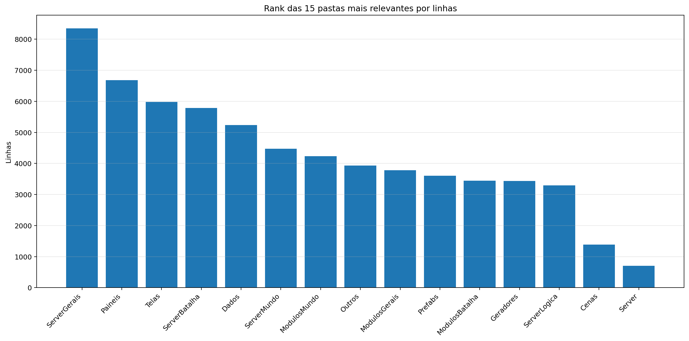
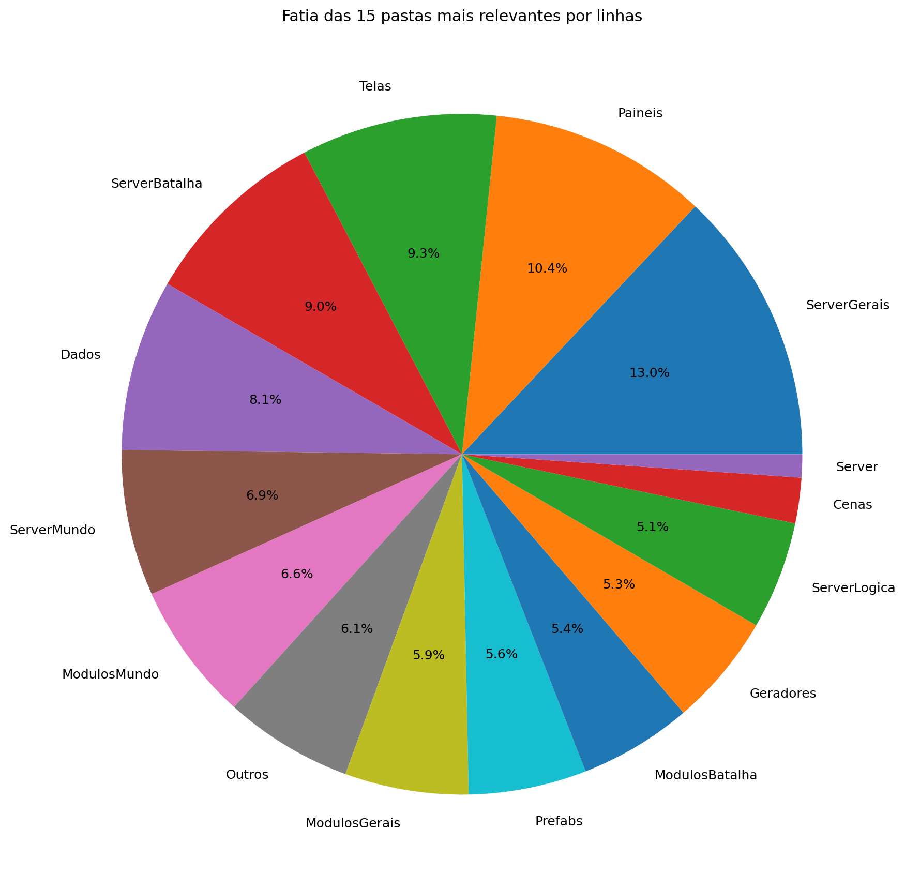
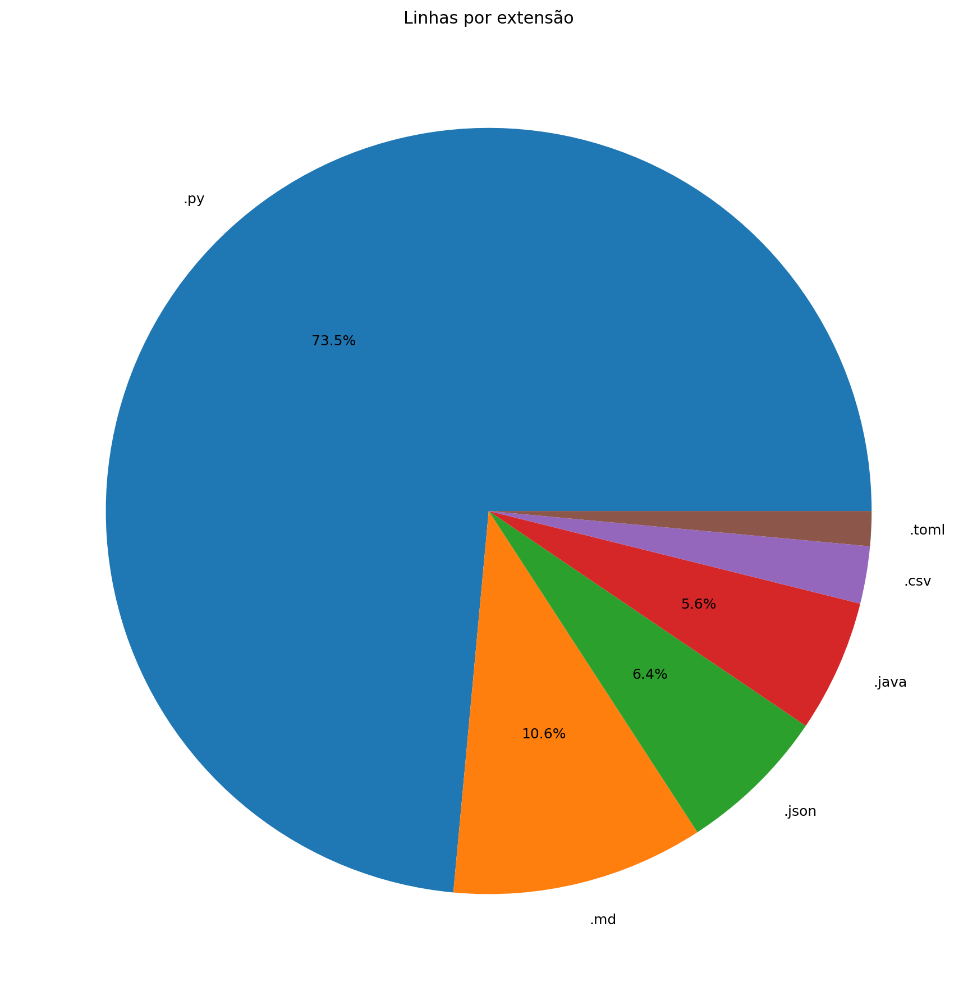
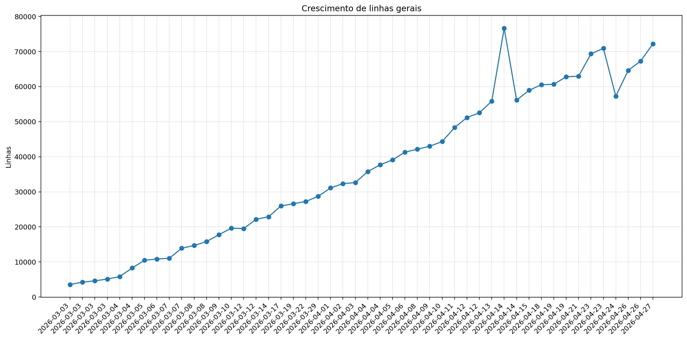
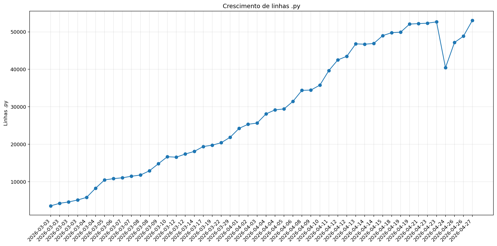
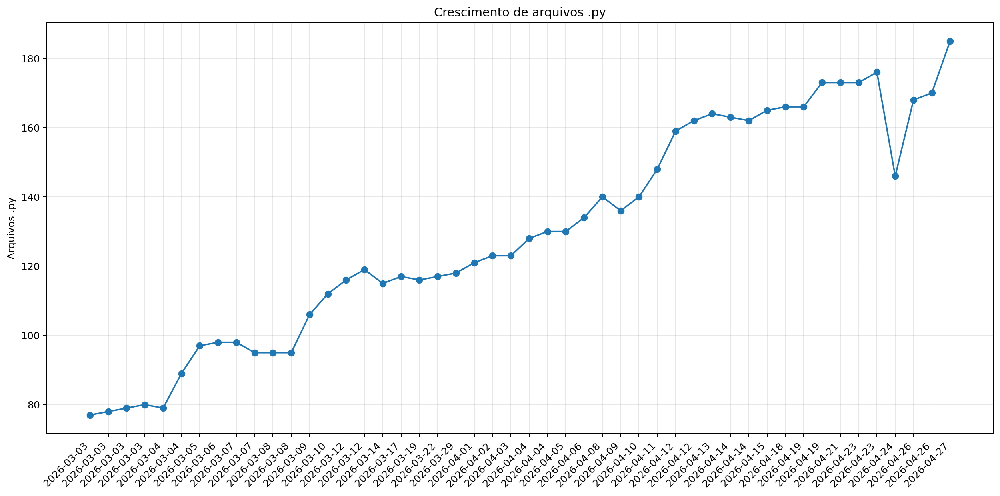
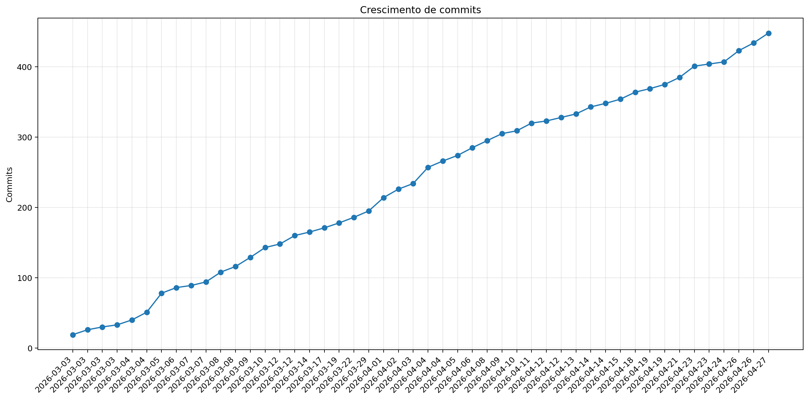

# Registro

**Relatório:** #48  
**Repo:** `Pokemon-Global-Server-Definitivo`  
**Gerado em:** 2026-04-27T21:44:46  
**Modelo de relatório:** 9  
**Autor:** Leon Cunha Alvaro Lopez Soto

## Visão geral

- **Pastas:** 1.256
- **Arquivos:** 72.168
- **Arquivos de texto:** 249
- **Peso dos arquivos de texto:** 3003.60 KB
- **Tamanho total:** 0.584 GB (627.069.386 bytes)
- **Dias desde a criação do repo:** 56
- **Dias desde a criação oficial:** 330
- **Horas estimadas:** 313.00
- **Linhas totais gerais:** 72.199
- **Commits (repo):** 448
- **Adições desde o último relatório:** +7.871
- **Reduções desde o último relatório:** -1.563

## Python

- **Arquivos `.py`:** 185
- **Linhas totais:** 53.072
- **Tamanho total `.py`:** 2291.21 KB
- **Classes encontradas:** 176
- **Funções encontradas:** 681
- **Métodos encontrados:** 2.385
- **Total funções + métodos:** 3.066
- **Bibliotecas diferentes usadas:** 39

## Rank das 15 pastas mais relevantes por linhas

| Rank | Pasta | Subpastas | Arquivos | Linhas gerais | Tamanho (KB) |
|---:|---|---:|---:|---:|---:|
| 1 | `ServerGerais` | 4 | 50 | 8.353 | 466.30 |
| 2 | `Paineis` | 0 | 16 | 6.680 | 297.87 |
| 3 | `Telas` | 1 | 20 | 5.981 | 237.10 |
| 4 | `ServerBatalha` | 1 | 21 | 5.785 | 255.71 |
| 5 | `Dados` | 3 | 37 | 5.236 | 271.43 |
| 6 | `ServerMundo` | 1 | 17 | 4.469 | 233.38 |
| 7 | `ModulosMundo` | 0 | 14 | 4.232 | 193.67 |
| 8 | `Outros` | 0 | 8 | 3.935 | 142.38 |
| 9 | `ModulosGerais` | 0 | 15 | 3.781 | 144.21 |
| 10 | `Prefabs` | 0 | 14 | 3.606 | 131.48 |
| 11 | `ModulosBatalha` | 0 | 11 | 3.447 | 163.64 |
| 12 | `Geradores` | 1 | 15 | 3.437 | 151.96 |
| 13 | `ServerLogica` | 3 | 23 | 3.296 | 100.58 |
| 14 | `Cenas` | 0 | 6 | 1.391 | 65.20 |
| 15 | `Server` | 0 | 7 | 706 | 24.66 |

## Top 50 maiores arquivos `.py` por linhas

| Arquivo | Linhas | Tamanho (KB) |
|---|---:|---:|
| `Outros/GeradorRelatorios.py` | 1.629 | 59.82 |
| `Codigo/Paineis/FichaPokemon.py` | 1.267 | 56.90 |
| `Codigo/Telas/Inventario/InventarioPokemons.py` | 1.061 | 48.38 |
| `Codigo/ModulosMundo/ControladorObjetos.py` | 1.029 | 50.58 |
| `Codigo/Paineis/VisualizadorLog.py` | 1.011 | 56.90 |
| `SimuladorServerJogo/Gerais/EstadoServidor.py` | 992 | 39.46 |
| `Codigo/Prefabs/Texto.py` | 806 | 30.71 |
| `Codigo/ModulosBatalha/PokemonBatalha.py` | 753 | 36.64 |
| `SimuladorServerJogo/Mundo/Cerebros/CerebroNPCs.py` | 718 | 37.89 |
| `Codigo/ModulosBatalha/MontadorJogadas.py` | 716 | 35.60 |
| `Codigo/ModulosMundo/ControladorPlayer.py` | 712 | 34.00 |
| `SimuladorServerJogo/Mundo/BancoDados.py` | 689 | 33.84 |
| `Codigo/Geradores/PokemonMundo.py` | 687 | 33.85 |
| `SimuladorServerJogo/Logica/Comandos/Comandos.py` | 686 | 28.53 |
| `SimuladorServerJogo/Gerais/Geradores/GeradorMundo.py` | 678 | 27.20 |
| `Codigo/Paineis/FichaPokemonBatalha.py` | 671 | 33.04 |
| `SimuladorServerJogo/Logica/Executes/ExecuteAtaques.py` | 656 | 24.48 |
| `SimuladorServerJogo/Batalha/PokemonBatalha.py` | 651 | 34.38 |
| `Codigo/Paineis/Container.py` | 637 | 23.33 |
| `SimuladorServerJogo/Gerais/Geradores/GeradorPokemon.py` | 622 | 25.64 |
| `Outros/AtualizadorRelatorios.py` | 619 | 21.46 |
| `Codigo/ModulosGerais/PokemonAnimator.py` | 611 | 25.09 |
| `Codigo/Cenas/CenaMundo.py` | 596 | 32.71 |
| `SimuladorServerJogo/Batalha/Partida.py` | 572 | 27.31 |
| `Codigo/Telas/TelaServers.py` | 570 | 18.40 |
| `SimuladorServerJogo/Gerais/Rotas/Atualizador.py` | 559 | 27.64 |
| `Codigo/ModulosGerais/Sonoridades.py` | 553 | 14.59 |
| `Codigo/Paineis/PainelArvoreHabilidades.py` | 547 | 26.81 |
| `Codigo/Telas/TelasGenericas.py` | 547 | 19.10 |
| `Outros/EditorSkins.py` | 514 | 19.97 |
| `Codigo/Telas/Inventario/InventarioItens.py` | 509 | 23.76 |
| `SimuladorServerJogo/Mundo/ObjetosMundoServer.py` | 494 | 32.12 |
| `Codigo/Prefabs/Botao.py` | 489 | 17.97 |
| `Codigo/ModulosMundo/LeitorMundo.py` | 484 | 22.01 |
| `SimuladorServerJogo/Batalha/BatalhaIA/AvaliadorIA.py` | 480 | 25.08 |
| `Codigo/ModulosGerais/FiltroCamera.py` | 478 | 21.53 |
| `Codigo/ModulosMundo/LeitorDialogo.py` | 478 | 19.33 |
| `SimuladorServerJogo/Gerais/Rotas/Ativador.py` | 472 | 22.18 |
| `Outros/Mixer.py` | 460 | 15.31 |
| `Codigo/Paineis/PainelReceitas.py` | 455 | 15.29 |
| `Codigo/ModulosBatalha/ControladorBatalha.py` | 453 | 21.36 |
| `SimuladorServerJogo/Mundo/InicializadorNPC.py` | 448 | 23.14 |
| `Codigo/Telas/SubtelaDialogo.py` | 429 | 18.88 |
| `SimuladorServerJogo/Mundo/Cerebros/CerebroCentral.py` | 427 | 21.80 |
| `Codigo/Telas/SubtelaCriarPersonagem.py` | 423 | 15.31 |
| `SimuladorServerJogo/Batalha/BatalhaIA/MacroSimulador.py` | 419 | 18.81 |
| `Outros/AtualizadorReadMe.py` | 417 | 13.97 |
| `Codigo/Geradores/Ator.py` | 413 | 18.02 |
| `SimuladorServerJogo/Gerais/LoaderRegras.py` | 411 | 23.36 |
| `Codigo/Geradores/Player/Controle.py` | 408 | 17.30 |

## Top 20 maiores funções e métodos

| Arquivo | Nome | Tipo | Linhas |
|---|---|---:|---:|
| `Codigo/Paineis/VisualizadorLog.py` | `VisualizadorLog._registro_evento` | metodo | 286 |
| `Codigo/Geradores/Estadio.py` | `EstadioInterno.renderizar` | metodo | 254 |
| `Codigo/Prefabs/Fluxos.py` | `Fluxo.desenhar` | metodo | 249 |
| `SimuladorServerJogo/Gerais/Rotas/Atualizador.py` | `processar_atualizador_json` | funcao | 247 |
| `Outros/GeradorRelatorios.py` | `coletar_metricas` | funcao | 239 |
| `Codigo/Telas/Inventario/InventarioPokemons.py` | `InventarioPokemons.atualizar` | metodo | 147 |
| `Codigo/ModulosGerais/Colisor.py` | `Colisor.resolver_movimento_com_colisores` | metodo | 146 |
| `SimuladorServerJogo/Gerais/Geradores/GeradorMundo.py` | `_executar_world_generator` | funcao | 144 |
| `Codigo/Telas/TelaMapa.py` | `TelaMapa.desenhar` | metodo | 136 |
| `Outros/GeradorRelatorios.py` | `analisar_python_ast` | funcao | 132 |
| `Outros/AtualizadorRelatorios.py` | `main` | funcao | 131 |
| `Codigo/Telas/TelaMenu.py` | `TelaMenu` | funcao | 131 |
| `Outros/GeradorRelatorios.py` | `gerar_markdown` | funcao | 126 |
| `SimuladorServerJogo/Mundo/Cerebros/CerebroNPCs.py` | `CerebroNPCs.executar_tick` | metodo | 122 |
| `Codigo/Prefabs/Botao.py` | `Botao.render` | metodo | 119 |
| `Codigo/Telas/Inventario/InventarioPokemons.py` | `InventarioPokemons._reconstruir` | metodo | 118 |
| `Codigo/Cenas/CenaMundo.py` | `CenaMundo.atualizar_cena` | metodo | 114 |
| `Codigo/Telas/SubtelaCriarPersonagem.py` | `SubtelaCriarPersonagem._rebuild_layout` | metodo | 112 |
| `Outros/Mixer.py` | `main` | funcao | 109 |
| `SimuladorServerJogo/Gerais/Rotas/Entrada.py` | `processar_entrada_json` | funcao | 109 |

## Top 20 maiores classes

| Arquivo | Classe | Linhas |
|---|---|---:|
| `Codigo/Paineis/FichaPokemon.py` | `FichaPokemon` | 1.245 |
| `Codigo/Telas/Inventario/InventarioPokemons.py` | `InventarioPokemons` | 1.033 |
| `Codigo/ModulosMundo/ControladorObjetos.py` | `ControladorObjetos` | 1.003 |
| `Codigo/Paineis/VisualizadorLog.py` | `VisualizadorLog` | 821 |
| `Codigo/ModulosBatalha/PokemonBatalha.py` | `PokemonBatalha` | 720 |
| `SimuladorServerJogo/Mundo/Cerebros/CerebroNPCs.py` | `CerebroNPCs` | 697 |
| `Codigo/ModulosMundo/ControladorPlayer.py` | `ControladorPlayer` | 693 |
| `Codigo/ModulosBatalha/MontadorJogadas.py` | `MontadorJogadas` | 674 |
| `Codigo/Geradores/PokemonMundo.py` | `Pokemon` | 663 |
| `SimuladorServerJogo/Mundo/BancoDados.py` | `BancoDadosMundo` | 661 |
| `Codigo/Paineis/FichaPokemonBatalha.py` | `FichaPokemonBatalha` | 651 |
| `Codigo/Paineis/Container.py` | `Container` | 628 |
| `SimuladorServerJogo/Batalha/PokemonBatalha.py` | `PokemonBatalha` | 610 |
| `Codigo/Cenas/CenaMundo.py` | `CenaMundo` | 559 |
| `SimuladorServerJogo/Batalha/Partida.py` | `Partida` | 546 |
| `Codigo/ModulosGerais/PokemonAnimator.py` | `PokemonAnimator` | 523 |
| `Codigo/Paineis/PainelArvoreHabilidades.py` | `PainelArvoreHabilidades` | 517 |
| `Codigo/Telas/Inventario/InventarioItens.py` | `InventarioItens` | 492 |
| `Codigo/ModulosGerais/FiltroCamera.py` | `FiltroCamera` | 469 |
| `Codigo/ModulosMundo/LeitorDialogo.py` | `LeitorDialogo` | 468 |

## Top 10 arquivos mais importados

| Arquivo | Vezes importado |
|---|---:|
| `Codigo/Prefabs/Texto.py` | 41 |
| `Codigo/Prefabs/Botao.py` | 31 |
| `SimuladorServerJogo/Gerais/EstadoServidor.py` | 16 |
| `SimuladorServerJogo/Mundo/BancoDados.py` | 14 |
| `Codigo/Geradores/ItemInventario.py` | 14 |
| `Codigo/ModulosGerais/Sonoridades.py` | 13 |
| `Codigo/ModulosGerais/Auxiliares.py` | 13 |
| `SimuladorServerJogo/Gerais/Rotas/Ativador.py` | 12 |
| `SimuladorServerJogo/Mundo/ObjetosMundoServer.py` | 11 |
| `SimuladorServerJogo/Gerais/LoaderRegras.py` | 10 |

## Top 10 arquivos que mais importam

| Arquivo | Arquivos internos importados | Imports totais | Linhas |
|---|---:|---:|---:|
| `Codigo/Cenas/CenaMundo.py` | 22 | 25 | 596 |
| `SimuladorServerJogo/Mundo/Cerebros/CerebroCentral.py` | 16 | 25 | 427 |
| `Codigo/Telas/Inventario/InventarioPokemons.py` | 14 | 21 | 1.061 |
| `Codigo/Cenas/ControladorCenas.py` | 11 | 16 | 299 |
| `SimuladorServerJogo/Batalha/BatalhaIA/ControladorIA.py` | 11 | 16 | 176 |
| `SimuladorServerJogo/Gerais/Rotas/Atualizador.py` | 11 | 15 | 559 |
| `Codigo/Telas/Inventario/InventarioItens.py` | 10 | 13 | 509 |
| `Codigo/ModulosBatalha/ControladorBatalha.py` | 10 | 13 | 453 |
| `SimuladorServerJogo/Gerais/EstadoServidor.py` | 9 | 19 | 992 |
| `Codigo/Paineis/FichaPokemon.py` | 9 | 15 | 1.267 |

## Top 10 maiores arquivos por linhas

| Arquivo | Ext | Linhas |
|---|---:|---:|
| `Legado/DiretrizesBatalha_v7_ajustada.md` | `.md` | 4.860 |
| `Legado/PlanoImplementacaoBatalha_5Fases_ajustado.md` | `.md` | 1.872 |
| `Outros/GeradorRelatorios.py` | `.py` | 1.629 |
| `Dados/Pokemon Global Server - Pokemons.csv` | `.csv` | 1.309 |
| `Codigo/Paineis/FichaPokemon.py` | `.py` | 1.267 |
| `Codigo/Telas/Inventario/InventarioPokemons.py` | `.py` | 1.061 |
| `Codigo/ModulosMundo/ControladorObjetos.py` | `.py` | 1.029 |
| `Codigo/Paineis/VisualizadorLog.py` | `.py` | 1.011 |
| `SimuladorServerJogo/Gerais/EstadoServidor.py` | `.py` | 992 |
| `SimuladorServerJogo/Gerais/Geradores/Java/GeradorTerreno.java` | `.java` | 972 |

## Linhas por extensão

| Ext | Linhas |
|---:|---:|
| `.py` | 53.072 |
| `.md` | 7.685 |
| `.json` | 4.585 |
| `.java` | 4.033 |
| `.csv` | 1.746 |
| `.toml` | 1.060 |

## Peso por extensão

| Ext | Arquivos | Peso | % do jogo |
|---:|---:|---:|---:|
| `.png` | 71.814 | 496.57 MB | 83.04% |
| `.ogg` | 35 | 90.64 MB | 15.16% |
| `.wav` | 9 | 3.81 MB | 0.64% |
| `.jpg` | 23 | 3.61 MB | 0.60% |
| `.py` | 185 | 2.24 MB | 0.37% |
| `.md` | 3 | 243.88 KB | 0.04% |
| `.ttf` | 2 | 196.64 KB | 0.03% |
| `.csv` | 9 | 180.84 KB | 0.03% |
| `.java` | 7 | 152.40 KB | 0.02% |
| `.mp3` | 3 | 135.71 KB | 0.02% |
| `.class` | 31 | 125.12 KB | 0.02% |
| `.json` | 30 | 113.03 KB | 0.02% |
| `.toml` | 14 | 22.04 KB | 0.00% |
| `.frag` | 1 | 7.01 KB | 0.00% |
| `.vert` | 1 | 160 bytes | 0.00% |

## Comparativo com o último relatório

| Métrica | Relatório anterior | Relatório atual | Diferença |
|---|---:|---:|---:|
| Arquivos | 72.152 | 72.168 | +16 |
| Linhas | 67.259 | 72.199 | +4.940 |
| Linhas .py | 48.844 | 53.072 | +4.228 |
| Métodos/funções | 2.804 | 3.066 | +262 |
| Classes | 155 | 176 | +21 |
| Commits | 434 | 448 | +14 |
| Tamanho | 597.81 MB | 598.02 MB | +216.74 KB |

### Top 3 commits por tamanho de diff

| Rank | Commit | Mensagem | Arquivos | Adições | Reduções | Diff total |
|---:|---|---|---:|---:|---:|---:|
| 1 | `0e7dc58c00e9` | relatorio | 13 | 2.396 | 765 | 3.161 |
| 2 | `df505f9cfbb6` | Super IA de batalha | 19 | 2.415 | 647 | 3.062 |
| 3 | `579a3d40bb55` | Zipador e IA descompactada | 11 | 1.796 | 73 | 1.869 |

## Gráficos de crescimento

