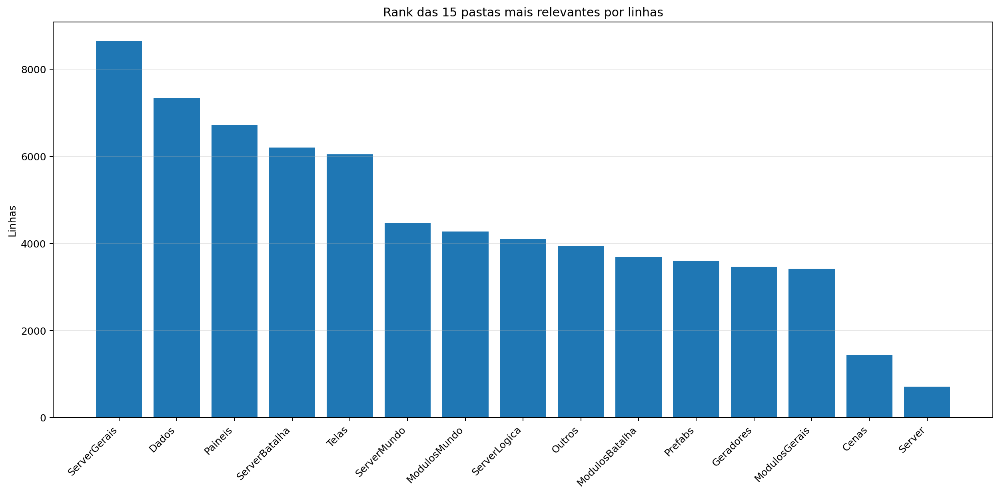
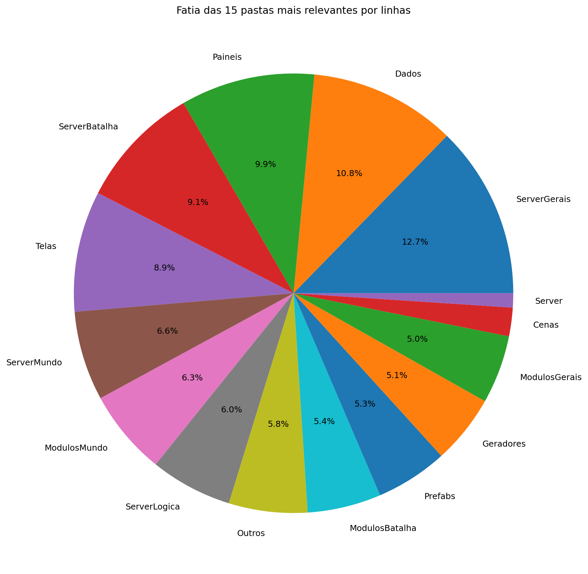
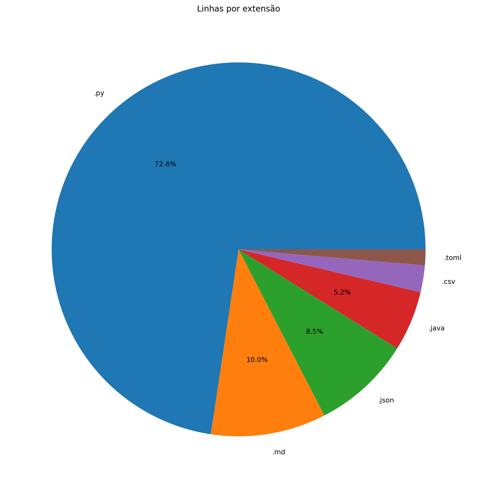
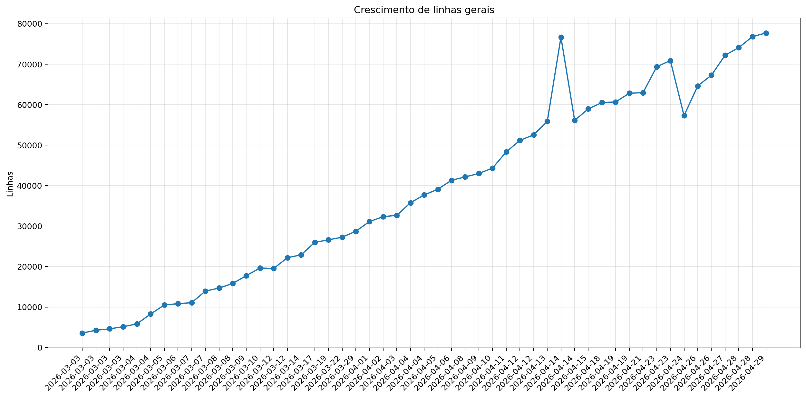
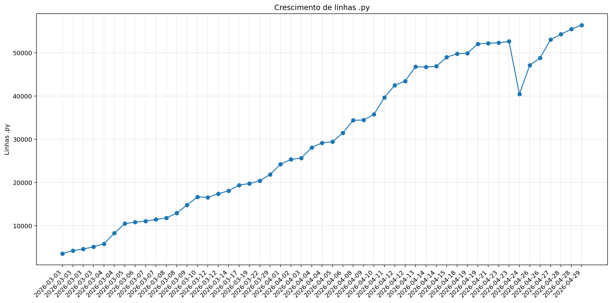
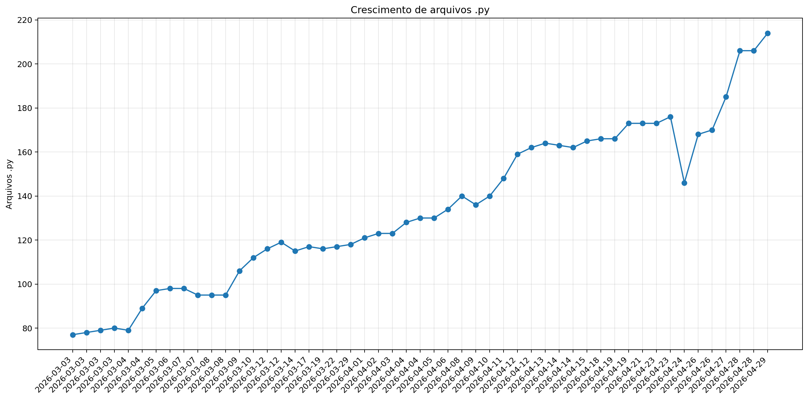
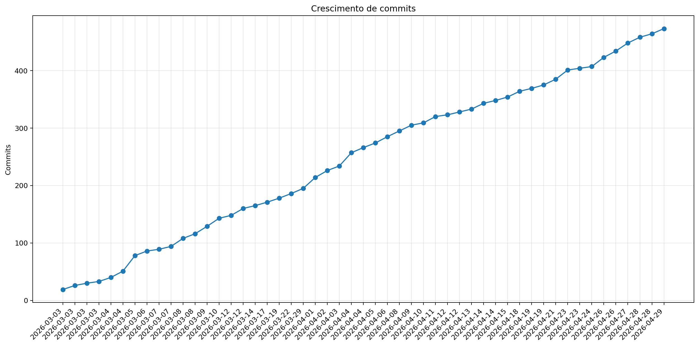

# Registro

**Relatório:** #51  
**Repo:** `Pokemon-Global-Server-Definitivo`  
**Gerado em:** 2026-04-29T11:15:13  
**Modelo de relatório:** 9  
**Autor:** Leon Cunha Alvaro Lopez Soto

## Visão geral

- **Pastas:** 1.264
- **Arquivos:** 72.205
- **Arquivos de texto:** 297
- **Peso dos arquivos de texto:** 3196.64 KB
- **Tamanho total:** 0.584 GB (627.099.402 bytes)
- **Dias desde a criação do repo:** 58
- **Dias desde a criação oficial:** 332
- **Horas estimadas:** 313.00
- **Linhas totais gerais:** 77.711
- **Commits (repo):** 473
- **Adições desde o último relatório:** +4.249
- **Reduções desde o último relatório:** -1.450

## Python

- **Arquivos `.py`:** 214
- **Linhas totais:** 56.425
- **Tamanho total `.py`:** 2427.09 KB
- **Classes encontradas:** 187
- **Funções encontradas:** 803
- **Métodos encontrados:** 2.506
- **Total funções + métodos:** 3.309
- **Bibliotecas diferentes usadas:** 42

## Rank das 15 pastas mais relevantes por linhas

| Rank | Pasta | Subpastas | Arquivos | Linhas gerais | Tamanho (KB) |
|---:|---|---:|---:|---:|---:|
| 1 | `ServerGerais` | 4 | 51 | 8.648 | 479.09 |
| 2 | `Dados` | 6 | 56 | 7.337 | 326.05 |
| 3 | `Paineis` | 0 | 16 | 6.716 | 302.33 |
| 4 | `ServerBatalha` | 1 | 24 | 6.202 | 275.35 |
| 5 | `Telas` | 2 | 19 | 6.044 | 236.36 |
| 6 | `ServerMundo` | 1 | 17 | 4.479 | 234.32 |
| 7 | `ModulosMundo` | 0 | 14 | 4.277 | 196.81 |
| 8 | `ServerLogica` | 4 | 41 | 4.105 | 125.08 |
| 9 | `Outros` | 0 | 8 | 3.935 | 142.28 |
| 10 | `ModulosBatalha` | 0 | 12 | 3.690 | 172.94 |
| 11 | `Prefabs` | 0 | 14 | 3.606 | 131.80 |
| 12 | `Geradores` | 1 | 16 | 3.464 | 151.63 |
| 13 | `ModulosGerais` | 0 | 15 | 3.419 | 129.66 |
| 14 | `Cenas` | 0 | 6 | 1.432 | 66.46 |
| 15 | `Server` | 0 | 7 | 709 | 24.83 |

## Top 50 maiores arquivos `.py` por linhas

| Arquivo | Linhas | Tamanho (KB) |
|---|---:|---:|
| `Outros/GeradorRelatorios.py` | 1.629 | 59.82 |
| `Codigo/Paineis/FichaPokemon.py` | 1.267 | 56.91 |
| `Codigo/Telas/Subtelas/SubtelaInventarioPokemons.py` | 1.085 | 49.71 |
| `Codigo/Paineis/VisualizadorLog.py` | 1.073 | 61.91 |
| `Codigo/ModulosMundo/ControladorObjetos.py` | 1.029 | 50.58 |
| `SimuladorServerJogo/Gerais/EstadoServidor.py` | 993 | 39.63 |
| `SimuladorServerJogo/Gerais/Geradores/GeradorPokemon.py` | 837 | 34.49 |
| `Codigo/Prefabs/Texto.py` | 806 | 30.97 |
| `SimuladorServerJogo/Batalha/PokemonBatalha.py` | 779 | 42.60 |
| `Codigo/ModulosBatalha/MontadorJogadas.py` | 719 | 35.75 |
| `Codigo/ModulosMundo/ControladorPlayer.py` | 719 | 34.43 |
| `SimuladorServerJogo/Mundo/Cerebros/CerebroNPCs.py` | 717 | 37.94 |
| `SimuladorServerJogo/Mundo/BancoDados.py` | 689 | 33.84 |
| `SimuladorServerJogo/Logica/Comandos/Comandos.py` | 681 | 28.42 |
| `SimuladorServerJogo/Gerais/Geradores/GeradorMundo.py` | 678 | 27.20 |
| `Codigo/Paineis/FichaPokemonBatalha.py` | 677 | 33.37 |
| `Codigo/Visual/PokemonBatalhaEstado.py` | 640 | 29.50 |
| `Codigo/Paineis/Container.py` | 637 | 23.33 |
| `SimuladorServerJogo/Batalha/Partida.py` | 629 | 30.51 |
| `Codigo/Cenas/CenaMundo.py` | 623 | 33.83 |
| `Outros/AtualizadorRelatorios.py` | 619 | 21.46 |
| `SimuladorServerJogo/Gerais/Rotas/Atualizador.py` | 575 | 28.55 |
| `Codigo/Telas/Telas/TelaServers.py` | 570 | 17.86 |
| `Codigo/ModulosGerais/ImagensMapa.py` | 567 | 25.04 |
| `Codigo/Visual/PokemonBatalhaAnimator.py` | 567 | 24.14 |
| `Codigo/ModulosGerais/Sonoridades.py` | 553 | 14.05 |
| `Codigo/Paineis/PainelArvoreHabilidades.py` | 547 | 26.81 |
| `Codigo/Telas/Telas/TelasGenericas.py` | 547 | 18.58 |
| `Codigo/Geradores/PokemonMundo.py` | 542 | 25.50 |
| `Outros/EditorSkins.py` | 514 | 19.97 |
| `Codigo/Telas/Subtelas/SubtelaInventarioItens.py` | 509 | 23.27 |
| `SimuladorServerJogo/Gerais/Rotas/Ativador.py` | 505 | 23.71 |
| `SimuladorServerJogo/Mundo/ObjetosMundoServer.py` | 494 | 32.12 |
| `Codigo/ModulosMundo/LeitorDialogo.py` | 494 | 20.31 |
| `Codigo/Prefabs/Botao.py` | 489 | 18.00 |
| `Codigo/ModulosBatalha/PokemonBatalha.py` | 485 | 22.51 |
| `Codigo/ModulosMundo/LeitorMundo.py` | 484 | 22.01 |
| `SimuladorServerJogo/Batalha/BatalhaIA/AvaliadorIA.py` | 480 | 25.08 |
| `Codigo/ModulosGerais/FiltroCamera.py` | 478 | 21.53 |
| `SimuladorServerJogo/Mundo/InicializadorNPC.py` | 461 | 23.85 |
| `Outros/Mixer.py` | 460 | 15.31 |
| `Codigo/ModulosBatalha/ControladorBatalha.py` | 457 | 21.53 |
| `Codigo/Telas/Subtelas/SubtelaDialogo.py` | 439 | 19.47 |
| `Codigo/Paineis/PainelReceitas.py` | 438 | 14.70 |
| `Codigo/ModulosBatalha/Arena.py` | 429 | 20.10 |
| `SimuladorServerJogo/Mundo/Cerebros/CerebroCentral.py` | 427 | 21.80 |
| `Codigo/Telas/Subtelas/SubtelaCriarPersonagem.py` | 423 | 14.91 |
| `SimuladorServerJogo/Batalha/BatalhaIA/MacroSimulador.py` | 419 | 18.81 |
| `Outros/AtualizadorReadMe.py` | 417 | 13.97 |
| `Codigo/Geradores/Player/Controle.py` | 414 | 17.48 |

## Top 20 maiores funções e métodos

| Arquivo | Nome | Tipo | Linhas |
|---|---|---:|---:|
| `Codigo/Paineis/VisualizadorLog.py` | `VisualizadorLog._registro_evento` | metodo | 330 |
| `Codigo/Geradores/Estadio.py` | `EstadioInterno.renderizar` | metodo | 254 |
| `SimuladorServerJogo/Gerais/Rotas/Atualizador.py` | `processar_atualizador_json` | funcao | 249 |
| `Codigo/Prefabs/Fluxos.py` | `Fluxo.desenhar` | metodo | 249 |
| `Outros/GeradorRelatorios.py` | `coletar_metricas` | funcao | 239 |
| `Codigo/Telas/Subtelas/SubtelaInventarioPokemons.py` | `InventarioPokemons.atualizar` | metodo | 147 |
| `Codigo/ModulosGerais/Colisor.py` | `Colisor.resolver_movimento_com_colisores` | metodo | 146 |
| `SimuladorServerJogo/Gerais/Geradores/GeradorMundo.py` | `_executar_world_generator` | funcao | 144 |
| `Codigo/Telas/Telas/TelaMapa.py` | `TelaMapa.desenhar` | metodo | 136 |
| `Outros/GeradorRelatorios.py` | `analisar_python_ast` | funcao | 132 |
| `Outros/AtualizadorRelatorios.py` | `main` | funcao | 131 |
| `Codigo/Telas/Telas/TelaMenu.py` | `TelaMenu` | funcao | 131 |
| `Outros/GeradorRelatorios.py` | `gerar_markdown` | funcao | 126 |
| `SimuladorServerJogo/Mundo/Cerebros/CerebroNPCs.py` | `CerebroNPCs.executar_tick` | metodo | 122 |
| `Codigo/ModulosBatalha/ControladorAnimacoes.py` | `ControladorAnimacoes.criar_animacao_de_evento` | metodo | 120 |
| `Codigo/Prefabs/Botao.py` | `Botao.render` | metodo | 119 |
| `Codigo/Telas/Subtelas/SubtelaInventarioPokemons.py` | `InventarioPokemons._reconstruir` | metodo | 119 |
| `Codigo/Cenas/CenaMundo.py` | `CenaMundo.atualizar_cena` | metodo | 118 |
| `Codigo/Telas/Subtelas/SubtelaCriarPersonagem.py` | `SubtelaCriarPersonagem._rebuild_layout` | metodo | 112 |
| `Outros/Mixer.py` | `main` | funcao | 109 |

## Top 20 maiores classes

| Arquivo | Classe | Linhas |
|---|---|---:|
| `Codigo/Paineis/FichaPokemon.py` | `FichaPokemon` | 1.245 |
| `Codigo/Telas/Subtelas/SubtelaInventarioPokemons.py` | `InventarioPokemons` | 1.057 |
| `Codigo/ModulosMundo/ControladorObjetos.py` | `ControladorObjetos` | 1.003 |
| `Codigo/Paineis/VisualizadorLog.py` | `VisualizadorLog` | 883 |
| `SimuladorServerJogo/Batalha/PokemonBatalha.py` | `PokemonBatalha` | 733 |
| `Codigo/ModulosMundo/ControladorPlayer.py` | `ControladorPlayer` | 700 |
| `SimuladorServerJogo/Mundo/Cerebros/CerebroNPCs.py` | `CerebroNPCs` | 697 |
| `Codigo/ModulosBatalha/MontadorJogadas.py` | `MontadorJogadas` | 677 |
| `SimuladorServerJogo/Mundo/BancoDados.py` | `BancoDadosMundo` | 661 |
| `Codigo/Paineis/FichaPokemonBatalha.py` | `FichaPokemonBatalha` | 657 |
| `Codigo/Paineis/Container.py` | `Container` | 628 |
| `SimuladorServerJogo/Batalha/Partida.py` | `Partida` | 601 |
| `Codigo/Visual/PokemonBatalhaEstado.py` | `PokemonBatalhaEstado` | 587 |
| `Codigo/Cenas/CenaMundo.py` | `CenaMundo` | 586 |
| `Codigo/Visual/PokemonBatalhaAnimator.py` | `PokemonAnimator` | 537 |
| `Codigo/ModulosGerais/ImagensMapa.py` | `GerenciadorImagensMapa` | 520 |
| `Codigo/Geradores/PokemonMundo.py` | `Pokemon` | 518 |
| `Codigo/Paineis/PainelArvoreHabilidades.py` | `PainelArvoreHabilidades` | 517 |
| `Codigo/Telas/Subtelas/SubtelaInventarioItens.py` | `InventarioItens` | 492 |
| `Codigo/ModulosMundo/LeitorDialogo.py` | `LeitorDialogo` | 484 |

## Top 10 arquivos mais importados

| Arquivo | Vezes importado |
|---|---:|
| `Codigo/Prefabs/Texto.py` | 43 |
| `Codigo/Prefabs/Botao.py` | 31 |
| `SimuladorServerJogo/Logica/Executes/ExecutesAtaques/UtilitariosExecutes.py` | 21 |
| `SimuladorServerJogo/Gerais/EstadoServidor.py` | 16 |
| `Codigo/Geradores/ItemInventario.py` | 15 |
| `SimuladorServerJogo/Mundo/BancoDados.py` | 14 |
| `Codigo/ModulosGerais/Sonoridades.py` | 13 |
| `Codigo/ModulosGerais/Auxiliares.py` | 13 |
| `SimuladorServerJogo/Gerais/Rotas/Ativador.py` | 12 |
| `SimuladorServerJogo/Gerais/Geradores/GeradorPokemon.py` | 11 |

## Top 10 arquivos que mais importam

| Arquivo | Arquivos internos importados | Imports totais | Linhas |
|---|---:|---:|---:|
| `Codigo/Cenas/CenaMundo.py` | 22 | 25 | 623 |
| `SimuladorServerJogo/Logica/Executes/ExecutesAtaques/ControladorExecutes.py` | 22 | 23 | 264 |
| `SimuladorServerJogo/Mundo/Cerebros/CerebroCentral.py` | 16 | 25 | 427 |
| `Codigo/Telas/Subtelas/SubtelaInventarioPokemons.py` | 15 | 20 | 1.085 |
| `SimuladorServerJogo/Batalha/BatalhaIA/ControladorIA.py` | 12 | 16 | 166 |
| `SimuladorServerJogo/Gerais/Rotas/Atualizador.py` | 11 | 16 | 575 |
| `Codigo/Cenas/ControladorCenas.py` | 11 | 16 | 299 |
| `Codigo/Paineis/FichaPokemonBatalha.py` | 10 | 15 | 677 |
| `Codigo/Telas/Subtelas/SubtelaInventarioItens.py` | 10 | 13 | 509 |
| `Codigo/ModulosBatalha/ControladorBatalha.py` | 10 | 13 | 457 |

## Top 10 maiores arquivos por linhas

| Arquivo | Ext | Linhas |
|---|---:|---:|
| `Legado/DiretrizesBatalha_v7_ajustada.md` | `.md` | 4.860 |
| `Legado/PlanoImplementacaoBatalha_5Fases_ajustado.md` | `.md` | 1.872 |
| `Outros/GeradorRelatorios.py` | `.py` | 1.629 |
| `Dados/Tabelas/Pokemon Global Server - Pokemons.csv` | `.csv` | 1.309 |
| `Codigo/Paineis/FichaPokemon.py` | `.py` | 1.267 |
| `Codigo/Telas/Subtelas/SubtelaInventarioPokemons.py` | `.py` | 1.085 |
| `Codigo/Paineis/VisualizadorLog.py` | `.py` | 1.073 |
| `Codigo/ModulosMundo/ControladorObjetos.py` | `.py` | 1.029 |
| `README.md` | `.md` | 1.010 |
| `SimuladorServerJogo/Gerais/EstadoServidor.py` | `.py` | 993 |

## Linhas por extensão

| Ext | Linhas |
|---:|---:|
| `.py` | 56.425 |
| `.md` | 7.742 |
| `.json` | 6.628 |
| `.java` | 4.033 |
| `.csv` | 1.804 |
| `.toml` | 1.060 |

## Peso por extensão

| Ext | Arquivos | Peso | % do jogo |
|---:|---:|---:|---:|
| `.png` | 71.799 | 491.44 MB | 82.17% |
| `.ogg` | 35 | 90.64 MB | 15.16% |
| `.zip` | 2 | 4.48 MB | 0.75% |
| `.wav` | 9 | 3.81 MB | 0.64% |
| `.jpg` | 23 | 3.61 MB | 0.60% |
| `.py` | 214 | 2.37 MB | 0.40% |
| `.mp3` | 5 | 636.73 KB | 0.10% |
| `.md` | 3 | 246.42 KB | 0.04% |
| `.ttf` | 2 | 196.64 KB | 0.03% |
| `.csv` | 9 | 186.54 KB | 0.03% |
| `.json` | 49 | 161.95 KB | 0.03% |
| `.java` | 7 | 152.40 KB | 0.02% |
| `.class` | 31 | 125.12 KB | 0.02% |
| `.toml` | 14 | 22.04 KB | 0.00% |
| `.frag` | 1 | 9.20 KB | 0.00% |
| `.vert` | 1 | 160 bytes | 0.00% |

## Comparativo com o último relatório

| Métrica | Relatório anterior | Relatório atual | Diferença |
|---|---:|---:|---:|
| Arquivos | 72.212 | 72.205 | -7 |
| Linhas | 76.788 | 77.711 | +923 |
| Linhas .py | 55.502 | 56.425 | +923 |
| Métodos/funções | 3.260 | 3.309 | +49 |
| Classes | 181 | 187 | +6 |
| Commits | 464 | 473 | +9 |
| Tamanho | 598.84 MB | 598.05 MB | -809.08 KB |

### Top 3 commits por tamanho de diff

| Rank | Commit | Mensagem | Arquivos | Adições | Reduções | Diff total |
|---:|---|---|---:|---:|---:|---:|
| 1 | `87103251d616` | Criação da pasta Visual | 9 | 1.207 | 999 | 2.206 |
| 2 | `1fe4c6a6a3de` | relatorio | 12 | 2.022 | 146 | 2.168 |
| 3 | `eb9e3ff350a9` | Loader de tabelas | 18 | 170 | 192 | 362 |

## Gráficos de crescimento

