<div align="center">

# Pokémon Global Server


**Jogo 2D em Python com arquitetura client/server, mundo aberto, coleta de Pokémon, inventário, crafting, NPCs, exploração e batalhas estratégicas baseadas em turnos, ticks, física e efeitos.**

</div>

---

## 1. Descrição

**Pokémon Global Server** é um jogo 2D desenvolvido em Python com foco em exploração, progressão e batalhas estratégicas. O projeto combina um cliente visual feito com Pygame, módulos de interface, animação e renderização, além de um simulador de servidor responsável por regras, mundo, entidades, rotas e lógica autoritativa.

O jogo possui uma base grande de dados própria, incluindo Pokémon, ataques, itens, equipamentos, efeitos, NPCs, receitas, diálogos e regras de mundo. A estrutura foi pensada para separar cada parte importante do projeto: o cliente cuida da experiência visual e da interação do jogador, enquanto o servidor/simulador concentra a lógica de mundo, batalha, geração e validação de regras.

A proposta principal é criar um jogo com aparência simples, mas sistemas internos profundos: mundo grande em tiles, NPCs combatentes e vendedores, inventário, crafting, captura, efeitos de status, batalha 6v6, leitura de logs de combate, ações planejadas pelo jogador e uma arquitetura preparada para evoluir para multiplayer real.

---

## 2. Snapshots

> O vídeo de showcase ainda será adicionado. As imagens abaixo são renderizadas diretamente do diretório `Snapshots/` do repositório.

### Showcase em vídeo

[Assistir showcase no YouTube](https://www.youtube.com/watch?v=COLOCAR_ID_DO_VIDEO_AQUI)

### Galeria

| Snapshot | Snapshot |
|---|---|
| 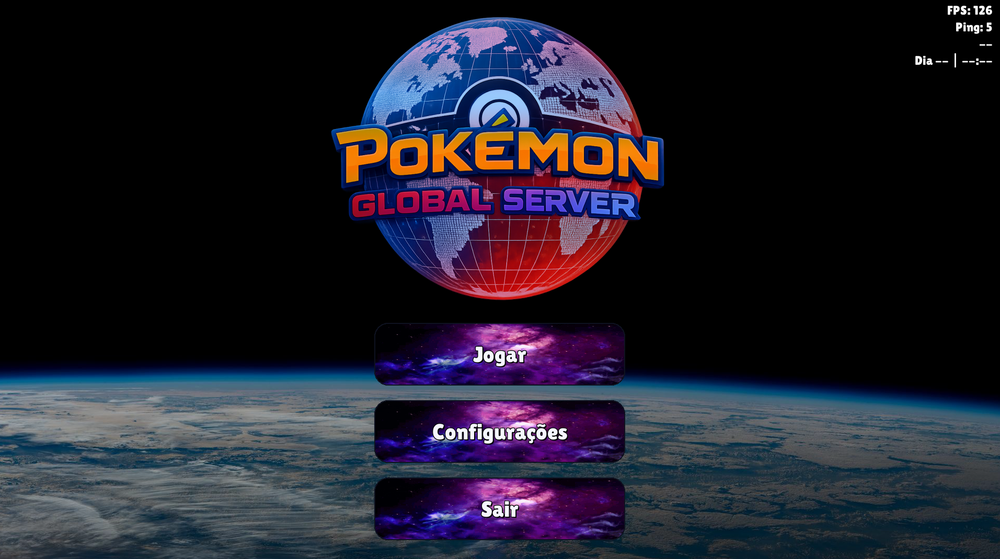 | 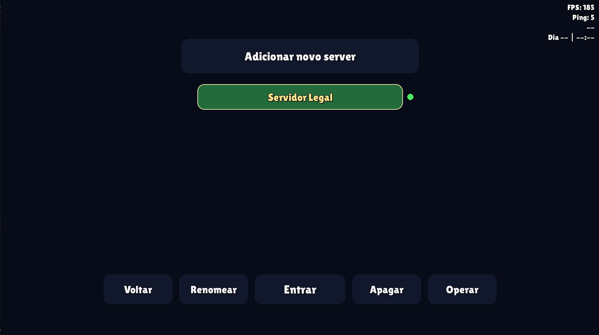 |
| 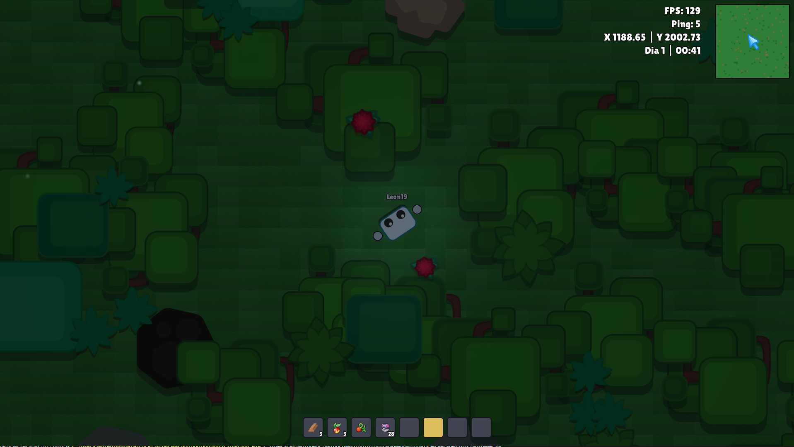 | 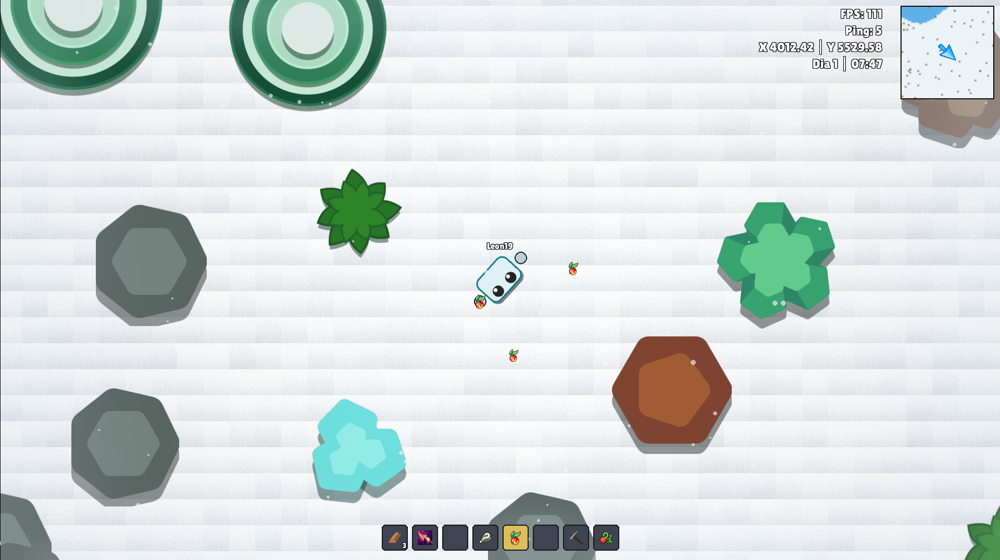 |
| 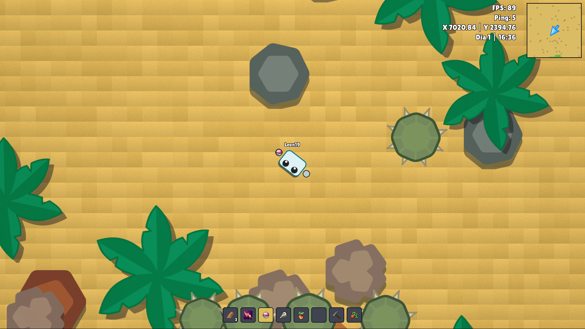 | 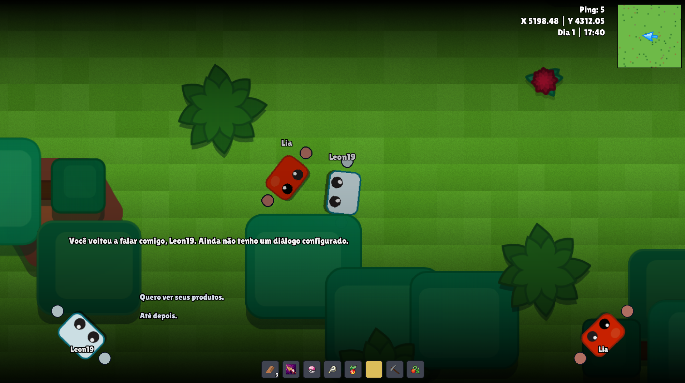 |
| 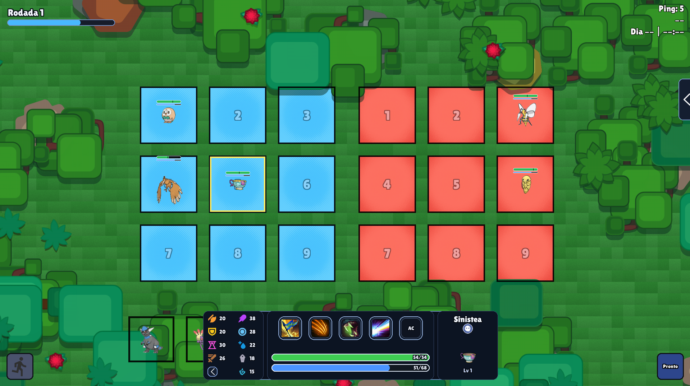 | 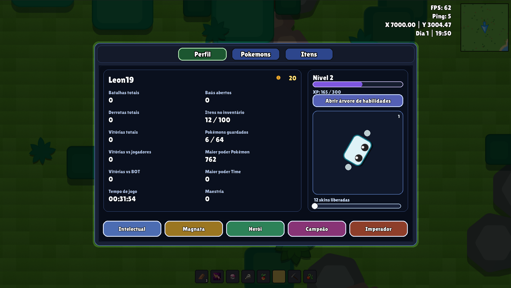 |
| 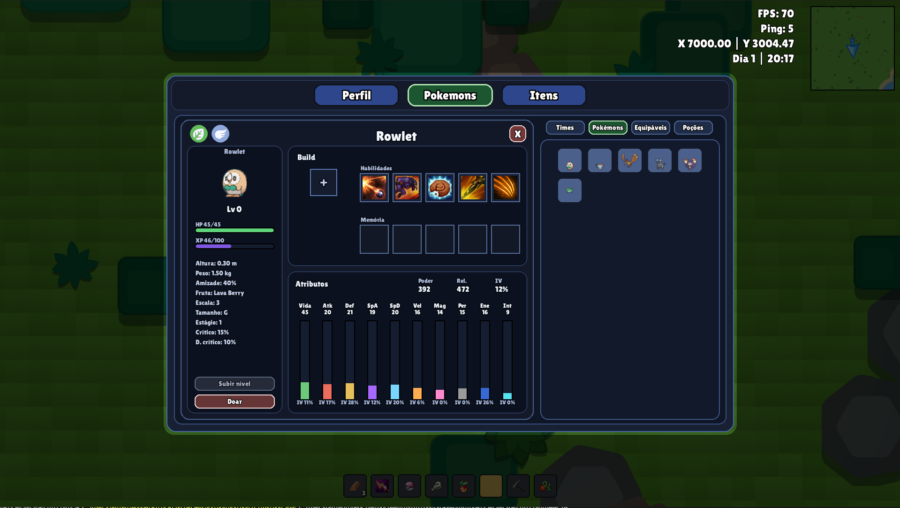 | 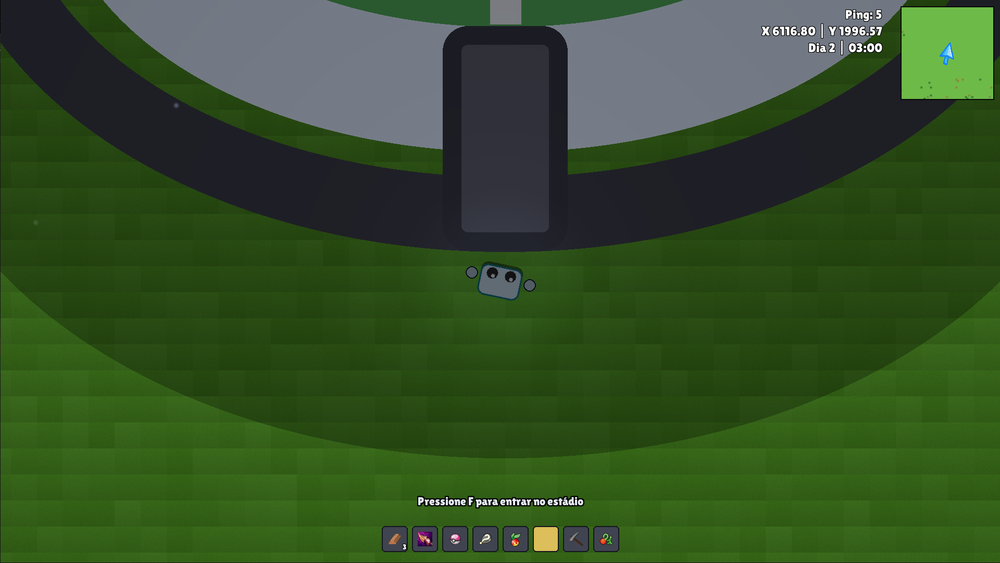 |

## 3. Detalhes estatísticos

Os números abaixo são atualizados automaticamente pelo `Outros/AtualizadorReadMe.py` a partir dos arquivos atuais do projeto.

| Categoria | Quantidade atual |
|---|---:|
| Pokémon cadastrados em `Dados/Pokemon Global Server - Pokemons.csv` | **1.292** |
| Ataques cadastrados em `Dados/Pokemon Global Server - Ataques.csv` | **76** |
| Efeitos cadastrados em `Dados/Pokemon Global Server - Efeitos.csv` | **51** |
| Itens cadastrados em `Dados/Pokemon Global Server - Itens.csv` | **141** |
| Equipáveis cadastrados em `Dados/Pokemon Global Server - Equipaveis.csv` | **64** |
| NPCs cadastrados | **95** |
| Estruturas naturais | **25** |
| Trilhas sonoras | **37** |
| Receitas | **31** |
| Tipos de Pokémon | **20** |
| Biomas | **7** |
| Mundo planejado | **10.000 x 10.000 tiles** |

Principais arquivos de dados:

- `Dados/Pokemon Global Server - Pokemons.csv`
- `Dados/Pokemon Global Server - Ataques.csv`
- `Dados/Pokemon Global Server - Efeitos.csv`
- `Dados/Pokemon Global Server - Itens.csv`
- `Dados/Pokemon Global Server - Equipaveis.csv`
- `Dados/Pokemon Global Server - Receitas.json`
- `Dados/Pokemon Global Server - PropriedadesAtaques.json`
- `Dados/Pokemon Global Server - Sistema FR.csv`

## 4. Features principais e conceitos

### Mundo e exploração

- Mundo grande baseado em tiles.
- Sistema de leitura e controle de mundo no cliente.
- Módulos dedicados para atores, objetos, player, HUD, minimapa e mapa-múndi.
- Sistema de chunks/pacotes para sincronização e atualização do estado do mundo.
- Geração de mundo com regras próprias de terreno, biomas, localidades, rotas e estruturas naturais.
- Estrutura de geração em Java para etapas pesadas de criação do mundo.

### Pokémon e progressão

- Base extensa com mais de mil Pokémon cadastrados.
- Atributos próprios como vida, ataque, defesa, ataque especial, defesa especial, velocidade, magia, perfuração, energia, inteligência, crítico, raridade, estágio, peso, tamanho e linhagem.
- Sistema de inventário de Pokémon.
- Painéis de visualização como Pokédex, ficha de Pokémon, ficha de batalha e times.
- Estrutura para captura, materialização e controle de Pokémon no mundo.

### Batalha

- Sistema de batalha separado dos módulos gerais do mundo.
- Batalha com times, jogadores, arena, HUD, controlador de ações, leitor de logs e finalização.
- Arquitetura de batalha preparada para turnos, ações planejadas e reprodução visual por logs.
- Sistema de ataques com propriedades carregadas de dados.
- Efeitos de status e regras próprias para cálculo e aplicação de consequências.
- IA separada em módulo próprio dentro de `Codigo/ModulosBatalha/IA`.

### Ações, ataques e efeitos

- Ataques definidos em CSV e propriedades adicionais em JSON.
- Execução de ataques separada em módulos de lógica do servidor.
- Suporte a passivas de ataques, itens, equipamentos e habilidades.
- Efeitos negativos e positivos controlados por dados e regras.
- Sistema de fraquezas e resistências baseado em matriz própria.

### Inventário, itens e crafting

- Sistema de itens com raridade, valor, stack, baú e estilo.
- Equipáveis com múltiplos bônus de status.
- Receitas definidas em JSON.
- Serviço de crafting no módulo de mundo.
- Painéis próprios para inventário, itens, receitas e craft.

### NPCs e interações

- NPCs combatentes e vendedores cadastrados em CSV.
- Diálogos e interações em JSON.
- Cérebro de NPCs no servidor.
- Estrutura para vendedores, combatentes, capitães, líderes e personagens especiais.

### Interface e experiência visual

- Sistema de cenas: login, menu, carregamento, mundo e combate.
- Subtelas e painéis reutilizáveis.
- Componentes de interface próprios: botões, barras, caixas de texto, tooltips, mensagens, painéis e imagens.
- HUDs separados para mundo e batalha.
- Sistema de animação de Pokémon.
- Pipeline gráfico em evolução, com módulos para composição e suporte a ModernGL/shaders.

### Servidor e simulação

- Simulador de servidor separado do cliente.
- Rotas próprias para entrada, ativação, atualização, terminal, operação e batalha.
- Estado central do servidor.
- Regras centralizadas em TOML.
- Cérebro central de mundo e cérebros especializados para Pokémon, baús, estádios, estruturas, itens, NPCs, projéteis, tempo e XP.

---

## 5. Arquitetura

A arquitetura abaixo é atualizada automaticamente pelo `Outros/AtualizadorReadMe.py`, vasculhando as principais pastas do projeto.

- `Codigo/`: cliente do jogo, interface, cenas, renderização, HUDs, telas e módulos visuais.
- `Dados/`: base de dados do jogo, com CSVs e JSONs de Pokémon, ataques, itens, NPCs, receitas e interações.
- `SimuladorServerJogo/`: servidor/simulador, regras, rotas, lógica autoritativa, mundo, batalha, geração e banco de dados.

### Visão geral atualizada

```text
.
├── Dados/
├── Codigo/
└── SimuladorServerJogo/
```

### `Dados/`

```text
Dados/
├── InteracoesNPC/
│   ├── Combatentes/
│   │   ├── Alleka.json
│   │   ├── Amable.json
│   │   ├── Caio.json
│   │   ├── Felipox.json
│   │   ├── Felps.json
│   │   ├── Ferraz.json
│   │   ├── Garcia.json
│   │   ├── Guedes.json
│   │   ├── Henrique.json
│   │   ├── João.json
│   │   ├── Lisciele.json
│   │   ├── Murilo.json
│   │   ├── Nathzinha.json
│   │   ├── Paulo.json
│   │   ├── Ph.json
│   │   ├── Ramos.json
│   │   ├── Sidney.json
│   │   ├── Suneiva.json
│   │   ├── Suriane.json
│   │   └── Vasques.json
│   ├── Vendedores/
│   │   └── Josefa.json
│   ├── ExemploCapitao_Laura.json
│   ├── ExemploDesafiante_Ravi.json
│   ├── ExemploDissociado_Nico.json
│   ├── ExemploLider_Alleka.json
│   └── ManualDialogos.json
├── PropriedadesAtaques/
│   ├── PropriedadesAgua.json
│   ├── PropriedadesCosmico.json
│   ├── PropriedadesDragao.json
│   ├── PropriedadesEletrico.json
│   ├── PropriedadesFada.json
│   ├── PropriedadesFantasma.json
│   ├── PropriedadesFogo.json
│   ├── PropriedadesGelo.json
│   ├── PropriedadesInseto.json
│   ├── PropriedadesLutador.json
│   ├── PropriedadesMetal.json
│   ├── PropriedadesNormal.json
│   ├── PropriedadesPedra.json
│   ├── PropriedadesPlanta.json
│   ├── PropriedadesPsiquico.json
│   ├── PropriedadesSombrio.json
│   ├── PropriedadesSonoro.json
│   ├── PropriedadesTerra.json
│   ├── PropriedadesVeneno.json
│   └── PropriedadesVoador.json
├── Pokemon Global Server - Ataques.csv
├── Pokemon Global Server - Baus.csv
├── Pokemon Global Server - Efeitos.csv
├── Pokemon Global Server - Equipaveis.csv
├── Pokemon Global Server - Itens.csv
├── Pokemon Global Server - NPC Combatente.csv
├── Pokemon Global Server - NPC Vendedor.csv
├── Pokemon Global Server - Pokemons.csv
├── Pokemon Global Server - Receitas.json
└── Pokemon Global Server - Sistema FR.csv
```

### `Codigo/`

```text
Codigo/
├── Cenas/
│   ├── CenaCarregamento.py
│   ├── CenaCombate.py
│   ├── CenaLogin.py
│   ├── CenaMenu.py
│   ├── CenaMundo.py
│   └── ControladorCenas.py
├── Geradores/
│   ├── Player/
│   │   ├── Controle.py
│   │   ├── Inventario.py
│   │   ├── Perfil.py
│   │   └── Player.py
│   ├── Ator.py
│   ├── Baus.py
│   ├── Dungeon.py
│   ├── Estadio.py
│   ├── EstruturaNaturais.py
│   ├── ItemInventario.py
│   ├── ItemMundo.py
│   ├── PokemonInventario.py
│   ├── PokemonMundo.py
│   ├── Projetil.py
│   └── XpMundo.py
├── ModulosBatalha/
│   ├── Arena.py
│   ├── ClimaBatalha.py
│   ├── ControladorAnimacoes.py
│   ├── ControladorBatalha.py
│   ├── ElementosHudBatalha.py
│   ├── FinalizadorBatalha.py
│   ├── IndicadorAtaque.py
│   ├── InicializadorBatalha.py
│   ├── LeitorLogs.py
│   ├── MontadorJogadas.py
│   ├── PlayerBatalha.py
│   └── PokemonBatalha.py
├── ModulosGerais/
│   ├── Auxiliares.py
│   ├── Camera.py
│   ├── Colisor.py
│   ├── CompositorModernGL.py
│   ├── DesenhaAtor.py
│   ├── DesenhoMapa.py
│   ├── Discord.py
│   ├── EfeitosTela.py
│   ├── FiltroCamera.py
│   ├── GerenciadorTiles.py
│   ├── ImagensMapa.py
│   ├── ModuladorRegras.py
│   ├── PipelineGrafica.py
│   ├── PokemonAnimator.py
│   └── Sonoridades.py
├── ModulosMundo/
│   ├── ControladorAtores.py
│   ├── ControladorCriaveis.py
│   ├── ControladorMundo.py
│   ├── ControladorObjetos.py
│   ├── ControladorPlayer.py
│   ├── ElementosHudMundo.py
│   ├── ExecutaveisPoção.py
│   ├── LeitorDialogo.py
│   ├── LeitorMundo.py
│   ├── Loja.py
│   ├── Minimapa.py
│   ├── ServicoCraft.py
│   ├── ServicoMapaMundo.py
│   └── SistemaPacotes.py
├── Outros/
│   └── Shaders/
│       ├── mundo.frag
│       └── mundo.vert
├── Paineis/
│   ├── Container.py
│   ├── FichaAtaque.py
│   ├── FichaItem.py
│   ├── FichaPokemon.py
│   ├── FichaPokemonBatalha.py
│   ├── Musicdex.py
│   ├── PainelAcoes.py
│   ├── PainelArvoreHabilidades.py
│   ├── PainelAuxiliarPoke.py
│   ├── PainelCraft.py
│   ├── PainelEstatisticas.py
│   ├── PainelReceitas.py
│   ├── PainelTimes.py
│   ├── Pokedex.py
│   ├── Skindex.py
│   └── VisualizadorLog.py
├── Prefabs/
│   ├── Arrastavel.py
│   ├── Barra.py
│   ├── BarraPesquisa.py
│   ├── Botao.py
│   ├── CaixaTexto.py
│   ├── EfeitosVisuais.py
│   ├── Fluxos.py
│   ├── Imagem.py
│   ├── Mensagem.py
│   ├── Opcoes.py
│   ├── Painel.py
│   ├── Terminal.py
│   ├── Texto.py
│   └── Tooltip.py
├── Server/
│   ├── GerenciadorServerList.py
│   ├── Login.py
│   ├── ServerBatalha.py
│   ├── ServerLogin.py
│   ├── ServerMenu.py
│   ├── ServerMundo.py
│   └── ServerTerminal.py
└── Telas/
    ├── Subtelas/
    │   ├── Subtela.py
    │   ├── SubtelaCriarPersonagem.py
    │   ├── SubtelaDialogo.py
    │   ├── SubtelaFinalizacao.py
    │   ├── SubtelaInventario.py
    │   ├── SubtelaInventarioEstatisticas.py
    │   ├── SubtelaInventarioItens.py
    │   ├── SubtelaInventarioPokemons.py
    │   ├── SubtelaOpcoes.py
    │   └── SubtelaPreBatalha.py
    └── Telas/
        ├── TelaConfig.py
        ├── TelaConfigAvancada.py
        ├── TelaConta.py
        ├── TelaLogin.py
        ├── TelaMapa.py
        ├── TelaMenu.py
        ├── TelaOperador.py
        ├── TelaServers.py
        └── TelasGenericas.py
```

### `SimuladorServerJogo/`

```text
SimuladorServerJogo/
├── Batalha/
│   ├── BatalhaIA/
│   │   ├── AvaliadorIA.py
│   │   ├── ConfigIA.py
│   │   ├── ContextoIA.py
│   │   ├── ControladorIA.py
│   │   ├── FallbackIA.py
│   │   ├── GeradorAcoesIA.py
│   │   ├── HackerIA.py
│   │   ├── MacroSimulador.py
│   │   ├── MemoriaIA.py
│   │   ├── MetadadosAtaquesIA.json
│   │   ├── MetadadosIA.py
│   │   ├── MicroSimulador.py
│   │   └── PlanejadorIA.py
│   ├── ColetorAcoes.py
│   ├── Construto.py
│   ├── ConstrutorLog.py
│   ├── FraquezasResistencia.py
│   ├── GerenciadorPartidas.py
│   ├── IDsBatalha.py
│   ├── Partida.py
│   ├── PokemonBatalha.py
│   ├── PropriedadesAtaques.py
│   ├── ResolvedorFlags.py
│   └── RodadorTurno.py
├── Gerais/
│   ├── Geradores/
│   │   ├── Java/
│   │   │   ├── classes/
│   │   │   │   ├── Biome.class
│   │   │   │   ├── BiomeDefinition.class
│   │   │   │   ├── BiomeRules.class
│   │   │   │   ├── ClimateSource.class
│   │   │   │   ├── GeneratorContext$1.class
│   │   │   │   ├── GeneratorContext.class
│   │   │   │   ├── GeradorBiomas$1.class
│   │   │   │   ├── GeradorBiomas.class
│   │   │   │   ├── GeradorImagens$1.class
│   │   │   │   ├── GeradorImagens.class
│   │   │   │   ├── GeradorLocalidades.class
│   │   │   │   ├── GeradorObjetos.class
│   │   │   │   ├── GeradorRotas$RouteCandidate.class
│   │   │   │   ├── GeradorRotas$RouteNode.class
│   │   │   │   ├── GeradorRotas.class
│   │   │   │   ├── GeradorTerreno.class
│   │   │   │   ├── LocalityPoiConfig.class
│   │   │   │   ├── LocalityRules.class
│   │   │   │   ├── NaturalStructure.class
│   │   │   │   ├── NoiseLayerConfig.class
│   │   │   │   ├── Poi.class
│   │   │   │   ├── PoiConfig.class
│   │   │   │   ├── PoiType.class
│   │   │   │   ├── RegionData.class
│   │   │   │   ├── RouteData.class
│   │   │   │   ├── RouteRules.class
│   │   │   │   ├── SimpleToml.class
│   │   │   │   ├── TerrainRules.class
│   │   │   │   ├── Tile.class
│   │   │   │   ├── TomlTable.class
│   │   │   │   └── WorldGenerator.class
│   │   │   ├── GeradorBiomas.java
│   │   │   ├── GeradorImagens.java
│   │   │   ├── GeradorLocalidades.java
│   │   │   ├── GeradorObjetos.java
│   │   │   ├── GeradorRotas.java
│   │   │   ├── GeradorTerreno.java
│   │   │   └── WorldGenerator.java
│   │   ├── GeradorBaus.py
│   │   ├── GeradorMundo.py
│   │   └── GeradorPokemon.py
│   ├── Rotas/
│   │   ├── Ativador.py
│   │   ├── Atualizador.py
│   │   ├── Entrada.py
│   │   ├── RotasBatalha.py
│   │   ├── ServerOperar.py
│   │   └── Terminal.py
│   ├── ContextoServidor.py
│   ├── EstadoServidor.py
│   └── LoaderRegras.py
├── Logica/
│   ├── Comandos/
│   │   └── Comandos.py
│   ├── Executes/
│   │   ├── ExecutesAtaques/
│   │   │   ├── ControladorExecutes.py
│   │   │   ├── ExecutesAgua.py
│   │   │   ├── ExecutesCosmico.py
│   │   │   ├── ExecutesDragao.py
│   │   │   ├── ExecutesEletrico.py
│   │   │   ├── ExecutesFada.py
│   │   │   ├── ExecutesFantasma.py
│   │   │   ├── ExecutesFogo.py
│   │   │   ├── ExecutesGelo.py
│   │   │   ├── ExecutesInseto.py
│   │   │   ├── ExecutesLutador.py
│   │   │   ├── ExecutesMetal.py
│   │   │   ├── ExecutesNormal.py
│   │   │   ├── ExecutesPedra.py
│   │   │   ├── ExecutesPlanta.py
│   │   │   ├── ExecutesPsiquico.py
│   │   │   ├── ExecutesSombrio.py
│   │   │   ├── ExecutesSonoro.py
│   │   │   ├── ExecutesTerra.py
│   │   │   ├── ExecutesVeneno.py
│   │   │   ├── ExecutesVoador.py
│   │   │   └── UtilitariosExecutes.py
│   │   ├── ExecutesFrutas.py
│   │   ├── ExecutesPokebolas.py
│   │   └── PassivasEquipaveis.py
│   └── Regras/
│       ├── Batalha.toml
│       ├── Biomas.toml
│       ├── Ciclo.toml
│       ├── EstruturasNaturais.toml
│       ├── Geracao.json
│       ├── Gerais.toml
│       ├── Localidades.toml
│       ├── Mundo.toml
│       ├── NPCs.toml
│       ├── Player.toml
│       ├── Pokemons.toml
│       ├── Projeteis.toml
│       ├── Server.toml
│       ├── Spawn.toml
│       └── Terreno.toml
└── Mundo/
    ├── Cerebros/
    │   ├── CerebroBaus.py
    │   ├── CerebroCentral.py
    │   ├── CerebroEstadios.py
    │   ├── CerebroEstruturasNaturais.py
    │   ├── CerebroItensMundo.py
    │   ├── CerebroNPCs.py
    │   ├── CerebroPokemons.py
    │   ├── CerebroProjeteis.py
    │   ├── CerebroTempo.py
    │   └── CerebroXpMundo.py
    ├── AutoridadeCaptura.py
    ├── BancoDados.py
    ├── InicializadorNPC.py
    ├── ObjetosMundoServer.py
    ├── PacotesTick.py
    ├── ServicoInventario.py
    └── TiqueServidor.py
```

## 6. Fluxo

### Fluxo geral do jogo

```text
Jogador
  ↓
Cliente Python/Pygame
  ↓
Controlador de Cenas
  ↓
Cena atual
  ├── Login
  ├── Menu
  ├── Mundo
  └── Combate
  ↓
Módulos específicos
  ├── Mundo: player, atores, objetos, HUD, minimapa, diálogo, loja e pacotes
  └── Batalha: arena, HUD, ações, animações, logs e finalização
  ↓
Comunicação com camada Server do cliente
  ↓
Rotas do SimuladorServerJogo
  ↓
Lógica autoritativa do servidor
  ↓
Resposta para o cliente
  ↓
Atualização visual, HUD, animações e estado local
```

### Fluxo de mundo

```text
CenaMundo
  ↓
ControladorMundo
  ├── ControladorPlayer
  ├── ControladorAtores
  ├── ControladorObjetos
  ├── ControladorCriaveis
  ├── SistemaPacotes
  ├── ElementosHudMundo
  ├── Minimapa
  └── ServicoMapaMundo
  ↓
ServerMundo / Rotas do servidor
  ↓
CerebroCentral
  ├── CerebroPokemons
  ├── CerebroNPCs
  ├── CerebroItensMundo
  ├── CerebroEstadios
  ├── CerebroEstruturasNaturais
  ├── CerebroProjeteis
  ├── CerebroTempo
  └── CerebroXpMundo
  ↓
PacotesTick / EstadoServidor
  ↓
Cliente atualiza entidades, HUD e visualização
```

### Fluxo de batalha

```text
CenaCombate
  ↓
InicializadorBatalha
  ↓
ControladorBatalha
  ├── Arena
  ├── PlayerBatalha
  ├── PokemonBatalha
  ├── MontadorJogadas
  ├── IndicadorAtaque
  ├── ElementosHudBatalha
  ├── ControladorAnimacoes
  ├── LeitorLogs
  └── FinalizadorBatalha
  ↓
ServerBatalha / RotasBatalha
  ↓
GerenciadorPartidas
  ↓
Partida
  ↓
ColetorAcoes
  ↓
RodadorTurno
  ↓
Executes e passivas
  ├── ExecuteAtaques
  ├── PassivaAtaques
  ├── PassivaItens
  ├── PassivasEquipaveis
  └── PassivasHabilidades
  ↓
ConstrutorLog
  ↓
Cliente lê logs e reproduz visualmente os acontecimentos
```

### Fluxo de dados e regras

```text
Dados/*.csv e Dados/*.json
  ↓
LoaderRegras / ModuladorRegras
  ↓
Regras TOML e JSON do servidor
  ↓
Geradores e serviços
  ↓
Entidades de mundo, batalha, itens, NPCs e Pokémon
  ↓
Cliente e servidor usam a mesma base conceitual de dados
```

### Fluxo de renderização e interface

```text
ControladorCenas
  ↓
Cena atual renderiza mundo/base
  ↓
PipelineGrafica
  ├── composição de cena
  ├── composição de HUD
  ├── filtros de câmera
  ├── efeitos de tela
  └── possível composição ModernGL/shader
  ↓
Paineis e Prefabs
  ↓
Tela final do jogo
```

---

## 7. Como rodar

> Esta seção ainda está como placeholder, porque o site oficial, instalador e pacote final de distribuição ainda não existem.

### Instalação pelo site

1. Acesse o site oficial:

```text
https://COLOCAR_SITE_DO_JOGO_AQUI.com
```

2. Baixe o instalador mais recente.

3. Execute o instalador.

4. Abra o jogo pelo atalho criado na área de trabalho ou no menu iniciar.

### Execução para desenvolvimento

> Ajuste os comandos abaixo conforme o arquivo principal definitivo do projeto.

```bash
# 1. Clone o repositório
git clone URL_DO_REPOSITORIO_AQUI

# 2. Entre na pasta do projeto
cd NOME_DA_PASTA_DO_PROJETO

# 3. Crie um ambiente virtual
python -m venv .venv

# 4. Ative o ambiente virtual
# Windows:
.venv\Scripts\activate

# Linux/macOS:
source .venv/bin/activate

# 5. Instale as dependências
pip install -r requirements.txt

# 6. Rode o jogo
python main.py
```

### Observações

- O projeto ainda está em desenvolvimento.
- O instalador final ainda será criado.
- O site de download ainda será definido.
- O comando exato de execução deve ser ajustado conforme o arquivo principal usado no repositório final.

---

## 8. Autor

Desenvolvido por **Leon**.

Projeto criado como um jogo autoral em Python, com foco em sistemas complexos de jogo, arquitetura client/server, mundo aberto, batalha estratégica e evolução contínua.

---

## 9. Último relatório

O projeto mantém o relatório mais recente em [`Registro.md`](Registro.md), localizado na raiz do repositório.

> O GitHub não incorpora automaticamente o conteúdo de outro arquivo Markdown dentro do README apenas com sintaxe Markdown. Para manter esta seção sempre atualizada de forma autônoma, o ideal é o atualizador de relatórios copiar o conteúdo de `Registro.md` para dentro do bloco abaixo sempre que o relatório for regenerado.

<!-- INICIO_REGISTRO_MD -->

# Registro

**Relatório:** #50  
**Repo:** `Pokemon-Global-Server-Definitivo`  
**Gerado em:** 2026-04-28T21:09:13  
**Modelo de relatório:** 9  
**Autor:** Leon Cunha Alvaro Lopez Soto

## Visão geral

- **Pastas:** 1.260
- **Arquivos:** 72.212
- **Arquivos de texto:** 289
- **Peso dos arquivos de texto:** 3151.70 KB
- **Tamanho total:** 0.585 GB (627.927.900 bytes)
- **Dias desde a criação do repo:** 57
- **Dias desde a criação oficial:** 331
- **Horas estimadas:** 313.00
- **Linhas totais gerais:** 76.788
- **Commits (repo):** 464
- **Adições desde o último relatório:** <span style='color: green'>+4.992</span>
- **Reduções desde o último relatório:** <span style='color: red'>-415</span>

## Python

- **Arquivos `.py`:** 206
- **Linhas totais:** 55.502
- **Tamanho total `.py`:** 2382.13 KB
- **Classes encontradas:** 181
- **Funções encontradas:** 785
- **Métodos encontrados:** 2.475
- **Total funções + métodos:** 3.260
- **Bibliotecas diferentes usadas:** 40

## Rank das 15 pastas mais relevantes por linhas

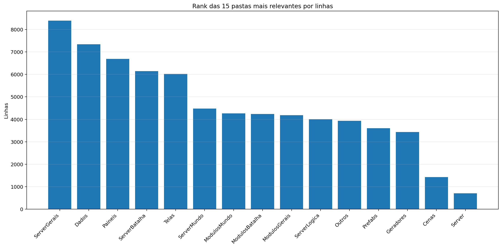

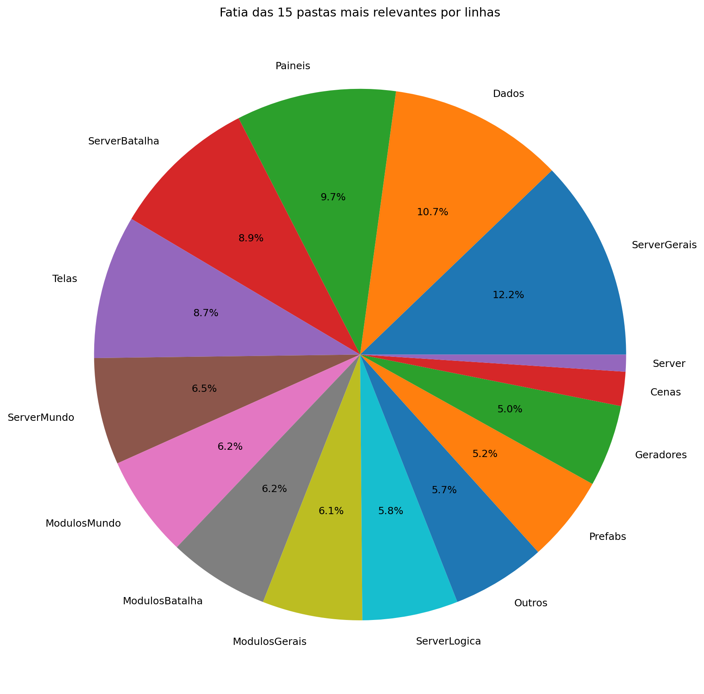

| Rank | Pasta | Subpastas | Arquivos | Linhas gerais | Tamanho (KB) |
|---:|---|---:|---:|---:|---:|
| 1 | `ServerGerais` | 4 | 50 | 8.394 | 468.47 |
| 2 | `Dados` | 4 | 56 | 7.337 | 326.05 |
| 3 | `Paineis` | 0 | 16 | 6.686 | 298.20 |
| 4 | `ServerBatalha` | 1 | 24 | 6.142 | 271.95 |
| 5 | `Telas` | 2 | 19 | 6.019 | 233.55 |
| 6 | `ServerMundo` | 1 | 17 | 4.479 | 234.09 |
| 7 | `ModulosMundo` | 0 | 14 | 4.263 | 196.19 |
| 8 | `ModulosBatalha` | 0 | 12 | 4.236 | 198.50 |
| 9 | `ModulosGerais` | 0 | 15 | 4.187 | 161.19 |
| 10 | `ServerLogica` | 4 | 41 | 4.008 | 119.88 |
| 11 | `Outros` | 0 | 8 | 3.935 | 142.28 |
| 12 | `Prefabs` | 0 | 14 | 3.606 | 131.80 |
| 13 | `Geradores` | 1 | 15 | 3.433 | 151.65 |
| 14 | `Cenas` | 0 | 6 | 1.432 | 66.46 |
| 15 | `Server` | 0 | 7 | 709 | 24.83 |

## Top 50 maiores arquivos `.py` por linhas

| Arquivo | Linhas | Tamanho (KB) |
|---|---:|---:|
| `Outros/GeradorRelatorios.py` | 1.629 | 59.82 |
| `Codigo/Paineis/FichaPokemon.py` | 1.267 | 56.90 |
| `Codigo/Telas/Subtelas/SubtelaInventarioPokemons.py` | 1.061 | 47.35 |
| `Codigo/ModulosBatalha/PokemonBatalha.py` | 1.060 | 50.31 |
| `Codigo/ModulosMundo/ControladorObjetos.py` | 1.029 | 50.58 |
| `Codigo/Paineis/VisualizadorLog.py` | 1.011 | 56.90 |
| `SimuladorServerJogo/Gerais/EstadoServidor.py` | 992 | 39.46 |
| `Codigo/Prefabs/Texto.py` | 806 | 30.97 |
| `Codigo/ModulosGerais/PokemonAnimator.py` | 804 | 32.95 |
| `SimuladorServerJogo/Batalha/PokemonBatalha.py` | 725 | 39.65 |
| `Codigo/ModulosBatalha/MontadorJogadas.py` | 719 | 35.75 |
| `Codigo/ModulosMundo/ControladorPlayer.py` | 719 | 34.47 |
| `SimuladorServerJogo/Mundo/Cerebros/CerebroNPCs.py` | 718 | 37.98 |
| `SimuladorServerJogo/Mundo/BancoDados.py` | 689 | 33.84 |
| `Codigo/Geradores/PokemonMundo.py` | 687 | 33.86 |
| `SimuladorServerJogo/Logica/Comandos/Comandos.py` | 686 | 28.53 |
| `SimuladorServerJogo/Gerais/Geradores/GeradorMundo.py` | 678 | 27.20 |
| `Codigo/Paineis/FichaPokemonBatalha.py` | 677 | 33.37 |
| `Codigo/Paineis/Container.py` | 637 | 23.33 |
| `SimuladorServerJogo/Batalha/Partida.py` | 629 | 30.51 |
| `SimuladorServerJogo/Gerais/Geradores/GeradorPokemon.py` | 628 | 26.14 |
| `Codigo/Cenas/CenaMundo.py` | 623 | 33.83 |
| `Outros/AtualizadorRelatorios.py` | 619 | 21.46 |
| `Codigo/Telas/Telas/TelaServers.py` | 570 | 17.86 |
| `Codigo/ModulosGerais/ImagensMapa.py` | 567 | 25.04 |
| `SimuladorServerJogo/Gerais/Rotas/Atualizador.py` | 561 | 27.78 |
| `Codigo/ModulosGerais/Sonoridades.py` | 553 | 14.05 |
| `Codigo/Paineis/PainelArvoreHabilidades.py` | 547 | 26.81 |
| `Codigo/Telas/Telas/TelasGenericas.py` | 547 | 18.58 |
| `Outros/EditorSkins.py` | 514 | 19.97 |
| `Codigo/Telas/Subtelas/SubtelaInventarioItens.py` | 509 | 23.27 |
| `SimuladorServerJogo/Gerais/Rotas/Ativador.py` | 505 | 23.71 |
| `SimuladorServerJogo/Mundo/ObjetosMundoServer.py` | 494 | 32.12 |
| `Codigo/ModulosMundo/LeitorDialogo.py` | 494 | 20.31 |
| `Codigo/Prefabs/Botao.py` | 489 | 18.00 |
| `Codigo/ModulosMundo/LeitorMundo.py` | 484 | 22.01 |
| `SimuladorServerJogo/Batalha/BatalhaIA/AvaliadorIA.py` | 480 | 25.08 |
| `Codigo/ModulosGerais/FiltroCamera.py` | 478 | 21.53 |
| `Outros/Mixer.py` | 460 | 15.31 |
| `SimuladorServerJogo/Mundo/InicializadorNPC.py` | 458 | 23.78 |
| `Codigo/ModulosBatalha/ControladorBatalha.py` | 457 | 21.53 |
| `Codigo/Paineis/PainelReceitas.py` | 455 | 15.29 |
| `Codigo/Telas/Subtelas/SubtelaDialogo.py` | 438 | 19.03 |
| `Codigo/ModulosBatalha/Arena.py` | 429 | 20.10 |
| `SimuladorServerJogo/Mundo/Cerebros/CerebroCentral.py` | 427 | 21.80 |
| `Codigo/Telas/Subtelas/SubtelaCriarPersonagem.py` | 423 | 14.91 |
| `SimuladorServerJogo/Batalha/BatalhaIA/MacroSimulador.py` | 419 | 18.81 |
| `Outros/AtualizadorReadMe.py` | 417 | 13.97 |
| `Codigo/Geradores/Ator.py` | 413 | 18.02 |
| `SimuladorServerJogo/Gerais/LoaderRegras.py` | 411 | 23.36 |

## Top 20 maiores funções e métodos

| Arquivo | Nome | Tipo | Linhas |
|---|---|---:|---:|
| `Codigo/Paineis/VisualizadorLog.py` | `VisualizadorLog._registro_evento` | metodo | 286 |
| `Codigo/Geradores/Estadio.py` | `EstadioInterno.renderizar` | metodo | 254 |
| `Codigo/Prefabs/Fluxos.py` | `Fluxo.desenhar` | metodo | 249 |
| `SimuladorServerJogo/Gerais/Rotas/Atualizador.py` | `processar_atualizador_json` | funcao | 247 |
| `Outros/GeradorRelatorios.py` | `coletar_metricas` | funcao | 239 |
| `Codigo/Telas/Subtelas/SubtelaInventarioPokemons.py` | `InventarioPokemons.atualizar` | metodo | 147 |
| `Codigo/ModulosGerais/Colisor.py` | `Colisor.resolver_movimento_com_colisores` | metodo | 146 |
| `SimuladorServerJogo/Gerais/Geradores/GeradorMundo.py` | `_executar_world_generator` | funcao | 144 |
| `Codigo/Telas/Telas/TelaMapa.py` | `TelaMapa.desenhar` | metodo | 136 |
| `Outros/GeradorRelatorios.py` | `analisar_python_ast` | funcao | 132 |
| `Outros/AtualizadorRelatorios.py` | `main` | funcao | 131 |
| `Codigo/Telas/Telas/TelaMenu.py` | `TelaMenu` | funcao | 131 |
| `Outros/GeradorRelatorios.py` | `gerar_markdown` | funcao | 126 |
| `SimuladorServerJogo/Mundo/Cerebros/CerebroNPCs.py` | `CerebroNPCs.executar_tick` | metodo | 122 |
| `Codigo/Prefabs/Botao.py` | `Botao.render` | metodo | 119 |
| `Codigo/Cenas/CenaMundo.py` | `CenaMundo.atualizar_cena` | metodo | 118 |
| `Codigo/Telas/Subtelas/SubtelaInventarioPokemons.py` | `InventarioPokemons._reconstruir` | metodo | 118 |
| `Codigo/Telas/Subtelas/SubtelaCriarPersonagem.py` | `SubtelaCriarPersonagem._rebuild_layout` | metodo | 112 |
| `Outros/Mixer.py` | `main` | funcao | 109 |
| `SimuladorServerJogo/Gerais/Rotas/Entrada.py` | `processar_entrada_json` | funcao | 109 |

## Top 20 maiores classes

| Arquivo | Classe | Linhas |
|---|---|---:|
| `Codigo/Paineis/FichaPokemon.py` | `FichaPokemon` | 1.245 |
| `Codigo/Telas/Subtelas/SubtelaInventarioPokemons.py` | `InventarioPokemons` | 1.033 |
| `Codigo/ModulosMundo/ControladorObjetos.py` | `ControladorObjetos` | 1.003 |
| `Codigo/ModulosBatalha/PokemonBatalha.py` | `PokemonBatalha` | 999 |
| `Codigo/Paineis/VisualizadorLog.py` | `VisualizadorLog` | 821 |
| `Codigo/ModulosMundo/ControladorPlayer.py` | `ControladorPlayer` | 700 |
| `SimuladorServerJogo/Mundo/Cerebros/CerebroNPCs.py` | `CerebroNPCs` | 697 |
| `SimuladorServerJogo/Batalha/PokemonBatalha.py` | `PokemonBatalha` | 679 |
| `Codigo/ModulosBatalha/MontadorJogadas.py` | `MontadorJogadas` | 677 |
| `Codigo/ModulosGerais/PokemonAnimator.py` | `PokemonAnimator` | 676 |
| `Codigo/Geradores/PokemonMundo.py` | `Pokemon` | 663 |
| `SimuladorServerJogo/Mundo/BancoDados.py` | `BancoDadosMundo` | 661 |
| `Codigo/Paineis/FichaPokemonBatalha.py` | `FichaPokemonBatalha` | 657 |
| `Codigo/Paineis/Container.py` | `Container` | 628 |
| `SimuladorServerJogo/Batalha/Partida.py` | `Partida` | 601 |
| `Codigo/Cenas/CenaMundo.py` | `CenaMundo` | 586 |
| `Codigo/ModulosGerais/ImagensMapa.py` | `GerenciadorImagensMapa` | 520 |
| `Codigo/Paineis/PainelArvoreHabilidades.py` | `PainelArvoreHabilidades` | 517 |
| `Codigo/Telas/Subtelas/SubtelaInventarioItens.py` | `InventarioItens` | 492 |
| `Codigo/ModulosMundo/LeitorDialogo.py` | `LeitorDialogo` | 484 |

## Top 10 arquivos mais importados

| Arquivo | Vezes importado |
|---|---:|
| `Codigo/Prefabs/Texto.py` | 42 |
| `Codigo/Prefabs/Botao.py` | 31 |
| `SimuladorServerJogo/Logica/Executes/ExecutesAtaques/UtilitariosExecutes.py` | 21 |
| `SimuladorServerJogo/Gerais/EstadoServidor.py` | 16 |
| `SimuladorServerJogo/Mundo/BancoDados.py` | 14 |
| `Codigo/Geradores/ItemInventario.py` | 14 |
| `Codigo/ModulosGerais/Sonoridades.py` | 13 |
| `Codigo/ModulosGerais/Auxiliares.py` | 13 |
| `SimuladorServerJogo/Gerais/Rotas/Ativador.py` | 12 |
| `SimuladorServerJogo/Mundo/ObjetosMundoServer.py` | 11 |

## Top 10 arquivos que mais importam

| Arquivo | Arquivos internos importados | Imports totais | Linhas |
|---|---:|---:|---:|
| `Codigo/Cenas/CenaMundo.py` | 22 | 25 | 623 |
| `SimuladorServerJogo/Logica/Executes/ExecutesAtaques/ControladorExecutes.py` | 22 | 23 | 264 |
| `SimuladorServerJogo/Mundo/Cerebros/CerebroCentral.py` | 16 | 25 | 427 |
| `Codigo/Telas/Subtelas/SubtelaInventarioPokemons.py` | 14 | 21 | 1.061 |
| `SimuladorServerJogo/Batalha/BatalhaIA/ControladorIA.py` | 12 | 16 | 166 |
| `Codigo/Cenas/ControladorCenas.py` | 11 | 16 | 299 |
| `SimuladorServerJogo/Gerais/Rotas/Atualizador.py` | 11 | 15 | 561 |
| `Codigo/Paineis/FichaPokemonBatalha.py` | 10 | 15 | 677 |
| `Codigo/Telas/Subtelas/SubtelaInventarioItens.py` | 10 | 13 | 509 |
| `Codigo/ModulosBatalha/ControladorBatalha.py` | 10 | 13 | 457 |

## Top 10 maiores arquivos por linhas

| Arquivo | Ext | Linhas |
|---|---:|---:|
| `Legado/DiretrizesBatalha_v7_ajustada.md` | `.md` | 4.860 |
| `Legado/PlanoImplementacaoBatalha_5Fases_ajustado.md` | `.md` | 1.872 |
| `Outros/GeradorRelatorios.py` | `.py` | 1.629 |
| `Dados/Pokemon Global Server - Pokemons.csv` | `.csv` | 1.309 |
| `Codigo/Paineis/FichaPokemon.py` | `.py` | 1.267 |
| `Codigo/Telas/Subtelas/SubtelaInventarioPokemons.py` | `.py` | 1.061 |
| `Codigo/ModulosBatalha/PokemonBatalha.py` | `.py` | 1.060 |
| `Codigo/ModulosMundo/ControladorObjetos.py` | `.py` | 1.029 |
| `Codigo/Paineis/VisualizadorLog.py` | `.py` | 1.011 |
| `README.md` | `.md` | 1.010 |

## Linhas por extensão

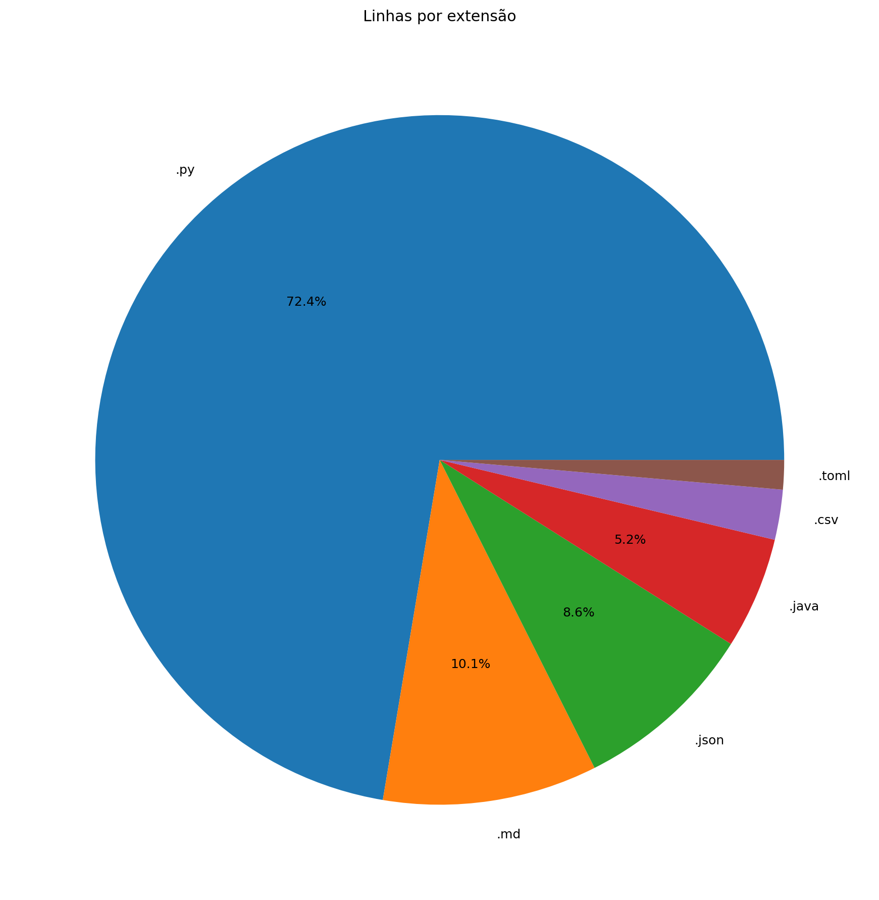

| Ext | Linhas |
|---:|---:|
| `.py` | 55.502 |
| `.md` | 7.742 |
| `.json` | 6.628 |
| `.java` | 4.033 |
| `.csv` | 1.804 |
| `.toml` | 1.060 |

## Peso por extensão

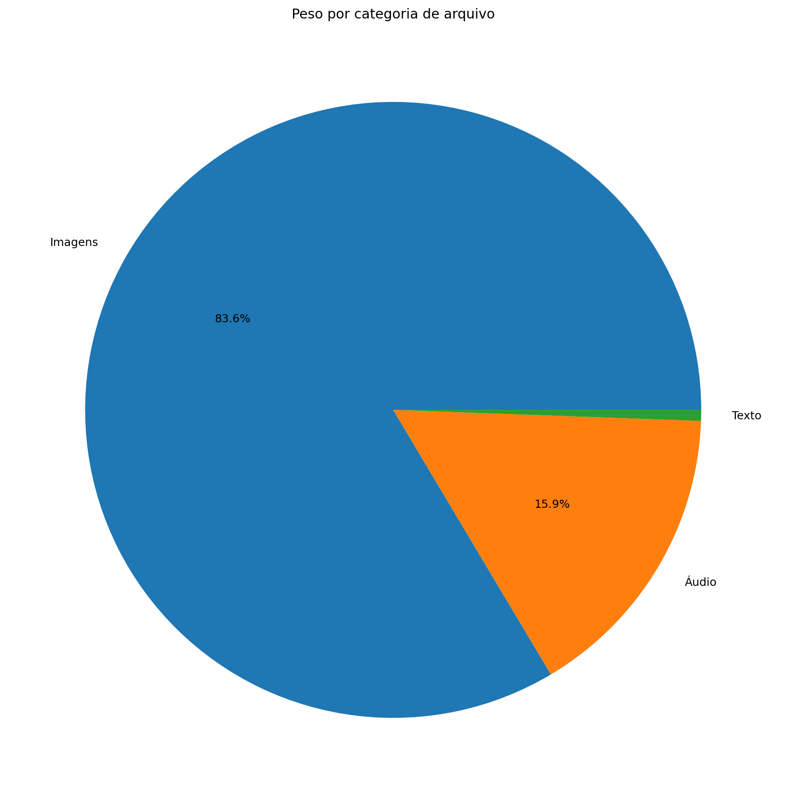

| Ext | Arquivos | Peso | % do jogo |
|---:|---:|---:|---:|
| `.png` | 71.816 | 496.75 MB | 82.95% |
| `.ogg` | 35 | 90.64 MB | 15.14% |
| `.wav` | 9 | 3.81 MB | 0.64% |
| `.jpg` | 23 | 3.61 MB | 0.60% |
| `.py` | 206 | 2.33 MB | 0.39% |
| `.mp3` | 5 | 636.73 KB | 0.10% |
| `.md` | 3 | 246.44 KB | 0.04% |
| `.ttf` | 2 | 196.64 KB | 0.03% |
| `.csv` | 9 | 186.54 KB | 0.03% |
| `.json` | 49 | 161.95 KB | 0.03% |
| `.java` | 7 | 152.40 KB | 0.02% |
| `.class` | 31 | 125.12 KB | 0.02% |
| `.toml` | 14 | 22.04 KB | 0.00% |
| `.frag` | 1 | 9.20 KB | 0.00% |
| `.vert` | 1 | 160 bytes | 0.00% |

## Comparativo com o último relatório

| Métrica | Relatório anterior | Relatório atual | Diferença |
|---|---:|---:|---:|
| Arquivos | 72.208 | 72.212 | +4 |
| Linhas | 74.082 | 76.788 | +2.706 |
| Linhas .py | 54.286 | 55.502 | +1.216 |
| Métodos/funções | 3.125 | 3.260 | +135 |
| Classes | 181 | 181 | 0 |
| Commits | 458 | 464 | +6 |
| Tamanho | 598.09 MB | 598.84 MB | +767.86 KB |

### Top 3 commits por tamanho de diff

| Rank | Commit | Mensagem | Arquivos | Adições | Reduções | Diff total |
|---:|---|---|---:|---:|---:|---:|
| 1 | `596364a1108c` | relatorio | 12 | 2.181 | 269 | 2.450 |
| 2 | `7eb060895040` | Novos Ataques | 25 | 1.794 | 51 | 1.845 |
| 3 | `35d5e61d55b7` | ajustes novos ataques | 45 | 1.271 | 378 | 1.649 |

## Gráficos de crescimento

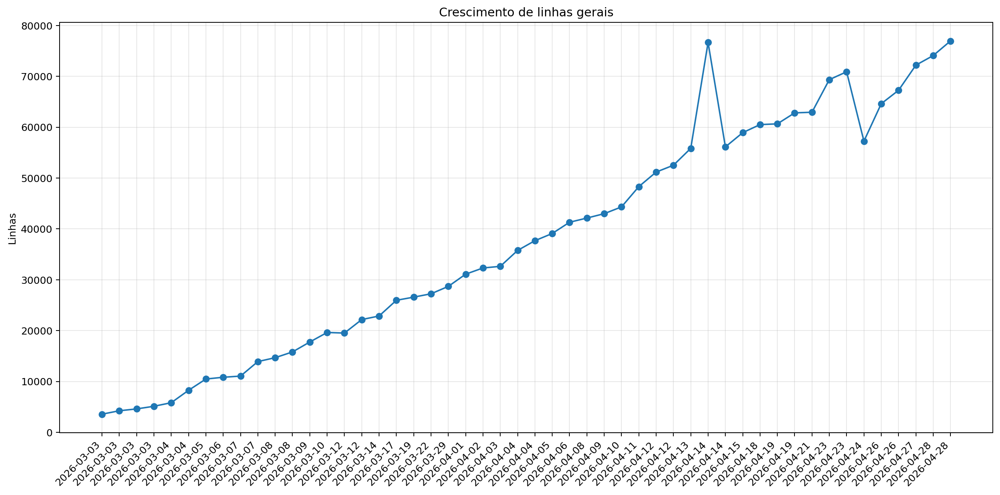

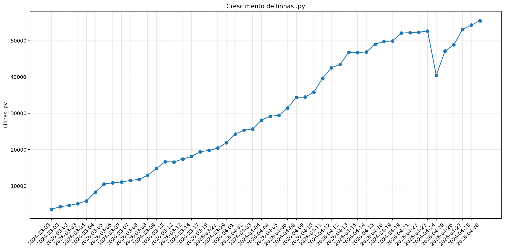

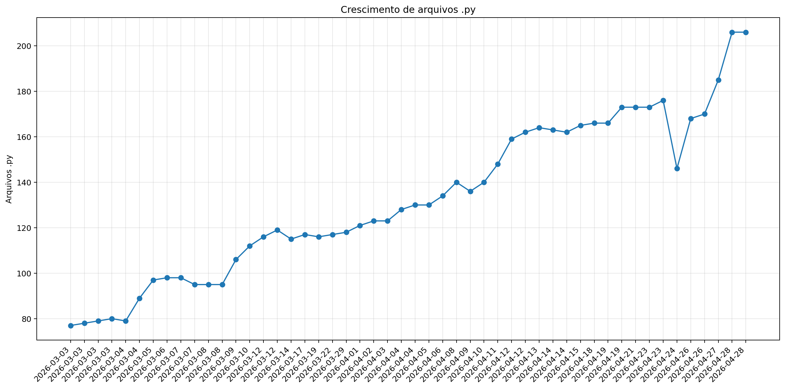

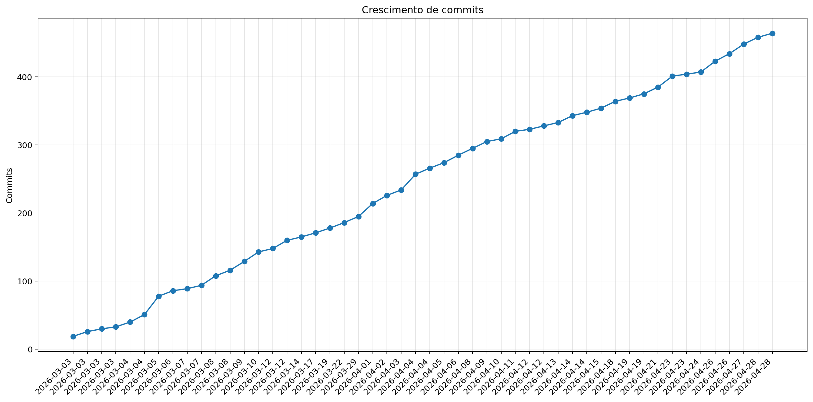

<!-- FIM_REGISTRO_MD -->

---

<div align="center">

**Pokémon Global Server**  
Projeto em desenvolvimento contínuo.

</div>
